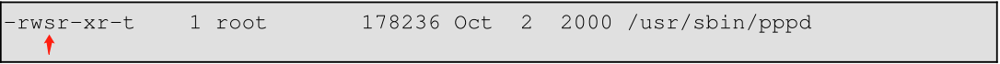

<center> <font face="黑体" size=7 color=grey>Chapter7.bash测试test详解</center>

<center><font face="黑体" size=4 color=grey> </center>

# 概述

- 任何相对完整的计算机语言都能够测试某个条件，然后根据测试的结果采取不同的动作。对于测试条件，Bash使用test命令、各种方括号和圆括号、if/then结构等来测试条件。

## 7.1. Test Constructs

- 一个if/then语句结构测试一个或多个命令的退出状态是否为0(因为在unix系统中0表示'执行成功')，如果为0，就执行语句后面的命令。

- Bash中有个专用的命令叫[(左中括号，bash特殊字符之一)。它是内置命令test别名，同时也是不是bash的内置命令，这样做可以提升bash的效率。
&emsp;&emsp;该命令视其接受的参数为比较表达式或文件测试(测试文件是否存在、文件类型、文件权限等)并且返回一个对应于比较结果的退出状态
&emsp;&emsp;(如果比较或测试结果为真则返回0，否则返回1)。

- 在bash2.02版本中，bash新增了\[[ ... ]]叫扩展的test测试命令，其进行比较时更贴合其他编程语言的风格。需要注意的是\[[是一个bash关键字而非命令。
&emsp;&emsp;bash视\[[ $a -lt \$b ]]为单个元素，返回一个退出状态。

```bash
[root@centos8 ~]#type [[
[[ is a shell keyword
[root@centos8 ~]#type [
[ is a shell builtin
[root@centos8 ~]#type test
test is a shell builtin
[root@centos8 ~]#which [
/usr/bin/[
[root@centos8 ~]#which test
/usr/bin/test

[root@centos8 ~]#a=3
[root@centos8 ~]#b=4
[root@centos8 ~]#[[ $a -lt $b ]]
[root@centos8 ~]#echo $?
0
[root@centos8 ~]#a=5
[root@centos8 ~]#[[ $a -lt $b ]]
[root@centos8 ~]#echo $?
1
```

- '(( ... ))' 和 'let ...' 结构用来进行简单的数学运算，也会返回一个退出状态，退出状态决定于其里面的算术表达式展开后的结果是否是非0值。这些算术运算展开结构可能会被用来进行算术比较。

```bash
(( 0 && 1 ))                 # 逻辑与
echo $?     # 1     ***
# And so ...
let "num = (( 0 && 1 ))"
echo $num   # 0
# But ...
let "num = (( 0 && 1 ))"
echo $?     # 1     ***
(( 200 || 11 ))              # 逻辑或
echo $?     # 0     ***
# ...
let "num = (( 200 || 11 ))"
echo $num   # 1
let "num = (( 200 || 11 ))"
echo $?     # 0     ***
(( 200 | 11 ))               # 逐位或
echo $?                      # 0     ***
# ...
let "num = (( 200 | 11 ))"
echo $num                    # 203
let "num = (( 200 | 11 ))"
echo $?                      # 0     ***
# "let" 结构和双圆括号的返回状态相同。
```

- 注意：某个算术表达式的退出状态不是该算术表达式计算错误的值。

```bash
var=-2 && (( var+=2 ))   # 此处算术表达式值为0，退出状态为1
echo $?                   # 1
var=-2 && (( var+=2 )) && echo $var     # 此处由于算术表达式为0，退出状态为1；bash认为非0的退出状态是命令未执行成功，导致$$后面的echo命令不在执行
                          # Will not echo $var!
```

- if不仅仅可以测试中括号中的条件，还可以测试任何命令

```bash
if cmp a b &> /dev/null  # 压缩标准输出和错误输出.
then echo "Files a and b are identical."
else echo "Files a and b differ."
fi
# The very useful "if-grep" construct:
# ----------------------------------- 
if grep -q Bash file
  then echo "File contains at least one occurrence of Bash."
fi
word=Linux
letter_sequence=inu
if echo "$word" | grep -q "$letter_sequence"
# The "-q" option to grep suppresses output.
then
  echo "$letter_sequence found in $word"
else
  echo "$letter_sequence not found in $word"
fi
if COMMAND_WHOSE_EXIT_STATUS_IS_0_UNLESS_ERROR_OCCURRED
  then echo "Command succeeded."
  else echo "Command failed."
fi
```

> 例7-1. 什么才是真?

```bash
#!/bin/bash
#  Tip:
#  如果你不确定某个条件的结果，那最好在if测试结构中测试其。
echo
echo "Testing \"0\""
if [ 0 ]      # zero
then
  echo "0 is true."
else          # Or else ...
  echo "0 is false."
fi            # 0 为真.
echo
echo "Testing \"1\""
if [ 1 ]      # one
then
  echo "1 is true."
else
  echo "1 is false."
fi            # 1 为真.
echo
echo "Testing \"-1\""
if [ -1 ]     # -1
then
  echo "-1 is true."
else
  echo "-1 is false."
fi            # -1 为真.
echo
echo "Testing \"NULL\""
if [ ]        # NULL (空条件)
then
  echo "NULL is true."
else
  echo "NULL is false."
fi            # NULL 空位假。
echo
echo "Testing \"xyz\""
if [ xyz ]    # 随机字符串
then
  echo "Random string is true."
else
  echo "Random string is false."
fi            # 随机字符串为真.
echo
echo "Testing \"\$xyz\""
if [ $xyz ]   # 测试变量$xyz是否为空, 但是...
              # $xyz只是一个未初始化的变量.
then
  echo "Uninitialized variable is true."
else
  echo "Uninitialized variable is false."
fi            # 未初始化的字符串为假.
echo
echo "Testing \"-n \$xyz\""
if [ -n "$xyz" ]            # 有点卖弄学问的做法.
then
  echo "Uninitialized variable is true."
else
  echo "Uninitialized variable is false."
fi            # 同样未初始化的字符串为假.
echo
xyz=          # 初始化了,但是值为空.
echo "Testing \"-n \$xyz\""
if [ -n "$xyz" ]
then
  echo "Null variable is true."
else
  echo "Null variable is false."
fi            # 空变量为假.
echo
# 什么时候'假'为真呢？(When is "false" true?)
echo "Testing \"false\""
if [ "false" ]              # 此处 "false" 只是一个字符串而已...
then
  echo "\"false\" is true." #+ 结果为真啦啦啦.
else
  echo "\"false\" is false."
fi            # 这时候'假'为真.
echo
echo "Testing \"\$false\""  # 再次测试'假',此时的'假'为未初始化的变量.
if [ "$false" ]
then
  echo "\"\$false\" is true."
else
  echo "\"\$false\" is false."
fi            # 此时测试结构为假.
#  What would happen if we tested the uninitialized variable "$true"?
echo
exit 0
```

```bash
if [ condition-true ]
then
   command 1
   command 2
   ...
else  # 或者Or else ...
      # 在下面写测试条件为假时的代码.
   command 3
   command 4
   ...
fi
```

- 条件测试结构中当if和then在同一行时，必须使用分号结束if语句。if和then都为bash关键字。
&emsp;&emsp;关键字(或者命令)所开始的语句，必须在同一行的下一个语句前使用分号结束。

```bash
if [ -x "$filename" ]; then
```

- Else if and elif
- elif 是 else if 的简写.用来实现嵌套语句.

```bash
if [ condition1 ]
then
   command1
   command2
   command3
elif [ condition2 ]
# Same as else if
then
   command4
   command5
else
   default-command
fi
```

- 结构'if test condition-true'和结构'if [ condition-true ]'完全等价。当使用后者时，左中括号'['会调用test命令。
  所以右中括号在if/test结构中不是严格需要的，然而新版本的bash要求必须跟上。
- 特别指出：test命令时bash内置命令。其用来测试文件类型和比较字符串。因此，
  在bash脚本中test命令不会调用外部二进制命令/usr/bin/test，此时的test命令是sh-utils包的一部分。

```bash
bash$ type test
test is a shell builtin
bash$ type '['
[ is a shell builtin
bash$ type '[['
[[ is a shell keyword
bash$ type ']]'
]] is a shell keyword
bash$ type ']'
bash: type: ]: not found
```

- 如果由于某些原因，你希望在脚本中使用/usr/bin/test，那可以使用完整的路径名指明.

> 例7-2.test,/usr/bin/test,[ ],和/usr/bin/[

```bash
#!/bin/bash
echo
if test -z "$1"
then
  echo "No command-line arguments."
else
  echo "First command-line argument is $1."
  fi
echo
if /usr/bin/test -z "$1"      # 和内置命令"test"等价.
#  ^^^^^^^^^^^^^              # 指明了完整的路径.
then
  echo "No command-line arguments."
else
  echo "First command-line argument is $1."
fi
echo
if [ -z "$1" ]                # 和上面的代码块功能相同.
#   if [ -z "$1"              # 该代码应该可以正常工作，但是...
#+  Bash说后面的右中括号必须带，哎.
then
  echo "No command-line arguments."
else
  echo "First command-line argument is $1."
fi
echo
if /usr/bin/[ -z "$1" ]       # 和上面的代码块功能相同.
then
  echo "No command-line arguments."
else
  echo "First command-line argument is $1."
fi
echo
exit 0
```

- 相比'[ ]'，'[\[ ]]'测试结构更加健壮。则是扩展的test命令，从ksh88版本中借鉴而来。
- 在'[\[ ]]' 结构中不允许文件名展开或者单词分割，但是允许参数展开和命令替换。

```bash
file=/etc/passwd
if [[ -e $file ]]
then
  echo "Password file exists."
fi
```

- 使用'[\[ ... ]]'测试结构，而不使用'[ ... ]'可以避免脚本中很多逻辑错误。
  比如：`&&,||,<,>操作符`在'[\[ ]]'结构中适用，但是在'[ ]'结构中报错。
- 对于八进制/十六进制的算术运算在'[\[ ]]'结构中亦支持。

```bash
# [[ 八进制/十六进制运算 ]]
# Thank you, Moritz Gronbach, for pointing this out.
decimal=15
octal=017   # = 15 (decimal)
hex=0x0f    # = 15 (decimal)
if [ "$decimal" -eq "$octal" ]
then
  echo "$decimal equals $octal"
else
  echo "$decimal is not equal to $octal"       # 结果是15不等于017
fi      # 在单中括号结构中不计算 [ single brackets ]!
if [[ "$decimal" -eq "$octal" ]]
then
  echo "$decimal equals $octal"                # 15 等于 017
else
  echo "$decimal is not equal to $octal"
fi      # 双中括号中计算 [[ double brackets ]]!
if [[ "$decimal" -eq "$hex" ]]
then
  echo "$decimal equals $hex"                  # 15 等于 0x0f
else
  echo "$decimal is not equal to $hex"
fi      # [[ $hexadecimal ]] 单独引用一个十六进制数，也会自动计算为十进制!
```

- 在if后，要么test命令要么测试中括号都是必须存在的([] [\[ ]])。

```bash
dir=/home/bozo
if cd "$dir" 2>/dev/null; then   # "2>/dev/null"将会重定向标准错误.
  echo "Now in $dir."
else
  echo "Can't change to $dir."
fi
```

- 如上面例子，"if 命令"结构会返回命令的退出状态。
- 同样，下面在多个结构的组合用法中，一个处于中括号内的测试条件可以不需要if。

```bash
var1=20
var2=22
[ "$var1" -ne "$var2" ] && echo "$var1 is not equal to $var2"
home=/home/bozo
[ -d "$home" ] || echo "$home directory does not exist."
```

- 双圆括号结构(( ))展开并计算数学运算表达式。如果表达式运算结果为0，则其返回一个为1的退出状态，或者假"false"。一个非0的计算值则返回一个退出状态0，或者真"true"。

> 例7-3.使用(( ))结构测试算术运算结果

```bash
#!/bin/bash
# arith-tests.sh
# Arithmetic tests.
# (( ... ))结构计算并测试数学运算表达
# (( ... ))结构对于数学运算表达式的测试结果退出状态与[ ... ]结构相反!
# (( ... ))结构中运算结果非0为真，运算结果为0时退出状态为假。
(( 0 ))
echo "Exit status of \"(( 0 ))\" is $?."         # 1
(( 1 ))
echo "Exit status of \"(( 1 ))\" is $?."         # 0
(( 5 > 4 ))                                      # true
echo "Exit status of \"(( 5 > 4 ))\" is $?."     # 0
(( 5 > 9 ))                                      # false
echo "Exit status of \"(( 5 > 9 ))\" is $?."     # 1
(( 5 == 5 ))                                     # true
echo "Exit status of \"(( 5 == 5 ))\" is $?."    # 0
# (( 5 = 5 ))  gives an error message.
(( 5 - 5 ))                                      # 0
echo "Exit status of \"(( 5 - 5 ))\" is $?."     # 1
(( 5 / 4 ))                                      # Division o.k.
echo "Exit status of \"(( 5 / 4 ))\" is $?."     # 0
(( 1 / 2 ))                                      # 除法结果小于1.
echo "Exit status of \"(( 1 / 2 ))\" is $?."     # 小于1的结果被圆整为0.
                                                 # 1
(( 1 / 0 )) 2>/dev/null                          # 使用0作为除数非法.
#           ^^^^^^^^^^^
echo "Exit status of \"(( 1 / 0 ))\" is $?."     # 1
# ======================================= #
# (( ... )) 该结构也常常被用在 if-then 测试结构中.
var1=5
var2=4
if (( var1 > var2 ))
then #^      ^      Note: Not $var1, $var2. Why?
  echo "$var1 is greater than $var2"
fi     # 5 is greater than 4
exit 0
```

## 7.2. 文件测试操作(File test operators)

- if [ ... ] 如果测试条件...为真则返回退出状态值0

-e 测试文件是否存在
-a 同上,已经被弃用，不推荐使用
-f 测试文件是否为普通文件(不是文件夹或者设备文件)
-s 测试文件是否非空(大小不是0)
-d 测试文件是否是一个文件夹
-b 测试文件是否是一个块设备
-c 测试文件是否是一个字符设备

```bash
device0="/dev/sda2"
if [ -b "$device0" ]
then
  echo "$device0 is a block device."
fi
# /dev/sda2 是一个块设备.

device1="/dev/ttyS1"  
if [ -c "$device1" ]
then
  echo "$device1 is a character device."
fi
# /dev/ttyS1 是一个字符设备.
```

-p 测试文件是否为管道文件.

```bash
function show_input_type()
{
   [ -p /dev/fd/0 ] && echo PIPE || echo STDIN    # 此处/dev/fd/0表示标准输出
}
show_input_type "Input"                           # STDIN 标准输入
echo "Input" | show_input_type                    # PIPE  管道
```

-h 测试文件是否是一个符号链接
-L 测试文件是否是一个符号
-S 测试文件是否是一个socket文
-t 测试文件(或者文件描述符)是否与某个终端关联
&emsp;&emsp;该测试可以测试脚本中的标准输入[ -t 0 ]或者标准输出[ -t 1 ]是否是一个终端。
-r 运行本测试的用户是否对文件有读权限
-w 写权限
-x 执行权限
-g 文件或者文件夹是否设置SGID标志位
&emsp;&emsp;如果某个文件或者文件夹上设置有SGID权限，那么在该文件夹下创建的文件属主为该文件夹的属主。
-u 文件或者文件夹是否设置suid
&emsp;&emsp;如果某个属于root的二进制文件上被root设置了SUID标志位，则不管是谁运行，该可执行文件都以root权限运行；
&emsp;&emsp;单某个可执行文件必须要访问系统硬件时此功能非常有用。如果缺失SUID标志位，这些二进制文件不能被非root用户运行。



&emsp;&emsp;如上图：有SUID标志位的文件权限模式的执行权限位标识为s而不再是x(rwx --> rws).

-k 测试sticky位是否设置
&emsp;&emsp;如果一个文件设置了sticky位，那么该问价会被保存在cache内便于访问
&emsp;&emsp;如果某个文件夹被设置了sticky位，那么该文件夹的写权限将会被限制。
&emsp;&emsp;设置sticky位后，其他用户的执行权限模式不在表现为x而是t(rwx --> rwt)

&emsp;&emsp;也就是说：如果一个用户对某个设置有sticky位的目录有读权限但不是该目录的属主，那么他只能删除该目录下其拥有
&emsp;&emsp;的文件。这样做可以防止用户在公共文件夹意外删除别人的文件,例如/tmp文件夹。(当然，root用户是可以删除和更改的)
-O 测试自己是否是文件属主
-G 测试文件的GID是否和自己相同
-N 测试文件自最后一次读以来是否被修改过
f1 -nt f2 测试文件f1是否是比f2新
f1 -ot f2 测试文件f1是否是比f2旧
f1 -ef f2 测试文件f1和f2是否都是同一个文件的硬链接
! 对上面所列的条件取反。(如果条件为空，返回真,如下面例子)

```bash
[root@centos8 ~]#if [[ ！ ]]; then echo true; fi
true
```

> 例7-4. 测试失效的链接(Testing for broken links)

```bash
#!/bin/bash
# broken-link.sh
# Written by Lee bigelow <ligelowbee@yahoo.com>
# Used in ABS Guide with permission.
#  该脚本找出失效的符号链接并引用后输出。以便于给xargs处理。
#+ 例如. sh broken-link.sh /somedir /someotherdir|xargs rm
#  只不过更加推荐下面的方法：
#  find "somedir" -type l -print0|\
#  xargs -r0 file|\
#  grep "broken symbolic"|
#  sed -e 's/^\|: *broken symbolic.*$/"/g'
#
#  注意: 谨慎对待 /proc 文件系统和任何循环链接
################################################################
#  下面的语句表示如果没有指定目录参数传给脚本就将路径设置为当前的工作
#  目录。否则使用指定的目录参数进行搜索。
######################
[ $# -eq 0 ] && directorys=`pwd` || directorys=$@

#  下面的函数检查传给脚本的目录中为符号链接并且不存在的文件，检查到后引用起来并打印。
#  如果是目录中的子目录，则将该目录再次传给函数检查。
##########
linkchk () {
    for element in $1/*; do
      [ -h "$element" -a ! -e "$element" ] && echo \"$element\"
      [ -d "$element" ] && linkchk $element
    # Of course, '-h' tests for symbolic link, '-d' for directory.
    done
}

#  下面将每个传给脚本的合法目录参数传给linkchk()函数，如果不是合法目录，则打印错误信息和用法。
##################
for directory in $directorys; do
    if [ -d $directory ]
        then linkchk $directory
        else 
            echo "$directory is not a directory"
            echo "Usage: $0 dir1 dir2 ..."
    fi
done
exit $?
```

## 7.3. 其它的比较操作

- 一个二进制比较操作符号比较两个变量或者比较数量。整数或者字符串的比较使用特定的符号集合。

- 整数比较

```bash
-eq 是否相等
if [ "$a" -eq "$b" ]

-ne 是否不等
if [ "$a" -ne "$b" ]

-gt $a是否大于$b
if [ "$a" -gt "$b" ]

-ge $a是否大于或等于$b
if [ "$a" -ge "$b" ]

-lt $a是否小于$b
if [ "$a" -lt "$b" ]

-le $a是否小于或等于$b
if [ "$a" -le "$b" ]

< 小于(必须在双圆括号结构中)
 (("$a" < "$b"))
 
<= 小于或等于(必须在双圆括号结构中)
(("$a" <= "$b"))

> 大于(必须在双圆括号结构中)
(("$a" > "$b"))

>= 大于或等于(必须在双圆括号结构中)
(("$a" >= "$b"))
```

- 字符串比较

```bash
= is equal to
if [ "$a" = "$b" ]
Note the whitespace framing the =.
if [ "$a"="$b" ] is not equivalent to the above.
== is equal to
if [ "$a" == "$b" ]
This is a synonym for =.
```

- The == comparison operator behaves differently within a double-brackets test than
within single brackets.

```bash
[[ $a == z* ]]   # True if $a starts with an "z" (pattern matching).
[[ $a == "z*" ]] # True if $a is equal to z* (literal matching).
[ $a == z* ]     # File globbing and word splitting take place.
[ "$a" == "z*" ] # True if $a is equal to z* (literal matching).
# Thanks, Stéphane Chazelas
```

```bash
!= is not equal to
if [ "$a" != "$b" ]
This operator uses pattern matching within a [[ ... ]] construct.
< is less than, in ASCII alphabetical order
if [[ "$a" < "$b" ]]
if [ "$a" \< "$b" ]
Note that the "<" needs to be escaped within a [ ] construct.
> is greater than, in ASCII alphabetical order
if [[ "$a" > "$b" ]]
if [ "$a" \> "$b" ]
```

- Note that the ">" needs to be escaped within a [ ] construct.
See Example 27-11 for an application of this comparison operator.

-z string is null, that is, has zero length

```bash
String=''   # Zero-length ("null") string variable.
if [ -z "$String" ]
then
  echo "\$String is null."
else
  echo "\$String is NOT null."
fi     # $String is null.
```

-n string is not null.

- The -n test requires that the string be quoted within the test brackets. Using an
unquoted string with ! -z, or even just the unquoted string alone within test brackets
(see Example 7-6) normally works, however, this is an unsafe practice. Always quote a
tested string. [

> Example 7-5. Arithmetic and string comparisons

```bash
#!/bin/bash
a=4
b=5
#  Here "a" and "b" can be treated either as integers or strings.
#  There is some blurring between the arithmetic and string comparisons,
#+ since Bash variables are not strongly typed.
#  Bash permits integer operations and comparisons on variables
#+ whose value consists of all-integer characters.
#  Caution advised, however.
echo
if [ "$a" -ne "$b" ]
then
  echo "$a is not equal to $b"
  echo "(arithmetic comparison)"
fi
echo
if [ "$a" != "$b" ]
then
  echo "$a is not equal to $b."
  echo "(string comparison)"
  #     "4"  != "5"
  # ASCII 52 != ASCII 53
fi
# In this particular instance, both "-ne" and "!=" work.
echo
exit 0
```

> Example 7-6. Testing whether a string is null

```bash
#!/bin/bash
#  str-test.sh: Testing null strings and unquoted strings,
#+ but not strings and sealing wax, not to mention cabbages and kings . . .
# Using   if [ ... ]
# If a string has not been initialized, it has no defined value.
# This state is called "null" (not the same as zero!).
if [ -n $string1 ]    # string1 has not been declared or initialized.
then
  echo "String \"string1\" is not null."
else  
  echo "String \"string1\" is null."
fi                    # Wrong result.
# Shows $string1 as not null, although it was not initialized.
echo
# Let's try it again.
if [ -n "$string1" ]  # This time, $string1 is quoted.
then
  echo "String \"string1\" is not null."
else  
  echo "String \"string1\" is null."
fi                    # Quote strings within test brackets!
echo
if [ $string1 ]       # This time, $string1 stands naked.
then
  echo "String \"string1\" is not null."
else  
  echo "String \"string1\" is null."
fi                    # This works fine.
# The [ ... ] test operator alone detects whether the string is null.
# However it is good practice to quote it (if [ "$string1" ]).
#
# As Stephane Chazelas points out,
#    if [ $string1 ]    has one argument, "]"
#    if [ "$string1" ]  has two arguments, the empty "$string1" and "]" 
echo
string1=initialized
if [ $string1 ]       # Again, $string1 stands unquoted.
then
  echo "String \"string1\" is not null."
else  
  echo "String \"string1\" is null."
fi                    # Again, gives correct result.
# Still, it is better to quote it ("$string1"), because . . .
string1="a = b"
if [ $string1 ]       # Again, $string1 stands unquoted.
then
  echo "String \"string1\" is not null."
else  
  echo "String \"string1\" is null."
fi                    # Not quoting "$string1" now gives wrong result!
exit 0   # Thank you, also, Florian Wisser, for the "heads-up".
```

> Example 7-7. zmore

```bash
#!/bin/bash
# zmore
# View gzipped files with 'more' filter.
E_NOARGS=85
E_NOTFOUND=86
E_NOTGZIP=87
if [ $# -eq 0 ] # same effect as:  if [ -z "$1" ]
# $1 can exist, but be empty:  zmore "" arg2 arg3
then
  echo "Usage: `basename $0` filename" >&2
  # Error message to stderr.
  exit $E_NOARGS
  # Returns 85 as exit status of script (error code).
fi  
filename=$1
if [ ! -f "$filename" ]   # Quoting $filename allows for possible spaces.
then
  echo "File $filename not found!" >&2   # Error message to stderr.
  exit $E_NOTFOUND
fi  
if [ ${filename##*.} != "gz" ]
# Using bracket in variable substitution.
then
  echo "File $1 is not a gzipped file!"
  exit $E_NOTGZIP
fi  
zcat $1 | more
# Uses the 'more' filter.
# May substitute 'less' if desired.
exit $?   # Script returns exit status of pipe.
#  Actually "exit $?" is unnecessary, as the script will, in any case,
#+ return the exit status of the last command executed.
```
- compound comparison

-a
logical and
exp1 -a exp2 returns true if both exp1 and exp2 are true.
-o
logical or
exp1 -o exp2 returns true if either exp1 or exp2 is true.

- These are similar to the Bash comparison operators && and ||, used within double brackets.
```bash
[[ condition1 && condition2 ]]
```
- The -o and -a operators work with the test command or occur within single test brackets.
```bash
if [ "$expr1" -a "$expr2" ]
then
  echo "Both expr1 and expr2 are true."
else
  echo "Either expr1 or expr2 is false."
fi
```

- But, as rihad points out:
```bash
[ 1 -eq 1 ] && [ -n "ècho true 1>&2`" ]   # true
[ 1 -eq 2 ] && [ -n "ècho true 1>&2`" ]   # (no output)
# ^^^^^^^ False condition. So far, everything as expected.
# However ...
[ 1 -eq 2 -a -n "ècho true 1>&2`" ]       # true
# ^^^^^^^ False condition. So, why "true" output?
# Is it because both condition clauses within brackets evaluate?
[[ 1 -eq 2 && -n "ècho true 1>&2`" ]]     # (no output)
# No, that's not it.
# Apparently && and || "short-circuit" while -a and -o do not.
```

## 7.4. Nested if/then Condition Tests

- Condition tests using the if/then construct may be nested. The net result is equivalent to using the &&
compound comparison operator.

```bash
a=3
if [ "$a" -gt 0 ]
then
  if [ "$a" -lt 5 ]
  then
    echo "The value of \"a\" lies somewhere between 0 and 5."
  fi
fi
# Same result as:
if [ "$a" -gt 0 ] && [ "$a" -lt 5 ]
then
  echo "The value of \"a\" lies somewhere between 0 and 5."
fi
```

## 7.5. Testing Your Knowledge of Tests

- The systemwide xinitrc file can be used to launch the X server. This file contains quite a number of if/then
tests. The following is excerpted from an "ancient" version of xinitrc (Red Hat 7.1, or thereabouts).

```bash
if [ -f $HOME/.Xclients ]; then
  exec $HOME/.Xclients
elif [ -f /etc/X11/xinit/Xclients ]; then
  exec /etc/X11/xinit/Xclients
else
     # failsafe settings.  Although we should never get here
     # (we provide fallbacks in Xclients as well) it can't hurt.
     xclock -geometry 100x100-5+5 &
     xterm -geometry 80x50-50+150 &
     if [ -f /usr/bin/netscape -a -f /usr/share/doc/HTML/index.html ]; then
             netscape /usr/share/doc/HTML/index.html &
     fi
fi
```
- Explain the test constructs in the above snippet, then examine an updated version of the file,
/etc/X11/xinit/xinitrc, and analyze the if/then test constructs there. You may need to refer ahead to
the discussions of grep, sed, and regular expressions.

