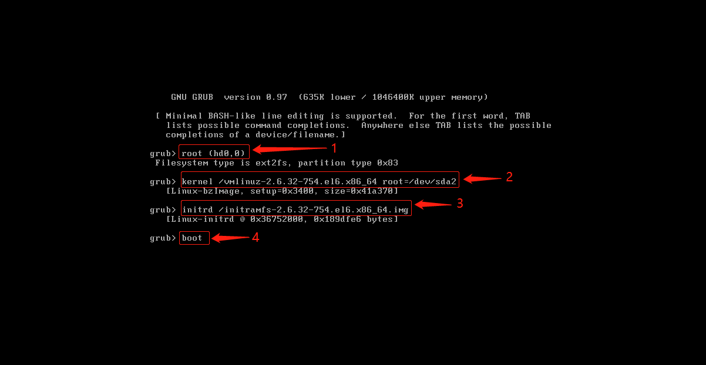
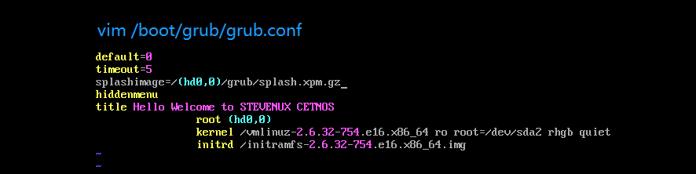

## :arrow_forward:实验：破坏centos6.1的/boot/grub/grub.cong文件，修复之

## :black_medium_square:开机现象

> 

### :one::备份/boot/grub/grub.cong引导配置文件，防止实验失败，打脸:see_no_evil:

`cp -a /boot/grub/grub.conf /data`

### :two::在grub的提示符指定启动的硬盘和内核及initramfs.img所在的分区，然后启动，这样可以临时进入系统，不是长久之计

> 1:指定启动硬盘为系统的第一个硬盘
> 2:指定启动使用的内核和根文件系统所在分区
> 3:指定initramfs.img文件，需要其提供的文件系统驱动来挂载根
> 4:启动

### :two:由于无法引导操作系统，只能使用centos6.1光盘:dvd:启动进入救援模式

### :three:由于第二步只是临时进入系统，所以还得手写一个grub.conf文件，只能使用centos6.1光盘:dvd:启动进入救援模式

### :four:切根:hocho:(滑稽)

> chroot /mnt/sysimage

### :five:编辑/boot/grub/grub.conf文件

### :six:保存退出vim,sync几下·

### :arrow_left:exit

### :repeat:reboot