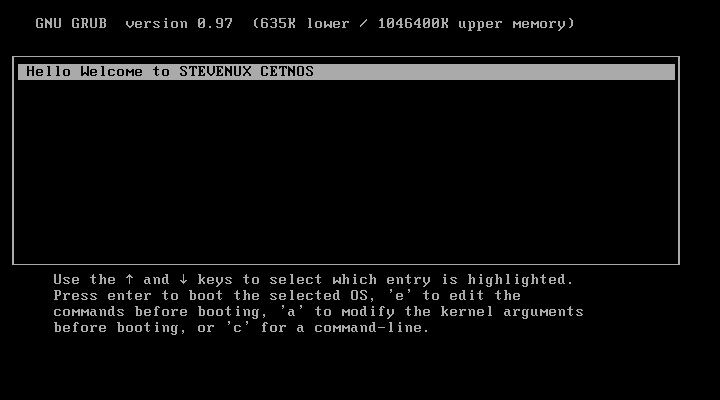

# :arrow_forward:实验：删除centos6.1的内核，恢复之

## :black_medium_square:开机现象

> 
:scream_cat::scream_cat::scream_cat::scream_cat::scream_cat::scream_cat::scream_cat::scream_cat::scream_cat::scream_cat::scream_cat::scream_cat::scream_cat::scream_cat::scream_cat::scream_cat::scream_cat::scream_cat::scream_cat::scream_cat::scream_cat::scream_cat::scream_cat::scream_cat::scream_cat::scream_cat::scream_cat::scream_cat::scream_cat::scream_cat:
> 
:joy_cat::joy_cat::joy_cat::joy_cat::joy_cat::joy_cat::joy_cat::joy_cat::joy_cat::joy_cat::joy_cat::joy_cat::joy_cat::joy_cat::joy_cat::joy_cat::joy_cat::joy_cat::joy_cat::joy_cat::joy_cat::joy_cat::joy_cat::joy_cat::joy_cat::joy_cat::joy_cat::joy_cat::joy_cat::joy_cat:
> 第一张图片中显示的内核为/boot/grub/grub.conf文件中定义的，实际上已经没有内核
> 按下enter键，发现无法找到文件，无法启动

## :one:备份一下内核文件

> cp -a /boot/vmlinuz-2.6.32-754.e16.x86_64 /data/

## :two:删除之

> rm -f /boot/vmlinuz-2.6.32-754.e16.x86_64

## :three:在鼠标被虚拟机捕捉的情况下按Ctrl+Alt+Ins键重启，在加载进度条的时候按下Esc进入bios选择光盘进入救援模式

## :four:切根

## :five:

```bash
mount /dev/sr0 /mnt
cp /mnt/Packages/kernel-2.6.32-754.e16.x86_64.rpm     /boot
rpm2cpio /boot/kernel-2.6.32-754.e16.x86_64.rpm | cpio -idum
cp /boot/boot/kernel-2.6.32-754.e16.x86_64.rpm /boot
```

## :arrow_left:exit

## :repeat:reboot

