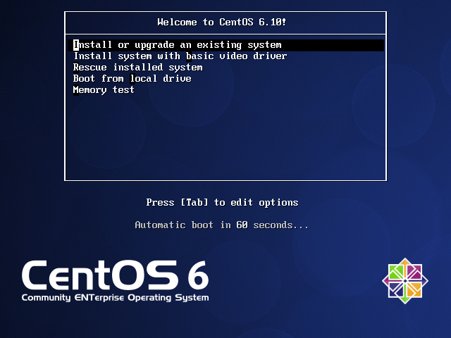

# :arrow_forward:实验：删除MBR，也就是系统所在硬盘的前446个字节，恢复之

## :black_medium_square:开机现象

> 
> 没有了MBR，直接进光盘引导

## :one:将前446字节内容清零

`dd if=/dev/zero of=/dev/sda bs=1 count=446`

## :two:重启，缺失bootloader，无法找到grub1_5和grub2阶段，直接进入了光盘引导界面(前提是光盘已经连接)

## :three:进入救援模式

## :four:切根

`chroot /mnt/sysimage`

## :five:使用grub-install命令安装grub1阶段(bootloader)

`grub-install /dev/sda`

## :six:同步一下，确保变更已经写入磁盘
`sync`

## :arrow_left:exit

## :repeat:reboot

> 备份MBR使用:dd if=/dev/sda of=/data/mbr.bak bs=1 count=446