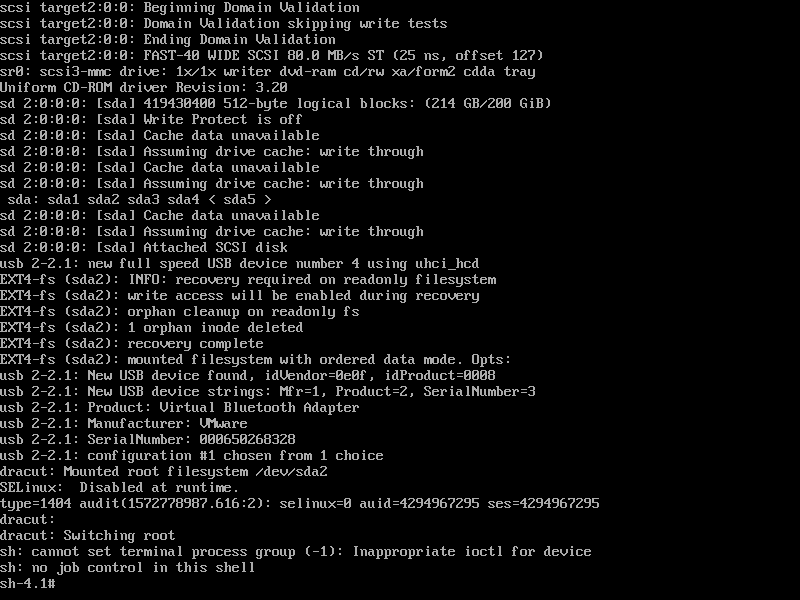

# :arrow_forward:实验：删除centos6.1的/sbin/init文件，恢复之

## :black_medium_square:开机现象

> 
> 直接进入一个bash界面，并且键盘无法输入

## :one:删除/sbin/init

`rm /sbin/init`

## :two:连接光盘，进入救援模式

## :three:切根

`chroot /mnt/sysimage`

## :four:从光盘Packages目录拷贝upstart包到/home

`cp /mnt/Packages/upstart-0.6.5-17.e16.x86_64.rpm /home`

## :five:使用rpm2cpio工具解开rpm包

`rpm2cpio /home/upstart-0.6.5-17.e16.x86_64.rpm | cpio -idum`

## :six:解压后在/home文件夹下生成/sbin文件夹，将其中的init拷贝到/sbin/下即可

`cp /home/sbin/init /sbin`

## :arrow_left:exit

## :repeat:reboot

