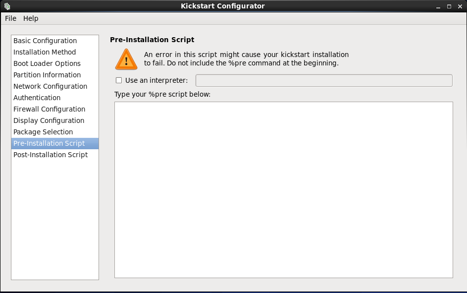
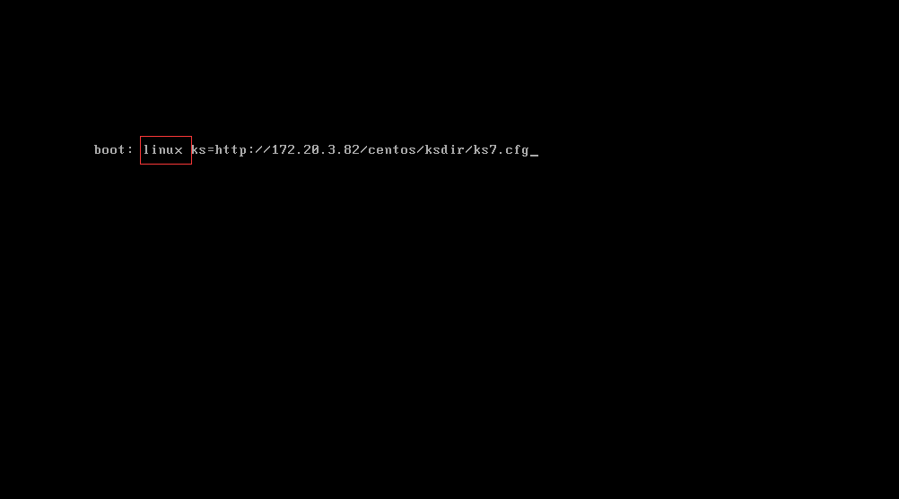

<center><font face="黑体" size="6" color="grey">使用kickstart和anaconda自动化安装centos系统</font></center>

# 实验:使用kickstart和anaconda自动化安装centos系统

## anaconda 介绍

## kickstart 介绍

## 实验过程

### 前提

```py
1.已经安装好至少两台centos系统
2.需要实现自动安装的系统的光盘镜像
3.已安装的系统之间可以通讯(比如处于VMware中的NAT网络的同一个网段)
```

### 1.搭建httpd服务来提供系统安装源

- 以后需要给某台主机安装系统就直接通过网络从此服务器得到安装的系统和安装方式(ks.cfg提供安装指导)

- 本次实验使用centos7作为安装源服务器
- 该系统地址:172.20.3.82;使用VMware桥接网络
- 安装httpd

```py
rpm -q httpd
yum install httpd
systemctl enable httpd
systemctl start httpd
systemctl status httpd
curl 172.20.3.82   # 返回html文本则httpd服务已经ok
```

- httpd默认服务文件夹
`/var/www/html`

- 在默认服务文件夹下新建一个文件夹来放安装源,分别创建属于centos6/7/8的文件夹
`mkdir -p /var/www/html/centos/{6,7,8}/os/x86_64`

- 挂载需要安装的光盘镜像到目录
centos6:`mount /dev/sr0 /var/www/html/centos/6/os/x86_64`
centos7:`mount /misc/cd /var/www/html/centos/7/os/x86_64`
centos8:`mount /misc/cd /var/www/html/centos/8/os/x86_64`  

- 实验使用如下镜像


- 在httpd默认服务目录新建文件夹存放kickstart文件
`mkdir -p /var/www/html/centos/ksdir`

### 2.使用相应的工具生成kickstart文件

- centos6
  - 在centos6可以使用system-config-kickstart工具在图形界面下完成配置并保存为ks.cfg文件
  - Basic Configuration:基本设置，包括默认安装语言，键盘类型，时区和root密码设置等。


  - Installation Method:安装方式，本次使用全新安装，通过http安装；http服务器
  就是第一步中的centos7，地址为:172.20.3.82;httpd服务的默认服务文件夹为
  `/var/www/html`,此处HTTP Directory:/centos/6/os/x86_64就指明了位于默认服务文件夹
  的安装源,需要安装不同的版本就更改路径的相应版本号(/centos/6/os/x86_64---->安装centos6；/centos/7/os/x86_64---->安装centos7等)
  

  - Boot Loader Options:引导加载器选项，此次安装使用默认设置，也不加密GRUB


  - Partition Information:分区信息:1.清除需要安装系统的主机硬盘的MBR；2.清除所有分区；3.初始化磁盘标签


  - Network Configuration:网络设置


  - Authentication:认证相关设置--默认


  - Firewall Configuration:防火墙和selinux设置,都禁用


  - Display Configuration:显示设置--使用默认设置
  
  - Package Selection:需要安装的包选择


  - Pre-Installation Script:定义系统安装前运行的脚本,此脚本出错可能会导致kickstart安装失败，一定不要有`%pre`字眼出现在该脚本中,此次就不定义该脚本了


  - Post-Installation Script:定义系统安装完成后运行的脚本,此处新增一个用户，并改密码


  - 保存为ks.cfg
  

  - `mv /root/Desktop/ks.cfg /root/Desktop/ks6.cfg`
  - 生成的ks6.cfg 文件如下：

```py
#platform=x86, AMD64, or Intel EM64T
#version=DEVEL
# Firewall configuration
firewall --disabled
# Install OS instead of upgrade
install
# Use network installation
url --url="http://172.20.3.82/centos/6/os/x86_64"
# Root password
rootpw --iscrypted $1$5xUPBe9B$xxjgPTHBELXz3gFnh1CnG1
# System authorization information
auth  --useshadow  --passalgo=sha512
# Use graphical install
graphical
firstboot --disable
# System keyboard
keyboard us
# System language
lang en_US
# SELinux configuration
selinux --disabled
# Installation logging level
logging --level=info

# System timezone
timezone  Africa/Abidjan
# Network information
network  --bootproto=static --device=eth0 --gateway=172.20.3.1 --ip=172.20.3.112 --nameserver=144.144.144.144 --netmask=255.255.255.0 --onboot=on
# System bootloader configuration
bootloader --location=mbr
# Clear the Master Boot Record
zerombr
# Partition clearing information
clearpart --all --initlabel 
# Disk partitioning information
part / --fstype="ext4" --size=10240
part /boot --fstype="ext4" --size=1024
part /data --fstype="ext4" --noformat --size=10240

%post
useradd stevenux 
echo 123456 | passwd --stdin stevenux
%end
```

- centos7
  - 在centos7可以使用新安装的系统root家目录的anaconda-ks.cfg文件作为参考来制作自己的ks.cfg文件
  - anaconda-ks.cfg

```py
#version=DEVEL
# X Window System configuration information
xconfig  --startxonboot
# License agreement
eula --agreed
# System authorization information
auth --enableshadow --passalgo=sha512
# Use CDROM installation media
cdrom
# Use graphical install
graphical
# Run the Setup Agent on first boot
firstboot --enable
# System services
services --enabled="chronyd"
# Keyboard layouts
keyboard --vckeymap=us --xlayouts='us'
# System language
lang en_US.UTF-8

ignoredisk --only-use=sda
# Network information
network  --bootproto=dhcp --device=ens33 --ipv6=auto --activate
network  --hostname=centos7.magedu.steve

# Root password
rootpw --iscrypted $6$eVvngMuBXKQoRxLX$d81c7rQwWgxqpAQqdhNQkATgrEZ3dcOJZHdq0BFWUJKoIQqqyEbt6TNInJcDqpzdKVjt04ugeELJ4iPB16f7a/
# System timezone
timezone Asia/Shanghai --isUtc
user --groups=wheel --name=steve --password=$6$ZlPoWuI/1P9uqNnj$iAjc6KxTms0.snDrgyQvwZTasCeRQHl3aD67Mi0A58kkeW.MXMFAZNIwOSYF/7ii5aso1F5p0EWz4WQhJyfy21 --iscrypted --uid=100
0 --gecos="steve" --gid=1000
# System bootloader configuration
bootloader --location=mbr --boot-drive=sda
# Partition clearing information
clearpart --none --initlabel
# Disk partitioning information
part swap --fstype="swap" --ondisk=sda --size=3072
part / --fstype="xfs" --ondisk=sda --size=102400
part /boot --fstype="xfs" --ondisk=sda --size=1024
part /data --fstype="xfs" --ondisk=sda --size=51200

%packages
@^gnome-desktop-environment
@base
@compat-libraries
@core
@desktop-debugging
@development
@dial-up
@directory-client
@fonts
@gnome-desktop
@guest-agents
@guest-desktop-agents
@input-methods
@internet-browser
@java-platform
@multimedia
@network-file-system-client
@networkmanager-submodules
@print-client
@security-tools
@smart-card
@system-admin-tools
@x11
chrony

%end

%addon com_redhat_kdump --disable --reserve-mb=auto
%end

%anaconda
pwpolicy root --minlen=6 --minquality=1 --notstrict --nochanges --notempty
pwpolicy user --minlen=6 --minquality=1 --notstrict --nochanges --emptyok
pwpolicy luks --minlen=6 --minquality=1 --notstrict --nochanges --notempty
%end
```

- 复制一份来更改：`cp anaconda-ks.cfg ks7.cfg`
- 更改后的ks7.cfg如下：

```py
#platform=x86, AMD64, or Intel EM64T
#version=DEVEL
# Install OS instead of upgrade
install
# Keyboard layouts
keyboard 'us'
# Root password
rootpw --iscrypted $1$q5kgkOfe$9uxwxHzrapS5h4J.9XJ8c1
# Use network installation
url --url="http://172.20.3.82/centos/7/os/x86_64"
# System language
lang en_US
# System authorization information
auth  --useshadow  --passalgo=sha512
# Use text mode install
text
# SELinux configuration
selinux --disabled
# Do not configure the X Window System
skipx

# Firewall configuration
firewall --disabled
# Network information
network  --bootproto=static --device=ens33 --gateway=172.20.3.1 --ip=172.20.3.111 --nameserver=144.144.144.144 --netmask=255.255.255.0
# Reboot after installation
reboot
# System timezone
timezone Asia/Shanghai
# System bootloader configuration
bootloader --location=mbr
# Clear the Master Boot Record
zerombr
# Partition clearing information
clearpart --all --initlabel
# Disk partitioning information
part /boot --fstype="ext3" --size=1024
part / --fstype="xfs" --size=10240
part /data --fstype="xfs" --size=10240

%post
useradd stevenux
echo 123456 | passwd --stdin stevenux
%end
```

- centos8
  - 在centos8亦可以使用新安装的系统root家目录的anaconda-ks.cfg文件作为参考来制作自己的ks.cfg文件
  - 复制一份来更改：`cp anaconda-ks.cfg ks8.cfg`
  - 更改后的ks8.cfg文件内容

```py
#version=RHEL8
ignoredisk --only-use=sda
# Partition clearing information
zerombr
text
reboot

clearpart --all --initlabel

firewall --disabled
selinux --disabled

# Use graphical install

repo --name="AppStream" --baseurl=http://172.20.3.82/centos/8/os/x86_64/AppStream
# Use CDROM installation media
# cdrom # url --url http://
# Keyboard layouts
keyboard --vckeymap=us --xlayouts='us'
# System language
lang en_US.UTF-8
# Network information
# network  --bootproto=static --device=ens160 --gateway=172.20.3.1 --ip=172.20.3.113 --nameserver=144.144.144.144 --netmask=255.255.255.0 --onboot=on 
network  --bootproto=dhcp --device=ens160 --ipv6=auto --activate
network  --hostname=centos8.localdomain
# Root password
rootpw --iscrypted $6$JrooqXF37Q2lI4si$05OlIYoqLH8uV/1CqvCJUReL5POu9XL5Z2olZ7FtiQYVi1zKCZgDqbBTc.gLnT7trUBX55xGS6MX8bKx0VLKv1
# X Window System configuration information
# xconfig  --startxonboot
# Run the Setup Agent on first boot

firstboot --enable
# Do not configure the X window system
skipx
# System services
services --disabled="chronyd"
# System timezone
timezone Asia/Shanghai --isUtc --nontp
user --name=steve --password=$6$NsKlQVGMrkJgfJtr$1CZdKd0XAokuHgutLdDI9SVVw3wit0L55OLiQDdwd9bQw2b4ElQYUDGp0tl.GUl2y9oaa4GSfmewktOu8m5my1 --iscrypted --gecos="steve"
# Disk partitioning information
part / --fstype="xfs" --ondisk=sda    --size=10240
part /data --fstype="xfs" --ondisk=sda --size=10240
part swap --fstype="swap" --ondisk=sda --size=2048
part /boot --fstype="ext4" --ondisk=sda   --size=1024

%packages
@^minimal-environment
kexec-tools

%end

%addon com_redhat_kdump --enable --reserve-mb='auto'

%end

%anaconda
pwpolicy root --minlen=6 --minquality=1 --notstrict --nochanges --notempty
pwpolicy user --minlen=6 --minquality=1 --notstrict --nochanges --emptyok
pwpolicy luks --minlen=6 --minquality=1 --notstrict --nochanges --notempty
%end

%post
useradd stevenux
echo 123456 | passwd --stdin stevenux
%end

```

- **注意：本次三个系统都使用网络安装，在指定安装源时centos8的语法与centos7和centos6的不同,原因是centos8更改了一些软件包的组织方式**

```py
centos6:url --url="http://172.20.3.82/centos/6/os/x86_64"
centos7:url --url="http://172.20.3.82/centos/7/os/x86_64"
centos8:repo --name="AppStream" --baseurl=http://172.20.3.82/centos/8/os/x86_64/AppStream
```

### 3.完成kickstart文件配置和安装源服务器搭建后，就可以在不同的主机测试自动安装了

- 例如安装centos7

1.在VMware中新建一个安装centos7的虚拟机,可以配置成下图的样子：其中光盘使用`CentOS-7-x86_64-DVD-1804.iso`;VMnet0为桥接网络(与安装源服务器同网段)

2.挂载的centos7镜像`CentOS-7-x86_64-DVD-1804.iso`，用来引导安装
3.开机在VMware出现进度条是按一下Esc键进入选择硬件启动页面，选择光盘启动

4.光盘引导界面类似下面的图：

5.进入光盘引导界面后按Esc键可以进入另一个字符界面，用来接收引导参数,以决定以怎样的安装方式进行系统安装(字符还是图形界面安装等)，也可以指定从安装源服务器读取kickstart文件(ks.cfg)，按照该文件的定义来进行自动安装，本次实验就在该字符界面指定ks文件在远程安装源服务器的地址，让其自动安装。
6.按Esc键后进入这个界面：

7.指定ks文件路径：


- 上面红框中的linux参数在光盘下/isolinux/isolinux.cfg文件中定义，表示如下意思：

```py
label linux
  menu label ^Install CentOS 7    # 表示安装centos7
  kernel vmlinuz                  # 内核为vmlinuz
  append initrd=initrd.img inst.stage2=hd:LABEL=CentOS\x207\x20x86_64 quiet      # 内核参数指定
```

