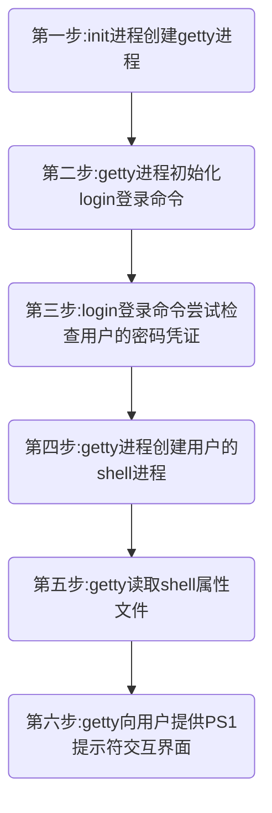


 Linux用户登录流程介绍

> ## 1.在Linux系统，用户登录流程是怎样的呢？

那我们就介绍常常被忽略的一些基本概念，很多人都知道linux的启动流程中init进程会负责启动linux，但是对于登录的基本过程却比较忽视。接下来就让大家熟悉熟悉当init进程完成执行/etc/rc.local文件并等到我们用户看到PS1所提供的交互界面（以便我们执行期望的命令）之后用户登录的过程是怎样的。

### 2.一个大致的登陆过程如下：

### 3.我们通过将大概的登陆过程细化来一探究竟
  
- **第0步**：一旦init进程完成运行级别的执行和/etc/rc.local中的命令的执行，其将会启动一个名叫getty的进程。getty是负责整个登录过程的进程。  

- **第1步**：getty初始化login命令并提供一个带‘login：’字样的字符登录界面，并等待用户输入用户名。一旦用户输入用户名，接着并会提示输入密码。用户输入的密码并不会显示在终端。  

- **第2步**：接着getty进程会检查用户的密码凭证，如果密码与系统中记录的一致getty会初始化用户的属性收集进程，否则getty会结束login进程重新初始化一个新的login进程。这个过程在大多数linux/unix系统上会进行三次。如果用户连续输错三次其密码凭证，getty会使用PAM模块控制未授权的登录并禁用终端10s。  

- **第3步**：用户凭证通过验证后，getty进程读取用户的一些属性如：用户名、UID、GUI、家目录、从/etc/passwd文件中读取的用户shell（其依赖于相应的系统变量如：`$USER,$UID,$GUI,$HOME,$SHELL`）等。  

- **第4步**：当getty开启用户shell进程之前收集到所有属性后会读取/etc/mootd文件，并将其内容作展示到终端。

- **第5步**：现在getty进程会读取/etc/profile文件以正确的设置和shell相关的配置并使得我们所设置的命令别名或者一些变量生效。

- **第6步**：在读取/etc/profile文件后getty进程会读取用户的家目录的一些文件并根据'.bashrc'文件配置更改shell的属性和配置，如果默认shell为bash则会根据'.bash_prfile'来更改shell的相关属性。getty会从/etc/passwd文件中确定使用什么shell为用户的默认shell。

- **第7步**：getty接着启动一个软件，就是用来和用户直接交互的shell程序。getty从前面解析/etc/passwd文件所设置好的$SHELL环境变量中知道需要启动shell程序。现在终端就展示出PS1提示界面等待用户执行命令。

- **以上的所有过程都是在内核的监控下完成的**
