<center> <font face="黑体" size=7 color=grey>Linux磁盘管理和文件系统详细笔记</center>

<center><font face="黑体" size=4 color=grey> </center>

# 一.linux磁盘设备概述

- 在linux中一切皆为文件，设备也不例外；linux使用/dev/文件夹下的设备文件来与相关的设备建立联系，访问某个设备文件就是访问该设备。

- linux设备类型包括: 

```bash
    块设备：block，存取单位“块”，磁盘 
    字符设备：char，存取单位“字符”，键盘 
```

- 设备文件：关联至一个设备驱动程序，进而能够跟与之对应硬件设备进行通信 

- 设备号码

```bash
    主设备号：major number, 标识设备类型 
    次设备号：minor number, 标识同一类型下的不同设备 
```

- linux磁盘设备命名

```bash
磁盘设备的设备文件命名：/dev/DEV_FILE 
SCSI, SATA, SAS, IDE,USB: /dev/sd 
某些云服务器虚拟磁盘：/dev/vd 、/dev/xvd 
不同磁盘标识：a-z,aa,ab… 
    /dev/sda, /dev/sdb, ... 
同一设备上的不同分区：1,2, ... 
    /dev/sda1, /dev/sda5 
硬盘存储术语 
    head：磁头 
    track：磁道 
    sector：扇区，512bytes 
    cylinder：柱面 
```

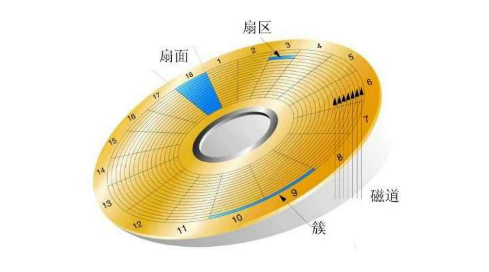

```bash
比如：
    hexdump -C -512 /dev/sda1 
    该命令就访问了磁盘的第一个分区的前512个字节，即MBR分区(实际上该分区只有512字节)；
    在linux中磁盘使用/dev/sda[b|c|d...] 设备文件来访问。

在操作系统的上层应用访问磁盘时，会通过系统调用来读写磁盘，如：
    open(), read(), write(), close() 
```


- 在linux中使用某磁盘需要经过以下几步:
  
```bash
1.设备识别,识别出的硬盘设备在/dev目录下
2.设备分区 
3.创建文件系统 
4.标记文件系统 
5.在/etc/fstab文件中创建条目 
6.挂载新的文件系统 
```

- 分区所带来的好处

```bash
1.优化I/O性能 
2.多个分区可以实现磁盘空间配额限制 
3.提高修复速度 
4.隔离系统和程序 
5.多个分区可以安装多个OS 
6.采用不同文件系统 
```

# 二.分区结构类型

- 目前主流的操作系统和相对应的硬件使用MBR和GPT分区方式中的一种，GPT分区格式比较新，所支持的容量更大，具备图形配置界面，所以大部分已经从传统的MBR分区格式转为使用GPT格式；而MBR分区格式需要配合传统的BIOS硬件；GPT则搭配较新的UEFI固件接口。

## 1.MBR

- MBR：Master Boot Record，1982年出现，使用32位表示扇区数，分区不超过2T 

```bash
MBR按柱面大小作为分区的基本容量单位；
MBR的元数据存放在0磁道0扇区：512bytes(整块硬盘的前512字节) 
前446bytes: boot loader 
紧接着的64bytes：分区表，其中每16bytes标识一个分区 
最后2bytes: 55AA (第511和512字节)
MBR分区中一块硬盘最多有4个主分区，也可以3主分区+1扩展(N个逻辑分区) 
```

## 2.MBR分区结构组织

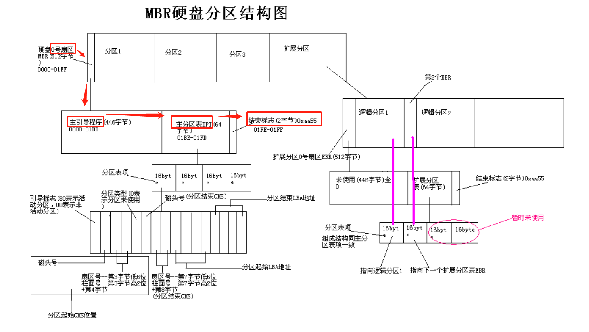

```bash
硬盘主引导记录MBR由4个部分组成 
1.主引导程序（偏移地址0000H--0088H），它负责从活动分区中装载，并运行系统引导程序 
2.出错信息数据区，偏移地址0089H--00E1H为出错信息，00E2H--01BDH全为0字节 
3.分区表（DPT,Disk Partition Table）含4个分区项，偏移地址01BEH--01FDH, 每个分区表项长16个字节，共64字节为分区项1、分区项2、分区项3、分区项4 
4.结束标志字，偏移地址01FE--01FF的2个字节值为结束标志55AA 
```

- 各个区所对应的16位地址

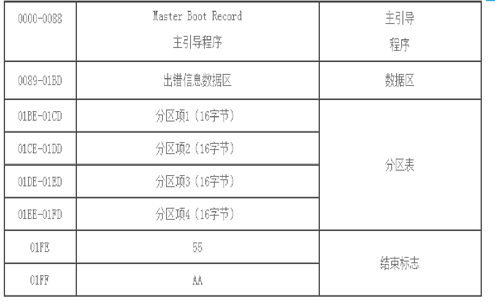

- MBR主分区表中的分区表项具体含义
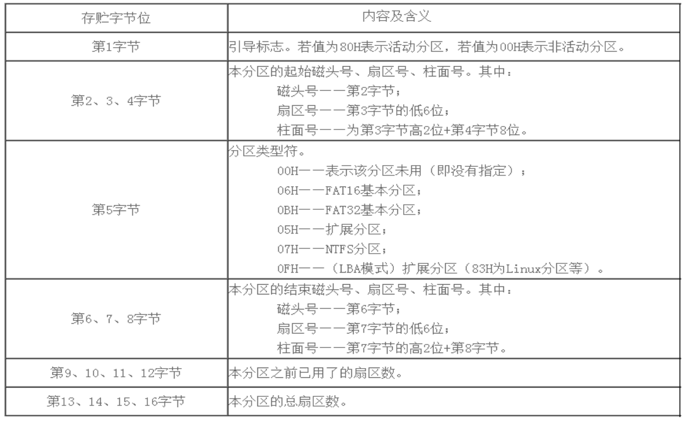

## 3.GPT分区 

```bash
1.GPT：GUID（Globals Unique Identifiers） partition table 支持128个分区使用64位，支持8Z（ 512Byte/block ）64Z （ 4096Byte/block） 
2.使用128位UUID(Universally Unique Identifier) 表示磁盘和分区 GPT分区表 自动备份在头和尾两份，并有CRC校验位 
3.UEFI (Unified Extensible Firmware Interface 统一可扩展固件接口)硬件支持 GPT，使操作系统启动
```

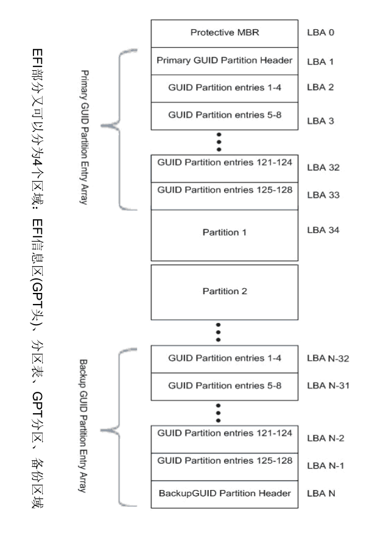

## 4.BIOS和UEFI 

```bash
1.BIOS是固化在电脑主板上一个程序，主要用于开机系统自检和引导操作系统。 目前新式的电脑基本上都是UEFI启动 
2.BIOS（Basic Input Output System 基本输入输出系统）对于普通用户来说，主要完成系统硬件自检和引导操作系统，
操作系统开始启动之后，BIOS的任务就完成了。系统硬件自检：如果系统硬件有故障，主板上的扬声器就会发出长短不同的“滴滴”音，
可以简单的判断硬件故障，比如“1长1短”通常表示内存故障，“1长3短”通常表示显卡故障  
3.BIOS在1975年就诞生了，使用汇编语言编写，当初只有16位，因此只能访问 1M的内存，其中前640K称为基本内存，
后384K内存留给开机和各类BIOS本身 使用。BIOS只能识别到主引导记录（MBR）初始化的硬盘，最大支持2T的硬盘，
4个主分区（逻辑分区中的扩展分区除外），而目前普遍实现了64位系统，传统
的BIOS已经无法满足需求了，这时英特尔主导的EFI就诞生了
```

## 5.BIOS+MBR与UEFI+GPT 

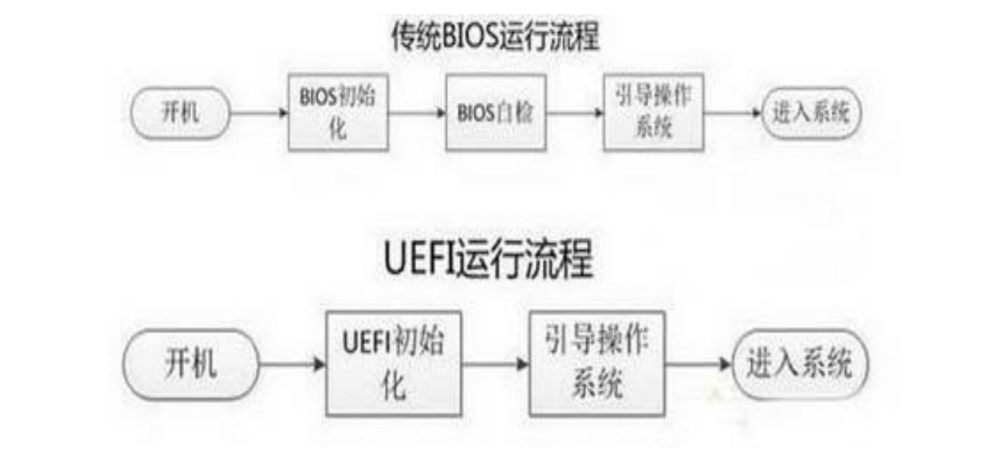

# 三.分区管理

## 1.查看磁盘设备和分区信息

### lsblk 

```bash1
blkid [OPTION]... [DEVICE] 
    -U UUID 根据指定的UUID来查找对应的设备 
    -L LABEL 根据指定的LABEL来查找对应的设备 
```

- man 一下

```bash
[root@centos6 ~]$lsblk -o NAME,ALIGNMENT,MIN-IO,OPT-IO,PHY-SEC,LOG-SEC,ROTA,SCHED,RQ-SIZE /dev/sda
NAME   ALIGNMENT MIN-IO OPT-IO PHY-SEC LOG-SEC ROTA SCHED RQ-SIZE
sda            0    512      0     512     512    1 cfq       128
├─sda1         0    512      0     512     512    1 cfq       128
├─sda2         0    512      0     512     512    1 cfq       128
├─sda3         0    512      0     512     512    1 cfq       128
├─sda4         0    512      0     512     512    1 cfq       128
└─sda5         0    512      0     512     512    1 cfq       128
[root@centos6 ~]$lsblk -t
NAME   ALIGNMENT MIN-IO OPT-IO PHY-SEC LOG-SEC ROTA SCHED RQ-SIZE   RA
sr0            0    512      0     512     512    1 cfq       128  128
sda            0    512      0     512     512    1 cfq       128  128
├─sda1         0    512      0     512     512    1 cfq       128  128
├─sda2         0    512      0     512     512    1 cfq       128  128
├─sda3         0    512      0     512     512    1 cfq       128  128
├─sda4         0    512      0     512     512    1 cfq       128  128
└─sda5         0    512      0     512     512    1 cfq       128  128
sdb            0    512      0     512     512    1 cfq       128  128
```

### fdisk -l /dev/sd[abc...] 

### blkid

- locate/print block device attributes

## 2.创建分区

### fdisk 创建MBR分区 | gdisk 创建GPT分区 

```bash
gdisk /dev/sdb 类fdisk 的GPT分区工具 
fdisk -l [-u] [device...] 查看分区 
fdisk /dev/sdb  管理分区 
子命令： 
p  分区列表 
t  更改分区类型 
n  创建新分区 
d  删除分区 
v  校验分区 
u  转换单位 
w  保存并退出 
q  不保存并退出 
``` 
 
- 也可以使用非交互式的方式来创建分区，这种方法适合用在脚本中

```bash
    echo -e "n\np\n1\n\n\nw\n" | fdisk /dev/sdb # 将在/dev/sdb上创建一个新分区，使用/dev/sdb的所有空间
```

### parted 高级分区操作 

```bash
注意：parted的操作都是实时生效的，小心使用 
用法：parted [选项]... [设备 [命令 [参数]...]...]  
    parted /dev/sdb  mklabel gpt|msdos 
    parted /dev/sdb  print 
    parted /dev/sdb  mkpart primary 1 200 （默认M） 
    parted /dev/sdb  rm 1 
    parted –l   列出分区信息 
```


## 3.同步分区表 


- 分区完成后使用partprobe更新分区信息

- 在centos6中方法不同：

```bash
查看内核是否已经识别新的分区 
    cat /proc/partations 
centos6通知内核重新读取硬盘分区表 
    新增分区用  
        partx -a  /dev/DEVICE 
        kpartx -a /dev/DEVICE -f: force 
    删除分区用 
        partx -d --nr M-N /dev/DEVICE 
CentOS 5，7: 使用partprobe 
    qpartprobe [/dev/DEVICE] 
```

# 四.管理文件系统 

## 1.文件系统 

- 文件系统是操作系统用于明确存储设备或分区上的文件的方法和数据结构；即
在存储设备上组织文件的方法。操作系统中负责管理和存储文件信息的软件结
构称为文件管理系统，简称文件系统 
- 从系统角度来看，文件系统是对文件存储设备的空间进行组织和分配，负责文
件存储并对存入的文件进行保护和检索的系统。具体地说，它负责为用户建立
文件，存入、读出、修改、转储文件，控制文件的存取，安全控制，日志，压
缩，加密等 
- 查看linux支持的文件系统：/lib/modules/ùname –r`/kernel/fs 
- [wikipedia所罗列的各种文件系统](https://en.wikipedia.org/wiki/Comparison_of_file_systems)
- 帮助：man 5 fs 

## 2.文件系统类型 

```bash
Linux文件系统：  
    1.ext2(Extended file system)：适用于那些分区容量不是太大，更新也不频繁的情况，
        例如 /boot 分区 
    2.ext3：是 ext2 的改进版本，其支持日志功能，能够帮助系统从非正常关机导致的异常
    中恢复。它通常被用作通用的文件系统 
    3.ext4：是 ext 文件系统的最新版。提供了很多新的特性，包括纳秒级时间戳、创建和
    使用巨型文件(16TB)、最大1EB的文件系统，以及速度的提升 
    4.xfs：SGI，支持最大8EB的文件系统 
    5.btrfs（Oracle）, reiserfs, jfs（AIX）, swap 
    6.光盘：iso9660 
7.Windows：FAT32, NTFS，exFAT 
8.Unix：FFS（fast）, UFS（unix）, JFS2 
9.网络文件系统：NFS, CIFS 
10.集群文件系统：GFS2, OCFS2（oracle） 
11.分布式文件系统：fastdfs,ceph, moosefs, mogilefs, glusterfs, Lustre 
12.RAW：未经处理或者未经格式化产生的文件系统
```

## 3.linux文件系统分类 

```bash
根据其是否支持"journal"功能分： 
    日志型文件系统: ext3, ext4, xfs, ... 
    非日志型文件系统: ext2, vfat 
文件系统的组成部分： 
    内核中的模块：ext4, xfs, vfat 
    用户空间的管理工具：mkfs.ext4, mkfs.xfs,mkfs.vfat 
Linux的虚拟文件系统：VFS 
查看目前支持的文件系统：cat /proc/filesystems 
```

## 4.linux的VFS

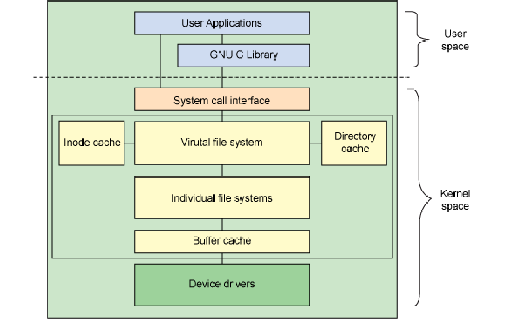

## 5.linux文件系统的选择

```bash
文件系统选择 
1.EXT3 
    最多只能支持32TB的文件系统和2TB的文件，实际只能容纳2TB的文件系统和16GB的文件 
    Ext3目前只支持32000个子目录 
    Ext3文件系统使用32位空间记录块数量和inode数量 
    当数据写入到Ext3文件系统中时，Ext3的数据块分配器每次只能分配一个4KB的块 
2.EXT4：EXT4是Linux系统下的日志文件系统，是EXT3文件系统的后继版本 
    Ext4的文件系统容量达到1EB，而文件容量则达到16TB 
    理论上支持无限数量的子目录 
    Ext4文件系统使用64位空间记录块数量和 inode数量 
    Ext4的多块分配器支持一次调用分配多个数据块 
    修复速度更快 
3.XFS 
    根据所记录的日志在很短的时间内迅速恢复磁盘文件内容 
    采用优化算法，日志记录对整体文件操作影响非常小 
    是一个全64-bit的文件系统，最大可以支持8EB的文件系统 
    能以接近裸设备I/O的性能存储数据 
```

## 5.创建ext文件系统 

### mke2fs：ext系列文件系统专用管理工具 

- 用法：

```bash
       mke2fs [ -c | -l filename ] [ -b block-size ] [ -C cluster-size ] [ -d root-directory ] [ -D ] [ -g blocks-per-group ] [ -G
       number-of-groups ] [ -i bytes-per-inode ] [ -I inode-size ] [ -j ] [ -J journal-options ] [ -N number-of-inodes ] [ -n ]  [
       -m  reserved-blocks-percentage  ] [ -o creator-os ] [ -O [^]feature[,...]  ] [ -q ] [ -r fs-revision-level ] [ -E extended-
       options ] [ -v ] [ -F ] [ -L volume-label ] [ -M last-mounted-directory ] [ -S ] [ -t fs-type ] [ -T usage-type ] [ -U UUID
       ] [ -V ] [ -e errors-behavior ] [ -z undo_file ] device [ fs-size ]

       mke2fs -O journal_dev [ -b block-size ] [ -L volume-label ] [ -n ] [ -q ] [ -v ] external-journal [ fs-size ]
```

- 选项：

```bash
-t {ext2|ext3|ext4}   指定文件系统类型  
-b {1024|2048|4096}   指定块大小 
-L ‘LABEL’   设置卷标 
-j 相当于 -t ext3 
   mkfs.ext3 = mkfs -t ext3 = mke2fs -j = mke2fs -t ext3 
-i # :为数据空间中每多少个字节创建一个inode；不应该小于block大小 
-N # :指定分区中创建多少个inode 
-I  一个inode记录占用的磁盘空间大小，128---4096 
-m # :默认5%,为管理人员预留空间占总空间的百分比 
-O FEATURE[,...] 启用指定特性 
-O ^FEATURE 关闭指定特性 
```

### mkfs命令

```bash
(1) mkfs.FS_TYPE /dev/DEVICE 
    ext4 
    xfs 
    btrfs 
    vfat 
(2) mkfs -t FS_TYPE /dev/DEVICE 
    -L 'LABEL' 设定卷标 
```

## 6.文件系统标签 

- 文件系统标签是指向设备的另一种方法,与设备无关 

### e2label：管理ext系列文件系统的LABEL 

```bash 
e2label DEVICE [LABEL] 
eg: e2label /dev/sdb /home

findfs ：查找分区 
    findfs [options] LABEL=<label> 
    findfs [options] UUID=<uuid> 
eg:
[root@centos6 ~]$findfs UUID=41f73bce-f100-421f-b8a0-d2aad312e5a5
/dev/sdb
[root@centos6 ~]$findfs LABEL=/home
/dev/sdb
```

## 7.tune2fs 

- tune2fs：重新设定ext系列文件系统可调整参数的值 

- 用法

```bash
#tune2fs - adjust tunable filesystem parameters on ext2/ext3/ext4 filesystems
tune2fs  [  -l ] [ -c max-mount-counts ] [ -e errors-behavior ] [ -f ] [ -i interval-between-checks ] [ -j ] [ -J
journal-options ] [ -m reserved-blocks-percentage ] [ -o [^]mount-options[,...]  ] [ -r reserved-blocks-count ] [
-s  sparse-super-flag  ] [ -u user ] [ -g group ] [ -C mount-count ] [ -E extended-options ] [ -L volume-name ] [
-M last-mounted-directory ] [ -O [^]feature[,...]  ] [ -T time-last-checked ] [ -U UUID ] device
options:
    -l 查看指定文件系统超级块信息；super block 
    -L 'LABEL’ 修改卷标 
    -m # 修预留给管理员的空间百分比 
    -j 将ext2升级为ext3 
    -O 文件系统属性启用或禁用, –O ^has_journal 
    -o 调整文件系统的默认挂载选项，–o âcl  
    -U UUID 修改UUID号 
```

- dumpe2fs：显示ext文件系统信息，将磁盘块分组管理  
    -h：查看超级块信息，不显示分组信息
- xfs_info：显示已挂载的 xfs 文件系统信息  
    xfs_info mountpoint

- 超级块和INODE TABLE在磁盘中的大致组织结构

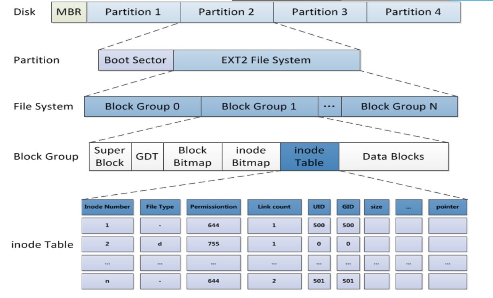

## 8.文件系统检测和修复 

- 文件系统夹故障常发生于死机或者非正常关机之后，挂载为文件系统标记为“no clean”;这时就需要文件系统修复
- 注意：一定不要在挂载状态下执行下面命令修复

```bash
fsck: File System Check
fsck.FS_TYPE
fsck -t FS_TYPE  
    注意：FS_TYPE 一定要与分区上已经文件类型相同 
    -a 自动修复 
    -r 交互式修复错误  
e2fsck：ext系列文件专用的检测修复工具 
    -y 自动回答为yes 
    -f 强制修复 
    -p 自动进行安全的修复文件系统问题 
xfs_repair：xfs文件系统专用检测修复工具 
    -f 修复文件，而设备 
    -n 只检查 
    -d 允许修复只读的挂载设备，在单用户下修复 / 时使用，然后立即reboot 
```

## 9.常见工具 

### 文件系统空间占用等信息的查看工具df/du

```bash
df [OPTION]... [FILE]... 
    -H 以10为单位 
    -T 文件系统类型 
    -h human-readable 
    -i inodes instead of blocks 
    -P 以Posix兼容的格式输出  
查看某目录总体空间占用状态 
du [OPTION]... DIR 
    -h  human-readable 
    -s   summary   
    --max-depth=#   指定最大目录层级 
```

### 工具dd 

- dd 命令：convert and copy a file 

- 用法：

```bash
dd if=/PATH/FROM/SRC of=/PATH/TO/DEST  bs=# count=# 
    if=file      从所命名文件读取而不是从标准输入 
    of=file      写到所命名的文件而不是到标准输出 
    ibs=size     一次读size个byte 
    obs=size     一次写size个byte 
    bs=size      block size, 指定块大小（既是是ibs也是obs) 
    cbs=size     一次转化size个byte 
    skip=blocks  从开头忽略blocks个ibs大小的块 
    seek=blocks  从开头忽略blocks个obs大小的块 
    count=n      复制n个bs 

conv=conversion[,conversion...] 用指定的参数转换文件  
转换参数:  
    ascii     转换 EBCDIC 为 ASCII 
    ebcdic    转换 ASCII 为 EBCDIC 
    lcase     把大写字符转换为小写字符 
    ucase     把小写字符转换为大写字符 
    nocreat   不创建输出文件 
    noerror   出错时不停止 
    notrunc   不截短输出文件 
    sync      把每个输入块填充到ibs个字节，不足部分用空(NUL)字符补齐 
    fdatasync 写完成前，物理写入输出文件 
```

- 使用dd命令备份MBR 

```bash
dd if=/dev/sda of=/tmp/mbr.bak bs=512 count=1 
```

- 破坏MBR中的bootloader 

```bash
dd if=/dev/zero of=/dev/sda bs=64 count=1 seek=446 
```

- 有一个大与2K的二进制文件fileA。现在想从第64个字节位置开始读取，需要读
取的大小是128Byts。又有fileB, 想把上面读取到的128Bytes写到第32个字节开
始的位置，替换128Bytes，实现如下 

> dd if=fileA of=fileB bs=1 count=128 skip=63 seek=31 conv=notrunc 
 
- 使用dd命令备份：  

```bsh
dd if=/dev/sdx of=/dev/sdy 
将本地的/dev/sdx整盘备份到/dev/sdy  
dd if=/dev/sdx of=/path/to/image 
将/dev/sdx全盘数据备份到指定路径的image文件  
dd if=/dev/sdx | gzip >/path/to/image.gz 
备份/dev/sdx全盘数据，并利用gzip压缩，保存到指定路径  
```

- 使用dd命令恢复：  

```bash
dd if=/path/to/image of=/dev/sdx 
将备份文件恢复到指定盘  
gzip -dc /path/to/image.gz | dd of=/dev/sdx 
将压缩的备份文件恢复到指定盘 
```


```bash
拷贝内存资料到硬盘  
    dd if=/dev/mem of=/root/mem.bin bs=1024 
    将内存里的数据拷贝到root目录下的mem.bin文件  

从光盘拷贝iso镜像  
    dd if=/dev/cdrom of=/root/cdrom.iso 
    拷贝光盘数据到root文件夹下，并保存为cdrom.iso文件 

销毁磁盘数据  
    dd if=/dev/urandom of=/dev/sda1 
    利用随机的数据填充硬盘，在某些必要的场合可以用来销毁数据，执行此操作
    以后，/dev/sda1将无法挂载，创建和拷贝操作无法执行
```


# 五.挂载/卸载磁盘设备

## 1.挂载mount 

- 挂载:将额外文件系统与根文件系统某现存的目录建立起关联关系，进而使得此
目录做为其它文件访问入口的行为 
- 卸载:为解除此关联关系的过程 
- 把设备关联挂载点：mount Point 
- 卸载时：可使用设备，也可以使用挂载点 
    umount  设备名|挂载点 
- 挂载点下原有文件在挂载完成后会被临时隐藏 
- 挂载点目录一般为空 

## 2.用mount命令挂载文件系统 

- 挂载方法：mount DEVICE MOUNT_POINT 
- mount命令实际上是通过查看/etc/mtab文件显示当前已挂载的所有设备 

```bash
mount [-fnrsvw] [-t vfstype] [-o options] device dir 
device：指明要挂载的设备； 
    (1) 设备文件：例如/dev/sda5 
    (2) 卷标：-L 'LABEL', 例如 -L 'MYDATA' 
    (3) UUID, -U 'UUID'：例如 -U '0c50523c-43f1-45e7-85c0-a126711d406e' 
    (4) 伪文件系统名称：proc, sysfs, devtmpfs, configfs 
dir：挂载点 
    事先存在，建议使用空目录 
    进程正在使用中的设备无法被卸载 

mount常用命令选项:
    -t vsftype  指定要挂载的设备上的文件系统类型 
    -r  readonly，只读挂载 
    -w  read and write, 读写挂载 
    -n  不更新/etc/mtab，mount不可见 
    -a  自动挂载所有支持自动挂载的设备(定义在了/etc/fstab文件中，且挂载选项中有auto功能) 
    -L 'LABEL'  以卷标指定挂载设备 
    -U 'UUID'   以UUID指定要挂载的设备 
    -B, --bind  绑定目录到另一个目录上 
查看内核追踪到的已挂载的所有设备 
    cat /proc/mounts 

mount 的-o子命令：
-o options：(挂载文件系统的选项)，多个选项使用逗号分隔 
    async               异步模式  
    sync                同步模式,内存更改时，同时写磁盘 
    atime/noatime       包含目录和文件 
    diratime/nodiratime 目录的访问时间戳 
    auto/noauto         是否支持自动挂载,是否支持-a选项 
    exec/noexec         是否支持将文件系统上运行应用程序 
    dev/nodev           是否支持在此文件系统上使用设备文件 
    suid/nosuid         是否支持suid和sgid权限 
    remount             重新挂载 
    ro 只读  
    rw 读写 
    user/nouser         是否允许普通用户挂载此设备，/etc/fstab使用 
    acl                 启用此文件系统上的acl功能 
    loop                使用loop设备 
    _netdev             当网络可用时才对网络资源进行挂载，如：NFS文件系统
    defaults            相当于rw, suid, dev, exec, auto, nouser, async 
```

## 3.卸载命令 

```bash
- 查看挂载情况 
    findmnt   MOUNT_POINT|device 
- 查看正在访问指定文件系统的进程 
    lsof MOUNT_POINT 
    fuser -v MOUNT_POINT 
- 终止所有在正访问指定的文件系统的进程 
    fuser -km MOUNT_POINT 
- 卸载 
    umount DEVICE 
    umount MOUNT_POINT 
```

## 4.挂载点和/etc/fstab 

- 使用mount  -a 命令挂载/etc/fstab中的所有文件系统 

- /etc/fstab每行定义一个要挂载的文件系统 

```bash
## /etc/fstab
1、要挂载的设备或伪文件系统 
设备文件 
LABEL：LABEL="" 
UUID：UUID="" 
伪文件系统名称：proc, sysfs 
2、挂载点  
3、文件系统类型：ext4，xfs，iso9660，nfs，none 
4、挂载选项：defaults ，acl，bind 
5、转储频率：
    0：不做备份 
    1：每天转储 
    2：每隔一天转储 
6、fsck检查的文件系统的顺序：允许的数字是0 1 2 
    0：不自检  
    1：首先自检；一般只有rootfs才用 
    2：非rootfs使用
```

## 5.移动介质的挂载/卸载和使用

```bash
挂载意味着使外来的文件系统看起来如同是主目录树的一部分 
访问前，介质必须被挂载 
摘除时，介质必须被卸载 
按照默认设置，非根用户只能挂载某些设备（光盘、DVD、软
盘、USB等等） 
挂载点通常在/media 或/mnt下 
```

### 使用光盘 

```bash
在图形环境下自动启动挂载/run/media/<user>/<label> 
否则就必须被手工挂载 
    mount /dev/cdrom  /mnt/ 
操作光盘： 
    eject 弹出光盘 
    eject -t 弹入光盘  
创建ISO文件 
    cp /dev/cdrom  /root/centos.iso 
    mkisofs  -r  -o  /root/etc.iso /etc 
刻录光盘 
    wodim –v –eject centos.iso 
```

- mkisofs实际指向/usr/bin/genisoimage
 
```bash
[root@centos8 ~]#which mkisofs
/usr/bin/mkisofs
[root@centos8 ~]#ll `which mkisofs`
lrwxrwxrwx. 1 root root 25 Sep 25 10:22 /usr/bin/mkisofs -> /etc/alternatives/mkisofs
[root@centos8 ~]#ll /etc/alternatives/mkisofs
lrwxrwxrwx. 1 root root 20 Sep 25 10:22 /etc/alternatives/mkisofs -> /usr/bin/genisoimage
```

### 挂载USB介质 

```bash
查看USB设备是否识别 
    •lsusb  
被内核探测为SCSI设备 
    •/dev/sdaX、/dev/sdbX或类似的设备文件 
在图形环境中自动挂载 
    •图标在[计算机]窗口中创建 
    •挂载在/run/media/<user>/<label> 
手动挂载 
    •mount /dev/sdb1 /mnt 
```

# 六.管理虚拟内存 

## 1.处理交换文件和分区 

- swap交换分区是系统RAM的补充，swap 分区支持虚拟内存。当没有足够的 
RAM 保存系统处理的数据时会将数据写入 swap 分区 
- 当系统缺乏 swap 空间时，内核会因 RAM 内存耗尽而终止进程。配置过多 
swap 空间会造成存储设备处于分配状态但闲置，造成浪费，过多 swap 空
间还会掩盖内存泄露

- 推荐的不同情况下系统swap空间大小
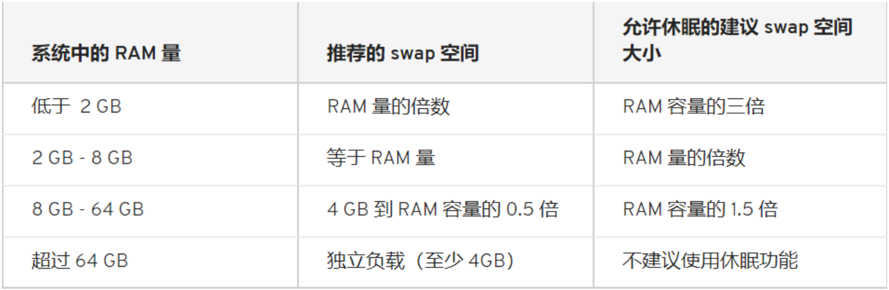

## 2.挂载交换分区 

```bash
基本设置包括： 
    •创建交换分区或者文件 
    •使用mkswap写入特殊签名 
    •在/etc/fstab文件中添加适当的条目 
    •使用swapon -a 激活交换空间 
启用：swapon 
swapon [OPTION]... [DEVICE] 
    -a：激活所有的交换分区 
    -p PRIORITY：指定优先级 
/etc/fstab  在第4列中：pri=value 
    禁用：swapoff [OPTION]... [DEVICE] 
```

## 3.SWAP的优先级 

- 可以指定swap分区0到32767的优先级，值越大优先级越高 
- 如果用户没有指定，那么核心会自动给swap指定一个优先级，这个优先级从
-1开始，每加入一个新的没有用户指定优先级的swap，会给这个优先级减一 
- 先添加的swap的缺省优先级比较高，除非用户自己指定一个优先级，而用户
指定的优先级(是正数)永远高于核心缺省指定的优先级(是负数) 
- 优化swap的性能：分布存放，高性能磁盘存放

# 七.练习

1、创建一个2G的文件系统，块大小为2048byte，预留1%可用空间,文件系统
ext4，卷标为TEST，要求此分区开机后自动挂载至/test目录，且默认有acl挂载
选项
```bash
    echo -e "n\np\n1\n+2G\nw\n" | fdisk /dev/sdb 
    6:partx -a /dev/sdb
      kpartx -a /dev/sdb -f
    7/8:partprobe
    mkfs.ext4 -b 2048 -m 1 -L "TEST" /dev/sdb1
    echo "/dev/sdb1  /test   ext4  defaults,acl  0 0" >> /etc/fstab
```
2、写一个脚本，完成如下功能： 
(1) 列出当前系统识别到的所有磁盘设备 
(2) 如磁盘数量为1，则显示其空间使用信息;否则，则显示最后一个磁盘上的空间使用信息 

```bash
#!/bin/bash
#
#*******************************************************************************
#Author:            steveli
#QQ:                1049103823
#Data:              2019-10-17
#FileName:          list_disks.sh
#URL:               https://blog.csdn.net/YouOops
#Description:       list_disks.sh
#Copyright (C):     2019 All rights reserved
#*******************************************************************************
#Fontcolor#red(31):green(32):yellow(33):blue(34):purple(35):cyan(36):white(37)
#Backcolor#red(41):green(42):yellow(43):blue(44):purple(45):cyan(46):white(47)
#*******************************************************************************
#
OS_VER=`cat /etc/redhat-release | sed -nr 's/.*([0-9]+)\.[0-9]+\..*/\1/p'`
if [[ "$OS_VER" -eq 8 ]]
then
DISK="nvme..."
else
DISK="sd."
fi
N=`lsblk | grep -w "$DISK" | wc -l`
SD_1=`lsblk | grep -w "$DISK" | head -n1`
SD_END=`lsblk | grep -w "$DISK" | tail  -n1`
if [ $N -eq 1 ]
then
    echo "$SD_1" | tr -s " " : | cut -d: -f1,5
else
    echo "$SD_END"  | tr -s " " : | cut -d: -f1,5
fi
```
3、将CentOS6的CentOS-6.10-x86_64-bin-DVD1.iso和CentOS-6.10-
x86_64-bin-DVD2.iso两个文件，合并成一个CentOS-6.10-x86_64-
Everything.iso文件，并将其配置为yum源 
```bash
[root@centos7 /mnt/cd]#ll /misc/cd/ /mnt/cd/
/misc/cd/:
total 566
-r--r--r-- 2 root root     14 Jun 29  2018 CentOS_BuildTag
dr-xr-xr-x 3 root root   2048 Jun 30  2018 EFI
-r--r--r-- 2 root root    212 Nov 27  2013 EULA
-r--r--r-- 2 root root  18009 Nov 27  2013 GPL
dr-xr-xr-x 3 root root   2048 Jun 30  2018 images
dr-xr-xr-x 2 root root   2048 Jun 30  2018 isolinux
dr-xr-xr-x 2 root root 536576 Jun 30  2018 Packages
-r--r--r-- 2 root root   1363 Jun 29  2018 RELEASE-NOTES-en-US.html
dr-xr-xr-x 2 root root   4096 Jun 30  2018 repodata
-r--r--r-- 2 root root   1706 Nov 27  2013 RPM-GPG-KEY-CentOS-6
-r--r--r-- 2 root root   1730 Nov 27  2013 RPM-GPG-KEY-CentOS-Debug-6
-r--r--r-- 2 root root   1730 Nov 27  2013 RPM-GPG-KEY-CentOS-Security-6
-r--r--r-- 2 root root   1734 Nov 27  2013 RPM-GPG-KEY-CentOS-Testing-6
-r--r--r-- 1 root root   3380 Jun 30  2018 TRANS.TBL

/mnt/cd/:
total 570
-r--r--r-- 1 root root     14 Jun 29  2018 CentOS_BuildTag
-r--r--r-- 1 root root    212 Nov 27  2013 EULA
dr-xr-xr-x 2 root root 571392 Jun 30  2018 Packages
-r--r--r-- 1 root root   1706 Nov 27  2013 RPM-GPG-KEY-CentOS-6
-r--r--r-- 1 root root   1730 Nov 27  2013 RPM-GPG-KEY-CentOS-Debug-6
-r--r--r-- 1 root root   1730 Nov 27  2013 RPM-GPG-KEY-CentOS-Security-6
-r--r--r-- 1 root root   1734 Nov 27  2013 RPM-GPG-KEY-CentOS-Testing-6
-r--r--r-- 1 root root   2056 Jun 30  2018 TRANS.TBL

cp /mnt/cd/Packages/*rpm cd3/Packages/
cat /mnt/cd/Packages/TRANS.TBL >> /mnt/cd3/Packages/TRANS.TBL 
mv /mnt/cd3/Packages/{TRANS.TBL,TRANS.TBL.BAK} 
sort /mnt/cd3/Packages/TRANS.TBL.BAK > /mnt/cd3/Packages/TRANS.TBL
\rm -rf /mnt/cd3/Packages/TRANS.TBL.BAK 
mkdir iso 
mkisofs -r -o /mnt/iso/CentOS-6.8-x86_64-Everything.iso /mnt/cd3
[root@centos7 /mnt]#ll iso -h
total 5.8G
-rw-r--r-- 1 root root 5.8G Oct 17 17:40 CentOS-6.8-x86_64-Everything.iso
[root@centos7 ~]#mount /mnt/iso/CentOS-6.8-x86_64-Everything.iso /mnt/test/
mount: /dev/loop1 is write-protected, mounting read-only
[root@centos7 ~]#ll /mnt/test/
total 1122
-r--r--r-- 1 root root      14 Jun 29  2018 CentOS_BuildTag
dr-xr-xr-x 3 root root    2048 Jun 30  2018 EFI
-r--r--r-- 1 root root     212 Nov 27  2013 EULA
-r--r--r-- 1 root root   18009 Nov 27  2013 GPL
dr-xr-xr-x 3 root root    2048 Jun 30  2018 images
dr-xr-xr-x 2 root root    2048 Jun 30  2018 isolinux
dr-xr-xr-x 2 root root 1105920 Oct 17 17:38 Packages
-r--r--r-- 1 root root    1363 Jun 29  2018 RELEASE-NOTES-en-US.html
dr-xr-xr-x 2 root root    4096 Jun 30  2018 repodata
-r--r--r-- 1 root root    1706 Nov 27  2013 RPM-GPG-KEY-CentOS-6
-r--r--r-- 1 root root    1730 Nov 27  2013 RPM-GPG-KEY-CentOS-Debug-6
-r--r--r-- 1 root root    1730 Nov 27  2013 RPM-GPG-KEY-CentOS-Security-6
-r--r--r-- 1 root root    1734 Nov 27  2013 RPM-GPG-KEY-CentOS-Testing-6
-r--r--r-- 1 root root    3380 Jun 30  2018 TRANS.TBL
```

# 八.RAID管理

- 什么是RAID 
RAID：Redundant Arrays of Inexpensive（Independent） Disks 
1988年由加利福尼亚大学伯克利分校（University of California-
Berkeley） “A Case for Redundant Arrays of Inexpensive Disks” 
多个磁盘合成一个“阵列”来提供更好的性能、冗余，或者两者都提供 
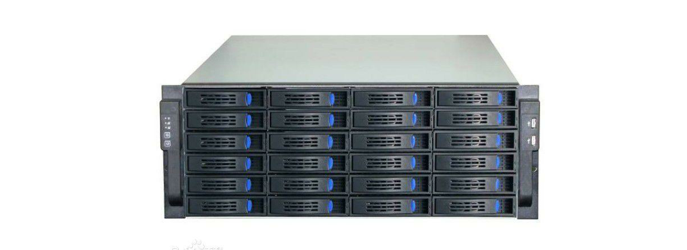

- RAID的作用

```bash
提高IO能力 
    磁盘并行读写 
提高耐用性 
    磁盘冗余来实现 
级别
    多块磁盘组织在一起的工作方式有所不同 

RAID实现的方式 
    外接式磁盘阵列：通过扩展卡提供适配能力 
    内接式RAID：主板集成RAID控制器，安装OS前在BIOS里配置 
    软件RAID：通过OS实现 
```

## RAID级别 

```bash
RAID-0：条带卷，strip 
RAID-1：镜像卷，mirror 
RAID-2 
... 
RAID-4 
RAID-5 
RAID-6 
RAID-10 
RAID-01 
```

### RAID-0
 
```bash
读、写性能提升 
可用空间：N*min(S1,S2,...) 
无容错能力 
最少磁盘数：2, 2+ 
```

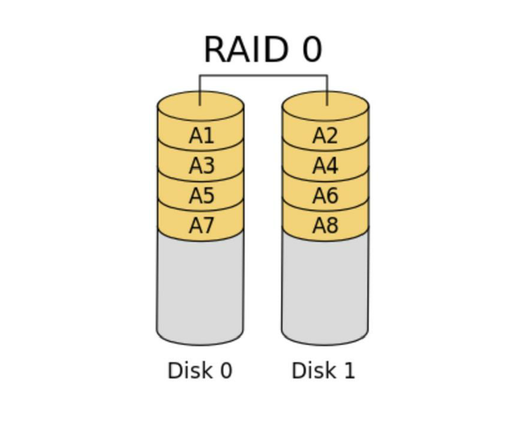

### RAID-1

- RAID-4：在raid-1的基础上增加一个校验盘；多块数据盘异或运算值存于专用校验盘 

```bash 
读性能提升、写性能略有下降 
可用空间：1*min(S1,S2,...) 
有冗余能力 
最少磁盘数：2, 2N 
```

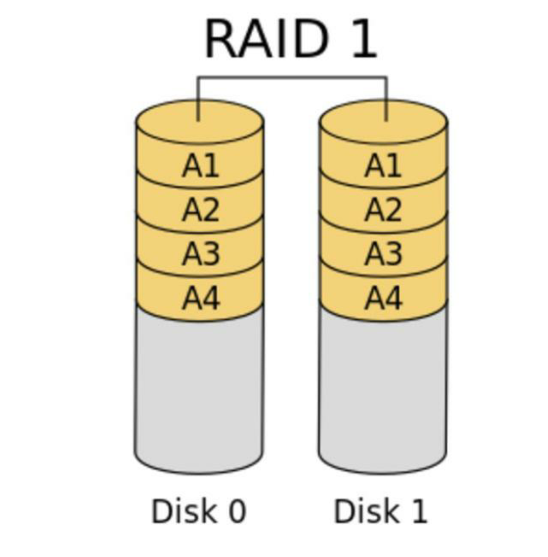


### RAID-5
 
```bash
读、写性能提升 
可用空间：(N-1)*min(S1,S2,...) 
有容错能力：允许最多1块磁盘损坏 
最少磁盘数：3, 3+
```

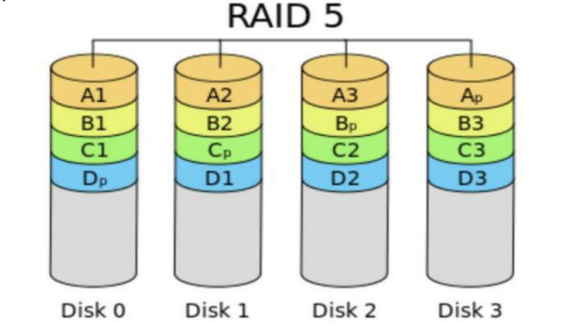

### RAID-6

```bash 
读、写性能提升 
可用空间：(N-2)*min(S1,S2,...) 
有容错能力：允许最多2块磁盘损坏 
最少磁盘数：4, 4+ 
```


### RAID-10

```bash 
读、写性能提升 
可用空间：N*min(S1,S2,...)/2 
有容错能力：每组镜像最多只能坏一块 
最少磁盘数：4, 4+ 
```

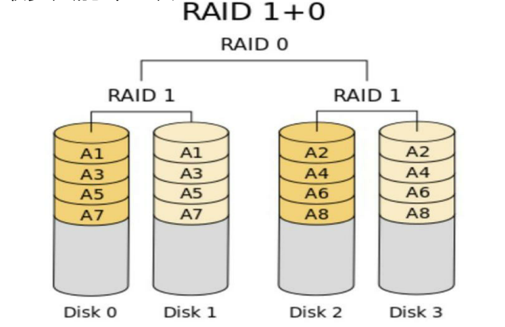 

### RAID-01 
 
多块磁盘先实现RAID0,再组合成RAID1 

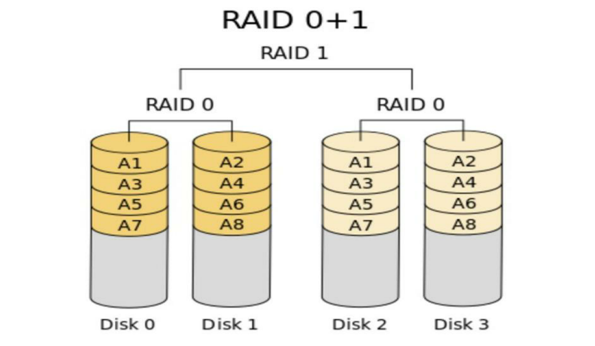


### RAID-50 
 
多块磁盘先实现RAID5,再组合成RAID0 

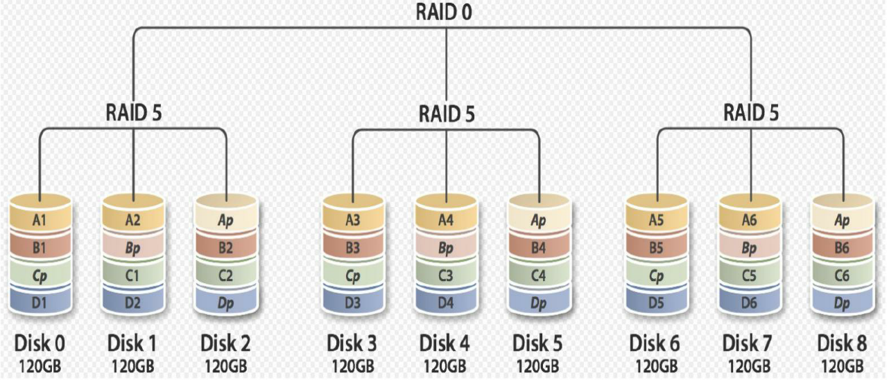

### JBOD：Just a Bunch Of Disks 

```bash
功能：将多块磁盘的空间合并一个大的连续空间使用 
可用空间：sum(S1,S2,...) 
```


### RAID7 

```bash 
可以理解为一个独立存储计算机，自身带有操作系统和管理工具，可以独立
运行，理论上性能最高的RAID模式 
常用级别：RAID-0, RAID-1, RAID-5, RAID-10, RAID-50, JBOD 
```

## 软RAID 

```bash
mdadm：为软RAID提供管理界面 
为空余磁盘添加冗余 
结合内核中的md(multi devices) 
RAID设备可命名为/dev/md0、/dev/md1、/dev/md2、/dev/md3等 
```
 
### 软件RAID的实现 

```bash
mdadm：模式化的工具
命令的语法格式：mdadm [mode] <raiddevice> [options] <component-devices> 
支持的RAID级别：LINEAR, RAID0, RAID1, RAID4, RAID5, RAID6, RAID10  
模式：
    创建：-C 
    装配：-A 
    监控：-F 
    管理：-f, -r, -a 
    <raiddevice>: /dev/md# 
    <component-devices>: 任意块设备 
    -C: 创建模式 
    -n #: 使用#个块设备来创建此RAID 
    -l #：指明要创建的RAID的级别 
    -a {yes|no}：自动创建目标RAID设备的设备文件 
    -c CHUNK_SIZE: 指明块大小,单位k 
    -x #: 指明空闲盘的个数 
    -D：显示raid的详细信息 
mdadm -D /dev/md# 
管理模式： 
    -f: 标记指定磁盘为损坏 
    -a: 添加磁盘 
    -r: 移除磁盘 
观察md的状态： cat /proc/mdstat 
```

### 软RAID配置示例 

```bash
使用mdadm创建并定义RAID设备 
    mdadm -C  /dev/md0 -a yes -l 5 -n 3 -x 1  /dev/sd{b,c,d,e}1 
用文件系统对每个RAID设备进行格式化 
    mkfs.xfs /dev/md0 
测试RAID设备 
使用mdadm检查RAID设备的状况 
    mdadm --detail|D  /dev/md0 
增加新的成员 
    mdadm –G /dev/md0 –n4  -a /dev/sdf1 
```

### 软RAID测试和修复 

```bash
模拟磁盘故障 
    mdadm  /dev/md0  -f  /dev/sda1 
移除磁盘 
    mdadm   /dev/md0 –r /dev/sda1 
从软件RAID磁盘修复磁盘故障 
    •替换出故障的磁盘然后开机 
    •在备用驱动器上重建分区 
    •mdadm  /dev/md0  -a  /dev/sda1 
mdadm、/proc/mdstat及系统日志信息 
```

### 软RAID管理 

```bash
生成配置文件：mdadm –D –s  >> /etc/mdadm.conf 
停止设备：mdadm –S /dev/md0 
激活设备：mdadm –A –s /dev/md0 激活 
强制启动：mdadm –R /dev/md0 
删除raid信息：mdadm --zero-superblock /dev/sdb1 
```

# 九.LVM管理 

## 1.逻辑卷管理器LVM简介 

- LVM允许对卷进行方便操作的抽象层，包括重新设定文件系统的大小 允许在多个物理设备间重新组织文件系统 
- 将设备指定为物理卷 
- 用一个或者多个物理卷来创建一个卷组 
- 物理卷是用固定大小的物理区域（Physical Extent，PE）来定义的 
- 在物理卷上创建的逻辑卷是由物理区域（PE）组成的
- 可以在逻辑卷上创建文件系统

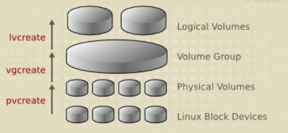

- LVM: Logical Volume Manager， Version 2 
- dm: device mapper，linux中将一个或多个底层块设备组织成一个逻辑设备的模块 
- 设备名：/dev/dm-# 
- 相关的软链接： 

```bash
/dev/mapper/VG_NAME-LV_NAME 
/dev/mapper/vol0-root 
/dev/VG_NAME/LV_NAME 
/dev/vol0/root 
```

- LVM可以弹性的更改LVM的容量 

- 通过交换PE来进行资料的转换，将原来LV内的PE转移到其他的 设备中以降低LV的容量，或将其他设备中的PE加到LV中以容量 
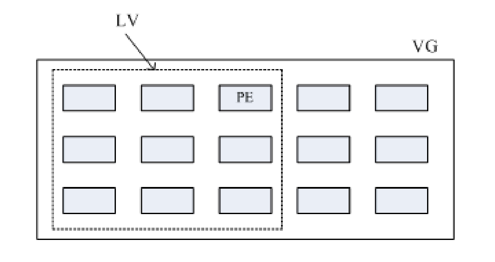

## 2.逻辑卷管理工具

### pv管理工具 

```bash
显示pv信息 
    pvs：简要pv信息显示 
    pvdisplay 
创建pv 
    pvcreate /dev/DEVICE 
删除pv 
    pvremove /dev/DEVICE 
```

### vg管理工具

```bash
显示卷组 
    vgs 
    vgdisplay 
创建卷组 
    vgcreate  [-s #[kKmMgGtTpPeE]] VolumeGroupName  
    PhysicalDevicePath [PhysicalDevicePath...] 
管理卷组 
    vgextend  VolumeGroupName  PhysicalDevicePath [PhysicalDevicePath...] 
    vgreduce  VolumeGroupName  PhysicalDevicePath [PhysicalDevicePath...] 
删除卷组 
    先做pvremove，再做vgremove 
```

### lv管理工具 

```bash
显示逻辑卷 
    lvs 
    Lvdisplay 
创建逻辑卷 
    lvcreate -L #[mMgGtT] -n NAME VolumeGroup 
    lvcreate -l 60%VG -n mylv testvg 
    lvcreate -l 100%FREE -n yourlv testvg 
删除逻辑卷 
    lvremove /dev/VG_NAME/LV_NAME 
重设文件系统大小 
    fsadm [options] resize device [new_size[BKMGTEP]] 
    resize2fs [-f] [-F] [-M] [-P] [-p] device [new_size] 
    xfs_growfs  /mountpoint
```

### 扩展和缩减逻辑卷 

```bash
扩展逻辑卷： 
    lvextend -L [+]#[mMgGtT] /dev/VG_NAME/LV_NAME 
    resize2fs /dev/VG_NAME/LV_NAME 
    lvresize -r -l +100%FREE /dev/VG_NAME/LV_NAME 
缩减逻辑卷： 
    umount /dev/VG_NAME/LV_NAME 
    e2fsck -f /dev/VG_NAME/LV_NAME 
    resize2fs /dev/VG_NAME/LV_NAME #[mMgGtT] 
    lvreduce -L [-]#[mMgGtT] /dev/VG_NAME/LV_NAME 
    mount 
```

### 创建逻辑卷示例 

```bash
创建物理卷 
    pvcreate  /dev/sda3 
为卷组分配物理卷 
    vgcreate  vg0  /dev/sda3 
从卷组创建逻辑卷 
    lvcreate  -L  256M  -n data  vg0 
    mkfs.xfs   /dev/vg0/data 
挂载 
    mount  /dev/vg0/data /mnt/data 
```

### 跨主机迁移卷组 
源计算机上 
1 在旧系统中，umount所有卷组上的逻辑卷 
2 禁用卷组  
    vgchange –a n vg0    
    lvdisplay 
3 导出卷组 
    vgexport vg0  
    pvscan 
    vgdisplay 
    拆下旧硬盘 
在目标计算机上 
    4 在新系统中安装旧硬盘，并导入卷组：vgimport vg0  
    5 vgchange –ay vg0  启用 
    6 mount所有卷组上的逻辑卷 

# 十.LVM快照 

### 逻辑卷管理器快照介绍

- 快照是特殊的逻辑卷，它是在生成快照时存在的逻辑卷的准确拷贝 
- 对于需要备份或者复制的现有数据临时拷贝以及其它操作来说，快照是最合适的选择 
- 快照只有在它们和原来的逻辑卷不同时才会消耗空间 
- 在生成快照时会分配给它一定的空间，但只有在原来的逻辑卷或者快照有所改变才会使用这些空间 
- 当原来的逻辑卷中有所改变时，会将旧的数据复制到快照中 
- 快照中只含有原来的逻辑卷中更改的数据或者自生成快照后的快照中更改的数据 
- 建立快照的卷大小小于等于原始逻辑卷,也可以使用lvextend扩展快照 


### 逻辑卷管理器快照 
- 快照就是将当时的系统信息记录下来，就好像照相一般，若将来有任何数据
改动了，则原始数据会被移动到快照区，没有改动的区域则由快照区和文件
系统
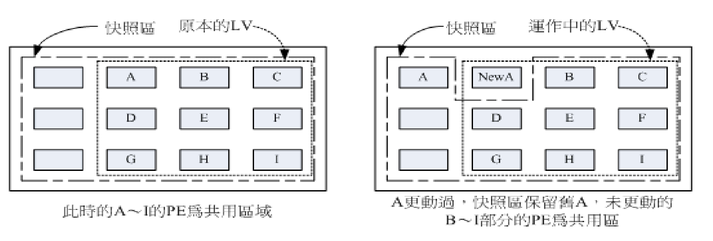
由于快照区与原本的LV共用很多PE的区块，因此快照与被快照的LV必须在同
一个VG中.系统恢复的时候的文件数量不能高于快照区的实际容量 共享 
 
### 使用LVM快照 

```bash
为现有逻辑卷创建快照 
    lvcreate -l 64 -s -n data-snapshot -p r /dev/vg0/data 
挂载快照 
    mkdir  -p  /mnt/snap 
    mount -o ro /dev/vg0/data-snapshot   /mnt/snap 
恢复快照 
    umount /dev/vg0/data-snapshot 
    umount /dev/vg0/data 
    lvconvert --merge /dev/vg0/data-snapshot  
删除快照 
    umount  /mnt/databackup 
    lvremove  /dev/vg0/databackup 
```

# 十一.练习 
1、创建一个至少有两个PV组成的大小为20G的名为testvg的VG；要求PE大小
为16MB, 而后在卷组中创建大小为5G的逻辑卷testlv；挂载至/users目录 
```bash
echo -e "n\np\n\n\n+10G\nt\n\n8e\nw\n" |fdisk /dev/sdb1
echo -e "n\np\n\n\n+10G\nt\n\nfd\nw\n" |fdisk /dev/sdb2
pvcreat /dev/sdb1 /dev/sdb2
vgcreat -s 16M /dev/vg0 /dev/sdb{1,2}
lvcreat -L 5G -n testlv /dev/vg0 
mkfs.ext4 /dev/vg0/testlv
mkdir /users 
mount /dev/vg0/testlv /users 
```
2、 新建用户archlinux，要求其家目录为/users/archlinux，而后su切换至
archlinux用户，复制/etc/pam.d目录至自己的家目录 
```bash
useradd -d /users/archlinux archlinux 
su archlinux
cp -r /etc/pam.d .
```
3、扩展testlv至7G，要求archlinux用户的文件不能丢失 
```bash
lvextend -L 7G /dev/vg0/testlv
resize2fs /dev/vg0/test/lv
```
4、收缩testlv至3G，要求archlinux用户的文件不能丢失 
```bash
umount /dev/vg0/testlv
e2fsck /dev/vg0/testlv -f
resize2fs /dev/vg0/testlv 3G
lvreduce -L 3G /dev/vg0/testlv
mount /dev/vg0/testlv /users

```
5、对testlv创建快照，并尝试基于快照备份数据，验证快照的功能 
```bash
lvcreate -L 1G -s -n snap1 /dev/vg0/testlv1 
umount /users 
lvconvert --merge /dev/vg0/snap1
```