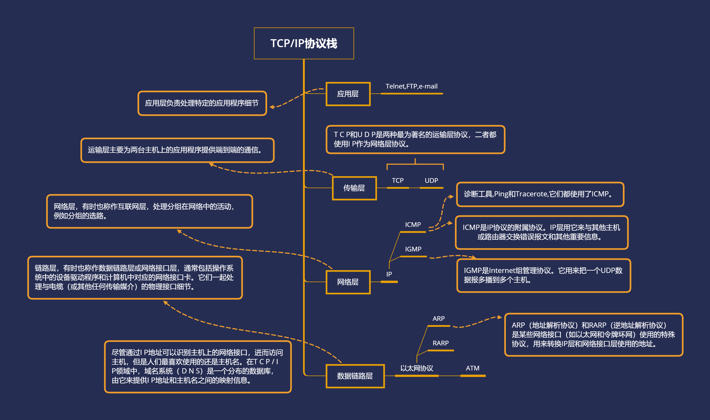
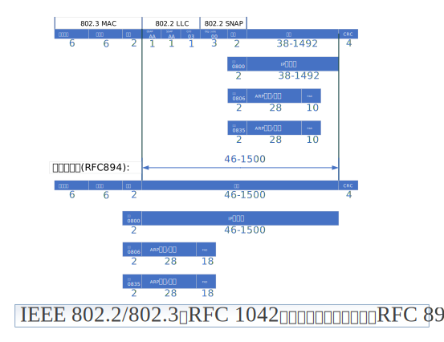

<center> <font face="黑体" size=7 color=grey>Linux网络协议和管理</center>

<center><font face="黑体" size=4 color=grey> </center>


# 一.网络设备基本知识 


# 二.TCP/IP协议栈简介 

## 1.概述



## 2.数据链路层

- 在TCP/IP协议族中，链路层主要有三个目的

```bash
（1）为IP模块发送和接收IP数据报；
（2）为ARP模块发送ARP请求和接收ARP应答；
（3）为RARP发送RARP请求和接收RARP应答。
```
- TCP/IP支持多种不同的链路层协议，这取决于网络所使用的硬件，
&emsp;&emsp;如以 太网、令牌环网、FDDI（光纤分布式数据接口）及RS-232串行线路等。

- IEEE802.2-802.3和以太网的数据帧封装格式


- PPP数据帧的格式


# 五.IP地址规划 

# 六.Linux网络配置详解 

# 七.多网卡绑定技术 

# 八.网桥 

# 九.Linux下测试网络 

# 十.Linux下的网络工具 
