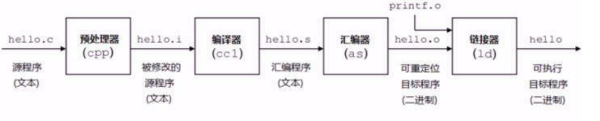
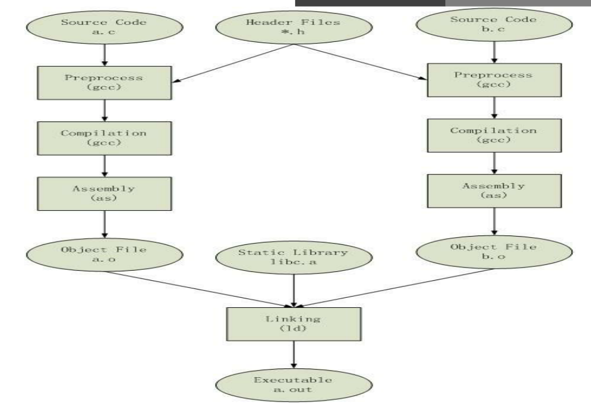
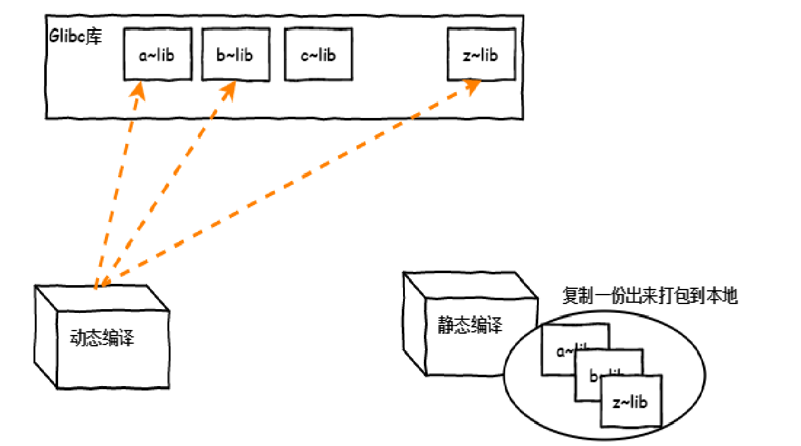
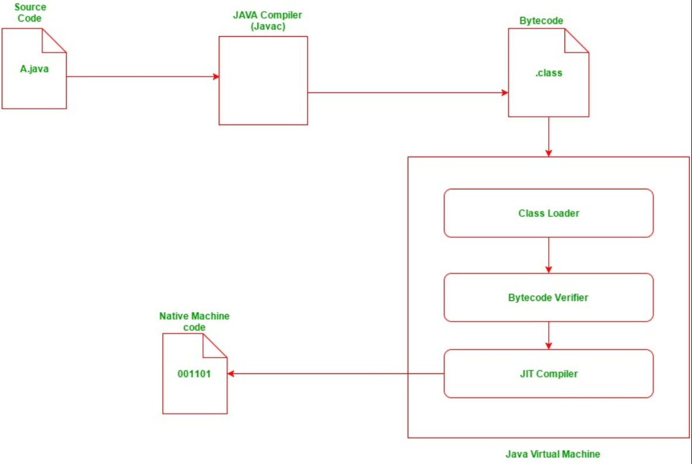

<center><font size=214 face=黑体 color=grey>Linux软件包管理</font></center>


# 五.定制yum仓库 

# 六.dnf管理 

# 七.编译安装 

# 八.Ubuntu软件管理 


# 一.软件运行环境基础 

## 1.gcc编译程序的大致过程 

- gcc 编译程序主要经过四个过程： 

```bash
    处理（Pre-Processing） 
    译 （Compiling） 
    编 （Assembling） 
    接 （Linking） 
```



- 如上图gcc编译过程 

```bash
gcc -E hello.c -o hello.i  
    对hello.c文件进行预处理，生成了hello.i 文件 
gcc -S hello.i -o hello.s  
    对预处理文件进行编译，生成了汇编文件 
gcc -c hello.s -o hello.o  
    对汇编文件进行编译，生成了目标文件 
gcc hello.o -o hello  

gcc hello.c -o hello  
    或者直接编译链接成可执行目标文件 

```

## 2.C程序编译过程




## 3.静态和动态链接 

- 链接主要作用是把各个模块之间相互引用的部分处理好，使得各个模块之间能够正确地衔接，分为静态链接和动态链接 
- 静态链接 

```bash
把程序对应的依赖库复制一份到包 
libxxx.a 
嵌入程序包 
升级难，需重新编译 
占用较多空间，迁移容易 
```

- 动态链接 

```bash
只把依赖加做一个动态链接 
libxxx.so 
连接指向 
占用较少空间，升级方便 
```

- 静态链接和动态链接示意


- Java程序运行示意



# 二.软件包基础 

## 1.包和包管理器 

- 早期只提供.tar.gz的打包的源码文件，用户必须自已编译每个想在
GNU/Linux上运行的软件。用户急需系统能提供一种更加便利的方法来
管理这些软件;当Debian诞生时，这样一个管理工具也就应运而生，它
被命名为dpkg,从而著名的“package”概念第一次出现在GNU/Linux
系统中，在这之后Red Hat才开发自己的“rpm”包管理系统 
- 包的组成  
    二进制文件、库文件、配置文件、帮助文件 
- 程序包管理器：  

```bash
debian： deb文件, dpkg包管理器 
redhat： rpm文件, rpm包管理器 
    rpm：Redhat Package Manager 
    后改名为RPM  Package Manager 
```


## 2.rpm包的命名规则和相关工具 

- 源代码

```bash
    name-VERSION.tar.gz|bz2|xz 
    VERSION: major.minor.release 
```

- rpm包命名方式 

```bash
    name-VERSION-release.arch.rpm  
    例：bash-4.2.46-19.el7.x86_64.rpm 
    VERSION: major.minor.release 
    release：release.OS 
```

- 常见的arch

```bash
    x86: i386, i486, i586, i686 
    x86_64: x64, x86_64, amd64 
    powerpc: ppc 
    跟平台无关：noarch 
```


- 包：分类和拆包 

```bash 
    Application-VERSION-ARCH.rpm: 主包 
    Application-devel-VERSION-ARCH.rpm 开发子包 
    Application-utils-VERSION-ARHC.rpm 其它子包 
    Application-libs-VERSION-ARHC.rpm 其它子包 
    包之间：可能存在依赖关系，甚至循环依赖 
    所以需要解决依赖的包管理工具： 
    yum：rpm包管理器的前端工具 
    apt：deb包管理器前端工具 
    zypper：suse上的rpm前端管理工具 
    dnf：Fedora 18+ rpm包管理器前端管理工具 
```

## 3.库文件 
查看二进制程序所依赖的库文件 
 
ldd /PATH/TO/BINARY_FILE 
管理及查看本机装载的库文件 
 
ldconfig  
 
加载配置文件中指定的库文件 
 
/sbin/ldconfig –p 显示本机已经缓存的所有可用库文件名及文件路径
映射关系 
 
配置文件：/etc/ld.so.conf, /etc/ld.so.conf.d/*.conf 
 
缓存文件：/etc/ld.so.cache 

# 三.rpm包管理器 

## 1.rpm包管理器介绍 

程序包管理器 
------
功能：将编译好的应用程序的各组成文件打包一个或几个程序包文件，从而
方便快捷地实现程序包的安装、卸载、查询、升级和校验等管理操作 

包文件组成 (每个包独有) 
------ 
- RPM包内的文件  
- RPM的元数据，如名称，版本，依赖性，描述等  
- 安装或卸载时运行的脚本 
- 数据库(公共)：/var/lib/rpm 
- -    程序包名称及版本 
- -    依赖关系 
- -    功能说明 
- -    包安装后生成的各文件路径及校验码信

程序包的来源 
------
管理程序包的方式： 
使用包管理器：rpm 
使用前端工具：yum, dnf 

获取程序包的途径： 
------ 
(1) 系统发版的光盘或官方的服务器 
CentOS镜像： 
https://www.centos.org/download/ 
http://mirrors.aliyun.com 
http://mirrors.sohu.com 
http://mirrors.163.com 
(2) 项目官方站点 
(3) 第三方组织： 
Fedora-EPEL： 
Extra Packages for Enterprise Linux 
Rpmforge:RHEL推荐，包很全 
搜索引擎： 
http://pkgs.org 
http://rpmfind.net 
http://rpm.pbone.net 
https://sourceforge.net/ 
(4) 自己制作 
注意：第三方包建议要检查其合法性 
来源合法性,程序包的完整性 

## 2.rpm包管理器使用 
 
### 2.1使用rpm可以实现软件的安装、卸载、升级、查询、校验、数据库维护 

#### 2.1.1安装 

```bash
rpm {-i|--install} [install-options] PACKAGE_FILE…  

    -v: verbose 
    -vv:显示更多信息
    -vvv:显示更更多信息  
    -h: 以#显示程序包管理执行进度 
    rpm -ivh PACKAGE_FILE ...
    [install-options] 
        --test: 测试安装，但不真正执行安装，即dry run模式 
        --nodeps：忽略依赖关系 
        --replacepkgs | replacefiles 
        --nosignature: 不检查来源合法性 
        --nodigest：不检查包完整性 
        --noscripts：不执行程序包脚本 
        %pre: 安装前脚本     --nopre 
        %post: 安装后脚本    --nopost 
        %preun: 卸载前脚本   --nopreun 
        %postun: 卸载后脚本  --nopostun  
```

#### 2.1.2升级 

```bash
rpm {-U|--upgrade} [install-options] PACKAGE_FILE... 
rpm {-F|--freshen} [install-options] PACKAGE_FILE... 
    upgrade：安装有旧版程序包，则“升级” 
             如果不存在旧版程序包，则“安装” 
    freshen：安装有旧版程序包，则“升级” 
             如果不存在旧版程序包，则不执行升级操作 
    rpm -Uvh PACKAGE_FILE ... 
    rpm -Fvh PACKAGE_FILE ... 
        --oldpackage：降级 
```

升级注意项 
------
注意： 
    (1) 不要对内核做升级操作；Linux支持多内核版本并存，因此直接安装新版本内核 
    (2) 如果原程序包的配置文件安装后曾被修改，升级时，新版本提供的同一个配置文件不会直接覆盖老版本的配置文件，而把新版本文件重命名(FILENAME.rpmnew)后保留 


#### 2.1.3包查询 

```bash
rpm {-q|--query} [select-options] [query-options] 

[select-options] 
    -a：所有包 
    -f：查看指定的文件由哪个程序包安装生成 
    -p rpmfile：针对尚未安装的程序包文件做查询操作 
    --whatprovides CAPABILITY：查询指定的CAPABILITY由哪个包所提供 
    --whatrequires CAPABILITY：查询指定的CAPABILITY被哪个包所依赖 
    rpm2cpio 包文件|cpio –itv  预览包内文件 
    rpm2cpio 包文件|cpio –id  “*.conf” 释放包内文件
[query-options] 
    --changelog：查询rpm包的changelog 
    -c：查询程序的配置文件 
    -d：查询程序的文档 
    -i：information 
    -l：查看指定的程序包安装后生成的所有文件 
    --scripts：程序包自带的脚本 
    --provides：列出指定程序包所提供的CAPABILITY 
    -R：查询指定的程序包所依赖的CAPABILITY
```

- 常用查询用法

```bash
    -qi PACKAGE, -qf FILE, -qc PACKAGE, -ql PACKAGE, -qd PACKAGE 
    -qpi PACKAGE_FILE, -qpl PACKAGE_FILE, ... 
    -qa 
包卸载： 
    rpm {-e|--erase} [--allmatches] [--nodeps] [--noscripts] [--notriggers] [--test] PACKAGE_NAME ... 
        当包卸载时，对应的配置文件不会删除， 以FILENAME.rpmsave形式保留 
```

#### 2.1.4包校验 

```bash
rpm {-V|--verify} [select-options] [verify-options] 
    S file Size differs 
    M Mode differs (includes permissions and file type) 
    5 digest (formerly MD5 sum) differs 
    D Device major/minor number mismatch 
    L readLink(2) path mismatch 
    U User ownership differs 
    G Group ownership differs 
    T mTime differs 
    P capabilities differ 
```

#### 2.1.5包校验 

```bash
包来源的合法性验证及完整性验证 
    完整性验证：SHA256 
    来源合法性验证：RSA 

公钥加密 
    对称加密：加密、解密使用同一密钥 
    非对称加密：密钥是成对儿的 
    public key: 公钥，公开所有人 
    secret key: 私钥, 不能公开 

导入所需要公钥 
    rpm  -K|checksig  rpmfile  检查包的完整性和签名 
    rpm --import /etc/pki/rpm-gpg/RPM-GPG-KEY-CentOS-7 
    CentOS 7发行版光盘提供：RPM-GPG-KEY-CentOS-7 
    rpm -qa “gpg-pubkey*” 
```

## 2.rpm数据库

- rpm数据库非常重要，一般不要动

```bash
数据库重建： 
    /var/lib/rpm 
    rpm {--initdb|--rebuilddb} 
    initdb: 初始化 
        如果事先不存在数据库，则新建之;否则，不执行任何操作 
    rebuilddb：重建已安装的包头的数据库索引目录 
```

# 四.yum管理 

## 1.yum介绍

- centos系列的前端包管理器都是使用yum；而CentOS8则是使用dnf,但是在命令表现上任然是yum. 
- YUM: Yellowdog Update Modifier，rpm的前端程序，可解决软件包相关依赖性，可在多个库之间定位软件包，up2date的替代工具  
- yum repository: yum repo，存储了众多rpm包，以及包的相关的元数据
文件（放置于特定目录repodata下） 

## 2.um配置文件 

- yum客户端配置文件： 

```bash 
/etc/yum.conf：为所有仓库提供公共配置 
/etc/yum.repos.d/*.repo：为仓库的指向提供配置 
 
仓库指向的定义： 
    [repositoryID] 
    name=Some name for this repository 
    baseurl=url://path/to/repository/ 
    enabled={1|0} 
    gpgcheck={1|0} 
    gpgkey=URL 
    enablegroups={1|0} 
    failovermethod={roundrobin|priority} 
    roundrobin：意为随机挑选，默认值 
    priority:按顺序访问 
    cost=   默认为1000 

yum的repo配置文件中可用的变量： 
    releasever: 当前OS的发行版的主版本号 
    arch: 平台，i386,i486,i586,x86_64等 
    basearch：基础平台；i386, x86_64 
    YUM0-$YUM9:自定义变量 
示例： 
    http://server/centos/$releasever/$basearch/ 
    http://server/centos/7/x86_64 
    http://server/centos/6/i386
``` 

## 3.yum源 

```bash
阿里云repo文件 
    http://mirrors.aliyun.com/repo/ 
CentOS系统的yum源 
    阿里云：https://mirrors.aliyun.com/centos/$releasever/os/x86_64/  
    清华大学：https://mirrors.tuna.tsinghua.edu.cn/centos/$releasever/os/x86_64/ 
EPEL的yum源 
    阿里云：https://mirrors.aliyun.com/epel/$releasever/x86_64 
阿里巴巴开源软件: https://opsx.alibaba.com/ 
```

## 4.yum-config-manager 

```bash
生成172.16.0.1_cobbler_ks_mirror_CentOS-X-x86_64_.repo 
    yum-config-manager   --add-repo= http://172.16.0.1/cobbler/ks_mirror/7/   
    yum-config-manager --disable “仓库名"  禁用仓库 
    yum-config-manager --enable  “仓库名” 启用仓库
```

## 5.yum命令使用

- 基本用法

```bash
yum [options] [command] [package ...] 
显示仓库列表： 
    yum repolist [all|enabled|disabled] 
显示程序包： 
    yum list 
    yum list [all | glob_exp1] [glob_exp2] [...] 
    yum list {available|installed|updates} [glob_exp1] [...] 
安装程序包： 
    yum install package1 [package2] [...] 
    yum reinstall package1 [package2] [...]  (重新安装) 
升级程序包： 
    yum update [package1] [package2] [...] 
    yum downgrade package1 [package2] [...] (降级) 
检查可用升级： 
    yum check-update 
卸载程序包： 
    yum remove | erase package1 [package2] [...]
```

```bash
查看程序包information： 
    yum info [...] 
查看指定的特性(可以是某文件)是由哪个程序包所提供： 
    yum provides | whatprovides feature1 [feature2] [...] 
清理本地缓存： 
    清除/var/cache/yum/$basearch/$releasever缓存 
    yum clean [ packages | metadata | expire-cache | rpmdb | plugins | all ] 
构建缓存： 
    yum makecache 
搜索
    yum search string1 [string2] [...] 
    以指定的关键字搜索程序包名及summary信息 
查看指定包所依赖的capabilities： 
    yum deplist package1 [package2] [...] 
查看yum事务历史： 
    yum history [info|list|packages-list|packages-info|summary|addon-info|redo|undo| 
    rollback|new|sync|stats] 
    yum history 
    yum history info 6 
    yum history undo 6  
日志 ：/var/log/yum.log 
``` 


```bash
安装及升级本地程序包： 
    yum localinstall rpmfile1 [rpmfile2] [...] 
 (用install替代) 
    yum localupdate rpmfile1 [rpmfile2] [...] 
 (用update替代) 
包组管理的相关命令： 
    yum groupinstall group1 [group2] [...] 
    yum groupupdate group1 [group2] [...] 
    yum grouplist [hidden] [groupwildcard] [...] 
    yum groupremove group1 [group2] [...] 
    yum groupinfo group1 [...] 
```


- yum的命令行选项

```bash
    --nogpgcheck：禁止进行gpg check 
    -y: 自动回答为“yes” 
    -q：静默模式 
    --disablerepo=repoidglob：临时禁用此处指定的repo 
    --enablerepo=repoidglob：临时启用此处指定的repo 
    --noplugins：禁用所有插件
```


## 6.系统光盘yum仓库 

- 系统安装光盘作为本地yum仓库： 

```bash
(1) 挂载光盘至某目录，例如/mnt/cdrom 
    mount /dev/cdrom /mnt/cdrom 
(2) 创建配置文件 
    [CentOS7] 
    name= 
    baseurl= 
    gpgcheck= 
    enabled= 
创建yum仓库： 
    createrepo [options] <directory>
```
