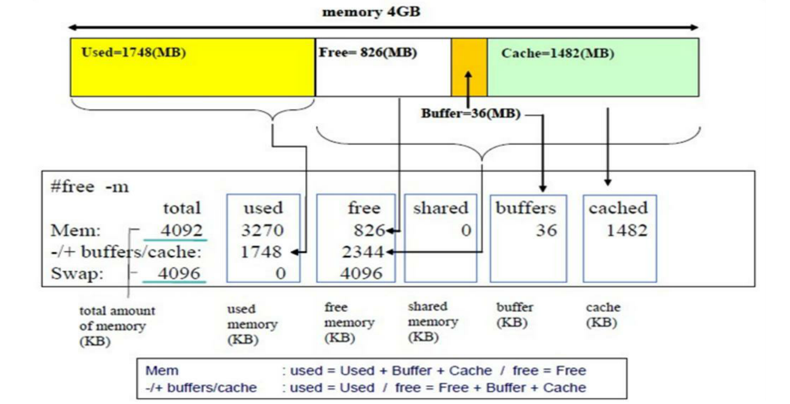

<center> <font face="黑体" size=6 color=grey>Linux系统性能监控和管理</font></center>

## 1.top监控系统进程

- top 命令查看进程时可自定义刷新频率，比较直观
- 用法

```bash
SYNOPSIS
       top -hv|-bcHiOSs -d secs -n max -u|U user -p pid -o fld -w [cols]
[root@centos7 ~]#top
top - 17:39:10 up 23:05,  4 users,  load average: 0.00, 0.01, 0.05
Tasks: 290 total,   1 running, 289 sleeping,   0 stopped,   0 zombie
%Cpu(s):  0.2 us,  0.1 sy,  0.0 ni, 99.8 id,  0.0 wa,  0.0 hi,  0.0 si,  0.0 st
KiB Mem : 71.5/1526208  [|||||||||||||||||||||||||||||||||||||||||               ]
KiB Swap:  0.9/3145724  [                                                        ]

   PID USER      PR  NI    VIRT    RES    SHR S  %CPU %MEM     TIME+ COMMAND
  2152 root      20   0 3605496 183924  32756 S   1.0 12.1   2:05.55 gnome-shell
  2435 root      20   0 1371916  75124   8116 S   0.0  4.9   0:06.11 gnome-softwa+
  1531 root      20   0  419092  69204  31728 S   0.0  4.5   0:08.68 X
  2593 root      20   0  752624  27920   9716 S   0.0  1.8   0:03.07 gnome-termin+
  ...
```

- 对某列信息排序 

```bash
P：以占据的CPU百分比,%CPU 
M：占据内存百分比,%MEM 
T：累积占据CPU时长,TIME+ 
首部信息显示： 
   uptime信息：l命令 
   tasks及cpu信息：t命令 
   cpu分别显示：1 (数字) 
   memory信息：m命令 
退出命令：q 
修改刷新时间间隔：s 
终止指定进程：k 
保存文件：W 
```

- %Cpu(s)栏位信息简介 

```bash
us：用户空间  
sy：内核空间 
ni：调整nice时间 
id：空闲 
wa：等待IO时间 
hi：硬中断  
si：软中断（模式切换） 
st：虚拟机偷走的时间 
```

- 选项

```bash
-d # 指定刷新时间间隔，默认为3秒 
-b 全部显示所有进程 
-n # 刷新多少次后退出 
-H  线程模式，示例：top -H -p `pidof mysqld` 
```

- htop命令：其使用不同的颜色来标识不同的信息，甚至支持鼠标点击相应的选项；来自EPEL源

```bash
选项： 
  -d #: 指定延迟时间； 
  -u UserName: 仅显示指定用户的进程 
  -s COLUME: 以指定字段进行排序 
 进入程序后的子命令： 
  s：跟踪选定进程的系统调用 
  l：显示选定进程打开的文件列表 
  a：将选定的进程绑定至某指定CPU核心 
  t：显示进程树
```

## 2.free命令查看内存空间使用情况

- 用法

```bash
free [OPTION] 

  -b  以字节为单位 
  -m  以MB为单位 
  -g  以GB为单位 
  -h  易读格式 
  -o  不显示-/+buffers/cache行 
  -t   显示RAM + swap的总和 
  -s  n  刷新间隔为n秒 
  -c  n  刷新n次后即退出 

[root@centos7 ~]#free -ht
              total        used        free      shared  buff/cache   available
Mem:           1.5G        829M        139M         55M        522M        432M
Swap:          3.0G         29M        3.0G
Total:         4.5G        858M        3.1G

```

- free命令所显示的各部分图示



## 3.vmstat命令查看虚拟内存信息

```bash
[root@centos8 ~]#vmstat
procs -----------memory---------- ---swap-- -----io---- -system-- ------cpu-----
 r  b   swpd   free   buff  cache   si   so    bi    bo   in   cs us sy id wa st
 1  0 351744 221400     48 310228    0    3    12    10   96  123  0  1 99  0  0
```

- 分栏说明

```bash
procs
  r：可运行（正运行或等待运行）进程的个数，和核心数有关 
  b：处于不可中断睡眠态的进程个数(被阻塞的队列的长度) 
memory
  swpd: 交换内存的使用总量  
  free：空闲物理内存总量 
  buffer：用于buffer的内存总量 
  cache：用于cache的内存总量 
swap
  si：从磁盘交换进内存的数据速率(kb/s) 
  so：从内存交换至磁盘的数据速率(kb/s) 
io
  bi：从块设备读入数据到系统的速率(kb/s) 
  bo: 保存数据至块设备的速率 
system
  in: interrupts  中断速率，包括时钟 
  cs: context switch  进程切换速率 
cpu
  us:Time spent running non-kernel code 
  sy: Time spent running kernel code 
  id: Time spent idle. Linux 2.5.41前,包括IO-wait time. 
  wa: Time spent waiting for IO.  2.5.41前，包括in idle. 
  st: Time stolen from a virtual machine.  2.6.11前, unknown. 
选项
  -s: 显示内存的统计数据
```

```bash
[root@centos8 ~]#vmstat -s
      1601624 K total memory
      1070076 K used memory
       304720 K active memory
       355440 K inactive memory
       220684 K free memory
           48 K buffer memory
       310816 K swap cache
      3145724 K total swap
       351488 K used swap
      2794236 K free swap
        23953 non-nice user cpu ticks
          283 nice user cpu ticks
        51189 system cpu ticks
     15032629 idle cpu ticks
          450 IO-wait cpu ticks
        22150 IRQ cpu ticks
         9239 softirq cpu ticks
            0 stolen cpu ticks
      1831057 pages paged in
      1529731 pages paged out
        15528 pages swapped in
       103783 pages swapped out
     14519323 interrupts
     18668588 CPU context switches
   1572022693 boot time
       175270 forks
```

## 4.使用iostat统计CPU和设备IO信息

- iostat # 指定刷新频率为#秒刷新一次

```bash
[root@centos8 ~]#iostat
Linux 4.18.0-80.el8.x86_64 (centos8.suosuoli)   10/26/19        _x86_64_        (4 CPU)

avg-cpu:  %user   %nice %system %iowait  %steal   %idle
           0.16    0.00    0.55    0.00    0.00   99.29

Device             tps    kB_read/s    kB_wrtn/s    kB_read    kB_wrtn
nvme0n1           1.64        48.17        40.38    1830027    1534327
scd0              0.00         0.03         0.00       1106          0
```

## 5.iftop显示带宽使用情况

```bash
                  12.5Kb            25.0Kb             37.5Kb            50.0Kb       62.5Kb
└─────────────────┴─────────────────┴──────────────────┴─────────────────┴──────────────────centos8.suosuoli                 => 172.20.1.1                       1.70Kb  1.77Kb  1.97Kb
                                 <=                                   184b    258b    299b
centos8.suosuoli                 => public1.alidns.com                284b    343b    318b
                                 <=                                   592b    690b    628b
224.0.0.251                      => 172.20.1.156                        0b      0b      0b
                                 <=                                     0b    275b    172b
172.20.255.255                   => 172.20.2.20                         0b      0b      0b
                                 <=                                     0b    187b    117b
172.20.255.255                   => 172.20.30.30                        0b      0b      0b
                                 <=                                     0b     58b     36b
255.255.255.255                  => 172.20.2.20                         0b      0b      0b


────────────────────────────────────────────────────────────────────────────────────────────TX:             cum:   4.57KB   peak:   2.81Kb              rates:   1.98Kb  2.10Kb  2.28Kb
RX:                    2.49KB           4.09Kb                        776b   1.47Kb  1.24Kb
TOTAL:                 7.06KB           6.90Kb                       2.74Kb  3.57Kb  3.53Kb
```

## 6.pmap显示某进程对应的内存映射

- 用法

```bash
pmap [options] pid [...] 
  -x: 显示详细格式的信息 
示例：pmap 1 
man pmap
```

```bash
[root@centos8 ~]#pmap 2762   # gvfsd进程的进程号为2762
2762:   /usr/libexec/gvfsd
0000562abe7ef000     32K r-x-- gvfsd
0000562abe9f6000      4K r---- gvfsd
0000562abe9f7000      4K rw--- gvfsd
0000562abfa5b000    532K rw---   [ anon ]
00007f4cc4000000    132K rw---   [ anon ]
00007f4cc4021000  65404K -----   [ anon ]
......
00007f4cfc567000    160K r-x-- ld-2.28.so
00007f4cfc769000     48K rw---   [ anon ]
00007f4cfc78d000      8K rw---   [ anon ]
00007f4cfc78f000      4K r---- ld-2.28.so
00007f4cfc790000      4K rw--- ld-2.28.so
00007f4cfc791000      4K rw---   [ anon ]
00007ffd2793d000    132K rw---   [ stack ]
00007ffd279db000     12K r----   [ anon ]
00007ffd279de000      8K r-x--   [ anon ]
ffffffffff600000      4K r-x--   [ anon ]
 total           855884K
```

## 7.dstat命令用来统计系统资源(代替vmstat和iostat)

- dstat命令：系统资源统计,代替vmstat,iostat 
- 用法

```bash
dstat [-afv] [options..] [delay [count]] 
  -c 显示cpu相关信息 
  -C #,#,...,total 
  -d 显示disk相关信息 
  -D total,sda,sdb,... 
  -g 显示page相关统计数据 
  -m 显示memory相关统计数据 
  -n 显示network相关统计数据 
  -p 显示process相关统计数据 
  -r 显示io请求相关的统计数据 
  -s 显示swapped相关的统计数据 
  --tcp 
  --udp 
  --unix 
  --raw 
  --socket  
  --ipc 
  --top-cpu：显示最占用CPU的进程 
  --top-io: 显示最占用io的进程 
  --top-mem: 显示最占用内存的进程 
  --top-latency: 显示延迟最大的进程 

[root@centos7 ~]#dstat
You did not select any stats, using -cdngy by default.
----total-cpu-usage---- -dsk/total- -net/total- ---paging-- ---system--
usr sys idl wai hiq siq| read  writ| recv  send|  in   out | int   csw
  0   0 100   0   0   0|  34k 6742B|   0     0 |  34B  395B| 111   177
  0   1  99   0   0   0|   0  3000k| 180B  826B|   0     0 | 406   188
  0   0 100   0   0   0|   0     0 | 120B  346B|   0     0 |  90   154
  0   0 100   0   0   0|   0     0 | 300B  338B|   0     0 |  76   125
  0   0 100   0   0   0|   0     0 | 240B  338B|   0     0 |  89   151
  0   0 100   0   0   0|   0     0 | 180B  338B|   0     0 | 114   169
  0   0 100   0   0   0|   0     0 |  60B  338B|   0     0 |  63   127
  0   0 100   0   0   0|   0     0 | 120B  338B|   0     0 |  69   129
```

## 8.iotop命令用来监视磁盘I/O使用状况

- iotop命令是一个用来监视磁盘I/O使用状况的top类工具iotop具有与top相似的UI，其中包括
PID、用户、I/O、进程等相关信息，可查看每个进程是如何使用IO 
iotop命令是一个用来监视磁盘I/O使用状况的top类工具iotop具有与top相似的UI，其中包括
PID、用户、I/O、进程等相关信息，可查看每个进程是如何使用IO 


- iotop输出解释

```bash
第一行：Read和Write速率总计 
第二行：实际的Read和Write速率 
第三行：参数如下： 
  线程ID（按p切换为进程ID） 
  优先级 
  用户 
  磁盘读速率 
  磁盘写速率 
  swap交换百分比 
  IO等待所占的百分比 
  线程/进程命令 

-o, --only只显示正在产生I/O的进程或线程，除了传参，可以在运行过程中按o
生效 
-b, --batch非交互模式，一般用来记录日志 
-n NUM, --iter=NUM设置监测的次数，默认无限。在非交互模式下很有用 
-d SEC, --delay=SEC设置每次监测的间隔，默认1秒，接受非整形数据例如1.1 
-p PID, --pid=PID指定监测的进程/线程 
-u USER, --user=USER指定监测某个用户产生的I/O 
-P, --processes仅显示进程，默认iotop显示所有线程 
-a, --accumulated显示累积的I/O，而不是带宽 
-k, --kilobytes使用kB单位，而不是对人友好的单位。在非交互模式下，脚本编程有用 
-t, --time 加上时间戳，非交互非模式 
-q, --quiet 禁止头几行，非交互模式，有三种指定方式 
-q 只在第一次监测时显示列名 
-qq 永远不显示列名 
-qqq 永远不显示I/O汇总 

交互按键 
left和right方向键：改变排序 
r：反向排序 
o：切换至选项--only 
p：切换至--processes选项 
a：切换至--accumulated选项 
q：退出 
i：改变线程的优先级
```

## 9.nload命令查看网络实时吞吐量 

- nload是一个实时监控网络流量和带宽使用情况，以数值和动态图展示进出的流量情况 

- 安装：yum  install nload (EPEL源) 
- 界面操作

```bash
上下方向键、左右方向键、enter键或者tab键都就可以切换查看多个网卡的流量情况 
按 F2 显示选项窗口 
按 q 或者 Ctrl+C 退出 nload
```

- 示例：

```bash
  nload：默认只查看第一个网络的流量进出情况 
  nload eth0 eth1：在nload后面指定网卡，可以指定多个 
设置刷新间隔：默认刷新间隔是100毫秒，可通过 -t命令设置刷新时间（单位是毫秒） 
  nload -t 500 eth0 
设置单位：显示两种单位一种是显示Bit/s、一种是显示Byte/s，默认是以Bit/s，也可不显示/s 
  -u h|b|k|m|g|H|B|K|M|G 
  表示的含义： 
    h: auto
    b: Bit/s
    k: kBit/s
    m: MBit/s
    H:auto
    B: Byte/s
    K: kByte/s
    M: MByte/s 
  nload -u M eth0 
```

## 10.lsof命令用来查看当前系统文件

- lsof：list open files查看当前系统文件的工具。在linux环境下，一切皆文件，用户通过文件不仅可以
访问常规数据，还可以访问网络连接和硬件如传输控制协议 (TCP) 和用户数据报协议 (UDP)套接字等，系统
在后台都为该应用程序分配了一个文件描述符。

- 用法

```bash
SYNOPSIS
       lsof [ -?abChlnNOPRtUvVX ] [ -A A ] [ -c c ] [ +c c ] [ +|-d d ] [ +|-D D
       ] [ +|-e s ] [ +|-f [cfgGn] ] [ -F [f] ] [ -g [s] ] [ -i [i] ] [ -k k ] [
       -K  k  ]  [  +|-L  [l]  ]  [ +|-m m ] [ +|-M ] [ -o [o] ] [ -p s ] [ +|-r
       [t[m<fmt>]] ] [ -s [p:s] ] [ -S [t] ] [ -T [t] ] [ -u s ] [ +|-w ]  [  -x
       [fl] ] [ -z [z] ] [ -Z [Z] ] [ -- ] [names]

-a：列出打开文件存在的进程 
-c<进程名>：列出指定进程所打开的文件 
-g：列出GID号进程详情 
-d<文件号>：列出占用该文件号的进程 
+d<目录>：列出目录下被打开的文件 
+D<目录>：递归列出目录下被打开的文件 
-i<条件>：列出符合条件的进程(4、6、协议、:端口、 @ip ) 
-p<进程号>：列出指定进程号所打开的文件 
-u：列出UID号进程详情 
-h：显示帮助信息
-v：显示版本信息。 
-n:  不反向解析网络名字 
查看由登陆用户启动而非系统启动的进程 
  lsof /dev/pts/1 
指定进程号，可以查看该进程打开的文件 
  lsof -p 9527  
查看指定程序打开的文件 
  lsof -c httpd 
查看指定用户打开的文件 
  lsof -u root | more
查看指定目录下被打开的文件 
  lsof +D /var/log/  
  lsof +d /var/log/   
参数+D为递归列出目录下被打开的文件，参数+d为列出目录下被打开的文件 
```

- lsof示例 

```bash
查看所有网络连接 
  lsof -i –n 
  lsof -i@127.0.0.1  
  通过参数-i查看网络连接的情况，包括连接的ip、端口等以及一些服务的连接情况，例如：sshd等。也可以通过
指定ip查看该ip的网络连接情况 

查看端口连接情况 
  lsof -i :80 -n 
  通过参数-i:端口可以查看端口的占用情况，-i参数还有查看协议，ip的连接情况等
 
查看指定进程打开的网络连接 
  lsof -i –n -a -p 9527  
  参数-i、-a、-p等，-i查看网络连接情况，-a查看存在的进程，-p指定进程 
查看指定状态的网络连接 
  lsof -n -P -i TCP -s TCP:ESTABLISHED  
  -n:no host names, -P:no port names,-i TCP指定协议，-s指定协议状态通过多个参数可以
清晰的查看网络连接情况、协议连接情况等

恢复删除文件 
  lsof |grep /var/log/messages 
  rm -f /var/log/messages 
  lsof |grep /var/log/messages 
  cat /proc/653/fd/6 
  cat /proc/653/fd/6 > /var/log/messages 