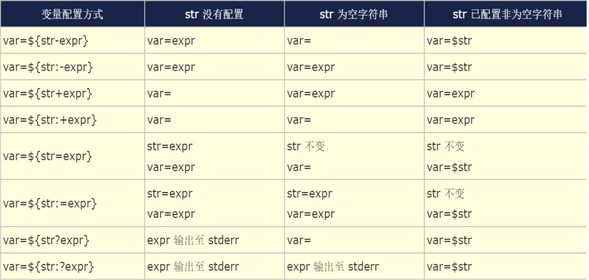

<center> <font face="黑体" size=6 color=grey>Shell脚本编程进阶</font></center>

# 一.循环

## 1.for循环

- 定义

```bash
for VAR in LIST; do
    Do something here...
done
```

- for循环中LIST列表的生成方式

(1) 直接给出列表
(2) 整数列表：
```bash
    (a) {start..end}
        for VAR in {0..9}; do
            echo $VAR
        done
    (b) $(seq [start [step]] end)
        for VAR in seq 9; do
            echo $VAR
        done
```
(3) 使用可以返回列表的命令
```bash
    $(COMMAND)
        for VAR in "$(ls -l ~)"; do
            echo "$VAR"
        done
```
(4) 使用glob，如：*.sh
```bash
        for VAR in *.sh; do
            echo "$VAR"
        done
```

(5) 变量引用
```bash
    $@,$*
        for VAR in $@; do
            echo "$VAR"
        done
```

- for特殊格式定义及使用
```bash
for ((控制变量初始化;条件判断表达式;控制变量的修正表达式)); do
    循环体
done
eg:
    for ((i=0 ; i < 10 ; i++)); do
        echo i=$i
    done
```

## 2.while循环

- while循环定义
```bash
while CONDITION; do
    Do something here...
done
```

## 3.until循环 
```bash
until CONDITION; do
    Do something here...
done
```

## 4.循环控制语句continu

- continue [N]:提前结束第N层的**本轮循环**，而直接进入下一轮判断；最内层为第1层

```bash
while CONDTIITON1; do
    CMD1
    ...
    if CONDITION2; then
        continue
    fi
    CMD
    ...
done
```

## 5.循环控制语句break

- break [N]:提前**结束第N层循环**，最内层为第1层  
```bash
while CONDTIITON1; do
    CMD1
    ...
    if CONDITION2; then
        break
    fi
    CMDn
    ... 
done 
```

## 6.循环控制shift命令

- shift [n]:用于将参量列表 list 左移指定次数，缺省为左移一次。
- 参量列表 list 一旦被移动，最左端的那个参数就从列表中删除。while 循环遍
历位置参量列表时，常用到 shift
./shfit.sh a b c d e f g h
```bash
################
#!/bin/bash
# shift.sh
while [[ $# -gt 0 ]]; do
    echo $1
    shift
done
################
[root@centos7 /data/test]#bash shift.sh a b C d E f g H
a
b
C
d
E
f
g
H
```

## 7.while特殊用法

- while循环的特殊用法（遍历文件的每一行）
```bash
while read line; do
    Do something here...
done < /PATH/FROM/SOMEFILE
```
- 上面的用法会依次读取/PATH/FROM/SOMEFILE文件中的每一行，且将行赋值给变量line
在循环体中对其进行处理。

- 练习
扫描/etc/passwd文件每一行，如发现GECOS字段为空，则将用户名和单位电话为62985600
填充至GECOS字段，并提示该用户的GECOS信息修改成功
```bash
#!/bin/bash
USER=
TELE=
while read line; do
    Do something here...
    sed -nr 's#::#:'''$USER''' 62985600:#' w /tmp/passwd.tmp
done < /etc/passwd

```


## 8.select循环与菜单
```bash
select variable in list  
do  
    Do something here...
done
```
- select循环主要用于创建菜单，按数字顺序排列的菜单项将显示在标准错误上，并显示PS3提示符，等待用户输入
- 用户输入菜单列表对应的某个数字，执行相应的命令
- 用户输入被保存在内置变量**REPLY**中
- **注意:**select是个无限循环，因此要记住用break命令退出循环，或用exit命令终止脚本。也可以按Ctrl+c退出循环
- select经常和case联合使用


# 二.信号捕捉

## 信号捕捉trap 
- trap '触发指令' 信号 
进程收到系统发出的指定信号后，将执行自定义指令，而不会执行原操作 
- trap ' ' 信号 
忽略信号的操作 
- trap '-' 信号 
恢复原信号的操作 
- trap -p
列出自定义信号操作 
 trap finish EXIT  
当脚本退出时，执行finish函数

## trap示例
```bash
#!/bin/bash
trap 'echo "signal:SIGINT"'  int  
trap -p
for((i=0;i<=10;i++))
do
    sleep 1 
    echo $i 
done
trap '' int  
trap -p 
for((i=11;i<=20;i++)) 
do 
    sleep 1
    echo $i
done
trap '-'  int  
trap -p 
for((i=21;i<=30;i++)) 
do 
    sleep 1 
    echo $i 
done 
```

# 三.函数

## 1.定义函数

- 函数由两部分组成：函数名和函数体
- 帮助:help function
- 语法一：
```bash
f_name()
{
    ...function body... 
}
```
- 语法二：function 为定义函数的关键字,不使用圆括号
```bash
function f_name
{
    ...function body...
}  
```
- 语法三：function 为定义函数的关键字,使用圆括号
```bash
function f_name()
{
    ...function body...
}  
```

## 2.函数使用 

- 函数的定义和使用：

  - 可在交互式环境下定义函数
  - 可将函数放在脚本文件中作为它的一部分
  - 可放在只包含函数的单独文件中
- 调用：函数只有被调用才会执行
- 调用：给定函数名
- 函数名出现的地方，会被自动替换为函数代码
- 函数的生命周期：被调用时创建，返回时终止
```bash
#!/bin/bash
#*******************************************************************************
#Author:            steveli
#QQ:                1049103823
#Data:              2019-10-31
#FileName:          func.sh
#URL:               https://blog.csdn.net/YouOops
#Description:       func.sh
#Copyright (C):     2019 All rights reserved
#*******************************************************************************
#Fontcolor#red(31):green(32):yellow(33):blue(34):purple(35):cyan(36):white(37)
#Backcolor#red(41):green(42):yellow(43):blue(44):purple(45):cyan(46):white(47)
#*******************************************************************************
#
fun1()
{
    echo This is fun1.
    sleep 1
}
fun2()
{
    echo This is fun2.
    sleep 1
}
main()
{
    echo Now main func is running... 
    sleep 1
    fun1
    fun2
}
main
[root@centos7 /data/test]#bash func.sh 
Now main func is running...
This is fun1.
This is fun2.
```

## 3.函数返回值 

- 函数的执行结果返回值： 
  - (1) 使用echo等命令进行输出 
  - (2) 函数体中调用命令的输出结果 
- 注意:函数的退出状态码不是函数的返回值，退出状态为函数最后的命令的退出状态
而不是函数体中对数据处理的返回值。1
  - (1) 默认取决于函数中执行的最后一条命令的退出状态码
  - (2) 自定义退出状态码，其格式为： 
  ```bash
  return  从函数中返回，用最后状态命令决定返回值
  return 0  无错误返回
  return 1-255  有错误返回
  ```


## 4.交互式环境下定义和使用函数 

- 示例：

```bash
dir() {
> ls -l
> }
```

- 定义该函数后，可以在命令行引用其，其显示结果同ls -l的作用相同
```bash
[root@centos7 ~]#dir (){
> ls -l
> }
[root@centos7 ~]#dir  # 引用dir函数
total 136
-rw-r--r--   1 root root    10 Oct 30 09:03 1.txt
-rw-r--r--   1 root root    10 Oct 30 09:04 2.txt
lrwxrwxrwx.  1 root root    19 Sep 24 16:27 apachctl -> /usr/sbin/apachectl
drwxr-xr-x.  2 root root    27 Oct  9 12:32 bin
drwxr-xr-x.  2 root root     6 Sep 20 15:08 Desktop
drwxr-xr-x.  2 root root     6 Sep 20 15:05 Documents
drwxr-xr-x.  2 root root     6 Sep 20 15:05 Downloads
-rw-r--r--   1 root root   809 Oct 28 16:36 function_list
drwxr-xr-x   5 root root   231 Oct 18 14:05 gibMacOS
-rw-r--r--.  1 root root  2056 Sep 25 09:52 initial-setup-ks.cfg
drwxr-xr-x  21 root root  4096 Oct 12 13:57 log
-rw-r--r--   1 root root   629 Oct 30 09:10 merge.sh
drwxr-xr-x.  2 root root     6 Sep 20 15:05 Music
drwxr-xr-x.  2 root root     6 Sep 20 15:05 Pictures
drwxr-xr-x.  2 root root     6 Sep 20 15:05 Public
-rw-r--r--   1 root root  9027 Oct 12 15:24 reset00.sh
drwxr-xr-x.  2 root root     6 Sep 20 15:05 Templates
drwxr-xr-x  16 root root   297 Oct 28 22:09 testdir
-rw-r--r--.  1 root root 15502 Sep 22 20:18 user-home.png
-rw-r--r--.  1 root root 83424 Sep 22 20:30 user-trash.png
drwxr-xr-x.  2 root root     6 Sep 20 15:05 Videos
```
- 该dir函数将一直保留到用户从系统退出，或执行了如下所示的unset命令 
> unset dir  


## 5.在脚本中定义及使用函数 
函数在使用前必须定义，因此应将函数定义放在脚本开始部分，直至shell首次发现它
后才能使用 
调用函数仅使用其函数名即可 
示例： 
cat func1 
#!/bin/bash 
# func1 
hello() 
{ 
  echo "Hello there today's date is `date +%F`" 
} 
echo "now going to the function hello" 
hello 
echo “back from the function” 


## 6.使用函数文件 
可以将经常使用的函数存入函数文件，然后将函数文件载入shell 
文件名可任意选取，但最好与相关任务有某种联系。例如：functions.main 
一旦函数文件载入shell，就可以在命令行或脚本中调用函数。可以使用set命
令查看所有定义的函数，其输出列表包括已经载入shell的所有函数 
若要改动函数，首先用unset命令从shell中删除函数。改动完毕后，再重新载
入此文件 

## 7.载入函数 
函数文件已创建好后，要将它载入shell 
定位函数文件并载入shell的格式 
  
.  
filename 或 source   filename   
注意：此即<点> <空格> <文件名> 
 这里的文件名要带正确路径 
示例： 
 
上例中的函数，可使用如下命令 
      
. functions.main 

## 8.执行shell函数 
要执行函数，简单地键入函数名即可 
示例： 
 
findit groups 
  
/usr/bin/groups 
   
/usr/local/backups/groups.bak  

## 9.删除shell函数 
现在对函数做一些改动后，需要先删除函数，使其对shell不可用。使用unset命
令完成删除函数 
命令格式为： 
 
unset  function_name 
示例： 
 
 unset findit 
 
再键入set命令，函数将不再显示 
环境函数 
使子进程也可使用 
声明：export  -f  function_name  
查看：export  -f 或 declare -xf 

## 10.函数参数 
函数可以接受参数： 
 
传递参数给函数：调用函数时，在函数名后面以空白分隔给定参数列表即可；
例如“testfunc arg1 arg2 ...” 
 
在函数体中当中，可使用$1, $2, ...调用这些参数；还可以使用$@, $*, $#
等特殊变量 

## 11.函数变量 
变量作用域： 
 
环境变量：当前shell和子shell有效 
 
本地变量：只在当前shell进程有效，为执行脚本会启动专用子shell进程；
因此，本地变量的作用范围是当前shell脚本程序文件，包括脚本中的函数 
 
局部变量：函数的生命周期；函数结束时变量被自动销毁 
注意：如果函数中有局部变量，如果其名称同本地变量，使用局部变量 
在函数中定义局部变量的方法 
 
local NAME=VALUE 

## 12.函数递归示例 
函数递归： 
 
函数直接或间接调用自身 
 
注意递归层数 
递归实例： 
    阶乘是基斯顿·卡曼于 1808 年发明的运算符号，是数学术语，一个正整数的阶
乘（factorial）是所有小于及等于该数的正整数的积，并且有0的阶乘为1，自然
数n的阶乘写作n! 
 
n!=1×2×3×...×n 
 
阶乘亦可以递归方式定义：0!=1，n!=(n-1)!×n 
 
n!=n(n-1)(n-2)...1 
 
n(n-1)! = n(n-1)(n-2)! 


## 13.函数递归示例 
示例：fact.sh 
#!/bin/bash 
# 
fact() { 
    if [ $1 -eq 0 -o $1 -eq 1 ]; then 
 
 
echo 1 
    else 
 
 
echo $[$1*$(fact $[$1-1])] 
    fi 
} 
fact $1 


## 14.fork炸弹 
fork炸弹是一种恶意程序，它的内部是一个不断在fork进程的无限循环，实质是
一个简单的递归程序。由于程序是递归的，如果没有任何限制，这会导致这个
简单的程序迅速耗尽系统里面的所有资源 
函数实现 
    :(){ :|:& };: 
    bomb() { bomb | bomb & }; bomb 
脚本实现 
    cat Bomb.sh 
    #!/bin/bash 
   ./$0|./$0& 


# 四.数组

## 1.数组 
变量：存储单个元素的内存空间 
数组：存储多个元素的连续的内存空间，相当于多个变量的集合 
数组名和索引 
 
索引：编号从0开始，属于数值索引 
 
注意：索引可支持使用自定义的格式，而不仅是数值格式，即为关联索引，
bash4.0版本之后开始支持 
 
bash的数组支持稀疏格式（索引不连续） 
声明数组： 
 
declare -a ARRAY_NAME 
 
declare -A ARRAY_NAME   关联数组 
 
注意：两者不可相互转换 

## 2.数组赋值 
数组元素的赋值 
 
(1) 一次只赋值一个元素 
 
ARRAY_NAME[INDEX]=VALUE 
 
weekdays[0]="Sunday" 
 
weekdays[4]="Thursday" 
 
(2) 一次赋值全部元素 
 
ARRAY_NAME=("VAL1" "VAL2" "VAL3" ...) 
 
(3) 只赋值特定元素 
 
ARRAY_NAME=([0]="VAL1" [3]="VAL2" ...) 
 
(4) 交互式数组值对赋值  
 
read -a ARRAY 
显示所有数组：declare  -a

## 3.引用数组 
引用数组元素 
 
${ARRAY_NAME[INDEX]} 
 
注意：省略[INDEX]表示引用下标为0的元素 
引用数组所有元素 
 
${ARRAY_NAME[*]} 
 
${ARRAY_NAME[@]} 
数组的长度(数组中元素的个数) 
 
${#ARRAY_NAME[*]} 
 
${#ARRAY_NAME[@]} 
删除数组中的某元素：导致稀疏格式 
 
unset ARRAY[INDEX] 
删除整个数组 
 
unset ARRAY

## 4.数组数据处理 
引用数组中的元素： 
 
数组切片： 
 
 
${ARRAY[@]:offset:number} 
 
 
 
offset  
要跳过的元素个数 
 
 
 
number 
要取出的元素个数 
 
 
取偏移量之后的所有元素  
 

${ARRAY[@]:offset} 
向数组中追加元素： 
 
ARRAY[${#ARRAY[*]}]=value 
关联数组： 
 
declare -A ARRAY_NAME   
 
 
ARRAY_NAME=([idx_name1]='val1' [idx_name2]='val2‘...) 
 
注意：关联数组必须先声明再调用 

## 5.示例 
- 生成10个随机数保存于数组中，并找出其最大值和最小值 
 
    #!/bin/bash 
declare -i min max 
declare -a nums 
for ((i=0;i<10;i++));do 
 nums[$i]=$RANDOM 
 [ $i -eq 0  ] && min=${nums[$i]} &&  max=${nums[$i]}&& continue 
 [ ${nums[$i]} -gt $max ] && max=${nums[$i]}  
 [ ${nums[$i]} -lt $min ] && min=${nums[$i]}  
done 
echo “All numbers are ${nums[*]}” 
echo Max is $max 
echo Min is $min 

- 编写脚本，定义一个数组，数组中的元素对应的值是/var/log目录下所有以.log结尾
的文件；统计出其下标为偶数的文件中的行数之和 
 
#!/bin/bash 
 
# 
 
declare -a files 
 
files=(/var/log/*.log) 
 
declare -i lines=0 
 
for i in $(seq 0 $[${#files[*]}-1]); do 
 
    if [ $[$i%2] -eq 0 ];then 
 
 
let lines+=$(wc -l ${files[$i]} | cut -d' ' -f1)  
 
    fi 
 
done 
 
echo "Lines: $lines." 


## 6.练习 
输入若干个数值存入数组中，采用冒泡算法进行升序或降序排序 
将下图所示，实现转置矩阵matrix.sh 
 
1 2 3    
 
1 4 7 
 
4 5 6   ===>   
2 5 8 
 
7 8 9    
 
3 6 9 
打印杨辉三角形 

# 五.高级字符串操作

${#var}:返回字符串变量var的长度 
${var:offset}:返回字符串变量var中从第offset个字符后（不包括第offset个字符）的字
符开始，到最后的部分，offset的取值在0 到 ${#var}-1 之间(bash4.2后，允许为负值) 
${var:offset:number}：返回字符串变量var中从第offset个字符后（不包括第offset个
字符）的字符开始，长度为number的部分 
${var:  -length}：取字符串的最右侧几个字符 
 
注意：冒号后必须有一空白字符 
${var:offset:-length}：从最左侧跳过offset字符，一直向右取到距离最右侧lengh个字
符之前的内容 
${var:  -length:-offset}：先从最右侧向左取到length个字符开始，再向右取到距离最
右侧offset个字符之间的内容 
 
注意：-length前空格 

基于模式取子串 
 
${var#*word}：其中word可以是指定的任意字符 
 
功能：自左而右，查找var变量所存储的字符串中，第一次出现的word, 删
除字符串开头至第一次出现word字符串（含）之间的所有字符 
 
 
${var##*word}：同上，贪婪模式，不同的是，删除的是字符串开头至最后
一次由word指定的字符之间的所有内容 
示例： 
 
file=“var/log/messages” 
 
${file#*/}: log/messages 
 
${file##*/}: messages 

${var%word*}：其中word可以是指定的任意字符 
 
功能：自右而左，查找var变量所存储的字符串中，第一次出现的word, 删
除字符串最后一个字符向左至第一次出现word字符串（含）之间的所有字符 
 
file="/var/log/messages" 
 
${file%/*}: /var/log 
${var%%word*}：同上，只不过删除字符串最右侧的字符向左至最后一次出现
word字符之间的所有字符 
示例： 
 
url=http://www.magedu.com:80 
 
${url##*:} 
80 
 
${url%%:*} http 


查找替换 
 
${var/pattern/substr}：查找var所表示的字符串中，第一次被pattern所匹
配到的字符串，以substr替换之 
 
${var//pattern/substr}: 查找var所表示的字符串中，所有能被pattern所匹
配到的字符串，以substr替换之 
 
${var/#pattern/substr}：查找var所表示的字符串中，行首被pattern所匹
配到的字符串，以substr替换之 
 
${var/%pattern/substr}：查找var所表示的字符串中，行尾被pattern所匹
配到的字符串，以substr替换之 

查找并删除 
 
${var/pattern}：删除var表示的字符串中第一次被pattern匹配到的字符串 
 
${var//pattern}：删除var表示的字符串中所有被pattern匹配到的字符串 
 
${var/#pattern}：删除var表示的字符串中所有以pattern为行首匹配到的
字符串 
 
${var/%pattern}：删除var所表示的字符串中所有以pattern为行尾所匹配
到的字符串 
字符大小写转换 
 
${var^^}：把var中的所有小写字母转换为大写 
 
${var,,}：把var中的所有大写字母转换为小写 


# 六.高级变量
## 1.高级变量赋值 


## 2.高级变量用法-有类型变量 
Shell变量一般是无类型的，但是bash Shell提供了declare和typeset两个命令
用于指定变量的类型，两个命令是等价的 
declare [选项] 变量名 
-r 声明或显示只读变量 
-i 将变量定义为整型数 
-a 将变量定义为数组 
-A 将变量定义为关联数组 
-f 显示已定义的所有函数名及其内容 
-F 仅显示已定义的所有函数名 
-x 声明或显示环境变量和函数 
-l  声明变量为小写字母  declare –l var=UPPER 
-u  声明变量为大写字母 declare –u var=lower 

## 3.eval命令 
eval命令将会首先扫描命令行进行所有的置换，然后再执行该命令。该命令
适用于那些一次扫描无法实现其功能的变量.该命令对变量进行两次扫描 
示例： 
[root@server ~]# CMD=whoami 
[root@server ~]# echo  $CMD 
 whoami 
[root@server ~]# eval $CMD 
 root  
    [root@server ~]# n=10         
    [root@server ~]# echo {0..$n}      
    
{0..10} 
    [root@server ~]# eval echo {0..$n} 
     
0 1 2 3 4 5 6 7 8 9 10 

## 4.间接变量引用 
如果第一个变量的值是第二个变量的名字，从第一个变量引用第二个变量的值
就称为间接变量引用 
variable1的值是variable2，而variable2又是变量名，variable2的值为value，
间接变量引用是指通过variable1获得变量值value的行为 
 
variable1=variable2 
 
variable2=value 

- bash Shell提供了两种格式实现间接变量引用 
 eval tempvar=\$$variable1 
 tempvar=${!variable1} 
示例： 
[root@server ~]# N=NAME 
[root@server ~]# NAME=wangxiaochun 
[root@server ~]# N1=${!N} 
[root@server ~]# echo $N1 
wangxiaochun 
[root@server ~]# eval N2=\$$N 
[root@server ~]# echo $N2 
wangxiaochun 

## 5.创建临时文件 
mktemp命令：创建并显示临时文件，可避免冲突 
mktemp [OPTION]... [TEMPLATE] 
 
TEMPLATE: filenameXXX 
 
 
X至少要出现三个 
OPTION： 
  
-d: 创建临时目录 
 
-p DIR或--tmpdir=DIR：指明临时文件所存放目录位置 
示例： 
 
mktemp /tmp/testXXX 
 
tmpdir=`mktemp –d /tmp/testdirXXX` 
 
mktemp  --tmpdir=/testdir  testXXXXXX 

## 6.安装复制文件 
install命令： 
       install [OPTION]... [-T] SOURCE DEST 单文件 
       install [OPTION]... SOURCE... DIRECTORY 
       install [OPTION]... -t DIRECTORY SOURCE... 
       install [OPTION]... -d DIRECTORY...创建空目录 
选项： 
 
-m MODE，默认755 
 
-o OWNER 
 
-g GROUP 
示例： 
 
install -m 700 -o wang -g admins srcfile desfile 
 
install –m 770 –d /testdir/installdir  


# 七.expect

## 1.expect介绍 
expect 是由Don Libes基于Tcl（ Tool Command Language ）语言开发的，主
要应用于自动化交互式操作的场景，借助 expect 处理交互的命令，可以将交互过
程如：ssh登录，ftp登录等写在一个脚本上，使之自动化完成。尤其适用于需要对
多台服务器执行相同操作的环境中，可以大大提高系统管理人员的工作效率 

## 2.expect命令用法
expect 语法： 
  
expect [选项] [ -c cmds ] [ [ -[f|b] ] cmdfile ] [ args ] 
选项 
-c：从命令行执行expect脚本，默认expect是交互地执行的 
   
示例：expect -c 'expect "\n" {send "pressed enter\n"} 
-d：可以输出输出调试信息 
   
示例：expect  -d ssh.exp 
expect中相关命令 
spawn 启动新的进程 
send 
用于向进程发送字符串 
expect 从进程接收字符串 
interact 
允许用户交互 
exp_continue 匹配多个字符串在执行动作后加此命令 
expect最常用的语法(tcl语言:模式-动作) 
单一分支模式语法： 
expect “hi” {send “You said hi\n"} 
匹配到hi后，会输出“you said hi”，并换行 
多分支模式语法： 
 
expect "hi" { send "You said hi\n" } \ 
  
 
"hehe" { send "Hehe yourself\n" } \ 
 
 
"bye" { send "Good bye\n" } 
匹配hi,hello,bye任意字符串时，执行相应输出。等同如下： 
 
expect { 
 
 
"hi" { send "You said hi\n"} 
 
 
"hehe" { send "Hehe yourself\n"} 
 
 
"bye" { send  " Good bye\n"} 
 
} 

- 示例 
```bash
#!/usr/bin/expect 
spawn scp /etc/fstab 192.168.8.100:/app 
expect { 
        "yes/no" { send "yes\n";exp_continue } 
        "password" { send  "magedu\n" } 
} 
expect eof
```
```bash
#!/usr/bin/expect 
spawn ssh 192.168.8.100 
expect { 
        "yes/no" { send "yes\n";exp_continue } 
        "password" { send  "magedu\n" } 
} 
interact 
#expect eof
```
```bash
#!/usr/bin/expect 
set ip 192.168.8.100 
set user root 
set password magedu 
set timeout 10 
spawn ssh $user@$ip 
expect { 
        "yes/no" { send "yes\n";exp_continue } 
        "password" { send "$password\n" } 
} 
interact 
```
```bash
#!/usr/bin/expect 
set ip [lindex $argv 0]  
set user [lindex $argv 1] 
set password [lindex $argv 2] 
spawn ssh $user@$ip 
expect { 
        "yes/no" { send "yes\n";exp_continue } 
        "password" { send "$password\n" } 
} 
interact 
#./ssh3.exp 192.168.8.100 root magedu 
```
```bash
#!/usr/bin/expect 
set ip [lindex $argv 0]  
set user [lindex $argv 1] 
set password [lindex $argv 2] 
set timeout 10 
spawn ssh $user@$ip 
expect { 
        "yes/no" { send "yes\n";exp_continue } 
        "password" { send "$password\n" } 
} 
expect "]#" { send "useradd haha\n" } 
expect "]#" { send "echo magedu |passwd --stdin haha\n" } 
send "exit\n" 
expect eof 
#./ssh4.exp 192.168.8.100 root magedu 
```
```bash
#!/bin/bash 
ip=$1  
user=$2 
password=$3 
expect <<EOF 
set timeout 20 
spawn ssh $user@$ip 
expect { 
        "yes/no" { send "yes\n";exp_continue } 
        "password" { send "$password\n" } 
} 
expect "]#" { send "useradd hehe\n" } 
expect "]#" { send "echo magedu |passwd --stdin hehe\n" } 
expect "]#" { send "exit\n" } 
expect eof 
EOF  
#./ssh5.sh 192.168.8.100 root magedu 
```

# 八.练习

> 1.判断/var/目录下所有文件的类型

法一：

```bash
#!/bin/sh 
for i in $(find /var) ;do  
    if [ -b $i ];then
        echo "$i是块设备"  
    elif [ -c $i ] ;then   
        echo "$i是字符设备" 
    elif [ -f $i ];then   
        echo "$i是普通文件"  
    elif [ -h $i ];then   
        echo "$i是符号链接文件"  
    elif [ -p $i ];then   
        echo "$i是管道文件"  
    elif [ -S $i ];then   
        echo "$i是套接字文件"  
    elif [ -d $i ];then   
        echo "$i是目录文件"  
    else 
        echo "文件或目录不存在"  
    fi 
done 
exit 0
```

法二：

```bash
#!/bin/bash
#
#*******************************************************************************
#Author:            steveli
#QQ:                1049103823
#Data:              2019-10-27
#FileName:          indicate_file_type.sh
#URL:               https://blog.csdn.net/YouOops
#Description:       indicate_file_type.sh
#Copyright (C):     2019 All rights reserved
#*******************************************************************************
#Fontcolor#red(31):green(32):yellow(33):blue(34):purple(35):cyan(36):white(37)
#Backcolor#red(41):green(42):yellow(43):blue(44):purple(45):cyan(46):white(47)
#*******************************************************************************
#
GREEN="\e[32m"
CYAN="\e[36m"
END="\e[0m"
indicate ()
{
NUM=$#
declare -i J=0
if [ -f /tmp/mid ]; then
    : > /tmp/mid
fi
echo "$*" | tr -s " " "\n" >> /tmp/mid
exec 6< /tmp/mid
for ((j=0 ; j<=$NUM ; j++)); do
while read -u 6 I; do
        let J+=1
        if [ -d $I ]; then
            echo -e "File $i is a ${GREEN}dir${END}." > /tmp/dir.log
        else
            C=$(echo $(ls -l $I) | cut -c1)
            if [[ "$C" = "-" ]]; then
                echo -e  "File $i is a normal file." > /tmp/normal.log
            #elif [[ "$C" = "d" ]]; then
            #    echo "File$J is a directory."
            elif [[ "$C" = "b" ]]; then
                echo -e  "File $i is a block device file." > /tmp/block.log
            elif [[ "$C" = "c" ]]; then
                echo -e  "File $i is a character device file." > /tmp/char.log
            elif [[ "$C" = "l" ]]; then
                echo -e  "File $i is a ${CYAN}symble link${END}." > /tmp/symble.log
            elif [[ "$C" = "p" ]]; then
                echo -e  "File $i is a pipe."
            elif [[ "$C" = "s" ]]; then
                echo -e  "File $i is a socket."
            else
                echo "File or dir not exists."
            fi  
        fi  
done
done
}

main()
{
echo "Indicating..."
for i in `find /var/` ; do
    indicate $i
done
echo "Done."
}

main

```

> 2.添加10个用户user1-user10，密码为8位随机字符

```bash
#!/bin/bash
#
#*******************************************************************************
#Author:            steveli
#QQ:                1049103823
#Data:              2019-10-28
#FileName:          add_10_user.sh
#URL:               https://blog.csdn.net/YouOops
#Description:       add_10_user.sh
#Copyright (C):     2019 All rights reserved
#*******************************************************************************
#Fontcolor#red(31):green(32):yellow(33):blue(34):purple(35):cyan(36):white(37)
#Backcolor#red(41):green(42):yellow(43):blue(44):purple(45):cyan(46):white(47)
#*******************************************************************************
#
. /etc/init.d/functions
# success
# failure
# passed
# warning

for ((i=1 ; i<=10 ; i++)); do
    if id user${i} &> /dev/null; then
        echo user$i exists.
        continue
    else
        useradd user$i 
        PASS=` echo $RANDOM | md5sum | cut -c1-8`
        echo $PASS | passwd --stdin user$i &> /dev/null
        echo "user$i created.`success`"
    fi  
done

```

> 3./etc/rc.d/rc3.d目录下分别有多个以K开头和以S开头的文件；分别读取每个文件，以
K开头的输出为文件加stop，以S开头的输出为文件名加start，如K34filename stop  
S66filename start

```bash
#!/bin/bash
#
#*******************************************************************************
#Author:            steveli
#QQ:                1049103823
#Data:              2019-10-28
#FileName:          srffix_start_stop.sh
#URL:               https://blog.csdn.net/YouOops
#Description:       srffix_start_stop.sh
#Copyright (C):     2019 All rights reserved
#*******************************************************************************
#Fontcolor#red(31):green(32):yellow(33):blue(34):purple(35):cyan(36):white(37)
#Backcolor#red(41):green(42):yellow(43):blue(44):purple(45):cyan(46):white(47)
#*******************************************************************************
#

for FILE in `ls /etc/rc.d/rc3.d`; do
    SIGN=`echo $FILE | cut -c1`
    if [[ "S" = "$SIGN" ]]; then
        #echo "\"$FILE\" add suffix is \"$FILE stop\"."
        echo "$FILE start"
    elif [[ "K" = "$SIGN" ]]; then
        #echo "\"$FILE\" add suffix is \"$FILE start\"."
        echo "$FILE stop"
    else
        echo "Wrong."
    fi  
done
```

> 4.编写脚本，提示输入正整数n的值，计算1+2+…+n的总和

```bash
#!/bin/bash
read -p "please input a unsigned int:" N
SUM=0
for ((i=1 ; i <= N ; i++)); do
    let SUM+=i
done
echo Sum is $SUM

```

> 5.计算100以内所有能被3整除的整数之和

```bash
#!/bin/bash
SUM=0
read -p "input a unsigned int:" N
for ((i=0 ; i <= $N ; i++)); do
    if [[ $(($i%3)) -eq 0 ]]; then
        let SUM+=i
    fi
done
echo "Sum is $SUM."
```

> 6.编写脚本，提示请输入网络地址，如192.168.0.0，判断输入的网段中主机在线状态 

```bash
#!/bin/bash
#
#*******************************************************************************
#Author:            steveli
#QQ:                1049103823
#Data:              2019-10-28
#FileName:          ping_specific_network.sh
#URL:               https://blog.csdn.net/YouOops
#Description:       ping_specific_network.sh
#Copyright (C):     2019 All rights reserved
#*******************************************************************************
#Fontcolor#red(31):green(32):yellow(33):blue(34):purple(35):cyan(36):white(37)
#Backcolor#red(41):green(42):yellow(43):blue(44):purple(45):cyan(46):white(47)
#*******************************************************************************
#
. /etc/init.d/functions
# success
# failure
# passed
# warning

NET="192.168"

for ((i=1 ; i <= 255 ; i++)); do
    for ((j=1 ; j <= 255 ; j++)); do
        if ping -W1 -c1 ${NET}.${i}.$j &> /dev/null ; then
            echo "Host ${NET}.$i.$j is UP. `success`"
        else
            echo "Host ${NET}.$i.$j is DOWN. `warning`"
        fi  
    done
done

```

> 7.打印九九乘法表 

```bash
#!/bin/bash
#
#*******************************************************************************
#Author:                        steveli
#QQ:                            1049103823
#Data:                      2019-10-28
#FileName:                  2_9X9.sh
#URL:                   https://blog.csdn.net/YouOops
#Description:           2_9X9.sh
#Copyright (C):     2019 All rights reserved
#*******************************************************************************
#Fontcolor#red(31):green(32):yellow(33):blue(34):purple(35):cyan(36):white(37)
#Backcolor#red(41):green(42):yellow(43):blue(44):purple(45):cyan(46):white(47)
#*******************************************************************************
#

#1x1=1
#2x1=2   2x2=4
#3x1=3   3x2=6   3x3=9


for i in {1..9}; do 
    for j in $(seq $i); do
    let RESULT=$(($i*$j))
       # for k in "3 4"; do
       #     if [[ $i -eq $k ]] && [[ $j -eq 2 ]]; then
       #         echo -en "|${i}x$j=$RESULT   "
       #     fi
       # done
    echo -en "|${i}x$j=$RESULT\t"
    done
    echo
done
```

> 8.在/testdir目录下创建10个html文件,文件名格式为数字N（从1到10）加随机8个字母，
如：1AbCdeFgH.html 

```bash
#!/bin/bash
#
#*******************************************************************************
#Author:            steveli
#QQ:                1049103823
#Data:              2019-10-28
#FileName:          create_random_file_name.sh
#URL:               https://blog.csdn.net/YouOops
#Description:       create_random_file_name.sh
#Copyright (C):     2019 All rights reserved
#*******************************************************************************
#Fontcolor#red(31):green(32):yellow(33):blue(34):purple(35):cyan(36):white(37)
#Backcolor#red(41):green(42):yellow(43):blue(44):purple(45):cyan(46):white(47)
#*******************************************************************************
#

#1AbCdeFgH.html 

for ((i=1 ; i <= 10 ; i++)); do
    mkdir -p ~/testdir/$i$(cat /dev/random | tr -cd [:alpha:]  | head -c8).html
done
```

> 9.打印等腰三角形 

```bash
#!/bin/bash
#
#*******************************************************************************
#Author:                        steveli
#QQ:                            1049103823
#Data:                      2019-10-28
#FileName:                  print_equicrural_triangle.sh
#URL:                   https://blog.csdn.net/YouOops
#Description:           print_equicrural_triangle.sh
#Copyright (C):     2019 All rights reserved
#*******************************************************************************
#Fontcolor#red(31):green(32):yellow(33):blue(34):purple(35):cyan(36):white(37)
#Backcolor#red(41):green(42):yellow(43):blue(44):purple(45):cyan(46):white(47)
#*******************************************************************************
#
#RANDOM_SEED=$(($RANDOM%7))
#COLOR="\e[1;$((${RANDOM_SEED}+31))m"
COL_END="\e[0m"
read -p "Input the size of triangle:" N
while sleep 0.1; do
tput clear
for ((i=0 ; i < N ; i++)); do
    for ((j=N ; j >= i ; j--)); do
        echo -n " "
    done
    for ((j=0 ; j <= i ; j++)); do
        COLOR="\e[1;5;$((${RANDOM_SEED}+31))m"
        echo -ne "${COLOR}*${COL_END}"
        echo -n " "
        RANDOM_SEED=$(($RANDOM%7))
    done
    echo 
done
tput cup 0 0
done
```

10、猴子第一天摘下若干个桃子，当即吃了一半，还不瘾，又多吃了一个。第二天早上
又将剩下的桃子吃掉一半，又多吃了一个。以后每天早上都吃了前一天剩下的一半零一
个。到第10天早上想再吃时，只剩下一个桃子了。求第一天共摘了多少？

```bash
#!/bin/bash
#
#*******************************************************************************
#Author:                        steveli
#QQ:                            1049103823
#Data:                      2019-10-28
#FileName:                  monk_eat_peach.sh
#URL:                   https://blog.csdn.net/YouOops
#Description:           monk_eat_peach.sh
#Copyright (C):     2019 All rights reserved
#*******************************************************************************
#Fontcolor#red(31):green(32):yellow(33):blue(34):purple(35):cyan(36):white(37)
#Backcolor#red(41):green(42):yellow(43):blue(44):purple(45):cyan(46):white(47)
#*******************************************************************************
#
LAST=1
for (( I=1 ; I<=9 ; I++ )); do
let LAST=$(( LAST + 1 ))*2
done
echo $LAST
```

> 11.编写脚本，利用变量RANDOM生成10个随机数字，输出这个10数字，并显示其中的最大值和最小值

```bash
#!/bin/bash
i=0
MAX=$RANDOM
MIN=$RANDOM
while [[ $i -lt 10 ]]; do
    if (( MAX >= MIN )); then
        :
    else
        MID=$MAX
        MAX=$MIN
        MIN=$MID
    fi  
    let i++
done
echo MAX=$MAX
echo MIN=$MIN
```
> 12.编写脚本，实现打印国际象棋棋盘 

```bash

```

> 13.后续六个字符串：efbaf275cd、4be9c40b8b、44b2395c46、f8c8873ce0、b902c16c8b、
ad865d2f63是通过对随机数变量RANDOM随机执行命令：echo $RANDOM|md5sum|cut –c1-10
后的结果，请破解这些字符串对应的RANDOM值

```bash

```

> 14.

```bash

```

```bash

```
```bash

```
```bash

```
```bash

```

> 编写服务脚本/root/bin/testsrv.sh，完成如下要求 
(1) 脚本可接受参数：start, stop, restart, status  
(2) 如果参数非此四者之一，提示使用格式后报错退出 
(3) 如是start:则创建/var/lock/subsys/SCRIPT_NAME, 并显示“启动成功” 
考虑：如果事先已经启动过一次，该如何处理？ 
(4) 如是stop:则删除/var/lock/subsys/SCRIPT_NAME, 并显示“停止完成” 
考虑：如果事先已然停止过了，该如何处理？ 
(5) 如是restart，则先stop, 再start 
考虑：如果本来没有start，如何处理？ 
(6) 如是status, 则如果/var/lock/subsys/SCRIPT_NAME文件存在，则显示“SCRIPT_NAME is 
running...”，如果/var/lock/subsys/SCRIPT_NAME文件不存在，则显示“SCRIPT_NAME is 
stopped...” 
(7)在所有模式下禁止启动该服务，可用chkconfig 和 service命令管理 
说明：SCRIPT_NAME为当前脚本名 

```bash
#!/bin/bash
#
#*******************************************************************************               
#Author:            steveli
#QQ:                1049103823
#Data:              2019-10-29
#FileName:          testsrv.sh
#URL:               https://blog.csdn.net/YouOops
#Description:       testsrv.sh
#Copyright (C):     2019 All rights reserved
#*******************************************************************************
#Fontcolor#red(31):green(32):yellow(33):blue(34):purple(35):cyan(36):white(37)
#Backcolor#red(41):green(42):yellow(43):blue(44):purple(45):cyan(46):white(47)
#*******************************************************************************
#

COLOR_GREEN="\e[1;32m"
COLOR_RED="\e[1;31m"
COLOR_END="\e[0m"
DIR="/var/lock/subsys"
SCR="service"

. /etc/init.d/functions
# success
# failure
# passed
# warning

if [[ ! $1 ]]; then
    echo -e "Usage:`basename $0` {${COLOR_GREEN}start|stop|restart|status${COLOR_END}}"
fi

start()
    {
    if [[ ! -f $DIR/`basename $0` ]]; then
        mkdir -p $DIR &> /dev/null
        touch $DIR/`basename $0` &> /dev/null
        echo "Start Succeeded.`success`"
    else
        echo "Already Started.`passed`"
    fi  
    }
stop()
    {
    if [[ -f $DIR/`basename $0` ]]; then
        rm $DIR/`basename $0` &> /dev/null
        echo "Stop completed."
    else
        echo "Already Stopped.`passed`"
    fi
    }

restart()
    {
    if [[ -f $DIR/`basename $0` ]]; then
        rm $DIR/`basename $0` &> /dev/null
        sleep 0.5
        touch $DIR/`basename $0` &> /dev/null
        echo "Restart Succeeded.`success`"
    else
        echo "It's Stopped.Now starting...`passed`"
        touch $DIR/`basename $0` &> /dev/null
        sleep 0.5
        echo "Start Succeeded.`success`"
    fi
    }

status()
    {
    if [[ -f $DIR/`basename $0` ]]; then
        echo -e "`basename $0` is active.${COLOR_GREEN}[RUNNING]${COLOR_END}"
    else
        echo -e "`basename $0` is inactive.${COLOR_RED}[STOPPED]${COLOR_END}" 
    fi
    }
case $1 in
start)
    start
    ;;
stop)
    stop
    ;;
restart)
    restart
    ;;
status)
    status
    ;;
*) 
    if [[ $1 ]]; then
    echo -e "Usage:`basename $0` {${COLOR_GREEN}start|stop|restart|status${COLOR_END}}"
    else 
    :
    fi
    ;;
esac 
```

> 编写脚本/root/bin/copycmd.sh 
(1) 提示用户输入一个可执行命令名称 
(2) 获取此命令所依赖到的所有库文件列表 
(3) 复制命令至某目标目录(例如/mnt/sysroot)下的对应路径下  
     如：/bin/bash ==> /mnt/sysroot/bin/bash;/usr/bin/passwd ==> /mnt/sysroot/usr/bin/passwd 
(4) 复制此命令依赖到的所有库文件至目标目录下的对应路径下：  如：/lib64/ld-linux-x86-64.so.2 ==> /mnt/sysroot/lib64/ld-linux-x86-64.so.2 
(5)每次复制完成一个命令后，不要退出，而是提示用户键入新的要复制的命令，并重复完成上述功能；直到用户输入
quit退出

```bash
#. /etc/init.d/functions
# success
# passed
# wrning
# failure

COLOR_GREEN="\e[1;32m"
COLOR_END="\e[0m"
DEST_DIR="/mnt/sysroot"
while :; do
read -p "Please input the command you wanna move(q:quit):" CMD 
    if [[ "$CMD" = "q" ]]; then
        exit
    fi  
    CMD_FULL_PATH=`which --skip-alias $CMD`
    #echo CMD_FULL_PATH=$CMD_FULL_PATH
    CMD_DESTDIR=`dirname $CMD_FULL_PATH`
    #echo CMD_DESTDIR=$CMD_DESTDIR
    CMD_MOVED=`basename $CMD_FULL_PATH`
    #echo CMD_MOVED=$CMD_MOVED
    if [[ ! -d ${DEST_DIR}${CMD_DESTDIR} ]]; then
        mkdir -p ${DEST_DIR}${CMD_DESTDIR} &> /dev/null
    else
        cp -a $CMD_FULL_PATH ${DEST_DIR}$CMD_DESTDIR
    fi  

    SO_LIST=`ldd "$CMD_FULL_PATH" | sed -nr 's#.* (/.*) .*#\1#p'`
    for SO_FILE in $SO_LIST; do
        SO_FULL_PATH=`echo $SO_FILE`
        SO_DESTDIR=`dirname $SO_FILE`
        SO_REAL=$(basename `ls -l $SO_FILE | sed -nr 's#.* (.*)#\1#p'`)
        if [[ ! -d ${DEST_DIR}${SO_DESTDIR} ]]; then
            mkdir -p ${DEST_DIR}${SO_DESTDIR} &> /dev/null
        else
            cp -a ${SO_DESTDIR}/${SO_REAL} ${DEST_DIR}${SO_DESTDIR}
#            echo "$SO_FILE -> ${SO_DESTDIR}${SO_REAL} moved to ${DEST_DIR}${SO_DESTDIR}." 
        fi  
    done
    echo -e "Command ${COLOR_GREEN}$CMD${COLOR_END} and corresponding libs moved to dir /mnt/sysroot/"
done
```

> 斐波那契数列又称黄金分割数列，因数学家列昂纳多·斐波那契以兔子繁殖为例子而引入，故又称为“兔子数列”，指的
是这样一个数列：0、1、1、2、3、5、8、13、21、34、……，斐波纳契数列以如下被以递归的方法定义：
F（0）=0，F（1）=1，F（n）=F(n-1)+F(n-2)（n≥2） 利用函数，求n阶斐波那契数列.

```bash

#!/bin/bash
#
#*******************************************************************************
#Author:            steveli
#QQ:                1049103823
#Data:              2019-10-28
#FileName:          Fibonacci.sh
#URL:               https://blog.csdn.net/YouOops
#Description:       Fibonacci.sh
#Copyright (C):     2019 All rights reserved
#*******************************************************************************
#Fontcolor#red(31):green(32):yellow(33):blue(34):purple(35):cyan(36):white(37)
#Backcolor#red(41):green(42):yellow(43):blue(44):purple(45):cyan(46):white(47)
#*******************************************************************************
#

#f(n)=f(n-1) + f(n-2)

fibonacci()
{
local a=0
local b=1
LENGTH="$1"
    for ((i=0 ; i<LENGTH ; i++)); do
        echo "$a"
        let fa=$((a+b))
        let a=$b
        let b=$fa
    done
}

fibonacci $1
```
