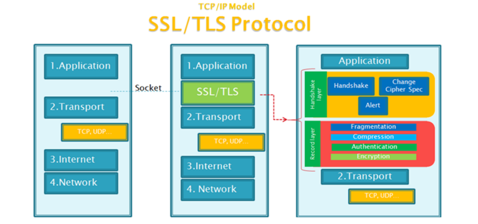
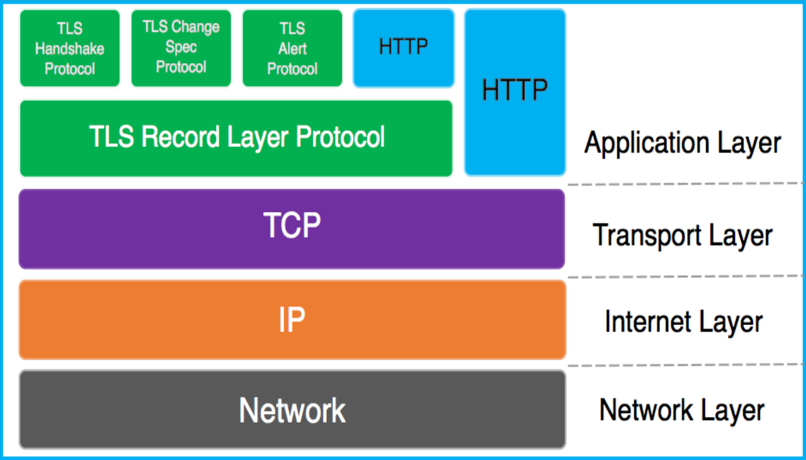
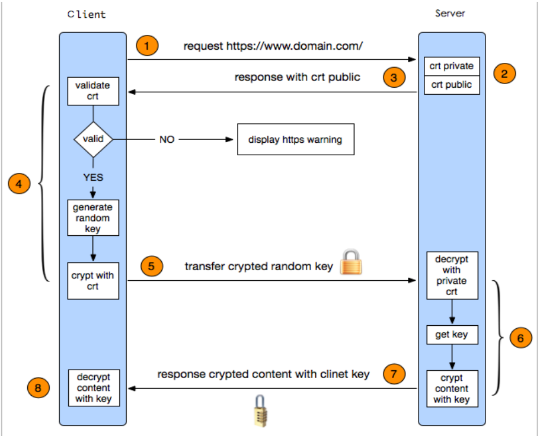
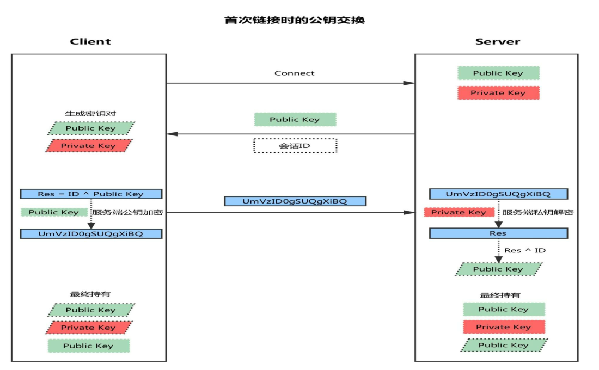
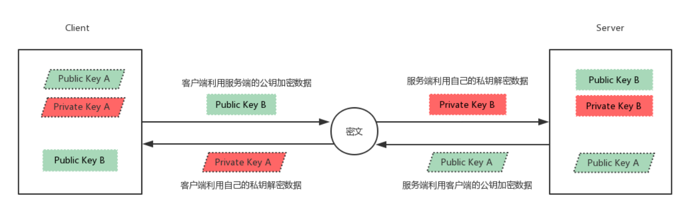
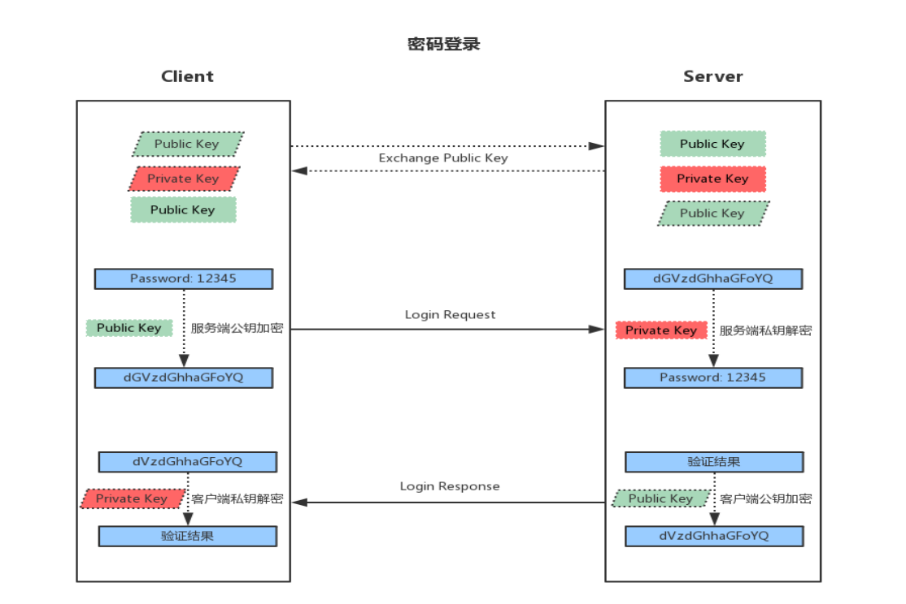
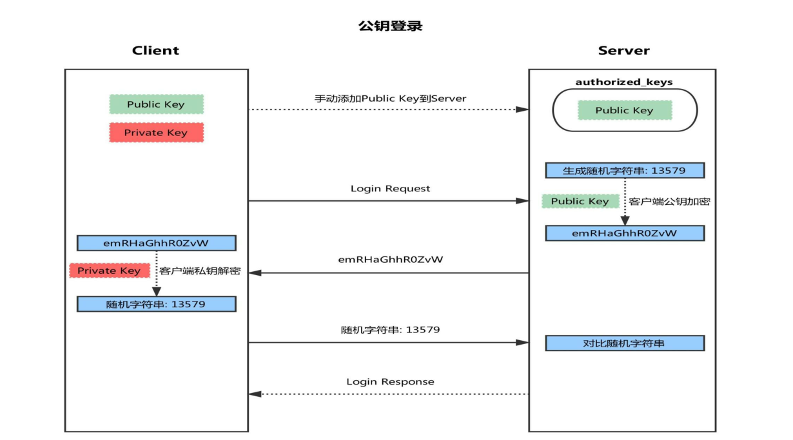

<center> <font face="黑体" size=6 color=grey>加密和安全</font></center>


## 安全机制 

- 安全攻击的几种典型方式： STRIDE 
```bash
Spoofing 假冒  
Tampering 篡改  
Repudiation 否认  
Information Disclosure 信息泄漏 
Denial of Service  拒绝服务 
Elevation of Privilege 提升权限 
```

- 安全设计基本原则 

  - 使用成熟的安全系统 
  - 以小人之心度输入数据 
  - 部系统是不安全的 
  - 小授权 
  - 少外部接口 
  - 省使用安全模式 
  - 全不是似是而非 
  - STRIDE思考 
  - 入口处检查 
  - 管理上保护好你的系统 

- 常见加密算法和协议 

  - 对称加密 
  - 公钥加密 
  - 单向加密 
  - 认证协议


## 对称和非对称加密 

### 对称加密算法:加密和解密使用同一个密钥 

```bash
DES：Data Encryption Standard，56bits 
3DES： 
AES：Advanced (128, 192, 256bits) 
Blowfish,Twofish,IDEA,RC6,CAST5 
```

- 特性： 
1、加密、解密使用同一个密钥，效率高 
2、将原始数据分割成固定大小的块，逐个进行加密 
- 缺陷： 
1、密钥过多  
2、密钥分发 
3、数据来源无法确认 

### 非对称加密算法 

- 公钥加密：密钥成对出现 
  - 公钥：公开给所有人；public key 
  - 私钥：自己留存，必须保证其私密性；secret key 
- 特点：用公钥加密数据，只能使用与之配对的私钥解密；反之亦然 
- 功能： 
  - 数字签名：主要在于让接收方确认发送方身份对称密钥交换：发送方用对方的公钥加密一个对称密钥后发送给对方 
  - 数据加密：适合加密较小数据 
- 缺点：密钥长，加密解密效率低下 
- 算法： RSA（加密，数字签名） DSA（数字签名） ELGamal 

- 基于一对公钥/密钥对 
•用密钥对中的一个加密，另一个解密 
- 实现加密： 
•接收者 
 生成公钥/密钥对：P和S 
 公开公钥P，保密密钥S 
•发送者 
 使用接收者的公钥来加密消息M 
 将P(M)发送给接收者 
•接收者 
 使用密钥S来解密：M=S(P(M)) 

- 实现数字签名： 
•发送者 
 生成公钥/密钥对：P和S 
 公开公钥P，保密密钥S 
 使用密钥S来加密消息M 
 发送给接收者S(M) 
•接收者 
 使用发送者的公钥来解密M=P(S(M)) 
 结合签名和加密 
 分离签名 

- RSA和DSA 
  - RSA：公钥加密算法是1977年由Ron Rivest、Adi Shamirh和LenAdleman在
（美国麻省理工学院）开发的，RSA取名来自开发他们三者的名字，后成立RSA
数据安全有限公司。RSA是目前最有影响力的公钥加密算法，它能够抵抗到目
前为止已知的所有密码攻击，已被ISO推荐为公钥数据加密标准。RSA算法基于
一个十分简单的数论事实：将两个大素数相乘十分容易，但那时想要对其乘积
进行因式分解却极其困难，因此可以将乘积公开作为加密密钥 
  - DSA (Digital Signature Algorithm)：1991年7月26日提交，并归属于David 
W. Kravitz前NSA员工，DSA是Schnorr和ElGamal签名算法的变种，被美国
NIST作为SS(DigitalSignature Standard)， DSA是基于整数有限域离散对数难
题的，其安全性与RSA相比差不多。DSA只是一种算法，和RSA不同之处在于
它不能用作加密和解密，也不能进行密钥交换，只用于签名,它比RSA要快很多 


## 散列算法 

- 单向散列:将任意数据缩小成固定大小的“指纹” 
•任意长度输入 
•固定长度输出 
•若修改数据，指纹也会改变（“不会产生冲突”） 
•无法从指纹中重新生成数据（“单向”） 
  - 功能：保护数据完整性 
  - 常见算法:md5: 128bits、sha1: 160bits、sha224 、sha256、sha384、sha512 
  - 常用工具 
•md5sum | sha1sum  [ --check  ]  file 
•openssl、gpg 
•rpm  -V 

- 密钥交换:IKE（ Internet Key Exchange ） 
 
  - 公钥加密： 

  - DH参看：https://en.wikipedia.org/wiki/Diffie%E2%80%93Hellman_key_exchange 
```bash
DH (Deffie-Hellman)：生成会话密钥，由惠特菲尔德·迪菲（Bailey Whitfield Diffie）和
马丁·赫尔曼（Martin Edward Hellman）在1976年发表. 
DH： 
A: g,p 协商生成公开的整数g, 大素数p 
B: g,p 
A:生成隐私数据 :a (a<p )，计算得出 gâ%p，发送给B 
B:生成隐私数据 :b,计算得出 g^b%p，发送给A 
A:计算得出 [(g^b%p)â] %p = gâb%p，生成为密钥 
B:计算得出 [(gâ%p)^b] %p = gâb%p，生成为密钥 
```


## gpg 

- 使用gpg实现对称加密file文件 

```bash
gpg -c file 
ls file.gpg 
在另一台主机上解密file 
gpg -o file -d file.gpg  
```

- 使用gpg工具实现公钥加密

```bash
在hostB主机上用公钥加密，在hostA主机上解密 
在hostA主机上生成公钥/私钥对 
    gpg --gen-key 
在hostA主机上查看公钥 
    gpg --list-keys 
在hostA主机上导出公钥到wang.pubkey 
    gpg -a  --export -o wang.pubkey 
从hostA主机上复制公钥文件到需加密的B主机上 
    scp wang.pubkey  hostB: 
在需加密数据的hostB主机上生成公钥/私钥对 
    gpg --list-keys 
    gpg --gen-key 
在hostB主机上导入公钥 
    gpg --import wang.pubkey  
    gpg --list-keys 
用从hostA主机导入的公钥，加密hostB主机的文件file,生成file.gpg 
    gpg -e -r wangxiaochun file  
    file file.gpg 
复制加密文件到hostA主机  
    scp fstab.gpg hostA: 
在hostA主机解密文件 
    gpg -d file.gpg   
    gpg -o file  -d file.gpg  
删除公钥和私钥 
    gpg --delete-keys  wangxiaochun 
    gpg --delete-secret-keys  wangxiaochun 
```

- 中间人攻击 

## PKI和CA 

- CA和证书 
- PKI：Public Key Infrastructure 

```bash 
签证机构：CA（Certificate Authority） 
注册机构：RA 
证书吊销列表：CRL 
证书存取库： 
```

- X.509：定义了证书的结构以及认证协议标准 
```bash
版本号            
序列号 
签名算法 
颁发者 
有效期限 
主体名称 
主体公钥 
CRL分发点 
扩展信息 
发行者签名 
```
- 证书获取
- 证书类型： 
```bash
证书授权机构的证书 
服务器 
用户证书 
```

- 获取证书两种方法： 
  - 使用证书授权机构 
```
   生成证书请求（csr） 
   将证书请求csr发送给CA 
   CA签名颁发证书 
```
- 自签名的证书:自已签发自己的公钥 

## openssl 

- SSL：Secure Socket Layer，TLS: Transport Layer Security 

```bash
1995：SSL 2.0 Netscape 
1996：SSL 3.0 
1999：TLS 1.0  
2006：TLS 1.1 IETF(Internet工程任务组) RFC 4346 
2008：TLS 1.2 当前使用 
2015：TLS 1.3  
```
- 功能：机密性，认证，完整性，重放保护 
- 两阶段协议，分为握手阶段和应用阶段 
  - 握手阶段(协商阶段):客户端和服务器端认证对方身份（依赖于PKI体系，利用数字
证书进行身份认证），并协商通信中使用的安全参数、密码套件以及主密钥。后续通信使
用的所有密钥都是通过MasterSecret生成 
  - 应用阶段:在握手阶段完成后进入，在应用阶段通信双方使用握手阶段协商好的密
钥进行安全通信 


- Handshake协议：包括协商安全参数和密码套件、服务器身份认证（客户端身
份认证可选）、密钥交换 
- ChangeCipherSpec 协议：一条消息表明握手协议已经完成 
- Alert 协议：对握手协议中一些异常的错误提醒，分为fatal和warning两个级别，
fatal类型错误会直接中断SSL链接，而warning级别的错误SSL链接仍可继续，
只是会给出错误警告 
- Record 协议：包括对消息的分段、压缩、消息认证和完整性保护、加密等 
- HTTPS 协议：就是“HTTP 协议”和“SSL/TLS 协议”的组合。HTTP over 
SSL”或“HTTP over TLS”，对http协议的文本数据进行加密处理后，成为二
进制形式传输 



- HTTPS工作过程 

- OpenSSL：开源项目 
 
- 三个组件： 
openssl：多用途的命令行工具，包openssl 
libcrypto：加密算法库，包openssl-libs 
libssl：加密模块应用库，实现了ssl及tls，包nss 
openssl命令： 
两种运行模式：交互模式和批处理模式 
openssl version：程序版本号 
标准命令、消息摘要命令、加密命令 
标准命令：enc, ca, req, ... 
openssl命令 
对称加密： 
工具：openssl enc, gpg 
算法：3des, aes, blowfish, twofish 
enc命令： 
帮助：man enc 
加密： 
 
openssl enc -e -des3 -a -salt -in testfile -out testfile.cipher 
 
解密： 
 
openssl enc -d -des3 -a -salt –in testfile.cipher -out testfile 
 
openssl ? 

单向加密： 
 
工具：md5sum, sha1sum, sha224sum,sha256sum… 
 
 
openssl dgst 
dgst命令： 
 
帮助：man dgst 
 
openssl dgst -md5 [-hex默认] /PATH/SOMEFILE 
 
openssl dgst -md5 testfile 
 
md5sum /PATH/TO/SOMEFILE 
MAC: Message Authentication Code，单向加密的一种延伸应用，用于实现
网络通信中保证所传输数据的完整性机制 
 
CBC-MAC 
 
HMAC：使用md5或sha1算法 


生成用户密码： 
 
passwd命令: 
 
帮助：man sslpasswd 
 
openssl passwd -1 -salt SALT(最多8位) 
 
openssl passwd -1 –salt  centos 
生成随机数： 
 
帮助：man sslrand 
 
openssl rand -base64|-hex NUM 
 
 NUM: 表示字节数，使用-hex，每个字符为十六进制，相当于4位二进制，
出现的字符数为NUM*2 

公钥加密： 
 
算法：RSA, ELGamal 
 
工具：gpg, openssl rsautl（man rsautl） 
数字签名： 
 
算法：RSA, DSA, ELGamal 
密钥交换： 
 
算法：dh 
 
DSA：Digital Signature Algorithm 
 
DSS：Digital Signature Standard 
 
RSA： 

生成密钥对儿：man genrsa 
生成私钥 
 
openssl genrsa -out /PATH/TO/PRIVATEKEY.FILE NUM_BITS 
 
 (umask 077; openssl genrsa –out test.key –des 2048) 
  
openssl rsa -in test.key –out test2.key 将加密key解密 
从私钥中提取出公钥 
 
openssl rsa -in PRIVATEKEYFILE –pubout –out PUBLICKEYFILE 
 
openssl rsa –in test.key –pubout –out test.key.pub 
随机数生成器：伪随机数字 
 
键盘和鼠标，块设备中断 
 
/dev/random：仅从熵池返回随机数；随机数用尽，阻塞 
 
/dev/urandom：从熵池返回随机数；随机数用尽，会利用软件生成伪随机
数,非阻塞

PKI：Public Key Infrastructure 
 
CA 
 
RA 
 
CRL 
 
证书存取库 
建立私有CA: 
 
OpenCA 
 
openssl 
证书申请及签署步骤： 
 
1、生成申请请求 
 
2、RA核验 
 
3、CA签署 
 
4、获取证书 


## 证书管理 
创建CA和申请证书 
创建私有CA： 
 
openssl的配置文件：/etc/pki/tls/openssl.cnf 
 
三种策略：match匹配、optional可选、supplied提供 
 
 match：要求申请填写的信息跟CA设置信息必须一致 
 
 optional：可有可无，跟CA设置信息可不一致 
 
 supplied：必须填写这项申请信息， 
1、创建所需要的文件 
 
touch /etc/pki/CA/index.txt 生成证书索引数据库文件 
 
echo 01 > /etc/pki/CA/serial 指定第一个颁发证书的序列号 
2、 CA自签证书 
 
生成私钥 
 
cd /etc/pki/CA/ 
 
(umask 066; openssl genrsa -out  private/cakey.pem 2048) 

创建CA和申请证书 
生成自签名证书 
   openssl req -new -x509 -key   /etc/pki/CA/private/cakey.pem  
 
 -days  3650  -out      /etc/pki/CA/cacert.pem 
选项说明： 
 
-new：生成新证书签署请求 
 
-x509：专用于CA生成自签证书 
 
-key：生成请求时用到的私钥文件 
 
-days n：证书的有效期限 
 
-out /PATH/TO/SOMECERTFILE: 证书的保存路径 
创建CA和申请证书 
3、颁发证书 
在需要使用证书的主机生成证书请求 
 
给web服务器生成私钥 
 
 (umask 066; openssl genrsa –out   /data/test.key 2048) 
 
生成证书申请文件 
 
openssl req -new -key /data/test.key -out /data/test.csr 
将证书请求文件传输给CA 
CA签署证书，并将证书颁发给请求者 
 
openssl ca -in /tmp/test.csr –out   /etc/pki/CA/certs/test.crt -days 100 
 
注意：默认要求 国家，省，公司名称三项必须和CA一致 
创建CA和证书管理 
查看证书中的信息： 
 
openssl x509 -in /PATH/FROM/CERT_FILE -noout   -text|issuer|subject|serial|dates 
 
openssl  ca -status SERIAL  查看指定编号的证书状态 
4、吊销证书 
在客户端获取要吊销的证书的serial 
 
openssl x509 -in /PATH/FROM/CERT_FILE   -noout   -serial  -subject 
在CA上，根据客户提交的serial与subject信息，对比检验是否与index.txt文件中的信息一致，
吊销证书： 
 
openssl ca -revoke /etc/pki/CA/newcerts/SERIAL.pem 
指定第一个吊销证书的编号,注意：第一次更新证书吊销列表前，才需要执行 
 
echo 01 > /etc/pki/CA/crlnumber 
更新证书吊销列表 
 
openssl ca -gencrl -out /etc/pki/CA/crl.pem 
查看crl文件： 
 
openssl crl -in /etc/pki/CA/crl.pem -noout -text 


## ssh服务和dropbear 
SSH 
ssh: secure shell, protocol, 22/tcp, 安全的远程登录 
具体的软件实现： 
 
OpenSSH: ssh协议的开源实现，CentOS默认安装 
 
dropbear：另一个开源实现 
SSH协议版本 
 
v1: 基于CRC-32做MAC，不安全；man-in-middle 
 
v2：双方主机协议选择安全的MAC方式 
 
基于DH算法做密钥交换，基于RSA或DSA实现身份认证 
OpenSSH介绍 
相关包： 
 
openssh 
 
openssh-clients 
 
openssh-server 
工具： 
 
基于C/S结构 
 
Linux Client: ssh, scp, sftp，slogin 
 
Windows Client：xshell, putty, securecrt, sshsecureshellclient 
 
Server: sshd 

公钥交换 

公钥交换 
客户端发起链接请求 
服务端返回自己的公钥，以及一个会话ID（这一步客户端得到服务端公钥） 
客户端生成密钥对 
客户端用自己的公钥异或会话ID，计算出一个值Res，并用服务端的公钥加密 
客户端发送加密后的值到服务端，服务端用私钥解密,得到Res 
服务端用解密后的值Res异或会话ID，计算出客户端的公钥（这一步服务端得到
客户端公钥） 
最终：双方各自持有三个秘钥，分别为自己的一对公、私钥，以及对方的公钥，
之后的所有通讯都会被加密 


ssh客户端 
客户端组件： 
ssh, 配置文件：/etc/ssh/ssh_config 
 
  Host PATTERN 
 
 
StrictHostKeyChecking no 首次登录不显示检查提示 
格式：ssh [user@]host [COMMAND] 
 
 
   ssh [-l user] host [COMMAND] 
常见选项 
 
-p port：远程服务器监听的端口 
 
-b：指定连接的源IP 
 
-v：调试模式 
 
-C：压缩方式 
 
-X：支持x11转发 
 
-t：强制伪tty分配 
 
 
ssh -t remoteserver1 ssh -t  remoteserver2   ssh   remoteserver3 


ssh客户端
允许实现对远程系统经验证地加密安全访问 
当用户远程连接ssh服务器时，会复制ssh服务器/etc/ssh/ssh_host*key.pub
（CentOS7默认是ssh_host_ecdsa_key.pub）文件中的公钥到客户机的
~./ssh/know_hosts中。下次连接时，会自动匹配相应私钥，不能匹配，将拒
绝连接 

ssh服务登录验证
ssh服务登录的验证方式 
用户/口令   
基于密钥
 

基于用户名和口令的登录验证



基于用户和口令的登录验证 
基于用户和口令登录验证 
1 客户端发起ssh请求，服务器会把自己的公钥发送给用户 
2 用户会根据服务器发来的公钥对密码进行加密 
3 加密后的信息回传给服务器，服务器用自己的私钥解密，如果密码正确，
则用户登录成功 

基于密钥的登录验证 


基于密钥的登录验证 
基于密钥的登录方式 
1 首先在客户端生成一对密钥（ssh-keygen） 
2 并将客户端的公钥ssh-copy-id 拷贝到服务端 
3 当客户端再次发送一个连接请求，包括ip、用户名 
4 服务端得到客户端的请求后，会到authorized_keys中查找，如果有响应的
IP和用户，就会随机生成一个字符串，例如：magedu 
5 服务端将使用客户端拷贝过来的公钥进行加密，然后发送给客户端 
6 得到服务端发来的消息后，客户端会使用私钥进行解密，然后将解密后的
字符串发送给服务端 
7服务端接受到客户端发来的字符串后，跟之前的字符串进行对比，如果一
致，就允许免密码登录 

基于key认证的实现
基于密钥的认证： 
(1) 在客户端生成密钥对 
 
ssh-keygen -t rsa [-P ''] [-f “~/.ssh/id_rsa"] 
(2) 把公钥文件传输至远程服务器对应用户的家目录 
 
ssh-copy-id [-i [identity_file]] [user@]host 
(3) 测试 
(4) 在SecureCRT或Xshell实现基于key验证 
在SecureCRT工具—>创建公钥—>生成Identity.pub文件 
转化为openssh兼容格式（适合SecureCRT，Xshell不需要转化格式），并复制到
需登录主机上相应文件authorized_keys中,注意权限必须为600，在需登录的ssh
主机上执行：ssh-keygen  -i -f Identity.pub >> .ssh/authorized_keys 
基于key认证 
(5)重设私钥口令： 
 
ssh-keygen –p  
(6)验证代理（authentication agent）保密解密后的密钥 
  
这样口令就只需要输入一次 
  
在GNOME中，代理被自动提供给root用户 
  
否则运行ssh-agent bash 
(7)钥匙通过命令添加给代理 
 
ssh-add 
scp命令 
scp命令： 
scp [options] SRC... DEST/ 
两种方式： 
 
scp [options] [user@]host:/sourcefile  /destpath 
 
scp [options] /sourcefile  [user@]host:/destpath 
常用选项： 
 
-C 
压缩数据流 
 
-r 
递归复制 
 
-p 
保持原文件的属性信息 
 
-q 
静默模式 
 
-P PORT 
指明remote host的监听的端口 

rsync命令 
基于ssh和rsh服务实现高效率的远程系统之间复制文件 
使用安全的shell连接做为传输方式 
•rsync  -av /etc server1:/tmp   
复制目录和目录下文件 
•rsync  -av  /etc/  server1:/tmp  
只复制目录下文件 
比scp更快，只复制不同的文件 
常用选项： 
 
-n  
模拟复制过程 
 
-v  
显示详细过程 
 
-r  
递归复制目录树 
 
-p  
保留权限 
 
-t  
保留时间戳 
 
-g  
保留组信息 
 
-o  
保留所有者信息 
 
-l   
将软链接文件本身进行复制（默认） 
 
-L  
将软链接文件指向的文件复制 
 
-a  
存档，相当于–rlptgoD，但不保留ACL（-A）和SELinux属性（-X） 

sftp命令 
交互式文件传输工具 
用法和传统的ftp工具相似 
利用ssh服务实现安全的文件上传和下载 
使用ls cd mkdir rmdir pwd get put等指令，可用？或help获取帮助信息 
 
sftp [user@]host 
 
sftp> help 


## 轻量级自动化运维工具 

## aide 

## Sudo 

## TCP Wrappers 

## PAM模块 
