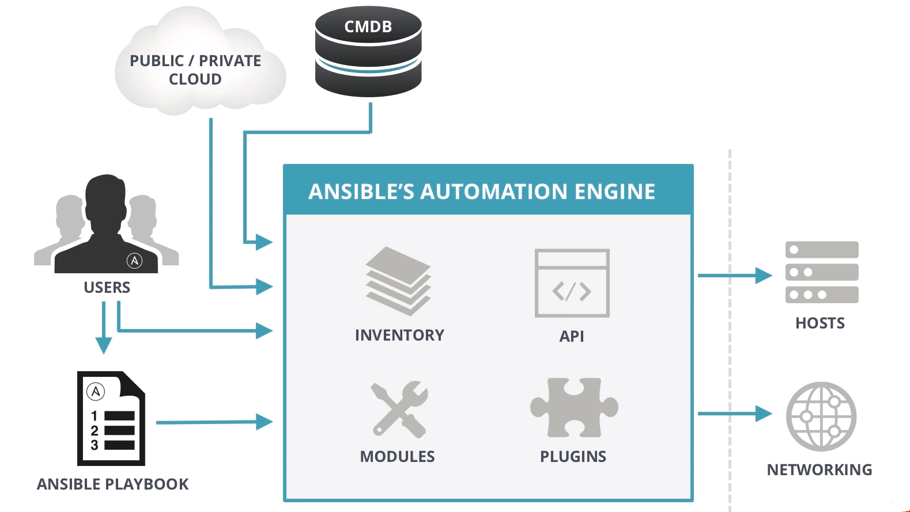

<center><font face="幼圆" size="5" color="grey">ansible入门</center></font>

# 一.ansible 背景介绍

- Ansible 是一个广受欢迎的 IT 自动化系统。可以用来处理配置管理、应用自动化部署、云资源配给、网络
  自动化和多借点部署等任务。其也可以使得复杂的变更如带负载均衡的零停机滚动更新更加容易。[Ansible.com](https://ansible.com/)

## 1.1 自动化运维概念

### 1.1.1 运维自动化的内容

- 运维自动化是指将 IT 运维中的大量手工的日常任务(日常检查、配置变更、软件安装等)转为自动化完成。
  高度的自动化是 IT 运维追求的目标，是未来 IT 运维发展的趋势。简单的说，IT 自动化就是基于事先建立的
  框架和流程，将某些不可预测的事件与 IT 流程关联起来，一旦某个系统一有风吹草动，就会被相应的监控
  系统检测到，并根据相关的预定义的流程执行相应的补救措施，这些自动补救的措施都是在无人干涉的情
  况下自动完成的。从而大幅减少系统不可用时间。

### 1.1.2 运维工程师核心职能

- 平台架构组件
  负责参与并审核架构设计的合理性和可运维性，搭建运维平台技术架构，通过开源解决方案，以确保在
  产品发布之后能高效稳定的运行，保障并不断提升服务的可用性，确保用户数据安全，提升用户体验。

- 日常运营保障
  负责用运维技术或者运维平台确保产品可以高效的发布上线，负责保障产品 7\*24H 稳定运行，在此期间
  对出现的各种问题可以快速定位并解决;在日常工作中不断优化系统架构和部署的合理性，以提升系统服务
  的稳定性。

- 性能、效率优化
  用自动化的工具/平台提升软件在研发生命周期中的工程效率。不断优化系统架构、提升部署效率、优化
  资源利用率支持产品的不断迭代，需要不断的进行架构优化调整。以确保整个产品能够在功能不断丰富和
  复杂的条件下，同时保持高可用性。

    <div align="center">
    
    </div>
  <center><font face="黑体">运维开发工程师的职能和使用的工具</font></center>

- 对于运维工程师来说，掌握这些自动化运维工具并能够相应的扩展功能是必备的技能。

## 1.2 常见自动化运维工具介绍

- 常见自动化运维工具在 Github 的受欢迎程度--统计于 2019.12.8

| 自动化运维工具 | Github Watch | Star  | Fork  | Contributors | Used by      | Build language |
| -------------- | ------------ | ----- | ----- | ------------ | ------------ | -------------- |
| Ansible        | 2000         | 40800 | 17700 | 4800         | 9400         | Python         |
| Saltstack      | 596          | 10500 | 4700  | 2163         | not included | Python         |
| Puppet         | 489          | 5600  | 2100  | 528          | 7300         | Ruby           |
| Chef           | 420          | 6000  | 2400  | 581          | 5800         | Ruby           |
| Fabric         | 519          | 11900 | 1800  | 9            | not include  | Python         |

- 能看出 ansible 和 saltstack 是比较受欢迎的工具。

- 各工具的源码托管地址：
  [Github-Ansible](https://github.com/ansible/ansible)
  [Github-Saltstack](https://github.com/saltstack/salt)
  [Github-Puppet](https://github.com/puppetlabs/puppet)
  [Github-Chef](https://github.com/chef/chef)
  [Github-Fabric](https://github.com/fabric/fabric)

## 1.3 ansible 背景

- Ansible 由 Michael DeHaan(Cobbler 与 Func 作者)使用 Python 在 2012 年开发，ansible 的名称来自
  《安德的游戏》中跨越时空的即时通信工具。 于 2012-03-09，发布 0.0.1 版。在 2015-10-17，Red Hat
  宣布 1.5 亿美元收购 Ansible。新版本的 RedHt 系统集成 Ansible。可以工作在 Linu、BSD、Mac OS 等
  平台，目前是三大自动化运维工具(Ansible,Saltstack,Puppet)中最受欢迎的工具。
- Andible 官网和官方文档
  [官网](https://www.ansible.com/)
  [官方文档](https://docs.ansible.com/)
  [Ansible 中文文档](http://ansible.com.cn/index.html)

- Michael DeHaan 信息和博客
  [Linkedin-MichaelDehaan](https://www.linkedin.com/in/michaeldehaan/detail/recent-activity/)
  [Medium](https://medium.com/@michaeldehaan)
  [ansible.com](https://www.ansible.com/blog/author/michael-dehaan)

# 二.ansible 特性介绍

- ansible 特性
  - 模块化：调用特定的模块，完成特定任务
  - Paramiko（python 对 ssh 的实现），PyYAML，Jinja2（模板语言）三个关键模块
  - 支持自定义模块，可使用任何编程语言写模块
  - 基于 Python 语言实现
  - 部署简单，基于 python 和 SSH(默认已安装)，agentless，无需代理不依赖 PKI（无需 ssl），
    去中心化部署
  - 安全，基于 OpenSSH
  - 幂等性：一个任务执行 1 遍和执行 n 遍效果一样，不因重复执行带来意外情况
  - 支持 playbook 编排任务，YAML 格式，编排任务，支持丰富的数据结构
  - 较强大的多层解决方案 role

# 三.ansible 架构介绍

## 3.1 Ansible 整体架构

<div align="center">

</div>
<center><font>Ansible 整体架构</font></center>

## 3.2 Ansible 的核心模块

- ansible 核心模块包括：
  INVENTRY:ansible 控制和管理的主机清单默认使用的文件为`/etc/ansible/hosts`
  API: 供第三方程序调用的应用程序编程接口
  MODULES:ansible 执行命令的功能模块，多数为内置核心，也可以自定义(基于 Python)
  PLUGINS:模块功能的补充，如连接类的插件、循环插件、过滤插件等。

- ANSIBLE 命令执行来源
  USER:普通用户，即 SYSTEM ADMINISTRATOR
  PLAYBOOKS:任务剧本（任务集），编排定义 Ansible 任务集的配置文件，由 Ansible 顺序依次
  执行，通常是 JSON 格式的 YML 文件
  CMDB(配置管理数据库): API 调用
  PUBLIC/PRIVATE CLOUD: API 调用
  USER-> Ansible Playbook -> Ansibile

- **Tips**
  执行 ansible 的主机一般称为主控端，中控，master 或堡垒机
  主控端 Python 版本需要 2.6 或以上
  被控端 Python 版本小于 2.4 需要安装 python-simplejson
  被控端如开启 SELinux 需要安装 libselinux-python
  windows 不能做为主控端

# 四.Ansible 安装和入门

## 4.1 Ansible 安装

- RedHat 系列系统配置各版本的 epel 源直接 yum 安装
  `yum install ansible`

- 编译安装

```bash
$yum -y install python-jinja2 PyYAML python-paramiko python-babel python-crypto
$tar xf ansible-1.5.4.tar.gz
$cd ansible-1.5.4
$python setup.py build
$python setup.py install
$mkdir /etc/ansible
$cp -r examples/* /etc/ansible
```

- Git 安装

```bash
$git clone git://github.com/ansible/ansible.git --recursive
$cd ./ansible
$source ./hacking/env-setup
```

- 使用 Python 包管理器 pip 安装

```bash
yum install python-pip python-devel
yum install gcc glibc-devel zibl-devel  rpm-bulid openssl-devel
pip install  --upgrade pip
pip install ansible --upgrade
```

## 4.2 Ansible 配置

- 相关配置文件

```bash
/etc/ansible/ansible.cfg 主配置文件，配置 ansible 工作特性
/etc/ansible/hosts       默认的Inventory主机清单
/etc/ansible/roles/      存放角色的目录
```

- Ansible 主配置文件`/etc/ansible/ansible.cfg`

```bash
# config file for ansible -- https://ansible.com/
# ===============================================

# nearly all parameters can be overridden in ansible-playbook
# or with command line flags. ansible will read ANSIBLE_CONFIG,
# ansible.cfg in the current working directory, .ansible.cfg in
# the home directory or /etc/ansible/ansible.cfg, whichever it
# finds first

[defaults]

# some basic default values...

#inventory      = /etc/ansible/hosts
#library        = /usr/share/my_modules/
#module_utils   = /usr/share/my_module_utils/
#remote_tmp     = ~/.ansible/tmp
#local_tmp      = ~/.ansible/tmp
#plugin_filters_cfg = /etc/ansible/plugin_filters.yml
#forks          = 5
#poll_interval  = 15
#sudo_user      = root
#ask_sudo_pass = True
#ask_pass      = True
#transport      = smart
#remote_port    = 22
#module_lang    = C
#module_set_locale = False


# implicit - gather by default, turn off with gather_facts: False
# explicit - do not gather by default, must say gather_facts: True
#gathering = implicit | explicit
#gather_subset = all | network | hardware | virtual | facter | ohai
# gather_timeout = 10
# inject_facts_as_vars = True
#roles_path    = /etc/ansible/roles
#host_key_checking = False
host_key_checking = False
#stdout_callback = skippy
#callback_whitelist = timer, mail
#task_includes_static = False
#handler_includes_static = False
#error_on_missing_handler = True
#sudo_exe = sudo
#sudo_flags = -H -S -n

# SSH timeout
#timeout = 10

# default user to use for playbooks if user is not specified
# (/usr/bin/ansible will use current user as default)
#remote_user = root

# logging is off by default unless this path is defined
# if so defined, consider logrotate
log_path = /var/log/ansible.log

# default module name for /usr/bin/ansible
module_name = shell

# use this shell for commands executed under sudo
# you may need to change this to bin/bash in rare instances
# if sudo is constrained
#executable = /bin/sh

# if inventory variables overlap, does the higher precedence one win
# or are hash values merged together?  The default is 'replace' but
# this can also be set to 'merge'.
#hash_behaviour = replace

# by default, variables from roles will be visible in the global variable
# scope. To prevent this, the following option can be enabled, and only
# tasks and handlers within the role will see the variables there
#private_role_vars = yes

# list any Jinja2 extensions to enable here:
#jinja2_extensions = jinja2.ext.do,jinja2.ext.i18n

# if set, always use this private key file for authentication, same as
# if passing --private-key to ansible or ansible-playbook
#private_key_file = /path/to/file

# If set, configures the path to the Vault password file as an alternative to
# specifying --vault-password-file on the command line.
#vault_password_file = /path/to/vault_password_file

# format of string {{ ansible_managed }} available within Jinja2
# templates indicates to users editing templates files will be replaced.
# replacing {file}, {host} and {uid} and strftime codes with proper values.
#ansible_managed = Ansible managed: {file} modified on %Y-%m-%d %H:%M:%S by {uid} on {host}
# {file}, {host}, {uid}, and the timestamp can all interfere with idempotence
# in some situations so the default is a static string:
#ansible_managed = Ansible managed

#display_skipped_hosts = True
#display_args_to_stdout = False
#error_on_undefined_vars = False
#system_warnings = True
#deprecation_warnings = True
# command_warnings = False

# set plugin path directories here, separate with colons
#action_plugins     = /usr/share/ansible/plugins/action
#cache_plugins      = /usr/share/ansible/plugins/cache
#callback_plugins   = /usr/share/ansible/plugins/callback
#connection_plugins = /usr/share/ansible/plugins/connection
#lookup_plugins     = /usr/share/ansible/plugins/lookup
#inventory_plugins  = /usr/share/ansible/plugins/inventory
#vars_plugins       = /usr/share/ansible/plugins/vars
#filter_plugins     = /usr/share/ansible/plugins/filter
#test_plugins       = /usr/share/ansible/plugins/test
#terminal_plugins   = /usr/share/ansible/plugins/terminal
#strategy_plugins   = /usr/share/ansible/plugins/strategy

#strategy = free
#bin_ansible_callbacks = False
#nocows = 1
#cow_selection = default
#cow_selection = random
#cow_whitelist=bud-frogs,bunny,cheese,daemon,default,dragon,elephant-in-snake,elephant,eyes,\
#              hellokitty,kitty,luke-koala,meow,milk,moofasa,moose,ren,sheep,small,stegosaurus,\
#              stimpy,supermilker,three-eyes,turkey,turtle,tux,udder,vader-koala,vader,www
#nocolor = 1
#fact_caching = memory
#For the redis plugin, the value is a host:port:database triplet: fact_caching_connection = localhost:6379:0
#fact_caching_connection=/tmp
#retry_files_enabled = False
#retry_files_save_path = ~/.ansible-retry
#squash_actions = apk,apt,dnf,homebrew,pacman,pkgng,yum,zypper

# prevents logging of task data, off by default
#no_log = False

# prevents logging of tasks, but only on the targets, data is still logged on the master/controller
#no_target_syslog = False

# controls whether Ansible will raise an error or warning if a task has no
# choice but to create world readable temporary files to execute a module on
# the remote machine.  This option is False by default for security.  Users may
# turn this on to have behaviour more like Ansible prior to 2.1.x.  See
# https://docs.ansible.com/ansible/become.html#becoming-an-unprivileged-user
# for more secure ways to fix this than enabling this option.
#allow_world_readable_tmpfiles = False

# controls the compression level of variables sent to
# worker processes. At the default of 0, no compression
# is used. This value must be an integer from 0 to 9.
#var_compression_level = 9

# controls what compression method is used for new-style ansible modules when
# they are sent to the remote system.  The compression types depend on having
# support compiled into both the controller's python and the client's python.
# The names should match with the python Zipfile compression types:
# * ZIP_STORED (no compression. available everywhere)
# * ZIP_DEFLATED (uses zlib, the default)
# These values may be set per host via the ansible_module_compression inventory
# variable
#module_compression = 'ZIP_DEFLATED'

# This controls the cutoff point (in bytes) on --diff for files
# set to 0 for unlimited (RAM may suffer!).
#max_diff_size = 1048576

# This controls how ansible handles multiple --tags and --skip-tags arguments
# on the CLI.  If this is True then multiple arguments are merged together.  If
# it is False, then the last specified argument is used and the others are ignored.
# This option will be removed in 2.8.
#merge_multiple_cli_flags = True

# Controls showing custom stats at the end, off by default
#show_custom_stats = True

# Controls which files to ignore when using a directory as inventory with
# possibly multiple sources (both static and dynamic)
#inventory_ignore_extensions = ~, .orig, .bak, .ini, .cfg, .retry, .pyc, .pyo

# This family of modules use an alternative execution path optimized for network appliances
# only update this setting if you know how this works, otherwise it can break module execution
#network_group_modules=eos, nxos, ios, iosxr, junos, vyos

# When enabled, this option allows lookups (via variables like {{lookup('foo')}} or when used as
# a loop with `with_foo`) to return data that is not marked "unsafe". This means the data may contain
# jinja2 templating language which will be run through the templating engine.
# ENABLING THIS COULD BE A SECURITY RISK
#allow_unsafe_lookups = False

# set default errors for all plays
#any_errors_fatal = False

[inventory]
# enable inventory plugins, default: 'host_list', 'script', 'yaml', 'ini', 'auto'
#enable_plugins = host_list, virtualbox, yaml, constructed

# ignore these extensions when parsing a directory as inventory source
#ignore_extensions = .pyc, .pyo, .swp, .bak, ~, .rpm, .md, .txt, ~, .orig, .ini, .cfg, .retry

# ignore files matching these patterns when parsing a directory as inventory source
#ignore_patterns=

# If 'true' unparsed inventory sources become fatal errors, they are warnings otherwise.
#unparsed_is_failed=False

[privilege_escalation]
#become=True
#become_method=sudo
#become_user=root
#become_ask_pass=False

[paramiko_connection]

# uncomment this line to cause the paramiko connection plugin to not record new host
# keys encountered.  Increases performance on new host additions.  Setting works independently of the
# host key checking setting above.
#record_host_keys=False

# by default, Ansible requests a pseudo-terminal for commands executed under sudo. Uncomment this
# line to disable this behaviour.
#pty=False

# paramiko will default to looking for SSH keys initially when trying to
# authenticate to remote devices.  This is a problem for some network devices
# that close the connection after a key failure.  Uncomment this line to
# disable the Paramiko look for keys function
#look_for_keys = False

# When using persistent connections with Paramiko, the connection runs in a
# background process.  If the host doesn't already have a valid SSH key, by
# default Ansible will prompt to add the host key.  This will cause connections
# running in background processes to fail.  Uncomment this line to have
# Paramiko automatically add host keys.
#host_key_auto_add = True

[ssh_connection]

# ssh arguments to use
# Leaving off ControlPersist will result in poor performance, so use
# paramiko on older platforms rather than removing it, -C controls compression use
#ssh_args = -C -o ControlMaster=auto -o ControlPersist=60s

# The base directory for the ControlPath sockets.
# This is the "%(directory)s" in the control_path option
#
# Example:
# control_path_dir = /tmp/.ansible/cp
#control_path_dir = ~/.ansible/cp

# The path to use for the ControlPath sockets. This defaults to a hashed string of the hostname,
# port and username (empty string in the config). The hash mitigates a common problem users
# found with long hostames and the conventional %(directory)s/ansible-ssh-%%h-%%p-%%r format.
# In those cases, a "too long for Unix domain socket" ssh error would occur.
#
# Example:
# control_path = %(directory)s/%%h-%%r
#control_path =

# Enabling pipelining reduces the number of SSH operations required to
# execute a module on the remote server. This can result in a significant
# performance improvement when enabled, however when using "sudo:" you must
# first disable 'requiretty' in /etc/sudoers
#
# By default, this option is disabled to preserve compatibility with
# sudoers configurations that have requiretty (the default on many distros).
#
#pipelining = False

# Control the mechanism for transferring files (old)
#   * smart = try sftp and then try scp [default]
#   * True = use scp only
#   * False = use sftp only
#scp_if_ssh = smart

# Control the mechanism for transferring files (new)
# If set, this will override the scp_if_ssh option
#   * sftp  = use sftp to transfer files
#   * scp   = use scp to transfer files
#   * piped = use 'dd' over SSH to transfer files
#   * smart = try sftp, scp, and piped, in that order [default]
#transfer_method = smart

# if False, sftp will not use batch mode to transfer files. This may cause some
# types of file transfer failures impossible to catch however, and should
# only be disabled if your sftp version has problems with batch mode
#sftp_batch_mode = False

# The -tt argument is passed to ssh when pipelining is not enabled because sudo
# requires a tty by default.
#use_tty = True

# Number of times to retry an SSH connection to a host, in case of UNREACHABLE.
# For each retry attempt, there is an exponential backoff,
# so after the first attempt there is 1s wait, then 2s, 4s etc. up to 30s (max).
#retries = 3

[persistent_connection]

# Configures the persistent connection timeout value in seconds.  This value is
# how long the persistent connection will remain idle before it is destroyed.
# If the connection doesn't receive a request before the timeout value
# expires, the connection is shutdown. The default value is 30 seconds.
#connect_timeout = 30

# Configures the persistent connection retry timeout.  This value configures the
# the retry timeout that ansible-connection will wait to connect
# to the local domain socket. This value must be larger than the
# ssh timeout (timeout) and less than persistent connection idle timeout (connect_timeout).
# The default value is 15 seconds.
#connect_retry_timeout = 15

# The command timeout value defines the amount of time to wait for a command
# or RPC call before timing out. The value for the command timeout must
# be less than the value of the persistent connection idle timeout (connect_timeout)
# The default value is 10 second.
#command_timeout = 10

[accelerate]
#accelerate_port = 5099
#accelerate_timeout = 30
#accelerate_connect_timeout = 5.0

# The daemon timeout is measured in minutes. This time is measured
# from the last activity to the accelerate daemon.
#accelerate_daemon_timeout = 30

# If set to yes, accelerate_multi_key will allow multiple
# private keys to be uploaded to it, though each user must
# have access to the system via SSH to add a new key. The default
# is "no".
#accelerate_multi_key = yes

[selinux]
# file systems that require special treatment when dealing with security context
# the default behaviour that copies the existing context or uses the user default
# needs to be changed to use the file system dependent context.
#special_context_filesystems=nfs,vboxsf,fuse,ramfs,9p

# Set this to yes to allow libvirt_lxc connections to work without SELinux.
#libvirt_lxc_noseclabel = yes

[colors]
#highlight = white
#verbose = blue
#warn = bright purple
#error = red
#debug = dark gray
#deprecate = purple
#skip = cyan
#unreachable = red
#ok = green
#changed = yellow
#diff_add = green
#diff_remove = red
#diff_lines = cyan

[diff]
# Always print diff when running ( same as always running with -D/--diff )
# always = no

# Set how many context lines to show in diff
# context = 3


```

- Ansible 默认被控主机清单`/etc/ansible/hosts`
- ansible 的主要功用在于批量主机操作，为了便捷地使用其中的部分主机，可以在 inventory file 中将其
  分组命名。默认的 inventory file 为/etc/ansible/hosts，inventory file 可以有多个，且也可以通过
  Dynamic Inventory 来动态生成
- 主机清单文件格式
  inventory 文件遵循 INI 文件风格，中括号中的字符为组名。可以将同一个主机同时归并到多个不同的组中。
  此外， 当如若目标主机使用了非默认的 SSH 端口，还可以在主机名称之后使用冒号加端口号来标明如果
  主机名称遵循相似的命名模式，还可以使用列表的方式标识各主机。如下面的例子:

```ini
# websrvs 组的主机清单
[websrvs]
172.20.1.67
172.20.1.68
172.20.1.69

# websrvs 组的主机变量
[websrvs:vars]
web67=172.20.1.67
web68=172.20.1.68
web69=172.20.1.69

# appsrvs 组的主机清单
[appsrvs]
172.20.1.84
172.20.1.86
172.20.1.87

# appsrvs 组的主机变量
[appsrvs:vars]
app84=172.20.1.84
app86=172.20.1.86
app87=172.20.1.87

# dnssrvs 组的主机清单
[dnssrvs]
172.20.1.79
172.20.1.88
172.20.1.89

# dnssrvs 组的主机别名(变量)
[dnssrvs:vars]
dns79=172.20.1.79
dns88=172.20.1.88
dns89=172.20.1.89
```

## 4.3 Ansible 附带的工具

- 安装 Ansible 时会附带一些必要的工具
- 加粗的工具经常使用，其它不常使用

|                               |                                          |
| ----------------------------- | ---------------------------------------- |
| **/usr/bin/ansible**          | 主程序，临时命令执行工具                 |
| **/usr/bin/ansible-doc**      | 查看配置文档，模块功能查看工具           |
| /usr/bin/ansible-galaxy       | 下载/上传优秀代码或 Roles 模块的官网平台 |
| **/usr/bin/ansible-playbook** | 定制自动化任务，编排剧本工具             |
| /usr/bin/ansible-pull         | 远程执行命令的工具                       |
| /usr/bin/ansible-vault        | 文件加密工具                             |
| /usr/bin/ansible-console      | 基于 Console 界面与用户交互的执行工具    |

- ansible-doc 命令，用来显示个模块的帮助，一般直接跟模块名即可

```bash
ansible-doc [options] [module...]
-l, --list          #列出可用模块
-s, --snippet       #显示指定模块的playbook片段
#列出所有模块
ansible-doc -l  
#查看指定模块帮助用法
ansible-doc ping  
#查看指定模块帮助用法
ansible-doc -s  pin

eg:
root@ubuntu1904:~#ansible-doc ping -s
- name: Try to connect to host, verify a usable python and return `pong' on success
  ping:
      data:                  # Data to return for the `ping' return value. If this parameter is set to `crash', the module will cause an exception.
```

## 4.4 ansible 命令

- ansible 命令通过 ssh 协议，实现对远程主机的配置管理、应用部署、任务执行等功能，使用-k 选项来输入
  远程主机的密码。由于每台主机的密码可能不一样。建议：使用此工具前，先配置 ansible 主控端能基于
  密钥认证的方式联系各个被管理节点。如下面的脚本可以实现 ansible 主控机与被控主机基于 Key 验证
  范例：利用 sshpass 批量实现基于 key 验证

```bash
#!/bin/bash
#
#*******************************************************************************
#Author:            steveli
#QQ:                1049103823
#Data:              2019-12-08
#FileName:          key_cert.sh
#URL:               https://blog.csdn.net/YouOops
#Description:       Test scrpting.
#Copyright (C):     2019 All rights reserved
#*******************************************************************************
ssh-keygen -f /root/.ssh/id_rsa  -P ''
NET=172.20.1
export SSHPASS=stevenux
for IP in {80..99}; do
    sshpass -e ssh-copy-id  ${NET}.${IP}
done
```

- **ansible 命令用法**

`ansible <host-pattern> [ options [-m module_name] [-a args] ]`

- options

```bash
--version           #显示版本
-m module           #指定模块，默认为command
-v                  #详细过程 –vv  -vvv更详细
--list-hosts        #显示主机列表，可简写 --list
-k, --ask-pass      #提示输入ssh连接密码，默认Key验证
-C, --check         #检查，并不执行
-T, --timeout=TIMEOUT #执行命令的超时时间，默认10s
-u, --user=REMOTE_USER #执行远程执行的用户
-b, --become        #代替旧版的sudo 切换
--become-user=USERNAME  #指定sudo的runas用户，默认为root
-K, --ask-become-pass  #提示输入sudo时的口令

```

- \<host-pattern> 用于匹配控制的主机列表，筛选出特定的主机来执行特定任务

| 模式       | 意义                        | 例子                                                                                                            |
| ---------- | --------------------------- | --------------------------------------------------------------------------------------------------------------- |
| all        | 所有 Inventory 中定义的主机 | ansible all –m ping                                                                                             |
| \*         | 通配符                      | ansible "\*" -m ping                                                                                            |
|            |                             | ansible 192.168.1.\* -m ping                                                                                    |
|            |                             | ansible "websrvss" -m ping                                                                                      |
| :          | 逻辑或关系                  | ansible "webwebsrvss:appwebsrvss" -m ping                                                                       |
|            |                             | ansible "192.168.1.10:192.168.1.20" -m ping                                                                     |
| :&         | 逻辑与关系                  | ansible "webwebsrvss:&dbwebsrvss" –m ping #在 webwebsrvss 组并且在 dbwebsrvss 组中的主机                        |
| :!         | 逻辑非关系                  | ansible 'webwebsrvss:!dbwebsrvss' –m ping #在 webwebsrvss 组，但不在 dbwebsrvss 组中的主机。 注意：此处为单引号 |
| 正则表达式 |                             | ansible "webwebsrvss:&dbwebsrvss" –m ping                                                                       |
| 正则表达式 |                             | ansible "~(web \| db).\*\.magedu\.com" –m ping                                                                  |

- Ansible 实际管理的主要方式有两种

**1**.Ad-Hoc 方式，即是利用 ansible 命令临时管理的方式
**2**.Ansible-playbook 命令，用于长期规划好的大型项目使用，需要编写相应的 playbook

- **ansible 命令执行过程**

1. 加载自己的配置文件 默认/etc/ansible/ansible.cfg
2. 加载自己对应的模块文件，如：command
3. 通过 ansible 将模块或命令生成对应的临时 py 文件，并将该文件传输至远程服务器的对应执行用户
   \$HOME/.ansible/tmp/ansible-tmp-数字/XXX.PY 文件
4. 给文件加执行权限执行
5. 执行并返回结果
6. 删除临时 py 文件，退出

- **ansible 执行后返回状态可以在配置文件自定义`/ect/ansible/ansible.cfg`**
  green:绿色表示执行成功且不需要做改变
  yellow:执行成功并且对被控主机有改动
  red:执行失败

```bash
root@ubuntu1904:~#grep -A 15 '\[colors\]' /etc/ansible/ansible.cfg
[colors]
#highlight = white
#verbose = blue
#warn = bright purple
#error = red
#debug = dark gray
#deprecate = purple
#skip = cyan
#unreachable = red
#ok = green
#changed = yellow
#diff_add = green
#diff_remove = red
#diff_lines = cyan
```

- **ansible 使用范例**

```bash
#以stevenux用户执行ping存活检测
ansible all -m ping -u stevenux  -k
#以stevenux sudo至root执行ping存活检测
ansible all -m ping -u stevenux -k -b
#以stevenux sudo至mage用户执行ping存活检测
ansible all -m ping -u stevenux -k -b --become-user=mage
#以stevenux sudo至root用户执行ls
ansible all -m command  -u stevenux -a 'ls /root' -b --become-user=root -k -K
```

- ansible-galaxy 此工具用来下载网上的 roles
  此工具连接到:[galaxy.ansibl.com](https://galaxy.ansible.com)下载 roles
  下载的 roles 默认放到`~/.ansible/roles`

```bash
#列出所有已安装的galaxy
ansible-galaxy list

#安装galaxy
ansible-galaxy install geerlingguy.redis

root@ubuntu1904:~/.ansible#tree roles/
roles/
└── geerlingguy.redis
    ├── defaults
    │   └── main.yml
    ├── handlers
    │   └── main.yml
    ├── LICENSE
    ├── meta
    │   └── main.yml
    ├── README.md
    ├── tasks
    │   ├── main.yml
    │   ├── setup-Archlinux.yml
    │   ├── setup-Debian.yml
    │   └── setup-RedHat.yml
    ├── templates
    │   └── redis.conf.j2
    ├── tests
    │   ├── README.md
    │   └── test.yml
    └── vars
        ├── Archlinux.yml
        ├── Debian.yml
        └── RedHat.yml

#删除galaxy
ansible-galaxy remove geerlingguy.redis
```

- **ansible-pull**
  此工具会推送 ansible 的命令至远程，效率无限提升，对运维要求较高

- **ansible-playbook**
  此工具用于执行编写好的 playbook 任务

- Playbook 例子

```bash
root@ubuntu1904:~#cat .ansible/roles/geerlingguy.redis/tasks/main.yml
---
# Variable setup.
- name: Include OS-specific variables.
  include_vars: "{{ ansible_os_family }}.yml"

- name: Define redis_package.
  set_fact:
    redis_package: "{{ __redis_package }}"
  when: redis_package is not defined

# Setup/install tasks.
- include_tasks: setup-RedHat.yml
  when: ansible_os_family == 'RedHat'

- include_tasks: setup-Debian.yml
  when: ansible_os_family == 'Debian'

- include_tasks: setup-Archlinux.yml
  when: ansible_os_family == 'Archlinux'

- name: Ensure Redis is configured.
  template:
    src: redis.conf.j2
    dest: "{{ redis_conf_path }}"
    mode: 0644
  notify: restart redis

- name: Ensure Redis is running and enabled on boot.
  service: "name={{ redis_daemon }} state=started enabled=yes"
```

- **ansible-vault**
  此工具可以用于加和密解密 yml 文件
  `ansible-vault [create|decrypt|edit|encrypt|rekey|view]`
  例子：

```bash
ansible-vault encrypt hello.yml     #加密
ansible-vault decrypt hello.yml     #解密
ansible-vault view hello.yml        #查看
ansible-vault edit  hello.yml       #编辑加密文件
ansible-vault rekey  hello.yml      #修改口令
ansible-vault create new.yml        #创建新文件
```

- **ansible-console**
  - 此工具可交互执行命令，支持 tab，ansible 2.0+新增的功能
  - 进入交互界面后的提示符格式：
    `执行用户@当前操作的主机组 (当前组的主机数量)[f:并发数]$`
  - 常用子命令
    设置并发数： forks n 例如： forks 10
    切换组： cd 主机组 例如： cd web
    列出当前组主机列表： list
    列出所有的内置命令： ?或 help

```bash
root@ubuntu1904:~#ansible-console
Welcome to the ansible console.
Type help or ? to list commands.

root@all (9)[f:5]$ ls
172.20.1.68 | CHANGED | rc=0 >>
anaconda-ks.cfg
auto_install_mysql_v03.sh
hello.txt
......
oot@all (9)[f:5]$ pwd
172.20.1.67 | CHANGED | rc=0 >>
/root
172.20.1.68 | CHANGED | rc=0 >>
/root
172.20.1.69 | CHANGED | rc=0 >>
/root
......
root@all (9)[f:5]$ list
172.20.1.67
172.20.1.68
172.20.1.69
172.20.1.79
172.20.1.88
172.20.1.89
172.20.1.84
172.20.1.86
172.20.1.87
```

## 4.5 Ansible 常用模块使用

> [常用模块参考](https://docs.ansible.com/ansible/latest/modules/modules_by_category.html)

### 4.5.1 Command 模块

- 功能: 在远程主机执行命令，此为默认模块，可忽略-m 选项

- 注意点: 此命令不支持 \$VARNAME < > | ; & 等符号和相应功能，用 shell 模块实现
- 例子:

```bash
root@ubuntu1904:~#ansible all -m command -a "echo 'Hello ansibleansible'"
172.20.1.79 | CHANGED | rc=0 >>
Hello ansibleansible

172.20.1.67 | CHANGED | rc=0 >>
Hello ansibleansible

172.20.1.68 | CHANGED | rc=0 >>
Hello ansibleansible
```

### 4.5.2 Shell 模块

- 功能: 和 command 功能类似，使用 shell 来在被控主机执行命令
- 注意点: 调用 bash 执行命令 类似 cat /tmp/test.md | awk -F‘|’ ‘{print $1,$2}’ &> /tmp/example.txt
  这些复杂命令，即使使用 shell 也可能会失败。解决办法：写到脚本-->copy 到远程主机-->执行；再把
  需要的结果 fetch 回来主控机器。
- 例子:

```bash
root@ubuntu1904:~#ansible all -m shell -a 'ip addr | sed -nr "s#.*(1
72.20.1...).*#\1#p"'
172.20.1.67 | CHANGED | rc=0 >>
172.20.1.67

172.20.1.68 | CHANGED | rc=0 >>
172.20.1.68

172.20.1.84 | CHANGED | rc=0 >>
172.20.1.84
```

### 4.5.3 Script 模块

- 功能: 在本地指定脚本，自动传输到远程执行并返回结果
- 注意点:
- 例子:

```bash
root@ubuntu1904:~#cat script.sh
#!/bin/bash
echo `ip a | sed -nr 's/inet (172.20.*\/..) .*/\1/p'`

root@ubuntu1904:~#ansible webwebsrvss -m script -a './script.sh'
172.20.1.67 | CHANGED => {
    "changed": true,
    "rc": 0,
    "stderr": "Shared connection to 172.20.1.67 closed.\r\n",
    "stderr_lines": [
        "Shared connection to 172.20.1.67 closed."
    ],
    "stdout": "172.20.1.67/16\r\n",
    "stdout_lines": [
        "172.20.1.67/16"   # 返回ip地址
    ]
}
172.20.1.68 | CHANGED => {
    "changed": true,
    "rc": 0,
    "stderr": "Shared connection to 172.20.1.68 closed.\r\n",
    "stderr_lines": [
        "Shared connection to 172.20.1.68 closed."
    ],
    "stdout": "172.20.1.68/16\r\n",
    "stdout_lines": [
        "172.20.1.68/16"
    ]
}
172.20.1.69 | CHANGED => {
    "changed": true,
    "rc": 0,
    "stderr": "Shared connection to 172.20.1.69 closed.\r\n",
    "stderr_lines": [
        "Shared connection to 172.20.1.69 closed."
    ],
    "stdout": "172.20.1.69/16\r\n",
    "stdout_lines": [
        "172.20.1.69/16"
    ]
}
```

### 4.5.4 Copy 模块

- 功能: 从 ansible 主控端复制文件到远程被控主机
- 注意点: 文件源在 ansible 主控机，目标是远程被控机
- 例子:

```bash
root@ubuntu1904:~#ansible all -m copy -a 'src=~/script.sh dest=/data/'
172.20.1.67 | CHANGED => {
    "changed": true,
    "checksum": "c3e89fbe08ae1d3edfa22b1c9968abd470ba8e81",
    "dest": "/data/script.sh",
    "gid": 0,
    "group": "root",
    "md5sum": "6a33896eae3ee660a6b0c0bb60a5b326",
    "mode": "0644",
    "owner": "root",
    "size": 67,
    "src": "/root/.ansible/tmp/ansible-tmp-1575851039.0323763-219776225171533/source",
    "state": "file",
    "uid": 0
}
......

# 将文本内容直接在被控机生成文件
root@ubuntu1904:~#ansible all -m copy -a 'content="Hello asible" dest=/data/hello.txt'
172.20.1.87 | CHANGED => {
    "changed": true,
    "checksum": "8754e6aac9f6b9b741c3bdf974e6a33bbc72b321",
    "dest": "/data/hello.txt",
    "gid": 0,
    "group": "root",
    "md5sum": "a131edb4211ac4a39aac74d8a04126f6",
    "mode": "0644",
    "owner": "root",
    "size": 12,
    "src": "/root/.ansible/tmp/ansible-tmp-1575851292.1085637-80128185007427/source",
    "state": "file",
    "uid": 0
}

root@ubuntu1904:~#ansible all -a  'cat /data/hello.txt'
172.20.1.89 | CHANGED | rc=0 >>
Hello asible

172.20.1.67 | CHANGED | rc=0 >>
Hello asible

172.20.1.68 | CHANGED | rc=0 >>
Hello asible

# 拷贝/etc/sysconfig/文件夹下的文件，不包括文件夹本身
root@ubuntu1904:~#ansible all -m copy -a 'src=/etc/sysconfig/ dest=/backup'
```

### 4.5.5 Fetch 模块

- 功能: 从远程被控主机拷贝文件到主控端，与 copy 模块方向相反
- 注意点: 不支持将远程被控机的问价夹拷贝到主控机
- 例子:

```bash
root@ubuntu1904:~#ansible all -m fetch -a  'src=/data/hello.txt dest=/data/'
172.20.1.87 | CHANGED => {
    "changed": true,
    "checksum": "8754e6aac9f6b9b741c3bdf974e6a33bbc72b321",
    "dest": "/data/172.20.1.87/data/hello.txt",
    "md5sum": "a131edb4211ac4a39aac74d8a04126f6",
    "remote_checksum": "8754e6aac9f6b9b741c3bdf974e6a33bbc72b321",
    "remote_md5sum": null
}
root@ubuntu1904:~#cat /data/172.20.1.67/data/hello.txt
Hello asible
```

### 4.5.6 File 模块

- 功能: 设置远程被控主机的文件、符号链接、文件夹的属性；也可以删除其
- 注意点: 创建软连接时，目标文件或文件夹是在远程被控主机上，软连接也是位于远程主机
- 例子:

```bash
# 创建文件
root@ubuntu1904:~#ansible all -m file -a 'path=/data/hello.txt state=touch'
# 删除文件
root@ubuntu1904:~#ansible all -m file -a 'path=/data/hello.txt state=absent'
# 修改文件属主和权限
root@ubuntu1904:~#ansible all -m file -a 'path=/data/hello.txt owner=steve mode=0700'
# 创建文件夹
root@ubuntu1904:~#ansible all -m file -a 'path=/data/dir state=directory mode=0700'
# 为远程主机某个文件创建文件夹
root@ubuntu1904:~#ansible all -m file -a 'src=/data/hello.txt dest=/data/hello-link state=link'
```

### 4.5.7 unarchive 模块

- 功能: 将打包压缩的文件解压缩
- 注意点: 参数 copy=yes 表示将 ansible 主控机的打包压缩文件传输到远程被控机再解压缩；copy=no 表示
  直接将远程主机某个压缩包解压缩。
- 常用参数：
  - copy：默认为 yes，当 copy=yes，拷贝的文件是从 ansible 主机复制到远程主机上，如果设置为
    copy=no，会在远程主机上寻找 src 源文件
  - remote_src：和 copy 功能一样且互斥，yes 表示在远程主机，不在 ansible 主机，no 表示文件在
    ansible 主机上；官方更推荐使用 remote_src 参数代替 copy 参数
  - src：源路径，可以是 ansible 主机上的路径，也可以是远程主机上的路径，如果是远程主机上的路
    径，则需要设置 copy=no
  - dest：远程主机上的目标路径
  - mode：设置解压缩后的文件权限
- 例子:

```bash
root@ubuntu1904:~#ansible all -m unarchive -a 'src=/data/bar.tar.gz dest=/var/lib/bar'
root@ubuntu1904:~#ansible all -m unarchive -a 'src=/data/bar.zip dest=/data copy=no mode=0700'
root@ubuntu1904:~#ansible all -m unarchive -a 'src=https://suosuoli.cn/god-of-editor.pdf.zip dest=/data'
```

### 4.5.8 Archive 模块

- 功能: 打包压缩，和 unarchive 方向相反。默认，该模块认为压缩的源文件在远程被控主机。
  压缩后指定`remove=True`可以删除源文件。
- 注意点:
- 例子:

```bash
root@ubuntu1904:~#ansible all -m archive  -a 'path=/data/ dest=/data/dir.tar.bz2 format=bz2 mode=0700'
172.20.1.87 | CHANGED => {
    "archived": [],
    "arcroot": "/data/",
    "changed": true,
    "dest": "/data/dir.tar.bz2",
    "expanded_exclude_paths": [],
    "expanded_paths": [
        "/data/"
    ],
    "gid": 0,
    "group": "root",
    "missing": [],
    "mode": "0700",
    "owner": "root",
    "size": 115,
    "state": "file",
    "uid": 0
}
......
root@ubuntu1904:~#ansible all -m fetch -a 'src=/data/dir.tar.bz2 dest=/data'
172.20.1.87 | CHANGED => {
    "changed": true,
    "checksum": "e74d1ab8aad31d62cacad3a65a2a0ccc5623871c",
    "dest": "/data/172.20.1.87/data/dir.tar.bz2",
    "md5sum": "706f8ee46597a3c62e6c4597f37739a5",
    "remote_checksum": "e74d1ab8aad31d62cacad3a65a2a0ccc5623871c",
    "remote_md5sum": null
}
......
oot@ubuntu1904:~#ll /data/172.20.1.87/data/
total 8
-rwx------ 1 root root 116 Dec  9 09:04 dir.tar.bz2
-rw-r--r-- 1 root root  12 Dec  9 08:35 hello.txt
```

### 4.5.9 Hostname 模块

- 功能: hostname 模块用来管理主机名
- 注意点:
- 例子:

```bash
root@ubuntu1904:~#ansible webwebsrvss -m hostname -a 'name=webhost'
172.20.1.69 | CHANGED => {
    "ansible_facts": {
        "ansible_domain": "",
        "ansible_fqdn": "webhost",
        "ansible_hostname": "webhost",
        "ansible_nodename": "webhost"
    },
    "changed": true,
    "name": "webhost"
}
172.20.1.67 | CHANGED => {
    "ansible_facts": {
        "ansible_domain": "",
        "ansible_fqdn": "webhost",
        "ansible_hostname": "webhost",
        "ansible_nodename": "webhost"
    },
    "changed": true,
    "name": "webhost"
}
172.20.1.68 | CHANGED => {
    "ansible_facts": {
        "ansible_domain": "",
        "ansible_fqdn": "webhost",
        "ansible_hostname": "webhost",
        "ansible_nodename": "webhost"
    },
    "changed": true,
    "name": "webhost"
}
root@ubuntu1904:~#ansible webwebsrvss  -a 'hostname'
172.20.1.68 | CHANGED | rc=0 >>
webhost

172.20.1.69 | CHANGED | rc=0 >>
webhost

172.20.1.67 | CHANGED | rc=0 >>
webhost
```

### 4.5.10 Cron 模块

- 功能: 管理和删除计划任务
- 注意点:
- 例子:

```bash
#备份数据库脚本
[root@centos8 ~]#cat mysql_backup.sh
mysqldump -A -F --single-transaction --master-data=2 -q -uroot |gzip >
/data/mysql_`date +%F_%T`.sql.gz
#创建任务
ansible 192.168.39.28 -m cron -a 'hour=2 minute=30 weekday=1-5 name="backup
mysql" job=/root/mysql_backup.sh'
ansible websrvs   -m cron -a "minute=*/5 job='/usr/sbin/ntpdate 172.20.0.1
&>/dev/null' name=Synctime"
#禁用计划任务
ansible websrvs   -m cron -a "minute=*/5 job='/usr/sbin/ntpdate 172.20.0.1
&>/dev/null' name=Synctime disabled=yes"
#启用计划任务
ansible websrvs   -m cron -a "minute=*/5 job='/usr/sbin/ntpdate 172.20.0.1
&>/dev/null' name=Synctime disabled=no"
#删除任务
ansible websrvs -m cron -a "name='backup mysql' state=absent"
ansible websrvs -m cron -a ‘state=absent name=Synctime’  
```

### 4.5.11 Yum 模块

- 功能: 使用 yum 安装、升级、降级、删除和列出软件包。
- 注意点: 该软件包只适用于 python2，如果需要 python3 的支持，使用 dnf 模块
- 例子:

```bash
# 安装
root@ubuntu1904:~#ansible webwebsrvss -m yum -a 'name=nginx state=present'
# 删除
root@ubuntu1904:~#ansible webwebsrvss -m yum -a 'name=nginx state=absent'
```

### 4.5.12 Service 模块

- 功能: 控制远程被控机的服务。支持 init 启动服务的系统(包括 BSD init，OpenRC，SysV，
  Solaris SMF,systemd，upstart)。
- 注意点:
- 例子:

```bash
root@ubuntu1904:~#ansible webwebsrvss -m service -a 'name=httpd state=started enabled=yes'
root@ubuntu1904:~#ansible webwebsrvss -m service -a 'name=httpd state=stopped'
root@ubuntu1904:~#ansible webwebsrvss -m service -a 'name=httpd state=reloaded'
root@ubuntu1904:~#ansible webwebsrvss -m service -a 'name=httpd state=restarted'
```

### 4.5.13 User 模块

- 功能: 管理用户账号和属性
- 注意点:
- 例子:

```bash
# 创建系统用户nginx
root@ubuntu1904:~#ansible webwebsrvss -m user -a 'name=nginx  groups="root,daemon" system=yes shell=/sbin/nologin createhome=no home=/data/nginx non_unique=yes'
172.20.1.67 | CHANGED => {
    "changed": true,
    "comment": "",
    "create_home": false,
    "group": 995,
    "groups": "root,daemon",
    "home": "/data/nginx",
    "name": "nginx",
    "shell": "/sbin/nologin",
    "state": "present",
    "system": true,
    "uid": 995
}
172.20.1.69 | CHANGED => {
    "changed": true,
    "comment": "",
    "create_home": false,
    "group": 992,
    "groups": "root,daemon",
    "home": "/data/nginx",
    "name": "nginx",
    "shell": "/sbin/nologin",
    "state": "present",
    "system": true,
    "uid": 994
}
172.20.1.68 | CHANGED => {
    "changed": true,
    "comment": "",
    "create_home": false,
    "group": 995,
    "groups": "root,daemon",
    "home": "/data/nginx",
    "name": "nginx",
    "shell": "/sbin/nologin",
    "state": "present",
    "system": true,
    "uid": 995
}
# 删除用户
root@ubuntu1904:~#ansible webwebsrvss -m user -a 'name=nginx state=absent remove=yes'
172.20.1.69 | CHANGED => {
    "changed": true,
    "force": false,
    "name": "nginx",
    "remove": true,
    "state": "absent",
    "stderr": "userdel: nginx mail spool (/var/spool/mail/nginx) not found\nuserdel: nginx home directory (/data/nginx) not found\n",
    "stderr_lines": [
        "userdel: nginx mail spool (/var/spool/mail/nginx) not found",
        "userdel: nginx home directory (/data/nginx) not found"
    ]
}
......
```

### 4.5.14 Group 模块

- 功能: 管理用户组
- 注意点:
- 例子:

```bash
# 创建组
root@ubuntu1904:~#ansible webwebsrvss -m group -a 'name=nginx gid=123 state=present system=yes'
172.20.1.69 | CHANGED => {
    "changed": true,
    "gid": 123,
    "name": "nginx",
    "state": "present",
    "system": true
}
172.20.1.67 | CHANGED => {
    "changed": true,
    "gid": 123,
    "name": "nginx",
    "state": "present",
    "system": true
}
172.20.1.68 | CHANGED => {
    "changed": true,
    "gid": 123,
    "name": "nginx",
    "state": "present",
    "system": true
}
root@ubuntu1904:~#ansible webwebsrvss -a 'getent group nginx'
172.20.1.69 | CHANGED | rc=0 >>
nginx:x:123:

172.20.1.68 | CHANGED | rc=0 >>
nginx:x:123:

172.20.1.67 | CHANGED | rc=0 >>
nginx:x:123:

# 删除组
root@ubuntu1904:~#ansible webwebsrvss -m group -a 'name=nginx state=absent'
```

### 4.5.15 Setup 模块

- 功能: setup 模块会手机远程被控主机的详细信息，其自带的记录远程主机的变量可以用于 playbook
- 注意点:
- 例子:

```bash
root@ubuntu1904:~#ansible webwebsrvss -m setup
172.20.1.67 | SUCCESS => {
    "ansible_facts": {
        "ansible_all_ipv4_addresses": [
            "172.20.1.67"
        ],
        "ansible_all_ipv6_addresses": [
            "fe80::4d59:6b61:25f9:d67d"
        ],
        "ansible_apparmor": {
            "status": "disabled"
        },
......
root@ubuntu1904:~#ansible websrvs -m setup -a "filter=ansible_nodename"
root@ubuntu1904:~#ansible websrvs -m setup -a "filter=ansible_hostname"
root@ubuntu1904:~#ansible websrvs -m setup -a "filter=ansible_domain"
root@ubuntu1904:~#ansible websrvs -m setup -a "filter=ansible_memtotal_mb"
root@ubuntu1904:~#ansible websrvs -m setup -a "filter=ansible_memory_mb"
root@ubuntu1904:~#ansible websrvs -m setup -a "filter=ansible_memfree_mb"
root@ubuntu1904:~#ansible websrvs -m setup -a "filter=ansible_os_family"
root@ubuntu1904:~#ansible websrvs -m setup -a "filter=ansible_distribution_major_version"
root@ubuntu1904:~#ansible websrvs -m setup -a "filter=ansible_distribution_version"
root@ubuntu1904:~#ansible websrvs -m setup -a "filter=ansible_processor_vcpus"
root@ubuntu1904:~#ansible websrvs -m setup -a "filter=ansible_all_ipv4_addresses"
root@ubuntu1904:~#ansible websrvs -m setup -a "filter=ansible_architecture"

# 一些比较有用的参数
{{ ansible_default_ipv4.address }}
{{ansible_distribution}}
{{ansible_distribution_major_version}}
{{ansible_fqdn}}
{{ansible_hostname}}
{{ansible_machine}}
{{ansible_memtotal_mb}}
{{ansible_memory_mb.nocache.free}}
{{ansible_memory_mb.nocache.used}}
{{ansible_memory_mb.real.total}}
{{ansible_memory_mb.real.free}}
{{ansible_memory_mb.real.used}}
{{ansible_service_mgr}}
{{ansible_processor_cores}}
{{ansible_processor_count}}
{{ansible_processor_threads_per_core}}
{{ansible_pkg_mgr}}
```
