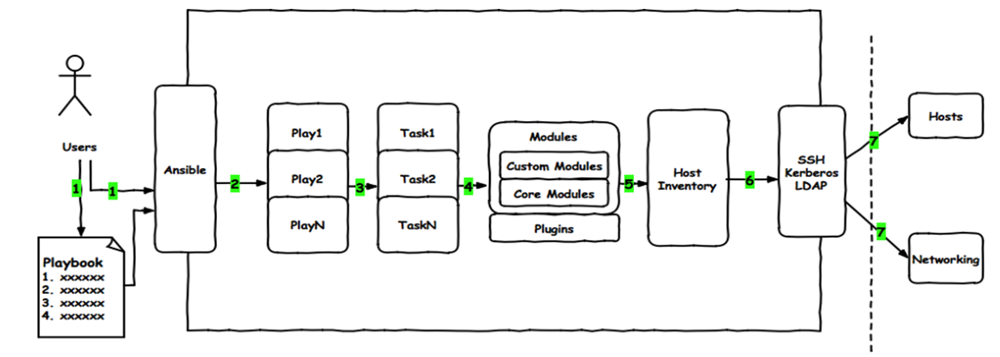
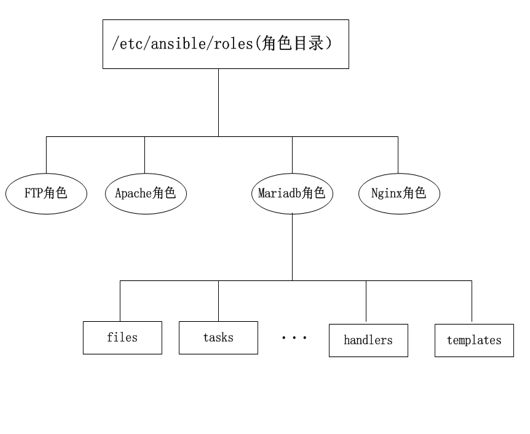

<center><font face="黑体" size="6" color="grey" >Ansible 进阶</font></center>

- :arrow_heading_up:[Ansible 入门看这篇文章](http://suosuoli.cn/?p=551)
- :arrow_heading_down:[Ansible 实战看这篇文章](http://suosuoli.cn/?p=551)

# 一.Ansible 中的 Playbook

## 1.1 Playbook 介绍

- 如下图，ansible 在整个管理过程中使用 playbook 的大体流程。

<center><div>

</div></center>

- Playbook 中包含多个 role，每个 role 对应于在远程主机完成某个比较复杂的工作，事先构建的 role 包含各个
  细分的 task，每个 task 会调用 ansible 提供的相应模块在远程主机完成部分工作，多个 task 共同完成 role
  所需要完成的工作。

## 1.2 YAML

### 1.2.1 yaml 语言简介

- YAML（/ˈjæməl/，尾音类似 camel 骆驼）是一个可读性高，用来表达数据序列化的格式。YAML 参考了其他
  多种语言，包括：C 语言、Python、Perl，并从 XML、电子邮件的数据格式（RFC 2822）中获得灵感。
  Clark Evans 在 2001 年首次发表了这种语言，另外 Ingy döt Net 与 Oren Ben-Kiki 也是这语言的共同设计者。
  当前已经有数种编程语言或脚本语言支持（或者说解析）这种语言。
- YAML 是"YAML Ain't a Markup Language"（YAML 不是一种标记语言）的递归缩写。在开发的这种语言时，
  YAML 的意思其实是："Yet Another Markup Language"（仍是一种标记语言），但为了强调这种语言以数据
  为中心，而不是以标记语言为重点，而用反返璞词[^1]重命名。

### 1.2.2 yaml 语言特性

- YAML 的可读性好
- YAML 和脚本语言的交互性好
- YAML 使用实现语言的数据类型
- YAML 有一个一致的信息模型
- YAML 易于实现
- YAML 可以基于流来处理
- YAML 表达能力强，扩展性好

### 1.2.3 ymal 语法介绍

- yaml 语言应用在 ansible 中时，每一个 YAML 文件都是从一个列表开始. 列表中的每一项都是一个键值对，一般
  被称为一个 “哈希” 或 “字典”。
- ymal 有个小特点，所有的 YAML 文件开始行都应该是 "---"。 这是 YAML 格式的一部分, 表明一个文件的开始。

- ansible 的 yaml 语法
  - 在单一文件第一行，用连续三个连字号"-"开始，还有选择性的连续三个点号( ... )用来表示文件的结尾
  - 次行开始正常写 Playbook 的内容，一般建议写明该 Playbook 的功能
  - 使用#号注释代码
  - 缩进必须是统一的，不能空格和 tab 混用
  - 缩进的级别也必须是一致的，同样的缩进代表同样的级别，程序判别配置的级别是通过缩进结合
    换行来实现的
  - YAML 文件内容是区别大小写的，key/value 的值均需大小写敏感；多个 key/value 可同行写也可换行写，
    同行使用英文逗号分隔
  - value 可是个字符串，也可是另一个列表或字典
  - 一个完整的代码块功能需最少元素需包括 name 和 task
  - 一个 name 只能包括一个 task
  - YAML 文件扩展名为 yml 或 yaml

### 1.2.4 ymal 语法示例

- 列表：列表中的所有成员都开始于相同的缩进级别, 并且使用一个 "- " 作为开头(一个横杠和一个空格):

```yml
---
# 一个美味水果的列表
- Apple
- Orange
- Strawberry
- Mango
```

- 字典：一个字典是由一个简单的 键: 值 的形式组成(这个冒号后面必须是一个空格):

```yml
---
# 一位职工的记录
name: Front-end Developer
job: Developer
skill: Brilliant
```

- 字典也可以使用缩进形式来表示, 如果你喜欢这样的话:

```yml
---
# 一位职工的记录
{ name: Front-end Developer, job: Developer, skill: Brilliant }
```

- Ansible 并不是太多的使用这种花括号的格式, 但是可以通过以下格式来指定一个布尔值(true/fase):

```yml
---
create_key: yes
needs_agent: no
knows_oop: True
likes_emacs: TRUE
uses_cvs: false
```

- 综合以上的 YAML 例子:

```yml
---
# 一位职工记录
name: stevenux
job: DevOps
skill: Excellent
employed: True
foods:
  - Apple
  - Orange
  - Strawberry
  - Mango
languages:
  ruby: Lame
  python: Fluent
  dotnet: Lame
```

- 另一个例子：

```yml
name: John Smith
age: 41
gender: Male
spouse:
  name: Jane Smith
  age: 37
  gender: Female
children:
  - name: Jimmy Smith
    age: 17
    gender: Male
  - name: Jenny Smith
    age 13
    gender: Female
```

- 除了 yaml 格式，还有 xml 和 json 等数据交换格式，对比如下

- ymal

```yml
---
# Employee records

- Employee one:
  name: Alex
  job: DevOps
  skills:
    - Python
    - C/C++
    - Ruby
- Employee two:
  name: steve
  job: DevOps
  skills:
    - Assambly
    - C/C++
    - vue
```

- json

```json
{
  "EmpRecord": {
    "Employee": [
      {
        "-id": "emp01",
        "name": "Alex",
        "job": "DevOps",
        "skills": "python, C/C++, java"
      },
      {
        "-id": "emp02",
        "name": "Bob",
        "job": "Front-end",
        "skills": "lips, forton, REST APIs"
      }
    ]
  }
}
```

- xml

```xml
<?xml version="1.0"?>
<EmpRecord>
<Employee id="emp01">
<name>Alex</name>
<job>DevOps</job>
<skills>python, C/C++, java</skills>
</Employee>

<Employee id="emp02">
<name>Bob</name>
<job>Front-end</job>
<skills>lips, forton, REST APIs</skills>
</Employee>

</EmpRecord>
```

## 1.3 Playbook 核心元素

- `Hosts` 被控制和管理的的远程主机列表
- `Tasks` 任务集，每个 task 完成某个简单任务
- `Variables` 内置变量或自定义变量在 playbook 中调用
- `Templates` 模板，可替换模板文件中的变量并实现一些简单逻辑的文件
- `Handlers` 和 `notify` 结合使用，由特定条件触发的操作，满足条件方才执行，否则不执行
- `tags` 标签 指定某条任务执行，用于选择运行 playbook 中的部分代码。ansible 具有幂等性，因此
  会自动跳过没有变化的部分，即便如此，有些代码为测试其确实没有发生变化的时间依然会非常地长。
  此时，如果确信其没有变化，就可以通过 tags 跳过此些代码片断

### 1.3.1 hosts 组件

- hosts:指定 playbook 所控制的特定主机集合，hosts 的值就是事先在 inventry 文件(默认`/etc/ansible/hosts`)
  中定义的主机。
- 例如

```yml
---
# 指定本playbook管理的主机为websrvs组的主机
- hosts: websrvs
```

或者

```yml
---
# 指定本playbook管理的主机为websrvs组的主机
- hosts: appsrvs
```

或者

```yml
---
# 指定本playbook管理的主机为appsrvs组和websrvs组的主机
- hosts: appsrvs:websrvs
```

或者

```yml
---
# 指定本playbook管理的主机为所有主机
- hosts: all
```

### 1.3.2 remote_user 组件

- remote_user 可用于主机级别(针对某个主机使用某个身份执行任务)和 task 级别(针对某个 task 以某个用户身份
  执行任务)

- 如：

```yml
---
- hosts: websrvs
  remote_user: root             # 针对主机级别
  tasks:
    - name: connection detect
      ping:
      remote_user: stevenux     # 针对某个task任务
      sudo: yes                 # 默认sudo为root
      sudo_user:steve           # sudo为steve
```

### 1.3.3 task 列表和 action 组件

- playbook 的大部分是需要进行的各项任务 task list，task list 中有一个或多个 task。各个 task 从上到下按
  次序逐个在 hosts 中指定的所有主机上执行。在所有主机上完成第一个 task 后，再开始第二个 task。task 的
  目的是使用指定的参数执行模块，而在模块参数中可以使用变量。模块执行是幂等的[^2]，多次执行是安全的，
  因为其结果均一致每个 task 都应该有其 name，用于 playbook 的执行结果输出，建议其内容能清晰地描述任务
  执行步骤。如果未提供 name，则 action 的结果将用于输出。

- task 可以使用两种格式在 playbook 中定义

  - 1.`acton: module arguments`
  - 2.`module: arguments`
    **第二种方式比较常用**

- 例如：

```yml
---
- hosts: websrvs
  remote_user: root
  tasks:
    - name: install httpd
      yum: name=httpd
    - name: start httpd
      service: name=httpd state=started enabled=yes
```

- **注意：**shell 和 command 模块后面直接跟命令

### 1.3.4 notify 和 handlers 组件

- handlers 是一个或多个 task ，其中的 task 与前述的 task 并没有本质上的不同，只是当关注的资源发生变化时，
  才会采取一定的操作。Notify 对应的 action 可用于在每个 playbook 的最后被触发，这样可避免多次有改变发生
  时每次都执行指定的操作，仅在所有的变化发生完成后一次性地执行指定操作。在 notify 中列出的操作称为
  handler，也即 notify 中调用 handler 中定义的操作。

- 例如：

```yml
---
- hosts: websrvs
  remote_user: root
  tasks:
    - name: Install httpd
      yum: name=httpd state=present
    - name: Install configure file
      copy: src=files/httpd.conf dest=/etc/httpd/conf/
      notify: restart httpd       # 定义notify
    - name: ensure apache is running
      service: name=httpd state=started enabled=yes
  
   handlers:
     - name: restart httpd        # notify定义的操作完成后就运行此任务
       service: name=httpd state=restarted
```

### 1.3.5 Playbook 中使用 tags 组件

- 在 playbook 文件中，可以利用 tags 组件，为特定 task 指定标签。当在执行 playbook 时，可以只执行特定
  tags 标识的 task,而非整个 playbook 文件

- 例如：

```yml
---
# httpd.yml
# use tags execute specific task
- hosts: websrvs
  remote_user: root
tasks:
  - name: Install httpd
    yum: name=httpd state=present
  - name: Install configure file
    copy: src=files/httpd.conf dest=/etc/httpd/conf/
    tags: conf
  - name: start httpd service
    tags: service
    service: name=httpd state=started enabled=yes
```

`root@ubuntu1904:~#ansible-playbook -t conf,service httpd.yml` 只执行 tags 标识的 task

### 1.3.6 Playbook 简单示例

- 1.install_httpd.yml

```yml
---
# install httpd example
- hosts: websrvs
  remote_user: root  
  tasks:
    - name: Install httpd
      yum: name=httpd state=present
    - name: Install configure file
      copy: src=files/httpd.conf dest=/etc/httpd/conf/
    - name: start service
      service: name=httpd state=started enaled=yes
```

- 2.remove_httpd.yml

```yml
# remove httpd example
---
- hosts: websrvs
  remote_user: root
  tasks:
    - name: remove httpd package
      yum: name=httpd state=absent
    - name: remove apache user
      user: name=apache state=absent
    - name: remove data file
      file: name=/etc/httpd  state=absent
```

- 3.create_mysql_user.yml

```yml
---
- hosts: dbsrvs
  remote_user: root
  tasks:
    - {name: create group, group: name=mysql system=yes gid=306}
    - name: create user
      user: name=mysql shell=/sbin/nologin system=yes group=mysql uid=306
home=/data/mysql create_home=no  
```

- 4.install_nginx.yml

```yml
---
# install nginx
- hosts: websrvs
  remote_user: root  
  tasks:
    - name: add group nginx
      user: name=nginx state=present
    - name: add user nginx
      user: name=nginx state=present group=nginx
    - name: Install Nginx
      yum: name=nginx state=present
    - name: Start Nginx
      service: name=nginx state=started enabled=yes
```

- 5.install_mysql-5.6.yml

```bash
root@ubuntu1904:~#ll /data/ansible_exercise/roles/mysqld/files/mysql-5.6.46-linux-glibc2.12-x86_64.tar.gz
-rw-r--r-- 1 root root 403177622 Nov 18 19:13 /data/ansible_exercise/roles/mysqld/files/mysql-5.6.46-linux-glibc2.12-x86_64.tar.gz
root@ubuntu1904:~#cat /data/ansible_exercise/roles/mysqld/files/my.cnf
[mysqld]
log-bin
socket=/data/mysql/mysql.sock
user=mysql
symbolic-links=0
datadir=/data/mysql
innodb_file_per_table=1

[client]
port=3306
socket=/data/mysql/mysql.sock

[mysqld_safe]
log-error=/var/log/mysqld.log
pid-file=/data/mysql/mysql.pid

root@ubuntu1904:~#cat /data/ansible_exercise/roles/mysqld/files/secure_mysql.sh
#!/bin/bash
/usr/local/mysql/bin/mysql_secure_installation <<EOF

y
stevenux
stevenux
y
y
y
y
EOF
```

- install_mysql.yml

```yml
# install mysql-5.6.46-linux-glibc2.12-x86_64.tar.gz
- hosts: websrvs
  remote_user: root
  tasks:
    - name: install packages
      yum: name=libaio,perl-Data-Dumper,perl-Getopt-Long
    - name: create mysql group
      group: name=mysql gid=306
    - name: create mysql user
      user: name=mysql uid=306 group=mysql shell=/sbin/nologin system=yes create_home=no home=/data/mysql
    - name: copy tar to remote host and file mode
      unarchive: src=/data/ansible/files/mysql-5.6.46-linux-glibc2.12-x86_64.tar.gz dest=/usr/local/ owner=root group=root
    - name: mkdir /usr/local/mysql
      file: src=/usr/local/mysql-5.6.46-linux-glibc2.12-x86_64 dest=/usr/local/mysql state=link
    - name: data dir
      shell: chdir=/usr/local/mysql/  ./scripts/mysql_install_db --datadir=/data/mysql --user=mysql
      tags: data
    - name: config my.cnf
      copy: src=/data/ansible/files/my.cnf  dest=/etc/my.cnf
    - name: service script
      shell: /bin/cp /usr/local/mysql/support-files/mysql.server/etc/init.d/mysqld
    - name: enable service
      shell: /etc/init.d/mysqld start;chkconfig --add mysqld;chkconfig mysqld on
      tags: service
    - name: PATH variable
      copy: content='PATH=/usr/local/mysql/bin:$PATH' dest=/etc/profile.d/mysql.sh
    - name: secure script
      script: /data/ansible/files/secure_mysql.sh
      tags: script
```

- 6.install_mariadb.yml

```yml
---
#Installing MariaDB Binary Tarballs
- hosts: dbsrvs
  remote_user: root
  tasks:
    - name: create group
      group: name=mysql gid=27 system=yes
    - name: create user
      user: name=mysql uid=27 system=yes group=mysql shell=/sbin/nologin
home=/data/mysql create_home=no
    - name: mkdir datadir
      file: path=/data/mysql owner=mysql group=mysql state=directory
    - name: unarchive package
      unarchive: src=/data/ansible/files/mariadb-10.2.27-linux-x86_64.tar.gz
dest=/usr/local/ owner=root group=root
    - name: link
      file: src=/usr/local/mariadb-10.2.27-linux-x86_64 path=/usr/local/mysql
state=link
    - name: install database
      shell: chdir=/usr/local/mysql   ./scripts/mysql_install_db --
datadir=/data/mysql --user=mysql
    - name: config file
      copy: src=/data/ansible/files/my.cnf  dest=/etc/ backup=yes
    - name: service script
      shell: /bin/cp  /usr/local/mysql/support-files/mysql.server
/etc/init.d/mysqld
    - name: start service
      service: name=mysqld state=started enabled=yes
    - name: PATH variable
      copy: content='PATH=/usr/local/mysql/bin:$PATH'
dest=/etc/profile.d/mysql.sh
```

## 1.4 Playbook 中使用变量

- Playbook 中的变量可以在多个地方定义，在 playbook 中调用。使用等号将值赋给变量。

- 变量定义
  `Key(variable)=Value`
- 如：
  `http_port=80`
  `install_path=/usr/local/`
- 变量调用
  在 playbook 中使用 `{{ variable }}` 形式调用变量的值

- playbook 中的变量可以来自：

  1. ansible 的 setup 模块所提供的关于手机远程主机信息的变量都可以使用，如：

  ```bash
  {{ ansible_default_ipv4.address }}
  {{ansible_distribution}}
  {{ansible_distribution_major_version}}
  {{ansible_fqdn}}
  {{ansible_hostname}}
  {{ansible_machine}}
  {{ansible_memtotal_mb}}
  {{ansible_memory_mb.nocache.free}}
  {{ansible_memory_mb.nocache.used}}
  {{ansible_memory_mb.real.total}}
  {{ansible_memory_mb.real.free}}
  {{ansible_memory_mb.real.used}}
  {{ansible_service_mgr}}
  {{ansible_processor_cores}}
  {{ansible_processor_count}}
  {{ansible_processor_threads_per_core}}
  {{ansible_pkg_mgr}}
  ```

  2. 通过命令指定的变量，优先级最高，同名时会替代文件中定义的变量
     `ansible-playbook -e varname=value`
  3. 在 playbook 中定义变量

  ```yml
  ---
  vars:
    - var1: value1
    - var2: value2
  ```

  4. 在独立的变量 yaml 文件中定义，专门放变量；在 playbook 中包含该变量文件

  ```yml
  ---
  # vars.yml
  var1: value1
  var2: value2
  ```

  ```yml
  ---
  # main.yml
  - hosts: all
    vars_files:
      - vars.yml
  ```

  5. `/etc/ansible/hosts` 中也可以定义关于主机的变量

  - 主机（普通）变量：主机组中主机单独定义，优先级高于公共变量
  - 组（公共）变量：针对主机组中所有主机定义统一变量

### 1.4.1 使用 setup 模块中提供的变量

```yml
---
# setup_var_exp.yml
- hosts: websrvs
  remote_user: root
  
  tasks:
    - name: create log file
      file: name=/var/log/ {{ ansible_fqdn }} state=touch
```

### 1.4.2 使用 ansible-playbook 命令时定义变量，传递给 playbook

```yml
---
# cli_var.yml
- hosts: websrvs
  remote_user: root
  tasks:
    - name: install package
      yum: name={{ pkg_name }} state=present
```

使用：`root@ubuntu1904:~#ansible-playbook –e pkg_name=httpd cli_var.yml`

### 1.4.3 使用 playbook 自己定义的变量

```yml
---
# self_var.yml
- hosts: websrvs
  remote_user: root
  vars:
    - username: user1
    - groupname: group1
  
  tasks:
    - name: create group
      group: name={{ groupname }} state=present
    - name: create user
      user: name={{ username }} state=present
```

使用`root@ubuntu1904:~#ansible-playbook self_var.yml`
或者`root@ubuntu1904:~#ansible-playbook -e "username=user2 groupname=group2" self_var.yml`
此时，cli 的变量优先级高，playbook 内的变量值不再使用。

### 1.4.4 使用某个文件中定义的变量

- 可以在一个独立的 playbook 文件中定义变量，在另一个 playbook 文件中引用变量文件中的变量，
  其比 playbook 中定义的变量优化级高

- 如：

  - vars.yml

  ```yml
  ---
  # variables file
  pack: vsftpd
  service: vsftpd
  ```

  - install.yml

  ```yml
  ---
  #install app and configure
  - hosts: appsrvs
    remote_user: root
    vars_files:
      - vars.yml   # 包含进变量文件
    tasks:
      - name: install package
        yum: name={{pack}}
        tags: install
      - name: start service
        service: name={{service}} state=started enabled=yes

    handlers:
      - name: restart httpd service
        service: name={{service}} state=restarted
  ```

### 1.4.5 在主机列表文件中定义变量

- 主机变量:在主机 ip 地址后或者主机的 fqdn 后定义

- 如：

```ini
[websrvs]
172.20.1.68 http_port=80 # 变量
172.20.1.69 http_port=8080 maxRequestsPerChild=909 # 两个变量
```

- 组变量:在 inventory 主机清单文件中赋予给指定组内所有主机上的在 playbook 中可用的变量

```ini
[websrvs]
wwwa.stevenux.com
wwwb.stevenux.com
[websrvs:vars]
ntp_server=ntp.stevenux.com
nfs_server=nfs.stevenux.com
```

- 如:

  - `/etc/ansible/hosts`

  ```ini
  [websrvs]
  192.168.0.101 http_port=8080 hname=www1
  192.168.0.102 http_port=80    hname=www2
  [websvrs:vars]
  http_port=808
  mark=“-”
  [websrvs]
  192.168.0.101 http_port=8080 hname=www1
  192.168.0.102 http_port=80 hname=www2
  ```

  使用`root@ubuntu1904:~#ansible websvrs –m hostname –a 'name={{ hname }}{{ mark }}{{ http_port }}'`
  或者`ansible websvrs –e http_port=8000 –m hostname –a 'name={{ hname }}{{ mark }}{{ http_port }}'`

## 1.5 Playbook 中使用模板

- 模板是一个文本文件，可以做为生成文件的模版，并且模板文件中还可嵌套 jinja2 语言的语法。有了
  模板可以根据不同的主机生成不同的配置文件，非常有用。

### 1.5.1 jinja2 语言基础

- 1.jinja2 语言大量使用下面的数据结构:
  字符串：使用单引号或双引号
  数字：整数，浮点数
  列表：`[item1, item2, ...]`
  元组：`(item1, item2, ...)`
  字典：`{key1:value1, key2:value2, ...}`
  布尔型：true/false
  `{{ var }}`: 变量使用两个花括号括起来
  ``: jinja2 语句(for 遍历和 if 条件等)
  `{#...#}`: 注释

- 2.jinja2 支持如下运算：

`+`把两个对象加到一起。通常对象是数字，但是如果两者是字符串或列表，也可以用这种方式来衔接它们。无论如何
这不是首选的连接字符串的方式！连接字符串一般使用`~` 运算符。 `{{ 1 + 1 }}` 等于 2
`-`用第一个数减去第二个数。 `{{ 3 - 2 }}` 等于 1
`/`对两个数做除法。返回值会是一个浮点数。 `{{ 1 / 2 }}` 等于 `{{ 0.5 }}`
`//`对两个数做除法，返回整数商。 `{{ 20 // 7 }}` 等于 2
`%`计算整数除法的余数。 `{{ 11 % 7 }}` 等于 4
`*`用右边的数乘左边的操作数。`{{ 2 * 2 }}` 会返回 4 。也可以用于重 复一个字符串多次。`{{ ‘=’ * 80 }}`
会打印 80 个等号的横条\
`**`取左操作数的右操作数次幂。 `{{ 2**3 }}` 会返回 8

- 3.比较操作符
  `==` 比较两个对象是否相等
  `!=` 比较两个对象是否不等
  `>`如果左边大于右边，返回 true
  `>=` 如果左边大于等于右边，返回 true
  `<`如果左边小于右边，返回 true
  `<=` 如果左边小于等于右边，返回 true

- 逻辑运算

`and` 如果左操作数和右操作数同为真，返回 true
`or`如果左操作数和右操作数有一个为真，返回 true
`not` 对一个表达式取反
`(expr)`表达式组
`true / false` true 永远是 true ，而 false 始终是 false

### 1.5.2 template 模块功能和模板文件使用

- 在 playbook 中 template 模块用来将 ansible 所在的主控机上的 jinja2 格式模板文件(如:xxx.conf.j2)处理为相应
  的配置文件并发送到远程被控主机。根据模板文件动态生成配置文件。template 模板文件必须存放于 templates
  目录下，且命名为.j2 结尾的 jinja2 文件。yaml/yml 文件需和 templates 目录平级，目录结构如下：

  ```bash
  root@ubuntu1904:/data/ansible_exercise/roles#tree httpd/
  httpd/
  ├── handlers
  │   └── main.yml
  │────── config.yml
  └─── templates
       └── httpd.conf.j2
  ```

  - `httpd/handlers/main.yml`

  ```yml
  root@ubuntu1904:/data/ansible_exercise/roles/httpd#cat handlers/main.yml
  ---
  - name: restart
    service: name=httpd state=restarted
  ```

  - `httpd/tasks/config.yml`

  ```yml
  root@ubuntu1904:/data/ansible_exercise/roles/httpd#cat config.yml
  ---
  - name: config
    template: src=httpd.conf.j2 dest=/etc/httpd/conf/httpd.conf backup=yes
    notify: restart
  ```

  - httpd.conf.j2

  ```jinja2
  ServerRoot "/etc/httpd"
  Listen {{ 8080 }}        {#将配置文件的端口定义为8080，远程主机将使用8080监听#}
  Include conf.modules.d/*.conf
  User apache
  Group apache
  ServerAdmin root@localhost
  ......
  ```

使用`root@ubuntu1904:~#ansible-playbook /data/ansible_exercise/roles/httpd/config.yml`

- **在 template 模板中使用 for 和 if 语句**

- 如：

  - `temp_nginx.yml`

    ```yml
    ---
    # temp_nginx.yml
    - hosts: websrvs
      remote_user: root
      vars:
        nginx_vhosts:
          - listen: 8080
      tasks:
      - name: config file
          template: src=nginx2.conf.j2 dest=/data/nginx2.conf
    ```

  - `templates/nginx.conf.j2`

    ```jinja2
    
    server {
    listen {{ vhost.listen }}
    }
    

    {#在远程主机生成的结果#}
    server {
    listen 8080
    }
    ```

- for 例子：

```yml
root@ubuntu1904:/data/test_ansible#cat  /data/test_ansible/config.yml
---
- hosts: websrvs
  remote_user: root
  vars:
    nginx_vhosts:
      - 11
      - 22
      - 33
      - 44
  tasks:
    - name: gen config
      template: src=test.conf.j2 dest=/data/test.conf
      notify: test

  handlers:
    - name: test
      shell: cat /data/test.conf > /dev/pts/0
```

```jinja2
root@ubuntu1904:/data/test_ansible#cat  /data/test_ansible/templates/test.conf.j2


I'm : {{ ansible_default_ipv4.address }}
server {
    Listen {{ vhost }}
}

{% endfor %

```

使用`root@ubuntu1904:/data/test_ansible#ansible-playbook /data/test_ansible/config.yml`
生成：

```jinja2
I'm : 172.20.1.67
server {
        Listen 11
}


I'm : 172.20.1.67
server {
        Listen 22
}


I'm : 172.20.1.67
server {
        Listen 33
}


I'm : 172.20.1.67
server {
        Listen 44
}
```

- 另一个 for 例子：

```yml
#temnginx3.yml
- hosts: websrvs
remote_user: root
  vars:
    nginx_vhosts:
      - listen: 8080
        server_name: "web1.magedu.com"
        root: "/var/www/nginx/web1/"
      - listen: 8081
        server_name: "web2.magedu.com"
        root: "/var/www/nginx/web2/"
      - {listen: 8082, server_name: "web3.magedu.com", root:"/var/www/nginx/web3/"}
  tasks:
    - name: template config
      template: src=nginx3.conf.j2 dest=/data/nginx3.conf
  
# templates/nginx3.conf.j2

server {
   listen {{ vhost.listen }}
   server_name {{ vhost.server_name }}
   root {{ vhost.root }}  
}

  
#生成结果：
server {
    listen 8080
    server_name web1.magedu.com
    root /var/www/nginx/web1/  
}
server {
    listen 8081
    server_name web2.magedu.com
    root /var/www/nginx/web2/  
}
server {
    listen 8082
    server_name web3.magedu.com
    root /var/www/nginx/web3/  
}
```

- 在模版文件中还可以使用 if 条件判断，决定是否生成相关的配置信息

```yml
#temnginx4.yml
- hosts: websrvs
  remote_user: root
  vars:
    nginx_vhosts:
      - web1:
        listen: 8080
        root: "/var/www/nginx/web1/"
      - web2:
        listen: 8080
  server_name: "web2.magedu.com"
        root: "/var/www/nginx/web2/"
      - web3:
        listen: 8080
        server_name: "web3.magedu.com"
        root: "/var/www/nginx/web3/"
  tasks:
    - name: template config to
       template: src=nginx.conf.j2 dest=/etc/nginx/nginx.conf
#templates/nginx.conf4.j2

server {
   listen {{ vhost.listen }}
   
server_name {{ vhost.server_name }}
   
   root  {{ vhost.root }}
}

#生成的结果
server {
   listen 8080
   root  /var/www/nginx/web1/
}
server {
   listen 8080
   server_name web2.magedu.com
   root  /var/www/nginx/web2/
}
server {
   listen 8080
   server_name web3.magedu.com
   root  /var/www/nginx/web3/
}
```

## 1.6 Playbook 中使用 when 条件

- when 语句，可以实现条件测试。如果需要根据变量、facts 或此前任务的执行结果来做为某 task 执行与否的
  前提时要用到条件测试,通过在 task 后添加 when 子句即可使用条件测试，jinja2 的语法格式

- 例如：

```yml
---
- hosts: websrvs
  remote_user: root
  tasks:
    - name: "shutdown RedHat flavored systems"
      command: /sbin/shutdown -h now
      when: ansible_os_family == "RedHat"
```

```yml
---
- hosts: websrvs
  remote_user: root
  tasks:
    - name: add group nginx
      tags: user
      user: name=nginx state=present
    - name: add user nginx
      user: name=nginx state=present group=nginx
    - name: Install Nginx
      yum: name=nginx state=present
    - name: restart Nginx
      service: name=nginx state=restarted
      when: ansible_distribution_major_version == “6”
```

```yml
---
- hosts: websrvs
  remote_user: root
  tasks:
    - name: install conf file to centos7
      template: src=nginx.conf.c7.j2 dest=/etc/nginx/nginx.conf
      when: ansible_distribution_major_version == "7"
    - name: install conf file to centos6
      template: src=nginx.conf.c6.j2 dest=/etc/nginx/nginx.conf
      when: ansible_distribution_major_version == "6"
```

## 1.7 Playbook 中使用迭代 with_items

- 迭代：当有需要重复性执行的任务时，可以使用迭代机制对迭代项的引用，固定变量名为'item'
  需要在 task 中使用 with_items 给定要迭代的元素列表(字符串或者字典)

- 例如：

```yml
---
- hosts: websrvs
  remote_user: root
  
  tasks:
    - name: add some users
      user: name={{ item }} state=present groups=wheel
      with_items:
        - testuser1
        - testuser2
        #上面语句的功能等同于下面的语句
    - name: add user testuser1
      user: name=testuser1 state=present groups=wheel
    - name: add user testuser2
      user: name=testuser2 state=present groups=wheel
```

```yml
---
#remove mariadb server
- hosts: appsrvs:!192.168.38.8
  remote_user: root
  tasks:
    - name: stop service
      shell: /etc/init.d/mysqld stop
    - name:  delete files and dir
      file: path={{item}} state=absent
      with_items:
        - /usr/local/mysql
        - /usr/local/mariadb-10.2.27-linux-x86_64
        - /etc/init.d/mysqld
        - /etc/profile.d/mysql.sh
        - /etc/my.cnf
        - /data/mysql
    - name: delete user
      user: name=mysql state=absent remove=yes
```

```yml
---
- hosts：websrvs
  remote_user: root
  
  tasks
    - name: install some packages
      yum: name={{ item }} state=present
      with_items:
        - nginx
        - memcached
        - php-fpm
```

```yml
---
- hosts: websrvs
  remote_user: root
  tasks:
    - name: copy file
      copy: src={{ item }} dest=/tmp/{{ item }}
      with_items:
        - file1
        - file2
        - file3
    - name: yum install httpd
      yum: name={{ item }}  state=present
      with_items:
        - apr
        - apr-util
        - httpd
```

- 迭代嵌套子变量：在迭代中，还可以嵌套子变量，关联多个变量在一起使用

```yml
---
- hosts: websrvs
  remote_user: root
  
  tasks:
    - name: add some groups
      group: name={{ item }} state=present
      with_items:
        - nginx
        - mysql
        - apache
    - name: add some users
      user: name={{ item.name }} group={{ item.group }} state=present
      with_items:
        - { name: 'nginx', group: 'nginx' }
        - { name: 'mysql', group: 'mysql' }
        - { name: 'apache', group: 'apache' }
```

# 二.Ansible 中的 roles

- 角色是 ansible 自 1.2 版本引入的新特性，用于层次性、结构化地组织 playbook。roles 能够根据层次型结
  构自动装载变量文件、tasks 以及 handlers 等。要使用 roles 只需要在 playbook 中使用 include 指令即
  可。简单来讲，roles 就是通过分别将变量、文件、任务、模板及处理器放置于单独的目录中，并可以便
  捷地 include 它们的一种机制。角色一般用于基于主机构建服务的场景中，但也可以是用于构建守护进
  程等场景中。运维复杂的场景：建议使用 roles，代码复用度高。
- roles：多个角色的集合， 可以将多个的 role，分别放至 roles 目录下的独立子目录中

```yml
root@ubuntu1904:/data/ansible_exercise#tree -L 1 roles/
roles/
├── httpd
├── memcached
├── mysqld
├── nginx
├── pxc
├── role_httpd.yml
├── role_nginx.yml
├── role_pxc.ym
```

## 2.1 Ansible roles architecture

- Ansible 中的 roles 结构

<center><div>

</div>
</center>

- 每个 role 的目录结构

```bash
root@ubuntu1904:/data/ansible_exercise#tree roles/httpd/
roles/httpd/
├── default
│   └── main.yml
├── files
│   ├── httpd.conf
│   └── index.html
├── handlers
│   └── main.yml
├── tasks
│   ├── config.yml
│   ├── index.yml
│   ├── install.yml
│   ├── main.yml
│   ├── remove.yml
│   └── service.yml
├── templates
│   └── httpd.conf.j2
└── vars
└── main.yml
```

- Roles 各目录作用
  `/roles/project/` :项目名称,有以下子目录
  `files/` ：存放由 copy 或 script 模块等调用的文件
  `templates/`：template 模块查找所需要模板文件的目录
  `tasks/`：定义 task,role 的基本元素，至少应该包含一个名为 main.yml 的文件；其它的文件需要在此文件中通过 include 进行包含
  `handlers/`：至少应该包含一个名为 main.yml 的文件；其它的文件需要在此文件中通过 include 进行包含
  `vars/`：定义变量，至少应该包含一个名为 main.yml 的文件；其它的文件需要在此文件中通过 include 进行包含
  `meta/`：定义当前角色的特殊设定及其依赖关系,至少应该包含一个名为 main.yml 的文件，其它文件需在此文件中通过 include 进行包含
  `default`/：设定默认变量时使用此目录中的 main.yml 文件

## 2.2 创建 roles

- 创建 role 的步骤
  (1) 创建以 roles 命名的目录
  (2) 在 roles 目录中分别创建以各角色名称命名的目录，如 webservers 等
  (3) 在每个角色命名的目录中分别创建 files、handlers、meta、tasks、templates 和 vars 目录；用不到
  的目录可以创建为空目录，也可以不创建
  (4) 在 playbook 文件中，调用各角色
  针对大型项目使用 Roles 进行编

- 例子：

```bash
root@ubuntu1904:/data/ansible_exercise#tree roles/
roles/
├── httpd
│   ├── default
│   │   └── main.yml
│   ├── files
│   │   ├── httpd.conf
│   │   └── index.html
│   ├── handlers
│   │   └── main.yml
│   ├── tasks
│   │   ├── config.yml
│   │   ├── index.yml
│   │   ├── install.yml
│   │   ├── main.yml
│   │   ├── remove.yml
│   │   └── service.yml
│   ├── templates
│   │   └── httpd.conf.j2
│   └── vars
│       └── main.yml
├── memcached
│   ├── default
│   ├── handlers
│   ├── tasks
│   ├── templates
│   └── vars
├── mysqld
│   ├── default
│   ├── files
│   │   ├── my.cnf
│   │   ├── mysql-5.6.46-linux-glibc2.12-x86_64.tar.gz
│   │   └── secure_mysql.sh
│   ├── handlers
│   ├── tasks
│   │   ├── main.yml
│   │   └── remove_mysql.yml
│   ├── templates
│   └── vars
│       └── mysql_vars.yml
├── nginx
│   ├── default
│   │   └── main.yml
│   ├── files
│   ├── handlers
│   │   ├── handler.yml
│   │   └── main.yml
│   ├── tasks
│   │   ├── config.yml
│   │   ├── file.yml
│   │   ├── install.yml
│   │   ├── main.yml
│   │   └── service.yml
│   ├── templates
│   └── vars
│       └── main.yml
├── pxc
│   ├── default
│   │   └── main.yml
│   ├── files
│   │   ├── percona.repo
│   │   └── wsrep.cnf
│   ├── handlers
│   │   └── main.yml
│   ├── tasks
│   │   ├── install_pxc.retry
│   │   ├── install_pxc.yml
│   │   └── main.yml
│   ├── templates
│   └── vars
├── role_httpd.yml
├── role_nginx.yml
├── role_pxc.yml
└── self_report
    ├── self_report.j2
    ├── self_report.retry
    └── self_report.yml
```

## 2.3 如何在 playbook 中调用角色

- 直接调用

`root@ubuntu1904:/data/ansible_exercise#cat roles/role_httpd.ym`

```yml
---
- hosts: websrvs
  remote_user: root

  roles:
    - role: httpd`
```

`root@ubuntu1904:/data/ansible_exercise#tree roles/httpd/`

```bash
roles/httpd/
├── default
│   └── main.yml
├── files
│   ├── httpd.conf
│   └── index.html
├── handlers
│   └── main.yml
├── tasks
│   ├── config.yml
│   ├── index.yml
│   ├── install.yml
│   ├── main.yml
│   ├── remove.yml
│   └── service.yml
├── templates
│   └── httpd.conf.j2
└── vars
    └── main.yml
```

- 调用时传参:键 role 用于指定角色名称，后续的 k/v 用于传递变量给角色

```yml
---
- hosts: all
  remote_user: root
  roles:
    - mysql
    - { role: nginx, username: nginx }
```

- 基于条件测试实现角色调用

```yml
---
- hosts: all
  remote_user: root
  roles:
    - { role: nginx, username: nginx, when: ansible_distribution_major_version == ‘7’  }
```

- 使用 tags 标识 role

```yml
#nginx-role.yml
---
- hosts: websrvs
  remote_user: root
  roles:
    - { role: nginx ,tags: [ 'nginx', 'web' ] ,when: ansible_distribution_major_version == "6“ }
    - { role: httpd ,tags: [ 'httpd', 'web' ]  }
    - { role: mysql ,tags: [ 'mysql', 'db' ] }
    - { role: mariadb ,tags: [ 'mariadb', 'db' ] }
```

`ansible-playbook --tags="nginx,httpd,mysql" nginx-role.yml`

## 脚注

[^1]: 返璞词(retronyms)：语言变化的一种方式即创造词条，描述已有概念的新版本或新发明，例如合成词 electric guitar（电吉他），将新发明与现有类型的吉他区分开来。然而，随着电吉他的使用变得越来越普遍，guitar（吉他）一词已不再明确地描述一种不用电子放大器就能弹奏的乐器。相反，早期的发明获得了一个新名称，acoustic guitar（原声吉他），以明确所指哪一种吉他。为了将已有概念与新概念区分开来而发明的词称为返璞词。
[^2]: 幂等(idempotent)：幂等（idempotent、idempotence）是一个数学与计算机学概念，常见于抽象代数中。 在数学里， 幂等有两种主要的定义。在某二元运算下， 幂等元素是指被自己重复运算(或对于函数是为复合)的结果等于它自己的元素。例如，乘法下唯一两个幂等实数为 0 和 1。某一元运算为 幂等的时，其作用在任一元素两次后会和其作用一次的结果相同。例如，高斯符号便是幂等的。
