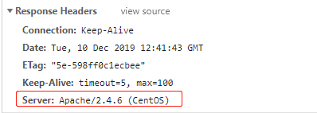
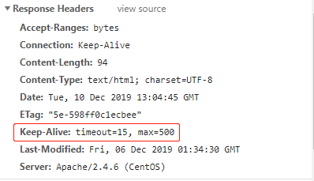
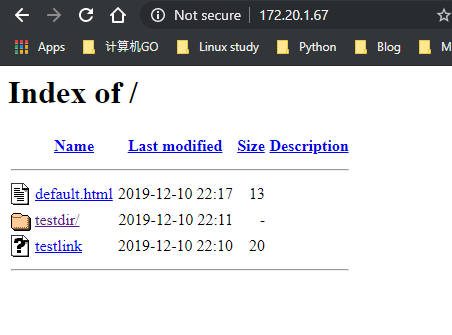
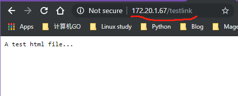
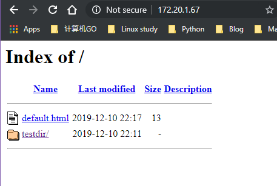

<center><font face="黑体" color="grey" size="5">HTTPD入门和常见配置</font></center>

# 一.HTTPD 介绍

## 1.1 常见 http 服务器

## 1.2 apache 介绍和 httpd 特点

# 二.HTTPD 安装及重要文件

## 2.1 使用包管理器直接 rpm 包安装 httpd

## 2.2 htpd-2.4 版本重要文件

## 2.3 httpd 配置文件介绍

## 2.4 编译安装 httpd-2.4 版本

### 2.4.1 编译准备

### 2.4.2 编译安装法一

### 2.4.3 编译安装法二

### 2.4.4 安装后配置

# 三.HTTPD 常见配置

## :a:

### 3.1 显示服务器版本信息

指令：`ServerTokens Major|Minor|Min[imal]|Prod|OS|Full`

`ServerTokens Major` 在响应头中显示服务器的主版本号
`ServerTokens Minor` 在响应头中显示服务器的主版本号和次版本号
`ServerTokens Min[imal]` 在响应头中显示服务器的完整版本号
`ServerTokens Prod` 只显示服务器类型----**生产建议使用该值**
`ServerTokens OS` 显示完整版本号和操作系统类型
`ServerTokens Full` 都显示，不配置时默认使用 full 值

<div>

</div>

### 3.2 设置监听的 IP 和 PORT 端口

指令：`Listen [IP:]PORT`

- 1 省略 IP 表示为本机所有 IP
- 2 Listen 指令至少一个，可重复出现多次

```py
  Listen 192.168.1.100:8080
  Listen 80
```

### 3.3 持久连接

- 持久连接：Persistent Connection，每个资源获取完成后不会断开连接，而是继续等待其它的请求完成，不配置时
  默认关闭持久连接
- 连接断开的条件：
  时间限制：以秒为单位， 默认 5s，httpd-2.4 支持毫秒级
  副作用：**对并发访问量大的服务器，持久连接会使有些请求得不到响应**
  折衷：使用较短的持久连接时间

- 配置持久连接的指令

```py
KeepAlive  On|Off
KeepAliveTimeOut  15      # 连接持续15s,可以以ms为单位,默认值为5s
MaxKeepAliveRequests 500  # 持久连接最大接收的请求数,默认值100
```

- 通过 telnet 使用 GET 方法测试

```jinja2
[root@webhost ~]# telnet 172.20.1.67 80
Trying 172.20.1.67...
Connected to 172.20.1.67.
Escape character is '^]'.
GET /index.html HTTP/1.1   # 使用GET方法
HOST:2.2.2.2

HTTP/1.1 200 OK
Date: Tue, 10 Dec 2019 13:01:05 GMT
Server: Apache/2.4.6 (CentOS)
Last-Modified: Fri, 06 Dec 2019 01:34:30 GMT
ETag: "5e-598ff0c1ecbee"
Accept-Ranges: bytes
Content-Length: 94
Content-Type: text/html; charset=UTF-8

<DOCTYPE html>
<head>
        <p1>Hello There!</p1>
</head>

<body>
        <a>A test message!!</a>
</body>

# 返回html响应体后并没有立即断开连接...


Connection closed by foreign host. # 15秒后无请求，断开连接
```

- 通过浏览器看响应头部信息
  <div>
  
  </div>

### 3.4 DSO(Dymanic Shared Object)配置

- `Dynamic Shared Object`加载动态模块配置，不需重启即生效
  动态模块所在路径为`/usr/lib64/httpd/modules/`

- 先在主配置文件中`/etc/httpd/conf/httpd.conf`指定加载模块配置文件

```py
ServerRoot "/etc/httpd"
Include conf.modules.d/*.conf
```

- 再到`/etc/httpd/conf.modules.d/`文件夹下添加特定模块的配置文件和指令
  模块文件路径可使用相对路径：相对于 ServerRoot（默认/etc/httpd）

```py
LoadModule <mod_name> <mod_path>
```

- 例：查看一些模块的配置文件和加载情况

```bash
# 查看默认有哪些模块的配置文件
[root@webhost ~]# ls -l /etc/httpd/conf.modules.d/
total 28
-rw-r--r-- 1 root root 3739 Aug  6 21:44 00-base.conf
-rw-r--r-- 1 root root  139 Aug  6 21:44 00-dav.conf
-rw-r--r-- 1 root root   41 Aug  6 21:44 00-lua.conf
-rw-r--r-- 1 root root  742 Aug  6 21:44 00-mpm.conf
-rw-r--r-- 1 root root  957 Aug  6 21:44 00-proxy.conf
-rw-r--r-- 1 root root   88 Aug  6 21:44 00-systemd.conf
-rw-r--r-- 1 root root  451 Aug  6 21:44 01-cgi.conf
# 查看httpd通常需要加载的模块
[root@webhost ~]# cat /etc/httpd/conf.modules.d/00-base.conf
#
# This file loads most of the modules included with the Apache HTTP
# Server itself.
#

LoadModule access_compat_module modules/mod_access_compat.so
LoadModule actions_module modules/mod_actions.so
LoadModule alias_module modules/mod_alias.so
LoadModule allowmethods_module modules/mod_allowmethods.so
LoadModule auth_basic_module modules/mod_auth_basic.so
LoadModule auth_digest_module modules/mod_auth_digest.so
LoadModule authn_anon_module modules/mod_authn_anon.so
LoadModule authn_core_module modules/mod_authn_core.so
LoadModule authn_dbd_module modules/mod_authn_dbd.so
LoadModule authn_dbm_module modules/mod_authn_dbm.so
LoadModule authn_file_module modules/mod_authn_file.so
LoadModule authn_socache_module modules/mod_authn_socache.so
......

# 查看静态编译的模块
[root@webhost ~]# httpd -l
Compiled in modules:
  core.c
  mod_so.c
  http_core.c

# 查看静态编译的模块和动态加载的模块
[root@webhost ~]# httpd -M

 autoindex_module (shared)
 cache_module (shared)
 cache_disk_module (shared)
 data_module (shared)
 dbd_module (shared)
 deflate_module (shared)
 dir_module (shared)
 dumpio_module (shared)
 echo_module (shared)
 env_module (shared)
 expires_module (shared)
 ext_filter_module (shared)
 filter_module (shared)
 headers_module (shared)
 include_module (shared)
 info_module (shared)
 log_config_module (shared)
 .......
```

### 3.5 MPM(Multi-Processing Module)模块配置

- MPM(Multi-Processing Module)多路处理模块使得 httpd 支持三种 MPM 工作模式：prefork, worker, event
  分别由三个对应的 MPM 模块来提供对应的工作模式，配置文件位于`/etc/httpd/conf.modules.d/00-mpm.conf`

```bash
[root@webhost ~]# cat /etc/httpd/conf.modules.d/00-mpm.conf
# Select the MPM module which should be used by uncommenting exactly
# one of the following LoadModule lines:

# prefork MPM: Implements a non-threaded, pre-forking web server
# See: http://httpd.apache.org/docs/2.4/mod/prefork.html
LoadModule mpm_prefork_module modules/mod_mpm_prefork.so

# worker MPM: Multi-Processing Module implementing a hybrid
# multi-threaded multi-process web server
# See: http://httpd.apache.org/docs/2.4/mod/worker.html
#
#LoadModule mpm_worker_module modules/mod_mpm_worker.so

# event MPM: A variant of the worker MPM with the goal of consuming
# threads only for connections with active processing
# See: http://httpd.apache.org/docs/2.4/mod/event.html
#
#LoadModule mpm_event_module modules/mod_mpm_event.so
```

- centos7 目前默认的为 prefork 工作模式，启用 MPM 相关的 LoadModule 指令即可使用相应的工作模式，其它未
  启用的两项需要在行首加#注释

- 注意：不要同时启用多个 MPM 模块，否则会出现类似下面的错误
  `AH00534: httpd: Configuration error: More than one MPM loaded.`

- 查看默认的 mpm 工作模式 并改为 worker 工作模式

```bash
[root@webhost ~]# httpd -M |grep mpm
 mpm_prefork_module (shared)
[root@webhost ~]# vim /etc/httpd/conf.modules.d/00-mpm.conf
# Select the MPM module which should be used by uncommenting exactly
# one of the following LoadModule lines:

# prefork MPM: Implements a non-threaded, pre-forking web server
# See: http://httpd.apache.org/docs/2.4/mod/prefork.html
######## 注释下面的这行
#LoadModule mpm_prefork_module modules/mod_mpm_prefork.so

# worker MPM: Multi-Processing Module implementing a hybrid
# multi-threaded multi-process web server
# See: http://httpd.apache.org/docs/2.4/mod/worker.html
#
######## 取消注释下面的这行
LoadModule mpm_worker_module modules/mod_mpm_worker.so

# event MPM: A variant of the worker MPM with the goal of consuming
# threads only for connections with active processing
# See: http://httpd.apache.org/docs/2.4/mod/event.html
#
#LoadModule mpm_event_module modules/mod_mpm_event.so
[root@webhost ~]# systemctl restart httpd
[root@webhost ~]# httpd -M | grep mpm
 mpm_worker_module (shared)
```

### 3.6 prefork 模式的相关配置

```py
StartServers            2000
MinSpareServers         2000
MaxSpareServers         2000
ServerLimit             2560 # 最多进程数,最大值 20000
MaxRequestWorkers       2560 # 最大的并发连接数，默认256
MaxRequestsPerChild     4000 # 从 httpd.2.3.9开始被MaxConnectionsPerChild代替
MaxConnectionsPerChild      4000 # 子进程最多能处理的请求数量。在处理MaxRequestsPerChild
                                 # 个请求之后,子进程将会被父进程终止，这时候子进程占用的内存就会释放(为0时永远不释放）
```

### 3.7 worker 和 event 模式相关的配置

```py
ServerLimit         16
StartServers         2
MaxRequestWorkers  150
MinSpareThreads     25
MaxSpareThreads     75
ThreadsPerChild     25
```

```bash
# 配置示例
[root@webhost ~]#vim etc/httpd/conf.d/custom.conf
ServerLimit 24
StartServers 12
[root@webhost ~]# ps aux | grep /usr/sbin/httpd -w
root      16094  0.1  0.3 230716  5532 ?        Ss   21:40   0:00 /usr/sbin/httpd -DFOREGROUND
apache    16095  0.0  0.1 230340  2980 ?        S    21:40   0:00 /usr/sbin/httpd -DFOREGROUND
apache    16096  0.0  0.2 517544  3488 ?        Sl   21:40   0:00 /usr/sbin/httpd -DFOREGROUND
apache    16097  0.0  0.2 517544  3488 ?        Sl   21:40   0:00 /usr/sbin/httpd -DFOREGROUND
apache    16098  0.0  0.2 517544  3492 ?        Sl   21:40   0:00 /usr/sbin/httpd -DFOREGROUND
apache    16099  0.0  0.2 517544  3492 ?        Sl   21:40   0:00 /usr/sbin/httpd -DFOREGROUND
apache    16100  0.0  0.2 517544  3492 ?        Sl   21:40   0:00 /usr/sbin/httpd -DFOREGROUND
apache    16101  0.0  0.2 517544  3492 ?        Sl   21:40   0:00 /usr/sbin/httpd -DFOREGROUND
apache    16102  0.0  0.2 517544  3488 ?        Sl   21:40   0:00 /usr/sbin/httpd -DFOREGROUND
apache    16103  0.0  0.2 517544  3488 ?        Sl   21:40   0:00 /usr/sbin/httpd -DFOREGROUND
apache    16105  0.0  0.2 517544  3488 ?        Sl   21:40   0:00 /usr/sbin/httpd -DFOREGROUND
apache    16107  0.0  0.2 517544  3492 ?        Sl   21:40   0:00 /usr/sbin/httpd -DFOREGROUND
root      16437  0.0  0.0 112712  1000 pts/2    R+   21:41   0:00 grep --color=auto /usr/sbin/httpd -w  # 不是
[root@webhost ~]# ps aux | grep /usr/sbin/httpd -w | wc -l
13
```

### 3.8 自定义 Main server 的文档页面路径

- DocumentRoot 指向的路径为 URL 路径的起始位置
  `/path` 必须显式授权后才可以访问

```ruby
DocumentRoot   "/path"
<directory /path>
    Require all granted
</directory>
```

- 例如：

```ruby
[root@webhost ~]#vim etc/httpd/conf.d/custom.conf
DocumentRoot   "/data/html"
<directory /data/html>
    Require all granted
</directory>

[root@webhost ~]# httpd -t
Syntax OK
[root@webhost ~]# systemctl restart httpd
[root@webhost ~]# echo Hello,apache. > /data/html/index.html
[root@webhost ~]# curl 172.20.1.67
Hello,apache.
```

### 3.9 自定义站点主页面

指令`DirectoryIndex index.php index.html`

## :b:

### 3.10 配置实现对站点资源访问的控制

- 可以针对文件系统和 URI 的资源进行访问控制
- 文件系统路径访问控制

```ruby
# 基于目录
<Directory  "/path">
...
</Directory>

# 基于文件
<File  "/path/file">  
...
</File>

# 基于正则表达式
<FileMatch  "regex">
...
</FileMatch>
```

例如：

```ruby
# /private1, /private1/，/private1/file.txt 会匹配
# /private1other 不会匹配
<Location "/private1">
    #  ...
</Location>

#/private2/，/private2/file.txt 会匹配
# /private2 ，/private2other 不匹配
<Location "/private2/">
    # ...
</Location>
```

- URL 路径访问控制

```ruby
<Location  "URL">
...
</Location>

<LocationMatch "regex">
...
</LocationMatch>
```

例如：

```ruby
<FilesMatch "\.(gif|jpe?g|png)$">
<Files "?at.*">  # 通配符
<Location /status>
<LocationMatch "/(extra|special)/data">
```

### 3.11 针对目录实现访问控制

1. Options 指令：
   后跟 1 个或多个以空白字符分隔的选项列表， 在选项前的+，- 表示增加或删除指定选项指定的访问控制
   常见选项：
   `Indexes`：指明的 URL 路径下不存在与定义的主页面资源相符的资源文件时，返回索引列表给用户
   `FollowSymLinks`：允许访问符号链接文件所指向的源文件
   `None`：全部禁用
   `All`： 全部允许

- 例如：

```ruby
<Directory /web/docs>
    Options Indexes FollowSymLinks
</Directory>

<Directory /web/docs/spec>
    Options FollowSymLinks
</Directory>
```

- 例：

```bash
[root@webhost ~]# cat /data/html/test.html
A test html file...
[root@webhost ~]# ln -s /data/html/test.html /var/www/html/testlin
k
[root@webhost ~]# echo defautl html > /var/www/html/default.html
[root@webhost ~]# mkdir /var/www/html/testdir
```

打开浏览器，访问`http://httpd主机IP/`可看到下面所示:

可以访问 testlink 软连接


```bash
[root@webhost conf.d]# vim /etc/httpd/conf/httpd.conf
<Directory "/var/www/html">
    #Options Indexes FollowSymLinks
    Options Indexes
    Require all granted
</Directory>
[root@webhost conf.d]# systemctl restart httpd
```

此时无法看到 testlink 软连接


2. AllowOverride 指令
