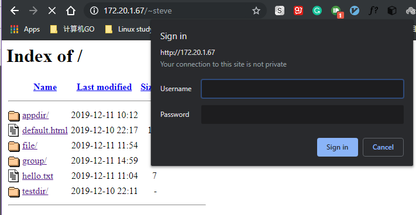

<center><font face="黑体" color="grey" size="5">HTTPD入门和常见配置</font></center>

# 一.HTTPD 介绍

## 1.1 常见 http 服务器

```bash
httpd|apache  存在C10K（10K connections）问题
nginx         解决C10K问题
lighttpd
IIS           .asp 应用程序服务器
tomcat        .jsp 应用程序服务器
jetty          开源的servlet容器，基于Java的web容器
Resin          CAUCHO公司，支持servlets和jsp的引擎
webshpere(IBM)
weblogic(BEA)
jboss
oc4j(Oracle)
```

## 1.2 apache 介绍和 httpd 特点

- **注意： 一般 apache 就是指 httpd**

### 1.2.1 apache 介绍

- 20 世纪 90 年代初，美国国家超级计算机应用中心 NCSA 开发 httpd

> [WIKI](https://en.wikipedia.org/wiki/Apache_HTTP_Server)

- 最初 NCSA HTTPd 服务器是由 Rob McCool 开发出来的，但是它的最初开发者们逐渐对这个软件失去了兴趣，
  并转移到了其他地方，造成了没有人来对这个服务器软件提供更多的技术支持。因为这个服务器的功能又如此
  强大，而代码可以自由下载修改与发布，当时这个服务器软件的一些爱好者与用户开始自发起来，互相交流并分发
  自己修正後的软件版本，并不断改善其功能。为了更好进行沟通，brian behlendorf 自己建立了一个邮件列表，
  把它作为这个群体（或者社区）交流技术、维护软件的一个媒介，把代码重写与维护的工作有效组织起来。这些
  开发者们逐渐地把他们这个群体称为“Apache 组织”，把这个经过不断修正并改善的服务器软件命名为 Apache
  服务器（Apache Server）。
- 这个命名是根据北美当地的一支印第安部落而来，这支部落以高超的军事素养和超人的忍耐力着称，19 世纪
  后半期对侵占他们领土的入侵者进行了反抗。为了对这支印第安部落表示敬仰之意，取该部落名称（Apache）
  作为服务器名。但一提到这个命名，这里还有流传着一段有意思的故事。因为这个服务器是在 NCSA HTTPd
  服务器的基础之上，通过众人努力，不断地修正、打补丁（Patchy）的产物，被戏称为“A Patchy Server”
  （一个补丁服务器）。在这里，因为“Patchy”与“Apache”是谐音，故最後正式命名为“Apache Server”。
- 后来由于商业需求的不断扩大，以 Apache HTTP 服务器为中心，启动了更多的与 Apache 项目并行的项目，
  比如 mod\_ perl、PHP、Java Apache 等等。随着时间的推移、形势的变化，Apache 软件基金会的项目列表
  也不断更新变化中－－不断的有新项目启动，项目的中止以及项目的拆分与合并。比如一开始，Jakarta 就是
  为了发展 JAVA 容器而启动的 Java Apache 项目，後来由于太阳公司（SUN）的建议，项目名称变为 Jakarta 。
  但当时该项目的管理者也没有想到 Jakarta 项目因为 JAVA 的火爆而发展到如今一个囊括了众多基于 JAVA 语言
  开源软件子项目的项目。以至后来，不得不把个别项目从 Jakarta 中独立出来，成为 Apache 软件基金会的顶级
  项目，Struts 项目就是其中之一。

### 1.2.2 apache 特点

- 特性

  - 高度模块化：core + modules
  - DSO：Dynamic Shared Object 动态加/卸载
  - MPM：multi-processing module 多路处理模块

- 功能

  - 虚拟主机：IP、Port、FQDN
  - CGI：Common Gateway Interface，通用网关接口
  - 反向代理
  - 负载均衡
  - 路径别名
  - 丰富的用户认证机制：basic，digest
  - 支持第三方模块

- httpd-2.4 新特性
  - MPM 支持运行为 DSO 机制；以模块形式按需加载
  - event MPM 生产环境可用
  - 异步读写机制
  - 支持每模块及每目录的单独日志级别定义
  - 每请求相关的专用配置
  - 增强版的表达式分析式
  - 毫秒级持久连接时长定义
  - 基于 FQDN 的虚拟主机不需要 NameVirutalHost 指令
  - 新的配置指令
  - 支持用户自定义变量
  - 更低的内存消耗

### 1.2.3 apache 的特性 MPM

- MPM:Multi-processing module 多处理工作模式
- prefork：多进程 I/O 模型，每个进程响应一个请求，CentOS7 默认模型 一个主进程：生成和回收 n 个子进程，
  创建套接字，不响应请求 多个子进程：工作 work 进程，每个子进程处理一个请求；系统初始时，预先生成多个
  空 进程，等待请求
- Prefork MPM: prefork 预派生模式，有一个主控制进程，然后生成多个子进程,每个子进程有一个独立的线程响应
  用户请求，相对比较占用内存，但是比较稳定，可以设置最大和最小进程数，是最古老的一种模式，也是最稳定
  的模式，适用于访问量不是很大的场景

  - 优点：稳定
  - 缺点：慢，占用资源，不适用于高并发场景

- worker：复用的多进程 I/O 模型,多进程多线程，IIS 使用此模型 一个主进程：生成 m 个子进程，每个子进程负责创建
  n 个线程，每个线程响应一个请求，并发响应请求：m\*n
- worker MPM：是一种多进程和多线程混合的模型，有一个控制进程，启动多个子进程，每个子进程 面包含固定的
  线程，使用线程程来处理请求，当线程不够使用的时候会再启动一个新的子进程，然后在进程里面再启动线程处理
  请求，由于其使用了线程处理请求，因此可以承受更高的并发。

  - 优点：相比 prefork 占用的内存较少，可以同时处理更多的请求
  - 缺点：使用 keep-alive 的长连接方式，某个线程会一直被占据，即使没有传输数据，也需要一直等待到超时
    才会被释放。如果过多的线程，被这样占据，也会导致在高并发场景下的无服务线程可用。（该问题在
    prefork 模式下，同样会发生）

- event：事件驱动模型（worker 模型的变种）,CentOS8 默认模型；一个主进程：生成 m 个子进程，每个子进程
  负责创建 n 个线程，每个线程响应一个请求，并发响应请求：m\*n，有专门的监控线程来管理这些 keep-alive
  类型的线程，有请求时，将请求传递给服务线程，执行完毕后，允许释放。增强了高并发场景下的请求处理能力

- uevent MPM：Apache 中最新的模式，属于事件驱动模型(epoll)，每个进程响应多个请求，在现在版本里的已经
  是稳定可用的模式。它和 worker 模式很像，最大的区别在于，它解决了 keep-alive 场景下，长期被占用的线程的
  资源浪费问题（某些线程因为被 keep-alive，空挂在哪里等待，中间几乎没有请求过来，甚至等到超时）。
  event MPM 中，会有一个专门的线程来管理这些 keep-alive 类型的线程，当有真实请求过来的时候，将请求传递
  给服务线程，执行完毕后，又允许它释放。这样增强了高并发场景下的请求处理能力

- event 模式只在有数据发送的时候才开始建立连接，连接请求才会触发工作线程，即使用了 TCP 的一个选项，
  叫做延迟接受连接 TCP_DEFER_ACCEPT，加了这个选项后，若客户端只进行 TCP 连接，不发送请求，则
  不会触发 Accept 操作，也就不会触发工作线程去干活，进行了简单的防攻击（TCP 连接）

  - 优点：单线程响应多请求，占据更少的内存，高并发下表现更优秀，会有一个专门的线程来管 keep-alive 类型
    的线程，当有真实请求过来的时候，将请求传递给服务线程，执行完毕后，又允它释放
  - 缺点：没有线程安全控制
    httpd-2.4：event 稳定版，centos7 以后默认
    httpd-2.2：event 测试版，centos6 默认

# 二.HTTPD 安装及重要文件

## 2.1 使用包管理器直接 rpm 包安装 httpd

- 使用包管理器安装：CentOS 7 以上，默认系统是 httpd 2.4，CentOS 6 版默认为 httpd 2.2
  centos7`yum install httpd -y`
  centos8`dnf install httpd -y`

## 2.2 htpd-2.4 版本重要文件

- 配置文件：
  `/etc/httpd/conf/httpd.conf` 主配置文件
  `/etc/httpd/conf.d/\*.conf` 子配置文件
  `/etc/httpd/conf.d/conf.modules.d/` 模块加载的配置文件
- 检查配置语法：httpd –t
- 服务单元文件：
  `/usr/lib/systemd/system/httpd.service`
  服务单元文件的配置文件：`/etc/sysconfig/httpd`
- 服务控制和启动
  `systemctl enable|disable httpd.service`
  `systemctl {start|stop|restart|status|reload} httpd.service`
- 默认站点网页文档根目录：/var/www/html
- 模块文件路径：
  `/etc/httpd/modules`
  `/usr/lib64/httpd/modules`
- 主服务器程序文件： `/usr/sbin/httpd`
  主进程文件： `/etc/httpd/run/httpd.pid`
- 日志文件目录：/var/log/httpd
  `access_log`: 访问日志
  `error_log`: 错误日志
- 帮助文档包：httpd-manual

## 2.3 httpd 配置文件介绍

- 配置文件主要组成
  Global Environment 全局环境配置
  Main server configuration 服务器配置
  virtual host 虚拟主机配置

- 配置文件格式：
  指令和值的格式:`Directive value`
  Directive 指令不区分字符大小写
  value 值为路径时，是否区分大小写，取决于文件系统

> [配置官方帮助](http://httpd.apache.org/docs/2.4/)

- centos8 默认配置

```ruby
[root@centos8 ~]#grep -Ev '^ _#|^\$' /etc/httpd/conf/httpd.conf
ServerRoot "/etc/httpd"
Listen 80
Include conf.modules.d/_.conf
User apache
Group apache
ServerAdmin root@localhost
<Directory />
  AllowOverride none
  Require all denied
</Directory>
DocumentRoot "/var/www/html"
<Directory "/var/www">
  AllowOverride None
  Require all granted
</Directory>
<Directory "/var/www/html">
  Options Indexes FollowSymLinks
  AllowOverride None
  Require all granted
</Directory>
<IfModule dir_module>
  DirectoryIndex index.html
</IfModule>
<Files ".ht*">
  Require all denied
</Files>
ErrorLog "logs/error_log"
LogLevel warn
<IfModule log_config_module>
  LogFormat "%h %l %u %t \"%r\" %>s %b \"%{Referer}i\" \"%{User-Agent}i\""
combined
  LogFormat "%h %l %u %t \"%r\" %>s %b" common
  <IfModule logio_module>
    LogFormat "%h %l %u %t \"%r\" %>s %b \"%{Referer}i\" \"%{User-Agent}i\" %I
%O" combinedio
  </IfModule>
  CustomLog "logs/access_log" combined
</IfModule>
<IfModule alias_module>
  ScriptAlias /cgi-bin/ "/var/www/cgi-bin/"
</IfModule>
<Directory "/var/www/cgi-bin">
  AllowOverride None
  Options None
  Require all granted
</Directory>
<IfModule mime_module>
  TypesConfig /etc/mime.types
  AddType application/x-compress .Z
  AddType application/x-gzip .gz .tgz
  AddType text/html .shtml
  AddOutputFilter INCLUDES .shtml
</IfModule>
AddDefaultCharset UTF-8
<IfModule mime_magic_module>
  MIMEMagicFile conf/magic
</IfModule>
EnableSendfile on
IncludeOptional conf.d/*.conf
```

- centos7 默认配置

```ruby
[root@webhost ~]# grep -Ev '^ *#|^$' /etc/httpd/conf/httpd.conf
ServerRoot "/etc/httpd"
ServerSignature EMail
Include conf.modules.d/*.conf
User apache
Group apache
ServerAdmin stevobs@163.com
<Directory />
    AllowOverride none
    Require all denied
</Directory>
DocumentRoot "/var/www/html"
<Directory "/var/www">
    AllowOverride None
    Require all granted
</Directory>
<Directory "/var/www/html">
    Options Indexes
    AllowOverride Options=Indexes,FollowSymLinks
    Require all granted
</Directory>
<IfModule dir_module>
    DirectoryIndex index.html
</IfModule>
<Files ".ht*">
    Require all denied
</Files>
ErrorLog "logs/error_log"
LogLevel warn
<IfModule log_config_module>
    LogFormat "%h %l %u %t \"%r\" %>s %b \"%{Referer}i\" \"%{User-Agent}i\"" combined
    LogFormat "%h %l %u %t \"%r\" %>s %b" common
    LogFormat "%h %l %u %t"  short
    <IfModule logio_module>
      LogFormat "%h %l %u %t \"%r\" %>s %b \"%{Referer}i\" \"%{User-Agent}i\" %I %O" combinedio
    </IfModule>
    CustomLog "logs/access_log" combinedio
</IfModule>
<IfModule alias_module>
    ScriptAlias /cgi-bin/ "/var/www/cgi-bin/"
</IfModule>
<Directory "/var/www/cgi-bin">
    AllowOverride None
    Options None
    Require all granted
</Directory>
<IfModule mime_module>
    TypesConfig /etc/mime.types
    AddType application/x-compress .Z
    AddType application/x-gzip .gz .tgz
    AddType text/html .shtml
    AddOutputFilter INCLUDES .shtml
</IfModule>
AddDefaultCharset off
<IfModule mime_magic_module>
    MIMEMagicFile conf/magic
</IfModule>
EnableSendfile on
IncludeOptional conf.d/*.conf
```

## 2.4 编译安装 httpd-2.4 版本

### 2.4.1 编译准备

- 编译安装 httpd 离不开**APR 库**，APR:Apache portable Run-time libraries，Apache 可移植运行库,主要为上层的
  应用程序提供一个可以跨越多操作系统平台使用的底层支持接口库。在早期的 Apache 版本中，应用程序本身
  必须能够处理各种具体操作系统平台的细节，并针对不同的平台调用不同的处理函数随着 Apache 的进一步
  开发，Apache 组织决定将这些通用的函数独立出来并发展成为一个新的项目。这样，APR 的开发就从 Apache
  中独立出来，Apache 仅仅是使用 APR 而已。
- 目前 APR 主要还是由 Apache 使用，由于 APR 的较好的移植性，因此一些需要进行移植的 C 程序也开始使用
  APR，比如用于服务器压力测试的 [Flood loader tester](http://httpd.apache.org/test/flood)
  > APR 官网：http://apr.apache.org

### 2.4.2 编译安装法一

#### 2.4.2.1 编译安装 apr

```bash
cd apr-1.7.0
./configure --prefix=/app/apr
make && make install
```

#### 2.4.2.2 编译安装 apr-util

```bash
cd ../apr-util-1.6.1
./configure --prefix=/app/apr-util --with-apr=/app/apr/
make -j 2 && make install
```

#### 2.4.2.3 编译安装 httpd-2.4

```bash
cd ../httpd-2.4.39
./configure --prefix=/app/httpd24 \
--enable-so \
--enable-ssl \
--enable-cgi \
--enable-rewrite \
--with-zlib \
--with-pcre \
--with-apr=/app/apr/ \
--with-apr-util=/app/apr-util/ \
--enable-modules=most \
--enable-mpms-shared=all \
--with-mpm=prefork
make -j 4 && make install
```

### 2.4.3 编译安装法二

#### 2.4.3.1 将 apr 和 apr-util 源码与 httpd 源码合并

```bash
mv apr-1.7.0 httpd-2.4.41/srclib/apr
mv apr-util-1.6.1 httpd-2.4.41/srclib/apr-util
ls httpd-2.4.41/srclib/
apr  apr-util  Makefile.in
```

#### 2.4.3.1 将三者一并编译并安装

```bash
cd httpd-2.4.41/
./configure \
--prefix=/app/httpd24 \
--enable-so \
--enable-ssl \
--enable-cgi \
--enable-rewrite \
--with-zlib \
--with-pcre \
--with-included-apr \
--enable-modules=most \
--enable-mpms-shared=all \
--with-mpm=prefork  
make && make install
```

### 2.4.4 编译安装后配置

- 查看 httpd 的编译过程：
  `less /app/httpd24/build/config.nice`
- 自带的服务控制脚本：
  `/app/httpd24/bin/apachectl`

- 安装后配置

1. 创建专用用户

```bash
useradd -s /sbin/nologin -r apache
```

2. 指定运行 httpd 的用户

```bash
vim /app/httpd24/conf/httpd
user apache
group apache
```

3. 配置环境变量

```bash
vim /etc/profile.d/httpd24.sh
PATH=/app/httpd24/bin:$PATH
```

4. 配置帮助文档

```bash
vim /etc/man_db.conf
MANDATORY_MANPATH           /app/httpd24/man
```

5. 设置开机自动启动

```bash
vim /etc/rc.d/rc.local
/app/httpd24/bin/apachectl start
chmod +x /etc/rc.d/rc.local
```

6. 创建 service unit 文件(CentOS 7 以上版本)

```bash
vim /usr/lib/systemd/system/httpd24.service
[Unit]
Description=The Apache HTTP Server
After=network.target remote-fs.target nss-lookup.target
Documentation=man:httpd(8)
Documentation=man:apachectl(8)
[Service]
Type=forking
#EnvironmentFile=/etc/sysconfig/httpd
ExecStart=/app/httpd24/bin/httpd $OPTIONS -k start
ExecReload=/app/httpd24/bin/httpd $OPTIONS -k graceful
ExecStop=/bin/kill -WINCH {MAINPID}
KillSignal=SIGCONT
PrivateTmp=true
[Install]
WantedBy=multi-user.target
```

6. 创建启动脚本(CentOS 6 以前版本)

```bash
#自定义启动脚本(参考httpd-2.2的服务脚本)
cp   /etc/rc.d/init.d/httpd /etc/rc.d/init.d/httpd24
vim /etc/rc.d/init.d/httpd24
apachectl=/app/httpd24/bin/apachectl
httpd=${HTTPD-/app/httpd24/bin/httpd}
pidfile=${PIDFILE-/app/httpd24/logs/httpd.pid}
lockfile=${LOCKFILE-/var/lock/subsys/httpd24}
chkconfig –add httpd24
chkconfig –list httpd24
```

# 三.HTTPD 常见配置

## :pushpin:

### 3.1 显示服务器版本信息

指令：`ServerTokens Major|Minor|Min[imal]|Prod|OS|Full`

`ServerTokens Major` 在响应头中显示服务器的主版本号
`ServerTokens Minor` 在响应头中显示服务器的主版本号和次版本号
`ServerTokens Min[imal]` 在响应头中显示服务器的完整版本号
`ServerTokens Prod` 只显示服务器类型----**生产建议使用该值**
`ServerTokens OS` 显示完整版本号和操作系统类型
`ServerTokens Full` 都显示，不配置时默认使用 full 值

<div>

</div>

### 3.2 设置监听的 IP 和 PORT 端口

指令：`Listen [IP:]PORT`

- 1 省略 IP 表示为本机所有 IP
- 2 Listen 指令至少一个，可重复出现多次

```py
  Listen 192.168.1.100:8080
  Listen 80
```

### 3.3 持久连接

- 持久连接：Persistent Connection，每个资源获取完成后不会断开连接，而是继续等待其它的请求完成，不配置时
  默认关闭持久连接
- 连接断开的条件：
  时间限制：以秒为单位， 默认 5s，httpd-2.4 支持毫秒级
  副作用：**对并发访问量大的服务器，持久连接会使有些请求得不到响应**
  折衷：使用较短的持久连接时间

- 配置持久连接的指令

```py
KeepAlive  On|Off
KeepAliveTimeOut  15      # 连接持续15s,可以以ms为单位,默认值为5s
MaxKeepAliveRequests 500  # 持久连接最大接收的请求数,默认值100
```

- 通过 telnet 使用 GET 方法测试

```jinja2
[root@webhost ~]# telnet 172.20.1.67 80
Trying 172.20.1.67...
Connected to 172.20.1.67.
Escape character is '^]'.
GET /index.html HTTP/1.1   # 使用GET方法
HOST:2.2.2.2

HTTP/1.1 200 OK
Date: Tue, 10 Dec 2019 13:01:05 GMT
Server: Apache/2.4.6 (CentOS)
Last-Modified: Fri, 06 Dec 2019 01:34:30 GMT
ETag: "5e-598ff0c1ecbee"
Accept-Ranges: bytes
Content-Length: 94
Content-Type: text/html; charset=UTF-8

<DOCTYPE html>
<head>
        <p1>Hello There!</p1>
</head>

<body>
        <a>A test message!!</a>
</body>

# 返回html响应体后并没有立即断开连接...


Connection closed by foreign host. # 15秒后无请求，断开连接
```

- 通过浏览器看响应头部信息
  <div>
  
  </div>

### 3.4 DSO(Dymanic Shared Object)配置

- `Dynamic Shared Object`加载动态模块配置，不需重启即生效
  动态模块所在路径为`/usr/lib64/httpd/modules/`

- 先在主配置文件中`/etc/httpd/conf/httpd.conf`指定加载模块配置文件

```py
ServerRoot "/etc/httpd"
Include conf.modules.d/*.conf
```

- 再到`/etc/httpd/conf.modules.d/`文件夹下添加特定模块的配置文件和指令
  模块文件路径可使用相对路径：相对于 ServerRoot（默认/etc/httpd）

```py
LoadModule <mod_name> <mod_path>
```

- 例：查看一些模块的配置文件和加载情况

```bash
# 查看默认有哪些模块的配置文件
[root@webhost ~]# ls -l /etc/httpd/conf.modules.d/
total 28
-rw-r--r-- 1 root root 3739 Aug  6 21:44 00-base.conf
-rw-r--r-- 1 root root  139 Aug  6 21:44 00-dav.conf
-rw-r--r-- 1 root root   41 Aug  6 21:44 00-lua.conf
-rw-r--r-- 1 root root  742 Aug  6 21:44 00-mpm.conf
-rw-r--r-- 1 root root  957 Aug  6 21:44 00-proxy.conf
-rw-r--r-- 1 root root   88 Aug  6 21:44 00-systemd.conf
-rw-r--r-- 1 root root  451 Aug  6 21:44 01-cgi.conf
# 查看httpd通常需要加载的模块
[root@webhost ~]# cat /etc/httpd/conf.modules.d/00-base.conf
#
# This file loads most of the modules included with the Apache HTTP
# Server itself.
#

LoadModule access_compat_module modules/mod_access_compat.so
LoadModule actions_module modules/mod_actions.so
LoadModule alias_module modules/mod_alias.so
LoadModule allowmethods_module modules/mod_allowmethods.so
LoadModule auth_basic_module modules/mod_auth_basic.so
LoadModule auth_digest_module modules/mod_auth_digest.so
LoadModule authn_anon_module modules/mod_authn_anon.so
LoadModule authn_core_module modules/mod_authn_core.so
LoadModule authn_dbd_module modules/mod_authn_dbd.so
LoadModule authn_dbm_module modules/mod_authn_dbm.so
LoadModule authn_file_module modules/mod_authn_file.so
LoadModule authn_socache_module modules/mod_authn_socache.so
......

# 查看静态编译的模块
[root@webhost ~]# httpd -l
Compiled in modules:
  core.c
  mod_so.c
  http_core.c

# 查看静态编译的模块和动态加载的模块
[root@webhost ~]# httpd -M

 autoindex_module (shared)
 cache_module (shared)
 cache_disk_module (shared)
 data_module (shared)
 dbd_module (shared)
 deflate_module (shared)
 dir_module (shared)
 dumpio_module (shared)
 echo_module (shared)
 env_module (shared)
 expires_module (shared)
 ext_filter_module (shared)
 filter_module (shared)
 headers_module (shared)
 include_module (shared)
 info_module (shared)
 log_config_module (shared)
 .......
```

### 3.5 MPM(Multi-Processing Module)模块配置

- MPM(Multi-Processing Module)多路处理模块使得 httpd 支持三种 MPM 工作模式：prefork, worker, event
  分别由三个对应的 MPM 模块来提供对应的工作模式，配置文件位于`/etc/httpd/conf.modules.d/00-mpm.conf`

```bash
[root@webhost ~]# cat /etc/httpd/conf.modules.d/00-mpm.conf
# Select the MPM module which should be used by uncommenting exactly
# one of the following LoadModule lines:

# prefork MPM: Implements a non-threaded, pre-forking web server
# See: http://httpd.apache.org/docs/2.4/mod/prefork.html
LoadModule mpm_prefork_module modules/mod_mpm_prefork.so

# worker MPM: Multi-Processing Module implementing a hybrid
# multi-threaded multi-process web server
# See: http://httpd.apache.org/docs/2.4/mod/worker.html
#
#LoadModule mpm_worker_module modules/mod_mpm_worker.so

# event MPM: A variant of the worker MPM with the goal of consuming
# threads only for connections with active processing
# See: http://httpd.apache.org/docs/2.4/mod/event.html
#
#LoadModule mpm_event_module modules/mod_mpm_event.so
```

- centos7 目前默认的为 prefork 工作模式，启用 MPM 相关的 LoadModule 指令即可使用相应的工作模式，其它未
  启用的两项需要在行首加#注释

- 注意：不要同时启用多个 MPM 模块，否则会出现类似下面的错误
  `AH00534: httpd: Configuration error: More than one MPM loaded.`

- 查看默认的 mpm 工作模式 并改为 worker 工作模式

```bash
[root@webhost ~]# httpd -M |grep mpm
 mpm_prefork_module (shared)
[root@webhost ~]# vim /etc/httpd/conf.modules.d/00-mpm.conf
# Select the MPM module which should be used by uncommenting exactly
# one of the following LoadModule lines:

# prefork MPM: Implements a non-threaded, pre-forking web server
# See: http://httpd.apache.org/docs/2.4/mod/prefork.html
######## 注释下面的这行
#LoadModule mpm_prefork_module modules/mod_mpm_prefork.so

# worker MPM: Multi-Processing Module implementing a hybrid
# multi-threaded multi-process web server
# See: http://httpd.apache.org/docs/2.4/mod/worker.html
#
######## 取消注释下面的这行
LoadModule mpm_worker_module modules/mod_mpm_worker.so

# event MPM: A variant of the worker MPM with the goal of consuming
# threads only for connections with active processing
# See: http://httpd.apache.org/docs/2.4/mod/event.html
#
#LoadModule mpm_event_module modules/mod_mpm_event.so
[root@webhost ~]# systemctl restart httpd
[root@webhost ~]# httpd -M | grep mpm
 mpm_worker_module (shared)
```

### 3.6 prefork 模式的相关配置

```py
StartServers            2000
MinSpareServers         2000
MaxSpareServers         2000
ServerLimit             2560 # 最多进程数,最大值 20000
MaxRequestWorkers       2560 # 最大的并发连接数，默认256
MaxRequestsPerChild     4000 # 从 httpd.2.3.9开始被MaxConnectionsPerChild代替
MaxConnectionsPerChild      4000 # 子进程最多能处理的请求数量。在处理MaxRequestsPerChild
                                 # 个请求之后,子进程将会被父进程终止，这时候子进程占用的内存就会释放(为0时永远不释放）
```

### 3.7 worker 和 event 模式相关的配置

```py
ServerLimit         16
StartServers         2
MaxRequestWorkers  150
MinSpareThreads     25
MaxSpareThreads     75
ThreadsPerChild     25
```

```bash
# 配置示例
[root@webhost ~]#vim etc/httpd/conf.d/custom.conf
ServerLimit 24
StartServers 12
[root@webhost ~]# ps aux | grep /usr/sbin/httpd -w
root      16094  0.1  0.3 230716  5532 ?        Ss   21:40   0:00 /usr/sbin/httpd -DFOREGROUND
apache    16095  0.0  0.1 230340  2980 ?        S    21:40   0:00 /usr/sbin/httpd -DFOREGROUND
apache    16096  0.0  0.2 517544  3488 ?        Sl   21:40   0:00 /usr/sbin/httpd -DFOREGROUND
apache    16097  0.0  0.2 517544  3488 ?        Sl   21:40   0:00 /usr/sbin/httpd -DFOREGROUND
apache    16098  0.0  0.2 517544  3492 ?        Sl   21:40   0:00 /usr/sbin/httpd -DFOREGROUND
apache    16099  0.0  0.2 517544  3492 ?        Sl   21:40   0:00 /usr/sbin/httpd -DFOREGROUND
apache    16100  0.0  0.2 517544  3492 ?        Sl   21:40   0:00 /usr/sbin/httpd -DFOREGROUND
apache    16101  0.0  0.2 517544  3492 ?        Sl   21:40   0:00 /usr/sbin/httpd -DFOREGROUND
apache    16102  0.0  0.2 517544  3488 ?        Sl   21:40   0:00 /usr/sbin/httpd -DFOREGROUND
apache    16103  0.0  0.2 517544  3488 ?        Sl   21:40   0:00 /usr/sbin/httpd -DFOREGROUND
apache    16105  0.0  0.2 517544  3488 ?        Sl   21:40   0:00 /usr/sbin/httpd -DFOREGROUND
apache    16107  0.0  0.2 517544  3492 ?        Sl   21:40   0:00 /usr/sbin/httpd -DFOREGROUND
root      16437  0.0  0.0 112712  1000 pts/2    R+   21:41   0:00 grep --color=auto /usr/sbin/httpd -w  # 不是
[root@webhost ~]# ps aux | grep /usr/sbin/httpd -w | wc -l
13
```

### 3.8 自定义 Main server 的文档页面路径

- DocumentRoot 指向的路径为 URL 路径的起始位置
  `/path` 必须显式授权后才可以访问

```ruby
DocumentRoot   "/path"
<directory /path>
    Require all granted
</directory>
```

- 例如：

```ruby
[root@webhost ~]#vim etc/httpd/conf.d/custom.conf
DocumentRoot   "/data/html"
<directory /data/html>
    Require all granted
</directory>

[root@webhost ~]# httpd -t
Syntax OK
[root@webhost ~]# systemctl restart httpd
[root@webhost ~]# echo Hello,apache. > /data/html/index.html
[root@webhost ~]# curl 172.20.1.67
Hello,apache.
```

### 3.9 自定义站点主页面

指令`DirectoryIndex index.php index.html`

## :pushpin:

### 3.10 配置实现对站点资源访问的控制

- 可以针对文件系统和 URI 的资源进行访问控制
- 文件系统路径访问控制

```ruby
# 基于目录
<Directory  "/path">
...
</Directory>

# 基于文件
<File  "/path/file">  
...
</File>

# 基于正则表达式
<FileMatch  "regex">
...
</FileMatch>
```

例如：

```ruby
# /private1, /private1/，/private1/file.txt 会匹配
# /private1other 不会匹配
<Location "/private1">
    #  ...
</Location>

#/private2/，/private2/file.txt 会匹配
# /private2 ，/private2other 不匹配
<Location "/private2/">
    # ...
</Location>
```

- URL 路径访问控制

```ruby
<Location  "URL">
...
</Location>

<LocationMatch "regex">
...
</LocationMatch>
```

例如：

```ruby
<FilesMatch "\.(gif|jpe?g|png)$">
<Files "?at.*">  # 通配符
<Location /status>
<LocationMatch "/(extra|special)/data">
```

### 3.11 针对目录实现访问控制

1. Options 指令：
   后跟 1 个或多个以空白字符分隔的选项列表， 在选项前的+，- 表示增加或删除指定选项指定的访问控制
   常见选项：
   `Indexes`：指明的 URL 路径下不存在与定义的主页面资源相符的资源文件时，返回索引列表给用户
   `FollowSymLinks`：允许访问符号链接文件所指向的源文件
   `None`：全部禁用
   `All`： 全部允许

- 例如：

```ruby
<Directory /web/docs>
    Options Indexes FollowSymLinks
</Directory>

<Directory /web/docs/spec>
    Options FollowSymLinks
</Directory>
```

- 例：

```bash
[root@webhost ~]# cat /data/html/test.html
A test html file...
[root@webhost ~]# ln -s /data/html/test.html /var/www/html/testlin
k
[root@webhost ~]# echo defautl html > /var/www/html/default.html
[root@webhost ~]# mkdir /var/www/html/testdir
```

打开浏览器，访问`http://172.20.1.67/`可看到下面所示:

可以访问 testlink 软连接


```bash
[root@webhost conf.d]# vim /etc/httpd/conf/httpd.conf
<Directory "/var/www/html">

    #Options Indexes FollowSymLinks
    Options Indexes
    Require all granted
</Directory>
[root@webhost conf.d]# systemctl restart httpd
```

此时无法看到 testlink 软连接


2. AllowOverride 指令

- AllowOverride 指令指定与访问控制相关的哪些指令可以放在指定目录下的.htaccess(由 AccessFileName 指令指定)
  文件中，覆盖之前的配置指令，只对<Directive\>语句块起作用。

  - 常见用法：
    `AllowOverride All` .htaccess 中所有指令都有效
    `AllowOverride None` .htaccess 文件无效，此为 httpd 2.3.9 以后版的默认值
    `AllowOverride AuthConfig` .htaccess 文件中，除了 AuthConfig 其它指令都无法生效

- 例如：

```bash
[root@webhost ~]# cd /var/www/html/
[root@webhost html]# mkdir appdir
[root@webhost html]# cd appdir/
[root@webhost appdir]# ln -s /data/ datalink
[root@webhost appdir]# touch file1
[root@webhost appdir]# ls
datalink  file1
[root@webhost appdir]# ls datalink/
dir  dir.tar.bz2  html  mysql  test.conf

[root@webhost appdir]# vim /etc/httpd/conf/httpd.conf
<Directory "/var/www/html">
    Options Indexes
    #AllowOverride None
    AllowOverride Options=FollowSymlinks,Indexes  # 允许.htaccess文件中的FollowSymlinks,Indexes两
                                                  # 个选项覆盖主配置文件的设置
    Require all granted
</Directory>

[root@webhost appdir]# vim /var/www/html/appdir/.htaccess
Options FollowSymlinks Indexes

[root@webhost appdir]# httpd -t
Syntax OK
[root@webhost appdir]# systemctl restart httpd

[root@webhost html]# tree
.
├── appdir
│   ├── datalink -> /data/
│   └── file1
├── default.html
├── testdir
└── testlink -> /data/html/test.html
```

由于主配置文件中对`var/www/html`的文件夹`Options Indexes`，所以无法看到 testlink 软连接

由于在`/appdir`下的`.htaccess`指令`Option FollowSymlinks Indexes`，并且可以覆盖主配置文件，所以
可以看到 datalink 软连接


### 3.12 基于客户端 IP 地址实现访问控制

- 无明确授权的目录，默认拒绝
- 允许所有主机访问：Require all granted
- 拒绝所有主机访问：Require all denied
- 控制特定的 IP 访问：
  - Require ip IPADDR：授权指定来源的 IP 访问
  - Require not ip IPADDR：拒绝特定的 IP 访问
- 控制特定的主机访问：

  - Require host HOSTNAME：授权特定主机访问
  - Require not host HOSTNAME：拒绝
  - HOSTNAME：
    - FQDN：特定主机
    - domain.tld：指定域名下的所有主机

- 例如：

```ruby
<RequireAll>
Require all granted
Require not ip 172.20.1.67  # 允许其它IP，拒绝该IP
</RequireAll>

<RequireAny>
Require all denied
require ip  172.20.1.67   # 拒绝其它IP，允许该IP
</RequireAny>
```

### 3.13 日志配置

httpd 的日志类型分为两类：访问日志和错误日志

- 错误日志配置：
  `ErrorLog logs/error_log`
  `LogLevel warn`
  `LogLevel` 可选值: `debug, info, notice, warn,error, crit, alert, emerg`
- 访问日志配置：
  定义日志格式：`LogFormat format strings`
  使用日志格式：`CustomLog logs/access_log testlog`

- 例如：
  `LogFormat "%h %l %u %{%F %T}t "%r" %>s %b "%{Referer}i"\"%{User-Agent}i\"" testlog`
  > [自定义日志格式参考](http://httpd.apache.org/docs/2.4/mod/mod_log_config.html#formats)

```ruby
# 三种定义好的日志格式
LogFormat "%h %l %u %t \"%r\" %>s %b \"%{Referer}i\" \"%{User-Agent}i\"" combined
LogFormat "%h %l %u %t \"%r\" %>s %b" common
LogFormat "%h %l %u %t"  short

# 使用combined
CustomLog "logs/access_log" combined
172.20.1.1 - - [11/Dec/2019:10:44:58 +0800] "GET /appdir/ HTTP/1.1" 200 1093 "-" "Mozilla/5.0 (Windows NT 10.0; WOW64) AppleWebKit/537.36 (KHTML, like Gecko)
Chrome/76.0.3809.87 Safari/537.36"
172.20.1.1 - - [11/Dec/2019:10:44:59 +0800] "GET /appdir/ HTTP/1.1" 200 1093 "-" "Mozilla/5.0 (Windows NT 10.0; WOW64) AppleWebKit/537.36 (KHTML, like Gecko)
Chrome/76.0.3809.87 Safari/537.36"
172.20.1.1 - - [11/Dec/2019:10:44:59 +0800] "GET /appdir/ HTTP/1.1" 200 1093 "-" "Mozilla/5.0 (Windows NT 10.0; WOW64) AppleWebKit/537.36 (KHTML, like Gecko)
Chrome/76.0.3809.87 Safari/537.36"

# 使用common
CustomLog "logs/access_log" common
172.20.1.1 - - [11/Dec/2019:10:45:27 +0800] "GET /appdir/ HTTP/1.1" 200 1093
172.20.1.1 - - [11/Dec/2019:10:45:28 +0800] "GET /appdir/ HTTP/1.1" 200 1093
172.20.1.1 - - [11/Dec/2019:10:45:29 +0800] "GET /appdir/ HTTP/1.1" 200 1093
172.20.1.1 - - [11/Dec/2019:10:45:29 +0800] "GET /appdir/ HTTP/1.1" 200 1093
172.20.1.1 - - [11/Dec/2019:10:45:31 +0800] "GET /appdir/ HTTP/1.1" 200 1093

# 使用short
CustomLog "logs/access_log" short
172.20.1.1 - - [11/Dec/2019:10:46:16 +0800]
172.20.1.1 - - [11/Dec/2019:10:46:18 +0800]
172.20.1.1 - - [11/Dec/2019:10:46:19 +0800]
172.20.1.1 - - [11/Dec/2019:10:46:19 +0800]
```

```ruby
%h  客户端IP地址
%l  远程用户,启用mod_ident才有效，通常为减号"-"
%u  验证（basic，digest）远程用户,非登录访问时，为一个减号"-"
%t  服务器收到请求时的时间
%r  First line of request，即表示请求报文的首行；记录了此次请求的"方法"，"URL"以及协议版本
%>s 响应状态码
%b  响应报文的大小，单位是字节；不包括响应报文http首部
%{Referer}i 请求报文中首部"referer"的值；即从哪个页面中的超链接跳转至当前页面的
%{User-Agent}i 请求报文中首部"User-Agent"的值；即发出请求的应用程序
```

### 3.14 配置默认字符集

`AddDefaultCharset UTF-8` 此为默认值

### 3.15 定义路径别名

`Alias /URL/ "/REAL/PATH/"`

- 例如：

```ruby
[root@webhost conf.d]# vim /etc/httpd/conf/httpd.conf
...
DocumentRoot "/var/www/html"
...

[root@webhost file]# vim /etc/httpd/conf.d/custom.conf
#  http://172.20.1.67/download  -->  http://172.20.1.67/file/download
Alias /download "/var/www/html/file/download"
<Directory "/var/www/html/file/download">
    Require all granted
</Directory>

[root@webhost file]# systemctl restart httpd

[root@webhost file]# tree /var/www/html/
/var/www/html/
├── appdir
│   ├── datalink -> /data/
│   └── file1
├── default.html
├── file
│   └── download
│       └── hello.html
├── hello.txt
├── testdir
└── testlink -> /data/html/test.html
```


访问`http://172.20.1.67/download`

访问`http://172.20.1.67/file/download`

访问`http://172.20.1.67/download`和访问`http://172.20.1.67/file/download`效果一样

### 3.17 基于用户的访问控制

- 基于用户口令的访问控制需要经过两个步骤：
  认证质询：WWW-Authenticate，响应码为 401，拒绝客户端请求，并说明要求客户端需要提供账号和
  授权：Authorization，客户端用户填入账号和密码后再次发送请求报文；认证通过时，则服务器发送
  响应的资源

- 确保相应的实现认证和授权的模块被加载

```bash
[root@webhost file]# cd /etc/httpd/conf.modules.d/
[root@webhost conf.modules.d]# grep "auth\(n\|z\)_core" *
00-base.conf:LoadModule authn_core_module modules/mod_authn_core.so
00-base.conf:LoadModule authz_core_module modules/mod_authz_core.so
```

- 支持两种认证方式：Authentication type (see the AuthType directive)
  `basic`：明文传输认证密码 由`mod_auth_basic` 模块提供
  `digest`：消息摘要认证,兼容性差 由`mod_auth_digest` 模块提供

- 术语：
  `安全域`：需要用户认证后方能访问的路径；应该通过名称对其进行标识，以便于告知用户认证的原因
  `虚拟账号`：用户的账号和密码，仅用于访问某服务时用到的认证标识
  `存储`：文本文件，SQL 数据库，ldap 目录存储，nis 等

- basic 认证配置示例(基于用户)：

  1. 定义安全域

  ```ruby
  <Directory “/path">
  Options None
  AllowOverride None
  AuthType Basic
  AuthName "String“
  AuthUserFile  "/PATH/HTTPD_USER_PASSWD_FILE"
  Require  user  username1  username2 ...

  # 允许文件中记录的所有用户登录访问
  # Require  valid-user
  </Directory>
  ```

  2. 提供账号文件和密码存储(文本文件)，使用`htpasswd`命令完成创建相应的文件和用户管理

  `htpasswd [options] /PATH/HTTPD_PASSWD_FILE username`

  ```bash
  htpasswd选项：
  -c 自动创建文件，仅应该在文件不存在时使用
  -p 明文密码
  -d CRYPT格式加密，默认
  -m md5格式加密
  -s sha格式加密
  -D 删除指定用户
  ```

  - 例如：

  ```bash
  [root@webhost ~]# cd /var/www/html/
  [root@webhost html]# mkdir secret
  [root@webhost html]# echo A secret area for some user. > secret/index.html
  [root@webhost html]# cat secret/index.html
  A secret area for some user.

  [root@webhost conf.d]# vim custom.conf
  <directory /var/www/html/secret>
  AuthType Basic
  AuthName "Secret!!!"
  AuthUserFile  "/etc/httpd/conf.d/.secretuser"
  #Require  user  xiaoming xiaohong
  require valid-user
  </directory>

  [root@webhost conf.d]# htpasswd -c .secretuser jack
  New password:
  Re-type new password:
  Adding password for user jack
  [root@webhost conf.d]# ls -l .secretuser
  -rw-r--r-- 1 root root 43 Dec 11 14:21 .secretuser
  [root@webhost conf.d]# cat .secretuser
  jack:$apr1$e92S3i46$YlgJKGBA.S.zShyLZ5ePQ1

  [root@webhost conf.d]# systemctl reload httpd
  ```

  如下图，从`172.20.1.1`请求访问`http://172.20.1.67/secret`时需要输入用户名和密码
  
  输入用户名和密码后登录进入
  
  **使用 Wireshark 抓包可以看到密码明文，极不安全**
  

  ```bash
  [root@webhost conf.d]# htpasswd .secretuser stevenux
  New password:
  Re-type new password:
  Adding password for user stevenux
  [root@webhost conf.d]# cat .secretuser
  jack:$apr1$e92S3i46$YlgJKGBA.S.zShyLZ5ePQ1
  stevenux:$apr1$/wD7B6Ni$1AFnJxu.tlb9d6SFMbD1d.
  [root@webhost conf.d]# vim custom.conf
  <directory /var/www/html/secret>
  AuthType Basic
  AuthName "Secret!!!"
  AuthUserFile  "/etc/httpd/conf.d/.secretuser"
  Require  user  stevenux
  #require valid-user

  </directory>
  [root@webhost conf.d]# systemctl restart httpd
  ```

  此时只能使用 stevenux 用户才能访问`/var/www/html/secret`下的资源

  - 使用 allowoverride 指令来实现用户访问控制

  ```ruby
  [root@webhost conf.d]# vim custom.conf
  #<directory /var/www/html/secret>
  #AuthType Basic
  #AuthName "Secret!!!"
  #AuthUserFile  "/etc/httpd/conf.d/.secretuser"
  #Require
  ##require valid-user
  #
  #</directory>
  <directory /var/www/html/secret>
  AllowOverride Authconfig
  </directory>
  [root@webhost ~]# vim /var/www/html/secret/.htaccess
  AuthType Basic
  AuthName "Secret!!!"
  AuthUserFile  "/etc/httpd/conf.d/.secretuser"
  Require user stevenux
  #require valid-user
  ```

  - 使用用户访问控制时的日志信息

  ```ruby
  172.20.1.1 - stevenux [11/Dec/2019:14:41:06 +0800] "GET /secret/ HTTP/1.1" 401 381 "-" "Mozilla/5.0 (Windows NT 10.0; WOW64) AppleWebKit/537.36 (KHTML, like Gecko) Chrome/76.0.3809.87 Safari/537.36" 524 644
  172.20.1.1 - jack [11/Dec/2019:14:41:22 +0800] "GET /secret/ HTTP/1.1" 401 381 "-" "Mozilla/5.0 (Windows NT 10.0; WOW64) AppleWebKit/537.36 (KHTML, like Gecko) Chrome/76.0.3809.87 Safari/537.36" 520 644
  172.20.1.1 - xiaoming [11/Dec/2019:14:41:37 +0800] "GET /secret/ HTTP/1.1" 200 29 "-" "Mozilla/5.0 (Windows NT 10.0; WOW64) AppleWebKit/537.36 (KHTML, like Gecko) Chrome/76.0.3809.87 Safari/537.36" 528 312
  ```

* basic 认证配置示例(基于组)：

  1. 定义安全域

  ```ruby
  <Directory “/path">
  AuthType Basic
  AuthName "String“
  AuthUserFile  "/PATH/HTTPD_USER_PASSWD_FILE"
  AuthGroupFile "/PATH/HTTPD_GROUP_FILE"
  Require  group  grpname1  grpname2 ...
  </Directory>
  ```

  2. 创建用户账号和组账号文件 组文件：每一行定义一个组
     `GRP_NAME: username1 username2 ...`

  - 例如：

  ```bash
  [root@webhost ~]# mkdir /var/www/html/group
  [root@webhost ~]# echo A group of user can access here. > /var/www/html/group/index.html
  [root@webhost ~]# cat /var/www/html/group/index.html
  A group of user can access here.

  [root@webhost ~]# vim /etc/httpd/conf.d/.groupaccess
  secret:jack steve
  admin:xiaoming

  [root@webhost ~]# vim /etc/httpd/conf.d/custom.conf
  <Directory /var/www/html/group>
  Options none
  AllowOverride none
  AuthType Basic
  AuthName "Admin area!!!"
  AuthUserFile "/etc/httpd/conf.d/.secretuser"
  AuthGroupFile "/etc/httpd/conf.d/.groupaccess"
  Require group admin  # 只允许admin组访问
  </Directory>
  [root@webhost ~]# systemctl restart httpd
  ```

  访问`http://172.20.1.67`看不到 group 文件夹
  
  访问`http://172.20.1.67/group`要求输入验证信息
  
  使用 secret 组的 dtevenux 账户
  
  使用 secret 组的 dtevenux 账户无法验证
  
  下面使用 admin 组的 xiaoming 登录
  
  admin 组的 xiaoming 登录可以访问
  

  日志信息

  ```bash
  172.20.1.1 - stevenux [11/Dec/2019:15:12:02 +0800] "GET /group HTTP/1.1" 401 381 "-" "Mozilla/5.0 (Windows NT 10.0; WOW64) AppleWebKit/537.36 (KHTML, like Gecko) Chrome/76.0.3809.87 Safari/537.36" 500 648
  172.20.1.1 - stevenux [11/Dec/2019:15:12:11 +0800] "GET /group HTTP/1.1" 401 381 "-" "Mozilla/5.0 (Windows NT 10.0; WOW64) AppleWebKit/537.36 (KHTML, like Gecko) Chrome/76.0.3809.87 Safari/537.36" 500 648
  172.20.1.1 - xiaoming [11/Dec/2019:15:13:05 +0800] "GET /group HTTP/1.1" 301 233 "-" "Mozilla/5.0 (Windows NT 10.0; WOW64) AppleWebKit/537.36 (KHTML, like Gecko) Chrome/76.0.3809.87 Safari/537.36" 500 495
  172.20.1.1 - xiaoming [11/Dec/2019:15:13:05 +0800] "GET /group/ HTTP/1.1" 200 33 "-" "Mozilla/5.0 (Windows NT 10.0; WOW64) AppleWebKit/537.36 (KHTML, like Gecko) Chrome/76.0.3809.87 Safari/537.36" 501 316
  ```

  从日志信息可以看出来，使用 stevenux 账户时服务器响应码为 401，服务器拒绝客户端请求
  使用 xioaming 账户时，服务器验证成功并随后返回 200 的成功状态码

### 3.18 远程客户端 IP 和用户身份验证控制

`Satisfy ALL|Any`
`ALL` 客户机 IP 和用户验证都需要通过才可以，此为默认值
`Any` 客户机 IP 和用户验证,有一个满足即可

- 例如：

```ruby
#针对/var/www/html/test目录，来自192.168.1.0/24的客户可以访问，其它网络的用户需要经过用
户验证才能访问
<Directory "/var/www/html/test">
Require valid-user
Allow from 192.168.1
Satisfy Any
</Directory
#/var/www/private目录只有用户验证才能访问
<Directory "/var/www/private">
    Require valid-user
</Directory>
#/var/www/private/public 不需要用户验证，任何客户都可以访问
<Directory "/var/www/private/public">
    Allow from all
    Satisfy Any
</Directory>
```

## :pushpin:

### 3.19 配置实现用户家目录共享

- 要实现用户家目录共享，需要借助`mod_userdir.so`模块。

```ruby
vim /etc/httpd/conf.d/userdir.conf
<IfModule mod_userdir.c>
    #UserDir disabled
    UserDir share_html   # 指定共享目录的名称
</IfModule>
# 准备目录
su – stevenux
mkdir ~/share_html
setfacl –m u:apache:x ~stevenux
# 访问
http://172.20.1.67/~stevenux/index.html
```

- 例如:

```bash
[root@webhost ~]# useradd steve
[root@webhost ~]# su - steve
Last login: Wed Dec 11 15:40:21 CST 2019 on pts/1
[steve@webhost ~]$ ls -a
.  ..  .bash_history  .bash_logout  .bash_profile  .bashrc
[steve@webhost ~]$ mkdir share_html
[steve@webhost ~]$ echo This is a sharing folder for a better world. > share_html/index.html
[steve@webhost ~]$ cat share_html/index.html
This is a sharing folder for a better world.
[steve@webhost ~]$ exit
logout
[root@webhost ~]# setfacl -m u:apache:x /home/steve
[root@webhost ~]# vim /etc/httpd/conf.d/userdir.conf
<IfModule mod_userdir.c>
    UserDir share_html
</IfModule>
<Directory "/home/*/share_html">
    AllowOverride FileInfo AuthConfig Limit Indexes
    Options MultiViews Indexes SymLinksIfOwnerMatch IncludesNoExec
    #Require method GET POST OPTIONS
    Require all granted
</Directory>
[root@webhost ~]# systemctl restart httpd
```

访问`http://172.20.1.67/~steve/`


- 使用 basic 验证某账户对家目录的访问

```bash
[root@webhost ~]# vim /etc/httpd/conf.d/userdir.conf
<Directory "/home/*/share_html">
    #AllowOverride FileInfo AuthConfig Limit Indexes
    #Options MultiViews Indexes SymLinksIfOwnerMatch IncludesNoExec
    #Require method GET POST OPTIONS
    #Require all granted

</Directory>

<directory /home/steve/share_html>
AuthType Basic
AuthName "share home"
AuthUserFile "/etc/httpd/conf.d/.secretuser"
require user home     # 指定home账户可以访问
</directory>

[root@webhost ~]# htpasswd /etc/httpd/conf.d/.secretuser home
New password:
Re-type new password:
Adding password for user home  # 添加home账户
[root@webhost ~]# systemctl restart httpd
```

访问`http://172.20.1.67/~steve/`提示输入验证信息

使用 steve 账户

使用 steve 账户无法验证

使用 home 账户

使用 home 账户可以验证


日志信息

```ruby
172.20.1.1 - steve [11/Dec/2019:15:52:59 +0800] "GET /~steve HTTP/1.1" 401 381 "-" "Mozilla/5.0 (Windows NT 10.0; WOW64) AppleWebKit/537.36 (KHTML, like Gecko) Chrome/76.0.3809.87 Safari/537.36" 493 645
Chrome/76.0.3809.87 Safari/537.36" 489 497
172.20.1.1 - home [11/Dec/2019:15:53:13 +0800] "GET /~steve/ HTTP/1.1" 304 - "-" "Mozilla/5.0 (Windows NT 10.0; WOW64) AppleWebKit/537.36 (KHTML, like Gecko) Chrome/76.0.3809.87 Safari/537.36" 575 180
# 响应报文Location指明资源临时新位置 Moved Temporarily 304
```

### 3.20 配置避免错误网页包含的信息泄露

- 配置相应的指令可以避免错误网页包含的服务器等信息泄露。
  默认值 Off，当客户请求的网页并不存在时，服务器将产生错误文档
  如果 ServerSignature 选项为 on，错误文档的最后一行将包含服务器名字、Apache 版本等信息
  如果不对外显示这些信息，就可将这个参数设置为 Off
  如果设置为 Email，将显示 ServerAdmin 的 Email 提示

`ServerSignature On | Off | EMail`

`ServerSignature Off` 默认

`ServerSignature on`

`ServerSignature EMail`


### 3.21 配置禁止使用 trace 方法

`TraceEnable [on|off|extended]` 默认是 on

- 例：

```bash
[root@webhost ~]# curl -IX OPTIONS http://172.20.1.67
HTTP/1.1 200 OK
Date: Wed, 11 Dec 2019 08:14:03 GMT
Server: Apache
Allow: POST,OPTIONS,GET,HEAD,TRACE    # 响应头指明支持trace方法
Content-Length: 0
Content-Type: httpd/unix-directory

[root@webhost ~]# vim /etc/httpd/conf.d/custom.conf
TraceEnable off

[root@webhost ~]# systemctl restart httpd
[root@webhost ~]# curl -IX OPTIONS http://172.20.1.67
HTTP/1.1 200 OK
Date: Wed, 11 Dec 2019 08:14:36 GMT
Server: Apache
Allow: GET,HEAD,POST,OPTIONS  # 响应头未指明trace方法
Content-Length: 0
Content-Type: httpd/unix-directory
```

### 3.22 配置 status 状态页

- httpd 提供了状态页，可以用来观察 httpd 的运行情况。此功能需要加载 mod_status.so 模块才能实现

```ruby
[root@webhost ~]# grep "status" /etc/httpd/conf.modules.d/*
/etc/httpd/conf.modules.d/00-base.conf:LoadModule status_module modules/mod_status.so
<Location "/status">
SetHandler server-status
</Location>
ExtendedStatus On   #显示扩展信息,httpd 2.3.6以后版默认为On
```

- 例：配置启动状态页面

```bash
[root@webhost ~]# httpd -M | grep status
 status_module (shared)
[root@webhost ~]#
[root@webhost ~]# vim /etc/httpd/conf.d/status.conf
<location "/status">
SetHandler server-status
        <RequireAny>
        Require all denied
        Require ip 172.20.1.1
        </RequireAny>
#Order Deny,Allow ? 此方式也可以控制访问
#Deny from all
#Allow from 192.168.100
</Location>
ExtendedStatus Off  # 如果要详细信息，设置为on
```

访问`http://172.20.1.67/status`


### 3.23 配置多虚拟主机

- httpd 支持在一台物理主机上实现多个网站，即多虚拟主机
- 网站可以使用不同的方式来唯一标识：
  IP 相同，但端口不同
  IP 不同，但端口均为默认端口
  FQDN 不同
- 多虚拟主机有三种实现方案：
  基于 IP：为每个虚拟主机准备至少一个 ip 地址
  基于 PORT：为每个虚拟主机使用至少一个独立的 port
  基于 FQDN：为每个虚拟主机使用至少一个 FQDN，识别请求报文中首部记录`Host: www.suosuoli.cn`
- **注意：httpd 2.4 版本中，基于 FQDN 的虚拟主机不再需要 NameVirutalHost 指令**

- 虚拟主机的基本配置方法：配置一般存放在独立的配置文件中

```ruby
<VirtualHost  IP:PORT>
ServerName FQDN
DocumentRoot  "/path"
</VirtualHost>
```

- 常用指令
  `ServerAlias`：虚拟主机的别名；可多次使用
  `ErrorLog`： 错误日志
  `CustomLog`：访问日志
  `<Directory "/path"> </Directory>`

- 例 1：基于端口的虚拟主机(局域网使用)

```ruby
[root@webhost ~]# mkdir /data/html/blog{1,2,3}/
[root@webhost ~]# echo This is blogsite1. > /data/html/blog1/index.html
[root@webhost ~]# echo This is blogsite2. > /data/html/blog2/index.html
[root@webhost ~]# echo This is blogsite3. > /data/html/blog3/index.html
listen 8001
listen 8002
listen 8003
<virtualhost *:8001>
documentroot /data/html/blog1/
CustomLog  logs/blog1_access.log combined
<directory /data/html/blog1>
require all granted
</directory>
j
</virtualhost>
<virtualhost *:8002>
documentroot /data/html/blog2/
CustomLog  logs/blog2_access.log combined
<directory /data/html/blog2>
require all granted
</directory>

</virtualhost>
<virtualhost *:8003>
documentroot /data/html/blog3/
CustomLog  logs/blog3_access.log combined
<directory /data/html/blog3>
require all granted
</directory>
</virtualhost>

[root@webhost ~]# ll /var/log/httpd/
total 172
-rw-r--r-- 1 root root 55035 Dec 11 16:42 access_log
-rw-r--r-- 1 root root   398 Dec  6 09:34 access_log-20191208
-rw-r--r-- 1 root root   403 Dec 11 16:40 blog1_access.log
-rw-r--r-- 1 root root   403 Dec 11 16:41 blog2_access.log
-rw-r--r-- 1 root root   465 Dec 11 16:42 blog3_access.log
-rw-r--r-- 1 root root 97805 Dec 11 16:40 error_log
-rw-r--r-- 1 root root  1639 Dec  8 16:19 error_log-20191208
```

访问`http://172.20.1.67:8001/`

访问`http://172.20.1.67:8002/`

访问`http://172.20.1.67:8003/`


- 例 2：基于 IP 的虚拟主机(局域网使用)

```bash
[root@webhost ~]# ip addr add 172.16.1.8/24 dev ens37 label ens37:1
[root@webhost ~]# ip addr add 172.16.1.18/24 dev ens37 label ens37:2
[root@webhost ~]# ip addr add 172.16.1.28/24 dev ens37 label ens37:3
[root@webhost ~]# ip a
1: lo: <LOOPBACK,UP,LOWER_UP> mtu 65536 qdisc noqueue state UNKNOWN group default qlen 1000
    link/loopback 00:00:00:00:00:00 brd 00:00:00:00:00:00
    inet 127.0.0.1/8 scope host lo
       valid_lft forever preferred_lft forever
    inet6 ::1/128 scope host
       valid_lft forever preferred_lft forever
2: ens37: <BROADCAST,MULTICAST,UP,LOWER_UP> mtu 1500 qdisc pfifo_fast state UP group default qlen 1000
    link/ether 00:0c:29:fd:c9:d8 brd ff:ff:ff:ff:ff:ff
    inet 172.20.1.67/16 brd 172.20.255.255 scope global noprefixroute dynamic ens37
       valid_lft 2447118sec preferred_lft 2447118sec
    inet 172.16.1.8/24 scope global ens37:1
       valid_lft forever preferred_lft forever
    inet 172.16.1.18/24 scope global secondary ens37:2
       valid_lft forever preferred_lft forever
    inet 172.16.1.28/24 scope global secondary ens37:3
       valid_lft forever preferred_lft forever
    inet6 fe80::4d59:6b61:25f9:d67d/64 scope link noprefixroute
       valid_lft forever preferred_lft forever

[root@webhost ~]# vim /etc/httpd/conf.d/virtualhost.conf
#listen 80
#listen 8002
#listen 8003
<virtualhost 172.16.1.8:80>
documentroot /data/html/blog1/
CustomLog  logs/blog1_access.log combined
<directory /data/html/blog1>
require all granted
</directory>
</virtualhost>

<virtualhost 172.16.1.18:80>
documentroot /data/html/blog2/
CustomLog  logs/blog2_access.log combined
<directory /data/html/blog2>
require all granted
</directory>
</virtualhost>

<virtualhost 172.16.1.28:80>
documentroot /data/html/blog3/
CustomLog  logs/blog3_access.log combined
<directory /data/html/blog3>
require all granted
</directory>
</virtualhost>

[root@webhost ~]# curl 172.16.1.8
This is blogsite1.
[root@webhost ~]# curl 172.16.1.18
This is blogsite2.
[root@webhost ~]# curl 172.16.1.28
This is blogsite3.
```

- 例 3：配置基于 FQDN 的虚拟主机

```bash
[root@webhost ~]# vim /etc/httpd/conf.d/virtualhost.conf
<virtualhost *:80>
ServerName www.blog1.com
documentroot /data/html/blog1/
<directory /data/html/blog1>
ErrorLog "logs/blog1_error.log"
CustomLog  logs/blog1_access.log combined
Options None
require all granted
</directory>
</virtualhost>

<virtualhost *:80>
ServerName www.blog2.com
documentroot /data/html/blog2/
<directory /data/html/blog2>
ErrorLog "logs/blog2_error.log"
CustomLog  logs/blog2_access.log combined
Options None
require all granted
</directory>
</virtualhost>

<virtualhost *:80>
ServerName www.blog3.com
documentroot /data/html/blog3/
<directory /data/html/blog3>
ErrorLog "logs/blog3_error.log"
CustomLog  logs/blog3_access.log combined
Options None
require all granted
</directory>
</virtualhost>

[root@webhost ~]# systemctl restart httpd

[root@webhost ~]# vim /etc/hosts
172.20.1.67 www.blog1.com www.blog2.com www.blog3.com

[root@webhost ~]# curl www.blog1.com
This is blogsite1.
[root@webhost ~]# curl www.blog2.com
This is blogsite2.
[root@webhost ~]# curl www.blog3.com
This is blogsite3.

[root@webhost ~]# ll /var/log/httpd/ | grep error
-rw-r--r-- 1 root root      0 Dec 11 17:17 blog1_error.log
-rw-r--r-- 1 root root      0 Dec 11 17:17 blog2_error.log
-rw-r--r-- 1 root root      0 Dec 11 17:17 blog3_error.log
-rw-r--r-- 1 root root 105366 Dec 11 17:17 error_log
-rw-r--r-- 1 root root   1639 Dec  8 16:19 error_log-20191208
```

**注意**

- 任意目录下的页面只有显式授权才能被访问
- 三种方式的虚拟主机可以混和使用

### 3.24 配置压缩页面优化速度

- 压缩功能需要另一个模块来实现，使用 mod_deflate 模块压缩页面优化传输速度

```ruby
LoadModule deflate_module modules/mod_deflate.so SetOutputFilter

[root@webhost ~]# grep "deflate" /etc/httpd/conf.modules.d/*
/etc/httpd/conf.modules.d/00-base.conf:LoadModule deflate_module modules/mod_deflate.so
```

- 压缩适用场景
  1. 节约带宽，额外消耗 CPU；同时，可能有些较老浏览器不支持
  2. 压缩适于压缩的资源，例如文本文件

```ruby
#可选项
SetOutputFilter DEFLATE  
# 指定对哪种MIME类型进行压缩，必须指定项
AddOutputFilterByType DEFLATE text/plain
AddOutputFilterByType DEFLATE text/html
AddOutputFilterByType DEFLATE application/xhtml+xml
AddOutputFilterByType DEFLATE text/xml
AddOutputFilterByType DEFLATE application/xml
AddOutputFilterByType DEFLATE application/x-javascript
AddOutputFilterByType DEFLATE text/javascript
AddOutputFilterByType DEFLATE text/css
#压缩级别 (Highest 9 - Lowest 1)
DeflateCompressionLevel 9
#排除特定旧版本的浏览器，不支持压缩
#Netscape 4.x 只压缩text/html
BrowserMatch ^Mozilla/4  gzip-only-text/html
#Netscape 4.06-08 三个版本 不压缩
BrowserMatch  ^Mozilla/4\.0[678]  no-gzip
#Internet Explorer标识本身为“Mozilla / 4”，但实际上是能够处理请求的压缩。如果用户代理首部
匹配字符串“MSIE”（“B”为单词边界”），就关闭之前定义的限制
BrowserMatch \bMSI[E]  !no-gzip !gzip-only-text/html
```

### 3.25 配置实现 https

- https: http over ssl，实现验证和加密 http 的数据传输
- https 的工作过程
  

1. 客户端发送可供选择的加密方式，并向服务器请求证书
2. 服务器端发送证书以及选定的加密方式给客户端
3. 客户端取得证书并进行证书验证，如果信任给其发证书的 CA
   (a) 验证证书来源的合法性；用 CA 的公钥解密证书上数字签名
   (b) 验证证书的内容的合法性：完整性验证
   (c\) 检查证书的有效期限
   (d) 检查证书是否被吊销
   (e) 证书中拥有者的名字，与访问的目标主机要一致
4. 客户端生成临时会话密钥（对称密钥），并使用服务器端的公钥加密此数据发送给服务器，完成密钥交换
5. 服务用此密钥加密用户请求的资源，响应给客户端

- 注意：SSL 是基于 IP 地址实现，单 IP 的 httpd 主机，仅可以使用一个 https 虚拟主机

- https 大致实现过程

1. 为服务器申请数字证书用于测试证书：可以通过私建 CA 颁发证书实现
   (a) 创建私有 CA
   (b) 在服务器创建证书签署请求
   (c\) CA 签署证书
   实际使用中需要购买证书，个人可以使用免费证书
2. 配置 httpd 支持使用 ssl，及使用的证书

- 例 1：使用自签证书实现 https

```bash
[root@webhost ~]# yum install mod_ssl
[root@webhost certs]# vim Makefile
# 修改下面的行
#/usr/bin/openssl genrsa -aes128 $(KEYLEN) > $@
# 改为
/usr/bin/openssl genrsa  $(KEYLEN) > $@

[root@webhost certs]# make suosuoli.cn.crt
umask 77 ; \
/usr/bin/openssl req -utf8 -new -key suosuoli.cn.key -x509 -days 365 -out suosuoli.cn.crt
unable to load Private Key
140198302361488:error:0906D06C:PEM routines:PEM_read_bio:no start line:pem_lib.c:707:Expecting: ANY PRIVATE KEY
make: *** [suosuoli.cn.crt] Error 1
[root@webhost certs]# rm suosuoli.cn.key
rm: remove regular empty file ‘suosuoli.cn.key’? y
[root@webhost certs]# make suosuoli.cn.crt
umask 77 ; \
/usr/bin/openssl genrsa 2048 > suosuoli.cn.key
Generating RSA private key, 2048 bit long modulus
..................................+++
...........................+++
e is 65537 (0x10001)
umask 77 ; \
/usr/bin/openssl req -utf8 -new -key suosuoli.cn.key -x509 -days 365 -out suosuoli.cn.crt
You are about to be asked to enter information that will be incorporated
into your certificate request.
What you are about to enter is what is called a Distinguished Name or a DN.
There are quite a few fields but you can leave some blank
For some fields there will be a default value,
If you enter '.', the field will be left blank.
-----
Country Name (2 letter code) [XX]:CN
State or Province Name (full name) []:beijing
Locality Name (eg, city) [Default City]:beijing
Organization Name (eg, company) [Default Company Ltd]:magedu
Organizational Unit Name (eg, section) []:DevOps
Common Name (eg, your name or your server''s hostname) []:suosuoli.cn
Email Address []:stevobs@163.com
[root@webhost certs]# ls
ca-bundle.crt        localhost.crt    Makefile          suosuoli.cn.crt
ca-bundle.trust.crt  make-dummy-cert  renew-dummy-cert  suosuoli.cn.key

[root@webhost certs]# mv suosuoli.cn* /etc/httpd/conf.d/ssl/

[root@webhost ~]# vim /etc/httpd/conf.d/ssl.conf
SSLCertificateFile /etc/httpd/conf.d/ssl/suosuoli.cn.crt
SSLCertificateKeyFile /etc/httpd/conf.d/ssl/suosuoli.cn.key
......
[root@webhost ssl]# systemctl restart httpd
[root@webhost ssl]# openssl x509 -in suosuoli.cn.crt -noout -text
Certificate:
    Data:
        Version: 3 (0x2)
        Serial Number:
            b2:db:56:ff:0d:ce:4f:6a
    Signature Algorithm: sha256WithRSAEncryption
        Issuer: C=CN, ST=beijing, L=beijing, O=magedu, OU=DevOps, CN=suosuoli.cn/emailAddress=stevobs@163.com
        Validity
            Not Before: Dec 11 10:33:18 2019 GMT
            Not After : Dec 10 10:33:18 2020 GMT
        Subject: C=CN, ST=beijing, L=beijing, O=magedu, OU=DevOps, CN=suosuoli.cn/emailAddress=stevobs@163.com
        Subject Public Key Info:
            Public Key Algorithm: rsaEncryption
                Public-Key: (2048 bit)
                Modulus:
                    00:ae:05:79:a2:95:66:8c:ae:a3:fc:ad:09:c9:18:
                    2e:fb:e1:36:f3:c1:a8:58:a3:6c:e4:22:d4:fa:83:
                    21:4c:36:85:58:65:16:ae:c0:6a:72:74:64:d7:b8:
                    62:99:2b:24:93:55:80:90:63:ad:f8:7b:61:ab:4b:
                    da:bd:19:d7:ac:40:c2:a5:b5:24:f5:c7:db:7d:88:
                    b2:da:25:04:fc:fb:d2:f1:79:a6:dd:b0:cb:b6:2a:
                    7a:b4:a4:6e:88:2e:15:03:82:27:4d:d4:60:de:ab:
                    08:fc:94:ad:51:6c:2b:3a:0f:88:8c:d5:64:94:28:
                    9f:41:6c:20:e1:25:b3:d4:76:ff:c2:cc:32:4b:38:
                    92:f2:4c:8e:ac:e1:89:40:ff:2b:81:2d:a4:7d:73:
                    2a:fd:6e:7f:87:8a:d1:df:fb:f7:9b:44:b5:92:ec:
                    05:8d:48:b6:04:31:df:e0:5c:4c:b2:1d:a7:d4:64:
                    0a:32:60:cc:a6:71:da:4c:1f:37:39:a7:af:2b:7e:
                    c6:7a:08:7e:1d:59:0c:13:cd:c4:52:e5:d8:8e:f9:
                    78:76:91:65:f5:91:7f:99:f1:5a:a8:56:a6:c2:19:
                    fb:0d:7a:22:2f:08:ce:57:b2:28:c9:07:8e:7a:66:
                    af:4c:27:b7:08:ff:09:7c:5c:57:4a:c5:45:38:03:
                    5f:41
                Exponent: 65537 (0x10001)
        X509v3 extensions:
            X509v3 Subject Key Identifier:
                3D:E0:38:D5:D3:DC:78:3A:1A:8E:16:0E:14:6A:17:BE:C2:E2:A1:FA
            X509v3 Authority Key Identifier:
                keyid:3D:E0:38:D5:D3:DC:78:3A:1A:8E:16:0E:14:6A:17:BE:C2:E2:A1:FA

            X509v3 Basic Constraints:
                CA:TRUE
    Signature Algorithm: sha256WithRSAEncryption
         01:f5:55:66:18:c1:97:a7:ff:b9:5a:9d:42:ba:b9:f6:17:f3:
         ca:95:18:35:4a:b2:97:41:52:38:f9:79:a8:55:17:cd:04:b9:
         1e:ca:c0:ef:21:0c:23:27:bd:39:19:9e:b3:b8:62:cc:f3:0a:
         c6:8c:60:39:b1:29:3a:9d:b5:7d:d6:bc:df:5f:71:07:24:d0:
         1f:47:a7:e7:a6:0e:b7:5f:65:09:e8:47:15:87:bc:8c:f9:56:
         07:12:25:30:18:7d:5d:20:46:ae:6f:c8:b9:d8:f6:86:35:73:
         f3:78:a1:e5:b3:3e:60:93:3a:c2:8b:e1:19:48:c3:c4:2f:fb:
         50:b9:7e:94:99:ff:9d:84:9a:c3:a3:e3:52:6e:8c:2d:b8:a5:
         e3:f1:99:ba:8f:11:9d:f2:6c:10:c2:13:41:4a:40:f7:60:71:
         80:de:22:77:08:03:ce:de:e2:d0:57:0f:40:dc:8e:95:1b:64:
         3d:9b:94:3c:0d:87:95:ad:6c:74:5c:5c:ec:d2:7b:de:7d:05:
         f3:ad:50:48:ea:b0:5a:c9:46:f2:e8:f2:2f:1a:6a:8c:1f:5a:
         ef:09:5f:a6:ac:5c:26:14:ad:c3:1a:8d:bc:98:5f:7c:ca:f0:
         da:9b:21:07:ba:e0:6e:6c:15:f2:0a:b6:8f:8d:ed:0d:31:ab:
         2f:cc:d6:c7
```

浏览器查看证书有效性


- 例 2：互联网网站 https 实现

```bash
[root@centos8 ~]#dnf  -y install   mod_ssl
[root@centos8 ~]#ll /etc/httpd/conf.d/ssl/
total 24
-rw-r--r-- 1 root root 1679 Dec 10  2019 suosuoli.cn_chain.crt
-rw-r--r-- 1 root root 1675 Dec 10  2019 suosuoli.cn.key
-rw-r--r-- 1 root root 2021 Dec 10  2019 suosuoli.cn_public.crt
[root@centos8 ~]#cd /etc/httpd/conf.d/ssl/
[root@centos8 ssl]#openssl x509 -in suosuoli.cn_public.crt -noout -
text
Certificate:
    Data:
        Version: 3 (0x2)
        Serial Number:
            06:29:32:20:5c:ca:63:e6:5f:35:f8:e2:76:f1:fd:68
        Signature Algorithm: sha256WithRSAEncryption
        Issuer: C = US, O = DigiCert Inc, OU = www.digicert.com, CN = Encryption
Everywhere DV TLS CA - G1
        Validity
            Not Before: Sep 14 00:00:00 2018 GMT
            Not After : Sep 14 12:00:00 2019 GMT
        Subject: CN = suosuoli.cn
        Subject Public Key Info:
            Public Key Algorithm: rsaEncryption
                RSA Public-Key: (2048 bit)
                Modulus:
                    00:81:f3:ca:aa:55:3c:4d:17:f0:60:8d:d0:ab:b0:
                    10:81:38:96:d7:28:0e:04:df:6f:1d:9f:6b:3b:ad:
                    b6:15:fd:c7:eb:7b:7f:6d:f5:30:57:f5:5c:65:6c:
                    83:6a:41:7a:6f:a7:54:9e:a7:36:20:45:03:8f:be:
                    11:8c:b1:ba:91:98:e1:d4:17:03:b1:5f:5d:0b:f6:
                    2f:61:36:08:b5:f2:15:89:ed:b5:c2:6c:81:d5:12:
                    16:d1:74:e3:bc:9b:8b:5f:39:09:99:47:c6:5d:87:
                    69:f3:f1:58:bd:62:f5:00:00:77:5b:d5:a1:1e:51:
                    0c:08:08:ad:b8:f6:4e:27:5a:10:ea:76:e5:37:0a:
                    3e:ce:c8:e0:2d:ab:e4:36:74:ea:6f:05:cb:5b:ac:
                    60:56:fa:bc:dd:8a:5a:87:21:ad:b7:c7:93:f4:e9:
                    02:91:7a:18:16:6b:da:ac:91:2d:c0:9e:88:76:c7:
                    96:fd:e2:a2:96:14:88:ce:6e:19:9b:a9:29:19:fc:
                    fa:e8:72:ce:a0:90:7c:62:3d:3d:d0:a0:fe:15:3c:
 4a:e9:3b:75:98:eb:a5:f1:28:29:a4:ee:e0:66:57:
                    69:ce:93:34:6f:a7:18:25:eb:e2:26:b1:71:ba:20:
                    fd:4a:06:67:f0:76:69:5d:f3:53:14:de:25:3a:a7:
                    f5:09
                Exponent: 65537 (0x10001)
        X509v3 extensions:
            X509v3 Authority Key Identifier:

keyid:55:74:4F:B2:72:4F:F5:60:BA:50:D1:D7:E6:51:5C:9A:01:87:1A:D7
            X509v3 Subject Key Identifier:
                1F:A0:7D:2D:56:E1:97:C2:F9:FB:86:AC:E4:FE:BA:AC:38:20:FB:84
            X509v3 Subject Alternative Name:
                DNS:suosuoli.cn, DNS:wangxiaochun.tech
            X509v3 Key Usage: critical
                Digital Signature, Key Encipherment
            X509v3 Extended Key Usage:
                TLS Web Server Authentication, TLS Web Client Authentication
            X509v3 Certificate Policies:
                Policy: 2.16.840.1.114412.1.2
                  CPS: https://www.digicert.com/CPS
                Policy: 2.23.140.1.2.1
            Authority Information Access:
                OCSP - URI:http://ocsp2.digicert.com
                CA Issuers -
URI:http://cacerts.digicert.com/EncryptionEverywhereDVTLSCA-G1.crt
            X509v3 Basic Constraints:
                CA:FALSE
            CT Precertificate SCTs:
                Signed Certificate Timestamp:
                    Version   : v1 (0x0)
                    Log ID    : A4:B9:09:90:B4:18:58:14:87:BB:14:A2:CC:67:70:0A:
                                3C:35:98:04:F9:1B:DF:B8:E3:77:CD:0E:C8:0D:DC:10
                    Timestamp : Sep 14 12:30:56.034 2018 GMT
                    Extensions: none
                    Signature : ecdsa-with-SHA256
                                30:44:02:20:05:E6:FC:E0:19:2B:86:CA:87:B6:C7:62:
                                4A:4C:A3:35:BA:70:FF:98:20:25:3F:9F:C3:D1:95:A9:
                                14:A1:60:F4:02:20:7F:B6:98:8C:8D:D9:A4:E4:F3:5B:
                                6A:4D:2C:C9:F7:7E:C5:85:9A:12:4F:54:7D:5F:9B:7D:
                                92:D4:EE:07:2F:8A
                Signed Certificate Timestamp:
                    Version   : v1 (0x0)
                    Log ID    : 87:75:BF:E7:59:7C:F8:8C:43:99:5F:BD:F3:6E:FF:56:
                                8D:47:56:36:FF:4A:B5:60:C1:B4:EA:FF:5E:A0:83:0F
                    Timestamp : Sep 14 12:30:56.255 2018 GMT
                    Extensions: none
                    Signature : ecdsa-with-SHA256
                                30:45:02:21:00:C6:06:5B:62:D0:52:39:1A:9B:6D:86:
                                BC:97:D5:6D:24:12:E3:AF:5A:0E:28:75:E4:70:47:A6:
                                1D:B3:98:4C:A1:02:20:07:49:29:7A:F6:C9:73:A9:EE:
                                F1:E3:58:58:19:86:34:F4:BE:96:FF:E5:2C:10:7B:14:
                                D0:C9:46:EF:B2:29:FC
    Signature Algorithm: sha256WithRSAEncryption
         20:9c:29:02:81:52:83:56:87:15:85:37:c6:4b:98:60:e9:63:
         4a:b4:28:9d:9c:51:6e:0b:11:14:76:46:c7:76:de:1f:da:91:
 63:d4:f7:06:be:2b:6b:6e:99:65:41:ae:52:59:d3:e3:68:0f:
         4d:c9:81:d1:0c:ac:6b:52:1f:dd:07:e3:28:d2:e5:5c:0a:65:
         64:95:65:1d:06:f4:11:8d:f5:05:8c:26:19:ae:34:8d:69:3e:
         00:10:3e:2c:07:1b:c2:bf:45:a5:ca:79:7c:79:6f:e4:d8:82:
         8a:be:67:e4:76:8e:10:b1:85:9d:79:49:4b:07:c3:cc:21:d0:
         48:f3:34:a8:69:50:21:1c:c6:fb:d4:6b:09:e5:32:e6:98:8a:
         b5:ef:df:bc:20:a7:cd:5f:bb:3e:60:5a:2b:73:1f:dd:28:ba:
         f1:f2:40:a4:88:44:d8:d1:68:e4:98:7a:e6:5c:62:a6:e5:89:
         9a:ad:1b:91:ba:23:51:1b:e1:1b:39:45:60:00:02:c4:c7:48:
         d5:f9:57:df:00:36:8b:33:d8:3a:a2:f1:23:c2:b5:65:60:e9:
         85:9d:c6:ab:c8:4d:df:6e:6d:84:6b:94:71:48:a0:f4:fb:e2:
         84:b8:31:4f:35:92:4f:bb:83:ab:28:93:1b:a4:aa:01:37:29:
         fd:93:83:80

[root@centos8 ~]#grep -Ev "^ *#|^$" /etc/httpd/conf.d/ssl.conf
Listen 443 https
SSLPassPhraseDialog exec:/usr/libexec/httpd-ssl-pass-dialog
SSLSessionCache         shmcb:/run/httpd/sslcache(512000)
SSLSessionCacheTimeout  300
SSLCryptoDevice builtin
<VirtualHost _default_:443>
ErrorLog logs/ssl_error_log
TransferLog logs/ssl_access_log
LogLevel warn
SSLEngine on
SSLHonorCipherOrder on
SSLCipherSuite PROFILE=SYSTEM
SSLProxyCipherSuite PROFILE=SYSTEM
SSLCertificateFile /etc/httpd/conf.d/ssl/suosuoli.cn_public.crt
SSLCertificateKeyFile /etc/httpd/conf.d/ssl/suosuoli.cn.key
SSLCertificateChainFile  /etc/httpd/conf.d/ssl/suosuoli.cn_chain.crt
<FilesMatch "\.(cgi|shtml|phtml|php)$">
    SSLOptions +StdEnvVars
</FilesMatch>
<Directory "/var/www/cgi-bin">
    SSLOptions +StdEnvVars
</Directory>
BrowserMatch "MSIE [2-5]" \
         nokeepalive ssl-unclean-shutdown \
         downgrade-1.0 force-response-1.0
CustomLog logs/ssl_request_log \
          "%t %h %{SSL_PROTOCOL}x %{SSL_CIPHER}x \"%r\" %b"
</VirtualHost>
```

### 3.26 配置 URL 重定向

- URL 重定向，即将客户端请求的 URL 转发至另一个的 URL
  指令`Redirect [status] URL-path URL`
  status
  `permanent`：返回永久重定向状态码 301
  `temp`：返回临时重定向状态码 302. 此为默认值

- 例如：

```bash
[root@webhost ~]# vim /etc/httpd/conf.d/custom.conf
Redirect temp / https://www.suosuoli.com/
[root@webhost ~]# systemctl restart httpd

```


访问`http://172.20.1.67`回车后跳转到`suosuoli.cn`


日志信息，可以看到服务器返回的 302 临时从定向状态码

```ruby
172.20.1.1 - - [11/Dec/2019:19:54:29 +0800] "GET / HTTP/1.1" 302 299 "-" "Mozilla/5.0 (Windows NT 10.0; WOW64) AppleWebKit/537.36 (KHTML, like Gecko) Chrome/76.0.3809.87 Safari/537.36" 448 527
172.20.1.1 - - [11/Dec/2019:19:56:53 +0800] "GET / HTTP/1.1" 302 299 "-" "Mozilla/5.0 (Windows NT 10.0; WOW64) AppleWebKit/537.36 (KHTML, like Gecko) Chrome/76.0.3809.87 Safari/537.36" 448 527
```

### 3.27 配置实现 HSTS

- HSTS:`HTTP Strict Transport Security`, 服务器端配置支持 HSTS 后，会在给浏览器返回的 HTTP 首部中携
  带 HSTS 字段。浏览器获取到该信息后，会将所有 HTTP 访问请求在内部做 307 跳转到 HTTPS。而无需任
  何网络过程,实现更高的安全性
- HSTS preload list: 是 Chrome 浏览器中的 HSTS 预载入列表，在该列表中的网站，使用 Chrome 浏览器访
  问时，会自动转换成 HTTPS。Firefox、Safari、Edge 浏览器也会采用这个列表

- 例：

```bash
vim /etc/httpd/conf/httpd.conf
Header always set Strict-Transport-Security "max-age=31536000"
RewriteEngine on
RewriteRule ^(/.*)$  https://%{HTTP_HOST}$1 [redirect=302]
```

### apache 可以配置简单的反向代理

- 启用反向代理

```ruby
ProxyPass "/" "http://www.example.com/"
ProxyPassReverse "/" "http://www.example.com/"
```

- 特定 URL 反向代理

```ruby
ProxyPass "/images"  "http://www.example.com/" connectiontimeout=5 timeout=30
ProxyPassReverse "/images" http://www.example.com/
```

- 例如：

```ruby
<VirtualHost *>
ServerName www.suosouli.cn
ProxyPass / http://localhost:8080/
ProxyPassReverse / http://localhost:8080/
</VirtualHost>
```

### 3.29 apache 可以配置支持内核的 Sendfile 机制

指令`EnableSendfile On`

- sendfile 机制介绍

- 不用 sendfile 的传统网络传输过程： read(file, tmp_buf, len) write(socket, tmp_buf, len) 硬盘 >>
  kernel buffer >> user buffer >> kernel socket buffer >> 协议栈
- 一般网络应用通过读硬盘数据，写数据到 socket 来完成网络传输,底层执行过程：
  

1. 系统调用 read() 产生一个上下文切换：从 user mode 切换到 kernel mode，然后 DMA 执行拷贝，把文件数据
   从硬盘读到一个 kernel buffer 里。
2. 数据从 kernel buffer 拷贝到 user buffer，然后系统调用 read() 返回，这时又产生一个上下文切换：从 kernel mode
   切换到 user mode
3. 系统调用 write() 产生一个上下文切换：从 user mode 切换到 kernel mode，然后把步骤 2 读到 user buffer 的数据
   拷贝到 kernel buffer（数据第 2 次拷贝到 kernel buffer），不过这次是个不同的 kernel buffer，这个 buffer
   和 socket 相关联。
4. 系统调用 write() 返回，产生一个上下文切换：从 kernel mode 切换到 user mode(第 4 次切换),然后 DMA 从
   kernel buffer 拷贝数据到协议栈（第 4 次拷贝）

上面 4 个步骤有 4 次上下文切换，有 4 次拷贝，如果能减少切换次数和拷贝次数将会有效提升性能

- linux 在 kernel 2.0+ 版本中，系统调用 sendfile() 就是用来简化上面步骤提升性能的。sendfile() 不但能减少
  切换次数而且还能减少拷贝次数
- 用 sendfile() 来进行网络传输的过程： `sendfile(socket, file, len)`;
  硬盘 ---> kernel buffer (快速拷贝到 kernel socket buffer) ---> 协议栈

1. 系统调用 sendfile() 通过 DMA 把硬盘数据拷贝到 kernel buffer，然后数据被 kernel 直接拷贝到另外一个与 socket
   相关的 kernel buffer。 这里没有 user mode 和 kernel mode 之间的切换，在 kernel 中直接完成了从一个 buffer 到
   另一个 buffer 的拷贝
2. DMA 把数据从 kernel buffer 直接拷贝给协议栈，没有切换，也不需要数据从 user mode 拷贝到 kernel mode，
   因为数据就在 kernel 里
