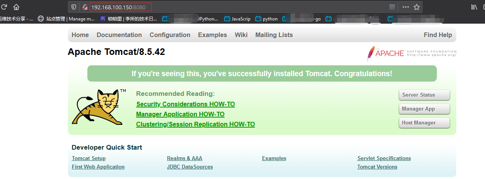
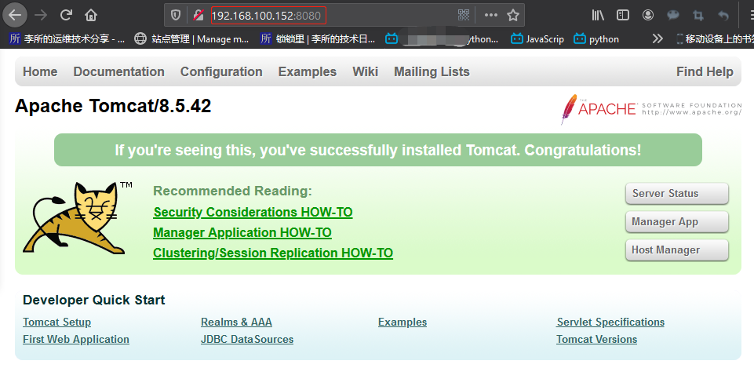
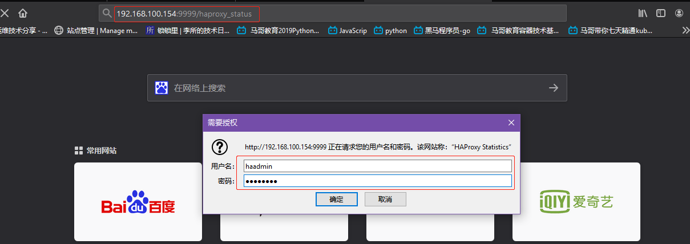
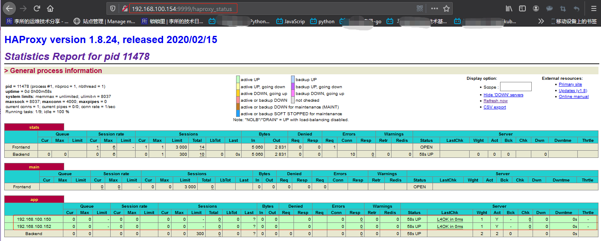
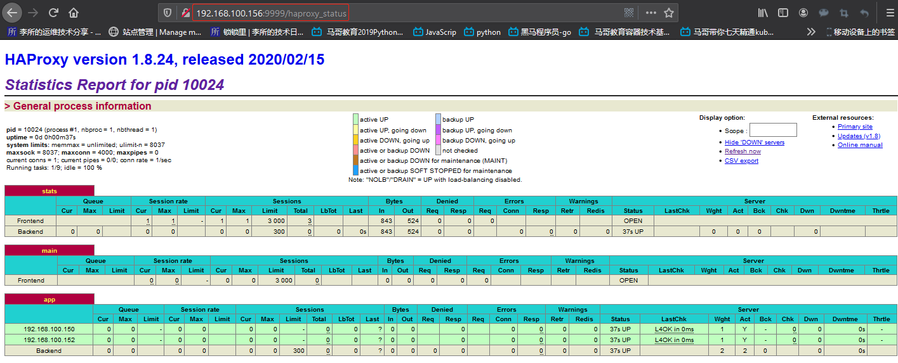
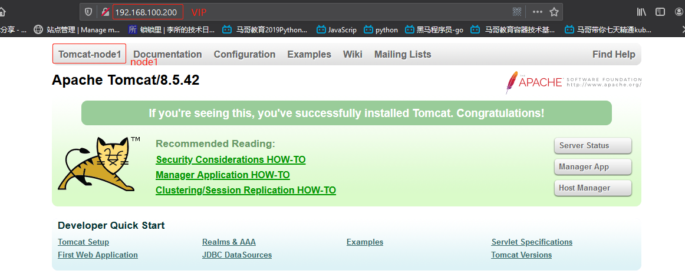
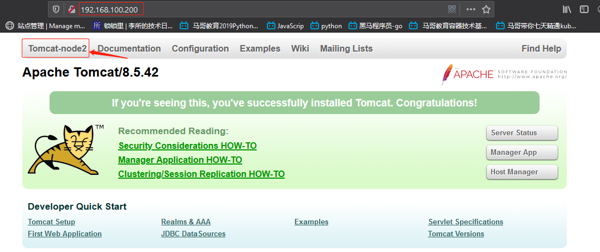

部署一套 web 环境来做代码部署和发布实验，后期使用 jenkins 结合 gitlab
实现代码自动构建部署和升级。

环境：

| 服务               | 主机名              | IP              |
| :----------------- | :------------------ | :-------------- |
| gitlab             | gitlab-server       | 192.168.100.146 |
| jenkins            | Jenkins-server      | 192.168.100.148 |
| Tomcat1            | tomcat-server-node1 | 192.168.100.150 |
| Tomcat2            | tomcat-server-node2 | 192.168.100.152 |
| HAProxy/Keepalived | HAProxy-node1       | 192.168.100.154 |
| HAProxy/Keepalived | HAProxy-node2       | 192.168.100.156 |

**JAVA 环境准备**
JAVA 环境在两台 tomcat 服务器准备，例如在 tomcat-server-node1 演示如下：

1. 准备 jdk 安装包并解压

```bash
root@tomcat-server-node1:~# cd /usr/local/src/
root@tomcat-server-node1:/usr/local/src# ls
jdk-8u241-linux-x64.tar.gz

root@tomcat-server-node1:/usr/local/src# tar -xf jdk-8u241-linux-x64.tar.gz
root@tomcat-server-node1:/usr/local/src# ls
jdk1.8.0_241  jdk-8u241-linux-x64.tar.gz
root@tomcat-server-node1:/usr/local/src# ll jdk1.8.0_241/
total 26012
drwxr-xr-x 7 10143 10143     4096 Dec 11 18:39 ./
drwxr-xr-x 3 root  root      4096 Mar 10 11:26 ../
drwxr-xr-x 2 10143 10143     4096 Dec 11 18:35 bin/
-r--r--r-- 1 10143 10143     3244 Dec 11 18:35 COPYRIGHT
drwxr-xr-x 3 10143 10143     4096 Dec 11 18:35 include/
-rw-r--r-- 1 10143 10143  5217333 Dec 11 15:41 javafx-src.zip
drwxr-xr-x 5 10143 10143     4096 Dec 11 18:35 jre/
drwxr-xr-x 5 10143 10143     4096 Dec 11 18:35 lib/
-r--r--r-- 1 10143 10143       44 Dec 11 18:35 LICENSE
drwxr-xr-x 4 10143 10143     4096 Dec 11 18:35 man/
-r--r--r-- 1 10143 10143      159 Dec 11 18:35 README.html
-rw-r--r-- 1 10143 10143      424 Dec 11 18:35 release
-rw-r--r-- 1 10143 10143 21078837 Dec 11 18:35 src.zip
-rw-r--r-- 1 10143 10143   116400 Dec 11 15:41 THIRDPARTYLICENSEREADME-JAVAFX.txt
-r--r--r-- 1 10143 10143   169788 Dec 11 18:35 THIRDPARTYLICENSEREADME.txt
```

2. 创建软链接

```bash
root@tomcat-server-node1:/usr/local/src# ln -sv /usr/local/src/jdk1.8.0_241/ /usr/local/jdk
'/usr/local/jdk' -> '/usr/local/src/jdk1.8.0_241/'
```

3. 配置环境变量

```bash
root@tomcat-server-node1:~# vim /etc/profile
...
export JAVA_HOME="/usr/local/jdk"
export PATH=$JAVA_HOME/bin:$PATH
...
```

4. 查看 java 版本

```bash
root@tomcat-server-node1:~# java -version
java version "1.8.0_241"
Java(TM) SE Runtime Environment (build 1.8.0_241-b07)
Java HotSpot(TM) 64-Bit Server VM (build 25.241-b07, mixed mode)
```

# 一. 部署 Tomcat 服务

## 1.1 第一台 Tomcat

1. 准备 tomcat 安装包并解压

```bash
root@tomcat-server-node1:~# ls
apache-tomcat-8.5.42.tar.gz
root@tomcat-server-node1:~# tar -xf apache-tomcat-8.5.42.tar.gz -C /usr/local/src/
```

2. 创建软链接

```bash
root@tomcat-server-node1:~# ln -sv /usr/local/src/apache-tomcat-8.5.42 /usr/local/tomcat
'/usr/local/tomcat' -> '/usr/local/src/apache-tomcat-8.5.42'
```

3. 添加环境变量

```bash
root@tomcat-server-node1:~# vim /etc/profile
...
export JAVA_HOME="/usr/local/jdk"
export PATH=$JAVA_HOME/bin:$PATH
...
export CATALINA_BASE="/usr/local/tomcat"
export CATALINA_HOME="/usr/local/tomcat"
export JRE_HOME="$JAVA_HOME/jre"
export CLASSPATH="$CATALINA_HOME/bin"
export PATH=$CLASSPATH:$PATH
...
```

4. 启动 tomcat

```bash
root@tomcat-server-node1:/usr/local/tomcat# catalina.sh start
Using CATALINA_BASE:   /usr/local/tomcat
Using CATALINA_HOME:   /usr/local/tomcat
Using CATALINA_TMPDIR: /usr/local/tomcat/temp
Using JRE_HOME:        /usr/local/jdk/jre
Using CLASSPATH:       /usr/local/tomcat/bin/bootstrap.jar:/usr/local/tomcat/bin/tomcat-juli.jar
Tomcat started.

root@tomcat-server-node1:/usr/local/tomcat# catalina.sh version
Using CATALINA_BASE:   /usr/local/tomcat
Using CATALINA_HOME:   /usr/local/tomcat
Using CATALINA_TMPDIR: /usr/local/tomcat/temp
Using JRE_HOME:        /usr/local/jdk/jre
Using CLASSPATH:       /usr/local/tomcat/bin/bootstrap.jar:/usr/local/tomcat/bin/tomcat-juli.jar
Server version: Apache Tomcat/8.5.42
Server built:   Jun 4 2019 20:29:04 UTC
Server number:  8.5.42.0
OS Name:        Linux
OS Version:     4.15.0-55-generic
Architecture:   amd64
JVM Version:    1.8.0_241-b07
JVM Vendor:     Oracle Corporation
```

5. 访问测试



## 1.2 第二台 Tomcat

略



# 二. HAProxy 与 Keepalived

将 HAProxy 部署于两台机器，并使用 Keepalived 实现高可用

## 2.1 Keepalived 部署

### 2.1.1 HAProxy-node1

1. 安装编译安装 keepalived 的库和依赖

```bash
[root@HAProxy-node1 ~]# yum install libnfnetlink-devel libnfnetlink ipvsadm libnl libnl-devel libnl3 libnl3-devel \
> lm_sensors-libs net-snmp-agent-libs net-snmp-libs open server openssh-clients openssl \
> openssl-devel automake iproute
```

2. 获取 keepalived 源码并解压

```bash
[root@HAProxy-node1 src]# pwd
/usr/local/src
[root@HAProxy-node1 src]# rz -E
rz waiting to receive.
[root@HAProxy-node1 src]# ls
keepalived-2.0.7.tar.gz
[root@HAProxy-node1 src]# tar -xf keepalived-2.0.7.tar.gz
```

3. 编译安装

```bash
[root@HAProxy-node1 src]# cd keepalived-2.0.7/
[root@HAProxy-node1 keepalived-2.0.7]# ./configure --prefix=/usr/local/keepalived --disable-fwmark

[root@HAProxy-node1 keepalived-2.0.7]# make -j 2 && make install
```

4. 配置 keepalived

```bash
[root@HAProxy-node1 keepalived-2.0.7]# mkdir /usr/local/keepalived/etc/sysconfig -p

[root@HAProxy-node1 keepalived-2.0.7]# cp keepalived/etc/init.d/keepalived.rh.init /usr/local/keepalived/etc/sysconfig/keepalived

[root@HAProxy-node1 keepalived-2.0.7]# cp keepalived/keepalived.service /usr/lib/systemd/system/

[root@HAProxy-node1 keepalived-2.0.7]# mkdir /usr/local/keepalived/sbin

[root@HAProxy-node1 keepalived-2.0.7]# cp bin/keepalived /usr/local/keepalived/sbin/keepalived

[root@HAProxy-node1 keepalived-2.0.7]# cp bin/keepalived /usr/local/keepalived/sbin/keepalived

[root@HAProxy-node1 keepalived-2.0.7]# mkdir /etc/keepalived

[root@HAProxy-node1 keepalived-2.0.7]# vim /etc/keepalived/keepalived.conf
[root@HAProxy-node1 keepalived-2.0.7]# cat /etc/keepalived/keepalived.conf
vrrp_instance VI_1 {
    state MASTER
    interface eth0
    virtual_router_id 80
    priority 100
    advert_int 1
    unicast_src_ip 192.168.100.154
unicast_peer {
    192.168.100.156
    }
authentication {
    auth_type PASS
    auth_pass 1111
    }
virtual_ipaddress {
    192.168.100.200 dev eth0 label eth0:0
    }
}

```

5. 启动 keepalived

```bash
[root@HAProxy-node1 keepalived-2.0.7]# systemctl daemon-reload
[root@HAProxy-node1 keepalived-2.0.7]# systemctl status keepalived
● keepalived.service - LVS and VRRP High Availability Monitor
   Loaded: loaded (/usr/lib/systemd/system/keepalived.service; disabled; vendor preset: disabled)
   Active: inactive (dead)
[root@HAProxy-node1 keepalived-2.0.7]# systemctl start keepalived
[root@HAProxy-node1 keepalived-2.0.7]# systemctl enable keepalived.service
Created symlink from /etc/systemd/system/multi-user.target.wants/keepalived.service to /usr/lib/systemd/system/keepalived.service.

[root@HAProxy-node1 keepalived-2.0.7]# systemctl status keepalived
● keepalived.service - LVS and VRRP High Availability Monitor
   Loaded: loaded (/usr/lib/systemd/system/keepalived.service; disabled; vendor preset: disabled)
   Active: active (running) since Tue 2020-03-10 12:23:52 CST; 2s ago
  Process: 9689 ExecStart=/usr/local/keepalived/sbin/keepalived $KEEPALIVED_OPTIONS (code=exited, status=0/SUCCESS)
 Main PID: 9690 (keepalived)
   CGroup: /system.slice/keepalived.service
           ├─9690 /usr/local/keepalived/sbin/keepalived
           └─9691 /usr/local/keepalived/sbin/keepalived

[root@HAProxy-node1 keepalived-2.0.7]# ip addr show eth0 | grep inet
        # VIP 为 192.160.100.200 已经分配给eth0
    inet 192.168.100.154/24 brd 192.168.100.255 scope global noprefixroute eth0
    inet 192.168.100.200/32 scope global eth0:0
    inet6 fe80::20c:29ff:fe95:ccbc/64 scope link
```

### 2.1.2 HAProxy-node2

编译安装略...

4. keepalived 配置

```bash
[root@HAProxy-node2 keepalived-2.0.7]# cat /etc/keepalived/keepalived.conf
vrrp_instance VI_1 {
    state BACKUP
    interface eth0
    virtual_router_id 80
    priority 80
    advert_int 1
    unicast_src_ip 192.168.100.156
unicast_peer {
    192.168.100.154
    }
authentication {
    auth_type PASS
    auth_pass 1111
    }
virtual_ipaddress {
    192.168.100.200 dev eth0 label eth0:0
    }
}

```

5. 启动 keepalived

```bash
[root@HAProxy-node2 ~]# systemctl daemon-reload
[root@HAProxy-node2 ~]# systemctl status keepalived.service
● keepalived.service - LVS and VRRP High Availability Monitor
   Loaded: loaded (/usr/lib/systemd/system/keepalived.service; disabled; vendor preset: disabled)
   Active: inactive (dead)
[root@HAProxy-node2 ~]# systemctl start  keepalived.service
[root@HAProxy-node1 keepalived-2.0.7]# systemctl enable keepalived.service
Created symlink from /etc/systemd/system/multi-user.target.wants/keepalived.service to /usr/lib/systemd/system/keepalived.service.

[root@HAProxy-node2 ~]# systemctl status keepalived.service
● keepalived.service - LVS and VRRP High Availability Monitor
   Loaded: loaded (/usr/lib/systemd/system/keepalived.service; disabled; vendor preset: disabled)
   Active: active (running) since Tue 2020-03-10 12:30:56 CST; 1s ago
  Process: 5314 ExecStart=/usr/local/keepalived/sbin/keepalived $KEEPALIVED_OPTIONS (code=exited, status=0/SUCCESS)
 Main PID: 5315 (keepalived)
   CGroup: /system.slice/keepalived.service
           ├─5315 /usr/local/keepalived/sbin/keepalived
           └─5316 /usr/local/keepalived/sbin/keepalived

Mar 10 12:30:56 HAProxy-node2 Keepalived[5314]: Running on Linux 3.10.0-1062.el7.x86_64 #1 SMP Wed Aug 7 18:08:02 UTC 2019 (built for Linux 3.10.0)
Mar 10 12:30:56 HAProxy-node2 Keepalived[5314]: Command line: '/usr/local/keepalived/sbin/keepalived'
Mar 10 12:30:56 HAProxy-node2 Keepalived[5314]: Opening file '/etc/keepalived/keepalived.conf'.
Mar 10 12:30:56 HAProxy-node2 Keepalived[5315]: Starting VRRP child process, pid=5316
Mar 10 12:30:56 HAProxy-node2 systemd[1]: Started LVS and VRRP High Availability Monitor.
Mar 10 12:30:56 HAProxy-node2 Keepalived_vrrp[5316]: Registering Kernel netlink reflector
Mar 10 12:30:56 HAProxy-node2 Keepalived_vrrp[5316]: Registering Kernel netlink command channel
Mar 10 12:30:56 HAProxy-node2 Keepalived_vrrp[5316]: Opening file '/etc/keepalived/keepalived.conf'.
Mar 10 12:30:56 HAProxy-node2 Keepalived_vrrp[5316]: Registering gratuitous ARP shared channel
Mar 10 12:30:56 HAProxy-node2 Keepalived_vrrp[5316]: (VI_1) Entering BACKUP STATE (init)
[root@HAProxy-node2 ~]# ip addr show eth0 | grep inet
    inet 192.168.100.156/24 brd 192.168.100.255 scope global noprefixroute eth0
    inet6 fe80::20c:29ff:fed6:da0e/64 scope link
```

## 2.2 HAProxy 部署

### 2.2.1 HAProxy-node1

1. 准备 haproxy 源码解压

```bash
[root@HAProxy-node1 src]# ll
total 2988
-rw-r--r-- 1 root     root     2178823 Mar 10 13:47 haproxy-1.8.24.tar.gz
drwxrwxr-x 9 stevenux stevenux    4096 Mar 10 12:12 keepalived-2.0.7
-rw-r--r-- 1 root     root      873480 Mar 10 12:10 keepalived-2.0.7.tar.gz
[root@HAProxy-node1 src]# tar -xf haproxy-1.8.24.tar.gz
[root@HAProxy-node1 src]# cd haproxy-1.8.24/
```

2. 编译安装

```bash
[root@HAProxy-node1 haproxy-1.8.24]# make ARCH=x86_64 TARGET=linux2628 USE_PCRE=1 USE_OPENSSL=1 USE_ZLIB=1 USE_SYSTEMD=1 USE_CPU_AFFINITY=1 PREFIX=/usr/local/haproxy

[root@HAProxy-node1 haproxy-1.8.24]# make install PREFIX=/usr/local/haproxy
```

3. 准备 service 文件

```bash
[root@HAProxy-node1 haproxy-1.8.24]#  vim /usr/lib/systemd/system/haproxy.service
[root@HAProxy-node1 haproxy-1.8.24]# cat /usr/lib/systemd/system/haproxy.service
[Unit]
Description=HAProxy Load Balancer
After=syslog.target network.target
[Service]
ExecStartPre=/usr/sbin/haproxy -f /etc/haproxy/haproxy.cfg -f /etc/haproxy/conf -c -q
ExecStart=/usr/sbin/haproxy -Ws -f /etc/haproxy/haproxy.cfg -f /etc/haproxy/conf -p /run/haproxy.pid
ExecReload=/bin/kill -USR2 $MAINPID
[Install]
WantedBy=multi-user.target
```

4. 准备配置文件

```bash
[root@HAProxy-node1 haproxy-1.8.24]# mkdir /etc/haproxy
[root@HAProxy-node2 haproxy-1.8.24]# mkdir /etc/haproxy/conf

[root@HAProxy-node2 haproxy-1.8.24]# vim /etc/haproxy/haproxy.cfg
[root@HAProxy-node1 haproxy-1.8.24]# cat /etc/haproxy/haproxy.cfg
global
    log         127.0.0.1 local2
    chroot      /usr/local/haproxy
    pidfile     /usr/local/haproxy/run/haproxy.pid
    maxconn     4000
    user        haproxy
    group       haproxy
    daemon
    stats socket /usr/local/haproxy/stats
    ssl-default-bind-ciphers PROFILE=SYSTEM
    ssl-default-server-ciphers PROFILE=SYSTEM
defaults
    mode                    http
    log                     global
    option                  httplog
    option                  dontlognull
    option http-server-close
    option forwardfor       except 127.0.0.0/8
    option                  redispatch
    retries                 3
    timeout http-request    10s
    timeout queue           1m
    timeout connect         10s
    timeout client          1m
    timeout server          1m
    timeout http-keep-alive 10s
    timeout check           10s
    maxconn                 3000

listen stats
        mode http
        bind 192.168.100.154:9999
        stats enable
        log global
        stats uri    /haproxy_status
        stats auth   haadmin:stevenux

frontend main
    mode http
    bind 192.168.100.200:80 # keepalived 提供的 VIP
    default_backend             app

backend app
    balance     roundrobin
    server  192.168.100.150 192.168.100.150:8080 check inter 3000 fall 3 rise 5
    server  192.168.100.152 192.168.100.152:8080 check inter 3000 fall 3 rise 5

```

5. 添加 haproxy 用户

```bash
[root@HAProxy-node1 haproxy-1.8.24]# useradd -r haproxy
```

6. 将 haproxy 可执行文件软链接到`/usr/sbin/`

```bash
[root@HAProxy-node1 haproxy-1.8.24]# ln -sv /usr/local/haproxy/sbin/haproxy /usr/sbin/
‘/usr/sbin/haproxy’ -> ‘/usr/local/haproxy/sbin/haproxy’
```

7. 启动忽略 real-server，和开启路由转发

```bash
[root@HAProxy-node1 haproxy-1.8.24]# vim /etc/sysctl.conf
[root@HAProxy-node1 haproxy-1.8.24]# cat /etc/sysctl.conf
# sysctl settings are defined through files in
# /usr/lib/sysctl.d/, /run/sysctl.d/, and /etc/sysctl.d/.
#
# Vendors settings live in /usr/lib/sysctl.d/.
# To override a whole file, create a new file with the same in
# /etc/sysctl.d/ and put new settings there. To override
# only specific settings, add a file with a lexically later
# name in /etc/sysctl.d/ and put new settings there.
#
# For more information, see sysctl.conf(5) and sysctl.d(5).

net.ipv4.ip_nonlocal_bind = 1
net.ipv4.ip_forward = 1

[root@HAProxy-node1 haproxy-1.8.24]# sysctl -p
net.ipv4.ip_nonlocal_bind = 1
net.ipv4.ip_forward = 1
```

8. 启动 haproxy

```bash
[root@HAProxy-node1 haproxy-1.8.24]# systemctl daemon-reload
[root@HAProxy-node1 haproxy-1.8.24]# systemctl start haproxy.service
[root@HAProxy-node1 haproxy-1.8.24]# systemctl enable haproxy.service
Created symlink from /etc/systemd/system/multi-user.target.wants/haproxy.service to /usr/lib/systemd/system/haproxy.service.

[root@HAProxy-node1 haproxy-1.8.24]# systemctl status haproxy.service
● haproxy.service - HAProxy Load Balancer
   Loaded: loaded (/usr/lib/systemd/system/haproxy.service; disabled; vendor preset: disabled)
   Active: active (running) since Tue 2020-03-10 14:14:48 CST; 6min ago
 Main PID: 10745 (haproxy)
   CGroup: /system.slice/haproxy.service
           ├─10745 /usr/sbin/haproxy -Ws -f /etc/haproxy/haproxy.cfg -f /etc/haproxy/conf -p /run/haproxy.pid
           └─10747 /usr/sbin/haproxy -Ws -f /etc/haproxy/haproxy.cfg -f /etc/haproxy/conf -p /run/haproxy.pid

Mar 10 14:14:48 HAProxy-node1 systemd[1]: Starting HAProxy Load Balancer...
Mar 10 14:14:48 HAProxy-node1 systemd[1]: Started HAProxy Load Balancer.
```

### 2.2.1 HAProxy-node2

配置文件

```bash
[root@HAProxy-node2 haproxy-1.8.24]# cat /etc/haproxy/haproxy.cfg
global
    log         127.0.0.1 local2
    chroot      /usr/local/haproxy
    pidfile     /usr/local/haproxy/run/haproxy.pid
    maxconn     4000
    user        haproxy
    group       haproxy
    daemon
    stats socket /usr/local/haproxy/stats
    ssl-default-bind-ciphers PROFILE=SYSTEM
    ssl-default-server-ciphers PROFILE=SYSTEM
defaults
    mode                    http
    log                     global
    option                  httplog
    option                  dontlognull
    option http-server-close
    option forwardfor       except 127.0.0.0/8
    option                  redispatch
    retries                 3
    timeout http-request    10s
    timeout queue           1m
    timeout connect         10s
    timeout client          1m
    timeout server          1m
    timeout http-keep-alive 10s
    timeout check           10s
    maxconn                 3000

listen stats
        mode http
        bind 192.168.100.156:9999
        stats enable
        log global
        stats uri    /haproxy_status
        stats auth   haadmin:stevenux

frontend main
    mode http
    bind 192.168.100.200:80
    default_backend             app

backend app
    balance     roundrobin
    server  192.168.100.150 192.168.100.150:8080 check inter 3000 fall 3 rise 5
    server  192.168.100.152 192.168.100.152:8080 check inter 3000 fall 3 rise 5
```

启动

```bash
[root@HAProxy-node2 haproxy-1.8.24]# systemctl daemon-reload
[root@HAProxy-node2 haproxy-1.8.24]# systemctl start haproxy.service
[root@HAProxy-node2 haproxy-1.8.24]# systemctl enable haproxy.service
Created symlink from /etc/systemd/system/multi-user.target.wants/haproxy.service to /usr/lib/systemd/system/haproxy.service.

[root@HAProxy-node2 haproxy-1.8.24]# systemctl status haproxy.service
● haproxy.service - HAProxy Load Balancer
   Loaded: loaded (/usr/lib/systemd/system/haproxy.service; disabled; vendor preset: disabled)
   Active: active (running) since Tue 2020-03-10 14:53:17 CST; 1min 41s ago
 Main PID: 10023 (haproxy)
   CGroup: /system.slice/haproxy.service
           ├─10023 /usr/sbin/haproxy -Ws -f /etc/haproxy/haproxy.cfg -f /etc/haproxy/conf -p /run/haproxy.pid
           └─10024 /usr/sbin/haproxy -Ws -f /etc/haproxy/haproxy.cfg -f /etc/haproxy/conf -p /run/haproxy.pid

Mar 10 14:53:17 HAProxy-node2 systemd[1]: Starting HAProxy Load Balancer...
Mar 10 14:53:17 HAProxy-node2 systemd[1]: Started HAProxy Load Balancer.
```

测试状态页面

# 三. 测试访问

## 3.1 HAProxy 状态统计页面

### 3.1.1 HAProxy-node1

测试状态页面





### 3.1.2 HAProxy-node2



## 3.2 HAProxy 代理测试

访问 VIP 看是否将请求调度到后端的 tomcat。为看到调度效果，更改一下
两台 tomcat 主页。

**tomcat-server-node1**

```bash
root@tomcat-server-node1:/usr/local/tomcat/webapps# pwd
/usr/local/tomcat/webapps
root@tomcat-server-node1:/usr/local/tomcat/webapps# vim ROOT/index.jsp
......
37             <div id="navigation" class="curved container">
 38                 <span id="nav-home"><a href="${tomcatUrl}">Tomcat-node1</a></span>  <!-- 将Home改为Tomcat-node1 -->
 39                 <span id="nav-hosts"><a href="${tomcatDocUrl}">Documentation</a></span>
 40                 <span id="nav-config"><a href="${tomcatDocUrl}config/">Configuration</a></span>
 41                 <span id="nav-examples"><a href="${tomcatExamplesUrl}">Examples</a></span>
 42                 <span id="nav-wiki"><a href="https://wiki.apache.org/tomcat/FrontPage">Wiki</a></span>
 43                 <span id="nav-lists"><a href="${tomcatUrl}lists.html">Mailing Lists</a></span>
 44                 <span id="nav-help"><a href="${tomcatUrl}findhelp.html">Find Help</a></span>
 45                 <br class="separator" />
 46             </div>
 ......

```

**tomcat-server-node2**

```bash
root@tomcat-server-node2:/usr/local/tomcat/webapps# pwd
/usr/local/tomcat/webapps
root@tomcat-server-node2:/usr/local/tomcat/webapps# vim ROOT/index.jsp
......
37             <div id="navigation" class="curved container">
 38                 <span id="nav-home"><a href="${tomcatUrl}">Tomcat-node2</a></span>
 39                 <span id="nav-hosts"><a href="${tomcatDocUrl}">Documentation</a></span>
 40                 <span id="nav-config"><a href="${tomcatDocUrl}config/">Configuration</a></span>
 41                 <span id="nav-examples"><a href="${tomcatExamplesUrl}">Examples</a></span>
 42                 <span id="nav-wiki"><a href="https://wiki.apache.org/tomcat/FrontPage">Wiki</a></span>
 43                 <span id="nav-lists"><a href="${tomcatUrl}lists.html">Mailing Lists</a></span>
 44                 <span id="nav-help"><a href="${tomcatUrl}findhelp.html">Find Help</a></span>
 45                 <br class="separator" />
 46             </div>
 ......
```



刷新:由于 haproxy 的调度策略为轮询，所以刷新后会调度到 node2



使用 curl 测试：

```bash
[root@HAProxy-node1 haproxy-1.8.24]# curl http://192.168.100.200/ 2> /etc/null | grep node
                <span id="nav-home"><a href="https://tomcat.apache.org/">Tomcat-node2</a></span>

[root@HAProxy-node1 haproxy-1.8.24]# curl http://192.168.100.200/ 2> /etc/null | grep node
                <span id="nav-home"><a href="https://tomcat.apache.org/">Tomcat-node1</a></span>

[root@HAProxy-node1 haproxy-1.8.24]# curl http://192.168.100.200/ 2> /etc/null | grep node
                <span id="nav-home"><a href="https://tomcat.apache.org/">Tomcat-node2</a></span>

[root@HAProxy-node1 haproxy-1.8.24]# curl http://192.168.100.200/ 2> /etc/null | grep node
                <span id="nav-home"><a href="https://tomcat.apache.org/">Tomcat-node1</a></span>
......
```
