# 一. Jenkins 的分布式

在公司业务量很大，部署升级很频繁的情况下，Jenkins 面临的任务(Job)很多，
单台 jenkins master 同时执行代码 clone、编译、打包及构建，其性能可能会
出现瓶颈从而会影响代码部署效率。

Jenkins 官方提供了 jenkins 基于分布式的代码构建部署方案，将众多 job 分
散运行到不同的 jenkins slave 节点，大幅提升了 job 的并行处理能力。要作
为 Jenkins 的 slave，必须要有 java 运行环境和与 Jenkins master 相同的数据目录，
在 Jenkins master 添加 slave 时会用到。

## 1.1 配置 slave 节点的 java 环境

Slave 服务器创建工作目录，如果 slave 需要执行编译 job，则也需要配置 java 环境并
且安装 git、svn、maven 等与 master 相同的基础运行环境，另外也要创建与 master 相
同的数据目录，因为脚本中调用的路径只有相对于 master 的一个路径，此路径在 master
与各 node 节点必须保持一致。此处使用之前搭建的 HAProxy 服务器来作为 Jenkins master
的 slave 节点，两台主机的信息如下：

| 主机名        | IP              |
| :------------ | :-------------- |
| HAProxy-node1 | 192.168.100.154 |
| HAProxy-node2 | 192.168.100.156 |

### 1.1.1 HAProxy-node1

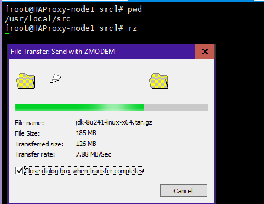

```bash
[root@HAProxy-node1 src]# tar -xf jdk-8u241-linux-x64.tar.gz
[root@HAProxy-node1 src]# ln -sv /usr/local/src/jdk1.8.0_241 /usr/local/jdk
‘/usr/local/jdk’ -> ‘/usr/local/src/jdk1.8.0_241’
[root@HAProxy-node1 src]# vim /etc/profile
...
export HISTTIMEFORMAT="%F %T `whoami` "
export export LANG="en_US.utf-8"
export JAVA_HOME="/usr/local/jdk"
export CLASSPATH=$JAVA_HOME/jre/lib/rt.jar:$JAVA_HOME/lib/dt.jar:$JAVA_HOME/lib/tools.jar
export PATH=$PATH:$JAVA_HOME/bin
...

[root@HAProxy-node1 src]# source /etc/profile
[root@HAProxy-node1 src]# java -version
java version "1.8.0_241"
Java(TM) SE Runtime Environment (build 1.8.0_241-b07)
Java HotSpot(TM) 64-Bit Server VM (build 25.241-b07, mixed mode)

[root@HAProxy-node1 src]# mkdir -p /var/lib/jenkins  # 创建数据目录

# 拷贝到HAProxy-node2
[root@HAProxy-node1 src]# scp jdk-8u241-linux-x64.tar.gz 192.168.100.152:/usr/local/src/
The authenticity of host '192.168.100.152 (192.168.100.152)' can't be established.
ECDSA key fingerprint is SHA256:IWO779gOyKnoEGhNjx2RPwGlydzZpXmzbqAlb/nkMYk.
ECDSA key fingerprint is MD5:ce:86:fb:45:d3:d5:da:27:30:c3:f3:72:0d:a7:e1:ea.
Are you sure you want to continue connecting (yes/no)? yes
Warning: Permanently added '192.168.100.152' (ECDSA) to the list of known hosts.
root@192.168.100.152's password:
jdk-8u241-linux-x64.tar.gz                                                                   100%  186MB 112.9MB/s   00:01
```

### 1.1.2 HAProxy-node2

```bash
[root@HAProxy-node2 src]# pwd
/usr/local/src
[root@HAProxy-node2 src]# tar -xf jdk-8u241-linux-x64.tar.gz
[root@HAProxy-node2 src]# ln -sv /usr/local/src/jdk1.8.0_241 /usr/local/jdk
‘/usr/local/jdk’ -> ‘/usr/local/src/jdk1.8.0_241’
[root@HAProxy-node2 src]# vim /etc/profile
...
export HISTTIMEFORMAT="%F %T `whoami` "
export export LANG="en_US.utf-8"
export JAVA_HOME="/usr/local/jdk"
export CLASSPATH=$JAVA_HOME/jre/lib/rt.jar:$JAVA_HOME/lib/dt.jar:$JAVA_HOME/lib/tools.jar
export PATH=$PATH:$JAVA_HOME/bin
...

[root@HAProxy-node2 src]# source /etc/profile
[root@HAProxy-node2 src]# java -version
java version "1.8.0_241"
Java(TM) SE Runtime Environment (build 1.8.0_241-b07)
Java HotSpot(TM) 64-Bit Server VM (build 25.241-b07, mixed mode)

[root@HAProxy-node2 src]# mkdir -p /var/lib/jenkins  # 创建数据目录
```

## 1.2 添加节点配置

### 1.2.1 添加 slave

#### 1.2.1.1 基础配置

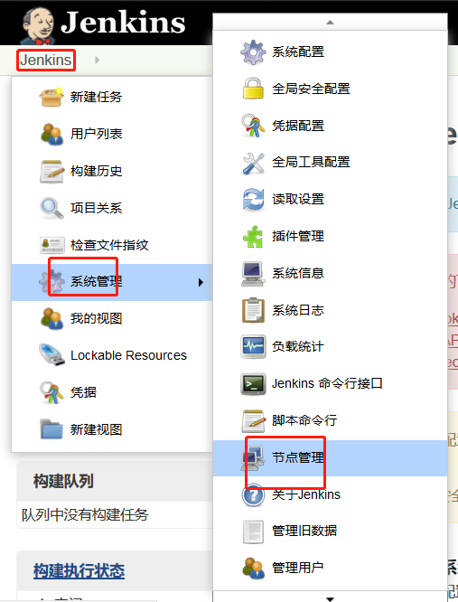
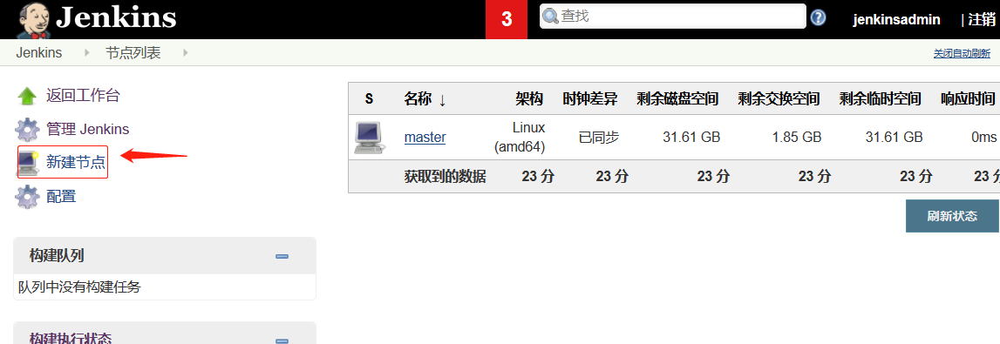
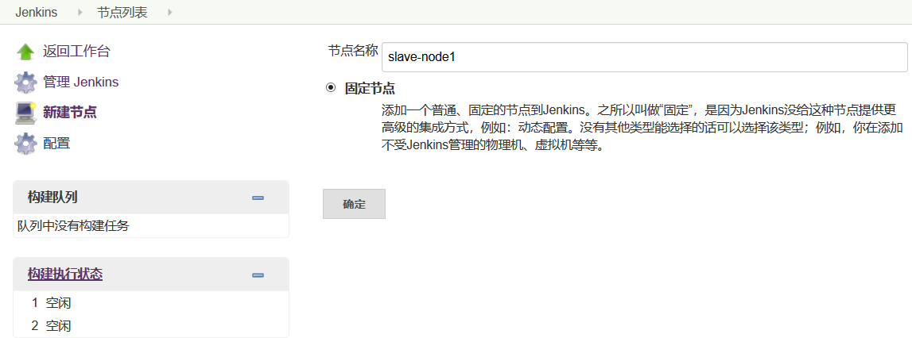
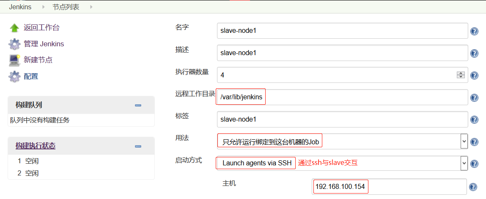

#### 1.2.1.2 添加 slave 认证凭据

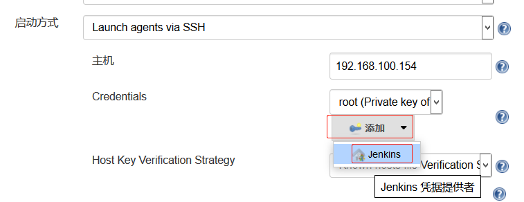

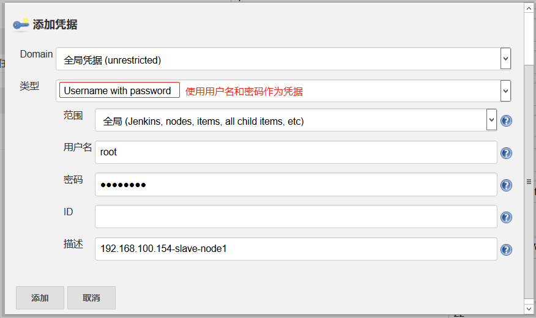

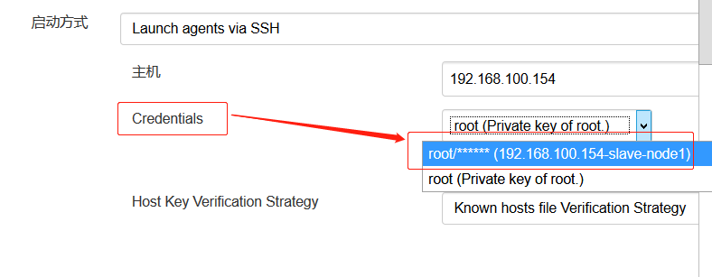

#### 1.2.1.3 确认 slave 添加配置

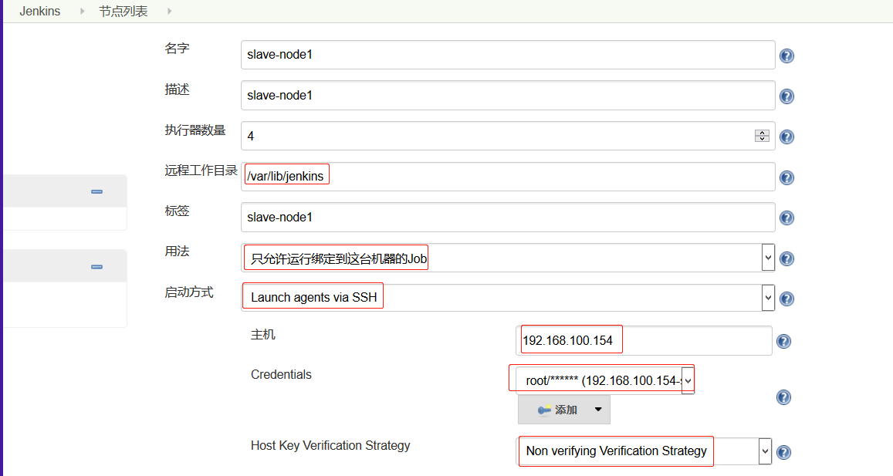
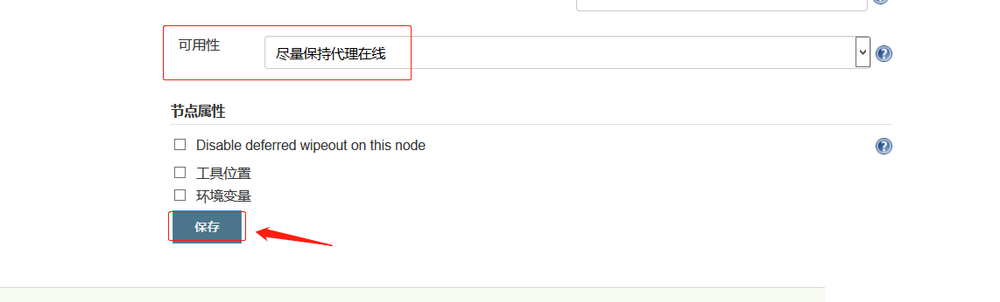

### 1.2.2 查看 jenkins 创建 slave 的日志

找不到 java 可执行文件时的报错：

```bash
[03/12/20 22:57:20] [SSH] Checking java version of /usr/local/java/bin/java
Couldn\'t figure out the Java version of /usr/local/java/bin/java
bash: /usr/local/java/bin/java: No such file or directory

java.io.IOException: Java not found on hudson.slaves.SlaveComputer@49c68051. Install a Java 8 version on the Agent.
	at hudson.plugins.sshslaves.JavaVersionChecker.resolveJava(JavaVersionChecker.java:82)
	at hudson.plugins.sshslaves.SSHLauncher$1.call(SSHLauncher.java:452)
	at hudson.plugins.sshslaves.SSHLauncher$1.call(SSHLauncher.java:422)
	at java.util.concurrent.FutureTask.run(FutureTask.java:266)
	at java.util.concurrent.ThreadPoolExecutor.runWorker(ThreadPoolExecutor.java:1149)
	at java.util.concurrent.ThreadPoolExecutor$Worker.run(ThreadPoolExecutor.java:624)
	at java.lang.Thread.run(Thread.java:748)
[03/12/20 22:57:20] Launch failed - cleaning up connection
[03/12/20 22:57:20] [SSH] Connection closed.
```

解决：将`/usr/local/jdk/bin/java` 软链接到`/usr/local/java/bin/java`

```bash
[root@HAProxy-node1 src]# mkdir /usr/local/java/bin/ -p
[root@HAProxy-node1 src]# ln -sv /usr/local/jdk/bin/java /usr/local/java/bin/java
```

解决以后的日志：

```bash
[03/12/20 22:59:20] [SSH] Checking java version of /usr/java/latest/bin/java
Couldn't figure out the Java version of /usr/java/latest/bin/java
bash: /usr/java/latest/bin/java: No such file or directory

[03/12/20 22:59:20] [SSH] Checking java version of /usr/local/bin/java
Couldn't figure out the Java version of /usr/local/bin/java
bash: /usr/local/bin/java: No such file or directory

[03/12/20 22:59:20] [SSH] Checking java version of /usr/local/java/bin/java
[03/12/20 22:59:20] [SSH] /usr/local/java/bin/java -version returned 1.8.0_241.
[03/12/20 22:59:20] [SSH] Starting sftp client.
[03/12/20 22:59:20] [SSH] Copying latest remoting.jar...
[03/12/20 22:59:20] [SSH] Copied 877,037 bytes.
Expanded the channel window size to 4MB
[03/12/20 22:59:20] [SSH] Starting agent process: cd "/var/lib/jenkins" && /usr/local/java/bin/java  -jar remoting.jar -workDir /var/lib/jenkins -jar-cache /var/lib/jenkins/remoting/jarCache
Mar 12, 2020 3:47:43 PM org.jenkinsci.remoting.engine.WorkDirManager initializeWorkDir
INFO: Using /var/lib/jenkins/remoting as a remoting work directory
Mar 12, 2020 3:47:43 PM org.jenkinsci.remoting.engine.WorkDirManager setupLogging
INFO: Both error and output logs will be printed to /var/lib/jenkins/remoting
<===[JENKINS REMOTING CAPACITY]===>channel started
Remoting version: 3.36.1
This is a Unix agent
Evacuated stdout
Agent successfully connected and online
```

### 1.2.3 验证 slave 的 web 状态

#### 1.2.3.1 时间不同步

时间不同步会显示如下：

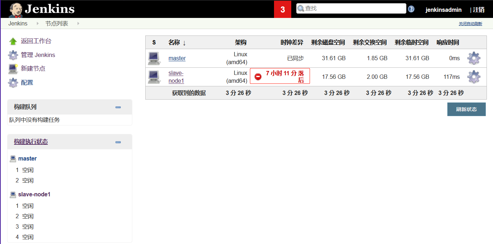

将 master 和 slave 均和阿里云的时间服务器同步:

```bash
root@Jenkins-server:~# ntpdate ntp.aliyun.com
12 Mar 23:14:02 ntpdate[28603]: adjust time server 203.107.6.88 offset 0.110724 sec

[root@HAProxy-node1 src]# ntpdate ntp.aliyun.com
12 Mar 23:14:12 ntpdate[14157]: adjust time server 203.107.6.88 offset -0.000742 sec

[root@HAProxy-node2 src]# ntpdate ntp.aliyun.com
12 Mar 23:14:18 ntpdate[12007]: step time server 203.107.6.88 offset -2.454323 sec
```

#### 1.2.3.2 时间同步后

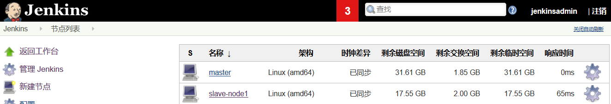

### 1.2.4 验证 slave 的进程状态

#### 1.2.4.1 node1

```bash
[root@HAProxy-node1 src]# ll /var/lib/jenkins/
total 860
drwxr-xr-x 4 root root     34 Mar 12 15:47 remoting
-rw-r--r-- 1 root root 877037 Mar 12 15:47 remoting.jar
[root@HAProxy-node1 src]# ps -ef | grep java
root      13918  13837  0 22:58 ?        00:00:00 bash -c cd "/var/lib/jenkins" && /usr/local/java/bin/java  -jar remoting.jar -workDir /var/lib/jenkins -jar-cache /var/lib/jenkins/remoting/jarCache
root      13925  13918  1 22:58 ?        00:00:12 /usr/local/java/bin/java -jar remoting.jar -workDir /var/lib/jenkins -jar-cache /var/lib/jenkins/remoting/jarCache
root      14174  13139  0 23:19 pts/0    00:00:00 grep --color=auto java

```

#### 1.2.4.2 node2

```bash
[root@HAProxy-node2 src]# ll /var/lib/jenkins/
total 860
drwxr-xr-x 4 root root     34 Mar 12 23:13 remoting
-rw-r--r-- 1 root root 877037 Mar 12 23:13 remoting.jar
[root@HAProxy-node2 src]# ps -ef | grep java
root      11889  11808  0 23:13 ?        00:00:00 bash -c cd "/var/lib/jenkins" && /usr/local/java/bin/java  -jar remoting.jar -workDir /vajenkins -jar-cache /var/lib/jenkins/remoting/jarCache
root      11896  11889  1 23:13 ?        00:00:07 /usr/local/java/bin/java -jar remoting.jar -workDir /var/lib/jenkins -jar-cache /var/lib/s/remoting/jarCache
root      12028  11322  0 23:20 pts/0    00:00:00 grep --color=auto java
```

# 二. Jenkins 的 Pipeline

Jenkins pipeline(或简称"Pipeline"，大写"P")是一套插件，支持将持续交付(CD)的 pipeline
实现和集成到 Jenkins 中。其在 jenkins 2.X 版本中引进，帮助 Jenkins 实现从 CI 到 CD
角色的转变。

简单来说 Pipline 是一套(核心插件)运行于 Jenkins 上的工作流框架，其可以
将原本独立运行于单个或者多个节点的任务连接起来，实现单个任务难以完成的复
杂发布流程，从而实现单个任务很难实现的复杂流程编排和任务可视化，Pipeline
的实现核心是 Groovy DSL(Pipeline domain-specific language)，任何发布流
程都可以表述为一段 Groovy[^1] 脚本。这段脚本也叫`Jenkinsfile`。

[pipeline-syntax:Pipeline 语法](https://jenkins.io/zh/doc/book/pipeline/syntax/)

## 2.1 定义 Pipeline 的脚本语法

**Step(步骤):** step 是 jenkins pipline 最基本的操作单元，从在服务器创
建目录到构建容器镜像，都离不开 step 语句。step 语句由各类 Jenkins 插件提供
实现，一个 stage 中可以有多个 step，例如： sh "make"

**Stage(阶段):** 一个 pipline 可以划分为若干个 stage，每个 stage 都是一个
操作步骤，比如 clone 代码、代码编译、代码测试和代码部署，阶段是一个逻辑分组，
可以跨多个 node 执行。

**Node(节点):** 每个 node 都是一个 jenkins 节点，可以是 jenkins master 也
可以是 jenkins agent，node 是执行 step 的具体服务器。

## 2.2 Pipeline 的优势

1. `可持续性`：jenkins 的重启或者中断后不影响已经执行的 Pipline Job
2. `支持暂停`：pipline 可以选择停止并等待人工输入或批准后再继续执行
3. `可扩展性`：通过 groovy 的编程更容易的扩展插件
4. `并行执行`：通过 groovy 脚本可以实现 step，stage 间的并行执行，和更复杂的
   相互依赖关系

## 2.3 Pipeline 执行 job 测试

### 2.3.1 创建 pipeline job

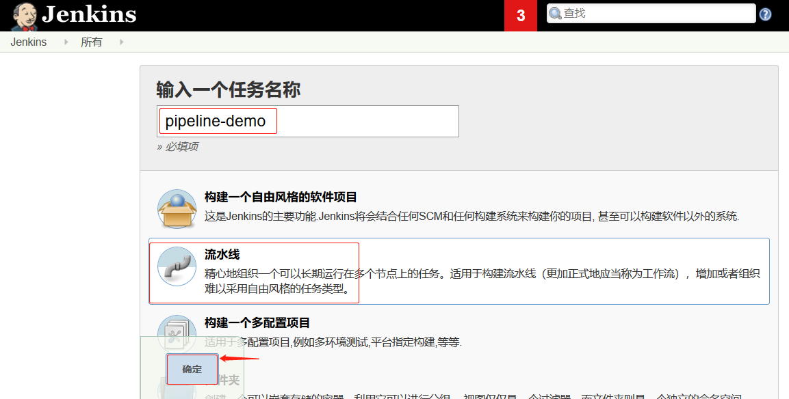

### 2.3.2 测试简单 pipline job 运行

#### 2.3.2.1 添加 pipeline 脚本

测试的 pipeline 定义脚本：

```groovy
node{
    stage("Code clone stage."){
        echo "Cloning code..."
    }
    stage("Build stage."){
        echo "Building..."
    }
    stage("Test stage."){
        echo "Testing..."
    }
    stage("Deploy stage."){
        echo "Deploying..."
    }
}
```

在创建 job 的界面填入该脚本：

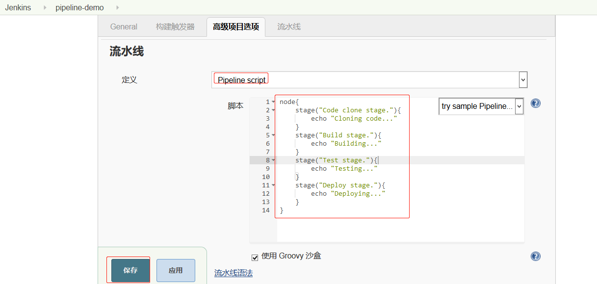

#### 2.3.2.2 测试运行该 job

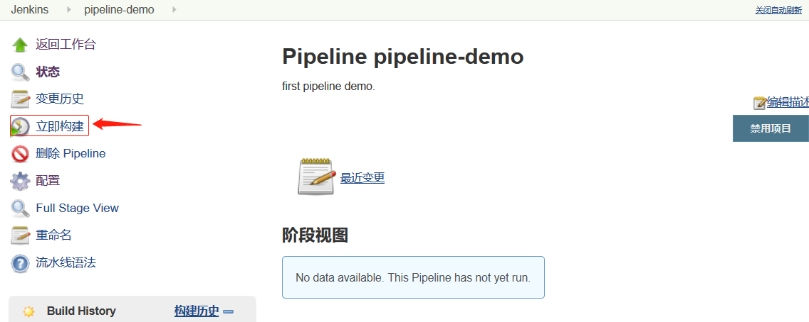

#### 2.3.2.3 查看结果

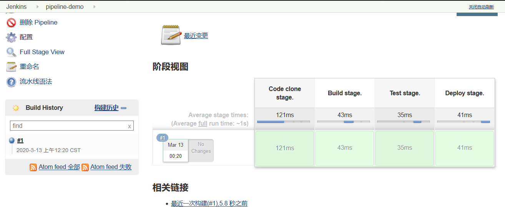

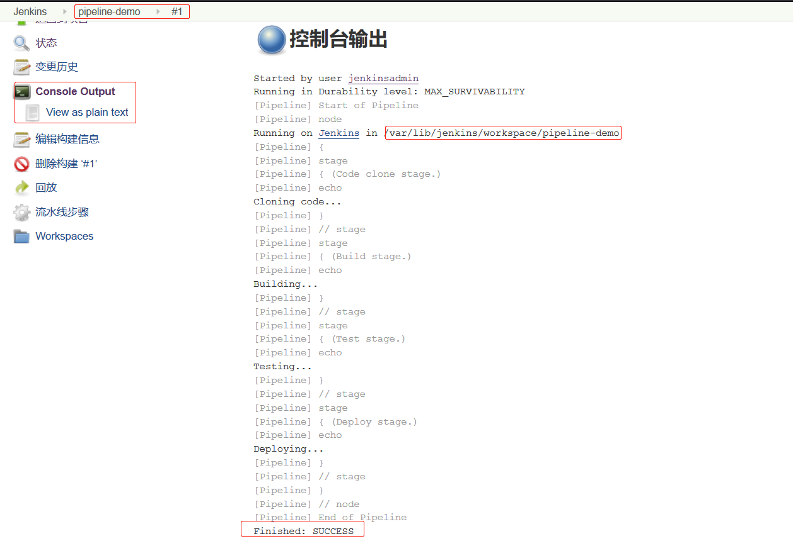

### 2.3.3 使用片段生成器编写 pipeline 脚本

使用片段生成器可以更快速的编写 pipeline 脚本

#### 2.3.3.1 生成自动拉取代码的 pipeline 脚本

点击 流水线语法 跳转至生成脚本的 URL：

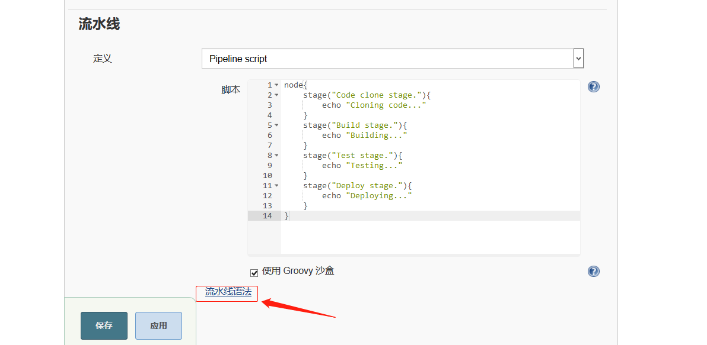

生成流水线脚本:

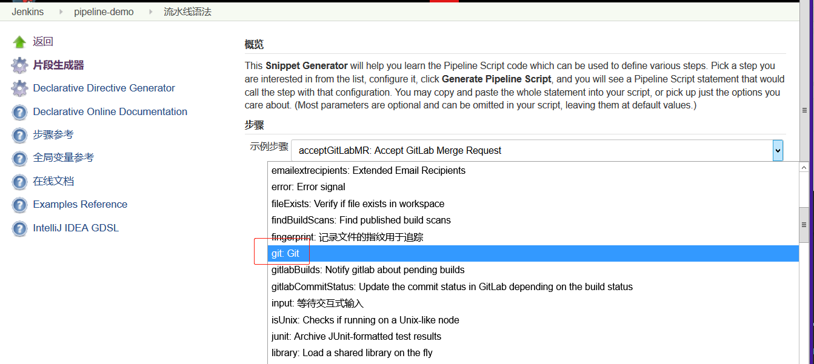

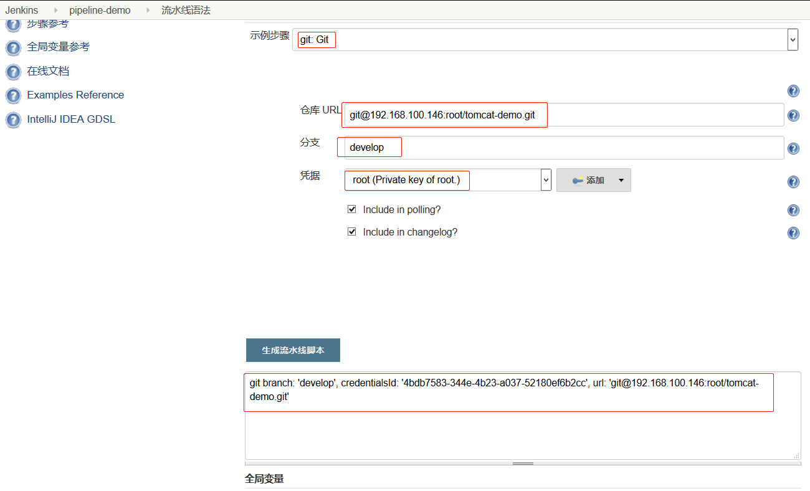

#### 2.3.3.2 更改测试的 pipeline 脚本

```groovy
node{
    stage("Code clone stage."){
		git branch: 'develop', credentialsId: '4bdb7583-344e-4b23-a037-52180ef6b2cc', url: 'git@192.168.100.146:root/tomcat-demo.git'

    }
    stage("Build stage."){
        echo "Building..."
    }
    stage("Test stage."){
        echo "Testing..."
    }
    stage("Deploy stage."){
        echo "Deploying..."
    }
}
```

#### 2.3.3.3 执行 pipeline job

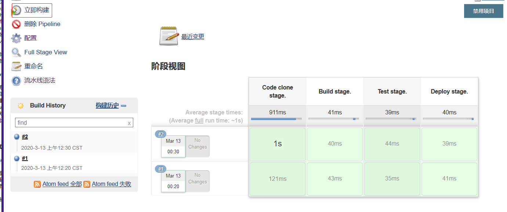

#### 2.3.3.4 查看 git clone 操作日志

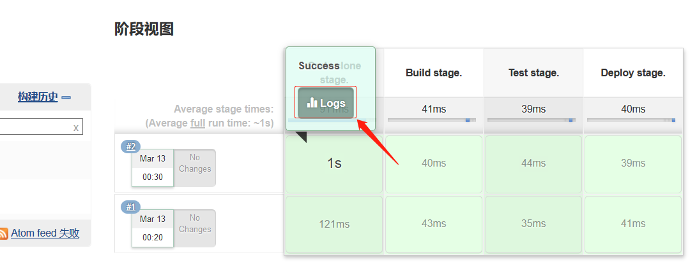

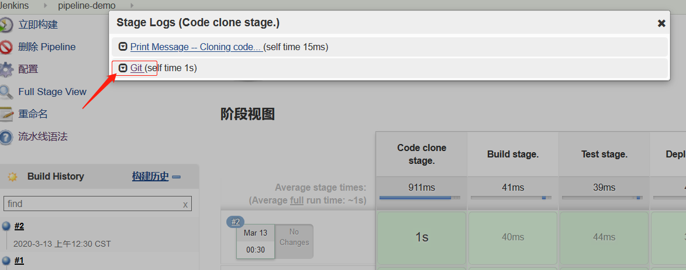

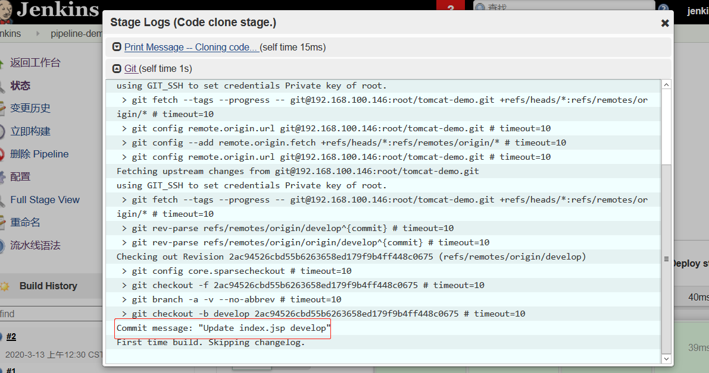

#### 2.3.3.5 jenkins 服务器验证 clone 代码数据

```bash
root@Jenkins-server:~# ll /var/lib/jenkins/workspace/pipeline-demo
total 204
drwxr-xr-x 4 jenkins jenkins  4096 Mar 13 00:30 ./
drwxr-xr-x 8 jenkins jenkins  4096 Mar 13 00:30 ../
-rw-r--r-- 1 jenkins jenkins 27235 Mar 13 00:30 asf-logo-wide.svg
-rw-r--r-- 1 jenkins jenkins   713 Mar 13 00:30 bg-button.png
-rw-r--r-- 1 jenkins jenkins  1918 Mar 13 00:30 bg-middle.png
-rw-r--r-- 1 jenkins jenkins  1392 Mar 13 00:30 bg-nav-item.png
-rw-r--r-- 1 jenkins jenkins  1401 Mar 13 00:30 bg-nav.png
-rw-r--r-- 1 jenkins jenkins  3103 Mar 13 00:30 bg-upper.png
-rw-r--r-- 1 jenkins jenkins 21630 Mar 13 00:30 favicon.ico
drwxr-xr-x 8 jenkins jenkins  4096 Mar 13 00:30 .git/
-rw-r--r-- 1 jenkins jenkins 12234 Mar 13 00:30 index.jsp
-rw-r--r-- 1 jenkins jenkins    26 Mar 13 00:30 README.md
-rw-r--r-- 1 jenkins jenkins  7139 Mar 13 00:30 RELEASE-NOTES.txt
-rw-r--r-- 1 jenkins jenkins  5581 Mar 13 00:30 tomcat.css
-rw-r--r-- 1 jenkins jenkins  2066 Mar 13 00:30 tomcat.gif
-rw-r--r-- 1 jenkins jenkins  5103 Mar 13 00:30 tomcat.png
-rw-r--r-- 1 jenkins jenkins  2376 Mar 13 00:30 tomcat-power.gif
-rw-r--r-- 1 jenkins jenkins 67795 Mar 13 00:30 tomcat.svg
drwxr-xr-x 2 jenkins jenkins  4096 Mar 13 00:30 WEB-INF/

root@Jenkins-server:/var/lib/jenkins/workspace/pipeline-demo# git log
commit 2ac94526cbd55b6263658ed179f9b4ff448c0675 (HEAD -> develop, origin/develop)
Author: Administrator <admin@example.com>
Date:   Thu Mar 12 21:28:10 2020 +0800

    Update index.jsp develop
...
```

## 2.4 代码拉取和部署

### 2.4.1 Pipeline 代码

```groovy
node{
    stage("Code clone stage."){
		sh 'rm -rf /var/lib/jenkins/workspace/pipeline-demo/*'
		git branch: 'develop', credentialsId: '4bdb7583-344e-4b23-a037-52180ef6b2cc', url: 'git@192.168.100.146:root/tomcat-demo.git'
    }

    stage("Archive stage."){
        /*echo "Building..."*/
		sh 'cd /var/lib/jenkins/workspace/pipeline-demo/ && tar czf code.tar.gz ./*'
    }

    stage("Transfer code tar ball stage."){
    	/*echo "Testing..."*/
		sh '/var/lib/jenkins/workspace/pipeline-demo/ && scp code.tar.gz www@192.168.100.150:/data/tomcat/appdir/'
		sh '/var/lib/jenkins/workspace/pipeline-demo/ && scp code.tar.gz www@192.168.100.152:/data/tomcat/appdir/'
    }

	stage("Stop tomcat stage."){
		sh 'ssh www@192.168.100.150 "/etc/init.d/tomcat stop"'
		sh 'ssh www@192.168.100.152 "/etc/init.d/tomcat stop"'
	}

    stage("Deploy stage."){
        /*echo "Deploying..."*/
		sh 'ssh www@192.168.100.150 "rm -rf /data/tomcat/webapps/app/* && cd /data/tomcat/appdir && tar xvf code.tar.gz -C /data/tomcat/webapps/app/" '
		sh 'ssh www@192.168.100.150 "rm -rf /data/tomcat/webapps/app/* && cd /data/tomcat/appdir && tar xvf code.tar.gz -C /data/tomcat/webapps/app/" '
	}

	stage("Start tomcat stage."){
		sh 'ssh www@192.168.100.150 "/etc/init.d/tomcat start"'
		sh 'ssh www@192.168.100.152 "/etc/init.d/tomcat start"'
	}
}
```

### 2.4.2 添加 pipeline 脚本和触发器

Jenkins token:
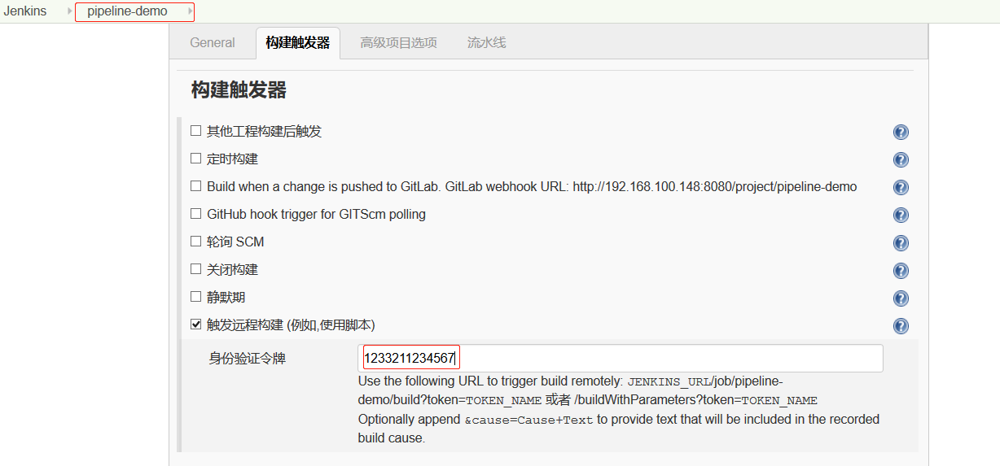

Gitlab system hook:
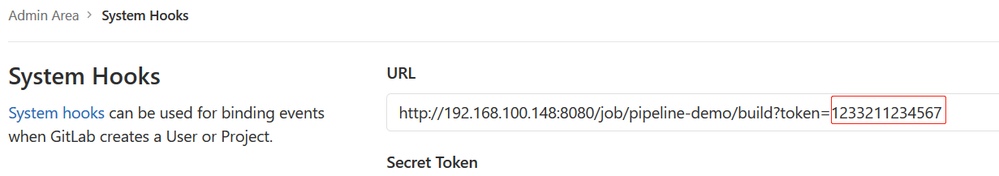
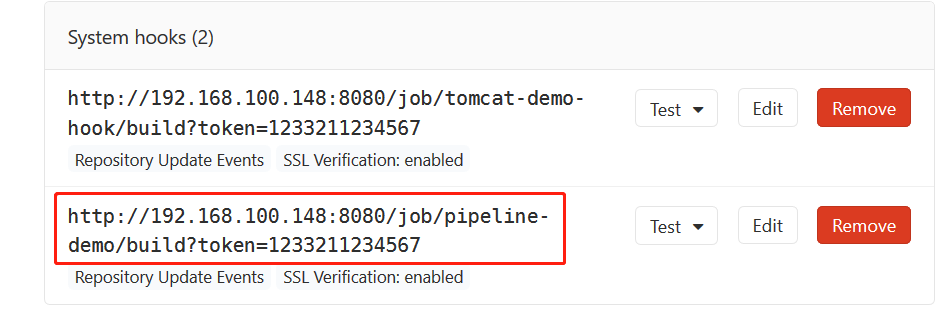

添加 pipeline 代码:
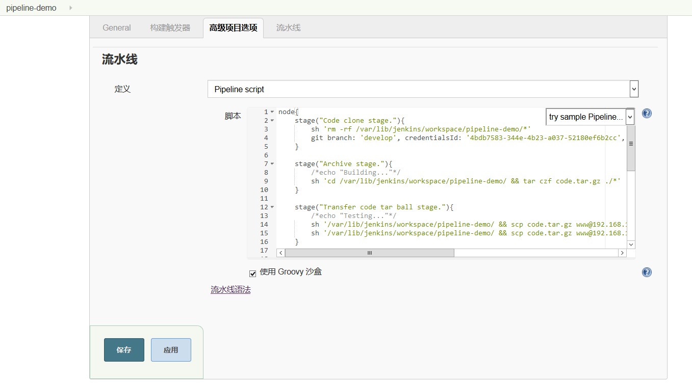

### 2.4.2 修改代码

修改代码
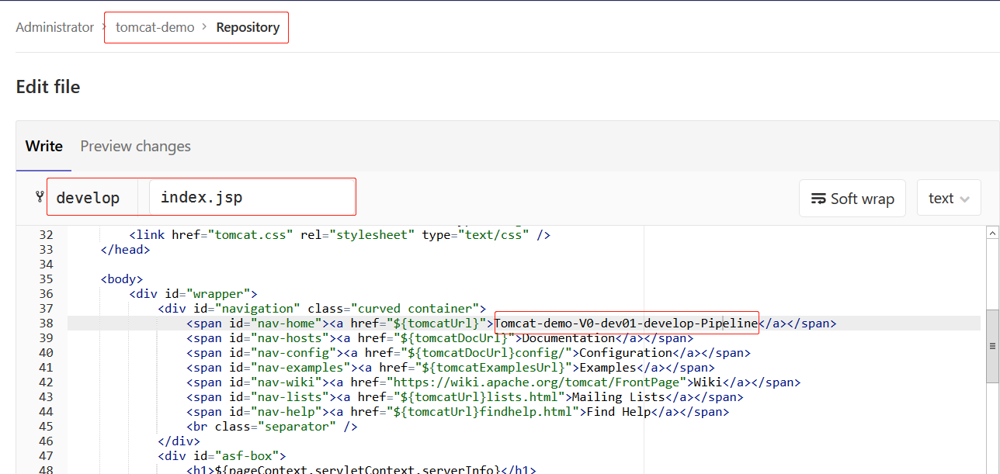

提交，触发构建
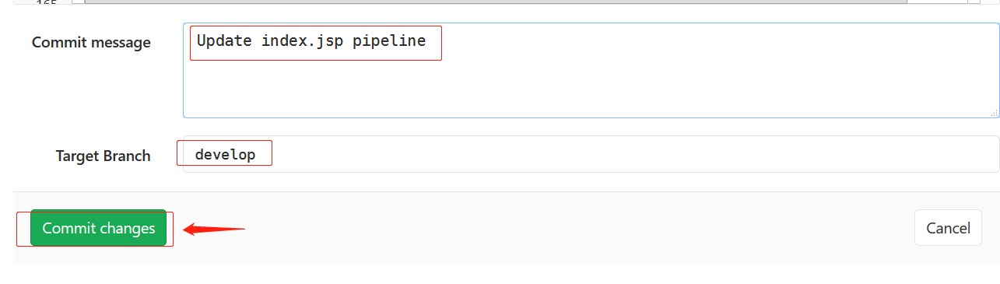

### 2.4.3 构建

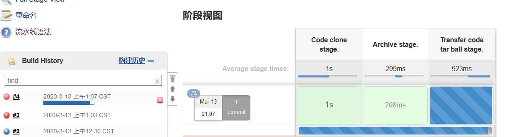
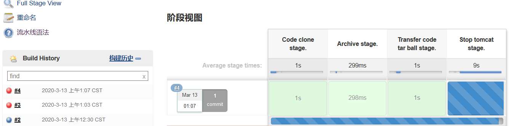
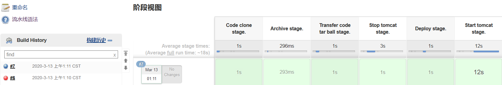
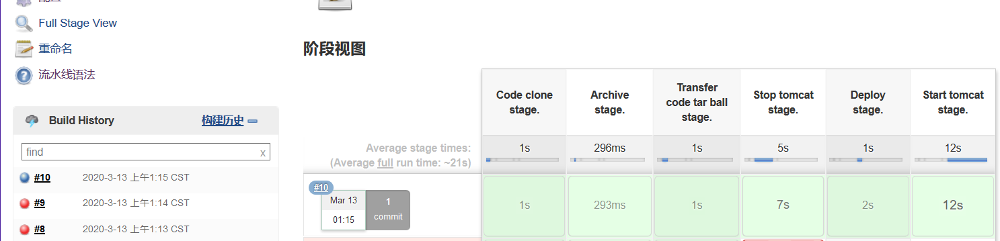

### 2.4.4 验证

#### 控制台输出

```bash
Started by remote host 192.168.100.146  ######## gitlab提交代码，仓库更新，触发该pipeline
Running in Durability level: MAX_SURVIVABILITY
[Pipeline] Start of Pipeline
[Pipeline] node
Running on Jenkins in /var/lib/jenkins/workspace/pipeline-demo
[Pipeline] {
[Pipeline] stage
[Pipeline] { (Code clone stage.)
[Pipeline] sh
+ rm -rf /var/lib/jenkins/workspace/pipeline-demo/README.md /var/lib/jenkins/workspace/pipeline-demo/RELEASE-NOTES.txt /var/lib/jenkins/workspace/pipeline-demo/WEB-INF /var/lib/jenkins/workspace/pipeline-demo/asf-logo-wide.svg /var/lib/jenkins/workspace/pipeline-demo/bg-button.png /var/lib/jenkins/workspace/pipeline-demo/bg-middle.png /var/lib/jenkins/workspace/pipeline-demo/bg-nav-item.png /var/lib/jenkins/workspace/pipeline-demo/bg-nav.png /var/lib/jenkins/workspace/pipeline-demo/bg-upper.png /var/lib/jenkins/workspace/pipeline-demo/code.tar.gz /var/lib/jenkins/workspace/pipeline-demo/favicon.ico /var/lib/jenkins/workspace/pipeline-demo/index.jsp /var/lib/jenkins/workspace/pipeline-demo/tomcat-power.gif /var/lib/jenkins/workspace/pipeline-demo/tomcat.css /var/lib/jenkins/workspace/pipeline-demo/tomcat.gif /var/lib/jenkins/workspace/pipeline-demo/tomcat.png /var/lib/jenkins/workspace/pipeline-demo/tomcat.svg
[Pipeline] git
using credential 4bdb7583-344e-4b23-a037-52180ef6b2cc
 > git rev-parse --is-inside-work-tree # timeout=10
Fetching changes from the remote Git repository
 > git config remote.origin.url git@192.168.100.146:root/tomcat-demo.git # timeout=10
Fetching upstream changes from git@192.168.100.146:root/tomcat-demo.git
 > git --version # timeout=10
using GIT_SSH to set credentials Private key of root.
 > git fetch --tags --progress -- git@192.168.100.146:root/tomcat-demo.git +refs/heads/*:refs/remotes/origin/* # timeout=10
 > git rev-parse refs/remotes/origin/develop^{commit} # timeout=10
 > git rev-parse refs/remotes/origin/origin/develop^{commit} # timeout=10
Checking out Revision 6c4028b21e4b3d73609d3672d45e8f6da2257808 (refs/remotes/origin/develop)
 > git config core.sparsecheckout # timeout=10
 > git checkout -f 6c4028b21e4b3d73609d3672d45e8f6da2257808 # timeout=10
 > git branch -a -v --no-abbrev # timeout=10
 > git branch -D develop # timeout=10
 > git checkout -b develop 6c4028b21e4b3d73609d3672d45e8f6da2257808 # timeout=10
Commit message: "Update index.jsp develop"  ######## 提交信息
 > git rev-list --no-walk 65cbb683884c1960cba7aad0e6b69fc662352921 # timeout=10
[Pipeline] }
[Pipeline] // stage
[Pipeline] stage
[Pipeline] { (Archive stage.)
[Pipeline] sh
+ cd /var/lib/jenkins/workspace/pipeline-demo/
+ tar czf code.tar.gz ./README.md ./RELEASE-NOTES.txt ./WEB-INF ./asf-logo-wide.svg ./bg-button.png ./bg-middle.png ./bg-nav-item.png ./bg-nav.png ./bg-upper.png ./favicon.ico ./index.jsp ./tomcat-power.gif ./tomcat.css ./tomcat.gif ./tomcat.png ./tomcat.svg
[Pipeline] }
[Pipeline] // stage
[Pipeline] stage
[Pipeline] { (Transfer code tar ball stage.)
[Pipeline] sh
+ cd /var/lib/jenkins/workspace/pipeline-demo/
+ scp code.tar.gz www@192.168.100.150:/data/tomcat/appdir/
[Pipeline] sh
+ cd /var/lib/jenkins/workspace/pipeline-demo/
+ scp code.tar.gz www@192.168.100.152:/data/tomcat/appdir/
[Pipeline] }
[Pipeline] // stage
[Pipeline] stage
[Pipeline] { (Stop tomcat stage.)
[Pipeline] sh
+ ssh www@192.168.100.150 /etc/init.d/tomcat stop
Tomcat is not running.
[Pipeline] sh
+ ssh www@192.168.100.152 /etc/init.d/tomcat stop
Tomcat is running, now stop...
[Pipeline] }
[Pipeline] // stage
[Pipeline] stage
[Pipeline] { (Deploy stage.)
[Pipeline] sh
+ ssh www@192.168.100.150 rm -rf /data/tomcat/webapps/app/* && cd /data/tomcat/appdir && tar xvf code.tar.gz -C /data/tomcat/webapps/app/
./README.md
./RELEASE-NOTES.txt
./WEB-INF/
./WEB-INF/web.xml
./asf-logo-wide.svg
./bg-button.png
./bg-middle.png
./bg-nav-item.png
./bg-nav.png
./bg-upper.png
./favicon.ico
./index.jsp
./tomcat-power.gif
./tomcat.css
./tomcat.gif
./tomcat.png
./tomcat.svg
[Pipeline] sh
+ ssh www@192.168.100.152 rm -rf /data/tomcat/webapps/app/* && cd /data/tomcat/appdir && tar xvf code.tar.gz -C /data/tomcat/webapps/app/
./README.md
./RELEASE-NOTES.txt
./WEB-INF/
./WEB-INF/web.xml
./asf-logo-wide.svg
./bg-button.png
./bg-middle.png
./bg-nav-item.png
./bg-nav.png
./bg-upper.png
./favicon.ico
./index.jsp
./tomcat-power.gif
./tomcat.css
./tomcat.gif
./tomcat.png
./tomcat.svg
[Pipeline] }
[Pipeline] // stage
[Pipeline] stage
[Pipeline] { (Start tomcat stage.)
[Pipeline] sh
+ ssh www@192.168.100.150 /etc/init.d/tomcat start
Tomcat is dead. Now start Tomcat...
Done. Tomcat now is running. PID=113342
[Pipeline] sh
+ ssh www@192.168.100.152 /etc/init.d/tomcat start
Tomcat is dead. Now start Tomcat...
Done. Tomcat now is running. PID=18982
[Pipeline] }
[Pipeline] // stage
[Pipeline] }
[Pipeline] // node
[Pipeline] End of Pipeline
Finished: SUCCESS
```

#### 查看页面

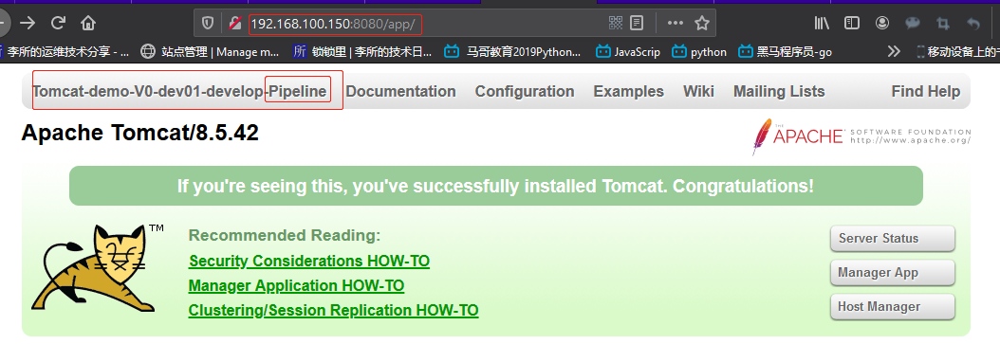

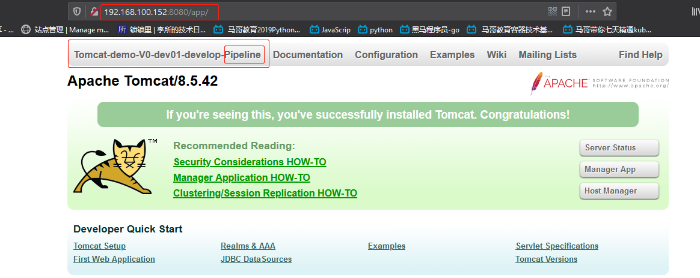

# 三. Jenkins 的视图

## 3.1

# Footnote

[^1]: Groovy 是一种基于 JVM（Java 虚拟机）的敏捷开发语言，它结合了 Python、Ruby 和 Smalltalk 的许多强大的特性，Groovy 代码能够与 Java 代码很好地结合，也能用于扩展现有代码。由于其运行在 JVM 上的特性，Groovy 也可以使用其他非 Java 语言编写的库。
