# 一. 代码质量检测概念

## 1.1 代码质量

代码质量可以从很多方面来衡量，但是不同的场景或者不同的人对于代码质量的理解
和要求是不一样的，大部分人认为衡量代码质量可以从以下方面展开：

1. 机器的运行效率。
2. 代码的时间复杂度和空间复杂度。
3. 代码的可维护性(如：代码的可读性、代码的重复率等)。

在实际的开发中，质量差的代码的出现常见于业务压力大，导致没有时间或意愿讲究代码质量。
后又因为向业务压力妥协而生产烂代码之后，开发效率会随之下降，导致业务压力更大，形成
一种典型的恶性循环。这时就必须进行规范的代码质量管理基础设施的建设，在代码质量管控
的过程中，不可缺少的步骤就是代码质量检测。

## 1.2 代码质量检测的七个维度

1. 复杂度：代码复杂度过高将难以理解，代码维护难度增大。复杂度如：总行数，模块大小，循环
   代码的循环深度等。

2. 重复代码：程序中包含大量复制、粘贴的代码而导致代码臃肿，通常要求代码重复率在 5%以下。

3. 单元测试统计：统计并展示单元测试覆盖率，开发或测试可以清楚测试代码的覆盖情况

4. 代码规则检查：检查代码是否符合规范

5. 注释率：若代码注释过少，特别是人员变动后，其他人接手比较难接手；若过多，又不利于阅读

6. 潜在的 Bug：检测潜在的 bug

7. 结构与设计：找出循环，展示包与包、类与类之间的依赖、检查程序之间耦合度

# 二. 代码测试工具 SonarQube

## 2.1 简介

SonarQube(sonar)一个用于软件源码质量检测和管理的开源平台。SonarQube 不只是一个
质量数据报告工具，更是代码质量管理平台。 支持 java, C#, C/C++, PL/SQL, Cobol,
Python, JavaScrip, Groovy 等等二十几种编程语言的代码质量管理与检测。SonarQube
可以集成不同的测试工具，代码分析工具，也可以和持续集成工具一起配合来实现代码质量
检测自动化，例如 Hudson/Jenkins 等。

官方网站：http://www.sonarqube.org/

下载地址：https://www.sonarqube.org/downloads/

## 2.2 SonarQube 架构

sonarqube 由下面四个组件构成：

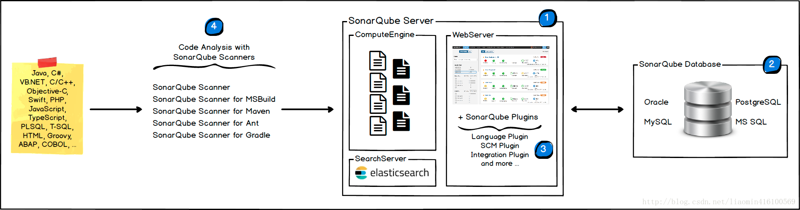

1. 包括 3 个主进程的 SonarQube 服务

- 给开发人员和运维人员查看质量报告和管理 SonarQube 实例的 web 服务(SonarQuber Server)
- 支持从 UI 搜索的基于 Elasticsearch 的搜索服务(Search Server)
- 负责处理代码分析和报告并将结果存入数据库的计算引擎服务(Compute Engine Server)

2. 用来保存下面的数据的一个 SonarQube 数据库

- SonarQube 实例的配置文件(安全配置，插件配置等)
- 项目的质量测试报告数据等

3. 多个安装在 server 的 SonarQube 插件，包括相关语言的插件，SCM 源代码管理插件，
   集成插件，认证和管理插件等。

4. 一个或者多个运行在构建和集成代码的服务器(Jenkins)上的 SonarScanner。

下图展示了 SonarQube 如何与其它软件集成的：

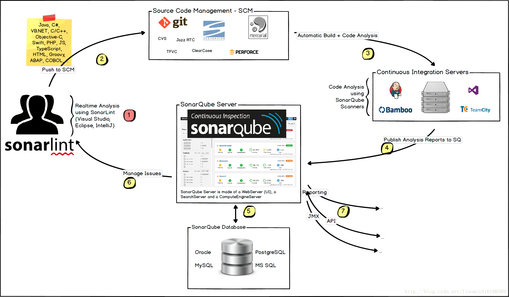

# 三. 部署 SonarQube

环境：

| 主机名           | IP              |
| :--------------- | :-------------- |
| SonarQube-server | 192.168.100.158 |
| Jenkins-server   | 192.168.100.48  |

[SonarQube 各版本下载](https://www.sonarqube.org/downloads/)

## 3.1 SonarQube 的基础环境依赖

### 3.1.1 数据库依赖

说明：https://docs.sonarqube.org/6.7/Requirements.html

SonarQube 6.7.X LTS 版本要求数据库要使用 MySQ 5.6 及以上版本，不支持 5.5 及
更早的版本。SonarQube 的 7.9.X 版本及后面的版本不在支持 MySQL 数据库。

个版本的环境需求说明：https://docs.sonarqube.org/latest/setup/upgrade-notes/

### 3.1.2 JAVA 环境依赖

SonarQube 6.7.X 版本需要使用 Oracle JRE8
SonarQube 7.9.X 需要使用 Oracle JRE11 或者 OpenJDK 11

### 3.2.3 系统资源限制和内核参数

硬件要求和系统要求参看： [Prerequisites and Overview](https://docs.sonarqube.org/latest/requirements/requirements/)

系统资源限制和内核参数更改：

```bash
~# vim /etc/sysctl.conf
...
vm.max_map_count=262144
fs.file-max=65536

~# sysctl -p

~# vim /etc/security/limits.conf
sonarqube  -  nofile  65536
sonarqube  -  nproc   4096
```

## 3.2 基于 MySQL 数据库的 SonarQube 部署

### 3.2.1 安装 MySQL

```bash
root@SonarQube-server:~# apt install mysql-server mysql-client -y

root@SonarQube-server:~# vim /etc/mysql/mysql.conf.d/mysqld.cnf

root@SonarQube-server:~# mysql
Welcome to the MySQL monitor.  Commands end with ; or \g.
Your MySQL connection id is 2
Server version: 5.7.29-0ubuntu0.18.04.1 (Ubuntu)

Copyright (c) 2000, 2020, Oracle and/or its affiliates. All rights reserved.

Oracle is a registered trademark of Oracle Corporation and/or its
affiliates. Other names may be trademarks of their respective
owners.

Type 'help;' or '\h' for help. Type '\c' to clear the current input statement.

mysql> ALTER USER USER() IDENTIFIED BY 'stevenux';  # 更改当前用户的密码
Query OK, 0 rows affected (0.01 sec)

mysql> FLUSH PRIVILEGES;
Query OK, 0 rows affected (0.00 sec)

# 创建数据库sonarqube
mysql> CREATE DATABASE sonarqube DEFAULT CHARACTER SET utf8 COLLATE utf8_general_ci;
Query OK, 1 row affected (0.00 sec)

# 授权sonarqube数据库的访问权限给sonarqube用户
mysql> GRANT ALL PRIVILEGES ON sonarqube.* TO 'sonarqube'@'%' IDENTIFIED BY 'stevenux';
Query OK, 0 rows affected, 1 warning (0.00 sec)

mysql> FLUSH PRIVILEGES;
Query OK, 0 rows affected (0.00 sec)
```

### 3.2.2 测试 sonar 账户连接 MySQL

```bash
root@SonarQube-server:~# mysql -usonarqube -pstevenux
mysql: [Warning] Using a password on the command line interface can be insecure.
Welcome to the MySQL monitor.  Commands end with ; or \g.
Your MySQL connection id is 3
Server version: 5.7.29-0ubuntu0.18.04.1 (Ubuntu)

Copyright (c) 2000, 2020, Oracle and/or its affiliates. All rights reserved.

Oracle is a registered trademark of Oracle Corporation and/or its
affiliates. Other names may be trademarks of their respective
owners.

Type 'help;' or '\h' for help. Type '\c' to clear the current input statement.

mysql> SHOW DATABASES;
+--------------------+
| Database           |
+--------------------+
| information_schema |
| sonarqube          |
+--------------------+
2 rows in set (0.00 sec)

mysql>
```

### 3.2.3 解压 sonarqube 并配置

SonarQube 依赖于 java 环境，而且 java 版本必须是 1.8 版本或更高，否则 sonarqube 会启动
失败 6.7.X 版本的 sonar 需要调用 elasticsearch，而且默认需要使用普通用户启动。

```bash
# 安装java环境
root@SonarQube-server:~# apt install openjdk-8-jre
root@SonarQube-server:~# java -version
openjdk version "1.8.0_242"
OpenJDK Runtime Environment (build 1.8.0_242-8u242-b08-0ubuntu3~18.04-b08)
OpenJDK 64-Bit Server VM (build 25.242-b08, mixed mode)

root@SonarQube-server:/usr/local/src# ls
sonarqube-6.7.7.zip

# 解压
root@SonarQube-server:/usr/local/src# unzip sonarqube-6.7.7.zip

root@SonarQube-server:/usr/local/src# ls
sonarqube-6.7.7  sonarqube-6.7.7.zip

# 创建软链接
root@SonarQube-server:/usr/local/src# ln -sv /usr/local/src/sonarqube-6.7.7  /usr/local/sonarqube
'/usr/local/sonarqube' -> '/usr/local/src/sonarqube-6.7.7'

# 创建sonarqube系统用户
root@SonarQube-server:/usr/local/src# useradd -s /bin/bash sonarqube

# 更改sonarqube程序目录属主为sonarqube
root@SonarQube-server:/usr/local/src# chown sonarqube.sonarqube /usr/local/sonarqube /usr/local/src/sonarqube-6.7.7 -R
root@SonarQube-server:/usr/local/src# ll /usr/local/sonarqube/
total 52
drwxr-xr-x 11 sonarqube sonarqube 4096 Apr 16  2019 ./
drwxr-xr-x  3 root      root      4096 Mar 14 15:50 ../
drwxr-xr-x  8 sonarqube sonarqube 4096 Apr 16  2019 bin/
drwxr-xr-x  2 sonarqube sonarqube 4096 Apr 16  2019 conf/
-rw-r--r--  1 sonarqube sonarqube 7651 Apr 16  2019 COPYING
drwxr-xr-x  2 sonarqube sonarqube 4096 Apr 16  2019 data/
drwxr-xr-x  7 sonarqube sonarqube 4096 Apr 16  2019 elasticsearch/
drwxr-xr-x  4 sonarqube sonarqube 4096 Apr 16  2019 extensions/
drwxr-xr-x  9 sonarqube sonarqube 4096 Apr 16  2019 lib/
drwxr-xr-x  2 sonarqube sonarqube 4096 Apr 16  2019 logs/
drwxr-xr-x  2 sonarqube sonarqube 4096 Apr 16  2019 temp/
drwxr-xr-x  9 sonarqube sonarqube 4096 Apr 16  2019 web/
```

切换到 sonarqube 用户，并配置 sonarqube

```bash
root@SonarQube-server:/usr/local/src# su - sonarqube
sonarqube@SonarQube-server:/$
sonarqube@SonarQube-server:/usr/local/sonarqube$ pwd
/usr/local/sonarqube
sonarqube@SonarQube-server:/usr/local/sonarqube$ vim conf/sonar.properties

# 修改配置文件
sonarqube@SonarQube-server:/usr/local/sonarqube$ grep "^[a-Z]" conf/sonar.properties
sonar.jdbc.username=sonarqube
sonar.jdbc.password=stevenux
sonar.jdbc.url=jdbc:mysql://127.0.0.1:3306/sonar?useUnicode=true&characterEncoding=utf8&rewriteBatchedStatements=true&useConfigs=maxPerformance&useSSL=false
sonar.web.host=0.0.0.0
sonar.web.port=9000
```

### 3.2.4 启动 sonarqube

启动:

```bash
sonarqube@SonarQube-server:/usr/local/sonarqube$ ls -l bin/
total 24
drwxr-xr-x 2 sonarqube sonarqube 4096 Apr 16  2019 jsw-license
drwxr-xr-x 3 sonarqube sonarqube 4096 Apr 16  2019 linux-x86-32
drwxr-xr-x 3 sonarqube sonarqube 4096 Apr 16  2019 linux-x86-64
drwxr-xr-x 3 sonarqube sonarqube 4096 Apr 16  2019 macosx-universal-64
drwxr-xr-x 3 sonarqube sonarqube 4096 Apr 16  2019 windows-x86-32
drwxr-xr-x 3 sonarqube sonarqube 4096 Apr 16  2019 windows-x86-64
sonarqube@SonarQube-server:/usr/local/sonarqube$ ./bin/linux-x86-64/
lib/      sonar.sh  wrapper

# 启动
sonarqube@SonarQube-server:/usr/local/sonarqube$ ./bin/linux-x86-64/sonar.sh start

```

查看日志:

```bash
sonarqube@SonarQube-server:/usr/local/sonarqube$ tail logs/sonar.log  -f
  Copyright 1999-2006 Tanuki Software, Inc.  All Rights Reserved.

2020.03.14 16:18:44 INFO  app[][o.s.a.AppFileSystem] Cleaning or creating temp directory /usr/local/src/sonarqube-6.7.7/temp
2020.03.14 16:18:44 INFO  app[][o.s.a.es.EsSettings] Elasticsearch listening on /127.0.0.1:9001
2020.03.14 16:18:44 INFO  app[][o.s.a.p.ProcessLauncherImpl] Launch process[[key='es', ipcIndex=1, logFilenamePrefix=es]] from [/usr/local/src/sonarqube-6.7.7/elasticsearch]: /usr/local/src/sonarqube-6.7.7/elasticsearch/bin/elasticsearch -Epath.conf=/usr/local/src/sonarqube-6.7.7/temp/conf/es
2020.03.14 16:18:44 INFO  app[][o.s.a.SchedulerImpl] Waiting for Elasticsearch to be up and running
2020.03.14 16:18:44 INFO  app[][o.e.p.PluginsService] no modules loaded
2020.03.14 16:18:44 INFO  app[][o.e.p.PluginsService] loaded plugin [org.elasticsearch.transport.Netty4Plugin]
2020.03.14 16:18:51 INFO  app[][o.s.a.SchedulerImpl] Process[es] is up
2020.03.14 16:18:51 INFO  app[][o.s.a.p.ProcessLauncherImpl] Launch process[[key='web', ipcIndex=2, logFilenamePrefix=web]] from [/usr/local/src/sonarqube-6.7.7]: /usr/lib/jvm/java-8-openjdk-amd64/jre/bin/java -Djava.awt.headless=true -Dfile.encoding=UTF-8 -Djava.io.tmpdir=/usr/local/src/sonarqube-6.7.7/temp -Xmx512m -Xms128m -XX:+HeapDumpOnOutOfMemoryError -cp ./lib/common/*:./lib/server/*:/usr/local/src/sonarqube-6.7.7/lib/jdbc/mysql/mysql-connector-java-5.1.42.jar org.sonar.server.app.WebServer /usr/local/src/sonarqube-6.7.7/temp/sq-process1169786833756842724properties
2020.03.14 16:19:17 INFO  app[][o.s.a.SchedulerImpl] Process[web] is up
2020.03.14 16:19:17 INFO  app[][o.s.a.p.ProcessLauncherImpl] Launch process[[key='ce', ipcIndex=3, logFilenamePrefix=ce]] from [/usr/local/src/sonarqube-6.7.7]: /usr/lib/jvm/java-8-openjdk-amd64/jre/bin/java -Djava.awt.headless=true -Dfile.encoding=UTF-8 -Djava.io.tmpdir=/usr/local/src/sonarqube-6.7.7/temp -Xmx512m -Xms128m -XX:+HeapDumpOnOutOfMemoryError -cp ./lib/common/*:./lib/server/*:./lib/ce/*:/usr/local/src/sonarqube-6.7.7/lib/jdbc/mysql/mysql-connector-java-5.1.42.jar org.sonar.ce.app.CeServer /usr/local/src/sonarqube-6.7.7/temp/sq-process7425717315782443832properties
2020.03.14 16:19:24 INFO  app[][o.s.a.SchedulerImpl] Process[ce] is up # 启动成功
2020.03.14 16:19:24 INFO  app[][o.s.a.SchedulerImpl] SonarQube is up  # 启动成功
```

查看 mysql 的 sonarqube 数据库是否生成表：

```bash
root@SonarQube-server:~# mysql -usonarqube -pstevenux -h127.0.0.1
...
mysql> show databases;
+--------------------+
| Database           |
+--------------------+
| information_schema |
| sonarqube          |
+--------------------+
2 rows in set (0.01 sec)

mysql> use sonarqube;
Reading table information for completion of table and column names
You can turn off this feature to get a quicker startup with -A

Database changed
mysql> show tables;
+--------------------------+
| Tables_in_sonarqube      |
+--------------------------+
| active_rule_parameters   |
| active_rules             |
| analysis_properties      |
| ce_activity              |
| ce_queue                 |
| ce_scanner_context       |
......
```

### 3.2.5 登录 WEB 界面

点击有上角 login 登录，默认用户名密码都是 admin

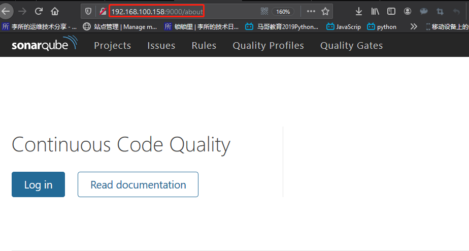

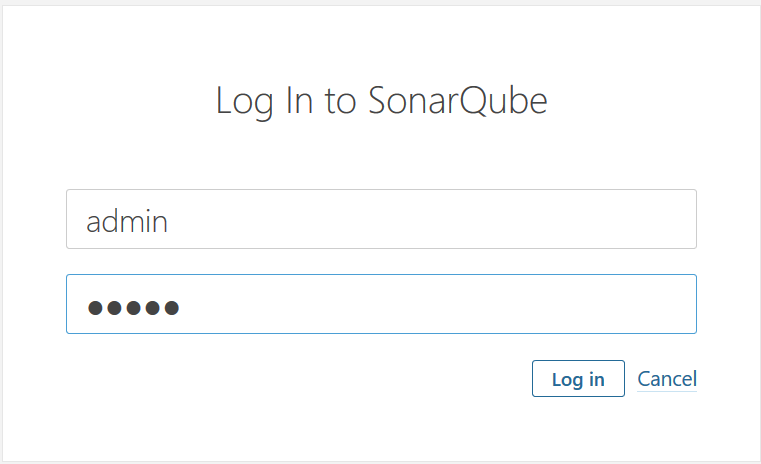

登录后界面：

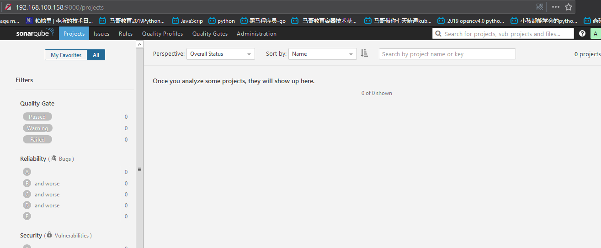

### 3.2.6 安装插件

查看本地已经安装的插件

```bash
sonarqube@SonarQube-server:/usr/local/sonarqube$ ls -l  /usr/local/sonarqube/extensions/plugins/
total 40468
-rw-r--r-- 1 sonarqube sonarqube      92 Apr 16  2019 README.txt
-rw-r--r-- 1 sonarqube sonarqube 2703958 Apr 15  2019 sonar-csharp-plugin-6.5.0.3766.jar
-rw-r--r-- 1 sonarqube sonarqube 1618672 Apr 15  2019 sonar-flex-plugin-2.3.jar
-rw-r--r-- 1 sonarqube sonarqube 6759535 Apr 15  2019 sonar-java-plugin-4.15.0.12310.jar
-rw-r--r-- 1 sonarqube sonarqube 3355702 Apr 15  2019 sonar-javascript-plugin-3.2.0.5506.jar
-rw-r--r-- 1 sonarqube sonarqube 3022870 Apr 15  2019 sonar-php-plugin-2.11.0.2485.jar
-rw-r--r-- 1 sonarqube sonarqube 4024311 Apr 15  2019 sonar-python-plugin-1.8.0.1496.jar
-rw-r--r-- 1 sonarqube sonarqube 3625962 Apr 15  2019 sonar-scm-git-plugin-1.3.0.869.jar
-rw-r--r-- 1 sonarqube sonarqube 6680471 Apr 15  2019 sonar-scm-svn-plugin-1.6.0.860.jar
-rw-r--r-- 1 sonarqube sonarqube 2250667 Apr 15  2019 sonar-typescript-plugin-1.1.0.1079.jar
-rw-r--r-- 1 sonarqube sonarqube 7368250 Apr 15  2019 sonar-xml-plugin-1.4.3.1027.jar
```

#### 3.2.6.1 安装中文语言插件

WEB 搜素安装：
`administration --> Marketplace`，搜索框搜索关键词 `chinese`，然后点 install 安装

直接将 jar 包放到插件目录：
将 jar 包下载到`/usr/local/sonarqube/extensions/plugins/`文件夹内：

```bash
sonarqube@SonarQube-server:/usr/local/sonarqube/extensions/plugins$ wget https://github.com/SonarQubeCommunity/sonar-l10n-zh/releases/download/sonar-l10n-zh-plugin-1.11/sonar-l10n-zh-plugin-1.11.jar
```

**重启 SonarQube**：Web 界面安装完成插件后或者在插件目录下载插件后需要重启
sonarquebe 服务生效

```bash
sonarqube@SonarQube-server:/$ /usr/local/sonarqube/bin/linux-x86-64/sonar.sh  restart
Stopping SonarQube...
Waiting for SonarQube to exit...
Stopped SonarQube.
Starting SonarQube...
Started SonarQube.
```

WEB 界面也可以重启：

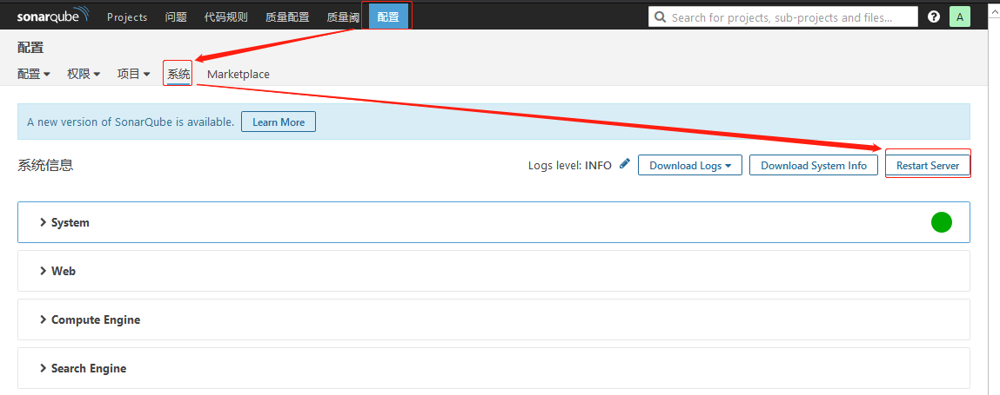

#### 3.2.6.2 安装开发语言插件

Sonarquebe 对代码的扫描都基于插件实现，因此要安装要扫描的开发语言插件：
如：PHP、Python、JAVA 等语言的插件

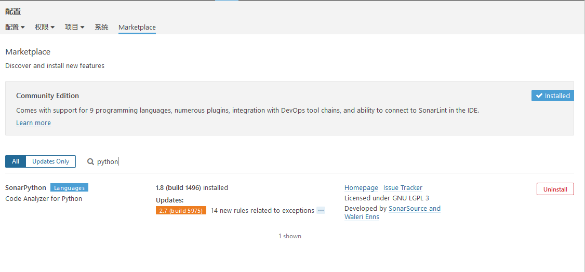

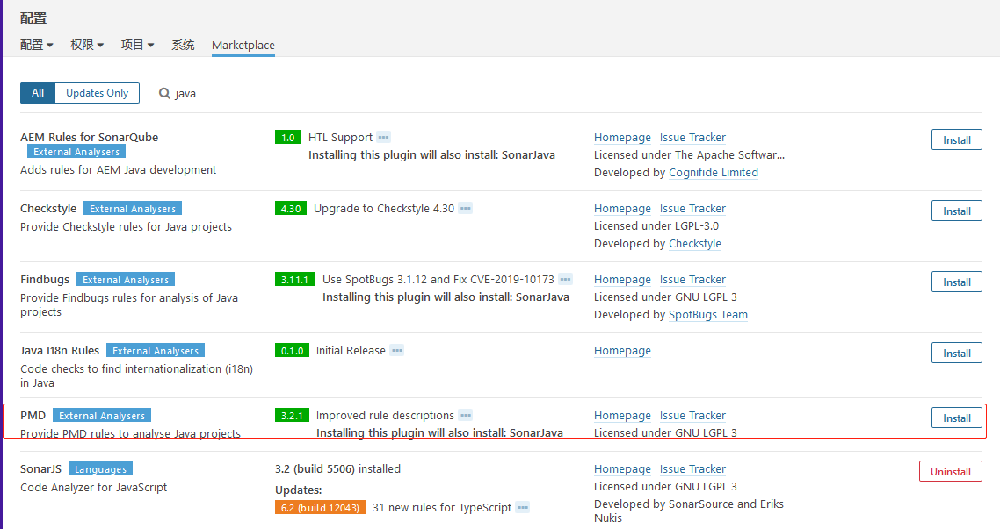

## 3.3 基于 PostgreSQL 数据库的 SonarQube 部署

### 3.3.1 安装 JDK11

```bash
root@SonarQube-server:~# apt-cache madison openjdk-11-jdk
openjdk-11-jdk | 11.0.6+10-1ubuntu1~18.04.1 | http://mirrors.aliyun.com/ubuntu bionic-security/main amd64 Packages
openjdk-11-jdk | 11.0.6+10-1ubuntu1~18.04.1 | http://mirrors.aliyun.com/ubuntu bionic-updates/main amd64 Packages
openjdk-11-jdk | 11.0.6+10-1ubuntu1~18.04.1 | https://mirrors.tuna.tsinghua.edu.cn/ubuntu bionic-updates/main amd64 Packages
openjdk-11-jdk | 11.0.6+10-1ubuntu1~18.04.1 | https://mirrors.tuna.tsinghua.edu.cn/ubuntu bionic-security/main amd64 Packages
openjdk-11-jdk | 10.0.1+10-3ubuntu1 | http://mirrors.aliyun.com/ubuntu bionic/main amd64 Packages
openjdk-11-jdk | 10.0.1+10-3ubuntu1 | https://mirrors.tuna.tsinghua.edu.cn/ubuntu bionic/main amd64 Packages
openjdk-lts | 10.0.1+10-3ubuntu1 | http://mirrors.aliyun.com/ubuntu bionic/main Sources
openjdk-lts | 11.0.6+10-1ubuntu1~18.04.1 | http://mirrors.aliyun.com/ubuntu bionic-security/main Sources
openjdk-lts | 11.0.6+10-1ubuntu1~18.04.1 | http://mirrors.aliyun.com/ubuntu bionic-updates/main Sources

root@SonarQube-server:~# apt install -y openjdk-11-jdk

root@SonarQube-server:~# java -version
openjdk version "11.0.6" 2020-01-14
OpenJDK Runtime Environment (build 11.0.6+10-post-Ubuntu-1ubuntu118.04.1)
OpenJDK 64-Bit Server VM (build 11.0.6+10-post-Ubuntu-1ubuntu118.04.1, mixed mode, sharing)
```

### 3.3.2 部署 PostgreSQL

#### 3.3.2.1 安装 postgreSQL

```bash
root@SonarQube-server:~# apt-cache  madison postgresql
postgresql | 10+190ubuntu0.1 | http://mirrors.aliyun.com/ubuntu bionic-security/main amd64 Packages
postgresql | 10+190ubuntu0.1 | http://mirrors.aliyun.com/ubuntu bionic-security/main i386 Packages
postgresql | 10+190ubuntu0.1 | http://mirrors.aliyun.com/ubuntu bionic-updates/main amd64 Packages
postgresql | 10+190ubuntu0.1 | http://mirrors.aliyun.com/ubuntu bionic-updates/main i386 Packages
postgresql | 10+190ubuntu0.1 | https://mirrors.tuna.tsinghua.edu.cn/ubuntu bionic-updates/main amd64 Packages
postgresql | 10+190ubuntu0.1 | https://mirrors.tuna.tsinghua.edu.cn/ubuntu bionic-updates/main i386 Packages
postgresql | 10+190ubuntu0.1 | https://mirrors.tuna.tsinghua.edu.cn/ubuntu bionic-security/main amd64 Packages
postgresql | 10+190ubuntu0.1 | https://mirrors.tuna.tsinghua.edu.cn/ubuntu bionic-security/main i386 Packages
postgresql |     10+190 | http://mirrors.aliyun.com/ubuntu bionic/main amd64 Packages
postgresql |     10+190 | http://mirrors.aliyun.com/ubuntu bionic/main i386 Packages
postgresql |     10+190 | https://mirrors.tuna.tsinghua.edu.cn/ubuntu bionic/main amd64 Packages
postgresql |     10+190 | https://mirrors.tuna.tsinghua.edu.cn/ubuntu bionic/main i386 Packages
postgresql-common |        190 | http://mirrors.aliyun.com/ubuntu bionic/main Sources
postgresql-common | 190ubuntu0.1 | http://mirrors.aliyun.com/ubuntu bionic-security/main Sources
postgresql-common | 190ubuntu0.1 | http://mirrors.aliyun.com/ubuntu bionic-updates/main Sources

root@SonarQube-server:~# apt install -y postgresql
```

#### 3.3.2.2 配置 postgreSQL

切换到 postgres 用户配置，PostgresSQL 安装后会自动创建 postgres 用户且没有密码

```bash
root@SonarQube-server:~# su - postgres
postgres@SonarQube-server:~$ psql -U postgres # 登录postgresql数据库
psql (10.12 (Ubuntu 10.12-0ubuntu0.18.04.1))
Type "help" for help.

# 创建数据库sonarqube
postgres=# CREATE DATABASE sonarqube;
CREATE DATABASE

# 创建用户sonarqube
postgres=# CREATE USER sonarqube WITH ENCRYPTED PASSWORD 'stevenux';
CREATE ROLE

# 授权
postgres=# GRANT ALL PRIVILEGES ON DATABASE sonarqube TO sonarqube;
GRANT

# 更改数据库属主
postgres=# ALTER DATABASE sonarqube OWNER TO sonarqube;
ALTER DATABASE
postgres=# \q

# 修改配置文件
postgres@SonarQube-server:~$ vim /etc/postgresql/10/main/postgresql.conf
...
 57 # - Connection Settings -
 58
 59 listen_addresses = '*'          #  监听地址，可以使用逗号分隔写多个
 ...

# 开启远程访问
postgres@SonarQube-server:~$ vim /etc/postgresql/10/main/pg_hba.conf
# Database administrative login by Unix domain socket
 85 local   all             postgres                                peer
 86
 87 # TYPE  DATABASE        USER            ADDRESS                 METHOD
 88
 89 # "local" is for Unix domain socket connections only
 90 local   all             all                                     peer
 91 # IPv4 local connections:
 92 #host    all             all             127.0.0.1/32            md5

 # 修改为监听任何IP地址
 93 host    all             all             0.0.0.0/0               md5
 94 # IPv6 local connections:
 95 host    all             all             ::1/128                 md5
 96 # Allow replication connections from localhost, by a user with the
 97 # replication privilege.
 98 local   replication     all                                     peer
 99 host    replication     all             127.0.0.1/32            md5
100 host    replication     all             ::1/128                 md5


# 重启postgreSQL
postgres@SonarQube-server:~$ systemctl restart  postgresql
postgres@SonarQube-server:~$ exit
logout
```

### 3.3.3 部署 SonarQube 7.9.X

```bash
root@SonarQube-server:/usr/local/src# pwd
/usr/local/src
root@SonarQube-server:/usr/local/src# unzip sonarqube-7.9.2.zip
root@SonarQube-server:/usr/local/src# ls
sonarqube-7.9.2  sonarqube-7.9.2.zip

root@SonarQube-server:/usr/local/src# ln -sv /usr/local/src/sonarqube-7.9.2 /usr/local/sonarqube
'/usr/local/sonarqube' -> '/usr/local/src/sonarqube-7.9.2'

root@SonarQube-server:/usr/local/src# useradd -r -m -s /bin/bash sonarqube

root@SonarQube-server:/usr/local/src# chown sonarqube.sonarqube /usr/local/sonarqube -R
root@SonarQube-server:/usr/local/src# chown sonarqube.sonarqube /usr/local/src/sonarqube-7.9.2 -R

root@SonarQube-server:/usr/local/src# su - sonarqube
sonarqube@SonarQube-server:~$ pwd
/home/sonarqube
sonarqube@SonarQube-server:~$ cd /usr/local/sonarqube
sonarqube@SonarQube-server:/usr/local/sonarqube$ vim conf/sonar.properties
......
sonar.jdbc.username=sonarqube
sonar.jdbc.password=stevenux
sonar.jdbc.url=jdbc:postgresql://192.168.100.158/sonarqube
......
```

### 3.3.4 验证

查看启动日志：

```bash
sonarqube@SonarQube-server:/usr/local/sonarqube$ tail logs/sonar.log -f
Wrapper (Version 3.2.3) http://wrapper.tanukisoftware.org
  Copyright 1999-2006 Tanuki Software, Inc.  All Rights Reserved.

2020.03.14 17:13:05 INFO  app[][o.s.a.AppFileSystem] Cleaning or creating temp directory /usr/local/src/sonarqube-7.9.2/temp
2020.03.14 17:13:05 INFO  app[][o.s.a.es.EsSettings] Elasticsearch listening on /127.0.0.1:9001
2020.03.14 17:13:05 INFO  app[][o.s.a.ProcessLauncherImpl] Launch process[[key='es', ipcIndex=1, logFilenamePrefix=es]] from [/usr/local/src/sonarqube-7.9.2/elasticsearch]: /usr/local/src/sonarqube-7.9.2/elasticsearch/bin/elasticsearch
2020.03.14 17:13:05 INFO  app[][o.s.a.SchedulerImpl] Waiting for Elasticsearch to be up and running
OpenJDK 64-Bit Server VM warning: Option UseConcMarkSweepGC was deprecated in version 9.0 and will likely be removed in a future release.
2020.03.14 17:13:06 INFO  app[][o.e.p.PluginsService] no modules loaded
2020.03.14 17:13:06 INFO  app[][o.e.p.PluginsService] loaded plugin [org.elasticsearch.transport.Netty4Plugin]
2020.03.14 17:13:16 INFO  app[][o.s.a.SchedulerImpl] Process[es] is up
2020.03.14 17:13:16 INFO  app[][o.s.a.ProcessLauncherImpl] Launch process[[key='web', ipcIndex=2, logFilenamePrefix=web]] from [/usr/local/src/sonarqube-7.9.2]: /usr/lib/jvm/java-11-openjdk-amd64/bin/java -Djava.awt.headless=true -Dfile.encoding=UTF-8 -Djava.io.tmpdir=/usr/local/src/sonarqube-7.9.2/temp --add-opens=java.base/java.util=ALL-UNNAMED --add-opens=java.base/java.lang=ALL-UNNAMED --add-opens=java.base/java.io=ALL-UNNAMED --add-opens=java.rmi/sun.rmi.transport=ALL-UNNAMED -Xmx512m -Xms128m -XX:+HeapDumpOnOutOfMemoryError -Dhttp.nonProxyHosts=localhost|127.*|[::1] -cp ./lib/common/*:/usr/local/src/sonarqube-7.9.2/lib/jdbc/postgresql/postgresql-42.2.5.jar org.sonar.server.app.WebServer /usr/local/src/sonarqube-7.9.2/temp/sq-process18187073767635291713properties
2020.03.14 17:13:50 INFO  app[][o.s.a.SchedulerImpl] Process[web] is up
2020.03.14 17:13:50 INFO  app[][o.s.a.ProcessLauncherImpl] Launch process[[key='ce', ipcIndex=3, logFilenamePrefix=ce]] from [/usr/local/src/sonarqube-7.9.2]: /usr/lib/jvm/java-11-openjdk-amd64/bin/java -Djava.awt.headless=true -Dfile.encoding=UTF-8 -Djava.io.tmpdir=/usr/local/src/sonarqube-7.9.2/temp --add-opens=java.base/java.util=ALL-UNNAMED -Xmx512m -Xms128m -XX:+HeapDumpOnOutOfMemoryError -Dhttp.nonProxyHosts=localhost|127.*|[::1] -cp ./lib/common/*:/usr/local/src/sonarqube-7.9.2/lib/jdbc/postgresql/postgresql-42.2.5.jar org.sonar.ce.app.CeServer /usr/local/src/sonarqube-7.9.2/temp/sq-process10509567275216136050properties
2020.03.14 17:13:59 INFO  app[][o.s.a.SchedulerImpl] Process[ce] is up # 启动成功
2020.03.14 17:13:59 INFO  app[][o.s.a.SchedulerImpl] SonarQube is up # 启动成功
```

查看进程：

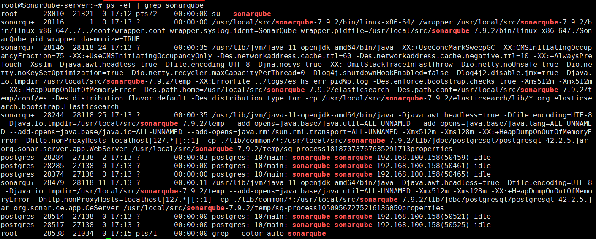

### 3.3.5 访问 WEB

登录账户名和密码默认都是 admin

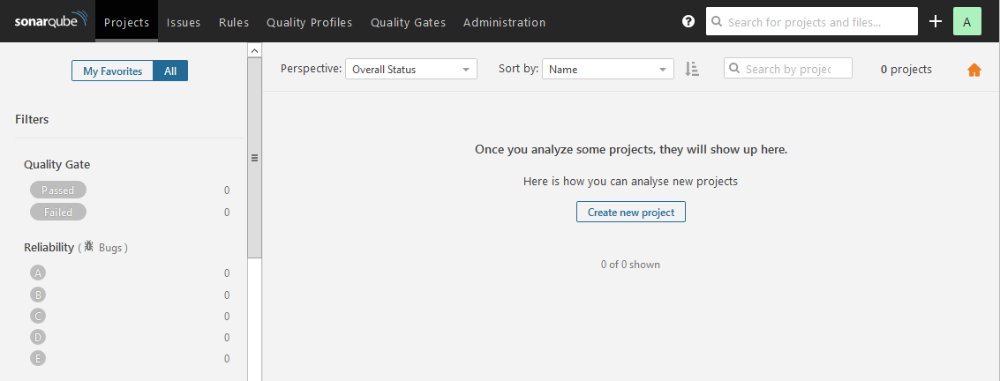

### 3.3.6 安装中文插件

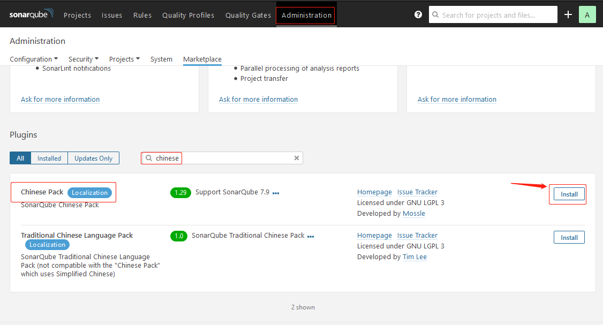

# 四. Jenkins 服务器部署 SonarScanner

SonarScasnner 下载地址和文档：
下载地址：https://binaries.sonarsource.com/Distribution/sonar-scanner-cli/
官方文档：https://docs.sonarqube.org/latest/analysis/scan/sonarscanner/

## 4.1 部署 SonarScanner

sonarqube 通过调用扫描器 SonarScanner 进行代码质量分析，即扫描器的具体工作就
是扫描代码。

```bash
root@Jenkins-server:/usr/local/src# pwd
/usr/local/src

root@Jenkins-server:/usr/local/src# unzip sonar-scanner-cli-4.0.0.1744-linux.zip

root@Jenkins-server:/usr/local/src# ls
sonarqube-7.9.2      sonar-scanner-4.0.0.1744-linux
sonarqube-7.9.2.zip  sonar-scanner-cli-4.0.0.1744-linux.zip

root@Jenkins-server:/usr/local/src# ln -sv /usr/local/src/sonar-scanner-4.0.0.1744-linux /usr/local/sonar-scanner
'/usr/local/sonar-scanner' -> '/usr/local/src/sonar-scanner-4.0.0.1744-linux'

root@Jenkins-server:/usr/local/src# cd /usr/local/sonar-scanner
root@Jenkins-server:/usr/local/sonar-scanner# vim conf/sonar-scanner.properties
...
#----- Default SonarQube server
sonar.host.url=http://192.168.100.158:9000   # SonarQube服务器IP和端口

#----- Default source code encoding
sonar.sourceEncoding=UTF-8
```

## 4.2 扫描官方示例代码

### 4.2.1 准备示例代码

[示例工程代码下载](https://github.com/SonarSource/sonar-scanning-examples/archive/master.zip)

```bash
root@Jenkins-server:/usr/local/src# unzip sonar-scanning-examples-master.zip

root@Jenkins-server:/usr/local/src# ll sonar-scanning-examples-master/sonarqube-scanner/
total 24
drwxr-xr-x  5 root root 4096 Oct 16 00:12 ./
drwxr-xr-x 11 root root 4096 Oct 16 00:12 ../
drwxr-xr-x  2 root root 4096 Oct 16 00:12 copybooks/
drwxr-xr-x  2 root root 4096 Oct 16 00:12 coverage-report/

# 默认的配置文件，用于指明
-rw-r--r--  1 root root  647 Oct 16 00:12 sonar-project.properties

# 源码文件所在目录
drwxr-xr-x 20 root root 4096 Oct 16 00:12 src/

```

### 4.2.2 在源代码同级目录扫描

手动在当前项目代码目录执行扫描，以下是扫描过程的提示信息，扫描的配置文件
sonar-project.propertie 每个项目的根目录都要有该配置文件。

```bash

root@Jenkins-server:/usr/local/src/sonar-scanning-examples-master/sonarqube-scanner# pwd
/usr/local/src/sonar-scanning-examples-master/sonarqube-scanner

# 在当前目录执行扫描
root@Jenkins-server:/usr/local/src/sonar-scanning-examples-master/sonarqube-scanner# /usr/local/sonar-scanner/bin/sonar-scanner
...
...
INFO: 7 files had no CPD blocks
INFO: Calculating CPD for 8 files
INFO: CPD calculation finished
INFO: Analysis report generated in 80ms, dir size=145 KB
INFO: Analysis report compressed in 33ms, zip size=48 KB
INFO: Analysis report uploaded in 358ms
INFO: ANALYSIS SUCCESSFUL, you can browse http://192.168.100.158:9000/dashboard?id=org.sonarqube%3Asonarqube-scanner
INFO: Note that you will be able to access the updated dashboard once the server has processed the submitted analysis report
INFO: More about the report processing at http://192.168.100.158:9000/api/ce/task?id=AXDYeGVaymInxHwGB5Zi
INFO: Analysis total time: 9.053 s  # 总分析时间
INFO: ------------------------------------------------------------------------
INFO: EXECUTION SUCCESS  # 执行成功
INFO: ------------------------------------------------------------------------
INFO: Total time: 14.543s
INFO: Final Memory: 7M/27M
INFO: ------------------------------------------------------------------------
```

### 4.2.3 在 WEB 界面查看报告

sonarquebe WEB 界面验证扫描结果

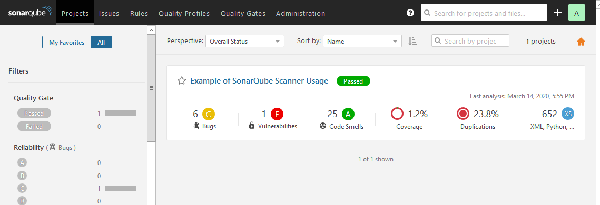

代码重复分析报告：
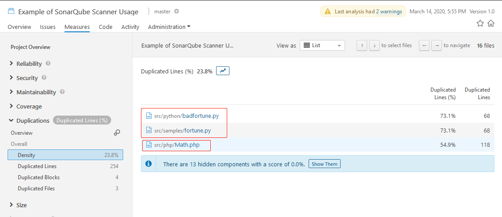

代码可靠性：
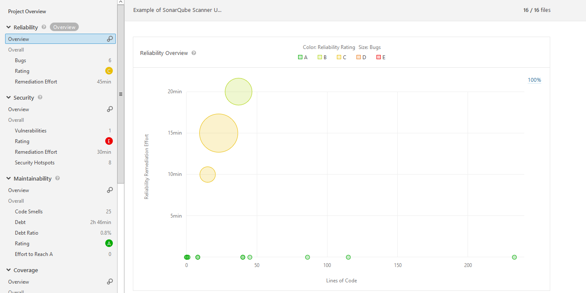

代码可维护性：
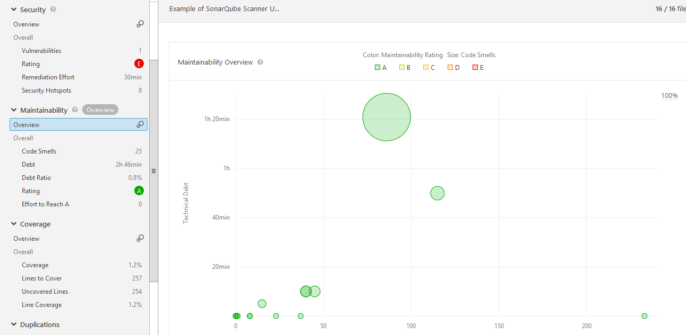

# 五. Jenkins 结合 SonarScanner 执行代码扫描

## 5.1 在 Jenkins 安装 SonarQubeScanner 插件

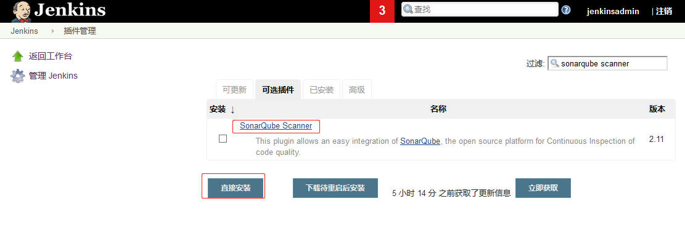

## 5.2 添加 SonarQube URL

Jenkins --> 系统管理 --> 系统设置 --> SonarQube servers

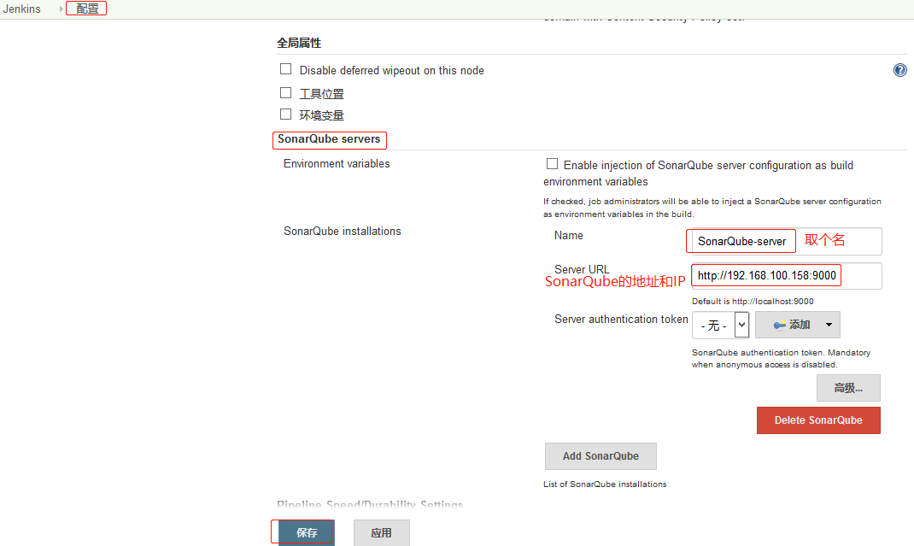

## 5.3 Jenkins 添加 SonarScanner 扫描器

Jenkins --> 系统管理 --> 全局工具配置

### 5.3.1 手动指定已安装的 sonarqube scanner

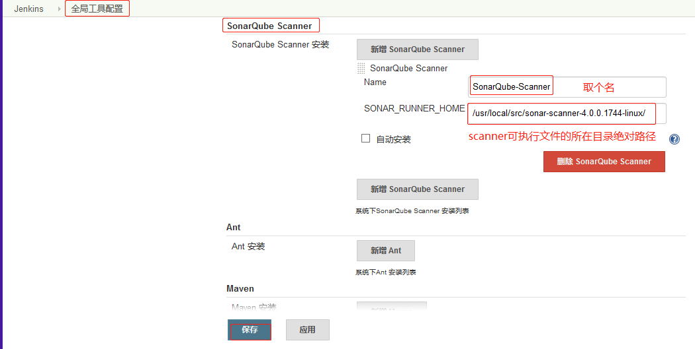

### 5.3.2 让 Jenkins 自动安装

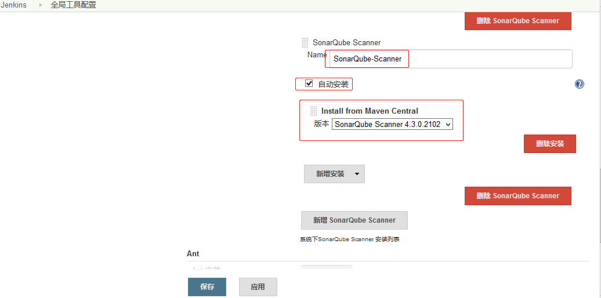

## 5.4 具体配置过程

选择 Jenkins 的任务项目进行配置:

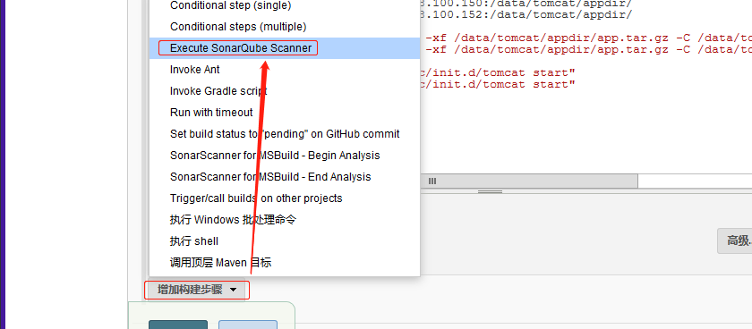

将构建栏目下的 Analysis properties 内容修改为：

```bash
sonar.projectKey=tomcat-demo-scan    # 自定义名称
sonar.projectName=tomcat-demo-scan
sonar.projectVersion=1.0
sonar.sources=./
sonar.language=java
sonar.sourceEncoding=UTF-8
```

内容修改成如下格式填写完成后点保存

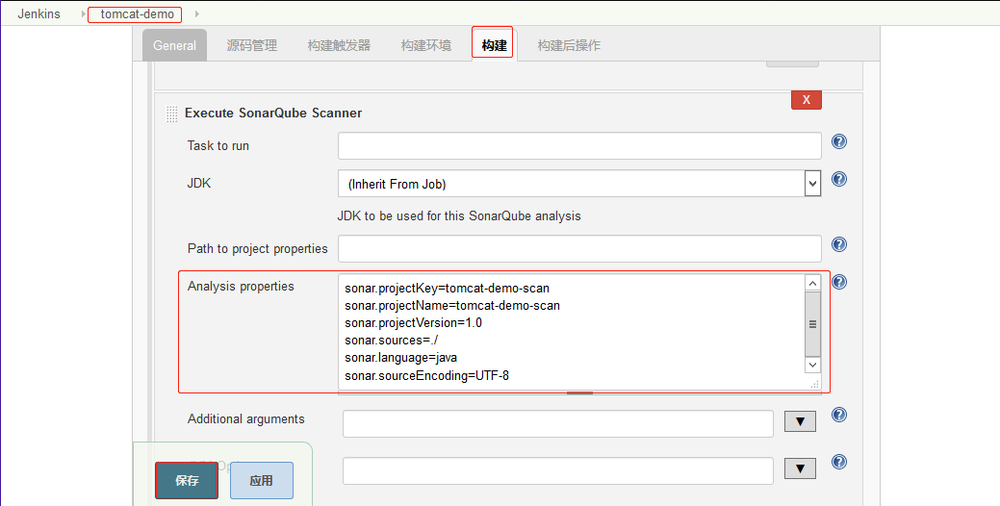

## 5.5 构建项目并查看 SonarScanner 是否运行

点击项目的立即构建，下图是执行成功的信息:
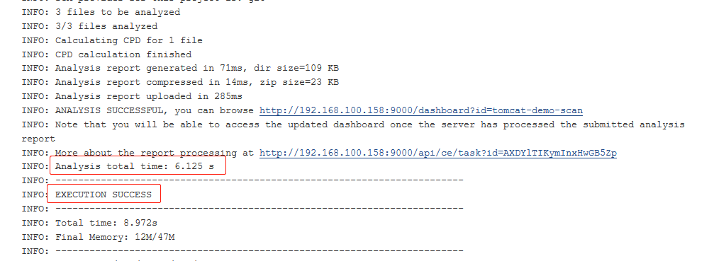

控制台输出：

```bash
Started by user jenkinsadmin
Running as SYSTEM
Building on master in workspace /var/lib/jenkins/workspace/tomcat-demo
using credential 4bdb7583-344e-4b23-a037-52180ef6b2cc
 > git rev-parse --is-inside-work-tree # timeout=10
Fetching changes from the remote Git repository
 > git config remote.origin.url git@192.168.100.146:root/tomcat-demo.git # timeout=10
Fetching upstream changes from git@192.168.100.146:root/tomcat-demo.git
 > git --version # timeout=10
using GIT_SSH to set credentials Private key of root.
 > git fetch --tags --progress -- git@192.168.100.146:root/tomcat-demo.git +refs/heads/*:refs/remotes/origin/* # timeout=10
 > git rev-parse refs/remotes/origin/master^{commit} # timeout=10
 > git rev-parse refs/remotes/origin/origin/master^{commit} # timeout=10
Checking out Revision 6ae6f75d1ce250efeae82c04323e3591430bcdef (refs/remotes/origin/master)
 > git config core.sparsecheckout # timeout=10
 > git checkout -f 6ae6f75d1ce250efeae82c04323e3591430bcdef # timeout=10
Commit message: "Update index.jsp master"
 > git rev-list --no-walk 6ae6f75d1ce250efeae82c04323e3591430bcdef # timeout=10
[tomcat-demo] $ /usr/local/src/sonar-scanner-4.0.0.1744-linux/bin/sonar-scanner -Dsonar.host.url=http://192.168.100.158:9000 -Dsonar.language=java -Dsonar.projectName=tomcat-demo-scan -Dsonar.projectVersion=1.0 -Dsonar.sourceEncoding=UTF-8 -Dsonar.projectKey=tomcat-demo-scan -Dsonar.sources=./ -Dsonar.projectBaseDir=/var/lib/jenkins/workspace/tomcat-demo
INFO: Scanner configuration file: /usr/local/src/sonar-scanner-4.0.0.1744-linux/conf/sonar-scanner.properties
INFO: Project root configuration file: NONE
INFO: SonarQube Scanner 4.0.0.1744
INFO: Java 11.0.3 AdoptOpenJDK (64-bit)
INFO: Linux 4.15.0-55-generic amd64
INFO: User cache: /var/lib/jenkins/.sonar/cache
INFO: SonarQube server 7.9.2
INFO: Default locale: "en_US", source code encoding: "UTF-8"
INFO: Load global settings
INFO: Load global settings (done) | time=77ms
INFO: Server id: D72AF6F9-AXDYUdGLymInxHwGB3RI
INFO: User cache: /var/lib/jenkins/.sonar/cache
INFO: Load/download plugins
INFO: Load plugins index
INFO: Load plugins index (done) | time=45ms
INFO: Load/download plugins (done) | time=1402ms
INFO: Process project properties
INFO: Execute project builders
INFO: Execute project builders (done) | time=5ms
INFO: Project key: tomcat-demo-scan
INFO: Base dir: /var/lib/jenkins/workspace/tomcat-demo
INFO: Working dir: /var/lib/jenkins/workspace/tomcat-demo/.scannerwork
INFO: Load project settings for component key: 'tomcat-demo-scan'
INFO: Load quality profiles
INFO: Load quality profiles (done) | time=87ms
INFO: Detected Jenkins
INFO: Load active rules
INFO: Load active rules (done) | time=1080ms
INFO: Indexing files...
INFO: Project configuration:
INFO: Load project repositories
INFO: Load project repositories (done) | time=14ms
INFO: 17 files indexed
INFO: 0 files ignored because of scm ignore settings
INFO: Quality profile for css: Sonar way
INFO: Quality profile for jsp: Sonar way
INFO: Quality profile for xml: Sonar way
INFO: ------------- Run sensors on module tomcat-demo-scan
INFO: Load metrics repository

INFO: Load metrics repository (done) | time=46ms
WARNING: An illegal reflective access operation has occurred
WARNING: Illegal reflective access by net.sf.cglib.core.ReflectUtils$1 (file:/var/lib/jenkins/.sonar/cache/866bb1adbf016ea515620f1aaa15ec53/sonar-javascript-plugin.jar) to method java.lang.ClassLoader.defineClass(java.lang.String,byte[],int,int,java.security.ProtectionDomain)
WARNING: Please consider reporting this to the maintainers of net.sf.cglib.core.ReflectUtils$1
WARNING: Use --illegal-access=warn to enable warnings of further illegal reflective access operations
WARNING: All illegal access operations will be denied in a future release

INFO: Sensor SonarCSS Metrics [cssfamily]
INFO: Sensor SonarCSS Metrics [cssfamily] (done) | time=127ms
INFO: Sensor SonarCSS Rules [cssfamily]
INFO: Sensor SonarCSS Rules [cssfamily] (done) | time=829ms
INFO: Sensor JaCoCo XML Report Importer [jacoco]
INFO: Sensor JaCoCo XML Report Importer [jacoco] (done) | time=3ms
INFO: Sensor JavaXmlSensor [java]
INFO: 1 source files to be analyzed
INFO: 1/1 source files have been analyzed
INFO: Sensor JavaXmlSensor [java] (done) | time=114ms
INFO: Sensor HTML [web]
INFO: Sensor HTML [web] (done) | time=129ms
INFO: Sensor XML Sensor [xml]
INFO: 1 source files to be analyzed
INFO: 1/1 source files have been analyzed
INFO: Sensor XML Sensor [xml] (done) | time=125ms
INFO: ------------- Run sensors on project
INFO: Sensor Zero Coverage Sensor
INFO: Sensor Zero Coverage Sensor (done) | time=1ms
INFO: SCM provider for this project is: git
INFO: 3 files to be analyzed
INFO: 3/3 files analyzed
INFO: Calculating CPD for 1 file
INFO: CPD calculation finished
INFO: Analysis report generated in 71ms, dir size=109 KB
INFO: Analysis report compressed in 14ms, zip size=23 KB
INFO: Analysis report uploaded in 285ms
INFO: ANALYSIS SUCCESSFUL, you can browse http://192.168.100.158:9000/dashboard?id=tomcat-demo-scan
INFO: Note that you will be able to access the updated dashboard once the server has processed the submitted analysis report
INFO: More about the report processing at http://192.168.100.158:9000/api/ce/task?id=AXDYlTIKymInxHwGB5Zp
INFO: Analysis total time: 6.125 s
INFO: ------------------------------------------------------------------------
INFO: EXECUTION SUCCESS
INFO: ------------------------------------------------------------------------
INFO: Total time: 8.972s
INFO: Final Memory: 12M/47M
INFO: ------------------------------------------------------------------------
[tomcat-demo] $ /bin/bash /tmp/jenkins642655740185547958.sh
./asf-logo-wide.svg
./bg-button.png
./bg-middle.png
./bg-nav-item.png
./bg-nav.png
./bg-upper.png
./favicon.ico
./index.jsp
./README.md
./RELEASE-NOTES.txt
./tomcat.css
./tomcat.gif
./tomcat.png
./tomcat-power.gif
./tomcat.svg
./WEB-INF/
./WEB-INF/web.xml

Tomcat is running, now stop...

Tomcat stop done.

Tomcat is running, now stop...

Tomcat stop done.

Tomcat is dead. Now start Tomcat...

Done. Tomcat now is running. PID=45107
Tomcat is dead. Now start Tomcat...

Done. Tomcat now is running. PID=20496
Triggering a new build of tomcat-demo-hook
Finished: SUCCESS
```

## 5.6 查看结果

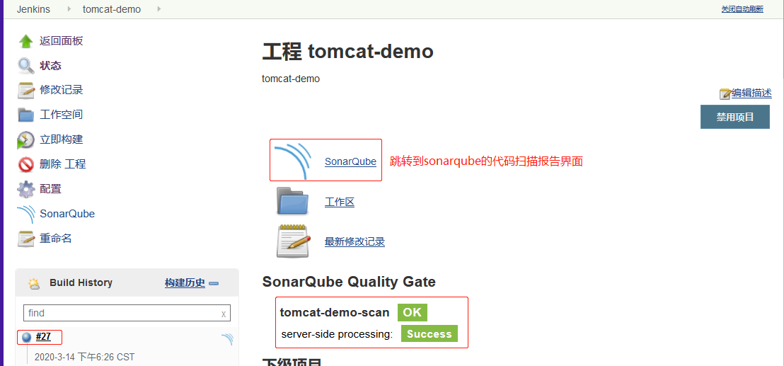

由于该测试项目使用的是 tomcat 的默认首页 app，代码没有问题：

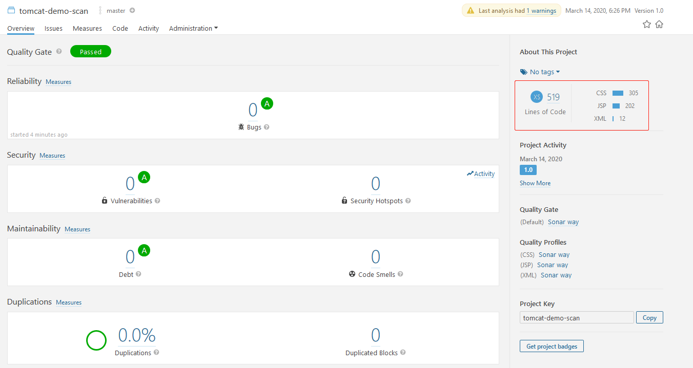

# Reference

> [代码质量管控的四个阶段--张鑫](https://zhuanlan.zhihu.com/p/29086959)
