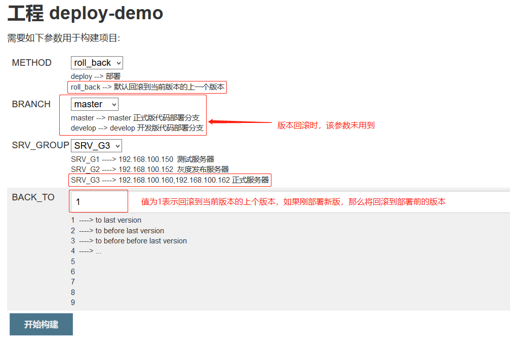

使用 Jenkins 和 Gitlab 结合自定义 shell 脚本将代码自动部署到后端，
并实现代码回滚到上一个版本。

环境：

| 主机名              | IP              |
| :------------------ | :-------------- |
| gitlab-server       | 192.168.100.146 |
| Jenkins-server      | 192.168.100.148 |
| tomcat-server-node1 | 192.168.100.150 |
| tomcat-server-node2 | 192.168.100.152 |
| tomcat-server-node3 | 192.168.100.160 |
| tomcat-server-node4 | 192.168.100.162 |
| HAProxy-node1       | 192.168.100.154 |
| HAProxy-node2       | 192.168.100.156 |
| SonarQube-server    | 192.168.100.158 |

# 一. Jenkins 和 Gitlab 项目配置

## 1.1 Jenkins 创建 job


## 1.2 添加公钥

### 1.2.1 添加 KEY

将 Jenkins 服务器的 www 用户的公钥添加到 Gitlab

```bash
www@Jenkins-server:~$ cat .ssh/id_rsa.pub # 没有就ssh-keygen一下
ssh-rsa AAAAB3NzaC1yc2EAAAADAQABAAABAQDVOHV/qFhtkVVtpFxq0cOm9VobqwlVmaulAP6cxPUm3fv/HrKjnKWPll78RBpfTrSwCpTX4SarlEDH5c0Ot1nZFMV8LFuXnvb4oYacOdJovuj8ESdEvYjZpq3Gy2BUT9GlBwsKdxnA8NHd4/z5V+wtjKpIuGSdXnc0NtSr7fumAzqEEHNly0WNcqWoSN0kgEHUcNzT0UfllkBp/EbZEAPtwvZxMAhHW3sEgqV+X01Mm7K5RHw2UEM47cLVi2QrT21sGH7jAD8VmR+vUPPrUOeYg2hh0UlP8ua4ffABYpVJDnnd8CjJds4UTU8hg9CU5pT5k0lhiV4V1W9XPJQe8DnX www@Jenkins-server
```


### 1.2.2 测试 WWW 用户 clone 代码

```bash
# 必须非交互克隆代码
www@Jenkins-server:~$ git clone git@192.168.100.146:root/deploy-demo.git
Cloning into 'deploy-demo'...
remote: Enumerating objects: 3, done.
remote: Counting objects: 100% (3/3), done.
remote: Total 3 (delta 0), reused 0 (delta 0)
Receiving objects: 100% (3/3), done.
www@Jenkins-server:~$ ll deploy-demo/
total 16
drwxrwxr-x 3 www www 4096 Mar 14 21:15 ./
drwxr-xr-x 4 www www 4096 Mar 14 21:15 ../
drwxrwxr-x 8 www www 4096 Mar 14 21:15 .git/
-rw-rw-r-- 1 www www   26 Mar 14 21:15 README.md
```

### 1.2.3 编写测试页面并提交

```bash
www@Jenkins-server:~/deploy-demo$ pwd
/home/www/deploy-demo
www@Jenkins-server:~/deploy-demo$ vim deploy-demo.html
...
www@Jenkins-server:~/deploy-demo$ cat deploy-demo.html
<!DOCTYPE html>
<html lang="en">
<head>
    <meta charset="UTF-8">
    <title>js_start</title>
    <h1 id="h" >Hello, welcome to V1.</h1>
</head>
<body>
<canvas id="v1" width="300" height="200" style="border: 8px solid #009"></canvas>
    <script>
        const canvas = document.getElementById("v1");
        const context = canvas.getContext("2d");
        let x = 50;
        let y = 50;
        let xChange = 0.6;
        let yChange = 0.3;
        function blob(xloc, yloc, size, color) {
            context.clearRect(0, 0, canvas.width, canvas.height);
            context.beginPath();
            context.arc(xloc, yloc, size, 0, 2*Math.PI);
            context.fillStyle = color;
            context.fill();
            context.stroke();
            if (x >= canvas.width - 40|| x <= 40) {
                xChange *= -1;
            }
            if (y >= canvas.height - 40|| y <= 40) {
                yChange *= -1;
            }
            x += xChange;
            y += yChange; }
            setInterval(function () {
               blob(x, y, 10, "green")
            }, 1);
        document.getElementById("mod").value = "click";
    </script>
</body>
</html>

www@Jenkins-server:~/deploy-demo$ git config --global user.email "1049103823@qq.com"
www@Jenkins-server:~/deploy-demo$ git config --global user.name "root"

# 提交
www@Jenkins-server:~/deploy-demo$ git commit -m "init"
[master 07c15f9] init
 1 file changed, 38 insertions(+)
 create mode 100644 deploy-demo.html

# 推送到gitlab
www@Jenkins-server:~/deploy-demo$ git push
Counting objects: 3, done.
Delta compression using up to 2 threads.
Compressing objects: 100% (3/3), done.
Writing objects: 100% (3/3), 776 bytes | 776.00 KiB/s, done.
Total 3 (delta 0), reused 0 (delta 0)
To 192.168.100.146:root/deploy-demo.git
   1b58adb..07c15f9  master -> master
```

查看 gitlab 项目:


## 1.3 权限配置

### 1.3.1 脚本运行和 WEB 启动权限

一般使用非 root 用户启动 web 服务及完成代码发布，默认 Jenkins 运行使用的是
jenkins 用户，因此需要赋予 jenkins 用户一定的权限，另外发布的脚本可以在本机
也可以不在本机，如果不在 Jenkins 执行部署脚本，则需要使用 jenkins 用户 ssh
到发布服务器执行 shell 脚本。

因此，Jenkins 服务器的 jenkins 用户和 root 用户都必须和 tomcat web 服务器实现基于
KEY 的通讯。在 Jenkins 拷贝公钥到各个 tomcat 服务器:

```bash
root@Jenkins-server:~# ssh-copy-id 192.168.100.150
root@Jenkins-server:~# ssh-copy-id 192.168.100.152

root@Jenkins-server:~# su - www
www@Jenkins-server:~$ ssh-copy-id 192.168.100.150
www@Jenkins-server:~$ ssh-copy-id 192.168.100.152
www@Jenkins-server:~$ exit

root@Jenkins-server:~# su - jenkins
jenkins@Jenkins-server:~$ ssh-copy-id 192.168.100.150
jenkins@Jenkins-server:~$ ssh-copy-id 192.168.100.152
```

查看看各 tomcat 服务器的`.ssh/authorized_keys`:

```bash
# node1
root@tomcat-server-node1:~# su - www
www@tomcat-server-node1:~$ cat .ssh/authorized_keys
ssh-rsa AAAAB3NzaC1yc2EAAAADAQABAAABAQDRiZyf8XOGdz6K91Z5tUZqZgOPclcHK3KGonxv0w8gkSQLgNims11bW5KLctyKV5PdCTaK0dFOarZl6bONyqh2tuwDw35XRz0Hbk7qxkrlRzHBlEhD8pUlI2zt+CwMDipTYO8TMdZ5zyECKQbk8BhV3blIXVUnHXpfzLvp48jed0DUsY6i0vfYxFPdyaTx0MZj68nrMHa7YkUP2xry1iWJd9xOA0i4ojYGV/sJkkR2DeoB9p+TvFoNl8fzTwoAlKTFS5RaCGAmjmbMzLnSbP8LvhloHOp3QCIwZ7Bdd2Ey8lk94cibJRG/mT1JM8FC+WJzc8Ni5k3m9HqVcFJ8rXo9 www@85ee75762188
ssh-rsa AAAAB3NzaC1yc2EAAAADAQABAAABAQCbWnoOk92XRnX49/sucan1En+V8vAdI1Xqwb1lp9LECythPRDvt7THfdUbGCNLB6qX2S01bvTLq9B2Lm5ekSOyFFVr+wUGBZRYJ2VurA4V9psGg5UZpQl+heiqXZIFdQxwTNLC3LRuMqomgNlfPfc6vp+rZloYsXw9F6m/quz8TjznK7tb1VjghhTSJEX8fEicM0QcKn/g0HLEKzgWqBhOnjdNY3zRsTg/eZY8eeTn4wTMDX5ra9Ek/DV6kvMMyhiydpGgJI5P5zoaKbc8dZ3Kzbe8RZNR/9LbC04mKd6A6sogj6GulZTT61qUAXcpVClHrST51e/Dc+ie87mJMUw9 root@Jenkins-server  # root用户
ssh-rsa AAAAB3NzaC1yc2EAAAADAQABAAABAQCxWqyM1uK8w1AwOAyXkHnUR2vM6z9otNeTkFLc+sj6kVf4Ugh0qOcIE42+MCLOHEUJ0bU8MekN8tZ//FDCD3GtP1kDol9tpBR3e2I7B3stpqgE4sdDwDv0DRfi3kIyuMR9vLemqJ0CGchQpfA4tZPgXOvMUNhWiig+rxf0O4WQO3AgBnJTC4xQ9awOIagyg/IgHnw2UCW+CATfsCiMeljar8eIsi2CrDj/WGclMkONc0xy1Rjldj5RGTlqfwU0nmJTX1fMsxpH7PD5D2QCCnE5agkr9R4XTV3YKIrjxRxerr9rzkB38piXatqy74pg+s64MM/k/6fcjPdhwJ00mR8V jenkins@Jenkins-server # jenkins用户
ssh-rsa AAAAB3NzaC1yc2EAAAADAQABAAABAQDVOHV/qFhtkVVtpFxq0cOm9VobqwlVmaulAP6cxPUm3fv/HrKjnKWPll78RBpfTrSwCpTX4SarlEDH5c0Ot1nZFMV8LFuXnvb4oYacOdJovuj8ESdEvYjZpq3Gy2BUT9GlBwsKdxnA8NHd4/z5V+wtjKpIuGSdXnc0NtSr7fumAzqEEHNly0WNcqWoSN0kgEHUcNzT0UfllkBp/EbZEAPtwvZxMAhHW3sEgqV+X01Mm7K5RHw2UEM47cLVi2QrT21sGH7jAD8VmR+vUPPrUOeYg2hh0UlP8ua4ffABYpVJDnnd8CjJds4UTU8hg9CU5pT5k0lhiV4V1W9XPJQe8DnX www@Jenkins-server # www用户

# node2
www@tomcat-server-node2:~$ cat .ssh/authorized_keys
ssh-rsa AAAAB3NzaC1yc2EAAAADAQABAAABAQDRiZyf8XOGdz6K91Z5tUZqZgOPclcHK3KGonxv0w8gkSQLgNims11bW5KLctyKV5PdCTaK0dFOarZl6bONyqh2tuwDw35XRz0Hbk7qxkrlRzHBlEhD8pUlI2zt+CwMDipTYO8TMdZ5zyECKQbk8BhV3blIXVUnHXpfzLvp48jed0DUsY6i0vfYxFPdyaTx0MZj68nrMHa7YkUP2xry1iWJd9xOA0i4ojYGV/sJkkR2DeoB9p+TvFoNl8fzTwoAlKTFS5RaCGAmjmbMzLnSbP8LvhloHOp3QCIwZ7Bdd2Ey8lk94cibJRG/mT1JM8FC+WJzc8Ni5k3m9HqVcFJ8rXo9 www@85ee75762188
ssh-rsa AAAAB3NzaC1yc2EAAAADAQABAAABAQCbWnoOk92XRnX49/sucan1En+V8vAdI1Xqwb1lp9LECythPRDvt7THfdUbGCNLB6qX2S01bvTLq9B2Lm5ekSOyFFVr+wUGBZRYJ2VurA4V9psGg5UZpQl+heiqXZIFdQxwTNLC3LRuMqomgNlfPfc6vp+rZloYsXw9F6m/quz8TjznK7tb1VjghhTSJEX8fEicM0QcKn/g0HLEKzgWqBhOnjdNY3zRsTg/eZY8eeTn4wTMDX5ra9Ek/DV6kvMMyhiydpGgJI5P5zoaKbc8dZ3Kzbe8RZNR/9LbC04mKd6A6sogj6GulZTT61qUAXcpVClHrST51e/Dc+ie87mJMUw9 root@Jenkins-server # root用户
ssh-rsa AAAAB3NzaC1yc2EAAAADAQABAAABAQCxWqyM1uK8w1AwOAyXkHnUR2vM6z9otNeTkFLc+sj6kVf4Ugh0qOcIE42+MCLOHEUJ0bU8MekN8tZ//FDCD3GtP1kDol9tpBR3e2I7B3stpqgE4sdDwDv0DRfi3kIyuMR9vLemqJ0CGchQpfA4tZPgXOvMUNhWiig+rxf0O4WQO3AgBnJTC4xQ9awOIagyg/IgHnw2UCW+CATfsCiMeljar8eIsi2CrDj/WGclMkONc0xy1Rjldj5RGTlqfwU0nmJTX1fMsxpH7PD5D2QCCnE5agkr9R4XTV3YKIrjxRxerr9rzkB38piXatqy74pg+s64MM/k/6fcjPdhwJ00mR8V jenkins@Jenkins-server  # jenkins用户
ssh-rsa AAAAB3NzaC1yc2EAAAADAQABAAABAQDVOHV/qFhtkVVtpFxq0cOm9VobqwlVmaulAP6cxPUm3fv/HrKjnKWPll78RBpfTrSwCpTX4SarlEDH5c0Ot1nZFMV8LFuXnvb4oYacOdJovuj8ESdEvYjZpq3Gy2BUT9GlBwsKdxnA8NHd4/z5V+wtjKpIuGSdXnc0NtSr7fumAzqEEHNly0WNcqWoSN0kgEHUcNzT0UfllkBp/EbZEAPtwvZxMAhHW3sEgqV+X01Mm7K5RHw2UEM47cLVi2QrT21sGH7jAD8VmR+vUPPrUOeYg2hh0UlP8ua4ffABYpVJDnnd8CjJds4UTU8hg9CU5pT5k0lhiV4V1W9XPJQe8DnX www@Jenkins-server  # www用户
```

### 1.3.2 测试 SSH KEY 通讯

```bash
# Jenkins服务器的root用户连tomcat服务器的www用户
root@Jenkins-server:~# ssh www@192.168.100.150
# 顺利登陆
Welcome to Ubuntu 18.04.3 LTS (GNU/Linux 4.15.0-55-generic x86_64)
...
Last login: Sat Mar 14 21:33:04 2020 from 192.168.100.148
www@tomcat-server-node1:~$ exit
logout
Connection to 192.168.100.150 closed.

root@Jenkins-server:~# ssh www@192.168.100.152
# 顺利登陆
Welcome to Ubuntu 18.04.3 LTS (GNU/Linux 4.15.0-55-generic x86_64)
...
Last login: Sat Mar 14 21:33:09 2020 from 192.168.100.148
www@tomcat-server-node2:~$ exit
logout
Connection to 192.168.100.152 closed.
root@Jenkins-server:~#

# Jenkins服务器的www用户连tomcat服务器的www用户
www@Jenkins-server:~$ ssh www@192.168.100.150
# 顺利登陆
Welcome to Ubuntu 18.04.3 LTS (GNU/Linux 4.15.0-55-generic x86_64)
...
Last login: Thu Mar 12 15:32:51 2020 from 192.168.100.148
www@tomcat-server-node1:~$ exit
logout
Connection to 192.168.100.150 closed.

www@Jenkins-server:~$ ssh www@192.168.100.152
# 顺利登陆
Welcome to Ubuntu 18.04.3 LTS (GNU/Linux 4.15.0-55-generic x86_64)
...
Last login: Thu Mar 12 15:32:51 2020 from 192.168.100.148
www@tomcat-server-node2:~$ exit
logout
Connection to 192.168.100.152 closed.
```

### 1.3.3 配置 jenkins 用户的 sudo 权限

Jenkins 使用普通用户 jenkins 或其他普通用户启动，需要授予 sudo 权限，root 不
需要设置。

```bash
root@Jenkins-server:~# vim /etc/sudoers
...
# 注释下面一行不需要tty
#Defaults requiretty

# 不需要使用密码即可执行ssh
jenkins ALL=(ALL) NOPASSWD: /usr/bin/ssh
```

## 1.4 配置 Jenkins 项目

### 1.4.1 添加 Gitlab 仓库


### 1.4.2 在 Jenkins 服务器的 www 用户家目录编写测试脚本

```bash
root@Jenkins-server:~# su - www

www@Jenkins-server:~$ vim deploy-demo.sh
#!/bin/bash
# test
echo $USER
cd /home/www/deploy-demo
git pull git@192.168.100.146:root/deploy-demo.git

ssh www@192.168.100.150 "rm -rf /data/tomcat/appdir/*"
ssh www@192.168.100.150 "rm -rf /data/tomcat/appdir/*"

scp -r ./* www@192.168.100.150:/data/tomcat/appdir
scp -r ./* www@192.168.100.152:/data/tomcat/appdir
```

## 1.5 配置构建触发器

### 1.5.1 产生 Token

```bash
root@Jenkins-server:~# openssl rand -hex 12
4e1ea67e659922b783406eb5
```

### 1.5.2 配置触发器

#### 1.5.2.1 Jenkins 端配置


#### 1.5.2.2 Gitlab 端配置


测试


### 1.5.3 手动构建


控制台输出：

```bash
Started by user jenkinsadmin
Running as SYSTEM
Building on master in workspace /var/lib/jenkins/workspace/deploy-demo
using credential 4bdb7583-344e-4b23-a037-52180ef6b2cc
 > git rev-parse --is-inside-work-tree # timeout=10
Fetching changes from the remote Git repository
 > git config remote.origin.url git@192.168.100.146:root/deploy-demo.git # timeout=10
Fetching upstream changes from git@192.168.100.146:root/deploy-demo.git
 > git --version # timeout=10
using GIT_SSH to set credentials Private key of root.
 > git fetch --tags --progress -- git@192.168.100.146:root/deploy-demo.git +refs/heads/*:refs/remotes/origin/* # timeout=10
 > git rev-parse refs/remotes/origin/master^{commit} # timeout=10
 > git rev-parse refs/remotes/origin/origin/master^{commit} # timeout=10
Checking out Revision 07c15f926d8db53dfe43f7fe71bbd1a03ae733c6 (refs/remotes/origin/master)
 > git config core.sparsecheckout # timeout=10
 > git checkout -f 07c15f926d8db53dfe43f7fe71bbd1a03ae733c6 # timeout=10
Commit message: "init"
 > git rev-list --no-walk 07c15f926d8db53dfe43f7fe71bbd1a03ae733c6 # timeout=10
[deploy-demo] $ /bin/bash /tmp/jenkins1895076734803592137.sh
jenkins
/home/www
www
jenkins
/home/www
www
Finished: SUCCESS
```

### 1.5.4 在 Gitlab 测试触发构建

测试提交代码：

```bash
www@Jenkins-server:~/deploy-demo$ git status
On branch master
Your branch is up to date with 'origin/master'.

nothing to commit, working tree clean
www@Jenkins-server:~/deploy-demo$ git pull
Already up to date.
www@Jenkins-server:~/deploy-demo$ vim deploy-demo.html
...
<h1 id="h" >Trigger to build.</h1>  # 增加内容
...

www@Jenkins-server:~/deploy-demo$ git add .
www@Jenkins-server:~/deploy-demo$ git commit -m "trigger to build test"
[master accd2e3] trigger to build test
 1 file changed, 1 insertion(+)
www@Jenkins-server:~/deploy-demo$ git push
Counting objects: 3, done.
Delta compression using up to 2 threads.
Compressing objects: 100% (3/3), done.
Writing objects: 100% (3/3), 343 bytes | 343.00 KiB/s, done.
Total 3 (delta 1), reused 0 (delta 0)
To 192.168.100.146:root/deploy-demo.git
   07c15f9..accd2e3  master -> master

```

控制台输出：

```bash
Started by remote host 192.168.100.146  # gitlab服务器触发构建
Running as SYSTEM
Building on master in workspace /var/lib/jenkins/workspace/deploy-demo
using credential 4bdb7583-344e-4b23-a037-52180ef6b2cc
 > git rev-parse --is-inside-work-tree # timeout=10
Fetching changes from the remote Git repository
 > git config remote.origin.url git@192.168.100.146:root/deploy-demo.git # timeout=10
Fetching upstream changes from git@192.168.100.146:root/deploy-demo.git
 > git --version # timeout=10
using GIT_SSH to set credentials Private key of root.
 > git fetch --tags --progress -- git@192.168.100.146:root/deploy-demo.git +refs/heads/*:refs/remotes/origin/* # timeout=10
 > git rev-parse refs/remotes/origin/master^{commit} # timeout=10
 > git rev-parse refs/remotes/origin/origin/master^{commit} # timeout=10
Checking out Revision accd2e37b9376e6f9f3572108ce3bf10da74cf0f (refs/remotes/origin/master)
 > git config core.sparsecheckout # timeout=10
 > git checkout -f accd2e37b9376e6f9f3572108ce3bf10da74cf0f # timeout=10
Commit message: "trigger to build test"   ########### 提交信息
 > git rev-list --no-walk 07c15f926d8db53dfe43f7fe71bbd1a03ae733c6 # timeout=10
[deploy-demo] $ /bin/bash /tmp/jenkins3862368385211240478.sh
jenkins
/home/www
www
jenkins
/home/www
www
Finished: SUCCESS
```

# 二. HAProxy 动态增减服务器

## 2.1 Jenkins 和 HAProxy 免密通讯

### 2.1.1 Jenkins 服务器的 jenkins 和 root 用户都和 haproxy 实现 key 通讯

```bash
root@Jenkins-server:~# ssh-copy-id root@192.168.100.154
root@Jenkins-server:~# ssh-copy-id root@192.168.100.156
```

### 2.1.2 在 HAProxy 服务器确认

```bash
[root@HAProxy-node1 ~]# cat .ssh/authorized_keys
ssh-rsa AAAAB3NzaC1yc2EAAAADAQABAAABAQCbWnoOk92XRnX49/sucan1En+V8vAdI1Xqwb1lp9LECythPRDvt7THfdUbGCNLB6qX2S01bvTLq9B2Lm5ekSOyFFVr+wUGBZRYJ2VurA4V9psGg5UZpQl+heiqXZIFdQxwTNLC3LRuMqomgNlfPfc6vp+rZloYsXw9F6m/quz8TjznK7tb1VjghhTSJEX8fEicM0QcKn/g0HLEKzgWqBhOnjdNY3zRsTg/eZY8eeTn4wTMDX5ra9Ek/DV6kvMMyhiydpGgJI5P5zoaKbc8dZ3Kzbe8RZNR/9LbC04mKd6A6sogj6GulZTT61qUAXcpVClHrST51e/Dc+ie87mJMUw9 root@Jenkins-server
ssh-rsa AAAAB3NzaC1yc2EAAAADAQABAAABAQCxWqyM1uK8w1AwOAyXkHnUR2vM6z9otNeTkFLc+sj6kVf4Ugh0qOcIE42+MCLOHEUJ0bU8MekN8tZ//FDCD3GtP1kDol9tpBR3e2I7B3stpqgE4sdDwDv0DRfi3kIyuMR9vLemqJ0CGchQpfA4tZPgXOvMUNhWiig+rxf0O4WQO3AgBnJTC4xQ9awOIagyg/IgHnw2UCW+CATfsCiMeljar8eIsi2CrDj/WGclMkONc0xy1Rjldj5RGTlqfwU0nmJTX1fMsxpH7PD5D2QCCnE5agkr9R4XTV3YKIrjxRxerr9rzkB38piXatqy74pg+s64MM/k/6fcjPdhwJ00mR8V jenkins@Jenkins-server

[root@HAProxy-node2 ~]# cat .ssh/authorized_keys
ssh-rsa AAAAB3NzaC1yc2EAAAADAQABAAABAQCbWnoOk92XRnX49/sucan1En+V8vAdI1Xqwb1lp9LECythPRDvt7THfdUbGCNLB6qX2S01bvTLq9B2Lm5ekSOyFFVr+wUGBZRYJ2VurA4V9psGg5UZpQl+heiqXZIFdQxwTNLC3LRuMqomgNlfPfc6vp+rZloYsXw9F6m/quz8TjznK7tb1VjghhTSJEX8fEicM0QcKn/g0HLEKzgWqBhOnjdNY3zRsTg/eZY8eeTn4wTMDX5ra9Ek/DV6kvMMyhiydpGgJI5P5zoaKbc8dZ3Kzbe8RZNR/9LbC04mKd6A6sogj6GulZTT61qUAXcpVClHrST51e/Dc+ie87mJMUw9 root@Jenkins-server
ssh-rsa AAAAB3NzaC1yc2EAAAADAQABAAABAQCxWqyM1uK8w1AwOAyXkHnUR2vM6z9otNeTkFLc+sj6kVf4Ugh0qOcIE42+MCLOHEUJ0bU8MekN8tZ//FDCD3GtP1kDol9tpBR3e2I7B3stpqgE4sdDwDv0DRfi3kIyuMR9vLemqJ0CGchQpfA4tZPgXOvMUNhWiig+rxf0O4WQO3AgBnJTC4xQ9awOIagyg/IgHnw2UCW+CATfsCiMeljar8eIsi2CrDj/WGclMkONc0xy1Rjldj5RGTlqfwU0nmJTX1fMsxpH7PD5D2QCCnE5agkr9R4XTV3YKIrjxRxerr9rzkB38piXatqy74pg+s64MM/k/6fcjPdhwJ00mR8V jenkins@Jenkins-server
```

## 2.2 权限配置

Haproxy 服务器编辑`/etc/sudoers`:

```bash
[root@HAProxy-node1 ~]# vim /etc/sudoers
...
## Allow root to run any commands anywhere
root    ALL=(ALL)       ALL
jenkins ALL=(ALL) NOPASSWD:/usr/bin/ssh
...

[root@HAProxy-node2 ~]# vim /etc/sudoers
...
## Allow root to run any commands anywhere
root    ALL=(ALL)       ALL
jenkins ALL=(ALL) NOPASSWD:/usr/bin/ssh
...
```

## 2.3 HAProxy 配置

```bash
# haproxy开启socket管理
[root@HAProxy-node1 ~]# grep "socket" /etc/haproxy/haproxy.cfg
    stats socket /run/haproxy/admin.sock mode 660 level admin expose-fd listeners

[root@HAProxy-node2 ~]# grep "socket" /etc/haproxy/haproxy.cfg
    stats socket /run/haproxy/admin.sock mode 660 level admin expose-fd listeners

# 下载socat工具测试
[root@HAProxy-node1 ~]# yum install socat -y
[root@HAProxy-node1 ~]# echo "show stat app" | socat stdio /run/haproxy/admin.sock
# pxname,svname,qcur,qmax,scur,smax,slim,stot,bin,bout,dreq,dresp,ereq,econ,eresp,wretr,wredis,status,weight,act,bck,chkfail,chkdown,lastchg,downtime,qlimit,pid,iid,sid,throttle,lbtot,tracked,type,rate,rate_lim,rate_max,check_status,check_code,check_duration,hrsp_1xx,hrsp_2xx,hrsp_3xx,hrsp_4xx,hrsp_5xx,hrsp_other,hanafail,req_rate,req_rate_max,req_tot,cli_abrt,srv_abrt,comp_in,comp_out,comp_byp,comp_rsp,lastsess,last_chk,last_agt,qtime,ctime,rtime,ttime,agent_status,agent_code,agent_duration,check_desc,agent_desc,check_rise,check_fall,check_health,agent_rise,agent_fall,agent_health,addr,cookie,mode,algo,conn_rate,conn_rate_max,conn_tot,intercepted,dcon,dses,
stats,FRONTEND,,,0,0,3000,0,0,0,0,0,0,,,,,OPEN,,,,,,,,,1,2,0,,,,0,0,0,0,,,,0,0,0,0,0,0,,0,0,0,,,0,0,0,0,,,,,,,,,,,,,,,,,,,,,http,,0,0,0,0,0,0,
stats,BACKEND,0,0,0,0,300,0,0,0,0,0,,0,0,0,0,UP,0,0,0,,0,28564,,,1,2,0,,0,,1,0,,0,,,,0,0,0,0,0,0,,,,0,0,0,0,0,0,0,-1,,,0,0,0,0,,,,,,,,,,,,,,http,roundrobin,,,,,,,
main,FRONTEND,,,0,1,3000,18,111131,314827,0,0,0,,,,,OPEN,,,,,,,,,1,3,0,,,,0,0,0,1,,,,0,103,0,136,0,0,,0,7,239,,,0,0,0,0,,,,,,,,,,,,,,,,,,,,,http,,0,1,18,0,0,0,
app,192.168.100.150,0,0,0,1,,49,22436,68704,,0,,0,0,0,0,UP,1,1,0,3,18,221,0,,1,4,1,,49,,2,0,,2,L4OK,,0,0,49,0,0,0,0,,,,,0,0,,,,,958,,,0,1,1,37,,,,Layer4 check passed,,5,3,7,,,,192.168.100.150:8080,,http,,,,,,,,
app,192.168.100.152,0,0,0,1,,67,31635,87195,,0,,0,0,0,0,UP,1,1,0,18,10,985,0,,1,4,2,,67,,2,0,,2,L4OK,,1,0,21,0,46,0,0,,,,,0,0,,,,,957,,,0,1,1,44,,,,Layer4 check passed,,5,3,7,,,,192.168.100.152:8080,,http,,,,,,,,
app,192.168.100.160,0,0,0,1,,63,28770,81416,,0,,0,0,0,0,UP,1,1,0,6,12,2386,0,,1,4,3,,63,,2,0,,2,L4OK,,1,0,17,0,46,0,0,,,,,0,0,,,,,958,,,0,1,1,70,,,,Layer4 check passed,,5,3,7,,,,192.168.100.160:8080,,http,,,,,,,,
app,192.168.100.162,0,0,0,1,,60,28290,77512,,0,,0,0,0,0,UP,1,1,0,3,11,2386,0,,1,4,4,,60,,2,0,,2,L4OK,,0,0,16,0,44,0,0,,,,,0,0,,,,,957,,,0,1,1,59,,,,Layer4 check passed,,5,3,7,,,,192.168.100.162:8080,,http,,,,,,,,
app,BACKEND,0,0,0,1,300,239,111131,314827,0,0,,0,0,0,0,UP,4,4,0,,0,28564,0,,1,4,0,,239,,1,0,,7,,,,0,103,0,136,0,0,,,,239,0,0,0,0,0,0,957,,,0,1,2,171,,,,,,,,,,,,,,http,roundrobin,,,,,,,

[root@HAProxy-node2 ~]# yum install socat -y
[root@HAProxy-node2 ~]# echo "show stat app" | socat stdio /run/haproxy/admin.sock
# pxname,svname,qcur,qmax,scur,smax,slim,stot,bin,bout,dreq,dresp,ereq,econ,eresp,wretr,wredis,status,weight,act,bck,chkfail,chkdown,lastchg,downtime,qlimit,pid,iid,sid,throttle,lbtot,tracked,type,rate,rate_lim,rate_max,check_status,check_code,check_duration,hrsp_1xx,hrsp_2xx,hrsp_3xx,hrsp_4xx,hrsp_5xx,hrsp_other,hanafail,req_rate,req_rate_max,req_tot,cli_abrt,srv_abrt,comp_in,comp_out,comp_byp,comp_rsp,lastsess,last_chk,last_agt,qtime,ctime,rtime,ttime,agent_status,agent_code,agent_duration,check_desc,agent_desc,check_rise,check_fall,check_health,agent_rise,agent_fall,agent_health,addr,cookie,mode,algo,conn_rate,conn_rate_max,conn_tot,intercepted,dcon,dses,
stats,FRONTEND,,,0,0,3000,0,0,0,0,0,0,,,,,OPEN,,,,,,,,,1,2,0,,,,0,0,0,0,,,,0,0,0,0,0,0,,0,0,0,,,0,0,0,0,,,,,,,,,,,,,,,,,,,,,http,,0,0,0,0,0,0,
stats,BACKEND,0,0,0,0,300,0,0,0,0,0,,0,0,0,0,UP,0,0,0,,0,25876,,,1,2,0,,0,,1,0,,0,,,,0,0,0,0,0,0,,,,0,0,0,0,0,0,0,-1,,,0,0,0,0,,,,,,,,,,,,,,http,roundrobin,,,,,,,
main,FRONTEND,,,0,0,3000,0,0,0,0,0,0,,,,,OPEN,,,,,,,,,1,3,0,,,,0,0,0,0,,,,0,0,0,0,0,0,,0,0,0,,,0,0,0,0,,,,,,,,,,,,,,,,,,,,,http,,0,0,0,0,0,0,
app,192.168.100.150,0,0,0,0,,0,0,0,,0,,0,0,0,0,UP,1,1,0,3,15,250,0,,1,4,1,,0,,2,0,,0,L4OK,,0,0,0,0,0,0,0,,,,,0,0,,,,,-1,,,0,0,0,0,,,,Layer4 check passed,,5,3,7,,,,192.168.100.150:8080,,http,,,,,,,,
app,192.168.100.152,0,0,0,0,,0,0,0,,0,,0,0,0,0,UP,1,1,0,18,10,1014,0,,1,4,2,,0,,2,0,,0,L4OK,,0,0,0,0,0,0,0,,,,,0,0,,,,,-1,,,0,0,0,0,,,,Layer4 check passed,,5,3,7,,,,192.168.100.152:8080,,http,,,,,,,,
app,192.168.100.160,0,0,0,0,,0,0,0,,0,,0,0,0,0,UP,1,1,0,6,12,2416,0,,1,4,3,,0,,2,0,,0,L4OK,,0,0,0,0,0,0,0,,,,,0,0,,,,,-1,,,0,0,0,0,,,,Layer4 check passed,,5,3,7,,,,192.168.100.160:8080,,http,,,,,,,,
app,192.168.100.162,0,0,0,0,,0,0,0,,0,,0,0,0,0,UP,1,1,0,3,11,2416,0,,1,4,4,,0,,2,0,,0,L4OK,,0,0,0,0,0,0,0,,,,,0,0,,,,,-1,,,0,0,0,0,,,,Layer4 check passed,,5,3,7,,,,192.168.100.162:8080,,http,,,,,,,,
app,BACKEND,0,0,0,0,300,0,0,0,0,0,,0,0,0,0,UP,4,4,0,,0,25876,0,,1,4,0,,0,,1,0,,0,,,,0,0,0,0,0,0,,,,0,0,0,0,0,0,0,-1,,,0,0,0,0,,,,,,,,,,,,,,http,roundrobin,,,,,,,
```

# 三. SonarQube Scanner 配置

## 3.1 目录安排

```bash
root@Jenkins-server:/data/git# ll
total 20
drwxr-xr-x 4 root    root    4096 Mar 15 15:26 ./
drwxr-xr-x 4 root    root    4096 Mar 14 23:41 ../
drwxr-xr-x 3 jenkins jenkins 4096 Mar 15 17:12 deploy-demo/  # 源码
drwxr-xr-x 2 jenkins jenkins 4096 Mar 15 17:12 .scannerwork/
-rw-r--r-- 1 jenkins jenkins  300 Mar 15 01:28 sonar-project.properties  # 代码扫描
```

## 3.2 编写配置文件

```bash
root@Jenkins-server:/data/git# cat sonar-project.properties
sonar.projectKey=org.sonarqube:js-simple-sq-scanner
sonar.projectName=deploy-demo
sonar.projectVersion=1.0

# Comma-separated paths to directories with sources (required)
sonar.sources=deploy-demo

# Language
sonar.language=html

# Encoding of the source files
sonar.sourceEncoding=UTF-8
```

# 四. 使用脚本自动部署和回滚

## 4.1 脚本编写思路

正常部署时，脚本使用三个参数:

1. `METHOD`: 取值为`deploy`表示正常部署，取值为`roll_back`时表示回滚
2. `BRANCH`: 取值为`master`时表示部署正式版本到正式环境，取值为`develop`时表示
   部署开发版本到测试环境
3. `SRV_GROUP`: 该参数可取三个值，`SRV_G1`、`SRV_G2`和`SRV_G3`，分别表示测试
   环境服务器、灰度发布服务器和正式环境服务器。

只有回滚时用到第四个参数`ROLL_BACK_NU`，可以根据保留的历史版本数，回滚
到特定版本。

```bash
#### parameter spec ####
#
# METHOD:deploy|roll_back
#        deploy ----> deploy usual updated version of webapp.
#        roll_back -> roll back to last version of webapp.
# BRANCH:master|develop
#        master ----> deploy master branch of webapp code.
#        develop ---> deploy develop branch of webapp code to test server.
# SRV_GROUP:SRV_G1|SRV_G2|SRV_G3
#        SRV_G1 ----> servers of group1 for testing.
#        SRV_G2 ----> servers of group2 for gray deployment.
#        SRV_G3 ----> servers of group3 for product deployment.
# ROLL_BACK_NU:1-9
#              1 ----> roll back to last version.
#              2 ----> roll back to before last version.
#              3 ----> roll back to before before last version.
#              4 ----> roll back to ...

# Manually Run Example:
#./deploy-demo-new.sh deploy[|roll_back] master[|develop] SRV_G1[|SRV_G2|SRV_G3] 1[2|3|4|5|6|7|8|9]

#### deploy-demo environment ####
# hostname             ip               role
# tomcat-server-node1  192.168.100.150  test_host        | --> SRV_G1
#
# tomcat-server-node2  192.168.100.152  grey deploy host | --> SRV_G2
#
# tomcat-server-node3  192.168.100.160  product host     |
#                                                        | --> SRV_G3
# tomcat-server-node4  192.168.100.162  product host     |
```

## 4.2 脚本实现

```bash
root@Jenkins-server:~# cat /data/scripts/deploy-demo-new.sh
#!/bin/bash
# Author: lisuo
# Edited by suosuoli.cn on 2020.03.15
# A script for deploy automation.
# The script can only work with ubuntu and Jenkins.
# Run it manully via root also works.

#### deploy-demo environment ####
# hostname             ip               role
# tomcat-server-node1  192.168.100.150  test_host        | --> SRV_G1
#
# tomcat-server-node2  192.168.100.152  grey deploy host | --> SRV_G2
#
# tomcat-server-node3  192.168.100.160  product host     |
#						         | --> SRV_G3
# tomcat-server-node4  192.168.100.162  product host     |

#### parameter spec ####
#
# METHOD:deploy|roll_back
#        deploy ----> deploy usual updated version of webapp.
# 	 roll_back -> roll back to last version of webapp.
# BRANCH:master|develop
#        master ----> deploy master branch of webapp code.
#        develop ---> deploy develop branch of webapp code to test server.
# SRV_GROUP:SRV_G1|SRV_G2|SRV_G3
# 	 SRV_G1 ----> servers of group1 for testing.
#        SRV_G2 ----> servers of group2 for gray deployment.
#        SRV_G3 ----> servers of group3 for product deployment.
# ROLL_BACK_NU:1-9
#	       1 ----> roll back to last version.
#	       2 ----> roll back to before last version.
#	       3 ----> roll back to before before last version.
#	       4 ----> roll back to ...

# Manually Run Example:
#./deploy-demo-new.sh deploy[|roll_back] master[|develop] SRV_G1[|SRV_G2|SRV_G3] 1[2|3|4|5|6|7|8|9]

declare -a GRAY_HOST
DATE=`date +%F_%H-%M-%S`

METHOD=$1
BRANCH=$2
SRV_GROUP=$3
ROLL_BACK_NU=$4

# modify project name here
PROJ="deploy-demo"

echo $METHOD
echo $BRANCH
echo $SRV_GROUP
echo "Project: deploy-demo"
echo

get_ip_list_and_remove_from_loadbalancer(){
    if [[ $SRV_GROUP = "SRV_G1" ]]; then
        SRV_G1_IP="192.168.100.150"
        CURRENT_IP="192.168.100.150"
	echo "#### Removing host from loadbalancer... ####"
        for host in $SRV_G1_IP; do
            ssh root@192.168.100.154 "echo "disable server app/${host}" | socat stdio /run/haproxy/admin.sock"
            echo "Test server ${host} has removed from load balancer 192.168.100.154."
            ssh root@192.168.100.156 "echo "disable server app/${host}" | socat stdio /run/haproxy/admin.sock"
            echo "Test server ${host} has removed from load balancer 192.168.100.156."
        done
	echo
    elif [[ $SRV_GROUP = "SRV_G2" ]]; then
        SRV_G2_IP="192.168.100.152"
        CURRENT_IP="192.168.100.152"
	echo "#### Removing host from loadbalancer... ####"
        for host in $SRV_G2_IP; do
            ssh root@192.168.100.154 "echo "disable server app/${host}" | socat stdio /run/haproxy/admin.sock"
            echo "Gray deploy server ${host} has removed from load balancer 192.168.100.154."
            ssh root@192.168.100.156 "echo "disable server app/${host}" | socat stdio /run/haproxy/admin.sock"
            echo "Gray deploy server ${host} has removed from load balancer 192.168.100.156."
        done
	echo
    elif [[ $SRV_GROUP = "SRV_G3" ]]; then
        SRV_G3_IP="192.168.100.160 192.168.100.162"
        CURRENT_IP="192.168.100.160 192.168.100.162"
	echo "#### Removing host from loadbalancer... ####"
        for host in $SRV_G3_IP; do
            ssh root@192.168.100.154 "echo "disable server app/${host}" | socat stdio /run/haproxy/admin.sock ; echo "disable server app/${host}" | socat stdio /run/haproxy/admin.sock"
            echo "Product server ${SRV_G3_IP} has removed from load balancer 192.168.100.154."
            ssh root@192.168.100.156 "echo "disable server app/${host}" | socat stdio /run/haproxy/admin.sock ; echo "disable server app/${host}" | socat stdio /run/haproxy/admin.sock"
            echo "Product server ${SRV_G3_IP} has removed from load balancer 192.168.100.156."
        done
	echo
    fi
}

clone_code(){
    echo "#### Code cloning...####"
    cd /data/git/ && rm -rf ${PROJ}
    #git clone -b ${BRANCH} git@192.168.100.146:root/deploy-demo.git
    git clone -b ${BRANCH} git@192.168.100.146:root/${PROJ}.git
    chown jenkins.jenkins deploy-demo -R
    echo "Code cloned."
    echo
}

scan_code(){
    echo "#### Code scanning...####"
    cd /data/git/ && /usr/local/sonar-scanner/bin/sonar-scanner
    echo "Code scann finished."
    echo
}

# For java code
maven_compile_code(){
    echo "cd /data/git/java-proj && mvn clean package -Dmaven.test.skip=true"
    echo "Code compile finished."
    echo
}

archive_code(){
    echo "#### Code archiving...####"
    cd /data/git/${PROJ} && zip -r app.zip ./*
    echo "Code archived."
    echo
}

add_node(){
    ssh root@192.168.100.154 "echo "enable server app/$1" | socat stdio /run/haproxy/admin.sock"
    echo "Server $1 has added to load balancer 192.168.100.154."
    ssh root@192.168.100.156 "echo "enable server app/$1" | socat stdio /run/haproxy/admin.sock"
    echo "Server $1 has added to load balancer 192.168.100.156."
    echo
}

is_web_alive(){
    for host in ${CURRENT_IP}; do
        NUM=`curl -s -I -m 10 -o /dev/null -w %{http_code} http://${host}:8080/app/deploy-demo.html`
        if [[ ${NUM} -eq 200 ]];then
           echo "#### Test if the web is alive... ####"
           echo "The WEB of ${host} is alive, adding to loadbalancer..."
	   echo
           add_node ${host}
        else
           echo "The web of ${host} is not alive, please check manually, make sure tomcat is alive."
        fi
    done
}

downTom_scpArchive_upTom(){

    for host in ${CURRENT_IP}; do

        # stop tomcat
        echo "#### Stop tomcat... ####"
        ssh www@${host} "/etc/init.d/tomcat stop"
        echo "Tomcat on ${host} has stopped."
        echo

        # cp app-${DATE}.zip to servers
        echo "#### Deploy code to tomcat server... ####"
        scp -r /data/git/deploy-demo/app.zip www@${host}:/data/tomcat/appdir/app-${DATE}.zip
        ssh www@${host} "unzip /data/tomcat/appdir/app-${DATE}.zip -d /data/tomcat/webdir/app-${DATE} && rm -rf /data/tomcat/webapps/app && ln -sv /data/tomcat/webdir/app-${DATE} /data/tomcat/webapps/app"
	ssh www@${host} "/bin/rm -rf /data/tomcat/appdir/*"
        echo "zipped code transfered."
        echo

        # start tomcat
        echo "#### Start tomcat... ####"
        ssh www@${host} "/etc/init.d/tomcat start"
        echo "Tomcat on ${host} has started."
        echo

    done

}

roll_back(){

    if [[ $SRV_GROUP = "SRV_G3" ]]; then
        echo "#### Roll back to last version... ####"
	ROLL_BACK_TO=$(($1 + 1))
	echo $1
	echo $ROLL_BACK_TO
	for host in ${CURRENT_IP}; do
	    INFO=`ssh www@${host} "ls -l /data/tomcat/webdir/* -dt | head -n ${ROLL_BACK_TO} | tail -n1 | awk '{print $NF}'"`
	    LAST_VER=$(basename `echo $INFO | awk '{print $NF}'`)
	    ssh www@${host} "rm -rf /data/tomcat/webapps/app && ln -sv /data/tomcat/webdir/${LAST_VER} /data/tomcat/webapps/app"
        echo "#### Roll back finished. ####"
	done
    fi

}

del_old_ver(){
    for host in ${CURRENT_IP}; do
	echo "Delet the old version of ${host}."
        VER_NU=`ssh www@${host} "/bin/ls /data/tomcat/webdir/app-* -dlt | wc -l"`
	echo "You got $VER_NU versions"
	if [[ ${VER_NU} -gt 5 ]]; then
            for OLD_VER in `ssh www@${host} ""ls /data/tomcat/webdir/app-* -dlt | tail -n $((${VER_NU}-5)) | awk '{print $NF}'""`; do
		echo "OLD_VER is ${OLD_VER}"
	        ssh www@${host} "/bin/rm -rf ${OLD_VER}"
		echo "OLD_VER is deleted."
	    done
	fi
    done
}

main(){

case $1 in
    deploy)
        get_ip_list_and_remove_from_loadbalancer;
	clone_code;
	scan_code;
	archive_code;
        downTom_scpArchive_upTom
        is_web_alive;
	del_old_ver;
	;;
    roll_back)
        get_ip_list_and_remove_from_loadbalancer;
        roll_back ${ROLL_BACK_NU};
        is_web_alive;
	;;
esac
}

main $1 $2 $3 $4
```

## 4.3 参数在 Jenkins 构建界面对应关系

### 4.3.1 示例:部署 master 分支代码到正式环境


上图部署效果和下面的手动执行类似：

```bash
~# ./deploy-demo-new.sh deploy master SRV_G3
```

### 4.3.1 示例:部署 develop 分支代码到测试环境


上图部署效果和下面的手动执行类似：

```bash
~# ./deploy-demo-new.sh deploy develop SRV_G1
```

### 4.3.1 示例:回滚正式环境版本到前一个版本



上图部署效果和下面的手动执行类似：

```bash
~# ./deploy-demo-new.sh roll_back master SRV_G3 1
```

## 4.4 部署到测试环境

### 4.4.1 部署前效果


### 4.4.2 修改开发版代码提交

在 gitlab 项目管理处修改代码，也可以使用 git 提交:

修改:


提交:


### 4.4.3 Build with Parameters


### 4.4.4 Jenkins 控制台输出

```bash
Started by user jenkinsadmin
Running as SYSTEM
Building on master in workspace /var/lib/jenkins/workspace/deploy-demo
using credential 4bdb7583-344e-4b23-a037-52180ef6b2cc
 > git rev-parse --is-inside-work-tree # timeout=10
Fetching changes from the remote Git repository
 > git config remote.origin.url git@192.168.100.146:root/deploy-demo.git # timeout=10
Fetching upstream changes from git@192.168.100.146:root/deploy-demo.git
 > git --version # timeout=10
using GIT_SSH to set credentials Private key of root.
 > git fetch --tags --progress -- git@192.168.100.146:root/deploy-demo.git +refs/heads/*:refs/remotes/origin/* # timeout=10
 > git rev-parse refs/remotes/origin/master^{commit} # timeout=10
 > git rev-parse refs/remotes/origin/origin/master^{commit} # timeout=10
Checking out Revision a4e1160af389a6c9d6de3db594b7db3ce02de5e5 (refs/remotes/origin/master)
 > git config core.sparsecheckout # timeout=10
 > git checkout -f a4e1160af389a6c9d6de3db594b7db3ce02de5e5 # timeout=10
Commit message: "Update deploy-demo.html to v3"
 > git rev-list --no-walk a4e1160af389a6c9d6de3db594b7db3ce02de5e5 # timeout=10
[deploy-demo] $ /bin/sh -xe /tmp/jenkins1152531977224717668.sh
+ bash /data/scripts/deploy-demo-new.sh deploy develop SRV_G1
deploy
develop
SRV_G1
Project: deploy-demo

#### Removing host from loadbalancer... ####  从负载均衡移除主机

Test server 192.168.100.150 has removed from load balancer 192.168.100.154.

Test server 192.168.100.150 has removed from load balancer 192.168.100.156.

#### Code cloning...####
Cloning into 'deploy-demo'...

Code cloned.

#### Code scanning...####
INFO: Scanner configuration file: /usr/local/src/sonar-scanner-4.0.0.1744-linux/conf/sonar-scanner.properties
INFO: Project root configuration file: /data/git/sonar-project.properties
INFO: SonarQube Scanner 4.0.0.1744
INFO: Java 11.0.3 AdoptOpenJDK (64-bit)
INFO: Linux 4.15.0-55-generic amd64

INFO: User cache: /var/lib/jenkins/.sonar/cache
INFO: SonarQube server 7.9.2
INFO: Default locale: "en_US", source code encoding: "UTF-8"
INFO: Load global settings
INFO: Load global settings (done) | time=75ms
INFO: Server id: D72AF6F9-AXDYUdGLymInxHwGB3RI
INFO: User cache: /var/lib/jenkins/.sonar/cache
INFO: Load/download plugins
INFO: Load plugins index
INFO: Load plugins index (done) | time=50ms
INFO: Load/download plugins (done) | time=108ms

INFO: Process project properties
INFO: Execute project builders
INFO: Execute project builders (done) | time=12ms
INFO: Project key: org.sonarqube:js-simple-sq-scanner
INFO: Base dir: /data/git
INFO: Working dir: /data/git/.scannerwork
INFO: Load project settings for component key: 'org.sonarqube:js-simple-sq-scanner'
INFO: Load project settings for component key: 'org.sonarqube:js-simple-sq-scanner' (done) | time=23ms
INFO: Load quality profiles
INFO: Load quality profiles (done) | time=56ms
INFO: Detected Jenkins
INFO: Load active rules

INFO: Load active rules (done) | time=694ms
WARN: SCM provider autodetection failed. Please use "sonar.scm.provider" to define SCM of your project, or disable the SCM Sensor in the project settings.
INFO: Indexing files...
INFO: Project configuration:
INFO: 2 files indexed
INFO: Quality profile for web: Sonar way
INFO: ------------- Run sensors on module deploy-demo

INFO: Load metrics repository
INFO: Load metrics repository (done) | time=37ms
WARNING: An illegal reflective access operation has occurred
WARNING: Illegal reflective access by net.sf.cglib.core.ReflectUtils$1 (file:/var/lib/jenkins/.sonar/cache/866bb1adbf016ea515620f1aaa15ec53/sonar-javascript-plugin.jar) to method java.lang.ClassLoader.defineClass(java.lang.String,byte[],int,int,java.security.ProtectionDomain)
WARNING: Please consider reporting this to the maintainers of net.sf.cglib.core.ReflectUtils$1
WARNING: Use --illegal-access=warn to enable warnings of further illegal reflective access operations
WARNING: All illegal access operations will be denied in a future release

INFO: Sensor JaCoCo XML Report Importer [jacoco]
INFO: Sensor JaCoCo XML Report Importer [jacoco] (done) | time=5ms
INFO: Sensor JavaXmlSensor [java]
INFO: Sensor JavaXmlSensor [java] (done) | time=1ms
INFO: Sensor HTML [web]
INFO: Load project repositories
INFO: Load project repositories (done) | time=19ms
INFO: Sensor HTML [web] (done) | time=172ms
INFO: ------------- Run sensors on project

INFO: Sensor Zero Coverage Sensor
INFO: Sensor Zero Coverage Sensor (done) | time=1ms
INFO: No SCM system was detected. You can use the 'sonar.scm.provider' property to explicitly specify it.
INFO: Calculating CPD for 1 file
INFO: CPD calculation finished
INFO: Analysis report generated in 113ms, dir size=74 KB
INFO: Analysis report compressed in 34ms, zip size=11 KB
INFO: Analysis report uploaded in 40ms
INFO: ANALYSIS SUCCESSFUL, you can browse http://192.168.100.158:9000/dashboard?id=org.sonarqube%3Ajs-simple-sq-scanner
INFO: Note that you will be able to access the updated dashboard once the server has processed the submitted analysis report
INFO: More about the report processing at http://192.168.100.158:9000/api/ce/task?id=AXDdmbJ3ymInxHwGB5aM
INFO: Analysis total time: 4.300 s
INFO: ------------------------------------------------------------------------
INFO: EXECUTION SUCCESS
INFO: ------------------------------------------------------------------------
INFO: Total time: 5.624s
INFO: Final Memory: 6M/27M
INFO: ------------------------------------------------------------------------
Code scann finished.

#### Code archiving...####
  adding: deploy-demo.html (deflated 58%)
  adding: README.md (deflated 27%)
Code archived.

#### Stop tomcat... ####

Tomcat is running, now stop...

Tomcat stop done.
Tomcat on 192.168.100.150 has stopped.

#### Deploy code to tomcat server... ####

Archive:  /data/tomcat/appdir/app-2020-03-15_17-49-54.zip
  inflating: /data/tomcat/webdir/app-2020-03-15_17-49-54/deploy-demo.html
  inflating: /data/tomcat/webdir/app-2020-03-15_17-49-54/README.md
'/data/tomcat/webapps/app' -> '/data/tomcat/webdir/app-2020-03-15_17-49-54'

zipped code transfered.

#### Start tomcat... ####
Tomcat is dead. Now start Tomcat...

Done. Tomcat now is running. PID=108133
Tomcat on 192.168.100.150 has started.

#### Test if the web is alive... ####
The WEB of 192.168.100.150 is alive, adding to loadbalancer...

Server 192.168.100.150 has added to load balancer 192.168.100.154.

Server 192.168.100.150 has added to load balancer 192.168.100.156.

Delet the old version of 192.168.100.150.

You got 6 versions
OLD_VER is /data/tomcat/webdir/app-2020-03-15_15-09-10

OLD_VER is deleted.
Finished: SUCCESS

```

### 4.4.5 SonarQube 代码扫描报告


### 4.4.6 部署后效果


## 4.5 部署到正式环境

### 4.5.1 Build with Parameters

## 4.6 回滚到上个版本

### 4.6.1 Build with Parameters
