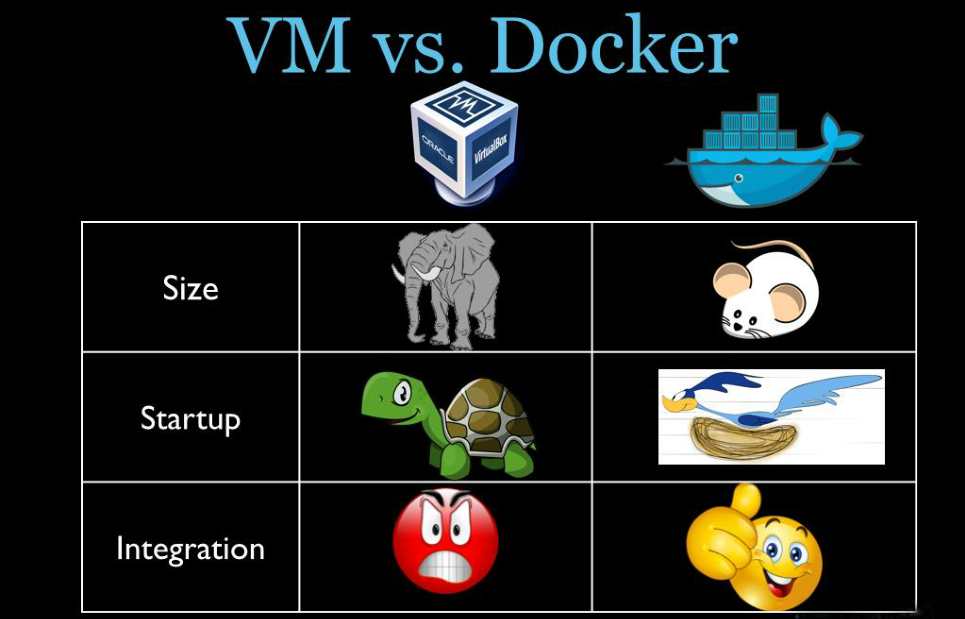
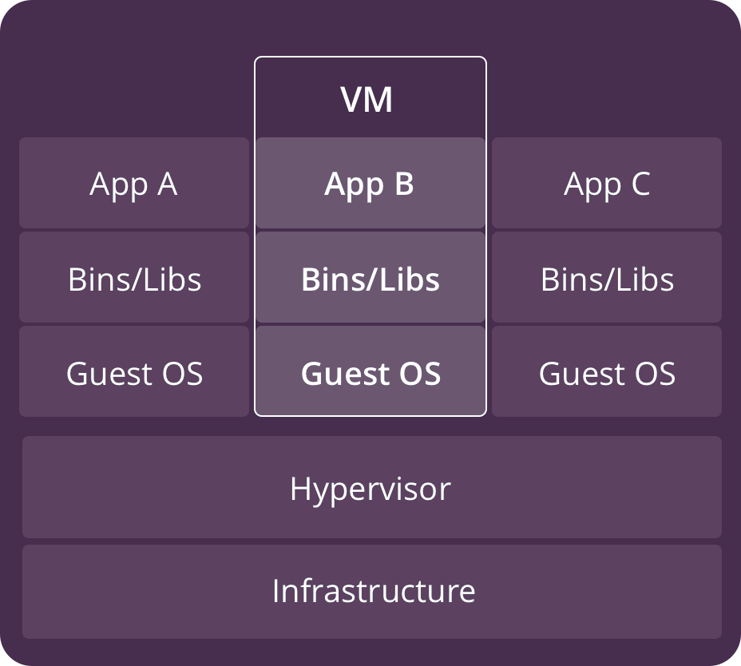
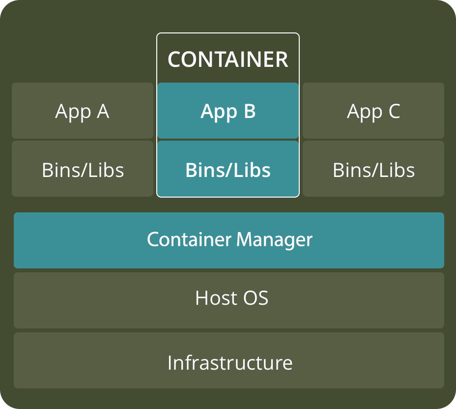
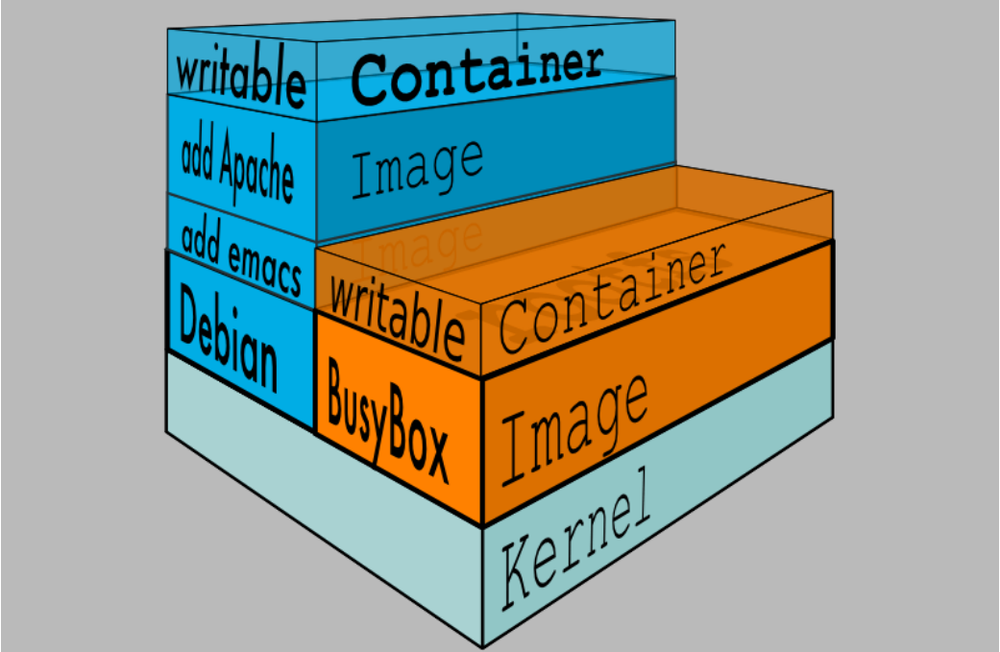
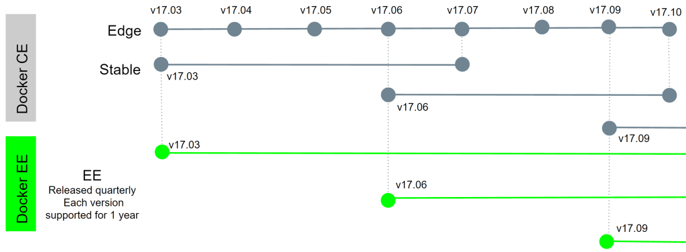
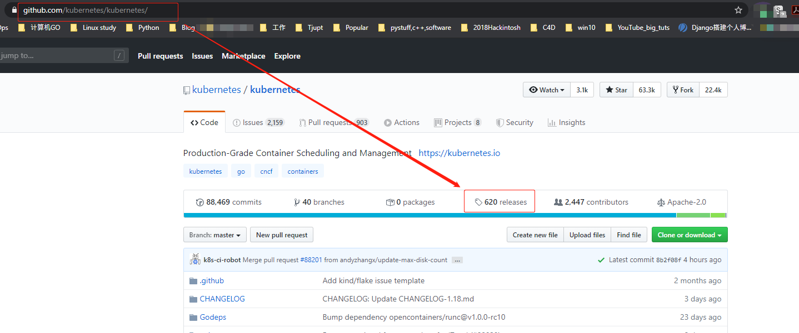
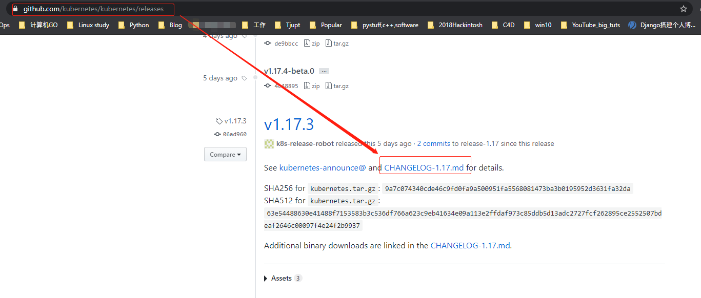
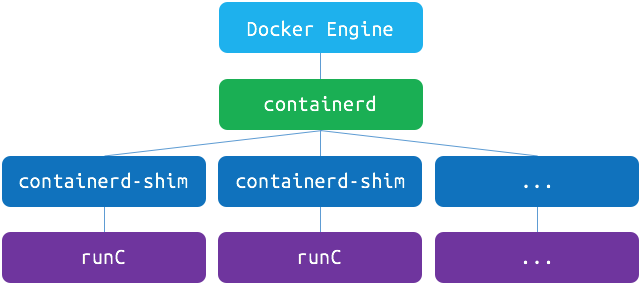
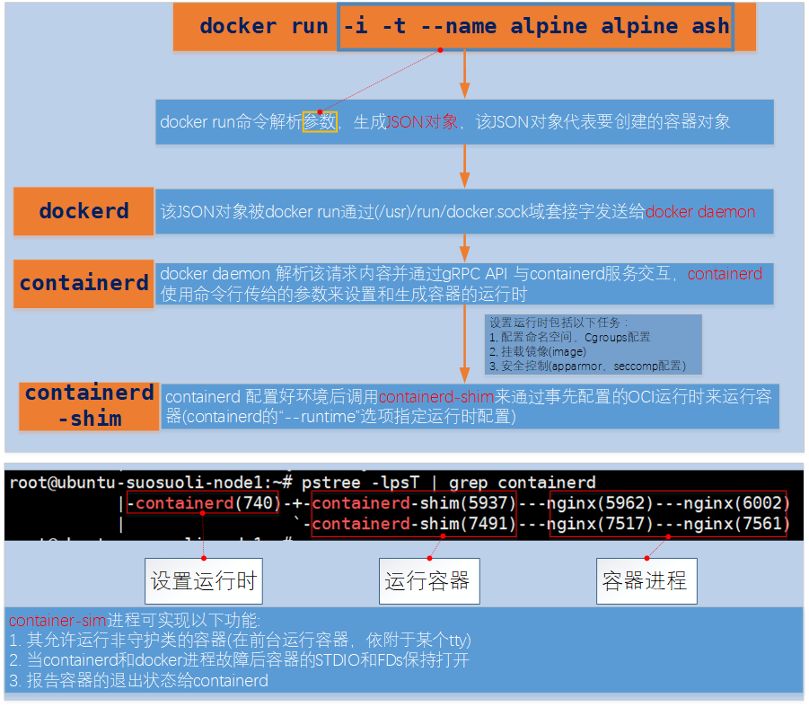
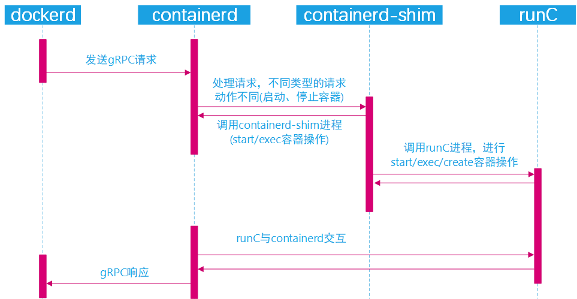

# 一.Docker 简介

## 1.1 Docker 概念

Docker 于 2013 年开源，其基于 go 语言开发，是一个开源的 PaaS 服务(Platform
as a Service，平台即服务的缩写)。而 go 语言由 google 开发，docker 公司最早期
叫 dotCloud。Docker 开源后广受欢迎，于是公司改名为 Docker Inc，总部位于美国
加州旧金山，Docker 本质上是基于 linux 内核实现，大量依赖内核技术的平台软件，
Docker 最早采用 LXC 容器技术(LinuX Container 的简写，LXC 是 Linux 原生支持的
容器技术，可以提供轻量级的操作系统级虚拟化，docker 就是基于 LXC 发展起来的，提
供 LXC 的高级封装)。

早期 Docker 引擎的容器运行时(container runtime)环境依赖于 LXC 提供，后来，
Docker 自己研发了称为 libcontainer 的库来启动容器。该库基于 Golang(Go 语言)
开发，并编译为最初的 docker 引擎。最后，由于 OCI(Open Container Initiative:
2015 年 6 月，Docker 公司与 Linux 基金会推出的开放容器计划, 成员包括 Oracle、
Microsoft、EMC、IBM、Cisco 和 VMware 等在内的一大批国际著名软件厂商的加入,
使 Docker 生态圈开始迅速膨胀。) 组织的成立，Docker 公司将 libcontainer 代码捐
赠给 OCI 组织，并将该库发展为独立的工具称为 **runc**。

目前，runc 是 OCI 标准的参考实现，很多其他的容器引擎也使用 runc 作为底层的运
行时。runc 作为容器技术的最底层，提供了让容器持续运行的能力，而不在乎是何种容
器引擎。Runc 是一个非常简洁的工具，其需要一个挂载点(也就是一个目录路径)和一些
元数据(config.json)来开始工作。

Docker 相比虚拟机的交付速度更快，资源消耗更低，Docker 采用客户端/服务端架构，
使用远程 API 来管理和创建 Docker 容器，其可以轻松的创建一个轻量级的、可移植
的、自给自足的容器，docker 的三大理念是 build(构建)、ship(运输)、 run(运行)，
Docker 遵从 apache 2.0 协议，并通过 namespace 及 cgroup 等 linux 内核技术
来提供容器的资源隔离与安全保障等，所以 Docke 容器在运行时不需要类似虚拟机
(空运行的虚拟机占用物理机 6-8%性能)的额外资源开销，因此可以大幅提高资源利用
率,总而言之 Docker 是一种用了新颖方式实现的轻量级虚拟机.类似于 VM 但是在原理
和应用上和 VM 的差别还是很大的，并且 docker 的专业叫法是应用容器
(Application Container)。

## 1.2 Docker 架构

Docker 为客服端-服务器架构。Docker 服务端也就是 Docker 的守护进程(docker daemon)，
Docker 客户端通过 REST API 和守护进程通信，Docker daemon 负责创建、运行和
分发容器。客户端和服务端可以运行于同一系统，也可以使用客户端连接远程服务进程。在
同一系统时客户端和服务端通过 UNIX sockets 通信，不在同一系统则通过网络接口通信。


### 1.2.1 Docker 组成

Docker 由多项技术组成，既包括 Linux 内核的功能，也包括 Docker 自己开发的库，还
包括了 OCI 组织定义的容器标准。

#### 1.2.1.1 Docker engine

Docker 引擎由 Docker 服务端守护进程、Docker 客户端及它们之间交流的 REST API
组成。Docker 引擎是运行和管理容器的核心。


#### 1.2.1.2 Server 服务端

Docker 服务端(Server)：Docker 守护进程(dockerd)，运行 docker 容器。并接受
docker client(docker 命令工具)的指令，已进行相应的创建和运行容器的工作。其
监听 Docker API 请求并管理 Docker 对象(镜像，容器，网络和存储等)。服务端守
护程序之间也可以通讯以管理 Docker 服务。

#### 1.2.1.3 Client 客户端

Docker 客户端(Client)：用于向 Docker 服务端发送指令的命令行工具，在 linux
下的客户端使用 docker 命令调用 docker REST API 和 服务端通讯。如：当运行如
下命令时：
`docker run -it -p 80:80 nginx:1.16.1`
Docker 客户端将该命令发送给`dockerd`，`dockerd`进程解析该命令后会寻找`nginx:1.16.1`
这个镜像，并启动为容器，`-it`表示交互式运行容器并为其分配一个伪终端，`-p 80:80`
表示将主机的 80 端口映射到容器的 80 端口。

#### 1.2.1.4 Registry 仓库

Docker 仓库(Registry): 保存镜像的仓库，类似于 git 或 svn 这样的版本控制系。
Docker Hub 是 Docker 建立的公开镜像仓库，任何人都可以使用。
运行`docker pull IMAGE`时，Docker 默认会到 Docker Hub 仓库拉取镜像 IMAGE。
运行`docker run IMAGE`时，如果本地没有该镜像，则 Docker 也会到 Docker Hub
拉取该镜像并由 dockerd 创建容器运行。

#### 1.2.1.5 Docker objects 对象

当使用 Docker 时，实际上就是创建和使用镜像、容器、网络和存储等对象。

##### 1.2.1.4.1 images 镜像

Docker 镜像(Images)：镜像可以理解为创建容器实例使用的模板。

镜像为包含创建容器所需指令的只读模板(read-only template)。一般来说，我们使用的
镜像都是基于另一个镜像创建的，在前一个镜像的基础上进行了一些自定义。例如：可以
基于 ubuntu 镜像创建另一个镜像，自定义的内容仅仅是安装 Apache 服务器和一些工具
及使得这些软件能够运行的配置细节。

##### 1.2.1.4.2 container 容器

Docker 容器(Container): 容器是从镜像生成对外提供服务的一个或一组服务。

简单的说，一个容器就是一个镜像的可运行实例。可以使用 Docker API 来创建、启动、
停止、移动或删除一个容器。默认情况下，各个容器之间及容器和运行 Docker 的主机系统
之间都是隔离的。可以控制一个容器的网络、存储、或者其它的底层系统和其他容器之间
的隔离细节。

一个容器被其对应的镜像和用户创建其时所提供的选项所定义，当一个容器被移除后，任何
对其作出的更改(未存储在磁盘的信息)都将消失。

下面的命令运行了一个 ubuntu 镜像，以交互式运行在本地命令行会话中，并运行程序
`/bin/bash`。

```bash
~$ docker run -it ubuntu /bin/bash
```

当运行上面的命令时，发生了以下事情(假设使用默认的镜像仓库配置)：

1. 如果本地没有名为`ubuntu`的镜像，Docker 就会从默认配置的镜像仓库拉取该镜像，
   相当于运行了命令`~$ docker pull ubuntu`。
2. 镜像拉取到本地后，Docker 创建一个新的容器，相当于运行命令`docker container create`
3. Docker 分配一个可读写的文件系统给该容器，作为其最后一层。这样使得运行的容器
   可以在自己的文件系统中创建和修改文件和目录。
4. Docker 创建一个网络接口来将容器连接到默认的网络上(如果不指定任何网络选项)，
   该过程中 docker 分配了一个 IP 给容器。默认情况下容器是可以通过主机的网络接口
   访问外部网络的。
5. Docker 运行该容器并运行`/bin/bash`，由于容器是交互式运行并依附于当前终端，
   所以可以在 bash 中输入命令来运行。
6. 当运行键入`exit`后回车，就退出了`/bin/bash`，由于是交互式运行 ubuntu 容器，
   所以此时 ubuntu 容器也停止了运行，但是未被移除。后面还可以再次运行该容器。

##### 1.2.1.4.3 services 服务

服务(Service)允许在多个 Docker daemon 之间进行容器伸缩管理。多个 Docker daemon
共同工作结合多个`manager`和多个`worker`组成了 Docker swarm。Docker swarm 的
每个成员都是一个 Docker daemon，各个 daemon 之间使用 Docker API 通讯。Service
允许管理员定义预期的状态。Docker 引擎在 Docker1.12 版本后支持 swarm 模式。

## 1.3 Docker 与传统虚拟化技术区别

Docker 相对于传统的虚拟化技术来说具有以下优点：

1. **资源利用率更高**：一台物理机可以运行数百个容器，但是一般只能运行数十个虚拟机。
2. **开销更小**：不需要启动单独的虚拟机占用硬件资源。
3. **启动速度更快**：可以在数秒内完成启动。
4. **体积小**：不像虚拟机使用 GB 为计量单位，容器的大小使用 MB 为单位。

对比

| 指标       | VMs-虚拟化                             | Container-容器                   |
| :--------- | :------------------------------------- | :------------------------------- |
| 体积       | 重量级，GB                             | 轻量级，MB                       |
| 性能       | 性能损失大                             | 接近 host 原生的性能表现         |
| 运行环境   | 每个应用运行于自己的 OS                | 所有容器应用运行于同一个 OS      |
| 虚拟化级别 | 硬件级别的虚拟化                       | OS 操作系统级的虚拟化            |
| 启动时间   | 可能需要几分钟                         | 启动时间在几秒内，甚至几毫米     |
| 内存消耗   | 消耗大量内存                           | 消耗少量内存，类似 OS 自己的进程 |
| 隔离级别   | 所有虚拟机和应用之间完全隔离，比较安全 | 进程级别的隔离，可能不安全       |



## 1.4 从传统虚拟化转为容器所带来的问题



使用虚拟机是为了更好的实现服务运行环境隔离，每个虚拟机都有独立的内核，虚拟化可以实现
不同操作系统的虚拟机，但是通常一个虚拟机只运行一个服务，很明显资源利用率比较低且造成
不必要的性能损耗。创建虚拟机的目的是为了运行应用程序，比如 Nginx、PHP、Tomcat 等
web 程序，使用虚拟机无疑带来了一些不必要的资源开销。

容器技术的出现则减少了中间大量的运行和转换环节，节约了大量不必要的性能损耗和体积占用。



如上图一个宿主机运行了 3 个容器，由于容器的轻量级，一个主机可能运行几十上百个容器，那么
在同一个 OS 下运行多个容器带来的以下问题该怎么解决呢?比如：

1. 怎样保证每个容器都有不同的文件系统并且能互不影响？
2. 一个 docker 主进程内的各个容器都是其子进程，如何实现同一个主进程下不同类型的子进程？
3. 各个进程间通信时能相互访问(内存数据)吗？
4. 怎么解决每个容器 IP 及端口分配的问题？
5. 多个容器的主机名能一样吗？
6. 每个容器要不要有 root 用户？
7. 怎么解决账户重名问题？

以上问题怎么解决？
幸运的是，在前人的基础上(Linux 提供的基础功能)，docker 成功解决了上述问题。
其中最重要的两项技术都由 Linux 内核提供：`Linux Namespace`技术和`Linux Control Group`
技术。

## 1.4 Linux Namespace

Linux Namespace 是 Linux 系统的底层概念，其由内核实现。Linux 命名空间起源于 2002
年 2.4.19 内核中的 mount 命名空间类。从 2006 年开始添加了其他名称空间，并一直持续。
随着用户命名空间(User namespace)的引入，在内核 3.8 版本中完成了足够的容器支持功能。

到 Linux kernel 内核版本 4.10，已经有 7 种命名空间加入到其中。从完成的任务角度看，
所有命名空间的功能都是相同的:每个进程都和一个命名空间相关联并且只能访问或者使用
和该命名空间相关联的资源，这样一来每个进程对系统的资源都有一个唯一的角度。何种
资源被隔离取决于为进程组所创建的命名空间类型。

一般，在 Linux 系统下，由于运行软件或者服务产生的新进程一般是由`fork()`系统调用
生成，或者在 bash 中键入命令，bash 会调用`exec()`系统调用来生成普通的进程。但是
容器进程是不一样的，当发送一个创建容器的请求给 Docker 引擎时，Docker 引擎最终会
调用`clone()`系统调用来生成容器进程，使用该系统调用就可以创建带有命名空间的容器化
的进程。

在运行 Docker 容器时，Docker 会为该容器创建一组命名空间(在内存中表现为各种数据结构)，
该容器的多个方面都被限定在这一组命名空间中。各个 docker 容器运行在同一个 docker 主
进程并且共用同一个宿主机系统内核，各 docker 容器运行在宿主机的用户空间，每个容器都
要有类似于虚拟机一样的相互隔离的运行空间，但是容器技术是在一个进程内实现运行指定服
务的运行环境，并且还可以保护宿主机内核不受其他进程的干扰和影响，如文件系统空间、网
络空间、进程空间等。容器运行空间的相互隔离本质上是共同的内核上运行的不同的用户空间
之间的隔离，目前内核提供的命名空间功能包括:

| 命名空间                               | 功能                               | 解释                                                        | clone()系统调用使用的 flag | 引入时内核版本 |
| :------------------------------------- | :--------------------------------- | :---------------------------------------------------------- | :------------------------- | -------------- |
| MNT(mount namespace)                   | 提供磁盘挂载点和文件系统的隔离能力 | 隔离挂载点(Mount point)                                     | CLONE_NEWNS                | Linux 2.4.19   |
| IPC Namespace                          | 进程间通信相关的隔离功能           | 隔离内核中的 System V IPC, POSIX message queues             | CLONE_NEWIPC               | Linux 2.6.19   |
| UTS Namespace(UNIX Timesharing System) | 提供主机名隔离能力                 | 隔离主机名和 NIS 域名                                       | CLONE+NEWUTS               | Linux 2.6.19   |
| PID Namespace                          | 提供进程隔离能力                   | 隔离进程 ID 名字空间，不同的进程 ID 空间中进程 ID 从 1 开始 | CLONE_NEWPID               | Linux 2.6.24   |
| Net Namespace                          | 提供网络隔离能力                   | 隔离网络设备，栈，端口等                                    | CLONE_NEWNET               | Linux 2.6.29   |
| User Namespace                         | 提供用户隔离能力                   | 隔离用户 ID 和组 ID                                         | CLONE_NEWUSER              | Linux 3.8      |
| Cgroup Namespace                       | 提供 cgroup 的隔离                 | 隔离 Cgroup 的根目录                                        | CLONE_NEWCGROUP            | Linux 4.6      |

在 Linux 内核中，以下三个系统调用可以修改命名空间:

1. `clone()`系统调用，其使用 flag(上面表格中的 CLONE_NEW..) 来指定新的进程应当被合并
   到哪个新的命名空间。
2. `unshare()`系统调用，允许一个进程将其和其他进程共享的部分运行上下文分离开。
3. `setns()`系统调用, 进入一个文件描述符指定的名称空间。

### 1.4.1 MNT Namespace

### 1.4.2 IPC Namespace

### 1.4.3 UTS Namespace

### 1.4.4 PID Namespace

### 1.4.5 Net Namespace

### 1.4.6 User Namespace

## 1.5 Linux Control Groups

[Linux Cgroups 文档 manpage](http://man7.org/linux/man-pages/man7/cgroups.7@@man-pages.html)

### 1.5.1 Cgroups 介绍

Linux Cgroups 的全称是 Linux Control Groups，它最主要的作用，就是限制
一个进程组能够使用的资源上限，包括 CPU、内存、磁盘、网络带宽等等。此外，
还能够对进程进行优先级设置，以及将进程挂起和恢复等操作。

Linux Control Groups 为内核的一项特性，该特性可将多个进程组织成层级结构
的进程组，这些进程组所使用的各种资源即可以被限制和监控。内核的 Cgroups 接口
通过叫做 cgroupfs 的伪文件系统(pseudo-filesystem)提供。进程的分组功能(
Process groups)是在 cgroup 的核心代码(内核代码)中实现的，而资源的跟踪和
限制功能则在一组分别控制每种资源类型(per-resource-type)的子系统中实现(
这些子系统分别控制内存，CPU 等)

### 1.5.2 Cgroups 术语解释

**cgroup**:一个 cgroup 就是与多个限制和参数绑定的进程，这些限制和参数通过
cgroup 文件系统定义。
**subsystem**:一个 subsystem 就是用来修改和控制属于某个 cgroup 的进程行为
的内核组件。内核实现了多个不同的子系统，这使得例如控制某个 cgroup 的 CPU 时
间和可用内存等工作可行，也可以进行如:监控某个 cgroup 使用的 CPU 时间、暂停和
恢复某个 cgroup 内的进程等工作。
**resource controller**:subsystem 有时也被叫做 resource controller(资源控
制器，简称控制器)。

属于某个控制器的 cgroups 被组织成层级结构。通过在 cgroup 文件系统中创建、删除
和重命名子文件夹来定义该层级结构。在层级结构的每一层都可以定义属性(即限制措施)。

### 1.5.3 查看内核所支持的 Cgroups 特性

在使用 Docker 创建和使用容器时，如果不对其做任何资源限制，则宿主机 OS
可能会允许其占用无限大的内存空间，有时候会因为容器中运行的程序代码
bug 导致程序会一直申请内存，直到把宿主机内存占完，为了避免此类的问
题出现，宿主机有必要对容器进行资源分配限制，比如 CPU、内存等。而 Cgroups
的功能正是解决以上问题的 Linux 内核功能特性。要使用 Cgroups，编译内
核时必须带上`CONFIG_CGROUP_XXX`选项。可以查看内核编译参数来确定是否
支持 Cgroups 功能。

#### 1.5.3.1 在 Ubuntu 18.04.3 LTS 查看

```bash
root@ubuntu-suosuoli-node1:~# uname -r
4.15.0-55-generic    # 内核版本为4.15.0
root@ubuntu-suosuoli-node1:~# cat /boot/
config-4.15.0-55-generic      grub/                         initrd.img-4.15.0-55-generic  System.map-4.15.0-55-generic  vmlinuz-4.15.0-55-generic
root@ubuntu-suosuoli-node1:~# cat /boot/config-4.15.0-55-generic | grep CGROUP
CONFIG_CGROUPS=y
CONFIG_BLK_CGROUP=y
# CONFIG_DEBUG_BLK_CGROUP is not set
CONFIG_CGROUP_WRITEBACK=y
CONFIG_CGROUP_SCHED=y
CONFIG_CGROUP_PIDS=y
CONFIG_CGROUP_RDMA=y
CONFIG_CGROUP_FREEZER=y
CONFIG_CGROUP_HUGETLB=y
CONFIG_CGROUP_DEVICE=y
CONFIG_CGROUP_CPUACCT=y
CONFIG_CGROUP_PERF=y
CONFIG_CGROUP_BPF=y
# CONFIG_CGROUP_DEBUG is not set
CONFIG_SOCK_CGROUP_DATA=y
CONFIG_NETFILTER_XT_MATCH_CGROUP=m
CONFIG_NET_CLS_CGROUP=m
CONFIG_CGROUP_NET_PRIO=y
CONFIG_CGROUP_NET_CLASSID=y
root@ubuntu-suosuoli-node1:~# cat /boot/config-4.15.0-55-generic | grep "CGROUP" | grep -v "#" | wc -l
17  # ubuntu有17项Cgroups相关特性
```

#### 1.5.3.2 在 CentOS 7.7.1908 查看

```bash
[root@redis-server-node1 ~]# uname -r
3.10.0-1062.el7.x86_64   # 内核版本3.10.0
[root@redis-server-node1 ~]# cat /boot/config-3.10.0-1062.el7.x86_64 | grep "CGROUP"
CONFIG_CGROUPS=y
# CONFIG_CGROUP_DEBUG is not set
CONFIG_CGROUP_FREEZER=y
CONFIG_CGROUP_PIDS=y
CONFIG_CGROUP_DEVICE=y
CONFIG_CGROUP_CPUACCT=y
CONFIG_CGROUP_HUGETLB=y
CONFIG_CGROUP_PERF=y
CONFIG_CGROUP_SCHED=y
CONFIG_BLK_CGROUP=y
# CONFIG_DEBUG_BLK_CGROUP is not set
CONFIG_NETFILTER_XT_MATCH_CGROUP=m
CONFIG_NET_CLS_CGROUP=y
CONFIG_NETPRIO_CGROUP=y
[root@redis-server-node1 ~]# cat /boot/config-3.10.0-1062.el7.x86_64 | grep "CGROUP" | grep -v "#" | wc -l
12  # 提供Cgroups相关的特性12个
```

Cgroups 在内核层默认已经开启，从 centos 和 ubuntu 对比结果来看，显然内核
较新的 ubuntu 支持的功能更多。

#### 1.5.3.3 cgroups 中内存相关特性

Ubuntu

```bash
root@ubuntu-suosuoli-node1:~# cat /boot/config-4.15.0-55-generic | grep "CG" | grep "MEM"
CONFIG_MEMCG=y
CONFIG_MEMCG_SWAP=y
# CONFIG_MEMCG_SWAP_ENABLED is not set
CONFIG_SLUB_MEMCG_SYSFS_ON=y
```

CentOS

```bash
[root@redis-server-node1 ~]# cat /boot/config-3.10.0-1062.el7.x86_64 | grep "CG" | grep "MEM"
CONFIG_MEMCG=y
CONFIG_MEMCG_SWAP=y
CONFIG_MEMCG_SWAP_ENABLED=y
CONFIG_MEMCG_KMEM=y
```

### 1.5.4 Cgroups 控制器具体实现介绍

参考: [man7.org-cgroups](http://man7.org/linux/man-pages/man7/cgroups.7.html)

cgroups 的最初 release V1 版本在 kernel-1.6.24 版本，此时已有多个控制器被实现，
然而由于开发这些控制器时未形成统一协调的开发过程，导致了在控制器之间
出现了不一致及 cgroup 层级管理变得比较复杂。由于初代的开发原因，在
kernel-3.10 版本又重新开发了 cgroup 的 V2 版本，新版本于 kernel-4.5 由
官方发布。由于兼容原因，V1 和 V2 并存与内核，V2 只实现了 V1 版本的部分控制器。

#### 1.5.4.1 Control Groups version 1 controller

每个 cgroups 的控制器都由一个内核配置选项控制。cgroups 这项特性的
开关则由内核选项`CONFIG_CGROUPS`决定。

| 控制器     | 内核选项                  | 引入时内核版本 | 功能                                                                                                                     |
| :--------- | :------------------------ | :------------- | :----------------------------------------------------------------------------------------------------------------------- |
| cpu        | CONFIG_CGROUP_SCHED       | Linux 2.6.24   | 控制 cgroup 内各进程对 CPU 的使用                                                                                        |
| cpuacct    | CONFIG_CGROUP_CPUACCT     | Linux 2.6.24   | 提供了对进程组的 CPU 使用情况的统计                                                                                      |
| cpuset     | CONFIG_CPUSETS            | Linux 2.6.24   | 用于将 cgroup 内的进程绑定到一组特定 CPU 上运行                                                                          |
| memory     | CONFIG_MEMCG              | Linux 2.6.25   | 限制 cgroup 中的进程使用的内存和 cgroup 使用了的交换分区空间，及生成报告                                                 |
| devices    | CONFIG_CGROUP_DEVICE      | Linux 2.6.26   | 控制 cgroup 中的进程是否能创建新的设备并以可读可写等方式打开                                                             |
| freezer    | CONFIG_CGROUP_FREEZER     | Linux 2.6.28   | 挂起和恢复某个 cgroup 中的所有进程，挂起某个 cgroup 会导致其子 cgroup 也被挂起                                           |
| net_cls    | CONFIG_CGROUP_NET_CLASSID | Linux 2.6.29   | 在由 cgroup 产生的网络数据包中插入一个 classID，classID 可以用于防火墙规则等，数据包是指离开 cgroup 的而非进入 cgroup 的 |
| blkio      | CONFIG_BLK_CGROUP         | Linux 2.6.33   | blkio cgroup 通过对存储层次结构中的叶节点和中间节点应用 IO 控制(节流和上限)来控制和限制对指定块设备的访问                |
| perf_event | CONFIG_CGROUP_PERF        | Linux 2.6.39   | 监测属于某个特定的 cgroup 的所有线程以及运行在特定 CPU 上的线程                                                          |
| net_prio   | CONFIG_CGROUP_NET_PRIO    | Linux 3.3      | 允许对每个网络设备指定优先级(为 cgroup 而指定)                                                                           |
| hugetlb    | CONFIG_CGROUP_HUGETLB     | Linux 3.5      | 支持了限制 cgroup 对大页内存的使用                                                                                       |
| pids       | CONFIG_CGROUP_PIDS        | Linux 4.3      | 限制在一个 cgroup 中创建的进程的数量                                                                                     |
| rdma       | CONFIG_CGROUP_RDMA        | Linux 4.11     | RDMA 控制器用来限制每个 cgroup 对 RDMA/IB-spe‐cific 资源的使用                                                           |

#### 1.5.4.2 Control Groups version 2 controller

Cgroups 的版本 2 的控制器大多继承于版本 1，差异和详细说明可以在`man7.ogr`找到:
[man7.org-cgroups](http://man7.org/linux/man-pages/man7/cgroups.7.html)

### 1.5.5 Cgroups 使用例子

Cgroups 默认放在`/sys/fs/cgroup/`，如下：

```bash
root@ubuntu-suosuoli-node1:~# df -HT
Filesystem     Type      Size  Used Avail Use% Mounted on
...
tmpfs          tmpfs     1.1G  8.2k  1.1G   1% /dev/shm
tmpfs          tmpfs     5.3M     0  5.3M   0% /run/lock
tmpfs          tmpfs     1.1G     0  1.1G   0% /sys/fs/cgroup  # cgroup所在地的文件系统类型为tmpfs
tmpfs          tmpfs     207M     0  207M   0% /run/user/0
overlay        overlay    43G  6.8G   34G  18% /var/lib/docker/overlay2/f3bd44bf71dd8df9eeb608659b57cd6f95621db7f054cbf1843e0bdd48f080ac/merged
shm            tmpfs      68M     0   68M   0% /var/lib/docker/containers/05a00f2cc211e5747d70c147bd95716286a42c14818357bced41547c8eabafc7/mounts/shm
root@ubuntu-suosuoli-node1:~# ll /sys/fs/cgroup/  # 目前系统的cgroups表现为多个目录
total 0
drwxr-xr-x 15 root root 380 Feb 14 08:56 ./
drwxr-xr-x 10 root root   0 Feb 14 11:22 ../
dr-xr-xr-x  5 root root   0 Feb 14 11:22 blkio/
lrwxrwxrwx  1 root root  11 Feb 14 08:56 cpu -> cpu,cpuacct/
lrwxrwxrwx  1 root root  11 Feb 14 08:56 cpuacct -> cpu,cpuacct/
dr-xr-xr-x  5 root root   0 Feb 14 11:22 cpu,cpuacct/
dr-xr-xr-x  3 root root   0 Feb 14 11:22 cpuset/
dr-xr-xr-x  5 root root   0 Feb 14 11:22 devices/
dr-xr-xr-x  3 root root   0 Feb 14 11:22 freezer/
dr-xr-xr-x  3 root root   0 Feb 14 11:22 hugetlb/
dr-xr-xr-x  5 root root   0 Feb 14 11:22 memory/
lrwxrwxrwx  1 root root  16 Feb 14 08:56 net_cls -> net_cls,net_prio/
dr-xr-xr-x  3 root root   0 Feb 14 11:22 net_cls,net_prio/
lrwxrwxrwx  1 root root  16 Feb 14 08:56 net_prio -> net_cls,net_prio/
dr-xr-xr-x  3 root root   0 Feb 14 11:22 perf_event/
dr-xr-xr-x  5 root root   0 Feb 14 11:22 pids/
dr-xr-xr-x  2 root root   0 Feb 14 11:22 rdma/
dr-xr-xr-x  6 root root   0 Feb 14 11:22 systemd/
dr-xr-xr-x  5 root root   0 Feb 14 11:22 unified/
```

#### 1.5.5.1 创建 Cgroups 和移动进程

cgroup 文件系统初始只包含单个根 cgroup(root cgroup)，"/"，所有进程都属于该
组。要创建一个新的 group，即是在 cgroup 文件系统中创建一个新的目录:

```bash
~$ mkdi /sys/fs/cgroup/cpu/cg1  # 该动作就创建了一个新的cgroup
```

一个进程可以移动到 cgroup 中，通过将该进程的进程 PID 写入到`cgroup.procs`
文件中即可：

```bash
~$ echo $$ > /sys/fs/cgroup/cpu/cg1/cgroup.procs
```

一次只能写一个 PID 到该文件。移动该进程的同时，其包含的线程也属于该组。

#### 1.5.5.2 移除 cgroups

为了移除某个 cgroup，其必须没有子 cgroup 并且不包含任何进程。要移除
cgroup 直接移除代表其的目录即可，里面的文件不用管。

## 1.6 容器管理工具简介

在 Linux 的 chroot、namespace、cgroups 的特性的支持下，具备了基础的容器运行
环境，但是还需要有相应的容器创建与删除的管理工具、以及怎么样把容器运行起来、容
器数据怎么处理、怎么进行启动与关闭等问题需要解决，于是容器管理技术出现了。早期
主要使用了 LXC，目前主流使用 Docker。

### 1.6.1 LXC

LXC 为 Linux Container 的简写。可以提供轻量级的虚拟化，以便隔离进程和资源。
[LXC 官方网站](https://linuxcontainers.org/)

Ubuntu 使用 LXC:

```bash
~$ apt install lxc lxd
~$ lxc-checkconfig #检查内核对lcx的支持状况，必须全部为lcx
~$ lxc-create -t 模板名称 -n lcx-test
~$ lxc-create -t download --name alpine12 -- --dist alpine  --release 3.9 --arch amd64
~$  lxc-start alpine12 #启动lxc容器
~$  lxc-attach  alpine12 #进入lxc容器

# 命令备注：
-t 模板: -t 选项后面跟的是模板，模式可以认为是一个原型，用来说明我们需
要一个什么样的容器(比如容器里面需不需要有vim, apache等软件)．模板实际
上就是一个脚本文件(位于/usr/share/lxc/templates目录)，我们这里指定
download模板(lxc-create会调用lxc-download脚本，该脚本位于刚说的模板目
录中)是说明我们目前没有自己模板，需要下载官方的模板
--name 容器名称： 为创建的容器命名
-- : --用来说明后面的参数是传递给download脚本的，告诉脚本需要下载什么样的模板
--dist 操作系统名称：指定操作系统
--release 操作系统: 指定操作系统，可以是各种Linux的变种
--arch 架构：指定架构，是x86还是arm，是32位还是64位
```

[清华模板源](https://mirrors.tuna.tsinghua.edu.cn/help/lxc-images/)
lxc 启动容器依赖于模板，但是做模板相对较难，需要手动一步步创构建文件系统、准备
基础目录及可执行程序等，而且在大规模使用容器的场景很难横向扩展，另外后期代码升
级也需要重新从头构建模板，基于以上种种原因便有了 docker。

### 1.6.2 Docker

Docker 启动一个容器也需要一个外部模板叫做镜像，docker 的镜像可以保存在一
个公共的仓库共享使用，只要把镜像下载下来就可以使用，最主要的是可以在镜像
基础之上做自定义配置并且可以再把其提交为一个镜像，一个镜像可以被启动为多个
容器。

Docker 的镜像是分层构建的，镜像底层为库文件且属于只读层即不能写入也不能删
除和修改数据，从镜像加载启动为一个容器后会生成一个可写层，其写入的数据会复
制到容器目录，但是容器内的数据在删除容器后也会被随之删除。



### 1.6.3 pouch

pouch 为阿里巴巴在 docker 基础上开发并发开源的容器技术。

[介绍](https://www.infoq.cn/article/alibaba-pouch)
[项目地址](https://github.com/alibaba/pouch)

## 1.7 Docker 优缺点

### Docker 优势

**快速部署**: 在极短时间内可以部署成百上千个应用，可以快速交付产品到生产中。
**高效虚拟化**: 不需要额外的 hypervisor 程序支持，直接基于 linux 内核提供
的功能实现应用虚拟化，相比虚拟机大幅提高性能和效率。
**节省成本**: 提高服务器利用率，降低 IT 支出。
**简化配置**: 将运行环境和应用打包保存至容器，使用时直接启动即可。
**快速迁移和扩展**: 容器可以夸平台运行在物理机、虚拟机、公有云等环境，良好
的兼容性可以方便将应用从 A 宿主机迁移到 B 宿主机，甚至是不同的平台之间迁移。

### Docker 不足

**隔离性**: Docker 管理的容器提供进程级别的隔离，而不是虚拟机接近硬件级别的隔离。
这样的隔离性下，内核的 BUG 会影响任何运行于其上的容器。
**大量的容器管理**: 在大量的容器部署和管理方面，Docker 有不小的挑战，但是 google 的
Kubernetes 可以帮忙。

## 1.8 Docker 容器的核心技术

实际上不仅仅是 Docker 容器，任何其他的容器，要想快速发展和进入到实际应用，
都离不开下面的核心技术的支持。

### 1.8.1 容器规范

容器技术除了 docker 之外，还有 coreOS 的 rkt、阿里的 Pouch 等，为了保证容器生态
系统的标准统一和维持健康可持续发展。包括 Linux 基金会、Docker、微软、红帽、谷歌
和、IBM 等公司在 2015 年 6 月共同成立了一个叫 open container initiative(OCI)
的开源组织，其目的就是制定开放的标准的容器规范，目前 OCI 一共发布了两个规范，分别
是 `runtime spec` 和 `image format spec`，有了这两个规范，不同的容器公司开发的
容器只要兼容这两个规范，就可以保证不同公司之间使用的容器的可移植性和可操作性。

### 1.8.2 容器 runtime

runtime 是真正运行容器的地方，为了运行不同的容器，runtime 需要和操作系统内核
紧密合作，以便为容器提供相应的运行环境。目前主流的三种容器 runtime：
**LXC**：linux 上早期的 runtime，Docker 早期就是采用 lxc 作为 runtime。
**runc**：目前 Docker 默认的 runtime，runc 遵守 OCI 规范，因此可以兼容 lxc。
**rkt**：是 CoreOS 开发的容器 runtime，也符合 OCI 规范，所以使用 rktruntime
也可以运行 Docker 容器。

runtime 只负责一件事，而且做得很好，那就是运行容器，Runc 运行容器时需要两种东西:

1. 一个规格说明文件
2. 表示某镜像的根文件系统的路径

### 1.8.3 容器管理工具

容器管理工具处于 runtime 和使用容器的用户之间，用于对用户提供图形或命令方式操作
管理容器，将用户操作传递给 runtime 执行。例如：

1. lxc 是 lxd 的管理工具。
2. Docker engine 是 Runc 的管理工具是，docker engine 包含后台 deamon 和 cli 两部
   分，大家经常提到的 Docker 就是指的 docker engine。
3. Rkt 的管理工具是 rkt cli。

### 1.8.4 容器构建工具

容器定义工和构建具允许用户定义容器的属性和内容，以方便容器能够被保存、共享和重建。
Docker 生态使用 Docker image 来创建容器。而 Docker image 是使用 Dockerfile 来
定义。

**Docker image** : 是 docker 容器的模板，runtime 依据 docker image 创建容器。
**Dockerfile** : 是包含了多个命令的文本文件，通过 dockerfile 即可创建出 docker image。
**ACI(App container image)**：与 docker image 类似，是 CoreOS 开发的 rkt 容器的镜
像格式。

### 1.8.5 镜像仓库 Registry

在 Docker 生态中，**Registry** 用来统一保存镜像，叫做镜像仓库。镜像仓库可以分为
公共仓库和私有仓库。

**Image registry**：docker 官方提供的私有仓库部署工具。
**Docker hub**：docker 官方的公共仓库，已经保存了大量的常用镜像，可以方便大
家直接下载使用。
**Harbor**：vmware 提供的自带 web 界面自带认证功能的镜像仓库，目前有很多公
司使用该仓库中的镜像。

### 1.8.6 容器编排工具

Docker 虽然可以在单个主机上运行多个容器，但是当多个容器在多个主机运行的时候，单独
管理特定容器是相当复杂的而且很容易出错，而且也无法实现某一台主机宕机后容器自动迁移
到其他主机从而实现高可用的目的，也无法实现动态伸缩容器的功能，因此需要有一种工具可
以实现统一管理、动态伸缩、故障自愈、批量执行等容器管理高级功能，这就是容器编排引擎。

容器编排技术通常包括容器管理、调度、集群定义和服务发现等功能。随着需求的提出，出现
了很多的容器编排工具，如下：

**Docker swarm**：Docker 自家开发的容器编排引擎。
**Kubernetes**：google 开发的容器编排引擎，google 内部项目 Borg 的开源实现版本，
且其同时支持 docker 和 CoreOS 的容器编排。
**Mesos+Marathon**：通用的集群组员调度平台，mesos(资源分配)与 marathon(容器编排
平台)一起提供容器编排引擎功能。

## 1.9 Docker 容器依赖的技术

这里指的 Docker 依赖的技术不是指其实现依赖的内核特性等技术，而是其作为容器技术
普遍面临的技术依赖，即其大规模普及和应用于生产时的缺陷。幸运的是，可以使用第三
放方的各种技术来弥补 Docker 在多种环境下的功能缺陷(也不能说是缺陷，只能说一个
平台不是万能的，能面对各种境况。)。

### 容器网络

Docker 自带的网络 docker network 仅支持管理单机上的容器网络，当多主机运行的时
候需要使用第三方开源网络，例如 calico、flannel 等。

### 服务发现

容器的动态扩容特性决定了容器 IP 也会随之变化，因此需要有一种机制可以自动识别并
将用户请求动态转发到新创建的容器上，kubernetes 自带服务发现功能，需要结合
kube-dns 服务解析内部域名。

### 容器监控

可以通过原生命令 `docker ps/top/stats` 查看容器运行状态，另外也可以使
`heapster或Prometheus` 等第三方监控工具监控容器的运行状态。

### 数据管理

容器的动态迁移会导致其在不同的 Host 之间迁移，因此如何保证与容器相关的数据也能随之
迁移或随时访问，可以使用逻辑卷/存储挂载等方式解决。

### 日志收集

Docker 虽然自带原生的日志查看工具 docker logs，但是容器内部的日志需要通过 ELK 等
专门的日志收集分析和展示工具进行处理，docker 并不能分门别类的处理个容器日志。

# 二.Docker 安装和基础使用

[Docker 官网](www.docker.com)

**Docker 运行系统 OS 版本选择**：
Docker 目前已经支持多种操作系统的安装运行，比如 Ubuntu、CentOS、Redhat、
Debian、Fedora，甚至是还支持了 Mac 和 Windows，在 linux 系统上需要内核版
本在 3.10 或以上，docker 版本号之前一直是 0.X 版本或 1.X 版本，但是从 2017
年 3 月 1 号开始改为每个季度发布一次稳版，其版本号规则也统一变更为 YY.MM，
例如 17.09 表示是 2017 年 9 月份发布的。

**Docker 版本选择**：
Docker 之前没有区分版本(社区版还是企业版)，但是 2017 年初推出的新项目 Moby
则是 Docker 的完全更名版，Moby 项目是属于 Docker 项目的全新母项目，Docker
将是一个隶属于的 Moby 的子产品，而且之后的版本之后开始区分为 CE 版本(社区版
本)和 EE(企业收费版)，CE 社区版本和 EE 企业版本都是每个季度发布一个新版本，
但是 EE 版本提供后期安全维护 1 年，而 CE 版本是 4 个月。Moby 项目的地址：
[Moby-Github](https://github.com/moby/moby)
[更多的版本细节可以看官方博客原文](https://blog.docker.com/2017/03/docker-enterprise-edition/)

下图为 Docker CE 和 Docker EE 的生命周期图示



**注意事项**
Docker 与 kubernetes 结合使用的时候，要安装经过 kubernetes 官方测试通过的
docker 版本，避免出现不兼容等未知的及不可预估的问题发生，kubernetes 测试过
的 docker 版本可以在 github 项目地址中的开发更新日志查询，具体如下：

[Kubernetes V1.16 开发变更日志](https://github.com/kubernetes/kubernetes/blob/master/CHANGELOG/CHANGELOG-1.16.md#v1167)





## 2.1 下载 RPM 包安装

[官方 rpm 包下载地址](https://download.docker.com/linux/centos/7/x86_64/stable/Packages/)

[aliyun rpm 包下载地址](https://mirrors.aliyun.com/docker-ce/linux/centos/7/x86_64/stable/Packages/)

[二进制下载地址-Docker](https://download.docker.com/linux/centos/7/x86_64/stable/Packages/)

[二进制下载地址-aliyun](https://mirrors.aliyun.com/docker-ce/linux/static/stable/x86_64/)

## 2.2 Centos 包管理器安装

yum 仓库配置:http://mirrors.aliyun.com/repo/Centos-7.repo
http://mirrors.aliyun.com/repo/epel-7.repo

```bash
[root@redis-server-node1 ~]# wget -O /etc/yum.repos.d/CentOS-Base.repo http://mirrors.aliyun.com/repo/Centos-7.repo
...
[root@redis-server-node1 ~]# wget -O /etc/yum.repos.d/epel.repo http://mirrors.aliyun.com/repo/epel-7.repo
...
[root@redis-server-node1 ~]# wget -O /etc/yum.repos.d/docker-ce.repo https://mirrors.aliyun.com/docker-ce/linux/centos/docker-ce.repo

[root@redis-server-node1 ~]# yum list docker-ce
Available Packages
docker-ce.x86_64                    3:19.03.6-3.el7               docker-ce-stable

[root@redis-server-node1 ~]# yum install docker-ce -y


[root@redis-server-node1 ~]# systemctl start docker
[root@redis-server-node1 ~]# docker version
[root@redis-server-node1 ~]# docker version
Client: Docker Engine - Community
 Version:           19.03.6
 API version:       1.40
 Go version:        go1.12.16
 Git commit:        369ce74a3c
 Built:             Thu Feb 13 01:29:29 2020
 OS/Arch:           linux/amd64
 Experimental:      false

Server: Docker Engine - Community
 Engine:
  Version:          19.03.6
  API version:      1.40 (minimum version 1.12)
  Go version:       go1.12.16
  Git commit:       369ce74a3c
  Built:            Thu Feb 13 01:28:07 2020
  OS/Arch:          linux/amd64
  Experimental:     false
 containerd:
  Version:          1.2.10
  GitCommit:        b34a5c8af56e510852c35414db4c1f4fa6172339
 runc:
  Version:          1.0.0-rc8+dev
  GitCommit:        3e425f80a8c931f88e6d94a8c831b9d5aa481657
 docker-init:
  Version:          0.18.0
  GitCommit:        fec3683
```

## 2.3 Ubuntu 安装 Docker

```bash
root@ubuntu-suosuoli-node1:~# apt-cache madison docker-ce # 查看可获取的版本
 docker-ce | 5:19.03.6~3-0~ubuntu-bionic | https://mirrors.aliyun.com/docker-ce/linux/ubuntu bionic/stable amd64 Packages
 docker-ce | 5:19.03.5~3-0~ubuntu-bionic | https://mirrors.aliyun.com/docker-ce/linux/ubuntu bionic/stable amd64 Packages
 docker-ce | 5:19.03.4~3-0~ubuntu-bionic | https://mirrors.aliyun.com/docker-ce/linux/ubuntu bionic/stable amd64 Packages
 docker-ce | 5:19.03.3~3-0~ubuntu-bionic | https://mirrors.aliyun.com/docker-ce/linux/ubuntu bionic/stable amd64 Packages
 docker-ce | 5:19.03.2~3-0~ubuntu-bionic | https://mirrors.aliyun.com/docker-ce/linux/ubuntu bionic/stable amd64 Packages
 docker-ce | 5:19.03.1~3-0~ubuntu-bionic | https://mirrors.aliyun.com/docker-ce/linux/ubuntu bionic/stable amd64 Packages
 docker-ce | 5:19.03.0~3-0~ubuntu-bionic | https://mirrors.aliyun.com/docker-ce/linux/ubuntu bionic/stable amd64 Packages
 docker-ce | 5:18.09.9~3-0~ubuntu-bionic | https://mirrors.aliyun.com/docker-ce/linux/ubuntu bionic/stable amd64 Packages
 docker-ce | 5:18.09.8~3-0~ubuntu-bionic | https://mirrors.aliyun.com/docker-ce/linux/ubuntu bionic/stable amd64 Packages
 docker-ce | 5:18.09.7~3-0~ubuntu-bionic | https://mirrors.aliyun.com/docker-ce/linux/ubuntu bionic/stable amd64 Packages
 docker-ce | 5:18.09.6~3-0~ubuntu-bionic | https://mirrors.aliyun.com/docker-ce/linux/ubuntu bionic/stable amd64 Packages
 docker-ce | 5:18.09.5~3-0~ubuntu-bionic | https://mirrors.aliyun.com/docker-ce/linux/ubuntu bionic/stable amd64 Packages
 docker-ce | 5:18.09.4~3-0~ubuntu-bionic | https://mirrors.aliyun.com/docker-ce/linux/ubuntu bionic/stable amd64 Packages
 docker-ce | 5:18.09.3~3-0~ubuntu-bionic | https://mirrors.aliyun.com/docker-ce/linux/ubuntu bionic/stable amd64 Packages
 docker-ce | 5:18.09.2~3-0~ubuntu-bionic | https://mirrors.aliyun.com/docker-ce/linux/ubuntu bionic/stable amd64 Packages
 docker-ce | 5:18.09.1~3-0~ubuntu-bionic | https://mirrors.aliyun.com/docker-ce/linux/ubuntu bionic/stable amd64 Packages
 docker-ce | 5:18.09.0~3-0~ubuntu-bionic | https://mirrors.aliyun.com/docker-ce/linux/ubuntu bionic/stable amd64 Packages
 docker-ce | 18.06.3~ce~3-0~ubuntu | https://mirrors.aliyun.com/docker-ce/linux/ubuntu bionic/stable amd64 Packages
 docker-ce | 18.06.2~ce~3-0~ubuntu | https://mirrors.aliyun.com/docker-ce/linux/ubuntu bionic/stable amd64 Packages
 docker-ce | 18.06.1~ce~3-0~ubuntu | https://mirrors.aliyun.com/docker-ce/linux/ubuntu bionic/stable amd64 Packages
 docker-ce | 18.06.0~ce~3-0~ubuntu | https://mirrors.aliyun.com/docker-ce/linux/ubuntu bionic/stable amd64 Packages
 docker-ce | 18.03.1~ce~3-0~ubuntu | https://mirrors.aliyun.com/docker-ce/linux/ubuntu bionic/stable amd64 Packages
root@ubuntu-suosuoli-node1:~# apt install docker-ce=5:18.09.9~3-0~ubuntu-bionic

root@ubuntu-suosuoli-node1:~# systemctl start docker
root@ubuntu-suosuoli-node1:~# docker version
Client: Docker Engine - Community
 Version:           19.03.6
 API version:       1.39 (downgraded from 1.40)
 Go version:        go1.12.16
 Git commit:        369ce74a3c
 Built:             Thu Feb 13 01:27:49 2020
 OS/Arch:           linux/amd64
 Experimental:      false

Server: Docker Engine - Community
 Engine:
  Version:          18.09.8
  API version:      1.39 (minimum version 1.12)
  Go version:       go1.10.8
  Git commit:       0dd43dd
  Built:            Wed Jul 17 17:07:25 2019
  OS/Arch:          linux/amd64
  Experimental:     false
```

### 2.3.1 查看 docker0 虚拟网卡信息

在 docker 安装启动之后，默认会生成一个名称为 docker0 的虚拟网卡，其默认
IP 地址为 172.17.0.1

```bash
root@ubuntu-suosuoli-node1:~# ifconfig docker0
docker0: flags=4163<UP,BROADCAST,RUNNING,MULTICAST>  mtu 1500
        inet 172.17.0.1  netmask 255.255.0.0  broadcast 172.17.255.255
        inet6 fe80::42:37ff:fe31:8aa1  prefixlen 64  scopeid 0x20<link>
        ether 02:42:37:31:8a:a1  txqueuelen 0  (Ethernet)
        RX packets 2779  bytes 123242 (123.2 KB)
        RX errors 0  dropped 0  overruns 0  frame 0
        TX packets 3366  bytes 15961610 (15.9 MB)
        TX errors 0  dropped 0 overruns 0  carrier 0  collisions 0
```

### 2.3.2 docker info 信息解读

```bash
root@ubuntu-suosuoli-node1:~# docker info
Client:
 Debug Mode: false

Server:
 Containers: 2                # 当前主机运行的容器总数
  Running: 1                  # 正在运行的容器数
  Paused: 0                   # 暂停的容器
  Stopped: 1                  # 停止的容器数
 Images: 2                    # 当前系统所有的镜像
 Server Version: 18.09.8      # docker服务端版本
 Storage Driver: overlay2     # 存储驱动(存储引擎)
  Backing Filesystem: extfs   # 后端文件系统，OS使用的文件系统
  Supports d_type: true       # 是否支持d_type
  Native Overlay Diff: true   # 是否支持差异数据存储
 Logging Driver: json-file    # 日志驱动
 Cgroup Driver: cgroupfs      # cgroups 驱动
 Plugins:
  Volume: local               # 卷
  Network: bridge host macvlan null overlay # overlay夸主机通
  Log: awslogs fluentd gcplogs gelf journald json-file local logentries splunk syslog # 支持的日志类型
 Swarm: inactive # 是否支持docker swarm
 Runtimes: runc  # 容器运行时类型为runc
 Default Runtime: runc  # 默认的容器运行时为runc
 Init Binary: docker-init # 初始化容器的守护进程，即pid为1的进程
 containerd version: 35bd7a5f69c13e1563af8a93431411cd9ecf5021  # containerd版本
 runc version: dc9208a3303feef5b3839f4323d9beb36df0a9dd        # runc版本
 init version: fec3683
 Security Options:
  apparmor  # 安全模块， https://docs.docker.com/engine/security/apparmor/
  seccomp   # 审计(操作)模块，https://docs.docker.com/engine/security/seccomp/
   Profile: default  # 配置文件,默认的配置文件
 Kernel Version: 4.15.0-55-generic     # 主机内核版本
 Operating System: Ubuntu 18.04.3 LTS  # 主机OS版本
 OSType: linux
 Architecture: x86_64
 CPUs: 2
 Total Memory: 1.924GiB
 Name: ubuntu-suosuoli-node1   # 主机名
 ID: 5NGE:JXDX:CW52:ESTQ:QWOP:ZUM4:KQJZ:EP67:YYRU:OPL7:CVUD:IQQZ
 Docker Root Dir: /var/lib/docker  # 宿主机数据保存目录
 Debug Mode: false
 Registry: https://index.docker.io/v1/
 Labels:
 Experimental: false   # 是否是测试版
 Insecure Registries:
  127.0.0.0/8
 Registry Mirrors:
  https://9916w1ow.mirror.aliyuncs.com/
 Live Restore Enabled: false  # 是否开启活动重启(重启docker-daemon不关闭容器)
 Product License: Community Engine  # 产品许可信息

WARNING: No swap limit support  # 不支持swap限制的警告
```

**解决不支持 swap 限制的警告**

```bash
root@ubuntu-suosuoli-node1:~# vim /etc/default/grub
GRUB_DEFAULT=0
GRUB_TIMEOUT_STYLE=hidden
GRUB_TIMEOUT=2
GRUB_DISTRIBUTOR=`lsb_release -i -s 2> /dev/null || echo Debian`
GRUB_CMDLINE_LINUX_DEFAULT=""
GRUB_CMDLINE_LINUX="net.ifnames=0 biosdevname=0 cgroup_enable=memory swapaccount=1"  # 修改该行
root@ubuntu-suosuoli-node1:~# update-grub
Sourcing file `/etc/default/grub'
Generating grub configuration file ...
Found linux image: /boot/vmlinuz-4.15.0-55-generic
Found initrd image: /boot/initrd.img-4.15.0-55-generic
done
root@ubuntu-suosuoli-node1:~# reboo
```

## 2.4 Docker 存储引擎

目前 docker 的默认存储引擎为 overlay2，不同的存储引擎需要相应的系统支持，如需
要磁盘分区的时候传递 d-type 文件分层功能，即需要传递内核参数开启格式化磁盘的时
候的指定功能。

[Docker-overlay2 官方文档](https://docs.docker.com/storage/storagedriver/overlayfs-driver/)

[How the overlay2 driver works](https://docs.docker.com/storage/storagedriver/overlayfs-driver/#how-the-overlay2-driver-works)

[官方文档关于存储引擎的选择文档](https://docs.docker.com/storage/storagedriver/select-storage-driver/)

### 2.4.1 存储引擎驱动类型

#### AUFS

AUFS:AUFS(AnotherUnionFS)是一种 Union FS 实现，是文件级的存储驱动。
UnionFS 支持将不同目录挂载到同一个虚拟文件系统下的文件系统。也就是说
支持把不同物理位置的目录合并 mount 到同一个目录中。这种文件系统可以一
层一层地叠加修改文件。无论底下有多少层都是只读的，只有最上层的文件系统
是可写的。当需要修改一个文件时，AUFS 创建该文件的一个副本，使用
copy-on-write 机制将文件从只读层复制到可写层进行修改，结果也保存在可
写层。在 Docker 中，底层的只读层就是 image，可写层就是 Container。

#### Overlay

一种 Union FS 文件系统，Linux 内核 3.18 后支持。

#### overlay2

Overlay2 文件系统是 Overlay 的升级版，到目前为止，overlay2 位所有 Linux 发行版
推荐使用的存储类型。

#### devicemapper

devicemapper 是 CentOS 和 RHEL 的推荐存储驱动程序，因为之前的内核版本不支持
overlay2，但是当前较新版本的 CentOS 和 RHEL 现在已经支持 overlay2，因此推荐
使用 overlay2。实际上 devicemapper 只是一个过渡性技术，现在 Docker 生态已经
没人使用 devicemapper。

#### vfs

用于测试环境，适用于无法使用 copy-on-write 文件系统的情况。 此存储驱动程序的
性能很差，通常不建议用于生产。

### Docker 首选存储引擎

AUFS 是 Docker 18.06 及更早版本的首选存储驱动程序，在内核 3.13 上运行
Ubuntu 14.04 时不支持 overlay2。Docker 官方推荐首选存储引擎为 overlay2，
devicemapper 存在使用空间方面的一些限制，虽然可以通过后期配置解决，但是官
方依然推荐使用 overlay2，以下是网上查到的部分资料：
[CentOS 系统故障 | 一桩"血案"引发的容器存储驱动比较](https://www.cnblogs.com/youruncloud/p/5736718.html)

```bash
[root@redis-server-node1 ~]# xfs_info /
meta-data=/dev/sda2              isize=512    agcount=4, agsize=1310720 blks
         =                       sectsz=512   attr=2, projid32bit=1
         =                       crc=1        finobt=0 spinodes=0
data     =                       bsize=4096   blocks=5242880, imaxpct=25
         =                       sunit=0      swidth=0 blks
naming   =version 2              bsize=4096   ascii-ci=0 ftype=1  # ftype=1表示文件系统支持d_type
log      =internal               bsize=4096   blocks=2560, version=2
         =                       sectsz=512   sunit=0 blks, lazy-count=1
realtime =none                   extsz=4096   blocks=0, rtextents=


root@docker-server-node1:~# docker info | grep  type
  Supports d_type: true   # 不支持d_type则docker无法启动
```

如果 docker 数据目录是一块单独的磁盘分区而且是 xfs 格式的，那么需要在格式化的
时候加上参数-n ftype=1，否则后期在启动容器的时候会报错不支持 d_type。

## 2.5 Docker 服务进程

### 2.5.1 Docker 服务进程介绍



如上图所示在基于镜像创建和运行容器的整个过程中主要涉及的进程有:Docker engine 中的
`docker daemon`、负责配置运行时的`containerd`、负责运行容器的`containerd-shim`、
及运行在最底层的 `runC 库`。另外，图中未画的 `docker-proxy`进程为实现容器通信的，
其父进程为 dockerd。



如上图，一个容器从镜像的创建过程可以大致分为以下步骤：

1. `docker run`命令根据命令行指定的参数创建一个 JSON 对象，并将该对象传给 dockerd。
2. dockerd 会检查本地是否有 alpine(不指定版本默认为最新版)镜像，如果没有就去
   Docker Hub 拉取。
3. alpine 镜像拉取后，dockerd 会通过 gRPC API 发送 gRPC 请求与 containerd 交互，
   containerd 会负责配置和准备容器运行时。
4. containerd 配置好运行时后调用 containerd-shim 来运行容器的运行时。
5. container-shim 被调用后，使用 create 选项调用 runC 进程来运行容器，
   containerd-shim 可以通过 exit、control 文件和 containerd 通信，通过父子进程
   关系和 SIGCHLD(信号)监控容器中进程状态。
6. 在整个容器生命周期中，containerd 通过 epoll 监控容器文件，监控容器事件。

可以使用 UML 图来表达各进程大致的信息交互:


## 2.6 Docker 镜像下载加速配置

# 三.Docker 镜像和容器管理

## 3.1 镜像管理

### 3.1.1 搜索镜像

### 3.1.2 下载镜像

### 3.1.3 查看本地镜像

### 3.1.4 镜像导出

### 3.1.5 镜像导入

### 3.1.6 删除镜像

## 3.2 容器基础管理命令

### 3.2.1 从镜像启动容器

### 3.2.2 显示容器

### 3.2.3 删除运行中的容器

### 3.2.4 端口映射

### 3.2.5 查看容器映射的端口

### 3.2.6 自定义容器名称

### 3.2.7 后台启动容器

### 3.2.8 创建并进入容器

### 3.2.9 单次运行

### 3.2.10 传递运行命令

### 3.2.11 容器的启动和关闭

### 3.2.12 进入运行的容器

#### 3.2.12.1 使用 attach

#### 3.2.12.2 使用 exec

#### 3.2.12.3 使用 nsenter

#### 3.2.12.4 使用脚本

### 3.2.13 查看容器内部 hosts 文件

### 3.2.14 批量关闭正在运行的容器

### 3.2.15 批量强制关闭正在运行的容器

### 3.2.16 批量删除已经退出的容器

### 3.2.17 删除所有容器

### 3.2.18 指定容器 DNS

# Reference

[Linux Namespace-WIKI](https://en.wikipedia.org/wiki/Linux_namespaces)
[Linux Programmer's Manual](http://man7.org/linux/man-pages/man7/namespaces.7.html)
[Linux Cgroups 文档 manpage](http://man7.org/linux/man-pages/man7/cgroups.7@@man-pages.html)
[Docker-pros-and-cons](https://affinitybridge.com/blog/pros-and-cons-docker)
[Discussing Docker. Pros and Cons](https://phauer.com/2015/discussing-docker-pros-and-cons/)
