# Docker 镜像的构建和使用

**Docker 镜像内是否包含内核(bootfs)？**
[StackExchange 网站的讨论，最终未明确给出答案](https://unix.stackexchange.com/questions/399717/does-docker-still-have-bootfs)

首先，从镜像的体积大小来说，一个比较小的镜像(alpine)只有几 MB，而内
核文件需要一百多 MB， 因此镜像里面是没有内核的，镜像在被启动为容器后
将直接使用宿主机的内核，而镜像本身则只提供相应的 rootfs，即系统正常
运行所必须的用户空间的文件系统，比如/dev/，/proc，/bin，/etc 等目录，
所以容器当中基本是没有/boot 目录的，而/boot 当中保存的就是与内核相关
的文件和目录。

**Docker 镜像为什么没有提供内核?**

若提供了内核，那么每个镜像的体积将至少一百 MB 以上，并且基于同一个基
础镜像构建的镜像都有很大一部分冗余，容器的实质就是互相隔离的不同进程，
也就是在用户空间运行的程序，而无需各自有自己的内核，共同使用主机的内
核即可。如果使用了内核，那么容器就不再是容器了，而属于虚拟机。

Docker 镜像存在的各个阶段和状态可以从下图看出:


Docker 镜像构建的过程就是一层一层新增内容的过程，其中每一层及其下面的
所有层都可以构建为独立的镜像:

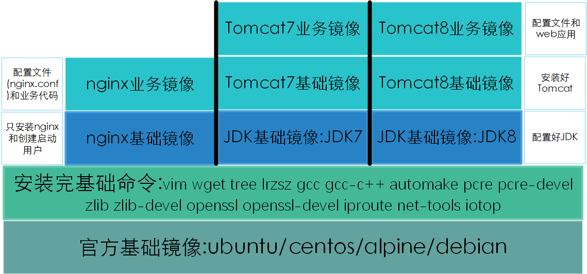

构建镜像必须有一个引用的父镜像，一般的基础镜像(父镜像)均使用 Linux 某
发行版官方提供的基础镜像，该基础镜像中包含了一个 Linux 操作用户空间所
需的所有命令和资源。之后的业务镜像就可以在基础镜像上一层一层的构建。

# 一. 手动构建 nginx 镜像

Docker 镜像的构建类似于虚拟机的模板制作，即：按照公司的实际业务需求将
需要安装的软件、相关配置等基础环境配置完成，然后将虚拟机再提交为模板，
最后再批量从模板批量创建新的虚拟机，这样可以极大的简化业务中相同环境的
虚拟机运行环境的部署工作。Docker 的镜像构建分为**手动构建**和**自动构建**(基于
DockerFile)，企业通常都是基于 Dockerfile 构建镜像。

手动构建镜像实际上就是在创建并运行的基础容器中安装相应的软件和配置好相
应的环境，并手动提交为新的镜像。大致过程如下:

## 1.1 从基础镜像运行容器

```bash
root@ubuntu-suosuoli-node1:~# docker run -it centos:7.7.1908 /bin/bash
[root@050de7864783 /]# yum install wget -y
[root@050de7864783 /]# wget -O /etc/yum.repos.d/CentOS-Base.repo http://mirrors.aliyun.com/repo/Centos-7.repo
[root@050de7864783 /]# wget -O /etc/yum.repos.d/epel.repo http://mirrors.aliyun.com/repo/epel-7.repo
```

## 1.2 在容器中安装配置 nginx

```bash
[root@050de7864783 /]# yum install nginx -y
[root@050de7864783 /]# yum install -y vim pcre pcre-devel zlib zlib-devel openssl openssl-devel iproute net-tools iotop
```

### 1.2.1 关闭 nginx 默认的后台运行

```bash
[root@050de7864783 /]# vim /etc/nginx/nginx.conf
user nginx;
worker_processes auto;
error_log /var/log/nginx/error.log;
pid /run/nginx.pid;
daemon off;  # 添加该行
...
```

### 1.2.2 编写测试网页

```html
[root@050de7864783 /]# vim /usr/share/nginx/html/index.html
<DOCTYPE html />
<head>
  <h1>Hello Docker Builder...</h1>
</head>
<body>
  <p>A test message...</p>
</body>
```

## 1.3 提交为镜像

```bash
# -a 指定镜像构建者信息，-m 指定注释信息，跟上容器ID，指定镜像仓库和标签TAG
root@ubuntu-suosuoli-node1:~# docker commit -a "stevenux <suosuoli.cn>" -m "test image" 050de7864783 nginx-1.16.1:manual-conf
sha256:ea0af8ce97fc19a779d881c26717814095578d44b73f051af33ae3ba33be6e9b
root@ubuntu-suosuoli-node1:~# docker images
REPOSITORY          TAG                 IMAGE ID            CREATED             SIZE
nginx-1.16.1        manual-conf         ea0af8ce97fc        11 seconds ago      453MB
```

## 1.4 从新构建的 nginx 镜像启动容器

```bash
root@ubuntu-suosuoli-node1:~# docker run -it -p 89:80 ea0af8ce97fc nginx
...
root@ubuntu-suosuoli-node1:~# ss -ntl | grep 89
LISTEN   0         20480                     *:89                     *:*
```

## 1.5 访问测试

访问`http://192.168.100.18:89/`
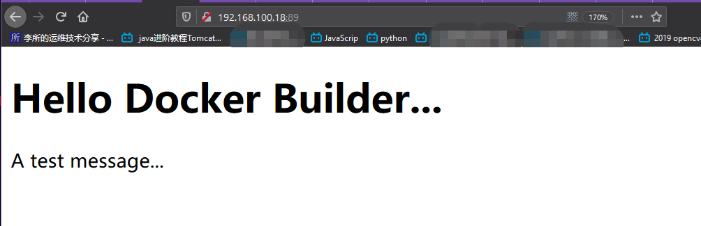

# 二. 基于 Dockerfile 构建编译版 nginx 容器

DockerFile 是一种可以被 Docker 程序解释的规格文件，DockerFile 由一条条命
令组成，每条命令对应 linux 下面的一条命令，Docker 程序将这些 Dockerfile
指令再翻译成真正的 linux 命令，其有自己的书写方式和支持的命令，Docker 程
序读取 DockerFile 并根据指令生成 Docker 镜像，相比手动制作镜像的方式，
DockerFile 更能直观的展示镜像是怎么产生的，有了写好的各种各样 DockerFile
文件，当后期某个镜像有额外的需求时，只要在之前的 DockerFile 添加或者修改
相应的操作即可重新生成新的 Docke 镜像，避免了重复手动制作镜像的麻烦。使用
Dockerfile 构建镜像大体分为后面涉及的步骤。

一般来说，在 Dockerfile 中能够调用的命令在普通的终端中都可以调用。
一般 Dockerfile 包括以下的指令，这些指令都是放在每行的开头：

```Dockerfile
FROM
FROM [--platform=<platform>] <image> [AS <name>]
Or
FROM [--platform=<platform>] <image>[:<tag>] [AS <name>]
Or
FROM [--platform=<platform>] <image>[@<digest>] [AS <name>]
# FROM 指令用于引用基础镜像(父镜像)，一般该指令位于Dockerfile的第一行(#开头的注释不算)，
# 但是ARG指令可以在FROM之前。

ARG
ARG <name>[=<default value>]
# ARG 指令用于声明变量，在使用docker build构建镜像时可以使用--build-arg <var>=<value>
# 来指定所声明的变量

RUN
# 该命令最常使用，用来运行常见的命令(在终端能用的命令其都能解析)。
# RUN 指令有两种形式来运行命令:
  # 1.使用shell运行命令:
RUN <command> :(默认使用/bin/sh -c运行该command，如果在windows则使用cmd /S /C运行该command)
  # 2. 使用可执行文件执行，该情况下不会调用shell，需要指定使用什么可执行文件来执行命令
RUN ["executable", "param1", "param2"] :(exec 形式)需要先指定一个可执行文件，再指定参数

ADD
ADD [--chown=<user>:<group>] <src>... <dest>
# ADD 指令用于向镜像添加文件或者目录，如果是打包和压缩格式(.tar.gz/.tar.xz/.tar.bz2)，则
# 该命令会解压，但是(.zip)文件在添加前需要先安装unzip工具。可以指定多个源，ADD 默认将这些
# 源的路径处理为在当前构建镜像的目录中，并且彼此之间是相对路径关系。


COPY
COPY [--chown=<user>:<group>] <src>... <dest>
# COPY 指令用于复制文件到镜像，不会解压。

ENV
ENV <key> <value>
ENV <key>=<value> ...
# ENV 指令用于设置镜像启动为容器时的环境变量。

EXPOSE
EXPOSE <port> [<port>/<protocol>...]
# 该指令用于向主机暴露端口，后面直接接端口，多个用空格分隔。


LABEL
LABEL <key>=<value> <key>=<value> <key>=<value> ...
# LABEL 用于指定该镜像的作者信息。
# 如:
LABEL "com.example.vendor"="ACME Incorporated"
LABEL com.example.label-with-value="foo"
LABEL version="1.0"
LABEL description="This text illustrates \
that label-values can span multiple lines."1

STOPSIGNAL
STOPSIGNAL signal
# 该指令用来设置使得容器退出的信号

USER
USER <user>[:<group>] or
USER <UID>[:<GID>]
# 用来指定在Dockerfile中的指令随后以什么身份运行，如果没有该用户，默认使用root
# 该指令一般不用

VOLUME
# 该指令用来创建一个挂载点，并标记为其挂载本地主机卷或者其它的容器卷。
VOLUME ["/data"]

WORKDIR
WORKDIR /path/to/workdir
# 为其后的RUN, CMD, ENTRYPOINT, COPY and ADD等指令设置工作文件夹，不存在则创建。
```

Dockerfile 的格式约定：

```Dockerfile
# Comment
INSTRUCTION arguments
```

`#` Dockerfile 使用#号作为注释符，在行中间的#号不视为注释，而视为参数
`INSTRUCTION` Dockerfile 指令，不区分大小写，约定使用大写
`arguments` 每个指令的参数，最常见的就是各种常用的 linux 基础命令

另外，第一行指令必须是`FROM`，指定该镜像时基于哪一个父镜像构建。

```Dockerfile
# test build
FROM centos:latest
RUN ...
RUN ...
```

除非使用`ARG`指令声明的变量，导致`FROM`指令不在第一行(真香:)

```Dockerfile
ARG  CODE_VERSION=latest
FROM base:${CODE_VERSION}
CMD  /code/run-app
...
```

`RUN`指令在 Dockerfile 中大量使用，一般用法是直接跟命令

```Dockerfile
# test build
FROM centos:latest

# 一般像下面这样使用
RUN /usr/bin/mkdir -p /usr/local/nginx/conf.d
RUN ...
```

但是也可以使用下面的格式，使用列表将命令和参数传给`RUN`指令

```Dockerfile
# test build
FROM centos:latest

# 也可以像下面这样使用
RUN ["/bin/bash", "-c", "/usr/bin/mkdir -p /usr/local/nginx/conf.d"]
RUN ...
```

更详细的用法参考官方说明:
[Dockerfile 的官方说明](https://docs.docker.com/engine/reference/builder/)
[编写 Dockerfile 最佳实践](https://docs.docker.com/develop/develop-images/dockerfile_best-practices/)

## 2.1 下载 centos 基础镜像

```bash
~$ docker pull centos:7.5.1804
```

## 2.2 编辑 Dockerfile

```bash
root@ubuntu-suosuoli-node1:/opt/dockerfile/nginx# vim Dockerfile
```

```Dockerfile
#Dcoker image for compile installation of nginx
#
FROM centos:7.5.1804

LABEL maintainer="stevenux <stevobs@162.com>"

ENV password stevenux

RUN rpm -ivh http://mirrors.aliyun.com/epel/epel-release-latest-7.noarch.rpm

RUN yum install -y vim wget tree lrzsz gcc gcc-c++ automake pcre pcre-devel zlib zlib-devel openssl openssl-devel iproute net-tools iotop

ADD nginx-1.16.1.tar.gz /usr/local/src

RUN cd /usr/local/src/nginx-1.16.1 && ./configure --prefix=/usr/local/nginx --with-http_sub_module && make && make install

RUN cd /usr/local/nginx

ADD nginx.conf /usr/local/nginx/conf/nginx.conf

RUN useradd nginx -s /sbin/nologin

RUN ln -sv /usr/local/nginx/sbin/nginx  /usr/sbin/nginx

# 用于访问验证是否成功
RUN echo "Hello Dockerfile ..." >  /usr/local/nginx/html/index.html

EXPOSE 80 443

CMD ["nginx","-g","daemon off;"]
# 指定基于该镜像启动容器后容器执行的运行的命令，每个Dockerfile只能有一条，
# 如果有多条则只有最后一条被执行
```

如果在从该镜像启动容器的时候也指定了命令，那么指定的命令会覆盖 Dockerfile
构建的镜像里面的 CMD 命令，即指定的命令优先级更高，Dockerfile 的优先级较
低一些。

## 2.3 准备源码包和配置文件

```bash
root@ubuntu-suosuoli-node1:/opt/dockerfile/nginx# cp  /etc/nginx/nginx.conf .
root@ubuntu-suosuoli-node1:/opt/dockerfile/nginx# cp  /usr/local/src/nginx-1.16.1.tar.gz .
root@ubuntu-suosuoli-node1:/opt/dockerfile/nginx# ll
total 1028
drwxr-xr-x 2 root root    4096 Feb 18 20:37 ./
drwxr-xr-x 3 root root    4096 Feb 17 17:02 ../
-rw-r--r-- 1 root root     816 Feb 18 20:36 Dockerfile
-rw-r--r-- 1 root root 1032630 Aug 14  2019 nginx-1.16.1.tar.gz
-rw-r--r-- 1 root root    1191 Feb 18 20:37 nginx.conf
```

## 2.4 构建镜像

使用`docker build`命令构建镜像，构建镜像时该命令需要指定 Dockerfile 和
构建镜像所需要的上下文(_context_)，这里的上下文就是构建过程需要的各种文件。
构建镜像详细说明参看: [Docker-builder](https://docs.docker.com/engine/reference/builder/#usage)

```bash
# -t 选项给新镜像指定仓库和标签(REPOSITORY:TAG)
# 该种用法表示dockerd会在当前目录找需要的上下文(文件)和Dockerfile
# 也可以使用-f选项指定Dockerfile文件位置

root@ubuntu-suosuoli-node1:/opt/dockerfile/nginx# docker build -t nginx:compiled_V1 .
Sending build context to Docker daemon  1.039MB
Step 1/14 : FROM centos:7.5.1804
 ---> cf49811e3cdb
Step 2/14 : LABEL maintainer="stevenux <stevobs@162.com>"
 ---> Running in 00f9fae0f5fe
Removing intermediate container 00f9fae0f5fe
 ---> 12d365a0162e
Step 3/14 : ENV password stevenux
 ---> Running in 2271956bb388
Removing intermediate container 2271956bb388
 ---> f771bcb591ad
Step 4/14 : RUN rpm -ivh http://mirrors.aliyun.com/epel/epel-release-latest-7.noarch.rpm
 ---> Running in 12373ad5079a
warning: /var/tmp/rpm-tmp.siJhRs: Header V3 RSA/SHA256 Signature, key ID 352c64e5: NOKEY
Retrieving http://mirrors.aliyun.com/epel/epel-release-latest-7.noarch.rpm
Preparing...                          ########################################
Updating / installing...
epel-release-7-12                     ########################################
Removing intermediate container 12373ad5079a
 ---> c0b0db2997df
Step 5/14 : RUN yum install -y vim wget tree lrzsz gcc gcc-c++ automake pcre pcre-devel zlib zlib-devel openssl openssl-devel iproute net-tools iotop
 ---> Running in d780b565a3ed
Loaded plugins: fastestmirror, ovl
....
 libselinux               x86_64   2.5-14.1.el7                 base      162 k
 libsepol                 x86_64   2.5-10.el7                   base      297 k
 libstdc++                x86_64   4.8.5-39.el7                 base      305 k
 openssl-libs             x86_64   1:1.0.2k-19.el7              base      1.2 M

Transaction Summary
================================================================================
Install  14 Packages (+57 Dependent packages)
Upgrade   1 Package  (+ 9 Dependent packages)

Total download size: 87 M
Downloading packages:
Delta RPMs disabled because /usr/bin/applydeltarpm not installed.
warning: /var/cache/yum/x86_64/7/base/packages/autoconf-2.69-11.el7.noarch.rpm: Header V3 RSA/SHA256 Signature, key ID f4a80eb5: NOKEY
Public key for autoconf-2.69-11.el7.noarch.rpm is not installed
Public key for iproute-4.11.0-25.el7_7.2.x86_64.rpm is not installed
--------------------------------------------------------------------------------
Total                                              5.1 MB/s |  87 MB  00:17
Retrieving key from file:///etc/pki/rpm-gpg/RPM-GPG-KEY-CentOS-7
Importing GPG key 0xF4A80EB5:
 Userid     : "CentOS-7 Key (CentOS 7 Official Signing Key) <security@centos.org>"
 Fingerprint: 6341 ab27 53d7 8a78 a7c2 7bb1 24c6 a8a7 f4a8 0eb5
 Package    : centos-release-7-5.1804.el7.centos.2.x86_64 (@Updates)
 From       : /etc/pki/rpm-gpg/RPM-GPG-KEY-CentOS-7
Running transaction check
Running transaction test
Transaction test succeeded
Running transaction
Warning: RPMDB altered outside of yum.
  Updating   : libgcc-4.8.5-39.el7.x86_64                                  1/91
  Updating   : glibc-common-2.17-292.el7.x86_64                            2/91
  Updating   : glibc-2.17-292.el7.x86_64                                   3/91
warning: /etc/nsswitch.conf created as /etc/nsswitch.conf.rpmnew
  Updating   : libsepol-2.5-10.el7.x86_64                                  4/91
  Updating   : libselinux-2.5-14.1.el7.x86_64                              5/91
  Updating   : zlib-1.2.7-18.el7.x86_64                                    6/91
  Updating   : libcom_err-1.42.9-16.el7.x86_64                             7/91
  Updating   : krb5-libs-1.15.1-37.el7_7.2.x86_64                          8/91
  Updating   : 1:openssl-libs-1.0.2k-19.el7.x86_64                         9/91
  Installing : mpfr-3.1.1-4.el7.x86_64                                    10
...
Complete!
Removing intermediate container d780b565a3ed
 ---> fb2c51b33216
Step 6/14 : ADD nginx-1.16.1.tar.gz /usr/loca/src
 ---> 5e697cda1948
Step 7/14 : RUN cd /usr/local/src/nginx-1.16.1 && ./configure --prefix=/usr/local/nginx --with-http_sub_module && make && make install
...
make[1]: Leaving directory \`/usr/local/src/nginx-1.16.1\'
Removing intermediate container c79455be701c
 ---> e4aa1a503b24
Step 8/14 : RUN cd /usr/local/nginx
 ---> Running in c3f24a142265
Removing intermediate container c3f24a142265
 ---> e5dff5f09090
Step 9/14 : ADD nginx.conf /usr/local/nginx/conf/nginx.conf
 ---> f92ac9370f29
Step 10/14 : RUN useradd nginx -s /sbin/nologin
 ---> Running in 7a2a3ffb53d0
Removing intermediate container 1add64d0188d
 ---> 16bd33437886
Step 11/14 : RUN ln -sv /usr/local/nginx/sbin/nginx  /usr/sbin/nginx
 ---> Running in ddba17241ebb
'/usr/sbin/nginx' -> '/usr/local/nginx/sbin/nginx'
Removing intermediate container ddba17241ebb
 ---> ec187f44b1cf
Step 12/14 : RUN echo "Hello Dockerfile ..." >  /usr/local/nginx/html/index.html
 ---> Running in 541dca1cc8b7
Removing intermediate container 541dca1cc8b7
 ---> 87e89f282a7a
Step 13/14 : EXPOSE 80 443
 ---> Running in 182f3e521c4f
Removing intermediate container 182f3e521c4f
 ---> a88f1d3f2a49
Step 14/14 : CMD ["nginx","-g","daemon off;"]
 ---> Running in aefc2c31d3e3
Removing intermediate container aefc2c31d3e3
 ---> 822e70d583d2
Successfully built 822e70d583d2
Successfully tagged nginx:compiled_V1
# 构建完成
```

**使用 ARG 声明变量，在构建时指定变量值**

```Dockerfile
# 使用ARG声明一个叫base_version的变量
#Dcoker image for compile installation of nginx
#
ARG base_version
  # 定义变量
#FROM centos:7.5.1804
FROM  ${base_version}
  # 使用变量

LABEL maintainer="stevenux <stevobs@162.com>"

ENV password stevenux
......
```

```bash
# 使用--build-arg 指定变量base_version的值为centos:7.7.1908
root@ubuntu-suosuoli-node1:/opt/dockerfile/nginx# docker build --build-arg base_version=centos:7.7.1908 -t nginx-test:vv1 .
Sending build context to Docker daemon  1.039MB
Step 1/15 : ARG base_version       # 定义变量
Step 2/15 : FROM  ${base_version}  # 使用变量
7.7.1908: Pulling from library/centos
...
---> aa531daef1cd
Step 9/15 : RUN cd /usr/local/nginx
 ---> Running in 1e4070c24c72
Removing intermediate container 1e4070c24c72
 ---> 70fc85320373
Step 10/15 : ADD nginx.conf /usr/local/nginx/conf/nginx.conf
 ---> 1953b81db181
Step 11/15 : RUN useradd nginx -s /sbin/nologin
 ---> Running in 178a0ff62ef1
Removing intermediate container 178a0ff62ef1
 ---> 693eae1a03cb
Step 12/15 : RUN ln -sv /usr/local/nginx/sbin/nginx  /usr/sbin/nginx
 ---> Running in 408d803b1352
'/usr/sbin/nginx' -> '/usr/local/nginx/sbin/nginx'
Removing intermediate container 408d803b1352
 ---> a93056af39a6
Step 13/15 : RUN echo "Hello Dockerfile ..." >  /usr/local/nginx/html/index.html
 ---> Running in f6ac3babc03c
Removing intermediate container f6ac3babc03c
 ---> 6ff5a5c1ac5e
Step 14/15 : EXPOSE 80 443
 ---> Running in 9bac6113af35
Removing intermediate container 9bac6113af35
 ---> a49aff869e33
Step 15/15 : CMD ["nginx","-g","daemon off;"]
 ---> Running in 5ba193eb06af
Removing intermediate container 5ba193eb06af
 ---> dfaa34493376
Successfully built dfaa34493376
Successfully tagged nginx-test:vv
```

## 2.5 查看已构建镜像

```bash
root@ubuntu-suosuoli-node1:/opt/dockerfile/nginx# ll
total 1028
drwxr-xr-x 2 root root    4096 Feb 18 20:58 ./
drwxr-xr-x 3 root root    4096 Feb 17 17:02 ../
-rw-r--r-- 1 root root     812 Feb 18 20:58 Dockerfile
-rw-r--r-- 1 root root 1032630 Aug 14  2019 nginx-1.16.1.tar.gz
-rw-r--r-- 1 root root    2654 Feb 18 20:42 nginx.conf
root@ubuntu-suosuoli-node1:/opt/dockerfile/nginx# docker images
REPOSITORY          TAG                 IMAGE ID            CREATED             SIZE
nginx               compiled_V1         822e70d583d2        2 minutes ago       563MB
...
```

## 2.6 从构建的镜像启动容器

```bash
# 单次运行查看容器情况
root@ubuntu-suosuoli-node1:~# docker run -it --rm nginx:compiled_V1 /bin/bash
[root@adce69f564d7 /]# ls
bin  dev  etc  home  lib  lib64  media  mnt  opt  proc  root  run  sbin  srv  sys  tmp  usr  var
[root@adce69f564d7 /]# cat /etc/hosts
127.0.0.1	localhost
...
172.17.0.2	adce69f564d7

# 测试nginx是否可以启动
[root@adce69f564d7 /]# ss -ntl
State       Recv-Q Send-Q                             Local Address:Port                                            Peer Address:Port
[root@adce69f564d7 /]# /usr/local/nginx/sbin/nginx
[root@adce69f564d7 /]# ss -ntl
State       Recv-Q Send-Q                             Local Address:Port                                            Peer Address:Port
LISTEN      0      128                                            *:80                                                         *:*
[root@adce69f564d7 /]# exit
exit
```

后台启动容器

```bash
root@ubuntu-suosuoli-node1:~# docker run -it -d -p 80:80 nginx:compiled_V1
c77859511f2f67c8f0afaef13e5c343255834262ab9cdcdd18957d5dccbd07b6
root@ubuntu-suosuoli-node1:~# ss -ntl | grep 80
LISTEN   0         20480                     *:80                     *:*
```

## 2.7 访问测试

```bash
root@ubuntu-suosuoli-node1:~# docker ps
CONTAINER ID        IMAGE               COMMAND                  CREATED             STATUS              PORTS                         NAMES
c77859511f2f        nginx:compiled_V1   "nginx -g 'daemon of…"   2 minutes ago       Up 2 minutes        0.0.0.0:80->80/tcp, 443/tcp   hungry_buck
root@ubuntu-suosuoli-node1:~# docker exec -it c77859511f2f bash
[root@c77859511f2f /]# cd /usr/local/nginx/html/
[root@c77859511f2f html]# cat index.html
Hello Dockerfile ...
```

访问`http://192.168.100.10/`

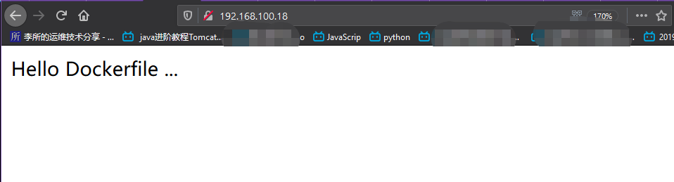

## 2.8 在构建镜像时 Docker 启动了相应的容器

Docker 在构建镜像时，实际上启动了相应的容器，每运行一个 Dockerfile 中的指令
就相当于新开了一个镜像(中间层)，最后一条指令运行后会将运行的容器提交为镜像。
下面就记录了不同的镜像构建时间，镜像的 ID 会不同，也就是每运行一个指令，镜像
ID 就变一次。

```bash
root@ubuntu-suosuoli-node1:~# docker ps
CONTAINER ID        IMAGE               COMMAND                  CREATED             STATUS              PORTS                         NAMES
74800343304b        f502aa82328d        "/bin/sh -c 'yum ins…"   8 seconds ago       Up 6 seconds                                      adoring_galois
c77859511f2f        nginx:compiled_V1   "nginx -g 'daemon of…"   About an hour ago   Up About an hour    0.0.0.0:80->80/tcp, 443/tcp   hungry_buc
root@ubuntu-suosuoli-node1:~# docker ps
CONTAINER ID        IMAGE               COMMAND                  CREATED             STATUS              PORTS                         NAMES
3a19b0b93712        f8e68bc8cd49        "/bin/sh -c 'cd /usr…"   7 seconds ago       Up 7 seconds                                      zen_lichterman
c77859511f2f        nginx:compiled_V1   "nginx -g 'daemon of…"   About an hour ago   Up About an hour    0.0.0.0:80->80/tcp, 443/tcp   hungry_buck
root@ubuntu-suosuoli-node1:~# docker ps
CONTAINER ID        IMAGE               COMMAND                  CREATED                  STATUS                  PORTS                         NAMES
be1d169e37c7        226d41dcdf74        "/bin/sh -c 'useradd…"   Less than a second ago   Up Less than a second                                 suspicious_meninsky
c77859511f2f        nginx:compiled_V1   "nginx -g 'daemon of…"   About an hour ago        Up About an hour        0.0.0.0:80->80/tcp, 443/tcp   hungry_buck
```

# 三. 手动构建编译版 nginx 镜像

## 3.1 下载并初始化系统

```bash
[root@docker-server-node1 ~]# docker pull centos
[root@539100addad3 /]# yum install wget -y
[root@539100addad3 /]# rm /etc/yum.repos.d/*
rm: remove regular file '/etc/yum.repos.d/CentOS-AppStream.repo'? y
rm: remove regular file '/etc/yum.repos.d/CentOS-Base.repo'? y
rm: remove regular file '/etc/yum.repos.d/CentOS-CR.repo'? y
rm: remove regular file '/etc/yum.repos.d/CentOS-Debuginfo.repo'? y
rm: remove regular file '/etc/yum.repos.d/CentOS-Extras.repo'? y
rm: remove regular file '/etc/yum.repos.d/CentOS-HA.repo'? y
rm: remove regular file '/etc/yum.repos.d/CentOS-Media.repo'? y
rm: remove regular file '/etc/yum.repos.d/CentOS-PowerTools.repo'? y
rm: remove regular file '/etc/yum.repos.d/CentOS-Sources.repo'? y
rm: remove regular file '/etc/yum.repos.d/CentOS-Vault.repo'? y
rm: remove regular file '/etc/yum.repos.d/CentOS-centosplus.repo'? y
rm: remove regular file '/etc/yum.repos.d/CentOS-fasttrack.repo'? y
[root@539100addad3 /]# wget -O /etc/yum.repos.d/CentOS-Base.repo http://mirrors.aliyun.com/repo/Centos-7.repo
[root@539100addad3 /]# wget -O /etc/yum.repos.d/epel.repo http://mirrors.aliyun.com/repo/epel-7.repo
```

## 3.2 在容器编译安装 nginx

```bash
[root@539100addad3 /]# yum install -y vim gcc gcc-c++ automake lrzsz pcre pcre-devel zlib zlib-devel openssl openssl-devel iproute net-tools iotop
[root@539100addad3 /]# wget http://nginx.org/download/nginx-1.16.1.tar.gz
[root@539100addad3 /]# tar xvf nginx-1.16.1.tar.gz
[root@539100addad3 /]# cd nginx-1.16.1
[root@539100addad3 nginx-1.16.1]# ./configure  --prefix=/apps/nginx --with-http_sub_module
[root@539100addad3 nginx-1.16.1]# make && make install
```

## 3.3 nginx 配置

### 3.3.1 关闭后台运行

```bash
[root@539100addad3 nginx-1.16.1]# cd /apps/nginx
[root@539100addad3 nginx]# vim conf/nginx.conf
user  nginx;
worker_processes  auto;
daemon off; # 新增该行
...
[root@b0156a9f4868 nginx]# ln -sv /apps/nginx/sbin/nginx /usr/sbin/nginx
'/usr/sbin/nginx' -> '/apps/nginx/sbin/nginx'
```

### 3.3.2 定义 html 测试界面

```bash
[root@b0156a9f4868 nginx]# vim html/index.html
```

```html
<DOCTYPE html />
<head>
  <h1>Hello Docker Builder...</h1>
</head>
<body>
  <p>A test message...</p>
</body>
```

### 3.3.3 创建用户和授权

```bash
[root@b0156a9f4868 nginx]# useradd -u 2020 nginx -s /sbin/nologin
[root@b0156a9f4868 /]# chown nginx.nginx /apps/nginx/ -R
```

## 3.4 新开终端提交为镜像

```bash
root@ubuntu-suosuoli-node1:~# docker commit -a "stevenux <suousoli.cn>" -m "a test image" b0156a9f4868 nginx:manual-compile-v3
sha256:f81c6c3f2e46d5e27fbe6d252338b6695801a12bd624deca777a2f89efff8a54
root@ubuntu-suosuoli-node1:~# docker images
REPOSITORY          TAG                 IMAGE ID            CREATED             SIZE
nginx               manual-compile-v3   f81c6c3f2e46        7 seconds ago       542MB
......
```

## 3.5 启动镜像

```bash
root@ubuntu-suosuoli-node1:~# docker run -it -p 82:80 nginx:manual-compile-v3 nginx
...
```

## 3.6 访问测试查看日志

```bash
root@ubuntu-suosuoli-node1:~# docker run -it -d -p 84:80 nginx:manual-compile-v3 nginx
d2ceba05eaff51fbf09a6e2cb5977c7892d5d1be42c877b11cd9101561d4c2f4
root@ubuntu-suosuoli-node1:~# docker logs -f d2ceba05eaff
...
```

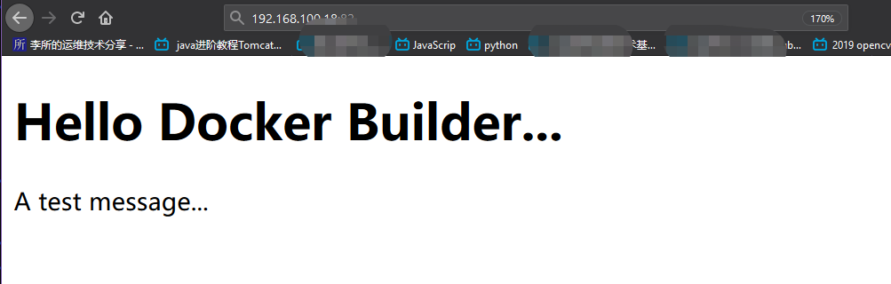

# 四. 构建 Tomcat 业务镜像

在构建基于 tomcat 的业务镜像时，首先需要基于官方提供的 centos、debain、ubuntu、
alpine 等基础镜像构建 JDK(Java 环境)，然后再基于自定义的 JDK 镜像构建出业务需
要的 tomcat 镜像。

## 4.1 构建 JDK 镜像

先基于官方提供的基础镜像，制作出安装了常用命令的自定义基础镜像，然后
在基础镜像的基础之上，再制作 JDK 镜像、Tomcat 镜像等。业务镜像存放目录
规整:

```bash
root@ubuntu-suosuoli-node1:~# mkdir -pv /opt/dockerfile/{web/{nginx,tomcat,jdk,apache},system/{centos,ubuntu,redhat}}
mkdir: created directory '/opt/dockerfile/web'
mkdir: created directory '/opt/dockerfile/web/nginx'
mkdir: created directory '/opt/dockerfile/web/tomcat'
mkdir: created directory '/opt/dockerfile/web/jdk'
mkdir: created directory '/opt/dockerfile/web/apache'
mkdir: created directory '/opt/dockerfile/system'
mkdir: created directory '/opt/dockerfile/system/centos'
mkdir: created directory '/opt/dockerfile/system/ubuntu'
mkdir: created directory '/opt/dockerfile/system/redhat'
```

### 4.1.1 自定义 Centos 基础镜像

编写 Dockerfile 和构建脚本

```bash
root@ubuntu-suosuoli-node1:~# docker pull centos:7.7.1908
root@ubuntu-suosuoli-node1:~# cd /opt/dockerfile/system/centos
root@ubuntu-suosuoli-node1:/opt/dockerfile/system/centos#
# Dockerfile
root@ubuntu-suosuoli-node1:/opt/dockerfile/system/centos# vim Dockerfile
```

```Dockerfile
# CentOS base image , installed tools and created www user.

ARG base_version

FROM centos:7.7.1908

LABEL author="lisuo" \
      personal_site="www.suosuoli.cn" \
      contact="stvobs@163.com"

RUN rpm -ivh http://mirrors.aliyun.com/epel/epel-release-latest-7.noarch.rpm
        # install epel repo from aliyun.com

RUN yum install -y vim wget tree lrzsz gcc gcc-c++ automake pcre pcre-devel \
    zlib zlib-devel openssl openssl-devel iproute net-tools iotop
        # install basic tools for centos

RUN groupadd www -g 2020 && useradd www -u 2020 -g www
        # create www user and www group

```

```bash
# 构建脚本
root@ubuntu-suosuoli-node1:/opt/dockerfile/system/centos# vim docker_build_cmd.sh
#!/bin/bash

V="centos:7.7.1908"

docker build -t centos-base:v1 .  # 注意在当前目录构建
```

构建过程

```bash
root@ubuntu-suosuoli-node1:/opt/dockerfile/system/centos# ./docker_build_cmd.sh
Sending build context to Docker daemon  3.584kB
Step 1/6 : ARG base_version
Step 2/6 : FROM centos:7.7.1908
 ---> 08d05d1d5859
Step 3/6 : LABEL author="lisuo"       personal_site="www.suosuoli.cn"       contact="stvobs@163.com"
 ---> Running in 43fd20c3e2ba
Removing intermediate container 43fd20c3e2ba
 ---> 87c12413ee59
Step 4/6 : RUN rpm -ivh http://mirrors.aliyun.com/epel/epel-release-latest-7.noarch.rpm
 ---> Running in c3eed48eba73
warning: /var/tmp/rpm-tmp.2X82F7: Header V3 RSA/SHA256 Signature, key ID 352c64e5: NOKEY
Retrieving http://mirrors.aliyun.com/epel/epel-release-latest-7.noarch.rpm
Preparing...                          ########################################
Updating / installing...
epel-release-7-12                     ########################################
Removing intermediate container c3eed48eba73
 ---> 585b9252a591
Step 5/6 : RUN yum install -y vim wget tree lrzsz gcc gcc-c++ automake pcre pcre-devel     zlib zlib-devel openssl openssl-devel iproute net-tools iotop
 ---> Running in 57ec83f08c94
......
Complete!
Removing intermediate container 57ec83f08c94
 ---> a688bd86dcb4
Step 6/6 : RUN groupadd www -g 2020 && useradd www -u 2020 -g www
 ---> Running in 9c6678f15eed
Removing intermediate container 9c6678f15eed
 ---> 729c515f2078
Successfully built 729c515f2078
Successfully tagged centos-base:v1
```

查看构建的 centos 基础镜像

```bash
root@ubuntu-suosuoli-node1:/opt/dockerfile/system/centos# docker images
REPOSITORY          TAG                 IMAGE ID            CREATED             SIZE
centos-base         v1                  729c515f2078        4 minutes ago       516MB
```

### 4.1.2 基于 Centos 基础镜像构建 JDK 镜像

#### 准备 Dockerfile 文件

```bash
root@ubuntu-suosuoli-node1:/opt/dockerfile/system/centos# cd /opt/dockerfile/web/jdk/
root@ubuntu-suosuoli-node1:/opt/dockerfile/web/jdk# vim Dockerfile
```

```Dockerfile
# JDK base image , based on centos-base:v1

FROM centos-base:v1

LABEL author="lisuo" \
      personal_site="www.suosuoli.cn" \
      contact="stvobs@163.com"

ADD jdk-8u241-linux-x64.tar.gz /usr/local/src

RUN ln -sv /usr/local/src/jdk1.8.0_241 /usr/local/jdk

ADD profile /etc/profile

ENV JAVA_HOME /usr/local/jdk
ENV JRE_HOME $JAVA_HOME/jre
ENV CLASSPATH $JAVA_HOME/lib:$JRE_HOME/lib
ENV PATH $PATH:$JAVA_HOME/bin
	# set java related env var

RUN rm -rf /etc/localtime && ln -snf /usr/share/zoneinfo/Asia/Shanghai /etc/localtime \
     && echo "Asia/Shanghai" > /etc/timezone
	# set time zone to Shanghai
```

#### 准备 JDK 和 profile 文件

```bash
root@ubuntu-suosuoli-node1:/opt/dockerfile/web/jdk# cp /etc/profile .
oot@ubuntu-suosuoli-node1:/opt/dockerfile/web/jdk# rz

root@ubuntu-suosuoli-node1:/opt/dockerfile/web/jdk# vim profile
# /etc/profile: system-wide .profile file for the Bourne shell (sh(1))
# and Bourne compatible shells (bash(1), ksh(1), ash(1), ...).

if [ "${PS1-}" ]; then
  if [ "${BASH-}" ] && [ "$BASH" != "/bin/sh" ]; then
    # The file bash.bashrc already sets the default PS1.
    # PS1='\h:\w\$ '
    if [ -f /etc/bash.bashrc ]; then
      . /etc/bash.bashrc
    fi
  else
    if [ "`id -u`" -eq 0 ]; then
      PS1='# '
    else
      PS1='$ '
    fi
  fi
fi

if [ -d /etc/profile.d ]; then
  for i in /etc/profile.d/*.sh; do
    if [ -r $i ]; then
      . $i
    fi
  done
  unset i
fi

export JAVA_HOME="/usr/local/jdk"
export JRE_HOME="$JAVA_HOME/jre"
export CLASSPATH="$JAVA_HOME/lib:$JRE_HOME/lib"
export PATH="$PATH:$JAVA_HOME/bin"
```

#### 准备构建脚本

```bash
root@ubuntu-suosuoli-node1:/opt/dockerfile/web/jdk# vim docker_build_cmd.sh
#!/bin/bash

docker build -t jdk-base:v8.241 .
```

#### 构建

```bash
root@ubuntu-suosuoli-node1:/opt/dockerfile/web/jdk# ll
total 190008
drwxr-xr-x 2 root root      4096 Feb 20 12:50 ./
drwxr-xr-x 6 root root      4096 Feb 20 11:03 ../
-rwxr--r-- 1 root root        47 Feb 20 12:50 docker_build_cmd.sh*
-rw-r--r-- 1 root root       611 Feb 20 11:56 Dockerfile
-rw-r--r-- 1 root root 194545143 Feb 20 11:35 jdk-8u241-linux-x64.tar.gz
-rw-r--r-- 1 root root       581 Feb 20 11:37 profile
# 构建
root@ubuntu-suosuoli-node1:/opt/dockerfile/web/jdk# ./docker_build_cmd.sh
Sending build context to Docker daemon  194.6MB
Step 1/10 : FROM centos-base:v1
 ---> 729c515f2078
Step 2/10 : LABEL author="lisuo"       personal_site="www.suosuoli.cn"       contact="stvobs@163.com"
 ---> Running in 86760ed2b137
Removing intermediate container 86760ed2b137
 ---> 5f6721f7d9eb
Step 3/10 : ADD jdk-8u241-linux-x64.tar.gz /usr/local/src
 ---> 1924ae1af0de
Step 4/10 : RUN ln -sv /usr/local/src/jdk1.8.0_241 /usr/local/jdk
 ---> Running in a9eca65d8f49
'/usr/local/jdk' -> '/usr/local/src/jdk1.8.0_241'
Removing intermediate container a9eca65d8f49
 ---> b696fc30074f
Step 5/10 : ADD profile /etc/profile
 ---> a0d89276d7a0
Step 6/10 : ENV JAVA_HOOME /usr/local/src
 ---> Running in 9d0fdeb9c9dd
Removing intermediate container 9d0fdeb9c9dd
 ---> 1c962aab7af9
Step 7/10 : ENV JRE_HOME $JAVA_HOME/jre
 ---> Running in 85672fca9e04
Removing intermediate container 85672fca9e04
 ---> 2759c102c690
Step 8/10 : ENV CLASSPATH $JAVA_HOME/lib:$JRE_HOME/lib
 ---> Running in 5ee8a9756418
Removing intermediate container 5ee8a9756418
 ---> bb43237cf9ed
Step 9/10 : ENV PATH $PATH:$JAVA_HOME/bin
 ---> Running in fe7937669096
Removing intermediate container fe7937669096
 ---> ca4f987b24bc
Step 10/10 : RUN rm -rf /etc/localtime && ln -snf /usr/share/zoneinfo/Asia/Shanghai /etc/localtime      && echo "Asia/Shanghai" > /etc/timezone
 ---> Running in 23fd459f9d9b
Removing intermediate container 23fd459f9d9b
 ---> 5c8b2c3c4ab4
Successfully built 5c8b2c3c4ab4
Successfully tagged jdk-base:v8.241
# 构建成功
```

#### 查看构建的镜像

```bash
root@ubuntu-suosuoli-node1:/opt/dockerfile/web/jdk# docker images
REPOSITORY          TAG                 IMAGE ID            CREATED              SIZE
jdk-base            v8.241              5c8b2c3c4ab4        About a minute ago   920MB
...
```

#### 启动容器进入验证 JKD 环境

```bash
root@ubuntu-suosuoli-node1:/opt/dockerfile/web/jdk# docker run -it jdk-base:v8.241 /bin/bash
root@ubuntu-suosuoli-node1:~# docker run -it jdk-base:v8.241 /bin/bash
[root@b55598ba7fcd /]# java -version  # 验证java版本
java version "1.8.0_241"
Java(TM) SE Runtime Environment (build 1.8.0_241-b07)
Java HotSpot(TM) 64-Bit Server VM (build 25.241-b07, mixed mode)

[root@b55598ba7fcd /]# env   # 查看环境变量
HOSTNAME=b55598ba7fcd
TERM=xterm
JRE_HOME=/usr/local/jdk/jre
PATH=/usr/local/sbin:/usr/local/bin:/usr/sbin:/usr/bin:/sbin:/bin:/usr/local/jdk/bin
PWD=/
JAVA_HOME=/usr/local/jdk
SHLVL=1
HOME=/root
CLASSPATH=/usr/local/jdk/lib:/usr/local/jdk/jre/lib
_=/usr/bin/env

[root@b55598ba7fcd /]# ll /etc/profile  # 查看profile文件
-rw-r--r-- 1 root root 581 Feb 20 11:37 /etc/profile
[root@b55598ba7fcd /]# date  # 验证时间是否同步
Thu Feb 20 13:00:06 CST 2020
[root@b55598ba7fcd /]# exit
exit
root@ubuntu-suosuoli-node1:~# date
Thu Feb 20 13:00:10 CST 2020
```

## 4.2 基于 JDK 镜像构建 Tomcat8 镜像

基于前面自定义的 JDK 基础镜像，构建出通用的自定义 Tomcat 基础镜像，此镜像后
期会被多个业务的多个服务共同引用(这些业务的运行环境需要相同的 JDK 版本和 相同
的 Tomcat 版本)。

### 4.2.1 编辑 Dockerfile

```Dockerfile
root@ubuntu-suosuoli-node1:/opt/dockerfile/web/jdk# cd /opt/dockerfile/web/tomcat/
root@ubuntu-suosuoli-node1:/opt/dockerfile/web/tomcat# vim Dockerfile
# A tomcat image for many businesses.

FROM jdk-base:v8.241

LABEL author="lisuo" \
      personal_site="www.suosuoli.cn" \
      contact="stvobs@163.com"

        # set some env vars
ENV TZ "Asia/Shanghai"
ENV LANG en_US.UTF-8
ENV TOMCAT_MAJOR_VERSION 8
ENV TOMCAT_MINOR_VERSION 5.42
ENV CATALINA_HOME /apps/tomcat
ENV APP_DIR ${CATALINA_HOME}/webapps

        # install tomcat binary package
RUN mkdir /apps
ADD apache-tomcat-8.5.42.tar.gz /apps
RUN ln -sv /apps/apache-tomcat-8.5.42 /apps/tomcat

```

### 4.2.2 准备 tomcat 二进制包和构建脚本

```bash
# 上传tomcat二进制包
root@ubuntu-suosuoli-node1:/opt/dockerfile/web/tomcat# rz
# 构建脚本
root@ubuntu-suosuoli-node1:/opt/dockerfile/web/tomcat# vim docker_build_cmd.sh
#!/bin/bash
docker build -t tomcat-base:v8.5.42 .

# 加执行权限
root@ubuntu-suosuoli-node1:/opt/dockerfile/web/tomcat# chmod u+x docker_build_cmd.sh
root@ubuntu-suosuoli-node1:/opt/dockerfile/web/tomcat# ll
total 9504
drwxr-xr-x 2 root root    4096 Feb 20 13:15 ./
drwxr-xr-x 6 root root    4096 Feb 20 11:03 ../
-rw-r--r-- 1 root root 9711748 Jun 20  2019 apache-tomcat-8.5.42.tar.gz
-rwxr--r-- 1 root root      51 Feb 20 13:15 docker_build_cmd.sh*
-rw-r--r-- 1 root root     487 Feb 20 13:13 Dockerfile
```

### 4.2.3 构建镜像

```bash
root@ubuntu-suosuoli-node1:/opt/dockerfile/web/tomcat# ./docker_build_cmd.sh
Sending build context to Docker daemon  9.716MB
Step 1/11 : FROM jdk-base:v8.241
 ---> 4f1fb65abaa9
Step 2/11 : LABEL author="lisuo"       personal_site="www.suosuoli.cn"       contact="stvobs@163.com"
 ---> Running in 9d24cc1f0c36
Removing intermediate container 9d24cc1f0c36
 ---> f1cc0285407d
Step 3/11 : ENV TZ "Asia/Shanghai"
 ---> Running in 57a9f772e7d2
Removing intermediate container 57a9f772e7d2
 ---> abce9e0ec715
Step 4/11 : ENV LANG en_US.UTF-8
 ---> Running in fbc607909892
Removing intermediate container fbc607909892
 ---> 954c9022af3f
Step 5/11 : ENV TOMCAT_MAJOR_VERSION 8
 ---> Running in 070ad1b15355
Removing intermediate container 070ad1b15355
 ---> a9660fd584c4
Step 6/11 : ENV TOMCAT_MINOR_VERSION 5.42
 ---> Running in 08a6a9d9046d
Removing intermediate container 08a6a9d9046d
 ---> fe01a38a4ed9
Step 7/11 : ENV CATALINA_HOME /apps/tomcat
 ---> Running in afb6db32e1b0
Removing intermediate container afb6db32e1b0
 ---> f9fb9ca78011
Step 8/11 : ENV APP_DIR ${CATALINA_HOME}/webapps
 ---> Running in c65049d0f27a
Removing intermediate container c65049d0f27a
 ---> 765751fe27df
Step 9/11 : RUN mkdir /apps
 ---> Running in 174344b75f7f
Removing intermediate container 174344b75f7f
 ---> 584d097c1e71
Step 10/11 : ADD apache-tomcat-8.5.42.tar.gz /apps
 ---> 3993686c2214
Step 11/11 : RUN ln -sv /apps/apache-tomcat-8.5.42 /apps/tomcat
 ---> Running in a8adc593d93f
‘/apps/tomcat’ -> ‘/apps/apache-tomcat-8.5.42’
Removing intermediate container a8adc593d93f
 ---> d3ab7ee79ae4
Successfully built d3ab7ee79ae4
Successfully tagged tomcat-base:v8.5.42
# 构建成功
```

### 4.2.4 验证

查看镜像和启动为容器

```bash
root@ubuntu-suosuoli-node1:/opt/dockerfile/web/tomcat# docker images
REPOSITORY          TAG                 IMAGE ID            CREATED             SIZE
tomcat-base         v8.5.42             d3ab7ee79ae4        39 seconds ago      934MB
...

root@ubuntu-suosuoli-node1:/opt/dockerfile/web/tomcat# docker run -it --rm tomcat-base:v8.5.42 /bin/bash
[root@39721df3b4e3 /]# ll /apps/tomcat/bin/catalina.sh
-rwxr-x--- 1 root root 23447 Jun  5  2019 /apps/tomcat/bin/catalina.sh

# 进入容器看看tomcat是否能正常启动
[root@39721df3b4e3 bin]# pwd
/apps/tomcat/bin
[root@39721df3b4e3 bin]# ./catalina.sh start
Using CATALINA_BASE:   /apps/tomcat
Using CATALINA_HOME:   /apps/tomcat
Using CATALINA_TMPDIR: /apps/tomcat/temp
Using JRE_HOME:        /usr/local/jdk/jre
Using CLASSPATH:       /apps/tomcat/bin/bootstrap.jar:/apps/tomcat/bin/tomcat-juli.jar
Tomcat started.
[root@39721df3b4e3 bin]# ss -ntl
State      Recv-Q Send-Q          Local Address:Port        Peer Address:Port
LISTEN     0      1                   127.0.0.1:8005                   *:*
LISTEN     0      100                         *:8009                   *:*
LISTEN     0      100                         *:8080                   *:*

```

## 4.3 构建业务镜像

基于前面构建的 tomcat-base 镜像构建业务镜像。分别创建 app1 和 app2 两个
目录表示不同的业务项目。

### 4.3.1 业务镜像 1

#### 准备 Dockerfile

```bash
root@ubuntu-suosuoli-node1:/opt/dockerfile/web/tomcat# mkdir tomcat-{app1,app2} -pv
mkdir: created directory 'tomcat-app1'
mkdir: created directory 'tomcat-app2'
root@ubuntu-suosuoli-node1:/opt/dockerfile/web/tomcat# cd tomcat-app1
root@ubuntu-suosuoli-node1:/opt/dockerfile/web/tomcat/tomcat-app1# pwd
/opt/dockerfile/web/tomcat/tomcat-app1
root@ubuntu-suosuoli-node1:/opt/dockerfile/web/tomcat/tomcat-app1# vim Dockerfile
```

```Dockerfile
# Tomcat webapp deploy image

FROM tomcat-base:v8.5.42

LABEL author="lisuo" \
      personal_site="www.suosuoli.cn" \
      contact="stvobs@163.com"

        # add a script to /tomcat/bin to start tomcat when container start
ADD run_tomcat.sh /apps/tomcat/bin/run_tomcat.sh

        # add business code to /tomcat/webapps/
ADD app1/* /apps/tomcat/webapps/app1/

RUN chown www.www /apps/ -R

        # expose ports
EXPOSE 8080 8005 8009

        # run tomcat when container start
CMD ["/apps/tomcat/bin/run_tomcat.sh"]
```

#### 准备容器启动时启动 tomcat 的脚本

```bash
root@ubuntu-suosuoli-node1:/opt/dockerfile/web/tomcat/tomcat-app1# vim run_tomcat.sh
#!/bin/bash

echo "192.168.100.18 test.suosuoli.cn" >> /etc/hosts
echo "nameserver 223.6.6.6" >> /etc/resolv.conf

su - www -c "/apps/tomcat/bin/catalina.sh start"
su - www -c "tail -f /etc/hosts"

root@ubuntu-suosuoli-node1:/opt/dockerfile/web/tomcat/tomcat-app1# chmod +x run_tomcat.sh
```

#### 编写 app1 测试页面

```bash
root@ubuntu-suosuoli-node1:/opt/dockerfile/web/tomcat/tomcat-app1# mkdir app1
root@ubuntu-suosuoli-node1:/opt/dockerfile/web/tomcat/tomcat-app1# vim app1/index.html
<DOCTYPE HTML/>
<head>
        <h1>A TEST MESSAGE... <h1/>
<head/>
<body>
        <p>This is a test message.<span>NICE!<span/><p/>
<body/>
```

#### 准备容器构建脚本

```bash
root@ubuntu-suosuoli-node1:/opt/dockerfile/web/tomcat/tomcat-app1# vim docker_build_cmd.sh
#!/bin/bash
docker build -t tomcat-business:app1 .

root@ubuntu-suosuoli-node1:/opt/dockerfile/web/tomcat/tomcat-app1# chmod u+x docker_build_cmd.sh
```

#### 构建

```bash
root@ubuntu-suosuoli-node1:/opt/dockerfile/web/tomcat/tomcat-app1# ll
total 24
drwxr-xr-x 3 root root 4096 Feb 20 13:57 ./
drwxr-xr-x 4 root root 4096 Feb 20 13:35 ../
drwxr-xr-x 2 root root 4096 Feb 20 13:54 app1/
-rwxr--r-- 1 root root   51 Feb 20 13:56 docker_build_cmd.sh*
-rw-r--r-- 1 root root  491 Feb 20 13:56 Dockerfile
-rwxr-xr-x 1 root root  199 Feb 20 13:50 run_tomcat.sh*

# 构建
root@ubuntu-suosuoli-node1:/opt/dockerfile/web/tomcat/tomcat-app1# ./docker_build_cmd.sh
Sending build context to Docker daemon  5.632kB
Step 1/7 : FROM tomcat-base:v8.5.42
 ---> d3ab7ee79ae4
Step 2/7 : LABEL author="lisuo"       personal_site="www.suosuoli.cn"       contact="stvobs@163.com"
 ---> Running in 894426b71aea
Removing intermediate container 894426b71aea
 ---> 45c2b9aa06ad
Step 3/7 : ADD run_tomcat.sh /apps/tomcat/bin/run_tomcat.sh
 ---> 61382b347e79
Step 4/7 : ADD app1/* /apps/tomcat/webapps/app1/
 ---> 358b79f409d3
Step 5/7 : RUN chown www.www /apps/ -R
 ---> Running in 45682aadb881
Removing intermediate container 45682aadb881
 ---> 7d17f5922d97
Step 6/7 : EXPOSE 8080 8005 8009
 ---> Running in 9dc7f600dc42
Removing intermediate container 9dc7f600dc42
 ---> 633b90b07fb2
Step 7/7 : CMD ["/apps/tomcat/bin/run_tomcat.sh"]
 ---> Running in fed57633a1a2
Removing intermediate container fed57633a1a2
 ---> 5f5881207594
Successfully built 5f5881207594
Successfully tagged tomcat-business:app1
# 构建成功
```

#### 从镜像启动容器

```bash
root@ubuntu-suosuoli-node1:~# docker images
REPOSITORY          TAG                 IMAGE ID            CREATED             SIZE
tomcat-business     app1                5f5881207594        35 seconds ago      947MB

root@ubuntu-suosuoli-node1:~# docker run -it -d -p 8080:8080 tomcat-business:app1
b88d284d8e1ac5ec8c184a5c14a4bfdf78296f2e55baee3f02203697ef671368
root@ubuntu-suosuoli-node1:~# ss -ntl | grep 8080
LISTEN   0         20480                     *:8080                   *:*
```

#### 访问测试

```bash
root@ubuntu-suosuoli-node1:/opt/dockerfile/web/tomcat/tomcat-app1# docker run -it -d -p 8080:8080 tomcat-business:app1
5312efc97a56128abbae83e0936ba272a5f717fd2dc11a90e7c6b182f7506cb7
root@ubuntu-suosuoli-node1:/opt/dockerfile/web/tomcat/tomcat-app1# ss -ntl | grep 8080
LISTEN   0         20480                     *:8080                   *:*
root@ubuntu-suosuoli-node1:/opt/dockerfile/web/tomcat/tomcat-app1# docker ps
CONTAINER ID        IMAGE                  COMMAND                  CREATED             STATUS              PORTS                                        NAMES
5312efc97a56        tomcat-business:app1   "/apps/tomcat/bin/ru…"   20 seconds ago      Up 19 seconds       8005/tcp, 8009/tcp, 0.0.0.0:8080->8080/tcp   infallible_leakey
root@ubuntu-suosuoli-node1:/opt/dockerfile/web/tomcat/tomcat-app1# docker exec -it 5312efc97a56 /bin/bash
[root@5312efc97a56 /]# ss -ntl  # 查看容器是否开启tomcat
State       Recv-Q Send-Q      Local Address:Port        Peer Address:Port
LISTEN      0      1               127.0.0.1:8005                   *:*
LISTEN      0      100                     *:8009                   *:*
LISTEN      0      100                     *:8080                   *:*
```

访问`http://192.168.100.18:8080/`
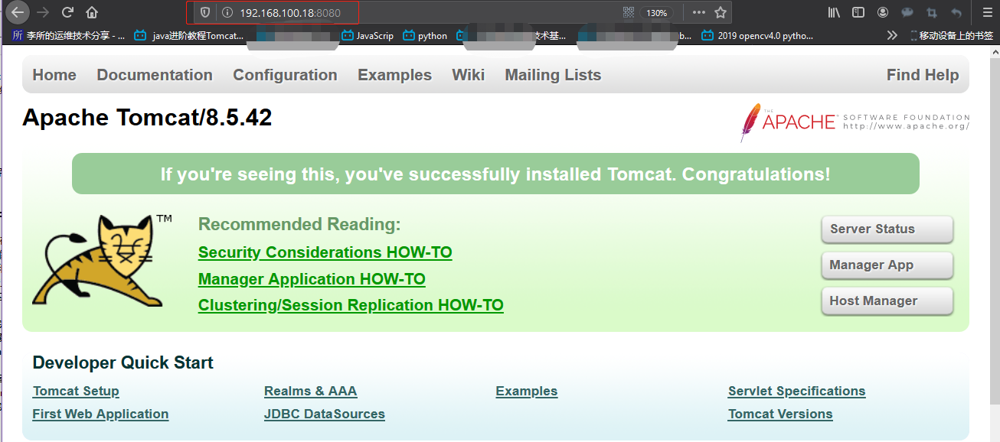

访问`http://192.168.100.18:8080/app1/`
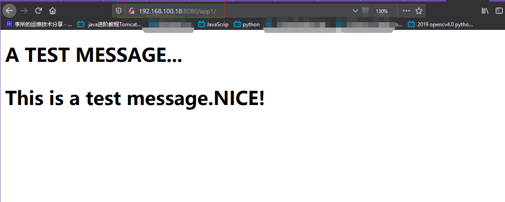

### 4.3.2 业务镜像 2

#### 准备 Dockerfile

```bash
root@ubuntu-suosuoli-node1:/opt/dockerfile/web/tomcat/tomcat-app2# pwd
/opt/dockerfile/web/tomcat/tomcat-app2
root@ubuntu-suosuoli-node1:/opt/dockerfile/web/tomcat/tomcat-app2# vim Dockerfile
```

```Dockerfile
# tomcat webapp deploy image app2

FROM tomcat-base:v8.5.42

LABEL author="lisuo" \
      personal_site="www.suosuoli.cn" \
      contact="stvobs@163.com"

	# add a script to /tomcat/bin to start tomcat when container start
ADD run_tomcat.sh /apps/tomcat/bin/run_tomcat.sh

	# add business code to /tomcat/webapps/
ADD app2/* /apps/tomcat/webapps/app2/

RUN chown www.www /apps/ -R

	# expose ports
EXPOSE 8080 8005 8009

	# run tomcat when container start
CMD ["/apps/tomcat/bin/run_tomcat.sh"]
```

#### 准备容器启动时启动 tomcat 的脚本

```bash
root@ubuntu-suosuoli-node1:/opt/dockerfile/web/tomcat/tomcat-app2# vim run_tomcat.sh
#!/bin/bash

echo "192.168.100.18" >> /etc/hosts
echo "nameserver 223.6.6.6" >> /etc/resolv.conf

su - www -c "/apps/tomcat/bin/catalina.sh start"
su - www -c "tail -f /etc/resolv.conf"

root@ubuntu-suosuoli-node1:/opt/dockerfile/web/tomcat/tomcat-app2# chmod +x run_tomcat.sh
```

#### 编写 app2 测试页面

```bash
root@ubuntu-suosuoli-node1:/opt/dockerfile/web/tomcat/tomcat-app2# mkdir app2
root@ubuntu-suosuoli-node1:/opt/dockerfile/web/tomcat/tomcat-app2# vim app2/index.html
<DOCTYPE HTML/>
<head>
        <h1>A TEST MESSAGE... <h1/>
<head/>
<body>
        <p>Yet another webapp.<span>NICE!<span/><p/>
<body/>
```

#### 主备容器构建脚本

```bash
root@ubuntu-suosuoli-node1:/opt/dockerfile/web/tomcat/tomcat-app2# vim docker_build_cmd.sh
#!/bin/bash
docker build -t tomcat-business:app2 .

root@ubuntu-suosuoli-node1:/opt/dockerfile/web/tomcat/tomcat-app2# chmod u+x docker_build_cmd.sh
```

#### 构建

```bash
root@ubuntu-suosuoli-node1:/opt/dockerfile/web/tomcat/tomcat-app2# ./docker_build_cmd.sh
Sending build context to Docker daemon  5.632kB
Step 1/7 : FROM tomcat-base:v8.5.42
 ---> 6533b305cfc0
Step 2/7 : LABEL author="lisuo"       personal_site="www.suosuoli.cn"       contact="stvobs@163.com"
 ---> Using cache
 ---> 6d5cc8d86136
Step 3/7 : ADD run_tomcat.sh /apps/tomcat/bin/run_tomcat.sh
 ---> 0f3ae2e1489a
Step 4/7 : ADD app2/* /apps/tomcat/webapps/app2/
 ---> cf76ee15a5ac
Step 5/7 : RUN chown www.www /apps/ -R
 ---> Running in c14176cec32c
Removing intermediate container c14176cec32c
 ---> 314e08b50ca4
Step 6/7 : EXPOSE 8080 8005 8009
 ---> Running in e7fcfa81a99d
Removing intermediate container e7fcfa81a99d
 ---> e3edc13b44dc
Step 7/7 : CMD ["/apps/tomcat/bin/run_tomcat.sh"]
 ---> Running in 000d7332c2da
Removing intermediate container 000d7332c2da
 ---> b36c6d580d28
Successfully built b36c6d580d28
Successfully tagged tomcat-business:app2
# 构建成功
```

#### 从镜像启动

```bash
root@ubuntu-suosuoli-node1:~# docker images
REPOSITORY          TAG                 IMAGE ID            CREATED             SIZE
tomcat-business     app2                b36c6d580d28        39 seconds ago      947MB

root@ubuntu-suosuoli-node1:~# docker run -it -d -p 8081:8080 tomcat-business:app2
929195451b64a56964e84410a40691e06a3312c58d9138286c5dea26a4664349
root@ubuntu-suosuoli-node1:~# ss -ntl | grep 8081
LISTEN   0         20480                     *:8081                   *:*

root@ubuntu-suosuoli-node1:/opt/dockerfile/web/tomcat/tomcat-app2# docker exec -it 929195451b64 /bin/bash
[root@929195451b64 /]# ss -ntl
State      Recv-Q Send-Q        Local Address:Port    Peer Address:Port
LISTEN     0      1                 127.0.0.1:8005               *:*
LISTEN     0      100                       *:8009               *:*
LISTEN     0      100                       *:8080               *:*
```

#### 访问测试

访问`http://192.168.100.18:8081/`

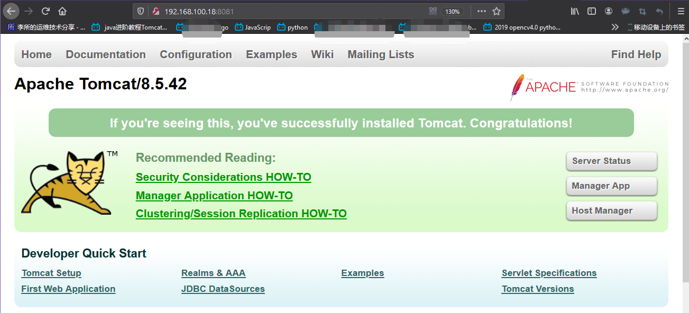

访问`http://192.168.100.18:8081/app2`

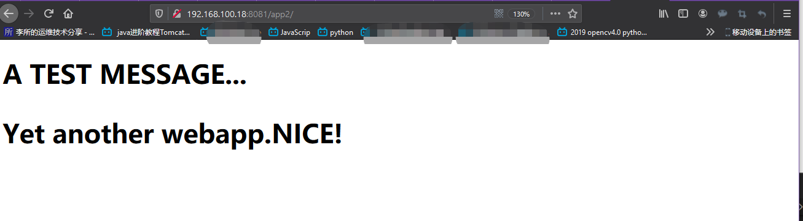

# 五. 基于 alpine 和 ubuntu 构建镜像

## 5.1 基于 alpine 构建镜像

在基于 alpine 构建镜像时，需要注意 alpine 的一些基础命令不同于 centos 或者
ubuntu 系统，主要用到的是安装软件命令`apk update`和`apk add`命令，添加用户
和组的`adduser`和`addgroup`命令。

### 5.1.1 构建 alpine 基础镜像

#### Dockerfile

```bash
root@ubuntu-suosuoli-node1:~# cd /opt/dockerfile/system/
root@ubuntu-suosuoli-node1:/opt/dockerfile/system# ll
total 20
drwxr-xr-x 5 root root 4096 Feb 20 11:03 ./
drwxr-xr-x 5 root root 4096 Feb 20 11:03 ../
drwxr-xr-x 2 root root 4096 Feb 20 11:29 centos/
drwxr-xr-x 2 root root 4096 Feb 20 11:03 redhat/
drwxr-xr-x 2 root root 4096 Feb 20 11:03 ubuntu/
root@ubuntu-suosuoli-node1:/opt/dockerfile/system# mkdir alpine
root@ubuntu-suosuoli-node1:/opt/dockerfile/system# cd alpine
root@ubuntu-suosuoli-node1:/opt/dockerfile/system/alpine# vim Dockerfile
```

```Dockerfile
# A alpine base image with some toools installed

FROM alpine:latest

LABEL author="lisuo" \
      personal_site="suosuoli.cn" \
      contact="stevobs@163.com"

        # change the pkg source to aliyun
          # http://mirrors.aliyun.com/alpine/v3.11/main
          # http://mirrors.aliyun.com/alpine/v3.11/community
COPY repositories /etc/apk/repositories

        # install basic tools and cmd
RUN apk update && apk add iotop gcc libgcc libc-dev libcurl \
    libc-utils pcre-dev zlib-dev libnfs make pcre pcre2 zip \
    unzip net-tools pstree wget libevent libevent-dev iproute2
```

#### 更改 alpine 包源为阿里云的源

[更改 alpine 包源的方法](:https://developer.aliyun.com/mirror/alpine?spm=a2c6h.13651102.0.0.3e221b11vHBodf)
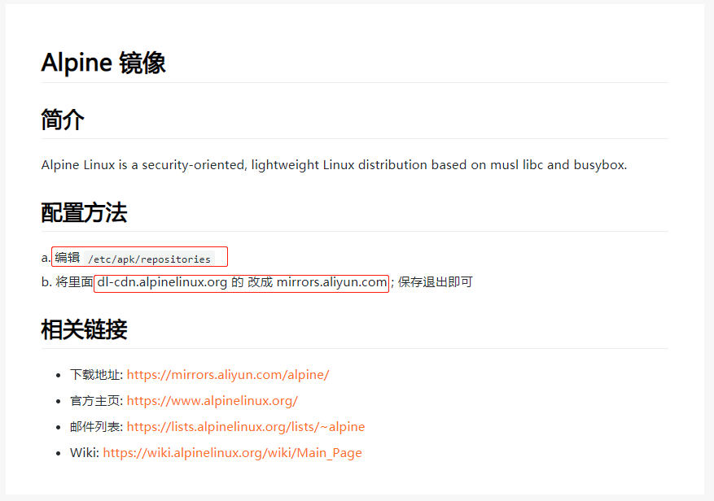

```bash
root@ubuntu-suosuoli-node1:/opt/dockerfile/system/alpine# docker images
REPOSITORY          TAG                 IMAGE ID            CREATED             SIZE
alpine              latest              e7d92cdc71fe        4 weeks ago         5.59MB
...
root@ubuntu-suosuoli-node1:/opt/dockerfile/system/alpine# docker run -it --rm alpine /bin/sh
/ # ll
/bin/sh: ll: not found
/ # cat /etc/apk/repositories
http://dl-cdn.alpinelinux.org/alpine/v3.11/main
http://dl-cdn.alpinelinux.org/alpine/v3.11/community
# 替换上面的 dl-cdn.alpinelinux.org 改成 mirrors.aliyun.com

root@ubuntu-suosuoli-node1:/opt/dockerfile/system/alpine# cat repositories
#http://dl-cdn.alpinelinux.org/alpine/v3.11/main
#http://dl-cdn.alpinelinux.org/alpine/v3.11/community

http://mirrors.aliyun.com/alpine/v3.11/main
http://mirrors.aliyun.com/alpine/v3.11/community
```

#### 构建脚本

```bash
root@ubuntu-suosuoli-node1:/opt/dockerfile/system/alpine# vim docker_build_cmd.sh
#!/bin/bash
docker build -t alpine-base:v1 .

root@ubuntu-suosuoli-node1:/opt/dockerfile/system/alpine# chmod u+x docker_build_cmd.sh
```

#### 构建和查看

##### 构建

```bash
# 构建前的文件情况
root@ubuntu-suosuoli-node1:/opt/dockerfile/system/alpine# ll
total 1032
drwxr-xr-x 2 root root    4096 Feb 20 15:22 ./
drwxr-xr-x 6 root root    4096 Feb 20 15:05 ../
-rwxr--r-- 1 root root      45 Feb 20 15:22 docker_build_cmd.sh*
-rw-r--r-- 1 root root     562 Feb 20 15:21 Dockerfile
-rw-r--r-- 1 root root 1032630 Feb 20 15:12 nginx-1.16.1.tar.gz
-rw-r--r-- 1 root root     197 Feb 20 15:18 repositories

root@ubuntu-suosuoli-node1:/opt/dockerfile/system/alpine# cat repositories
#http://dl-cdn.alpinelinux.org/alpine/v3.11/main
#http://dl-cdn.alpinelinux.org/alpine/v3.11/community

http://mirrors.aliyun.com/alpine/v3.11/main
http://mirrors.aliyun.com/alpine/v3.11/community


# 构建
root@ubuntu-suosuoli-node1:/opt/dockerfile/system/alpine# ./docker_build_cmd.sh
Sending build context to Docker daemon  1.038MB
Step 1/4 : FROM alpine:latest
 ---> e7d92cdc71fe
Step 2/4 : LABEL author="lisuo"       personal_site="suosuoli.cn"       contact="stevobs@163.com"
 ---> Running in 9e0b3cd73fc8
Removing intermediate container 9e0b3cd73fc8
 ---> 8e4213d752e3
Step 3/4 : COPY repositories /etc/apk/repositories
 ---> c23258fd03d2
Step 4/4 : RUN apk update && apk add iotop gcc libgcc libc-dev libcurl     libc-utils pcre-dev zlib-dev libnfs make pcre pcre2 zip     unzip net-tools pstree wget libevent libevent-dev iproute2
 ---> Running in cae47620077c
fetch http://mirrors.aliyun.com/alpine/v3.11/main/x86_64/APKINDEX.tar.gz
fetch http://mirrors.aliyun.com/alpine/v3.11/community/x86_64/APKINDEX.tar.gz
v3.11.3-73-g095aa9b9d4 [http://mirrors.aliyun.com/alpine/v3.11/main]
v3.11.3-72-g77ec45c4dc [http://mirrors.aliyun.com/alpine/v3.11/community]
OK: 11262 distinct packages available
(1/49) Installing libgcc (9.2.0-r3)
(2/49) Installing libstdc++ (9.2.0-r3)
(3/49) Installing binutils (2.33.1-r0)
(4/49) Installing gmp (6.1.2-r1)
(5/49) Installing isl (0.18-r0)
(6/49) Installing libgomp (9.2.0-r3)
(7/49) Installing libatomic (9.2.0-r3)
(8/49) Installing mpfr4 (4.0.2-r1)
(9/49) Installing mpc1 (1.1.0-r1)
(10/49) Installing gcc (9.2.0-r3)
...
(49/49) Installing zlib-dev (1.2.11-r3)
Executing busybox-1.31.1-r9.trigger
Executing ca-certificates-20191127-r1.trigger
OK: 189 MiB in 63 packages
Removing intermediate container cae47620077c
 ---> 4ace3056739c
Successfully built 4ace3056739c
Successfully tagged alpine-base:v1
# 构建完成
```

##### 查看

```bash
root@ubuntu-suosuoli-node1:/opt/dockerfile/system/alpine# docker images
REPOSITORY          TAG                 IMAGE ID            CREATED             SIZE
alpine-base         v1                  4ace3056739c        40 seconds ago      182MB

root@ubuntu-suosuoli-node1:/opt/dockerfile/system/alpine# docker run --rm -it alpine-base:v1 /bin/sh
/ # ping www.baidu.com
PING www.baidu.com (61.135.169.121): 56 data bytes
64 bytes from 61.135.169.121: seq=0 ttl=127 time=44.699 ms
^C
--- www.baidu.com ping statistics ---
1 packets transmitted, 1 packets received, 0% packet loss
round-trip min/avg/max = 44.699/44.699/44.699 ms
/ # ifconfig
eth0      Link encap:Ethernet  HWaddr 02:42:AC:11:00:03
          inet addr:172.17.0.3  Bcast:172.17.255.255  Mask:255.255.0.0
          UP BROADCAST RUNNING MULTICAST  MTU:1500  Metric:1
          RX packets:13 errors:0 dropped:0 overruns:0 frame:0
          TX packets:5 errors:0 dropped:0 overruns:0 carrier:0
          collisions:0 txqueuelen:0
          RX bytes:1126 (1.0 KiB)  TX bytes:328 (328.0 B)

lo        Link encap:Local Loopback
          inet addr:127.0.0.1  Mask:255.0.0.0
          UP LOOPBACK RUNNING  MTU:65536  Metric:1
          RX packets:0 errors:0 dropped:0 overruns:0 frame:0
          TX packets:0 errors:0 dropped:0 overruns:0 carrier:0
          collisions:0 txqueuelen:1000
          RX bytes:0 (0.0 B)  TX bytes:0 (0.0 B)

/ #
/ # apk update # 查看阿里云的源是否成功生效
fetch http://mirrors.aliyun.com/alpine/v3.11/main/x86_64/APKINDEX.tar.gz
fetch http://mirrors.aliyun.com/alpine/v3.11/community/x86_64/APKINDEX.tar.gz
v3.11.3-73-g095aa9b9d4 [http://mirrors.aliyun.com/alpine/v3.11/main]
v3.11.3-72-g77ec45c4dc [http://mirrors.aliyun.com/alpine/v3.11/community]
OK: 11262 distinct packages available
```

### 5.1.2 基于 alpine 基础镜像构建 nginx 镜像

#### Dockerfile

```bash
root@ubuntu-suosuoli-node1:/opt/dockerfile/system/alpine# mkdir nginx
root@ubuntu-suosuoli-node1:/opt/dockerfile/system/alpine# vim nginx/Dockerfile
```

```Dockerfile


```

##### 构建脚本

```bash
root@ubuntu-suosuoli-node1:/opt/dockerfile/system/alpine/nginx# vim docker_build_cmd.sh
#!/bin/bash
docker build -t nginx-alpine:v1 .

root@ubuntu-suosuoli-node1:/opt/dockerfile/system/alpine/nginx# chmod u+x docker_build_cmd.sh
```

#### 构建上下文准备

```bash
root@ubuntu-suosuoli-node1:/opt/dockerfile/system/alpine# mv nginx-1.16.1.tar.gz nginx
root@ubuntu-suosuoli-node1:/opt/dockerfile/system/alpine# cd nginx/
root@ubuntu-suosuoli-node1:/opt/dockerfile/system/alpine/nginx# mkdir suosuoli

# 测试界面
root@ubuntu-suosuoli-node1:/opt/dockerfile/system/alpine/nginx# vim suosuoli/index.html
<DOCTYPE HTML/>
<head>
        <h1>A TEST MESSAGE... <h1/>
<head/>
<body>
        <p>Based alpine\'s nginx deployment.<span>NICE!<span/><p/>
<body/>


root@ubuntu-suosuoli-node1:/opt/dockerfile/system/alpine/nginx# tar -cvf suosuoli.tar.gz suosuoli/*
suosuoli/index.html
root@ubuntu-suosuoli-node1:/opt/dockerfile/system/alpine/nginx# ll
total 1048
drwxr-xr-x 3 root root    4096 Feb 20 15:40 ./
drwxr-xr-x 3 root root    4096 Feb 20 15:31 ../
-rwxr--r-- 1 root root      46 Feb 20 15:33 docker_build_cmd.sh*
-rw-r--r-- 1 root root     581 Feb 20 15:37 Dockerfile
-rw-r--r-- 1 root root 1032630 Feb 20 15:12 nginx-1.16.1.tar.gz
drwxr-xr-x 2 root root    4096 Feb 20 15:40 suosuoli/
-rw-r--r-- 1 root root   10240 Feb 20 15:40 suosuoli.tar.gz
```

#### nginx 配置

```bash
root@ubuntu-suosuoli-node1:/opt/dockerfile/system/alpine/nginx# cp /usr/local/src/nginx-1.16.1/conf/nginx.conf .
root@ubuntu-suosuoli-node1:/opt/dockerfile/system/alpine/nginx# ll
total 1040
drwxr-xr-x 3 root root    4096 Feb 20 15:43 ./
drwxr-xr-x 3 root root    4096 Feb 20 15:31 ../
-rwxr--r-- 1 root root      46 Feb 20 15:33 docker_build_cmd.sh*
-rw-r--r-- 1 root root     581 Feb 20 15:37 Dockerfile
-rw-r--r-- 1 root root 1032630 Feb 20 15:12 nginx-1.16.1.tar.gz
-rw-r--r-- 1 root root    2656 Feb 20 15:42 nginx.conf  # 源码包内的默认配置文件
drwxr-xr-x 2 root root    4096 Feb 20 15:40 suosuoli/
-rw-r--r-- 1 root root   10240 Feb 20 15:40 suosuoli.tar.gz

# 编辑配置文件
root@ubuntu-suosuoli-node1:/opt/dockerfile/system/alpine/nginx# vim nginx.conf
...
user  nginx;
daemon off;
...
http {
  ...
    server {
        listen       80;
        server_name  localhost;
        access_log  logs/host.access.log  main;
        location / {
            root   /data/nginx/html;
            index  index.html index.htm;
        }
        ...
    }
    ...
}
```

#### 构建

```bash
root@ubuntu-suosuoli-node1:/opt/dockerfile/system/alpine/nginx# ./docker_build_cmd.sh
Sending build context to Docker daemon  1.042MB
Step 1/9 : FROM alpine-base:v1
 ---> 4ace3056739c
Step 2/9 : ADD nginx-1.16.1.tar.gz /opt/
 ---> 19da8369dd92
Step 3/9 : RUN cd /opt/nginx-1.16.1 &&     ./configure --prefix=/apps/nginx &&     make && make install &&     ln -sv /apps/nginx/sbin/nginx /usr/bin/
 ---> Running in a13988851a1f
checking for OS
 + Linux 4.15.0-55-generic x86_64
checking for C compiler ... found
 + using GNU C compiler
 + gcc version: 9.2.0 (Alpine 9.2.0)
checking for gcc -pipe switch ... found
checking for -Wl,-E switch ... found
checking for gcc builtin atomic operations ... found
checking for C99 variadic macros ... found
checking for gcc variadic macros ... found
checking for gcc builtin 64 bit byteswap ... found
checking for unistd.h ... found
checking for inttypes.h ... found
......
make[1]: Leaving directory '/opt/nginx-1.16.1'
'/usr/bin/nginx' -> '/apps/nginx/sbin/nginx'
Removing intermediate container a13988851a1f
 ---> 45e3cd2f7eca
Step 4/9 : RUN addgroup -g 2020 -S nginx &&     adduser -s /sbin/nologin -S -D -u 2020 -G nginx nginx
 ---> Running in 21f68ba593d5
Removing intermediate container 21f68ba593d5
 ---> a3f7bd81893a
Step 5/9 : COPY nginx.conf /apps/nginx/conf/nginx.conf
 ---> df519cda2a45
Step 6/9 : ADD suosuoli.tar.gz /data/nginx/html
 ---> 39c0105edca0
Step 7/9 : RUN chown nginx.nginx /data/nginx/ /apps/nginx/ -R
 ---> Running in 295727c64e5f
Removing intermediate container 295727c64e5f
 ---> fb905754545a
Step 8/9 : EXPOSE 80 443
 ---> Running in 4964198bca1a
Removing intermediate container 4964198bca1a
 ---> 94a07a908846
Step 9/9 : CMD ["nginx"]
 ---> Running in 212a79afda5d
Removing intermediate container 212a79afda5d
 ---> d82e7e0b449d
Successfully built d82e7e0b449d
Successfully tagged nginx-alpine:v1
# 构建成功
```

#### 访问测试

```bash
root@ubuntu-suosuoli-node1:/opt/dockerfile/system/alpine/nginx# docker images
REPOSITORY          TAG                 IMAGE ID            CREATED             SIZE
nginx-alpine        v1                  d82e7e0b449d        48 seconds ago      211MB

root@ubuntu-suosuoli-node1:/opt/dockerfile/system/alpine/nginx# docker run  -it  -p 80:80  nginx-alpine:v1 tail -f /etc/hosts
127.0.0.1	localhost
::1	localhost ip6-localhost ip6-loopback
fe00::0	ip6-localnet
ff00::0	ip6-mcastprefix
ff02::1	ip6-allnodes
ff02::2	ip6-allrouters
172.17.0.3	d997c365094b
```

访问`http://192.168.100.18:80/`，由于根下没有 index.html 所以无法访问

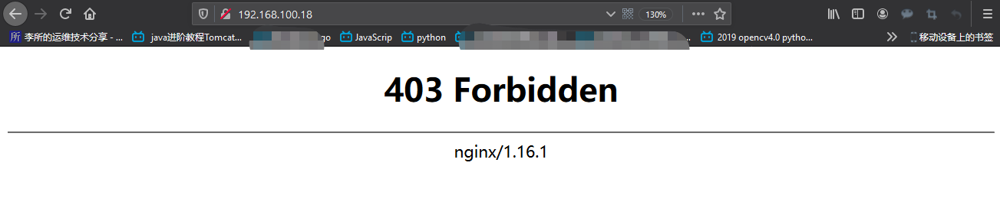

访问`http://192.168.100.18:80/suosuoli/`，OK

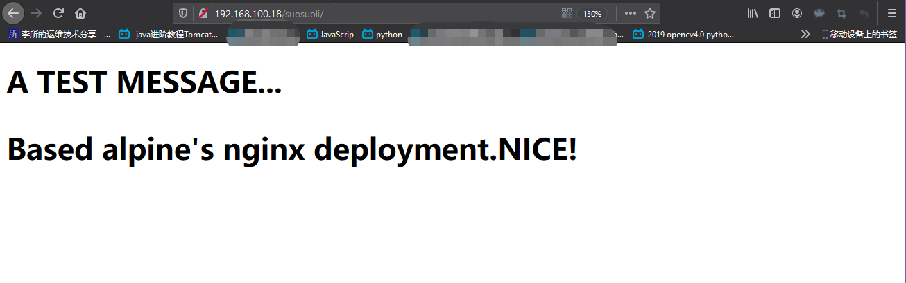

## 5.2 基于 ubuntu 构建镜像

基于 ubuntu 构建镜像与其他系统大同小异

### 5.2.1 构建 ubuntu 基础镜像

#### Dockerfile

```bash
root@ubuntu-suosuoli-node1:/opt/dockerfile/system/ubuntu# pwd
/opt/dockerfile/system/ubuntu
root@ubuntu-suosuoli-node1:/opt/dockerfile/system/ubuntu# vim Dockerfile

```

```Dockerfile
# ubuntu base image with some tools installed

FROM ubuntu:latest

LABEL author="lisuo" \
      personal_site="suosuoli.cn" \
      contact="stevobs@163.com"

COPY sources.list /etc/apt/sources.list

RUN apt update && \
    apt install -y iproute2  ntpdate  tcpdump telnet traceroute \
    nfs-kernel-server nfs-common  lrzsz tree  openssl libssl-dev \
    libpcre3 libpcre3-dev zlib1g-dev ntpdate tcpdump telnet traceroute \
    gcc openssh-server lrzsz tree openssl libssl-dev libpcre3 libpcre3-dev \
    zlib1g-dev ntpdate tcpdump telnet traceroute iotop unzip zip make && \
    touch /tmp/linux.txt
```

sources.list

```bash
root@ubuntu-suosuoli-node1:/opt/dockerfile/system/ubuntu# vim sources.list
deb http://mirrors.aliyun.com/ubuntu/ bionic main restricted universe multiverse
deb-src http://mirrors.aliyun.com/ubuntu/ bionic main restricted universe multiverse

deb http://mirrors.aliyun.com/ubuntu/ bionic-security main restricted universe multiverse
deb-src http://mirrors.aliyun.com/ubuntu/ bionic-security main restricted universe multiverse

deb http://mirrors.aliyun.com/ubuntu/ bionic-updates main restricted universe multiverse
deb-src http://mirrors.aliyun.com/ubuntu/ bionic-updates main restricted universe multiverse

deb http://mirrors.aliyun.com/ubuntu/ bionic-proposed main restricted universe multiverse
deb-src http://mirrors.aliyun.com/ubuntu/ bionic-proposed main restricted universe multiverse

deb http://mirrors.aliyun.com/ubuntu/ bionic-backports main restricted universe multiverse
deb-src http://mirrors.aliyun.com/ubuntu/ bionic-backports main restricted universe multiverse
```

#### 构建

```bash
root@ubuntu-suosuoli-node1:/opt/dockerfile/system/ubuntu# vim docker_build_cmd.sh
#!/bin/bash
docker build -t ubuntu-base:v1 .

root@ubuntu-suosuoli-node1:/opt/dockerfile/system/ubuntu# chmod u+x docker_build_cmd.sh

root@ubuntu-suosuoli-node1:/opt/dockerfile/system/ubuntu# ll
total 20
drwxr-xr-x 2 root root 4096 Feb 20 16:21 ./
drwxr-xr-x 6 root root 4096 Feb 20 15:05 ../
-rwxr--r-- 1 root root   45 Feb 20 16:21 docker_build_cmd.sh*
-rw-r--r-- 1 root root  608 Feb 20 16:18 Dockerfile
-rw-r--r-- 1 root root  907 Feb 20 16:20 sources.list

# 构建
root@ubuntu-suosuoli-node1:/opt/dockerfile/system/ubuntu# ./docker_build_cmd.sh
Sending build context to Docker daemon   5.12kB
Step 1/4 : FROM ubuntu:latest
 ---> ccc6e87d482b
Step 2/4 : LABEL author="lisuo"       personal_site="suosuoli.cn"       contact="stevobs@163.com"
 ---> Running in 67ce6ffe9178
Removing intermediate container 67ce6ffe9178
 ---> a9fb7d7e7121
Step 3/4 : COPY sources.list /etc/apt/sources.list
 ---> 4dfd6aed4cc0
Step 4/4 : RUN apt update &&     apt install -y iproute2  ntpdate  tcpdump telnet traceroute     nfs-kernel-server nfs-common  lrzsz tree  openssl libssl-dev     libpcre3 libpcre3-dev zlib1g-dev ntpdate tcpdump telnet traceroute     gcc openssh-server lrzsz tree openssl libssl-dev libpcre3 libpcre3-dev     zlib1g-dev ntpdate tcpdump telnet traceroute iotop unzip zip make &&     touch /tmp/linux.txt
 ---> Running in 4ef2eb7e42c6

WARNING: apt does not have a stable CLI interface. Use with caution in scripts.
  # 该警告意思是apt的命令行接口不稳定，慎用

Get:1 http://mirrors.aliyun.com/ubuntu bionic InRelease [242 kB]
Get:2 http://mirrors.aliyun.com/ubuntu bionic-security InRelease [88.7 kB]
Get:3 http://mirrors.aliyun.com/ubuntu bionic-updates InRelease [88.7 kB]
Get:4 http://mirrors.aliyun.com/ubuntu bionic-proposed I
...
invoke-rc.d: policy-rc.d denied execution of start.
Processing triggers for systemd (237-3ubuntu10.39) ...
Processing triggers for libc-bin (2.27-3ubuntu1) ...
Processing triggers for ca-certificates (20180409) ...
Updating certificates in /etc/ssl/certs...
0 added, 0 removed; done.
Running hooks in /etc/ca-certificates/update.d...
done.
Removing intermediate container 45ebd4f7a9c4
 ---> 0d60297a1706
Successfully built 0d60297a1706
Successfully tagged ubuntu-base:v1
# 构建完成
```

### 5.2.2 基于 ubuntu 基础镜像构建 nginx 镜像

#### Dockerfile

```Dockerfile
# A nginx image based on ubuntu

FROM ubuntu-base:v1

ADD nginx-1.16.1.tar.gz /usr/local/src

RUN cd /usr/local/src/nginx-1.16.1 && \
    ./configure --prefix=/apps/nginx && \
    make && make install && \
    ln -sv /apps/nginx/sbin/nginx /usr/bin && \
    rm -rf /usr/local/src/nginx-1.16.1 && \
    rm -rf /usr/local/src/nginx-1.16.1.tar.gz

ADD nginx.conf /apps/nginx/conf/nginx.conf

ADD suosuoli.tar.gz /data/nginx/html

RUN groupadd -g 2019 nginx && \
    useradd -g nginx -s /usr/sbin/nologin -u 2019 nginx && \
    chown -R nginx.nginx /apps/nginx /data/nginx

EXPOSE 80 443

CMD ["nginx"]
```

#### 构建

```bash
# 编辑构建脚本
root@ubuntu-suosuoli-node1:/opt/dockerfile/system/ubuntu/nginx# vim docker_build_cmd.sh
#!/bin/bash
docker build -t nginx-ubunt:v1 .

# 加执行权限
root@ubuntu-suosuoli-node1:/opt/dockerfile/system/ubuntu/nginx# chmod u+x docker_build_cmd.s

# 拷贝构建上下文
root@ubuntu-suosuoli-node1:/opt/dockerfile/system/ubuntu/nginx# cp ../../alpine/nginx/nginx.conf .
root@ubuntu-suosuoli-node1:/opt/dockerfile/system/ubuntu/nginx# cp ../../alpine/nginx/nginx-1.16.1.tar.gz .
root@ubuntu-suosuoli-node1:/opt/dockerfile/system/ubuntu/nginx# cp ../../alpine/nginx/suosuoli.tar.gz .

# 更改测试界面
root@ubuntu-suosuoli-node1:/opt/dockerfile/system/alpine/nginx# vim suosuoli/index.html
<DOCTYPE HTML/>
<head>
        <h1>A TEST MESSAGE... <h1/>
<head/>
<body>
        <p>Based ubuntu\'s nginx deployment.<span>NICE!<span/><p/>
<body/>

# 最后的上下文这样
root@ubuntu-suosuoli-node1:/opt/dockerfile/system/ubuntu/nginx# ll
total 1044
drwxr-xr-x 2 root root    4096 Feb 20 16:35 ./
drwxr-xr-x 3 root root    4096 Feb 20 16:30 ../
-rwxr--r-- 1 root root      45 Feb 20 16:34 docker_build_cmd.sh*
-rw-r--r-- 1 root root     610 Feb 20 16:33 Dockerfile
-rw-r--r-- 1 root root 1032630 Feb 20 16:35 nginx-1.16.1.tar.gz
-rw-r--r-- 1 root root    2674 Feb 20 16:34 nginx.conf
-rw-r--r-- 1 root root   10240 Feb 20 16:35 suosuoli.tar.gz

# 构建
root@ubuntu-suosuoli-node1:/opt/dockerfile/system/ubuntu/nginx# ./docker_build_cmd.sh
Sending build context to Docker daemon  1.051MB
Step 1/8 : FROM ubuntu-base:v1
 ---> cea7344c8fbf
Step 2/8 : ADD nginx-1.16.1.tar.gz /usr/local/src
 ---> b53d38ca4edc
Step 3/8 : RUN cd /usr/local/src/nginx-1.16.1 &&     ./configure --prefix=/apps/nginx &&     make && make install &&     ln -sv /apps/nginx/sbin/nginx /usr/bin &&     rm -rf /usr/local/src/nginx-1.16.1 &&     rm -rf /usr/local/src/nginx-1.16.1.tar.gz
 ---> Running in 7275fc61e04a
checking for OS
 + Linux 4.15.0-55-generic x86_64
checking for C compiler ... found
 + using GNU C compiler
 + gcc version: 7.5.0 (Ubuntu 7.5.0-3ubuntu1~18.04)
checking for gcc -pipe switch ... found
checking for -Wl,-E switch ... found
checking for gcc builtin atomic operations ... found
..................
test -d '/apps/nginx/logs' \
	|| mkdir -p '/apps/nginx/logs'
make[1]: Leaving directory '/usr/local/src/nginx-1.16.1'
'/usr/bin/nginx' -> '/apps/nginx/sbin/nginx'
Removing intermediate container 7275fc61e04a
 ---> dd6e13932516
Step 4/8 : ADD nginx.conf /apps/nginx/conf/nginx.conf
 ---> ff665ea05f69
Step 5/8 : ADD suosuoli.tar.gz /data/nginx/html
 ---> dd367b0be1b3
Step 6/8 : RUN groupadd -g 2019 nginx &&     useradd -g nginx -s /usr/sbin/nologin -u 2019 nginx &&     chown -R nginx.nginx /apps/nginx /data/nginx
 ---> Running in aa4b77f3409d
Removing intermediate container aa4b77f3409d
 ---> 67c4a641d0f8
Step 7/8 : EXPOSE 80 443
 ---> Running in 71947b851354
Removing intermediate container 71947b851354
 ---> 9747a7021fdd
Step 8/8 : CMD ["nginx"]
 ---> Running in ae08df9312be
Removing intermediate container ae08df9312be
 ---> ce5d71aaf355
Successfully built ce5d71aaf355
Successfully tagged nginx-ubunt:v1
# 构建完成
```

#### 访问测试

```bash
root@ubuntu-suosuoli-node1:/opt/dockerfile/system/ubuntu/nginx# docker images
REPOSITORY          TAG                 IMAGE ID            CREATED              SIZE
nginx-ubunt         v1                  ce5d71aaf355        About a minute ago   384MB

root@ubuntu-suosuoli-node1:/opt/dockerfile/system/alpine/nginx# docker run -it -d -p 80:80 nginx-ubunt:v1
9d19a7d7fdfa48ba0058666fc2c498fb2b2222444cbab7cab5b6ba5ebcba070d
root@ubuntu-suosuoli-node1:/opt/dockerfile/system/alpine/nginx# lsof -i:80
COMMAND     PID USER   FD   TYPE DEVICE SIZE/OFF NODE NAME
docker-pr 82108 root    4u  IPv6 798412      0t0  TCP *:http (LISTEN)
```

访问现象和基于 alpine 时一样
访问`http://192.168.100.18:80/`，由于根下没有 index.html 所以无法访问

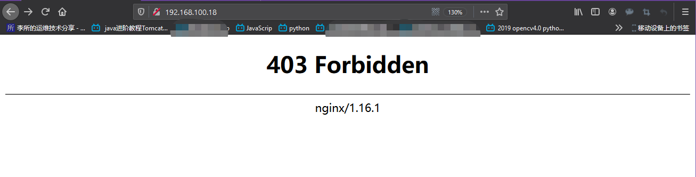

访问`http://192.168.100.18:80/suosuoli/`，OK

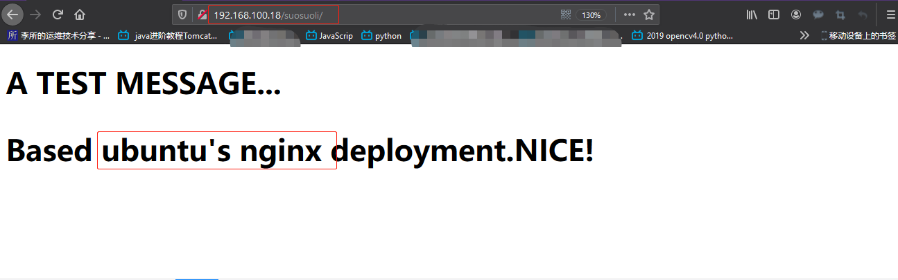

# 六. 构建 HAProxy 镜像

基于 centos-base 镜像构建 haproxy 镜像，将 haproxy 通过容器的方式运行

## 6.1 准备 Dockerfile

```bash
root@ubuntu-suosuoli-node1:/opt/dockerfile/system/centos# pwd
/opt/dockerfile/system/centos
root@ubuntu-suosuoli-node1:/opt/dockerfile/system/centos# mkdir haproxy
root@ubuntu-suosuoli-node1:/opt/dockerfile/system/centos# cd haproxy
root@ubuntu-suosuoli-node1:/opt/dockerfile/system/centos/haproxy# vim Dockerfile

```

```Dockerfile
# A HAProxy image based on centos-base:v1 with some tools installed

FROM centos-base:v1

RUN yum install -y yum install gcc gcc-c++ glibc glibc-devel \
    pcre pcre-devel openssl openssl-devel systemd-devel net-tools \
    vim iotop bc zip unzip zlib-devel lrzsz tree screen lsof tcpdump \
    wget ntpdate

ADD haproxy-2.0.5.tar.gz /usr/local/src/

RUN cd /usr/local/src/haproxy-2.0.5 && \
    make ARCH=x86_64 TARGET=linux-glibc USE_PCRE=1 USE_OPENSSL=1 USE_ZLIB=1 \
    USE_SYSTEMD=1 USE_CPU_AFFINITY=1 PREFIX=/usr/local/haproxy && \
    make install PREFIX=/usr/local/haproxy && \
    cp haproxy /usr/sbin/ && \
    mkdir /usr/local/haproxy/run

ADD haproxy.cfg /etc/haproxy/

ADD run_haproxy.sh /usr/bin

EXPOSE 80 9999

CMD ["/usr/bin/run_haproxy.sh"]
```

## 6.2 准备 HAProxy 源码和配置

[HAProxy-2.0.5 源码(需要科学上网)](http://www.haproxy.org/download/2.0/src/haproxy-2.0.5.tar.gz)

```bash
root@ubuntu-suosuoli-node1:/opt/dockerfile/system/centos/haproxy# rz

# 编辑haproxy配置文件
root@ubuntu-suosuoli-node1:/opt/dockerfile/system/centos/haproxy# vim haproxy.cfg
global
chroot /usr/local/haproxy
#stats socket /var/lib/haproxy/haproxy.sock mode 600 level admin
uid 99
gid 99
daemon
nbproc 1
pidfile /usr/local/haproxy/run/haproxy.pid
log 127.0.0.1 local3 info

defaults
option http-keep-alive
option  forwardfor
mode http
timeout connect 300000ms
timeout client  300000ms
timeout server  300000ms

listen stats
 mode http
 bind 0.0.0.0:9999
 stats enable
 log global
 stats uri     /haproxy-status
 stats auth    haadmin:123456

listen  docker_test_run
 bind 0.0.0.0:80
 mode http
 log global
 balance roundrobin
 server web1  192.168.100.18:8080  check inter 3000 fall 2 rise 5
 server web2  192.168.100.10:8080  check inter 3000 fall 2 rise 5
```

## 6.3 准备镜像构建脚本

```bash
# 编辑haproxy运行脚本
root@ubuntu-suosuoli-node1:/opt/dockerfile/system/centos/haproxy# vim run_haproxy.sh
#!/bin/bash
/usr/sbin/haproxy -f /etc/haproxy/haproxy.cfg
tail -f /etc/hosts

# 加执行权限
root@ubuntu-suosuoli-node1:/opt/dockerfile/system/centos/haproxy# chmod +x run_haproxy.sh

# 编辑构建脚本
root@ubuntu-suosuoli-node1:/opt/dockerfile/system/centos/haproxy# vim docker_build_cmd.sh
#!/bin/bash
docker build -t haproxy-ubuntu:v1 .

# 加执行权限
root@ubuntu-suosuoli-node1:/opt/dockerfile/system/centos/haproxy# chmod u+x docker_build_cmd.sh

# 最终的构建上下文
root@ubuntu-suosuoli-node1:/opt/dockerfile/system/centos/haproxy# ll
total 2504
drwxr-xr-x 2 root root    4096 Feb 20 17:36 ./
drwxr-xr-x 3 root root    4096 Feb 20 16:59 ../
-rwxr--r-- 1 root root      48 Feb 20 17:15 docker_build_cmd.sh*
-rw-r--r-- 1 root root     768 Feb 20 17:34 Dockerfile
-rw-r--r-- 1 root root 2539226 Feb 20 16:57 haproxy-2.0.5.tar.gz
-rw-r--r-- 1 root root     714 Feb 20 17:13 haproxy.cfg
-rwxr-xr-x 1 root root      77 Feb 20 17:36 run_haproxy.sh*

# 构建
root@ubuntu-suosuoli-node1:/opt/dockerfile/system/centos/haproxy# ./docker_build_cmd.sh
Sending build context to Docker daemon  2.545MB
Step 1/7 : FROM centos-base:v1
 ---> 729c515f2078
Step 2/7 : RUN yum install -y yum install gcc gcc-c++ glibc glibc-devel     pcre pcre-devel openssl openssl-devel systemd-devel net-tools     vim iotop bc zip unzip zlib-devel lrzsz tree screen lsof tcpdump     wget ntpdate
 ---> Running in 3d36a26b67c8
Loaded plugins: fastestmirror, ovl
Loading mirror speeds from cached hostfile
 * base: mirrors.tuna.tsinghua.edu.cn
 * epel: hkg.mirror.rackspace.com
 ..............
'doc/intro.txt' -> '/usr/local/haproxy/doc/haproxy/intro.txt'
Removing intermediate container c646c1b315b0
 ---> 48628430e4a9
Step 5/7 : ADD haproxy.cfg /etc/haproxy/
 ---> 690e4e03cd50
Step 6/7 : EXPOSE 80 9999
 ---> Running in 04346ec69c4f
Removing intermediate container 04346ec69c4f
 ---> 4f415ca11030
Step 7/7 : CMD ["/bin/bash","-c","/usr/sbin/haproxy -Ws -f /etc/haproxy/haproxy.cfg"]
 ---> Running in 406233bbc08e
Removing intermediate container 406233bbc08e
 ---> a20ce6f61f7c
Successfully built a20ce6f61f7c
Successfully tagged haproxy-ubuntu:v1
# 构建完成
```

## 6.4 从镜像启动容器

```bash
root@ubuntu-suosuoli-node1:/opt/dockerfile/system/centos/haproxy# docker images
REPOSITORY          TAG                 IMAGE ID            CREATED             SIZE
haproxy-ubuntu      v1                  82749c15084f        21 seconds ago      776MB
root@ubuntu-suosuoli-node1:/opt/dockerfile/system/centos/haproxy# docker run -it -d -p 80:80 haproxy-ubuntu:v1
95d1e314b97c092e1dcb35bcfc59ab8fa65afc40b802d44febdf0115d9ac94fd
root@ubuntu-suosuoli-node1:/opt/dockerfile/system/centos/haproxy# lsof -i:8
root@ubuntu-suosuoli-node1:/opt/dockerfile/system/centos/haproxy# lsof -i:80
COMMAND     PID USER   FD   TYPE DEVICE SIZE/OFF NODE NAME
docker-pr 84271 root    4u  IPv6 819725      0t0  TCP *:http (LISTEN)

# 进入容器看卡haproxy起来没
root@ubuntu-suosuoli-node1:/usr/local/src/haproxy-2.0.5# docker exec -it 95d1e314b97c /bin/bash
[root@95d1e314b97c /]# ss -ntl
State      Recv-Q Send-Q       Local Address:Port          Peer Address:Port
LISTEN     0      128                      *:9999                     *:*
LISTEN     0      128                      *:80                       *:*
```

## 6.5 启动后端服务

在为启动后端 tomcat 服务时，后台的 web1 和 web2 都是 down 状态:
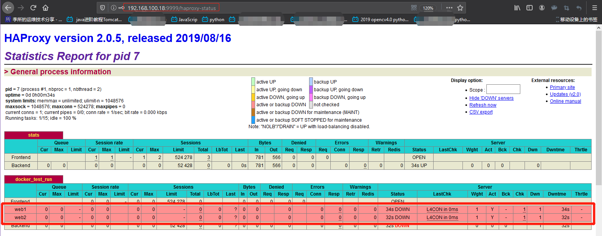

从 192.168.100.18 的业务镜像 tomcat-business:app2 启动容器

```bash
# 启动192.168.100.18的tomcat
root@ubuntu-suosuoli-node1:~# docker run -it -d -p 8080:8080 tomcat-business:app2
3d98810b67a962b66495c65861f44c4163c366cbe1f904bc982173519dcd0e44
```

启动业务镜像的容器后，tomcat 业务运行，web1 为 UP 状态
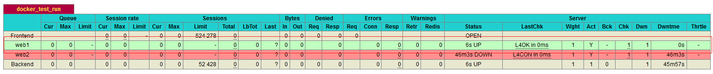

**将 tomcat-business:app1 部署到 192.168.100.10**
192.168.100.18 上:

```bash
# 导出tomcat业务镜像，拷贝到192.168.100.10使用
root@ubuntu-suosuoli-node1:~# docker save tomcat-business:app1 > /opt/tomcat-business.tar.gz
root@ubuntu-suosuoli-node1:~# scp /opt/tomcat-business.tar.gz 192.168.100.10:/opt/
tomcat-business.tar.gz
```

192.168.100.10 上:

```bash
[root@docker-server-node1 nginx]# docker load < /opt/tomcat-business.tar.gz
034f282942cd: Loading layer [==================================================>]  211.8MB/211.8MB
5d3faeb274b6: Loading layer [==================================================>]  24.27MB/24.27MB
94c4c1c2d2f2: Loading layer [==================================================>]  293.6MB/293.6MB
936594693080: Loading layer [==================================================>]  742.4kB/742.4kB
99755158254e: Loading layer [==================================================>]  404.9MB/404.9MB
d2d072a76faf: Loading layer [==================================================>]   2.56kB/2.56kB
619786ec8558: Loading layer [==================================================>]  3.072kB/3.072kB
acbc74ba6e8e: Loading layer [==================================================>]  3.072kB/3.072kB
53af0c1a7161: Loading layer [==================================================>]  2.048kB/2.048kB
225685fdf5bc: Loading layer [==================================================>]  14.43MB/14.43MB
c008fbaad5eb: Loading layer [==================================================>]  2.048kB/2.048kB
3223435a55be: Loading layer [==================================================>]  3.584kB/3.584kB
7d72a1f309c9: Loading layer [==================================================>]  4.608kB/4.608kB
62791f851d99: Loading layer [==================================================>]  14.43MB/14.43MB
Loaded image: tomcat-business:app1
[root@docker-server-node1 nginx]# docker images
REPOSITORY          TAG                 IMAGE ID            CREATED             SIZE
tomcat-business     app1                4c2f165d813b        4 hours ago         947MB
...

[root@docker-server-node1 nginx]# docker run -it -d -p 8080:8080 tomcat-business:app1
3512f0c1dd20cf9753bfae8d7109222e6d9921a2583f6f847f32d8f7c437f958
[root@docker-server-node1 nginx]# lsof -i:8080
COMMAND     PID USER   FD   TYPE  DEVICE SIZE/OFF NODE NAME
docker-pr 62173 root    4u  IPv6 1929287      0t0  TCP *:webcache (LISTEN)
```

两台后端服务都启动后，控制界面 web1 和 web2 都是 UP 状态

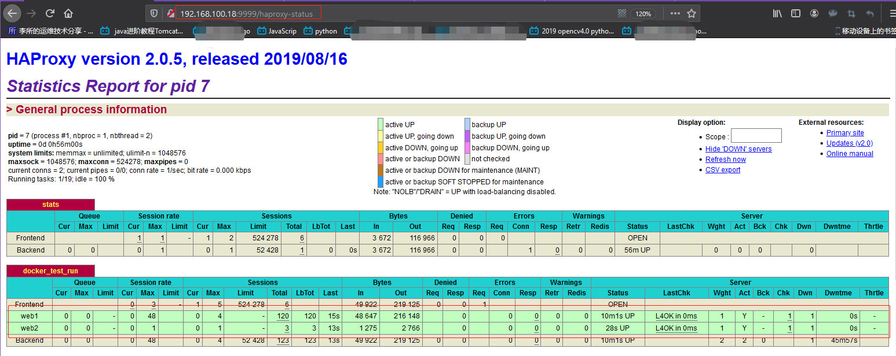

## 6.6 访问验证

### 6.6.1 访问 web

#### 6.6.1.1 单独访问

单独访问`http://192.168.100.10:8080/app1`

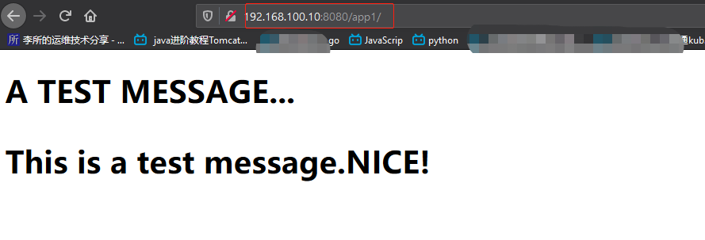

单独访问`http://192.168.100.18:8080/app2`

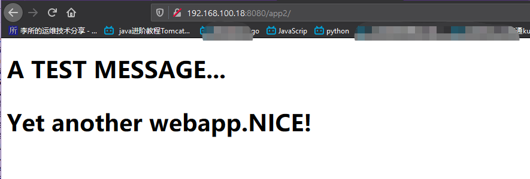

#### 6.6.1.2 访问 haproxy

1. 访问`http://192.168.100.18:80`

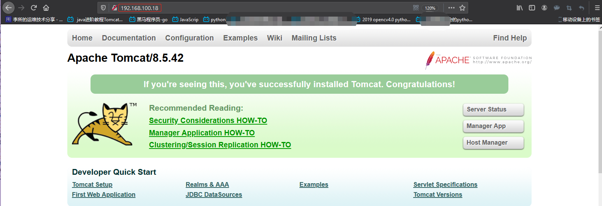

2. 访问`http://192.168.100.18:80/app1`

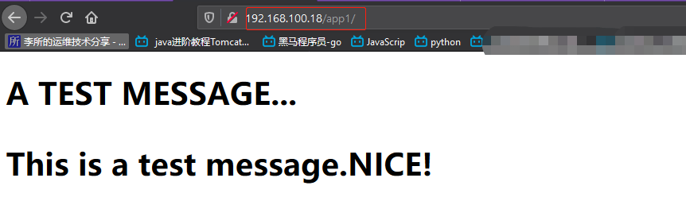

刷新，由于另一台 tomcat 没有 app1 目录下的 index.html(roundrobin 调度算法)，所以 404

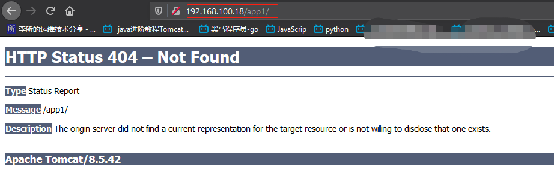

3. 访问`http://192.168.100.18:80/app2`

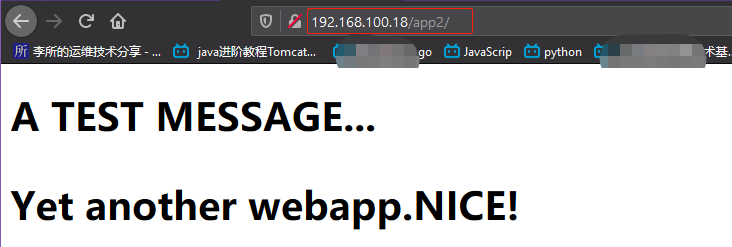

刷新，由于另一台 tomcat 没有 app2 目录下的 index.html(roundrobin 调度算法)，所以 404

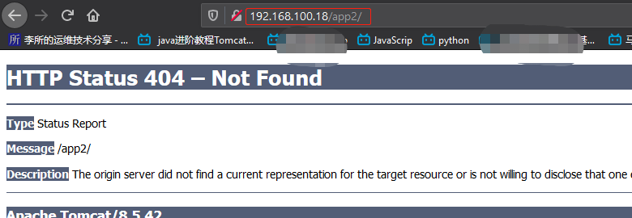

### 6.6.2 访问控制端

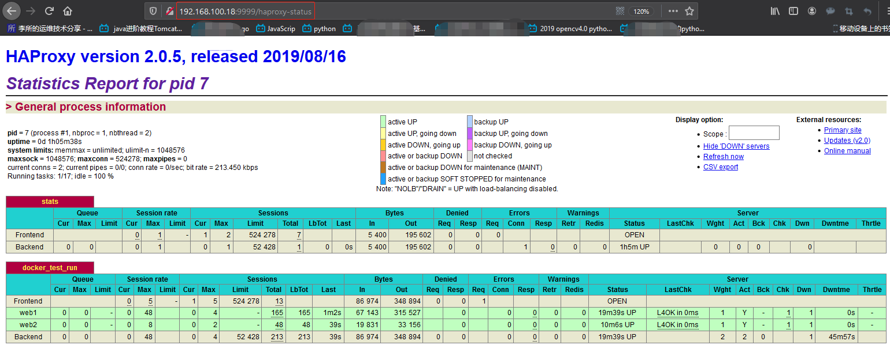
