# 一. 上传本地镜像到 Docker Hub

## 1.1 创建 Docker Hub 账户

登录到 [docker hub](hub.docker.com) 创建官网创建账户，登录后点击 settings 完善账户信息

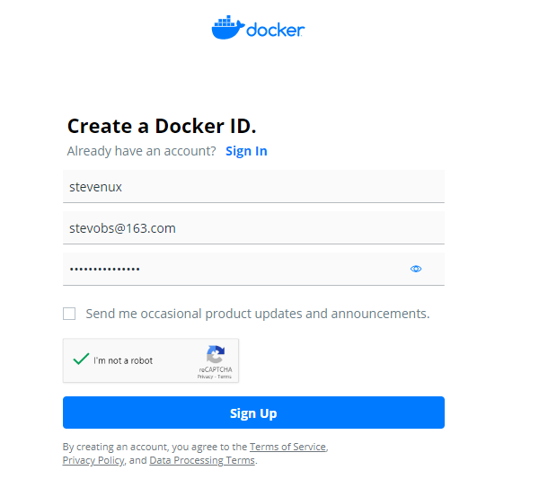

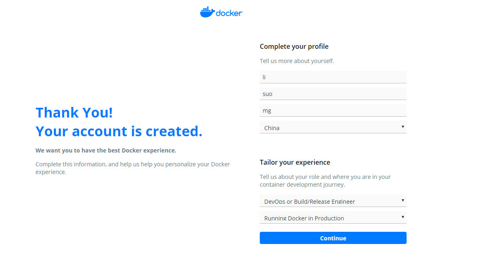

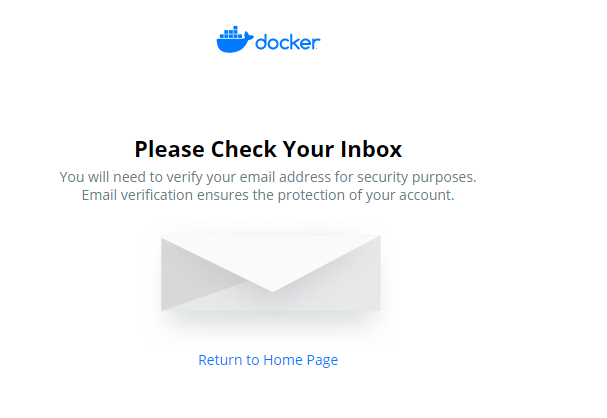

邮件地址认证
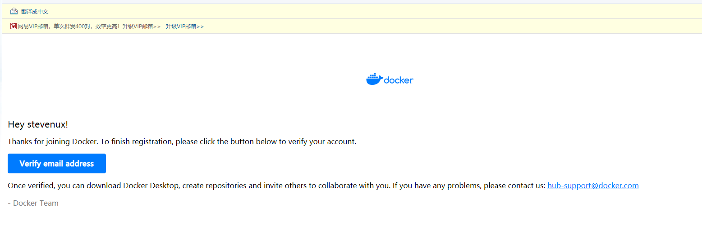

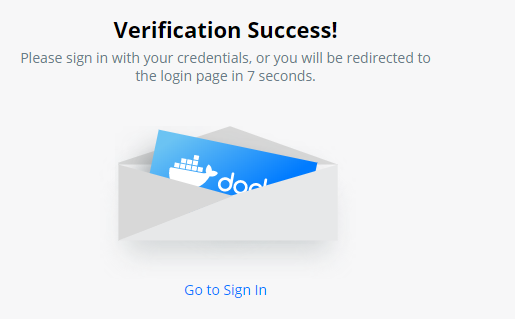

登录
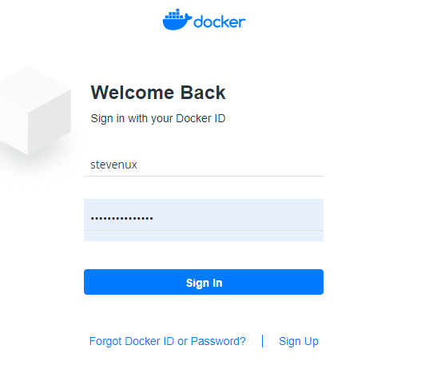

完善账户信息
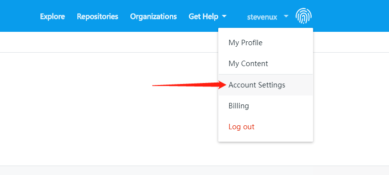

保存
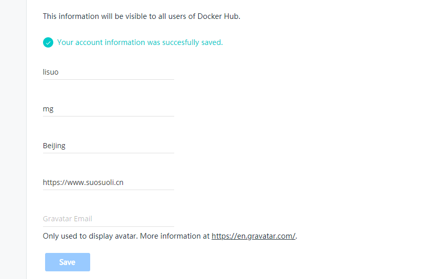

## 1.2 使用 docker-CLI 登录

使用`docker login`命令登录 Docker Hub

```bash
root@ubuntu-suosuoli-node1:~# docker login docker.io
Login with your Docker ID to push and pull images from Docker Hub. If you don\'t have a Docker ID, head over to https://hub.docker.com to create one.
Username: stevenux
Password:
WARNING! Your password will be stored unencrypted in /root/.docker/config.json.
Configure a credential helper to remove this warning. See
https://docs.docker.com/engine/reference/commandline/login/#credentials-store

Login Succeeded
# 看到这表示登录成功
```

## 1.3 查看认证信息

登录成功之后会在当前目录生成一个隐藏文件用于保存登录认证信息

```bash
root@ubuntu-suosuoli-node1:~# ll .docker/config.json
-rw------- 1 root root 173 Feb 20 19:47 .docker/config.json
root@ubuntu-suosuoli-node1:~# cat .docker/config.json
{
	"auths": {
		"https://index.docker.io/v1/": {
			"auth": "c3RldmVudXg6c3RldmVudXgtZG9ja2Vy"
		}
	},
	"HttpHeaders": {
		"User-Agent": "Docker-Client/19.03.6 (linux)"
	}
```

## 1.4 为镜像指定 TAG 并上传

```bash
root@ubuntu-suosuoli-node1:~# docker images
REPOSITORY          TAG                 IMAGE ID            CREATED             SIZE
alpine              latest              e7d92cdc71fe        4 weeks ago         5.59MB
...
root@ubuntu-suosuoli-node1:~# docker tag alpine:latest docker.io/stevenux/alpine:latest
root@ubuntu-suosuoli-node1:~# docker push docker.io/stevenux/alpine:latest
The push refers to repository [docker.io/stevenux/alpine]
5216338b40a7: Mounted from library/alpine
latest: digest: sha256:ddba4d27a7ffc3f86dd6c2f92041af252a1f23a8e742c90e6e1297bfa1bc0c45 size: 528
```

## 1.5 到 Docker Hub 验证

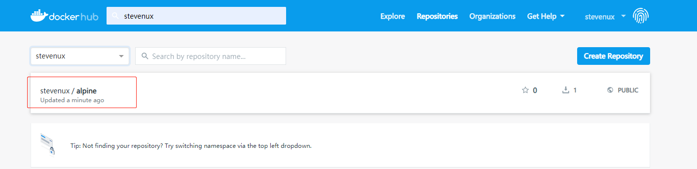

## 1.6 在另一个服务器下载镜像

```bash

root@docker-server-node1:~# docker pull docker.io/stevenux/alpine:latest
latest: Pulling from stevenux/alpine
Digest: sha256:ddba4d27a7ffc3f86dd6c2f92041af252a1f23a8e742c90e6e1297bfa1bc0c45
Status: Image is up to date for stevenux/alpine:latest
docker.io/stevenux/alpine:latest

root@docker-server-node1:~# docker images
REPOSITORY          TAG                 IMAGE ID            CREATED             SIZE
stevenux/alpine     latest              e7d92cdc71fe        4 weeks ago         5.59MB
...
```

## 1.7 从该镜像启动容器

```bash
[root@docker-server-node1 nginx]# docker run -it --rm stevenux/alpine:latest sh
/ # pwd
/
/ # exit
```

# 二. 上传本地镜像到阿里云

将本地镜像上传至阿里云，实现镜像备份与统一分发的功能。
[阿里云容器镜像 Registry 地址](https://cr.console.aliyun.com)

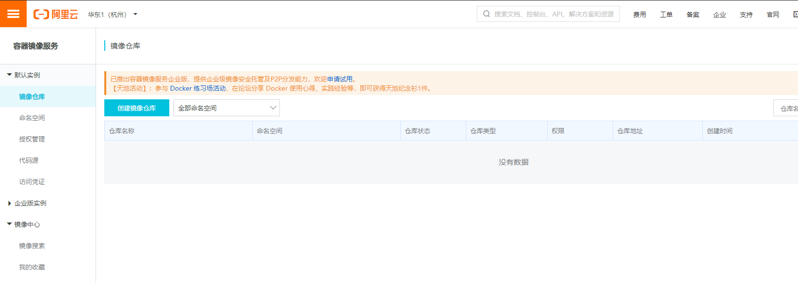

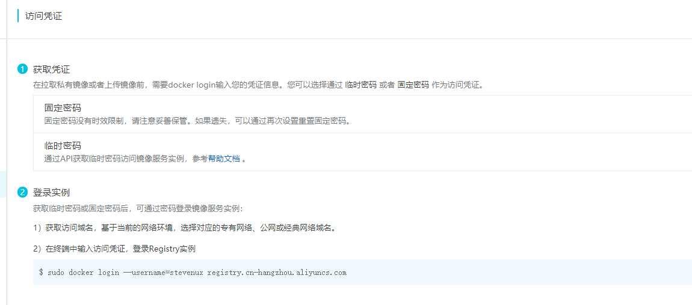

## 2.1 将镜像上传到 Registry

```bash
[root@docker-server-node1 ~]# docker login --username=stevenux registry.cn-hangzhou.aliyuncs.com
Password:
WARNING! Your password will be stored unencrypted in /root/.docker/config.json.
Configure a credential helper to remove this warning. See
https://docs.docker.com/engine/reference/commandline/login/#credentials-store

Login Succeeded
```

### 2.1.1 在阿里云创建命名空间和仓库

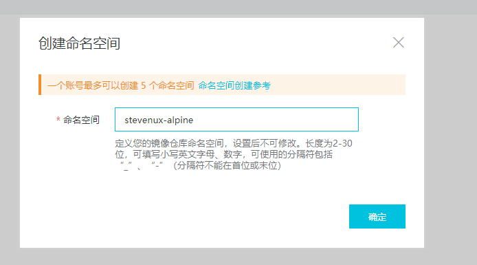

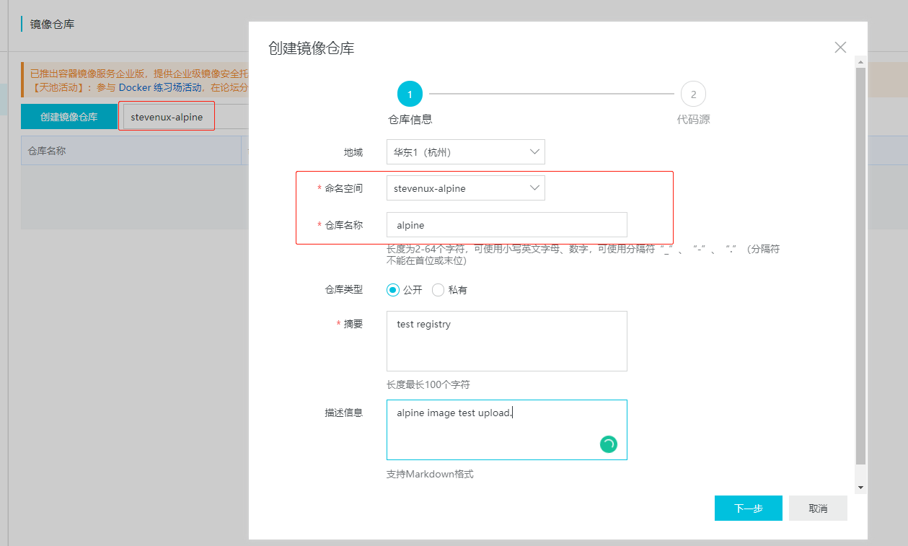

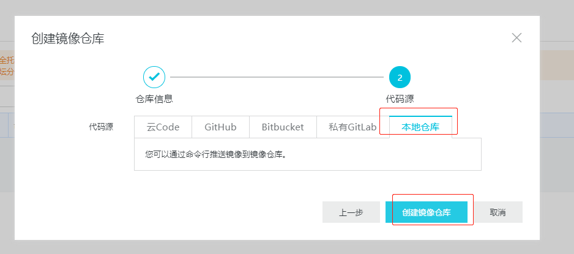

1. 登录阿里云 Docker Registry

```bash
$ sudo docker login --username=stevenux registry.cn-hangzhou.aliyuncs.com
用于登录的用户名为阿里云账号全名，密码为开通服务时设置的密码。
您可以在访问凭证页面修改凭证密码。
```

2. 从 Registry 中拉取镜像

```bash
$ sudo docker pull registry.cn-hangzhou.aliyuncs.com/stevenux-alpine/alpine:[镜像版本号]
```

3. 将镜像推送到 Registry

```bash
$ sudo docker login --username=stevenux registry.cn-hangzhou.aliyuncs.com
$ sudo docker tag [ImageId] registry.cn-hangzhou.aliyuncs.com/stevenux-alpine/alpine:[镜像版本号]
$ sudo docker push registry.cn-hangzhou.aliyuncs.com/stevenux-alpine/alpine:[镜像版本号]
```

### 2.1.2 将本地镜像推送到阿里云容器 Registry

```bash
[root@docker-server-node1 ~]# docker tag alpine:latest registry.cn-hangzhou.aliyuncs.com/stevenux-alpine/alpine:latest
[root@docker-server-node1 ~]# docker push registry.cn-hangzhou.aliyuncs.com/stevenux-alpine/alpine:latest
The push refers to repository [registry.cn-hangzhou.aliyuncs.com/stevenux-alpine/alpine]
5216338b40a7: Pushed
latest: digest: sha256:ddba4d27a7ffc3f86dd6c2f92041af252a1f23a8e742c90e6e1297bfa1bc0c45 size: 528

[root@docker-server-node1 ~]# docker images
REPOSITORY                                                 TAG                 IMAGE ID            CREATED             SIZE
registry.cn-hangzhou.aliyuncs.com/stevenux-alpine/alpine   latest              e7d92cdc71fe        4 weeks ago         5.59MB
...
```

## 2.2 登录阿里云验证

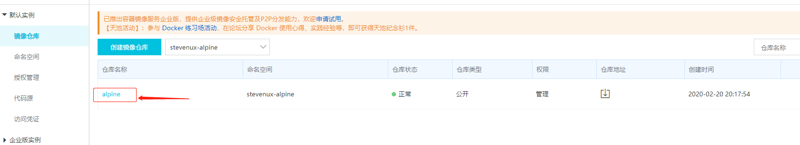
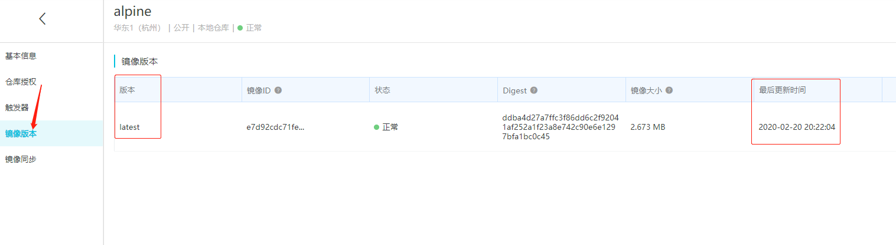
