# 一.Docker 简介

## 1.1 Docker 概念

Docker 于 2013 年开源，其基于 go 语言开发，是一个开源的 PaaS 服务(Platform
as a Service，平台即服务的缩写)。而 go 语言由 google 开发，docker 公司最早期
叫 dotCloud。Docker 开源后广受欢迎，于是公司改名为 Docker Inc，总部位于美国
加州旧金山，Docker 本质上是基于 linux 内核实现，大量依赖内核技术的平台软件，
Docker 最早采用 LXC 容器技术(LinuX Container 的简写，LXC 是 Linux 原生支持的
容器技术，可以提供轻量级的操作系统级虚拟化，docker 就是基于 LXC 发展起来的，提
供 LXC 的高级封装)。

早期 Docker 引擎的容器运行时(container runtime)环境依赖于 LXC 提供，后来，
Docker 自己研发了称为 libcontainer 的库来启动容器。该库基于 Golang(Go 语言)
开发，并编译为最初的 docker 引擎。最后，由于 OCI(Open Container Initiative:
2015 年 6 月，Docker 公司与 Linux 基金会推出的开放容器计划, 成员包括 Oracle、
Microsoft、EMC、IBM、Cisco 和 VMware 等在内的一大批国际著名软件厂商的加入,
使 Docker 生态圈开始迅速膨胀。) 组织的成立，Docker 公司将 libcontainer 代码捐
赠给 OCI 组织，并将该库发展为独立的工具称为 **runc**。

目前，runc 是 OCI 标准的参考实现，很多其他的容器引擎也使用 runc 作为底层的运
行时。runc 作为容器技术的最底层，提供了让容器持续运行的能力，而不在乎是何种容
器引擎。Runc 是一个非常简洁的工具，其需要一个挂载点(也就是一个目录路径)和一些
元数据(config.json)来开始工作。

Docker 相比虚拟机的交付速度更快，资源消耗更低，Docker 采用客户端/服务端架构，
使用远程 API 来管理和创建 Docker 容器，其可以轻松的创建一个轻量级的、可移植
的、自给自足的容器，docker 的三大理念是 build(构建)、ship(运输)、 run(运行)，
Docker 遵从 apache 2.0 协议，并通过 namespace 及 cgroup 等 linux 内核技术
来提供容器的资源隔离与安全保障等，所以 Docke 容器在运行时不需要类似虚拟机
(空运行的虚拟机占用物理机 6-8%性能)的额外资源开销，因此可以大幅提高资源利用
率,总而言之 Docker 是一种用了新颖方式实现的轻量级虚拟机.类似于 VM 但是在原理
和应用上和 VM 的差别还是很大的，并且 docker 的专业叫法是应用容器
(Application Container)。

## 1.2 Docker 架构

Docker 为客服端-服务器架构。Docker 服务端也就是 Docker 的守护进程(docker daemon)，
Docker 客户端通过 REST API 和守护进程通信，Docker daemon 负责创建、运行和
分发容器。客户端和服务端可以运行于同一系统，也可以使用客户端连接远程服务进程。在
同一系统时客户端和服务端通过 UNIX sockets 通信，不在同一系统则通过网络接口通信。


### 1.2.1 Docker 组成

Docker 由多项技术组成，既包括 Linux 内核的功能，也包括 Docker 自己开发的库，还
包括了 OCI 组织定义的容器标准。

#### 1.2.1.1 Docker engine

Docker 引擎由 Docker 服务端守护进程、Docker 客户端及它们之间交流的 REST API
组成。Docker 引擎是运行和管理容器的核心。


#### 1.2.1.2 Server 服务端

Docker 服务端(Server)：Docker 守护进程(dockerd)，运行 docker 容器。并接受
docker client(docker 命令工具)的指令，已进行相应的创建和运行容器的工作。其
监听 Docker API 请求并管理 Docker 对象(镜像，容器，网络和存储等)。服务端守
护程序之间也可以通讯以管理 Docker 服务。

#### 1.2.1.3 Client 客户端

Docker 客户端(Client)：用于向 Docker 服务端发送指令的命令行工具，在 linux
下的客户端使用 docker 命令调用 docker REST API 和 服务端通讯。如：当运行如
下命令时：
`docker run -it -p 80:80 nginx:1.16.1`
Docker 客户端将该命令发送给`dockerd`，`dockerd`进程解析该命令后会寻找`nginx:1.16.1`
这个镜像，并启动为容器，`-it`表示交互式运行容器并为其分配一个伪终端，`-p 80:80`
表示将主机的 80 端口映射到容器的 80 端口。

#### 1.2.1.4 Registry 仓库

Docker 仓库(Registry): 保存镜像的仓库，类似于 git 或 svn 这样的版本控制系。
Docker Hub 是 Docker 建立的公开镜像仓库，任何人都可以使用。
运行`docker pull IMAGE`时，Docker 默认会到 Docker Hub 仓库拉取镜像 IMAGE。
运行`docker run IMAGE`时，如果本地没有该镜像，则 Docker 也会到 Docker Hub
拉取该镜像并由 dockerd 创建容器运行。

#### 1.2.1.5 Docker objects 对象

当使用 Docker 时，实际上就是创建和使用镜像、容器、网络和存储等对象。

##### 1.2.1.4.1 images 镜像

Docker 镜像(Images)：镜像可以理解为创建容器实例使用的模板。

镜像为包含创建容器所需指令的只读模板(read-only template)。一般来说，我们使用的
镜像都是基于另一个镜像创建的，在前一个镜像的基础上进行了一些自定义。例如：可以
基于 ubuntu 镜像创建另一个镜像，自定义的内容仅仅是安装 Apache 服务器和一些工具
及使得这些软件能够运行的配置细节。

##### 1.2.1.4.2 container 容器

Docker 容器(Container): 容器是从镜像生成对外提供服务的一个或一组服务。

简单的说，一个容器就是一个镜像的可运行实例。可以使用 Docker API 来创建、启动、
停止、移动或删除一个容器。默认情况下，各个容器之间及容器和运行 Docker 的主机系统
之间都是隔离的。可以控制一个容器的网络、存储、或者其它的底层系统和其他容器之间
的隔离细节。

一个容器被其对应的镜像和用户创建其时所提供的选项所定义，当一个容器被移除后，任何
对其作出的更改(未存储在磁盘的信息)都将消失。

下面的命令运行了一个 ubuntu 镜像，以交互式运行在本地命令行会话中，并运行程序
`/bin/bash`。

```bash
~$ docker run -it ubuntu /bin/bash
```

当运行上面的命令时，发生了以下事情(假设使用默认的镜像仓库配置)：

1. 如果本地没有名为`ubuntu`的镜像，Docker 就会从默认配置的镜像仓库拉取该镜像，
   相当于运行了命令`~$ docker pull ubuntu`。
2. 镜像拉取到本地后，Docker 创建一个新的容器，相当于运行命令`docker container create`
3. Docker 分配一个可读写的文件系统给该容器，作为其最后一层。这样使得运行的容器
   可以在自己的文件系统中创建和修改文件和目录。
4. Docker 创建一个网络接口来将容器连接到默认的网络上(如果不指定任何网络选项)，
   该过程中 docker 分配了一个 IP 给容器。默认情况下容器是可以通过主机的网络接口
   访问外部网络的。
5. Docker 运行该容器并运行`/bin/bash`，由于容器是交互式运行并依附于当前终端，
   所以可以在 bash 中输入命令来运行。
6. 当运行键入`exit`后回车，就退出了`/bin/bash`，由于是交互式运行 ubuntu 容器，
   所以此时 ubuntu 容器也停止了运行，但是未被移除。后面还可以再次运行该容器。

##### 1.2.1.4.3 services 服务

服务(Service)允许在多个 Docker daemon 之间进行容器伸缩管理。多个 Docker daemon
共同工作结合多个`manager`和多个`worker`组成了 Docker swarm。Docker swarm 的
每个成员都是一个 Docker daemon，各个 daemon 之间使用 Docker API 通讯。Service
允许管理员定义预期的状态。Docker 引擎在 Docker1.12 版本后支持 swarm 模式。

## 1.3 Docker 与传统虚拟化技术区别

Docker 相对于传统的虚拟化技术来说具有以下优点：

1. **资源利用率更高**：一台物理机可以运行数百个容器，但是一般只能运行数十个虚拟机。
2. **开销更小**：不需要启动单独的虚拟机占用硬件资源。
3. **启动速度更快**：可以在数秒内完成启动。
4. **体积小**：不像虚拟机使用 GB 为计量单位，容器的大小使用 MB 为单位。

对比

| 指标       | VMs-虚拟化                             | Container-容器                   |
| :--------- | :------------------------------------- | :------------------------------- |
| 体积       | 重量级，GB                             | 轻量级，MB                       |
| 性能       | 性能损失大                             | 接近 host 原生的性能表现         |
| 运行环境   | 每个应用运行于自己的 OS                | 所有容器应用运行于同一个 OS      |
| 虚拟化级别 | 硬件级别的虚拟化                       | OS 操作系统级的虚拟化            |
| 启动时间   | 可能需要几分钟                         | 启动时间在几秒内，甚至几毫米     |
| 内存消耗   | 消耗大量内存                           | 消耗少量内存，类似 OS 自己的进程 |
| 隔离级别   | 所有虚拟机和应用之间完全隔离，比较安全 | 进程级别的隔离，可能不安全       |


## 1.4 从传统虚拟化转为容器所带来的问题

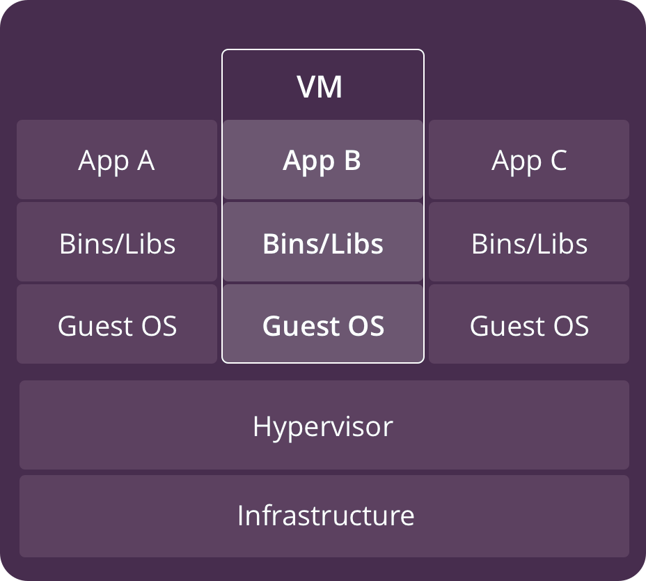

使用虚拟机是为了更好的实现服务运行环境隔离，每个虚拟机都有独立的内核，虚拟化可以实现
不同操作系统的虚拟机，但是通常一个虚拟机只运行一个服务，很明显资源利用率比较低且造成
不必要的性能损耗。创建虚拟机的目的是为了运行应用程序，比如 Nginx、PHP、Tomcat 等
web 程序，使用虚拟机无疑带来了一些不必要的资源开销。

容器技术的出现则减少了中间大量的运行和转换环节，节约了大量不必要的性能损耗和体积占用。

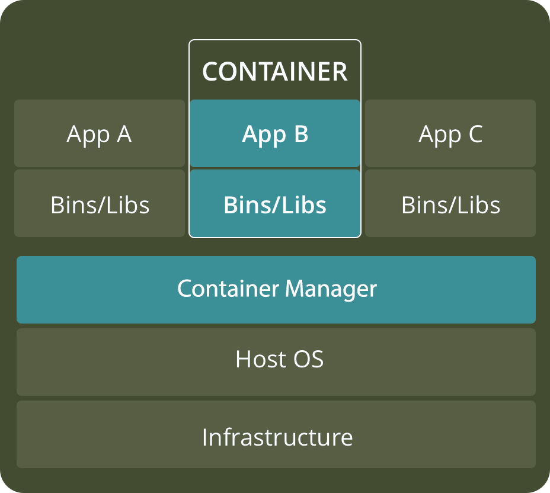

如上图一个宿主机运行了 3 个容器，由于容器的轻量级，一个主机可能运行几十上百个容器，那么
在同一个 OS 下运行多个容器带来的以下问题该怎么解决呢?比如：

1. 怎样保证每个容器都有不同的文件系统并且能互不影响？
2. 一个 docker 主进程内的各个容器都是其子进程，如何实现同一个主进程下不同类型的子进程？
3. 各个进程间通信时能相互访问(内存数据)吗？
4. 怎么解决每个容器 IP 及端口分配的问题？
5. 多个容器的主机名能一样吗？
6. 每个容器要不要有 root 用户？
7. 怎么解决账户重名问题？

以上问题怎么解决？
幸运的是，在前人的基础上(Linux 提供的基础功能)，docker 成功解决了上述问题。
其中最重要的两项技术都由 Linux 内核提供：`Linux Namespace`技术和`Linux Control Group`
技术。

## 1.4 Linux Namespace

Linux Namespace 是 Linux 系统的底层概念，其由内核实现。Linux 命名空间起源于 2002
年 2.4.19 内核中的 mount 命名空间类。从 2006 年开始添加了其他名称空间，并一直持续。
随着用户命名空间(User namespace)的引入，在内核 3.8 版本中完成了足够的容器支持功能。

到 Linux kernel 内核版本 4.10，已经有 7 种命名空间加入到其中。从完成的任务角度看，
所有命名空间的功能都是相同的:每个进程都和一个命名空间相关联并且只能访问或者使用
和该命名空间相关联的资源，这样一来每个进程对系统的资源都有一个唯一的角度。何种
资源被隔离取决于为进程组所创建的命名空间类型。

一般，在 Linux 系统下，由于运行软件或者服务产生的新进程一般是由`fork()`系统调用
生成，或者在 bash 中键入命令，bash 会调用`exec()`系统调用来生成普通的进程。但是
容器进程是不一样的，当发送一个创建容器的请求给 Docker 引擎时，Docker 引擎最终会
调用`clone()`系统调用来生成容器进程，使用该系统调用就可以创建带有命名空间的容器化
的进程。

在运行 Docker 容器时，Docker 会为该容器创建一组命名空间(在内存中表现为各种数据结构)，
该容器的多个方面都被限定在这一组命名空间中。各个 docker 容器运行在同一个 docker 主
进程并且共用同一个宿主机系统内核，各 docker 容器运行在宿主机的用户空间，每个容器都
要有类似于虚拟机一样的相互隔离的运行空间，但是容器技术是在一个进程内实现运行指定服
务的运行环境，并且还可以保护宿主机内核不受其他进程的干扰和影响，如文件系统空间、网
络空间、进程空间等。容器运行空间的相互隔离本质上是共同的内核上运行的不同的用户空间
之间的隔离，目前内核提供的命名空间功能包括:

| 命名空间                               | 功能                               | 解释                                                        | clone()系统调用使用的 flag | 引入时内核版本 |
| :------------------------------------- | :--------------------------------- | :---------------------------------------------------------- | :------------------------- | -------------- |
| MNT(mount namespace)                   | 提供磁盘挂载点和文件系统的隔离能力 | 隔离挂载点(Mount point)                                     | CLONE_NEWNS                | Linux 2.4.19   |
| IPC Namespace                          | 进程间通信相关的隔离功能           | 隔离内核中的 System V IPC, POSIX message queues             | CLONE_NEWIPC               | Linux 2.6.19   |
| UTS Namespace(UNIX Timesharing System) | 提供主机名隔离能力                 | 隔离主机名和 NIS 域名                                       | CLONE+NEWUTS               | Linux 2.6.19   |
| PID Namespace                          | 提供进程隔离能力                   | 隔离进程 ID 名字空间，不同的进程 ID 空间中进程 ID 从 1 开始 | CLONE_NEWPID               | Linux 2.6.24   |
| Net Namespace                          | 提供网络隔离能力                   | 隔离网络设备，栈，端口等                                    | CLONE_NEWNET               | Linux 2.6.29   |
| User Namespace                         | 提供用户隔离能力                   | 隔离用户 ID 和组 ID                                         | CLONE_NEWUSER              | Linux 3.8      |
| Cgroup Namespace                       | 提供 cgroup 的隔离                 | 隔离 Cgroup 的根目录                                        | CLONE_NEWCGROUP            | Linux 4.6      |

在 Linux 内核中，以下三个系统调用可以修改命名空间:

1. `clone()`系统调用，其使用 flag(上面表格中的 CLONE_NEW..) 来指定新的进程应当被合并
   到哪个新的命名空间。
2. `unshare()`系统调用，允许一个进程将其和其他进程共享的部分运行上下文分离开。
3. `setns()`系统调用, 进入一个文件描述符指定的名称空间。

### 1.4.1 MNT Namespace

[参考:ma7.org-mount_namespaces](http://man7.org/linux/man-pages/man7/mount_namespaces.7@@man-pages.html)

### 1.4.2 IPC Namespace

[参考:ma7.org-ipc_namespaces](http://man7.org/linux/man-pages/man7/ipc_namespaces.7@@man-pages.html)

### 1.4.3 UTS Namespace

[参考:ma7.org-uts_namespaces](http://man7.org/linux/man-pages/man7/uts_namespaces.7@@man-pages.html)

### 1.4.4 PID Namespace

[参考:ma7.org-pid_namespaces](http://man7.org/linux/man-pages/man7/pid_namespaces.7@@man-pages.html)

### 1.4.5 Net Namespace

[参考:ma7.org-network_namespaces](http://man7.org/linux/man-pages/man7/network_namespaces.7@@man-pages.html)

### 1.4.6 User Namespace

[参考:ma7.org-user_namespaces](http://man7.org/linux/man-pages/man7/user_namespaces.7@@man-pages.html)

## 1.5 Linux Control Groups

[Linux Cgroups manpage 文档](http://man7.org/linux/man-pages/man7/cgroups.7@@man-pages.html)

### 1.5.1 Cgroups 介绍

Linux Cgroups 的全称是 Linux Control Groups，它最主要的作用，就是限制
一个进程组能够使用的资源上限，包括 CPU、内存、磁盘、网络带宽等等。此外，
还能够对进程进行优先级设置，以及将进程挂起和恢复等操作。

Linux Control Groups 为内核的一项特性，该特性可将多个进程组织成层级结构
的进程组，这些进程组所使用的各种资源即可以被限制和监控。内核的 Cgroups 接口
通过叫做 cgroupfs 的伪文件系统(pseudo-filesystem)提供。进程的分组功能(
Process groups)是在 cgroup 的核心代码(内核代码)中实现的，而资源的跟踪和
限制功能则在一组分别控制每种资源类型(per-resource-type)的子系统中实现(
这些子系统分别控制内存，CPU 等)

### 1.5.2 Cgroups 术语解释

**cgroup**:一个 cgroup 就是与多个限制和参数绑定的进程，这些限制和参数通过
cgroup 文件系统定义。
**subsystem**:一个 subsystem 就是用来修改和控制属于某个 cgroup 的进程行为
的内核组件。内核实现了多个不同的子系统，这使得例如控制某个 cgroup 的 CPU 时
间和可用内存等工作可行，也可以进行如:监控某个 cgroup 使用的 CPU 时间、暂停和
恢复某个 cgroup 内的进程等工作。
**resource controller**:subsystem 有时也被叫做 resource controller(资源控
制器，简称控制器)。

属于某个控制器的 cgroups 被组织成层级结构。通过在 cgroup 文件系统中创建、删除
和重命名子文件夹来定义该层级结构。在层级结构的每一层都可以定义属性(即限制措施)。

### 1.5.3 查看内核所支持的 Cgroups 特性

在使用 Docker 创建和使用容器时，如果不对其做任何资源限制，则宿主机 OS
可能会允许其占用无限大的内存空间，有时候会因为容器中运行的程序代码
bug 导致程序会一直申请内存，直到把宿主机内存占完，为了避免此类的问
题出现，宿主机有必要对容器进行资源分配限制，比如 CPU、内存等。而 Cgroups
的功能正是解决以上问题的 Linux 内核功能特性。要使用 Cgroups，编译内
核时必须带上`CONFIG_CGROUP_XXX`选项。可以查看内核编译参数来确定是否
支持 Cgroups 功能。

#### 1.5.3.1 在 Ubuntu 18.04.3 LTS 查看

```bash
root@ubuntu-suosuoli-node1:~# uname -r
4.15.0-55-generic    # 内核版本为4.15.0
root@ubuntu-suosuoli-node1:~# cat /boot/
config-4.15.0-55-generic      grub/                         initrd.img-4.15.0-55-generic  System.map-4.15.0-55-generic  vmlinuz-4.15.0-55-generic
root@ubuntu-suosuoli-node1:~# cat /boot/config-4.15.0-55-generic | grep CGROUP
CONFIG_CGROUPS=y
CONFIG_BLK_CGROUP=y
# CONFIG_DEBUG_BLK_CGROUP is not set
CONFIG_CGROUP_WRITEBACK=y
CONFIG_CGROUP_SCHED=y
CONFIG_CGROUP_PIDS=y
CONFIG_CGROUP_RDMA=y
CONFIG_CGROUP_FREEZER=y
CONFIG_CGROUP_HUGETLB=y
CONFIG_CGROUP_DEVICE=y
CONFIG_CGROUP_CPUACCT=y
CONFIG_CGROUP_PERF=y
CONFIG_CGROUP_BPF=y
# CONFIG_CGROUP_DEBUG is not set
CONFIG_SOCK_CGROUP_DATA=y
CONFIG_NETFILTER_XT_MATCH_CGROUP=m
CONFIG_NET_CLS_CGROUP=m
CONFIG_CGROUP_NET_PRIO=y
CONFIG_CGROUP_NET_CLASSID=y
root@ubuntu-suosuoli-node1:~# cat /boot/config-4.15.0-55-generic | grep "CGROUP" | grep -v "#" | wc -l
17  # ubuntu有17项Cgroups相关特性
```

#### 1.5.3.2 在 CentOS 7.7.1908 查看

```bash
[root@redis-server-node1 ~]# uname -r
3.10.0-1062.el7.x86_64   # 内核版本3.10.0
[root@redis-server-node1 ~]# cat /boot/config-3.10.0-1062.el7.x86_64 | grep "CGROUP"
CONFIG_CGROUPS=y
# CONFIG_CGROUP_DEBUG is not set
CONFIG_CGROUP_FREEZER=y
CONFIG_CGROUP_PIDS=y
CONFIG_CGROUP_DEVICE=y
CONFIG_CGROUP_CPUACCT=y
CONFIG_CGROUP_HUGETLB=y
CONFIG_CGROUP_PERF=y
CONFIG_CGROUP_SCHED=y
CONFIG_BLK_CGROUP=y
# CONFIG_DEBUG_BLK_CGROUP is not set
CONFIG_NETFILTER_XT_MATCH_CGROUP=m
CONFIG_NET_CLS_CGROUP=y
CONFIG_NETPRIO_CGROUP=y
[root@redis-server-node1 ~]# cat /boot/config-3.10.0-1062.el7.x86_64 | grep "CGROUP" | grep -v "#" | wc -l
12  # 提供Cgroups相关的特性12个
```

Cgroups 在内核层默认已经开启，从 centos 和 ubuntu 对比结果来看，显然内核
较新的 ubuntu 支持的功能更多。

#### 1.5.3.3 cgroups 中内存相关特性

Ubuntu

```bash
root@ubuntu-suosuoli-node1:~# cat /boot/config-4.15.0-55-generic | grep "CG" | grep "MEM"
CONFIG_MEMCG=y
CONFIG_MEMCG_SWAP=y
# CONFIG_MEMCG_SWAP_ENABLED is not set
CONFIG_SLUB_MEMCG_SYSFS_ON=y
```

CentOS

```bash
[root@redis-server-node1 ~]# cat /boot/config-3.10.0-1062.el7.x86_64 | grep "CG" | grep "MEM"
CONFIG_MEMCG=y
CONFIG_MEMCG_SWAP=y
CONFIG_MEMCG_SWAP_ENABLED=y
CONFIG_MEMCG_KMEM=y
```

### 1.5.4 Cgroups 控制器具体实现介绍

参考: [man7.org-cgroups](http://man7.org/linux/man-pages/man7/cgroups.7.html)

cgroups 的最初 release V1 版本在 kernel-1.6.24 版本，此时已有多个控制器被实现，
然而由于开发这些控制器时未形成统一协调的开发过程，导致了在控制器之间
出现了不一致及 cgroup 层级管理变得比较复杂。由于初代的开发原因，在
kernel-3.10 版本又重新开发了 cgroup 的 V2 版本，新版本于 kernel-4.5 由
官方发布。由于兼容原因，V1 和 V2 并存与内核，V2 只实现了 V1 版本的部分控制器。

#### 1.5.4.1 Control Groups version 1 controller

每个 cgroups 的控制器都由一个内核配置选项控制。cgroups 这项特性的
开关则由内核选项`CONFIG_CGROUPS`决定。

| 控制器     | 内核选项                  | 引入时内核版本 | 功能                                                                                                                     |
| :--------- | :------------------------ | :------------- | :----------------------------------------------------------------------------------------------------------------------- |
| cpu        | CONFIG_CGROUP_SCHED       | Linux 2.6.24   | 控制 cgroup 内各进程对 CPU 的使用                                                                                        |
| cpuacct    | CONFIG_CGROUP_CPUACCT     | Linux 2.6.24   | 提供了对进程组的 CPU 使用情况的统计                                                                                      |
| cpuset     | CONFIG_CPUSETS            | Linux 2.6.24   | 用于将 cgroup 内的进程绑定到一组特定 CPU 上运行                                                                          |
| memory     | CONFIG_MEMCG              | Linux 2.6.25   | 限制 cgroup 中的进程使用的内存和 cgroup 使用了的交换分区空间，及生成报告                                                 |
| devices    | CONFIG_CGROUP_DEVICE      | Linux 2.6.26   | 控制 cgroup 中的进程是否能创建新的设备并以可读可写等方式打开                                                             |
| freezer    | CONFIG_CGROUP_FREEZER     | Linux 2.6.28   | 挂起和恢复某个 cgroup 中的所有进程，挂起某个 cgroup 会导致其子 cgroup 也被挂起                                           |
| net_cls    | CONFIG_CGROUP_NET_CLASSID | Linux 2.6.29   | 在由 cgroup 产生的网络数据包中插入一个 classID，classID 可以用于防火墙规则等，数据包是指离开 cgroup 的而非进入 cgroup 的 |
| blkio      | CONFIG_BLK_CGROUP         | Linux 2.6.33   | blkio cgroup 通过对存储层次结构中的叶节点和中间节点应用 IO 控制(节流和上限)来控制和限制对指定块设备的访问                |
| perf_event | CONFIG_CGROUP_PERF        | Linux 2.6.39   | 监测属于某个特定的 cgroup 的所有线程以及运行在特定 CPU 上的线程                                                          |
| net_prio   | CONFIG_CGROUP_NET_PRIO    | Linux 3.3      | 允许对每个网络设备指定优先级(为 cgroup 而指定)                                                                           |
| hugetlb    | CONFIG_CGROUP_HUGETLB     | Linux 3.5      | 支持了限制 cgroup 对大页内存的使用                                                                                       |
| pids       | CONFIG_CGROUP_PIDS        | Linux 4.3      | 限制在一个 cgroup 中创建的进程的数量                                                                                     |
| rdma       | CONFIG_CGROUP_RDMA        | Linux 4.11     | RDMA 控制器用来限制每个 cgroup 对 RDMA/IB-spe‐cific 资源的使用                                                           |

#### 1.5.4.2 Control Groups version 2 controller

Cgroups 的版本 2 的控制器大多继承于版本 1，差异和详细说明可以在`man7.ogr`找到:
[man7.org-cgroups](http://man7.org/linux/man-pages/man7/cgroups.7.html)

### 1.5.5 Cgroups 使用例子

Cgroups 默认放在`/sys/fs/cgroup/`，如下：

```bash
root@ubuntu-suosuoli-node1:~# df -HT
Filesystem     Type      Size  Used Avail Use% Mounted on
...
tmpfs          tmpfs     1.1G  8.2k  1.1G   1% /dev/shm
tmpfs          tmpfs     5.3M     0  5.3M   0% /run/lock
tmpfs          tmpfs     1.1G     0  1.1G   0% /sys/fs/cgroup  # cgroup所在地的文件系统类型为tmpfs
tmpfs          tmpfs     207M     0  207M   0% /run/user/0
overlay        overlay    43G  6.8G   34G  18% /var/lib/docker/overlay2/f3bd44bf71dd8df9eeb608659b57cd6f95621db7f054cbf1843e0bdd48f080ac/merged
shm            tmpfs      68M     0   68M   0% /var/lib/docker/containers/05a00f2cc211e5747d70c147bd95716286a42c14818357bced41547c8eabafc7/mounts/shm
root@ubuntu-suosuoli-node1:~# ll /sys/fs/cgroup/  # 目前系统的cgroups表现为多个目录
total 0
drwxr-xr-x 15 root root 380 Feb 14 08:56 ./
drwxr-xr-x 10 root root   0 Feb 14 11:22 ../
dr-xr-xr-x  5 root root   0 Feb 14 11:22 blkio/
lrwxrwxrwx  1 root root  11 Feb 14 08:56 cpu -> cpu,cpuacct/
lrwxrwxrwx  1 root root  11 Feb 14 08:56 cpuacct -> cpu,cpuacct/
dr-xr-xr-x  5 root root   0 Feb 14 11:22 cpu,cpuacct/
dr-xr-xr-x  3 root root   0 Feb 14 11:22 cpuset/
dr-xr-xr-x  5 root root   0 Feb 14 11:22 devices/
dr-xr-xr-x  3 root root   0 Feb 14 11:22 freezer/
dr-xr-xr-x  3 root root   0 Feb 14 11:22 hugetlb/
dr-xr-xr-x  5 root root   0 Feb 14 11:22 memory/
lrwxrwxrwx  1 root root  16 Feb 14 08:56 net_cls -> net_cls,net_prio/
dr-xr-xr-x  3 root root   0 Feb 14 11:22 net_cls,net_prio/
lrwxrwxrwx  1 root root  16 Feb 14 08:56 net_prio -> net_cls,net_prio/
dr-xr-xr-x  3 root root   0 Feb 14 11:22 perf_event/
dr-xr-xr-x  5 root root   0 Feb 14 11:22 pids/
dr-xr-xr-x  2 root root   0 Feb 14 11:22 rdma/
dr-xr-xr-x  6 root root   0 Feb 14 11:22 systemd/
dr-xr-xr-x  5 root root   0 Feb 14 11:22 unified/
```

#### 1.5.5.1 创建 Cgroups 和移动进程

cgroup 文件系统初始只包含单个根 cgroup(root cgroup)，"/"，所有进程都属于该
组。要创建一个新的 group，即是在 cgroup 文件系统中创建一个新的目录:

```bash
~$ mkdi /sys/fs/cgroup/cpu/cg1  # 该动作就创建了一个新的cgroup
```

一个进程可以移动到 cgroup 中，通过将该进程的进程 PID 写入到`cgroup.procs`
文件中即可：

```bash
~$ echo $$ > /sys/fs/cgroup/cpu/cg1/cgroup.procs
```

一次只能写一个 PID 到该文件。移动该进程的同时，其包含的线程也属于该组。

#### 1.5.5.2 移除 cgroups

为了移除某个 cgroup，其必须没有子 cgroup 并且不包含任何进程。要移除
cgroup 直接移除代表其的目录即可，里面的文件不用管。

## 1.6 容器管理工具简介

在 Linux 的 chroot、namespace、cgroups 的特性的支持下，具备了基础的容器运行
环境，但是还需要有相应的容器创建与删除的管理工具、以及怎么样把容器运行起来、容
器数据怎么处理、怎么进行启动与关闭等问题需要解决，于是容器管理技术出现了。早期
主要使用了 LXC，目前主流使用 Docker。

### 1.6.1 LXC

LXC 为 Linux Container 的简写。可以提供轻量级的虚拟化，以便隔离进程和资源。
[LXC 官方网站](https://linuxcontainers.org/)

Ubuntu 使用 LXC:

```bash
~$ apt install lxc lxd
~$ lxc-checkconfig #检查内核对lcx的支持状况，必须全部为lcx
~$ lxc-create -t 模板名称 -n lcx-test
~$ lxc-create -t download --name alpine12 -- --dist alpine  --release 3.9 --arch amd64
~$  lxc-start alpine12 #启动lxc容器
~$  lxc-attach  alpine12 #进入lxc容器

# 命令备注：
-t 模板: -t 选项后面跟的是模板，模式可以认为是一个原型，用来说明我们需
要一个什么样的容器(比如容器里面需不需要有vim, apache等软件)．模板实际
上就是一个脚本文件(位于/usr/share/lxc/templates目录)，我们这里指定
download模板(lxc-create会调用lxc-download脚本，该脚本位于刚说的模板目
录中)是说明我们目前没有自己模板，需要下载官方的模板
--name 容器名称： 为创建的容器命名
-- : --用来说明后面的参数是传递给download脚本的，告诉脚本需要下载什么样的模板
--dist 操作系统名称：指定操作系统
--release 操作系统: 指定操作系统，可以是各种Linux的变种
--arch 架构：指定架构，是x86还是arm，是32位还是64位
```

[清华模板源](https://mirrors.tuna.tsinghua.edu.cn/help/lxc-images/)
lxc 启动容器依赖于模板，但是做模板相对较难，需要手动一步步创构建文件系统、准备
基础目录及可执行程序等，而且在大规模使用容器的场景很难横向扩展，另外后期代码升
级也需要重新从头构建模板，基于以上种种原因便有了 docker。

### 1.6.2 Docker

Docker 启动一个容器也需要一个外部模板叫做镜像，docker 的镜像可以保存在一
个公共的仓库共享使用，只要把镜像下载下来就可以使用，最主要的是可以在镜像
基础之上做自定义配置并且可以再把其提交为一个镜像，一个镜像可以被启动为多个
容器。

Docker 的镜像是分层构建的，镜像底层为库文件且属于只读层即不能写入也不能删
除和修改数据，从镜像加载启动为一个容器后会生成一个可写层，其写入的数据会复
制到容器目录，但是容器内的数据在删除容器后也会被随之删除。

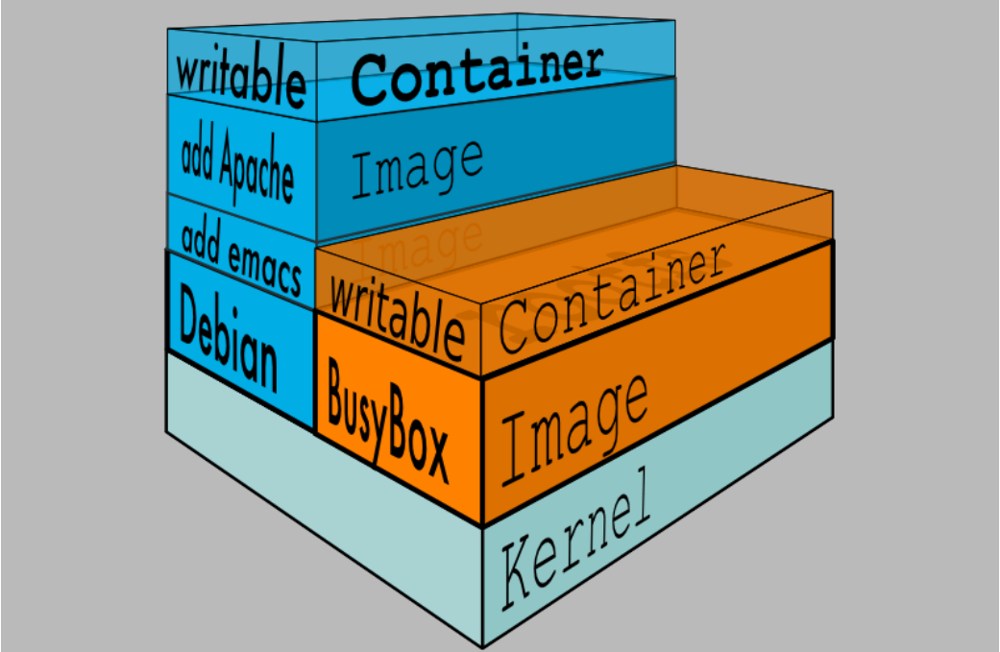

### 1.6.3 pouch

pouch 为阿里巴巴在 docker 基础上开发并发开源的容器技术。

[介绍](https://www.infoq.cn/article/alibaba-pouch)
[项目地址](https://github.com/alibaba/pouch)

## 1.7 Docker 优缺点

### Docker 优势

**快速部署**: 在极短时间内可以部署成百上千个应用，可以快速交付产品到生产中。
**高效虚拟化**: 不需要额外的 hypervisor 程序支持，直接基于 linux 内核提供
的功能实现应用虚拟化，相比虚拟机大幅提高性能和效率。
**节省成本**: 提高服务器利用率，降低 IT 支出。
**简化配置**: 将运行环境和应用打包保存至容器，使用时直接启动即可。
**快速迁移和扩展**: 容器可以夸平台运行在物理机、虚拟机、公有云等环境，良好
的兼容性可以方便将应用从 A 宿主机迁移到 B 宿主机，甚至是不同的平台之间迁移。

### Docker 不足

**隔离性**: Docker 管理的容器提供进程级别的隔离，而不是虚拟机接近硬件级别的隔离。
这样的隔离性下，内核的 BUG 会影响任何运行于其上的容器。
**大量的容器管理**: 在大量的容器部署和管理方面，Docker 有不小的挑战，但是 google 的
Kubernetes 可以帮忙。

## 1.8 Docker 容器的核心技术

实际上不仅仅是 Docker 容器，任何其他的容器，要想快速发展和进入到实际应用，
都离不开下面的核心技术的支持。

### 1.8.1 容器规范

容器技术除了 docker 之外，还有 coreOS 的 rkt、阿里的 Pouch 等，为了保证容器生态
系统的标准统一和维持健康可持续发展。包括 Linux 基金会、Docker、微软、红帽、谷歌
和、IBM 等公司在 2015 年 6 月共同成立了一个叫 open container initiative(OCI)
的开源组织，其目的就是制定开放的标准的容器规范，目前 OCI 一共发布了两个规范，分别
是 `runtime spec` 和 `image format spec`，有了这两个规范，不同的容器公司开发的
容器只要兼容这两个规范，就可以保证不同公司之间使用的容器的可移植性和可操作性。

### 1.8.2 容器 runtime

runtime 是真正运行容器的地方，为了运行不同的容器，runtime 需要和操作系统内核
紧密合作，以便为容器提供相应的运行环境。目前主流的三种容器 runtime：
**LXC**：linux 上早期的 runtime，Docker 早期就是采用 lxc 作为 runtime。
**runc**：目前 Docker 默认的 runtime，runc 遵守 OCI 规范，因此可以兼容 lxc。
**rkt**：是 CoreOS 开发的容器 runtime，也符合 OCI 规范，所以使用 rktruntime
也可以运行 Docker 容器。

runtime 只负责一件事，而且做得很好，那就是运行容器，Runc 运行容器时需要两种东西:

1. 一个规格说明文件
2. 表示某镜像的根文件系统的路径

### 1.8.3 容器管理工具

容器管理工具处于 runtime 和使用容器的用户之间，用于对用户提供图形或命令方式操作
管理容器，将用户操作传递给 runtime 执行。例如：

1. lxc 是 lxd 的管理工具。
2. Docker engine 是 Runc 的管理工具是，docker engine 包含后台 deamon 和 cli 两部
   分，大家经常提到的 Docker 就是指的 docker engine。
3. Rkt 的管理工具是 rkt cli。

### 1.8.4 容器构建工具

容器定义工和构建具允许用户定义容器的属性和内容，以方便容器能够被保存、共享和重建。
Docker 生态使用 Docker image 来创建容器。而 Docker image 是使用 Dockerfile 来
定义。

**Docker image** : 是 docker 容器的模板，runtime 依据 docker image 创建容器。
**Dockerfile** : 是包含了多个命令的文本文件，通过 dockerfile 即可创建出 docker image。
**ACI(App container image)**：与 docker image 类似，是 CoreOS 开发的 rkt 容器的镜
像格式。

### 1.8.5 镜像仓库 Registry

在 Docker 生态中，**Registry** 用来统一保存镜像，叫做镜像仓库。镜像仓库可以分为
公共仓库和私有仓库。

**Image registry**：docker 官方提供的私有仓库部署工具。
**Docker hub**：docker 官方的公共仓库，已经保存了大量的常用镜像，可以方便大
家直接下载使用。
**Harbor**：vmware 提供的自带 web 界面自带认证功能的镜像仓库，目前有很多公
司使用该仓库中的镜像。

### 1.8.6 容器编排工具

Docker 虽然可以在单个主机上运行多个容器，但是当多个容器在多个主机运行的时候，单独
管理特定容器是相当复杂的而且很容易出错，而且也无法实现某一台主机宕机后容器自动迁移
到其他主机从而实现高可用的目的，也无法实现动态伸缩容器的功能，因此需要有一种工具可
以实现统一管理、动态伸缩、故障自愈、批量执行等容器管理高级功能，这就是容器编排引擎。

容器编排技术通常包括容器管理、调度、集群定义和服务发现等功能。随着需求的提出，出现
了很多的容器编排工具，如下：

**Docker swarm**：Docker 自家开发的容器编排引擎。
**Kubernetes**：google 开发的容器编排引擎，google 内部项目 Borg 的开源实现版本，
且其同时支持 docker 和 CoreOS 的容器编排。
**Mesos+Marathon**：通用的集群组员调度平台，mesos(资源分配)与 marathon(容器编排
平台)一起提供容器编排引擎功能。

## 1.9 Docker 容器依赖的技术

这里指的 Docker 依赖的技术不是指其实现依赖的内核特性等技术，而是其作为容器技术
普遍面临的技术依赖，即其大规模普及和应用于生产时的缺陷。幸运的是，可以使用第三
放方的各种技术来弥补 Docker 在多种环境下的功能缺陷(也不能说是缺陷，只能说一个
平台不是万能的，能面对各种境况。)。

### 容器网络

Docker 自带的网络 docker network 仅支持管理单机上的容器网络，当多主机运行的时
候需要使用第三方开源网络，例如 calico、flannel 等。

### 服务发现

容器的动态扩容特性决定了容器 IP 也会随之变化，因此需要有一种机制可以自动识别并
将用户请求动态转发到新创建的容器上，kubernetes 自带服务发现功能，需要结合
kube-dns 服务解析内部域名。

### 容器监控

可以通过原生命令 `docker ps/top/stats` 查看容器运行状态，另外也可以使
`heapster或Prometheus` 等第三方监控工具监控容器的运行状态。

### 数据管理

容器的动态迁移会导致其在不同的 Host 之间迁移，因此如何保证与容器相关的数据也能随之
迁移或随时访问，可以使用逻辑卷/存储挂载等方式解决。

### 日志收集

Docker 虽然自带原生的日志查看工具 docker logs，但是容器内部的日志需要通过 ELK 等
专门的日志收集分析和展示工具进行处理，docker 并不能分门别类的处理个容器日志。

# 二.Docker 安装和基础使用

[Docker 官网](www.docker.com)

**Docker 运行系统 OS 版本选择**：
Docker 目前已经支持多种操作系统的安装运行，比如 Ubuntu、CentOS、Redhat、
Debian、Fedora，甚至是还支持了 Mac 和 Windows，在 linux 系统上需要内核版
本在 3.10 或以上，docker 版本号之前一直是 0.X 版本或 1.X 版本，但是从 2017
年 3 月 1 号开始改为每个季度发布一次稳版，其版本号规则也统一变更为 YY.MM，
例如 17.09 表示是 2017 年 9 月份发布的。

**Docker 版本选择**：
Docker 之前没有区分版本(社区版还是企业版)，但是 2017 年初推出的新项目 Moby
则是 Docker 的完全更名版，Moby 项目是属于 Docker 项目的全新母项目，Docker
将是一个隶属于的 Moby 的子产品，而且之后的版本之后开始区分为 CE 版本(社区版
本)和 EE(企业收费版)，CE 社区版本和 EE 企业版本都是每个季度发布一个新版本，
但是 EE 版本提供后期安全维护 1 年，而 CE 版本是 4 个月。Moby 项目的地址：
[Moby-Github](https://github.com/moby/moby)
[更多的版本细节可以看官方博客原文](https://blog.docker.com/2017/03/docker-enterprise-edition/)

下图为 Docker CE 和 Docker EE 的生命周期图示


**注意事项**
Docker 与 kubernetes 结合使用的时候，要安装经过 kubernetes 官方测试通过的
docker 版本，避免出现不兼容等未知的及不可预估的问题发生，kubernetes 测试过
的 docker 版本可以在 github 项目地址中的开发更新日志查询，具体如下：

[Kubernetes V1.16 开发变更日志](https://github.com/kubernetes/kubernetes/blob/master/CHANGELOG/CHANGELOG-1.16.md#v1167)


## 2.1 下载 RPM 包安装

[官方 rpm 包下载地址](https://download.docker.com/linux/centos/7/x86_64/stable/Packages/)

[aliyun rpm 包下载地址](https://mirrors.aliyun.com/docker-ce/linux/centos/7/x86_64/stable/Packages/)

[二进制下载地址-Docker](https://download.docker.com/linux/centos/7/x86_64/stable/Packages/)

[二进制下载地址-aliyun](https://mirrors.aliyun.com/docker-ce/linux/static/stable/x86_64/)

## 2.2 Centos 包管理器安装

yum 仓库配置:http://mirrors.aliyun.com/repo/Centos-7.repo
aliyun-epel:http://mirrors.aliyun.com/repo/epel-7.repo

```bash
[root@redis-server-node1 ~]# wget -O /etc/yum.repos.d/CentOS-Base.repo http://mirrors.aliyun.com/repo/Centos-7.repo
...
[root@redis-server-node1 ~]# wget -O /etc/yum.repos.d/epel.repo http://mirrors.aliyun.com/repo/epel-7.repo
...
[root@redis-server-node1 ~]# wget -O /etc/yum.repos.d/docker-ce.repo https://mirrors.aliyun.com/docker-ce/linux/centos/docker-ce.repo

[root@redis-server-node1 ~]# yum list docker-ce
Available Packages
docker-ce.x86_64                    3:19.03.6-3.el7               docker-ce-stable

[root@redis-server-node1 ~]# yum install docker-ce -y


[root@redis-server-node1 ~]# systemctl start docker
[root@redis-server-node1 ~]# docker version
[root@redis-server-node1 ~]# docker version
Client: Docker Engine - Community
 Version:           19.03.6
 API version:       1.40
 Go version:        go1.12.16
 Git commit:        369ce74a3c
 Built:             Thu Feb 13 01:29:29 2020
 OS/Arch:           linux/amd64
 Experimental:      false

Server: Docker Engine - Community
 Engine:
  Version:          19.03.6
  API version:      1.40 (minimum version 1.12)
  Go version:       go1.12.16
  Git commit:       369ce74a3c
  Built:            Thu Feb 13 01:28:07 2020
  OS/Arch:          linux/amd64
  Experimental:     false
 containerd:
  Version:          1.2.10
  GitCommit:        b34a5c8af56e510852c35414db4c1f4fa6172339
 runc:
  Version:          1.0.0-rc8+dev
  GitCommit:        3e425f80a8c931f88e6d94a8c831b9d5aa481657
 docker-init:
  Version:          0.18.0
  GitCommit:        fec3683
```

## 2.3 Ubuntu 安装 Docker

```bash
root@ubuntu-suosuoli-node1:~# apt-cache madison docker-ce # 查看可获取的版本
 docker-ce | 5:19.03.6~3-0~ubuntu-bionic | https://mirrors.aliyun.com/docker-ce/linux/ubuntu bionic/stable amd64 Packages
 docker-ce | 5:19.03.5~3-0~ubuntu-bionic | https://mirrors.aliyun.com/docker-ce/linux/ubuntu bionic/stable amd64 Packages
 docker-ce | 5:19.03.4~3-0~ubuntu-bionic | https://mirrors.aliyun.com/docker-ce/linux/ubuntu bionic/stable amd64 Packages
 docker-ce | 5:19.03.3~3-0~ubuntu-bionic | https://mirrors.aliyun.com/docker-ce/linux/ubuntu bionic/stable amd64 Packages
 docker-ce | 5:19.03.2~3-0~ubuntu-bionic | https://mirrors.aliyun.com/docker-ce/linux/ubuntu bionic/stable amd64 Packages
 docker-ce | 5:19.03.1~3-0~ubuntu-bionic | https://mirrors.aliyun.com/docker-ce/linux/ubuntu bionic/stable amd64 Packages
 docker-ce | 5:19.03.0~3-0~ubuntu-bionic | https://mirrors.aliyun.com/docker-ce/linux/ubuntu bionic/stable amd64 Packages
 docker-ce | 5:18.09.9~3-0~ubuntu-bionic | https://mirrors.aliyun.com/docker-ce/linux/ubuntu bionic/stable amd64 Packages
 docker-ce | 5:18.09.8~3-0~ubuntu-bionic | https://mirrors.aliyun.com/docker-ce/linux/ubuntu bionic/stable amd64 Packages
 docker-ce | 5:18.09.7~3-0~ubuntu-bionic | https://mirrors.aliyun.com/docker-ce/linux/ubuntu bionic/stable amd64 Packages
 docker-ce | 5:18.09.6~3-0~ubuntu-bionic | https://mirrors.aliyun.com/docker-ce/linux/ubuntu bionic/stable amd64 Packages
 docker-ce | 5:18.09.5~3-0~ubuntu-bionic | https://mirrors.aliyun.com/docker-ce/linux/ubuntu bionic/stable amd64 Packages
 docker-ce | 5:18.09.4~3-0~ubuntu-bionic | https://mirrors.aliyun.com/docker-ce/linux/ubuntu bionic/stable amd64 Packages
 docker-ce | 5:18.09.3~3-0~ubuntu-bionic | https://mirrors.aliyun.com/docker-ce/linux/ubuntu bionic/stable amd64 Packages
 docker-ce | 5:18.09.2~3-0~ubuntu-bionic | https://mirrors.aliyun.com/docker-ce/linux/ubuntu bionic/stable amd64 Packages
 docker-ce | 5:18.09.1~3-0~ubuntu-bionic | https://mirrors.aliyun.com/docker-ce/linux/ubuntu bionic/stable amd64 Packages
 docker-ce | 5:18.09.0~3-0~ubuntu-bionic | https://mirrors.aliyun.com/docker-ce/linux/ubuntu bionic/stable amd64 Packages
 docker-ce | 18.06.3~ce~3-0~ubuntu | https://mirrors.aliyun.com/docker-ce/linux/ubuntu bionic/stable amd64 Packages
 docker-ce | 18.06.2~ce~3-0~ubuntu | https://mirrors.aliyun.com/docker-ce/linux/ubuntu bionic/stable amd64 Packages
 docker-ce | 18.06.1~ce~3-0~ubuntu | https://mirrors.aliyun.com/docker-ce/linux/ubuntu bionic/stable amd64 Packages
 docker-ce | 18.06.0~ce~3-0~ubuntu | https://mirrors.aliyun.com/docker-ce/linux/ubuntu bionic/stable amd64 Packages
 docker-ce | 18.03.1~ce~3-0~ubuntu | https://mirrors.aliyun.com/docker-ce/linux/ubuntu bionic/stable amd64 Packages
root@ubuntu-suosuoli-node1:~# apt install docker-ce=5:18.09.9~3-0~ubuntu-bionic

root@ubuntu-suosuoli-node1:~# systemctl start docker
root@ubuntu-suosuoli-node1:~# docker version
Client: Docker Engine - Community
 Version:           19.03.6
 API version:       1.39 (downgraded from 1.40)
 Go version:        go1.12.16
 Git commit:        369ce74a3c
 Built:             Thu Feb 13 01:27:49 2020
 OS/Arch:           linux/amd64
 Experimental:      false

Server: Docker Engine - Community
 Engine:
  Version:          18.09.8
  API version:      1.39 (minimum version 1.12)
  Go version:       go1.10.8
  Git commit:       0dd43dd
  Built:            Wed Jul 17 17:07:25 2019
  OS/Arch:          linux/amd64
  Experimental:     false
```

### 2.3.1 查看 docker0 虚拟网卡信息

在 docker 安装启动之后，默认会生成一个名称为 docker0 的虚拟网卡，其默认
IP 地址为 172.17.0.1

```bash
root@ubuntu-suosuoli-node1:~# ifconfig docker0
docker0: flags=4163<UP,BROADCAST,RUNNING,MULTICAST>  mtu 1500
        inet 172.17.0.1  netmask 255.255.0.0  broadcast 172.17.255.255
        inet6 fe80::42:37ff:fe31:8aa1  prefixlen 64  scopeid 0x20<link>
        ether 02:42:37:31:8a:a1  txqueuelen 0  (Ethernet)
        RX packets 2779  bytes 123242 (123.2 KB)
        RX errors 0  dropped 0  overruns 0  frame 0
        TX packets 3366  bytes 15961610 (15.9 MB)
        TX errors 0  dropped 0 overruns 0  carrier 0  collisions 0
```

### 2.3.2 docker info 信息解读

```bash
root@ubuntu-suosuoli-node1:~# docker info
Client:
 Debug Mode: false

Server:
 Containers: 2                # 当前主机运行的容器总数
  Running: 1                  # 正在运行的容器数
  Paused: 0                   # 暂停的容器
  Stopped: 1                  # 停止的容器数
 Images: 2                    # 当前系统所有的镜像
 Server Version: 18.09.8      # docker服务端版本
 Storage Driver: overlay2     # 存储驱动(存储引擎)
  Backing Filesystem: extfs   # 后端文件系统，OS使用的文件系统
  Supports d_type: true       # 是否支持d_type
  Native Overlay Diff: true   # 是否支持差异数据存储
 Logging Driver: json-file    # 日志驱动
 Cgroup Driver: cgroupfs      # cgroups 驱动
 Plugins:
  Volume: local               # 卷
  Network: bridge host macvlan null overlay # overlay夸主机通
  Log: awslogs fluentd gcplogs gelf journald json-file local logentries splunk syslog # 支持的日志类型
 Swarm: inactive # 是否支持docker swarm
 Runtimes: runc  # 容器运行时类型为runc
 Default Runtime: runc  # 默认的容器运行时为runc
 Init Binary: docker-init # 初始化容器的守护进程，即pid为1的进程
 containerd version: 35bd7a5f69c13e1563af8a93431411cd9ecf5021  # containerd版本
 runc version: dc9208a3303feef5b3839f4323d9beb36df0a9dd        # runc版本
 init version: fec3683
 Security Options:
  apparmor  # 安全模块， https://docs.docker.com/engine/security/apparmor/
  seccomp   # 审计(操作)模块，https://docs.docker.com/engine/security/seccomp/
   Profile: default  # 配置文件,默认的配置文件
 Kernel Version: 4.15.0-55-generic     # 主机内核版本
 Operating System: Ubuntu 18.04.3 LTS  # 主机OS版本
 OSType: linux
 Architecture: x86_64
 CPUs: 2
 Total Memory: 1.924GiB
 Name: ubuntu-suosuoli-node1   # 主机名
 ID: 5NGE:JXDX:CW52:ESTQ:QWOP:ZUM4:KQJZ:EP67:YYRU:OPL7:CVUD:IQQZ
 Docker Root Dir: /var/lib/docker  # 宿主机数据保存目录
 Debug Mode: false
 Registry: https://index.docker.io/v1/
 Labels:
 Experimental: false   # 是否是测试版
 Insecure Registries:
  127.0.0.0/8
 Registry Mirrors:
  https://9916w1ow.mirror.aliyuncs.com/
 Live Restore Enabled: false  # 是否开启活动重启(重启docker-daemon不关闭容器)
 Product License: Community Engine  # 产品许可信息

WARNING: No swap limit support  # 不支持swap限制的警告
```

**解决不支持 swap 限制的警告**

```bash
root@ubuntu-suosuoli-node1:~# vim /etc/default/grub
GRUB_DEFAULT=0
GRUB_TIMEOUT_STYLE=hidden
GRUB_TIMEOUT=2
GRUB_DISTRIBUTOR=`lsb_release -i -s 2> /dev/null || echo Debian`
GRUB_CMDLINE_LINUX_DEFAULT=""
GRUB_CMDLINE_LINUX="net.ifnames=0 biosdevname=0 cgroup_enable=memory swapaccount=1"  # 修改该行
root@ubuntu-suosuoli-node1:~# update-grub
Sourcing file `/etc/default/grub'
Generating grub configuration file ...
Found linux image: /boot/vmlinuz-4.15.0-55-generic
Found initrd image: /boot/initrd.img-4.15.0-55-generic
done
root@ubuntu-suosuoli-node1:~# reboo
```

## 2.4 Docker 存储引擎

目前 docker 的默认存储引擎为 overlay2，不同的存储引擎需要相应的系统支持，如需
要磁盘分区的时候传递 d-type 文件分层功能，即需要传递内核参数开启格式化磁盘的时
候的指定功能。

[Docker-overlay2 官方文档](https://docs.docker.com/storage/storagedriver/overlayfs-driver/)

[How the overlay2 driver works](https://docs.docker.com/storage/storagedriver/overlayfs-driver/#how-the-overlay2-driver-works)

[官方文档关于存储引擎的选择文档](https://docs.docker.com/storage/storagedriver/select-storage-driver/)

### 2.4.1 存储引擎驱动类型

#### AUFS

AUFS:AUFS(AnotherUnionFS)是一种 Union FS 实现，是文件级的存储驱动。
UnionFS 支持将不同目录挂载到同一个虚拟文件系统下的文件系统。也就是说
支持把不同物理位置的目录合并 mount 到同一个目录中。这种文件系统可以一
层一层地叠加修改文件。无论底下有多少层都是只读的，只有最上层的文件系统
是可写的。当需要修改一个文件时，AUFS 创建该文件的一个副本，使用
copy-on-write 机制将文件从只读层复制到可写层进行修改，结果也保存在可
写层。在 Docker 中，底层的只读层就是 image，可写层就是 Container。

#### Overlay

一种 Union FS 文件系统，Linux 内核 3.18 后支持。

#### overlay2

Overlay2 文件系统是 Overlay 的升级版，到目前为止，overlay2 位所有 Linux 发行版
推荐使用的存储类型。

#### devicemapper

devicemapper 是 CentOS 和 RHEL 的推荐存储驱动程序，因为之前的内核版本不支持
overlay2，但是当前较新版本的 CentOS 和 RHEL 现在已经支持 overlay2，因此推荐
使用 overlay2。实际上 devicemapper 只是一个过渡性技术，现在 Docker 生态已经
没人使用 devicemapper。

#### vfs

用于测试环境，适用于无法使用 copy-on-write 文件系统的情况。 此存储驱动程序的
性能很差，通常不建议用于生产。

### Docker 首选存储引擎

AUFS 是 Docker 18.06 及更早版本的首选存储驱动程序，在内核 3.13 上运行
Ubuntu 14.04 时不支持 overlay2。Docker 官方推荐首选存储引擎为 overlay2，
devicemapper 存在使用空间方面的一些限制，虽然可以通过后期配置解决，但是官
方依然推荐使用 overlay2，以下是网上查到的部分资料：
[CentOS 系统故障 | 一桩"血案"引发的容器存储驱动比较](https://www.cnblogs.com/youruncloud/p/5736718.html)

```bash
[root@redis-server-node1 ~]# xfs_info /
meta-data=/dev/sda2              isize=512    agcount=4, agsize=1310720 blks
         =                       sectsz=512   attr=2, projid32bit=1
         =                       crc=1        finobt=0 spinodes=0
data     =                       bsize=4096   blocks=5242880, imaxpct=25
         =                       sunit=0      swidth=0 blks
naming   =version 2              bsize=4096   ascii-ci=0 ftype=1  # ftype=1表示文件系统支持d_type
log      =internal               bsize=4096   blocks=2560, version=2
         =                       sectsz=512   sunit=0 blks, lazy-count=1
realtime =none                   extsz=4096   blocks=0, rtextents=


root@docker-server-node1:~# docker info | grep  type
  Supports d_type: true   # 不支持d_type则docker无法启动
```

如果 docker 数据目录是一块单独的磁盘分区而且是 xfs 格式的，那么需要在格式化的
时候加上参数-n ftype=1，否则后期在启动容器的时候会报错不支持 d_type。

## 2.5 Docker 服务进程

### 2.5.1 Docker 服务进程介绍


如上图所示在基于镜像创建和运行容器的整个过程中主要涉及的进程有:Docker engine 中的
`docker daemon`、负责配置运行时的`containerd`、负责运行容器的`containerd-shim`、
及运行在最底层的 `runC 库`。另外，图中未画的 `docker-proxy`进程为实现容器通信的，
其父进程为 dockerd。


如上图，一个容器从镜像的创建过程可以大致分为以下步骤：

1. `docker run`命令根据命令行指定的参数创建一个 JSON 对象，并将该对象传给 dockerd。
2. dockerd 会检查本地是否有 alpine(不指定版本默认为最新版)镜像，如果没有就去
   Docker Hub 拉取。
3. alpine 镜像拉取后，dockerd 会通过 gRPC API 发送 gRPC 请求与 containerd 交互，
   containerd 会负责配置和准备容器运行时。
4. containerd 配置好运行时后调用 containerd-shim 来运行容器的运行时。
5. container-shim 被调用后，使用 create 选项调用 runC 进程来运行容器，
   containerd-shim 可以通过 exit、control 文件和 containerd 通信，通过父子进程
   关系和 SIGCHLD(信号)监控容器中进程状态。
6. 在整个容器生命周期中，containerd 通过 epoll 监控容器文件，监控容器事件。

可以使用 UML 图来表达各进程大致的信息交互:
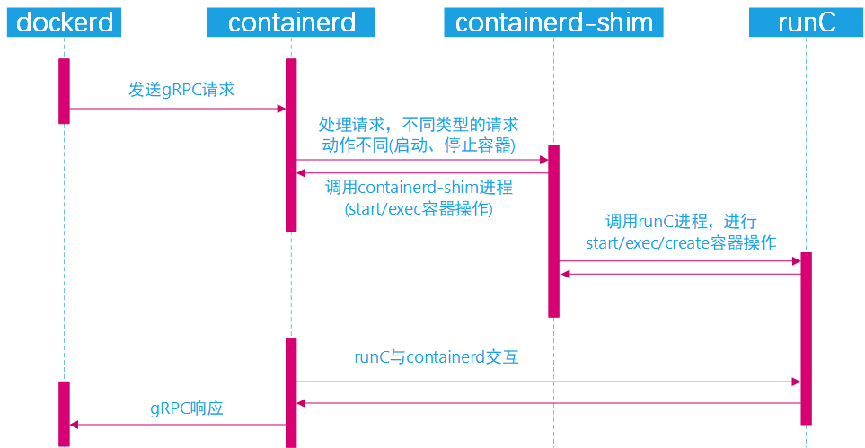

### 2.5.2 gRPC 简介

gRPC 是 Google 开发的一款高性能、开源和通用的 RPC 框架，支持众多语言客户端。

gRPC (gRPC 远程过程调用)是一个开源远程过程调用(RPC)系统，最初在 2015 年由谷歌
开发。它使用 HTTP/2 进行传输，协议缓冲区作为接口描述语言，并提供诸如身份验证、
双向流和流控制、阻塞或非阻塞绑定、取消和超时等功能。它为多种语言生成跨平台的客
户机和服务器绑定。最常见的使用场景包括在微服务风格的架构中连接服务，并将移动设
备、浏览器客户端连接到后端服务。

[gRPC-官网](https://www.grpc.io/)

## 2.6 Docker 镜像下载加速配置

使用 Docker 时，在国内网络环境下载国外的镜像有时候会很慢，因此可以更改 docker
配置文件来添加一个加速网址，可以通过加速器达到加速下载镜像的目的。

### 2.6.1 获取加速地址

首先注册一个阿里云账户:https://account.aliyun.com/login/login.htm
打开这个链接获取加速地址:https://cr.console.aliyun.com

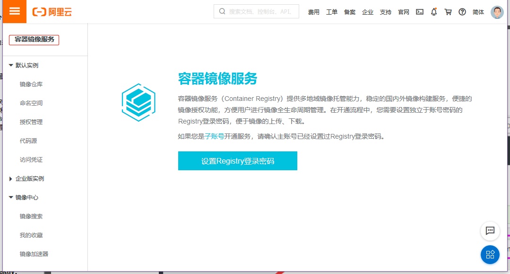

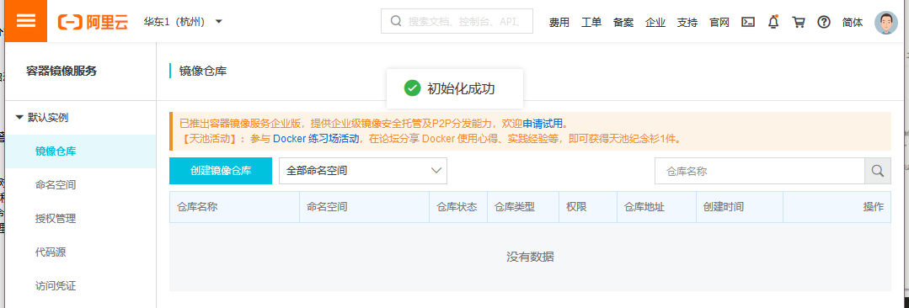
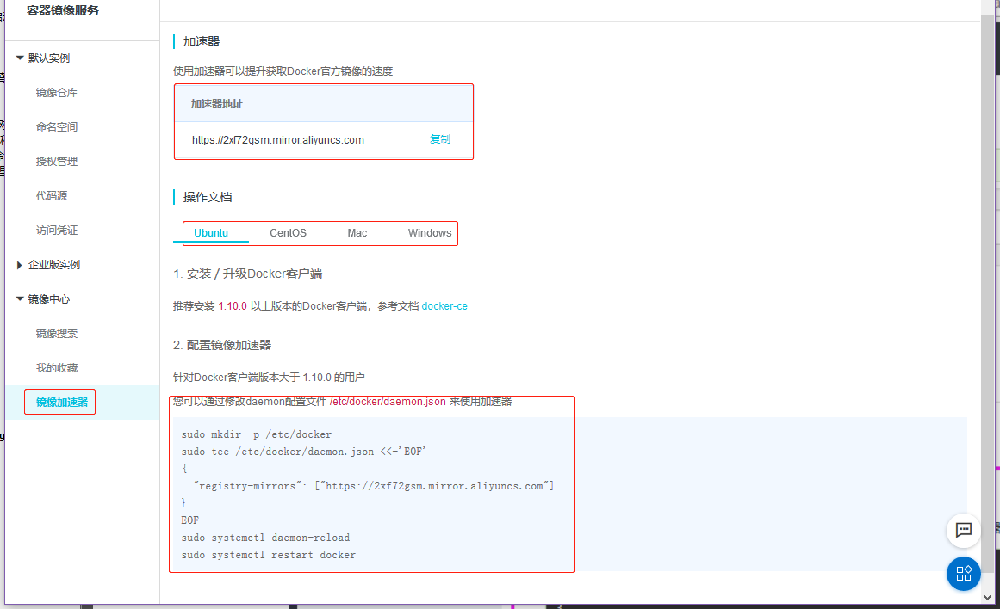

```bash
root@ubuntu-suosuoli-node1:~# mkdir -p /etc/docker
root@ubuntu-suosuoli-node1:~# vim /etc/docker/daemon.json
{
        "registry-mirrors":["https://2xf72gsm.mirror.aliyuncs.com"]
}
...
root@ubuntu-suosuoli-node1:~# systemctl systemctl daemon-reload
root@ubuntu-suosuoli-node1:~# systemctl restart docker.service
```

当然了，这个加速地址谁都可以用，Ubuntu 和 Centos 配置过程相同。
https://2xf72gsm.mirror.aliyuncs.com

### 2.6.2 配置编辑

看 2.6.1

### 2.6.3 重启 Docker

看 2.6.1

# 三.Docker 镜像和容器管理

## 3.1 镜像管理

Docker 镜像含有启动容器所需要的文件系统及所需要的内容，因此镜像主要用于创建
并启动 docker 容器。Docker 镜像含里面是一层层文件系统,叫做 Union FS(联合文
件系统),联合文件系统，可以将几层目录挂载到一起，形成一个虚拟文件系统,虚拟文
件系统的目录结构就像普通 linux 的目录结构一样，docker 通过这些文件再加上宿
主机的内核提供了一个 linux 的虚拟环境,每一层文件系统我们叫做一层 layer，联
合文件系统可以对每一层文件系统设置三种权限，只读(readonly)、读写(readwrite)
和写出(whiteout-able)，但是 docker 镜像中每一层文件系统都是只读的,构建镜像
的时候,从一个最基本的操作系统开始,每个构建的操作都相当于做一层的修改,增加了
一层文件系统,一层层往上叠加,上层的修改会覆盖底层该位置的可见性，这也很容易理
解，就像上层把底层遮住了一样,当使用镜像的时候，我们只会看到一个完全的整体，
不知道里面有几层也不需要知道里面有几层，结构如下：


一个典型的 Linux 文件系统由 bootfs 和 rootfs 两部分组成，bootfs(boot file
system) 主要包含 bootloader 和 kernel，bootloader 主要用于引导加载 kernel，
当 kernel 被加载到内存中后 bootfs 会被 umount 掉，rootfs (root file system)
包含的就是典型 Linux 系统中的/dev，/proc，/bin，/etc 等标准目录和文件，下图
就是 docker image 中最基础的两层结构，不同的 linux 发行版(如 ubuntu 和 CentOS
) 在 rootfs 这一层会有所区别。但是对于 docker 镜像通常都比较小，官方提供的
centos 基础镜像在 200MB 左右，一些其他版本的镜像甚至只有几 MB，docker 镜像
直接调用宿主机的内核，镜像中只提供 rootfs，也就是只需要包括最基本的命令、工具
和程序库就可以了，比如 alpine 镜像，在 5M 左右。下图就是有两个不同的镜像在一
个宿主机内核上实现不同的 rootfs。


在不同的层代表了镜像不同的变更，如下图:
Apache 所在的镜像层引用了 emacs 所在层表示的镜像，而 emacs 所在镜像又是基于
Debian 基础镜像创建来的。在使用 Dockerfile 创建镜像时，更能体现下面的分层结构。
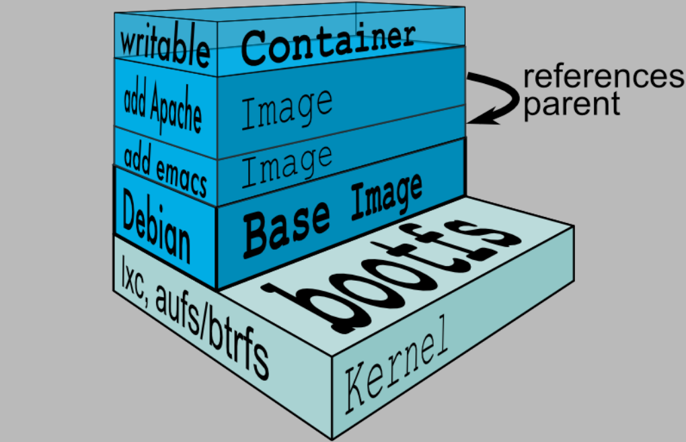

Docker 镜像存在的各个阶段和状态可以从下图看出:


### 3.1.1 搜索镜像

在使用 docker 命令时，可以很方便的使用命令和子命令的帮助:

```bash
# 使用<docker 子命令 --help>来获取帮助
~$ docker --help
~$ docker image --help
~$ docker container --help  # container是docker的子命令
~$ docker container logs --help  # logs是container的子命令
~$ docker search --help
~$ docker save --help
~$ docker exec --help
```

在官方的 docker 仓库中搜索指定名称的 docker 镜像:

```bash
~$ docker search IMAGE_NAME:TAG
~$ docker search --help
```

例如

```bash
root@ubuntu-suosuoli-node1:~# docker search alpine
NAME                                   DESCRIPTION                                     STARS               OFFICIAL            AUTOMATED
alpine                                 A minimal Docker image based on Alpine Linux…   6137                [OK]
mhart/alpine-node                      Minimal Node.js built on Alpine Linux           455
anapsix/alpine-java                    Oracle Java 8 (and 7) with GLIBC 2.28 over A…   439                                     [OK]
frolvlad/alpine-glibc                  Alpine Docker image with glibc (~12MB)          233                                     [OK]
gliderlabs/alpine                      Image based on Alpine Linux will help you wi…   181
alpine/git                             A  simple git container running in alpine li…   115                                     [OK]
mvertes/alpine-mongo                   light MongoDB container                         109                                     [OK]
yobasystems/alpine-mariadb             MariaDB running on Alpine Linux [docker] [am…   58                                      [OK]
alpine/socat                           Run socat command in alpine container           47                                      [OK]
kiasaki/alpine-postgres                PostgreSQL docker image based on Alpine Linux   45                                      [OK]
davidcaste/alpine-tomcat               Apache Tomcat 7/8 using Oracle Java 7/8 with…   40                                      [OK]
zzrot/alpine-caddy                     Caddy Server Docker Container running on Alp…   35                                      [OK]
jfloff/alpine-python                   A small, more complete, Python Docker image …   33                                      [OK]
...
```

### 3.1.2 下载镜像

从 docker 仓库将镜像下载到本地，命令格式如下:

```bash
~$ docker pull hub.docker.com/nginx/nginx:1.16.1
~$ docker pull 仓库服务器:端口/项目名称/镜像名称:tag(版本)号
```

例如

```bash
[root@redis-server-node1 ~]# docker pull nginx:1.16.1
1.16.1: Pulling from library/nginx
bc51dd8edc1b: Pull complete
60041be5685b: Pull complete
5ad6baa9b36b: Pull complete
Digest: sha256:66c5029339141ea9d0df346d5b86d55176d54c7e15825f95dd7fe7fc5973ca52
Status: Downloaded newer image for nginx:1.16.1
docker.io/library/nginx:1.16.1
```

### 3.1.3 查看本地镜像

下载完成的镜像比下载的大，因为下载完成后会解压。使用以下命令查看:

```bash
~$ docker images
```

```bash
root@ubuntu-suosuoli-node1:~# docker images
REPOSITORY          TAG                 IMAGE ID            CREATED             SIZE
centos-nginx        1.16.1              3f834ef5596b        7 hours ago         148MB
nginx               1.16.1              55c440ba1ecb        2 weeks ago         127MB
alpine              latest              e7d92cdc71fe        4 weeks ago         5.59MB
ubuntu              latest              ccc6e87d482b        4 weeks ago         64.2MB

REPOSITORY            # 镜像所属的仓库名称
TAG                   # 镜像版本号（标识符），默认为latest
IMAGE ID              # 镜像唯一ID标示
CREATED               # 镜像创建时间
VIRTUAL SIZE          # 镜像的大小
```

### 3.1.4 镜像导出

可以将镜像从本地导出问为一个压缩文件，然后复制到其他服务器进行导入使用

镜像导出使用 `docker save` 命令：

```bash
~$ docker [image] save nginx -o /opt/nginx-1.16.1.tar.gz
或者不指定-o选项，直接使用标准输出重定向:
~$ docker [image] save nginx > /opt/nginx-1.16.1.tar.gz
```

例如:

```bash
root@ubuntu-suosuoli-node1:~# docker images
REPOSITORY          TAG                 IMAGE ID            CREATED             SIZE
centos-nginx        1.16.1              3f834ef5596b        18 hours ago        148MB
nginx               1.16.1              55c440ba1ecb        2 weeks ago         127MB
alpine              latest              e7d92cdc71fe        4 weeks ago         5.59MB
ubuntu              latest              ccc6e87d482b        4 weeks ago         64.2MB
root@ubuntu-suosuoli-node1:~# docker save nginx -o /opt/nginx-1.16.1.tar.gz
root@ubuntu-suosuoli-node1:~# docker save nginx > /opt/nginx-1.16.1-stdi.tar.gz
root@ubuntu-suosuoli-node1:~# ll /opt/
total 325724
drwxr-xr-x  4 root root      4096 Feb 18 10:22 ./
drwxr-xr-x 24 root root      4096 Jan  5 15:59 ../
-rw-r--r--  1 root root 130526208 Feb 18 10:22 nginx-1.16.1-stdi.tar.gz
-rw-------  1 root root 130526208 Feb 18 10:19 nginx-1.16.1.tar.gz
```

**查看镜像内容**

```bash
root@ubuntu-suosuoli-node1:/opt# mkdir nginx
root@ubuntu-suosuoli-node1:/opt# tar xf nginx-1.16.1.tar.gz -C nginx/
root@ubuntu-suosuoli-node1:/opt# cd nginx/
root@ubuntu-suosuoli-node1:/opt/nginx# ll
total 36
drwxr-xr-x 5 root root 4096 Feb 18 10:28 ./
drwxr-xr-x 5 root root 4096 Feb 18 10:28 ../
-rw-r--r-- 1 root root 6649 Feb  2 16:08 55c440ba1ecbc2d762462d11bd214c7b50c6a5a8e8e949c073923a9786e9167e.json
drwxr-xr-x 2 root root 4096 Feb  2 16:08 a32776b9621e916e8714389b1037bf47253a2d3d1c806ad515623d2150c92485/
drwxr-xr-x 2 root root 4096 Feb  2 16:08 e31cb3f26f0ba3c9dfa2dc178a60e42dca4393fe3b9f96bc6d6ae516e4a84e33/
drwxr-xr-x 2 root root 4096 Feb  2 16:08 fbb8d40a9ceca4645bee0b723931672ed9ccad6d87e6808d0ec0eacd231bab8e/
-rw-r--r-- 1 root root  355 Jan  1  1970 manifest.json
-rw-r--r-- 1 root root   88 Jan  1  1970 repositories

root@ubuntu-suosuoli-node1:/opt/nginx# cat manifest.json
[{
   "Config":"55c440ba1ecbc2d762462d11bd214c7b50c6a5a8e8e949c073923a9786e9167e.json",         # 该镜像的详细配置
   "RepoTags":["nginx:1.16.1"],                                                              # 仓库和镜像tag名称
   "Layers":["a32776b9621e916e8714389b1037bf47253a2d3d1c806ad515623d2150c92485/layer.tar",   # 键Layers记录了目前该镜像的分层情况
             "e31cb3f26f0ba3c9dfa2dc178a60e42dca4393fe3b9f96bc6d6ae516e4a84e33/layer.tar",
             "fbb8d40a9ceca4645bee0b723931672ed9ccad6d87e6808d0ec0eacd231bab8e/layer.tar"]
}]

root@ubuntu-suosuoli-node1:/opt/nginx# cat repositories    # repositories使用json格式记录了镜像的仓库信息和tag名称
{
   "nginx":{"1.16.1":"fbb8d40a9ceca4645bee0b723931672ed9ccad6d87e6808d0ec0eacd231bab8e"}
}
```

**查看镜像的详细配置和构建历史**

```json
root@ubuntu-suosuoli-node1:/opt/nginx# cat 55c440ba1ecbc2d762462d11bd214c7b50c6a5a8e8e949c073923a9786e9167e.json

{"architecture":"amd64",
 "config":{"Hostname":"",
                 "Domainname":"",
                 "User":"",
                 "AttachStdin":false,
                 "AttachStdout":false,
                 "AttachStderr":false,
                 "ExposedPorts":{"80/tcp":{}},
                 "Tty":false,
                 "OpenStdin":false,
                 "StdinOnce":false,
                 "Env":["PATH=/usr/local/sbin:/usr/local/bin:/usr/sbin:/usr/bin:/sbin:/bin","NGINX_VERSION=1.16.1","NJS_VERSION=0.3.8","PKG_RELEASE=1~buster"],
                 "Cmd":["nginx","-g","daemon off;"],
                 "ArgsEscaped":true,
                 "Image":"sha256:97cda35ae9ca05d9c9f791a63ad72933874d083231f060bdb9967a87fd38a1ca",
                 "Volumes":null,
                 "WorkingDir":"",
                 "Entrypoint":null,
                 "OnBuild":null,
                 "Labels":{"maintainer":"NGINX Docker Maintainers \u003cdocker-maint@nginx.com\u003e"},
                 "StopSignal":"SIGTERM"
                 },
        "container":"7d61e9b055a484c97248a5cfb727ab9d950320e10b10bd98e2902cd90275b5dd",
 "container_config":{"Hostname":"7d61e9b055a4",  # 运行为容器时的默认配置
                     "Domainname":"",
                     "User":"",
                     "AttachStdin":false,
                     "AttachStdout":false,
                     "AttachStderr":false,
                     "ExposedPorts":{"80/tcp":{}},
                     "Tty":false,
                     "OpenStdin":false,
                     "StdinOnce":false,
                     "Env":["PATH=/usr/local/sbin:/usr/local/bin:/usr/sbin:/usr/bin:/sbin:/bin",
                            "NGINX_VERSION=1.16.1",
                            "NJS_VERSION=0.3.8",
                            "PKG_RELEASE=1~buster"],
                     "Cmd":["/bin/sh",
                            "-c",
                            "#(nop) ",
                            "CMD [\"nginx\" \"-g\" \"daemon off;\"]"],
                     "ArgsEscaped":true,
                     "Image":"sha256:97cda35ae9ca05d9c9f791a63ad72933874d083231f060bdb9967a87fd38a1ca",
                     "Volumes":null,
                     "WorkingDir":"",
                     "Entrypoint":null,
                     "OnBuild":null,
                     "Labels":{"maintainer":"NGINX Docker Maintainers \u003cdocker-maint@nginx.com\u003e"},  # \u003c 表示 < ; \u003e 表示 >
                     "StopSignal":"SIGTERM"
                     },
 "created":"2020-02-02T08:08:18.490542767Z",
 "docker_version":"18.09.7",
 "history":[  # 镜像构建历史
     {"created":"2020-02-01T17:20:54.180868987Z",
      "created_by":"/bin/sh -c #(nop) ADD file:ba0c39345ccc4a882289d473ae8a67087056aa4475a26f3492fff75933d707de in / "},
     {"created":"2020-02-01T17:20:54.430828407Z",
      "created_by":"/bin/sh -c #(nop)  CMD [\"bash\"]",
      "empty_layer":true},  # 未更改内容，所以该层作为空层构建
     {"created":"2020-02-02T08:06:03.111300657Z",
      "created_by":"/bin/sh -c #(nop)  LABEL maintainer=NGINX Docker Maintainers \u003cdocker-maint@nginx.com\u003e",
      "empty_layer":true},
     {"created":"2020-02-02T08:07:42.736126208Z",
      "created_by":"/bin/sh -c #(nop)  ENV NGINX_VERSION=1.16.1",
      "empty_layer":true},
     {"created":"2020-02-02T08:07:43.003403586Z",
      "created_by":"/bin/sh -c #(nop)  ENV NJS_VERSION=0.3.8",
      "empty_layer":true},
     {"created":"2020-02-02T08:07:43.296025562Z",
      "created_by":"/bin/sh -c #(nop)  ENV PKG_RELEASE=1~buster",
      "empty_layer":true},
     {"created":"2020-02-02T08:08:16.090560236Z",  # 构建过程
      "created_by":"/bin/sh -c set -x  \u0026\u0026 addgroup --system --gid 101 nginx  \u0026\u0026 "   # \u0026 是 & 的Unicode码表示形式
                   "adduser --system --disabled-login --ingroup nginx --no-create-home --home /nonexistent "
                   "--gecos \"nginx user\" --shell /bin/false --uid 101 nginx     \u0026\u0026 "
                   "apt-get update     \u0026\u0026 "
                   "apt-get install --no-install-recommends --no-install-suggests -y gnupg1 ca-certificates     \u0026\u0026    "
                   "NGINX_GPGKEY=573BFD6B3D8FBC641079A6ABABF5BD827BD9BF62;"
                   "     found='';     "
                   "for server in ha.pool.sks-keyservers.net hkp://keyserver.ubuntu.com:80 hkp://p80.pool.sks-keyservers.net:80 pgp.mit.edu; "
                   "do echo \"Fetching GPG key $NGINX_GPGKEY from $server\";"
                   "apt-key adv --keyserver \"$server\" --keyserver-options timeout=10 --recv-keys \"$NGINX_GPGKEY\" \u0026\u0026 found=yes \u0026\u0026 break;"
                   "done;"
                   "test -z \"$found\" \u0026\u0026 echo \u003e\u00262 \"error: failed to fetch GPG key $NGINX_GPGKEY\" \u0026\u0026 exit 1;"
                   "apt-get remove --purge --auto-remove -y gnupg1 \u0026\u0026 rm -rf /var/lib/apt/lists/*     \u0026\u0026 "
                   "dpkgArch=\"$(dpkg --print-architecture)\" \u0026\u0026 nginxPackages=\" nginx=${NGINX_VERSION}-${PKG_RELEASE}"
                   "nginx-module-xslt=${NGINX_VERSION}-${PKG_RELEASE}"
                   "nginx-module-geoip=${NGINX_VERSION}-${PKG_RELEASE}"
                   "nginx-module-image-filter=${NGINX_VERSION}-${PKG_RELEASE}         "
                   "nginx-module-njs=${NGINX_VERSION}.${NJS_VERSION}-${PKG_RELEASE} \"     \u0026\u0026 "
                   "case \"$dpkgArch\" in  amd64|i386)"
                   "echo \"deb https://nginx.org/packages/debian/ buster nginx\" \u003e\u003e /etc/apt/sources.list.d/nginx.list  \u0026\u0026 apt-get update;; "
                   "                                *)"
                   "echo \"deb-src https://nginx.org/packages/debian/ buster nginx\" \u003e\u003e /etc/apt/sources.list.d/nginx.list \u0026\u0026 "
                   "tempDir=\"$(mktemp -d)\" \u0026\u0026 chmod 777 \"$tempDir\" \u0026\u0026 savedAptMark=\"$(apt-mark showmanual)\"  \u0026\u0026 "
                   "apt-get update \u0026\u0026 "
                   "apt-get build-dep -y $nginxPackages \u0026\u0026 (cd \"$tempDir\" \u0026\u0026 DEB_BUILD_OPTIONS=\"nocheck parallel=$(nproc)\" "
                   "apt-get source --compile $nginxPackages)                         \u0026\u0026 "
                   "apt-mark showmanual | xargs apt-mark auto \u003e /dev/null \u0026\u0026 "
                   "{ [ -z \"$savedAptMark\" ] || apt-mark manual $savedAptMark; } \u0026\u0026 "
                   "ls -lAFh \"$tempDir\" \u0026\u0026 ( cd \"$tempDir\" \u0026\u0026 dpkg-scanpackages . \u003e Packages )\u0026\u0026"
                   "grep '^Package: ' \"$tempDir/Packages\" \u0026\u0026 echo \"deb [ trusted=yes ] file://$tempDir ./\" \u003e /etc/apt/sources.list.d/temp.list \u0026\u0026 "
                   "apt-get -o Acquire::GzipIndexes=false update ;;     "
                   "esac \u0026\u0026 "
                   "apt-get install --no-install-recommends --no-install-suggests -y "
                   "$nginxPackages gettext-base \u0026\u0026 "
                   "apt-get remove --purge --auto-remove -y ca-certificates \u0026\u0026 "
                   "rm -rf /var/lib/apt/lists/* /etc/apt/sources.list.d/nginx.list \u0026\u0026 "
                   "if [ -n \"$tempDir\" ]; then"
                   "    apt-get purge -y --auto-remove  \u0026\u0026 "
                   "    rm -rf \"$tempDir\" /etc/apt/sources.list.d/temp.list;     fi"},
     {"created":"2020-02-02T08:08:17.567442501Z",
      "created_by":"/bin/sh -c ln -sf /dev/stdout /var/log/nginx/access.log \u0026\u0026 ln -sf /dev/stderr /var/log/nginx/error.log"},   # 可以看出，只有更改的部分才重新创建
     {"created":"2020-02-02T08:08:17.866036122Z",
      "created_by":"/bin/sh -c #(nop)  EXPOSE 80",
      "empty_layer":true},
     {"created":"2020-02-02T08:08:18.178736789Z",
      "created_by":"/bin/sh -c #(nop)  STOPSIGNAL SIGTERM",
      "empty_layer":true},
     {"created":"2020-02-02T08:08:18.490542767Z",
      "created_by":"/bin/sh -c #(nop)  CMD [\"nginx\" \"-g\" \"daemon off;\"]","empty_layer":true}  # 可以看出，只有更改的部分才重新创建
        ],
 "os":"linux",
 "rootfs":{"type":"layers",
           "diff_ids":["sha256:488dfecc21b1bc607e09368d2791cb784cf8c4ec5c05d2952b045b3e0f8cc01e",
                       "sha256:5675380163289a424f4d0229badf3e05eff40472ac2a0df4c66e0faf37302057",
                       "sha256:37ec257a56ed6d6880b428feaf32394661bad32b48b3009b992027b58297910b"]
           }
 }
```

### 3.1.5 镜像导入

将其他容器导出的镜像，导入到 Docker 生成另一个镜像，使用`docker load`命令

```bash
~$ docker [image] load -i /path/to/image.tar.gz
~$ docker [image] load < /path/to/image.tar.gz
```

例如:

```bash
root@ubuntu-suosuoli-node1:/opt# scp nginx-1.16.1.tar.gz 192.168.100.10:/opt/
nginx-1.16.1.tar.gz                              100%  124MB 112.6MB/s   00:01

# 在192.168.100.10
[root@docker-server-node1 ~]# cd /opt/
[root@docker-server-node1 opt]# ll
-rw------- 1 root root 130526208 Feb 18 11:12 nginx-1.16.1.tar.gz
...

[root@docker-server-node1 opt]# docker load -i nginx-1.16.1.tar.gz  # 导入
488dfecc21b1: Loading layer [==================================================>]  72.48MB/72.48MB
567538016328: Loading layer [==================================================>]  58.02MB/58.02MB
37ec257a56ed: Loading layer [==================================================>]  3.584kB/3.584kB
Loaded image: nginx:1.16.1
[root@docker-server-node1 opt]# docker images
REPOSITORY          TAG                 IMAGE ID            CREATED             SIZE
nginx               1.16.1              55c440ba1ecb        2 weeks ago         127MB  # 导入OK
alpine              latest              e7d92cdc71fe        4 weeks ago         5.59MB
ubuntu              latest              ccc6e87d482b        4 weeks ago         64.2MB
```

### 3.1.6 删除镜像

从 Docker 当前已有的镜像列表中删除镜像

```bash
~$ docker image rm ID
~$ docker rmi ID
```

例如

```bash
[root@docker-server-node1 opt]# docker images
REPOSITORY          TAG                 IMAGE ID            CREATED             SIZE
nginx               1.16.1              55c440ba1ecb        2 weeks ago         127MB
alpine              latest              e7d92cdc71fe        4 weeks ago         5.59MB
ubuntu              latest              ccc6e87d482b        4 weeks ago         64.2MB
[root@docker-server-node1 opt]# docker image rm 55c440ba1ecb   # 删除nginx镜像
Untagged: nginx:1.16.1
Deleted: sha256:55c440ba1ecbc2d762462d11bd214c7b50c6a5a8e8e949c073923a9786e9167e
Deleted: sha256:c238c7ae406de1f724d59247d22e6fb9d3b0a76e05a06805d70a45d747e5e42e
Deleted: sha256:8ab6f71f7413a425844b4bba4ac765ce191f2ae5b2efaa5dd65aa3b88fb2e4ee
Deleted: sha256:488dfecc21b1bc607e09368d2791cb784cf8c4ec5c05d2952b045b3e0f8cc01e
[root@docker-server-node1 opt]# docker rmi ccc6e87d482b    # 删除ubuntu镜像
Untagged: ubuntu:latest
Deleted: sha256:ccc6e87d482b79dd1645affd958479139486e47191dfe7a997c862d89cd8b4c0
Deleted: sha256:d1b7fedd4314279a7c28d01177ff56bcff65300f6d41655394bf5d8b788567f6
Deleted: sha256:340bed96497252624f5e4b0f42accfe7edbb7a01047e2bb5a8142b2464008e73
Deleted: sha256:6357c335cdfcc3a120e288bbd203bf4c861a14245ce5094634ee097e5217085b
Deleted: sha256:43c67172d1d182ca5460fc962f8f053f33028e0a3a1d423e05d91b532429e73d
[root@docker-server-node1 opt]# docker images
REPOSITORY          TAG                 IMAGE ID            CREATED             SIZE
alpine              latest              e7d92cdc71fe        4 weeks ago         5.59MB
```

### 3.1.7 镜像管理命令总结

```bash
~$ docker [image] pull
~$ docker search IMAGE[:TAG]
~$ docker images
~$ docker [image] save IMAGE -o /path/to/IMAGE.tar.gz
~$ docker [image] save IMAGE > /path/to/IMAGE.tar.gz
~$ docker [image] load -i /path/to/IMAGE.tar.gz
~$ docker [image] load < /path/to/IMAGE.tar.gz
~$ docker [image] rm ID
~$ docker rmi ID
```

**注意:**删除指定 ID 的镜像时，通过镜像启动容器的时候该镜像不能被删除，除非
将容器全部关闭。删除镜像时可以是镜像 ID 也可以是镜像名称。

## 3.2 容器基础管理命令

Docker 容器根据对其不同的操作和不同的情况其可以处于多种状态，这些状态组成了容器
的生命周期，主要的状态如下图所示：

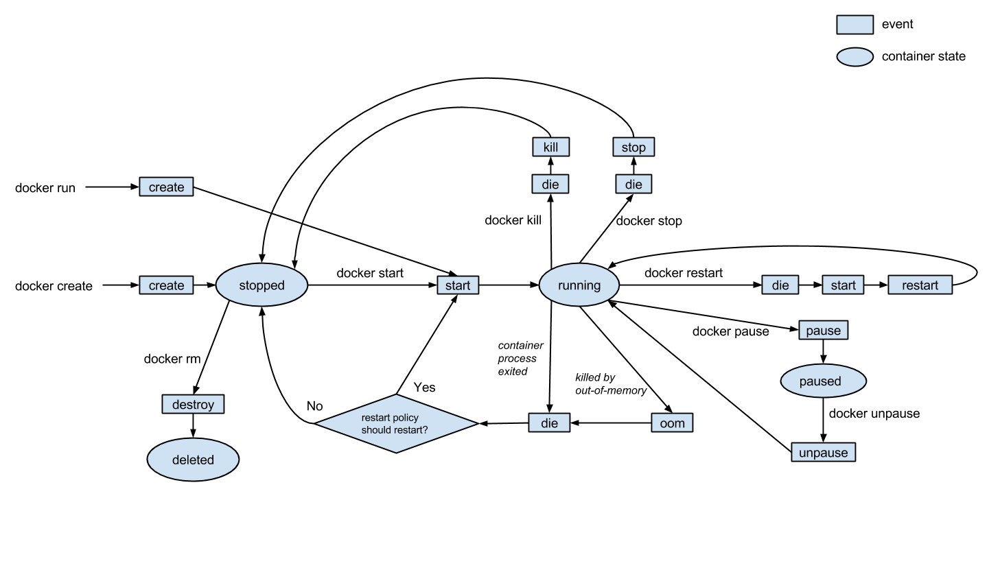

容器管理主要涉及从镜像启动容器、暂停或停止容器、恢复暂停或停止的容器、删除正在
运行的容器及显示相应状态的容器等操作。命令格式:

```bash
~$ docker run --help # 获取帮助
~$ docker run [OPT] IMAGE [CMD] [ARG...] # 运行容器
~$ docker ps [OPT] # 显示运行的容器
```

```bash
root@ubuntu-suosuoli-node1:~# docker run --help

Usage:	docker run [OPTIONS] IMAGE [COMMAND] [ARG...]

Run a command in a new container

Options:
      --add-host list                  Add a custom host-to-IP mapping (host:ip)
  -a, --attach list                    Attach to STDIN, STDOUT or STDERR
      --blkio-weight uint16            Block IO (relative weight), between 10 and 1000, or 0 to disable (default 0)
      --blkio-weight-device list       Block IO weight (relative device weight) (default [])
      ......
```

### 3.2.1 从镜像启动容器

从镜像启动一个容器后会直接进入到该容器，并随机生成容器 ID 和名称

```bash
[root@docker-server-node1 opt]# docker run --help
...
-i, --interactive                    Keep STDIN open even if not attached
   # 保持标准输入开启，使得容器可以接受命令行的命令，即使用交互式创建容器。

-t, --tty                            Allocate a pseudo-TTY
   # 给创建的容器分配一个伪终端
...
```

所以可以使用`docker run -i -t`来创建容器，并进入 Docker 为其分配的终端

```bash
[root@docker-server-node1 opt]# docker images
REPOSITORY          TAG                 IMAGE ID            CREATED             SIZE
alpine              latest              e7d92cdc71fe        4 weeks ago         5.59MB
[root@docker-server-node1 opt]# docker run -i -t alpine sh
/ # exit   # 退出交互式运行的容器，其将不再在后台运行
[root@docker-server-node1 opt]# docker ps
CONTAINER ID        IMAGE               COMMAND             CREATED             STATUS              PORTS               NAMES
[root@docker-server-node1 opt]# docker ps -a  # 可以看到容器alpine已经退出，-a选项显示所有状态容器
CONTAINER ID  IMAGE  COMMAND  CREATED       STATUS                   PORTS        NAMES
28cd19a9a131 alpine  "sh"     9 seconds ago Exited (0) 5 seconds ago         gallant_babbage

# ctrl+p+q 退出容器，容器任然在后台运行
[root@docker-server-node1 opt]# tty
/dev/pts/0
[root@docker-server-node1 opt]# docker restart 28cd19a9a131  # 重启退出的容器
[root@docker-server-node1 opt]# docker ps
CONTAINER ID        IMAGE               COMMAND             CREATED             STATUS              PORTS               NAMES
28cd19a9a131        alpine              "sh"                2 minutes ago       Up 39 seconds                           gallant_babbage
[root@docker-server-node1 opt]# docker exec -it 28cd19a9a131 sh # 进入容器
/ # tty
/dev/pts/1  # docker为alpine容器分配的tty为/dev/pts/1
/ # read escape sequence  #  ctrl+p+q 剥离当前终端的容器
[root@docker-server-node1 opt]# docker ps # alpine容器还在
CONTAINER ID        IMAGE               COMMAND             CREATED             STATUS              PORTS               NAMES
28cd19a9a131        alpine              "sh"                3 hours ago         Up 3 hours                              gallant_babbage
```

### 3.2.2 显示容器

显示当前正在运行的容器

```bash
~$ docker ps
~$ docker ps --help

# 以名字过滤容器
[root@docker-server-node1 opt]# docker ps -f name=gallant_babbage
# 或者使用 docker ps -f name=勇敢的_巴贝奇...? 哈哈哈哈啊哈哈嗝...
CONTAINER ID        IMAGE               COMMAND             CREATED             STATUS              PORTS               NAMES
28cd19a9a131        alpine              "sh"                3 hours ago         Up 3 hours                              gallant_babbage
```

显示当前所有的容器，包括运行的和退出的容器

```bash
~$ docker ps -a
```

例如

```bash
root@ubuntu-suosuoli-node1:~# docker run  -it -d nginx:1.16.1
43ca807906f8d6a08c7f2f64df58f8c70886920af51e13f8ecdb2fe19ab35d6d
root@ubuntu-suosuoli-node1:~# docker run  -it -d alpine:latest
91fa3b07c4be681f1b368b6b52963d48a5b834626d4c06f8446c8c53933df00e
root@ubuntu-suosuoli-node1:~# docker run -i -t -d ubuntu:latest
40e0c7499f659c2d97fc29e555b8fda4ca2d50b7c57ca16d5208b2f497ca4acc
root@ubuntu-suosuoli-node1:~# docker ps
CONTAINER ID        IMAGE               COMMAND                  CREATED             STATUS              PORTS               NAMES
40e0c7499f65        ubuntu:latest       "/bin/bash"              4 seconds ago       Up 4 seconds                            thirsty_matsumoto
91fa3b07c4be        alpine              "/bin/sh"                33 seconds ago      Up 32 seconds                           gracious_poitras
43ca807906f8        nginx:1.16.1        "nginx -g 'daemon of…"   45 seconds ago      Up 44 seconds       80/tcp              keen_lederberg
root@ubuntu-suosuoli-node1:~# docker container stop 40e0c7499f65 # 把ubunt容器听了
40e0c7499f65
root@ubuntu-suosuoli-node1:~# docker ps
CONTAINER ID        IMAGE               COMMAND                  CREATED              STATUS              PORTS               NAMES
91fa3b07c4be        alpine              "/bin/sh"                50 seconds ago       Up 49 seconds                           gracious_poitras
43ca807906f8        nginx:1.16.1        "nginx -g 'daemon of…"   About a minute ago   Up About a minute   80/tcp              keen_lederberg
root@ubuntu-suosuoli-node1:~# docker ps -a  # 可以看到已经停了的ubuntu镜像
CONTAINER ID        IMAGE               COMMAND                  CREATED              STATUS                     PORTS               NAMES
40e0c7499f65        ubuntu:latest       "/bin/bash"              22 seconds ago       Exited (0) 4 seconds ago                       thirsty_matsumoto
91fa3b07c4be        alpine              "/bin/sh"                51 seconds ago       Up 50 seconds                                  gracious_poitras
43ca807906f8        nginx:1.16.1        "nginx -g 'daemon of…"   About a minute ago   Up About a minute          80/tcp              keen_lederberg
```

### 3.2.3 删除运行中的容器

删除容器使用`docker rm`命令

```bash
~$ docker [container] rm ID
~$ docker [container] rm -f ID
```

**注意:**在执行删除容器操作时，指定 `-f` 选项即使容正在运行当中，也会被强制删除掉

例如:

```bash
[root@docker-server-node1 ~]# docker ps  # alpine容器在运行
CONTAINER ID        IMAGE               COMMAND             CREATED             STATUS              PORTS               NAMES
28cd19a9a131        alpine              "sh"                3 hours ago         Up 3 hours                              gallant_babbage
[root@docker-server-node1 ~]# docker rm 28cd19a9a131  # 提示无法删除运行的容器
Error response from daemon: You cannot remove a running container 28cd19a9a1311a98641765e627d1b91bc2bf7a59e51496170c0b94941e19c12a. Stop the container before attempting removal or force remove
[root@docker-server-node1 ~]# docker stop  28cd19a9a131  # 停止容器
28cd19a9a131
[root@docker-server-node1 ~]# docker rm  28cd19a9a131  # 删除
28cd19a9a131
[root@docker-server-node1 ~]# docker ps # 已经删除
CONTAINER ID        IMAGE               COMMAND             CREATED             STATUS              PORTS               NAMES

[root@docker-server-node1 ~]# docker run -i -t -d alpine:latest  # 再起一个容器
352ddd011e095da2bc2642ce17e014a67177f80ebf32ab20a8b28a58f29b6e7a
[root@docker-server-node1 ~]# docker ps
CONTAINER ID        IMAGE               COMMAND             CREATED             STATUS              PORTS               NAMES
352ddd011e09        alpine:latest       "/bin/sh"           3 seconds ago       Up 2 seconds                            vigorous_vaughan
[root@docker-server-node1 ~]# docker rm -f 352ddd011e09  # 强制删除，未提示
352ddd011e09
[root@docker-server-node1 ~]# docker ps
CONTAINER ID        IMAGE               COMMAND             CREATED             STATUS              PORTS               NAMES
```

### 3.2.4 端口映射

```bash
~$ docker run --help
...
-p, --publish list      Publish a container\'s port(s) to the host
   # -p，小写的-p选项用来将容器的端口映射到主机的某端口
-P, --publish-all       Publish all exposed ports to random ports
   # -P，大写的-P选项用来将容器的端口映射到主机的随机端口
...

# 例如：
~$ docker run -it -d -p 主机端口:容器端口 <...>
```

#### 3.2.4.1 随机端口映射

```bash
root@ubuntu-suosuoli-node1:~# docker images
REPOSITORY          TAG                 IMAGE ID            CREATED             SIZE
centos-nginx        1.16.1              3f834ef5596b        23 hours ago        148MB
nginx               1.16.1              55c440ba1ecb        2 weeks ago         127MB
alpine              latest              e7d92cdc71fe        4 weeks ago         5.59MB
ubuntu              latest              ccc6e87d482b        4 weeks ago         64.2MB
root@ubuntu-suosuoli-node1:~# docker run -it -d -P nginx:1.16.1
7147325451c89a9e903a41850f856b5f88c22f71ab879752c9ef158ad3f7283c
root@ubuntu-suosuoli-node1:~# docker ps
CONTAINER ID        IMAGE               COMMAND                  CREATED             STATUS              PORTS                   NAMES
7147325451c8        nginx:1.16.1        "nginx -g 'daemon of…"   57 seconds ago      Up 56 seconds       0.0.0.0:10001->80/tcp   sad_agnesi
# 可以看到，nginx的默认80端口被映射到主机的随机端口10001
root@ubuntu-suosuoli-node1:~# ss -ntl  # 主机上也监听了10001端口
...
LISTEN    0      20480     *:10001     *:*      users:(("docker-proxy",pid=15512,fd=4))
...

root@ubuntu-suosuoli-node1:~# docker run -it -d -P --name=gallant_lisuo nginx:1.16.1  # 再起一个容器
7ff437de1849fd2bb963f43b4b05e9ecf21144c5d1580e927e1b71366c7e6b65
root@ubuntu-suosuoli-node1:~# docker ps
CONTAINER ID        IMAGE               COMMAND                  CREATED             STATUS              PORTS                   NAMES
7ff437de1849        nginx:1.16.1        "nginx -g 'daemon of…"   4 seconds ago       Up 3 seconds        0.0.0.0:10003->80/tcp   gallant_lisuo
# 再起一个容器后，可以看到nginx的80端口被映射到主机的10003端口
7147325451c8        nginx:1.16.1        "nginx -g 'daemon of…"   5 minutes ago       Up 5 minutes        0.0.0.0:10001->80/tcp   sad_agnesi

root@ubuntu-suosuoli-node1:~# lsof -i:10001 # 查看是谁在占用端口10001
COMMAND     PID USER   FD   TYPE DEVICE SIZE/OFF NODE NAME
docker-pr 15512 root    4u  IPv6 251299      0t0  TCP *:10001 (LISTEN)
root@ubuntu-suosuoli-node1:~# lsof -i:10003
COMMAND     PID USER   FD   TYPE DEVICE SIZE/OFF NODE NAME
docker-pr 15791 root    4u  IPv6 254234      0t0  TCP *:10003 (LISTEN)
```

可以访问端口试试

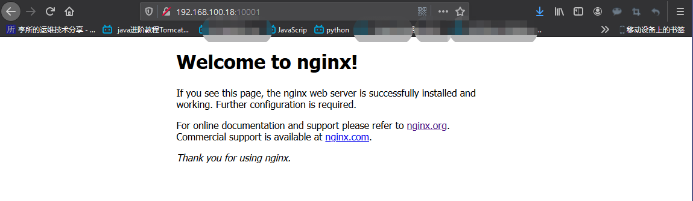

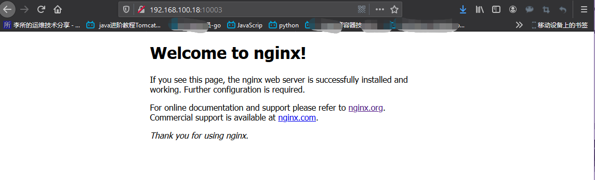

#### 3.2.4.2 指定端口映射

1. 将主机端口 80 映射到容器端口 80("-p 主机端口:容器端口")

`~$ docker run -it -d -p 主机端口:容器端口 <...>`

```bash
[root@docker-server-node1 ~]# docker images
REPOSITORY          TAG                 IMAGE ID            CREATED             SIZE
nginx               latest              2073e0bcb60e        2 weeks ago         127MB
alpine              latest              e7d92cdc71fe        4 weeks ago         5.59MB

# 将主机端口80映射到容器端口80("-p 主机端口:容器端口")
[root@docker-server-node1 ~]# docker run -it -d -p 80:80 --name=brillant_ports nginx
71b9aaabd2c0cf28325a028684366d769ff7d7e69f896f7096efd3c14009a073
[root@docker-server-node1 ~]# docker ps
CONTAINER ID        IMAGE               COMMAND                  CREATED             STATUS              PORTS                NAMES
71b9aaabd2c0        nginx               "nginx -g 'daemon of…"   3 seconds ago       Up 2 seconds        0.0.0.0:80->80/tcp   brillant_ports
[root@docker-server-node1 ~]# ss -ntl
State      Recv-Q Send-Q    Local Address:Port           Peer Address:Port
LISTEN     0      100           127.0.0.1:25                  *:*
LISTEN     0      1024         [::]:80                       [::]:*
LISTEN     0      128          [::]:22                       [::]:*
...
[root@docker-server-node1 ~]# lsof -i:80
COMMAND     PID USER   FD   TYPE  DEVICE SIZE/OFF NODE NAME
docker-pr 32452 root    4u  IPv6 1413770      0t0  TCP *:http (LISTEN)
```

2. 将主机的 IP 加端口映射到容器的某端口(主机 IP:本地端口:容器端口)

`~$ docker run -it -d -p IP:PORT:PORT <...>`

```bash
root@ubuntu-suosuoli-node1:~# docker run -it -d -p 192.168.100.18:81:80 --name=ip_port_port_mapping nginx:latest
93856a071cc2ba4863e8ee44ca738e9957d7b295ba248b4da2a3eb694c11914e

```

3. 将主机 IP 和随机端口映射到容器的某端口(主机 IP::PORT)

```bash
root@ubuntu-suosuoli-node1:~# docker run -it -d -p 192.168.100.18::80 --name=ip_random-port_port_mapping nginx:latest
934ff74e51d36bcfe9981de175db653ee95009809e97f6589c0a2d27179af2b0
```

4. 将主机的 IP 加端口映射到容器的某端口并指定协议(主机 IP:本地端口:容器端口/协议)

```bash
root@ubuntu-suosuoli-node1:~# docker run -it -d -p 192.168.100.18:82:80/udp --name=ip_port_port_protocol_mapping nginx:latest
29358eae0dc639f69518fcae4969768f9a5e0b6dbda6089ed50d679d2c754c90
```

5. 映射多个端口

```bash
root@ubuntu-suosuoli-node1:~# docker run -it -d -p 192.168.100.18:83:80/udp -p 443:443/tcp -p 50:50/udp --name=port_mapping_multi nginx:latest
f641583332d2cb2142bfcb80d3de5e241229122d2b68f81c41c07c2b8e30de00
```

查看端口映射情况

```bash
root@ubuntu-suosuoli-node1:~# docker ps
CONTAINER ID        IMAGE               COMMAND                  CREATED             STATUS              PORTS                                                                         NAMES
f641583332d2        nginx:latest        "nginx -g 'daemon of…"   3 minutes ago       Up 3 minutes        0.0.0.0:50->50/udp, 80/tcp, 0.0.0.0:443->443/tcp, 192.168.100.18:83->80/udp   port_mapping_multi
29358eae0dc6        nginx:latest        "nginx -g 'daemon of…"   4 minutes ago       Up 4 minutes        80/tcp, 192.168.100.18:82->80/udp                                             ip_port_port_protocol_mapping
934ff74e51d3        nginx:latest        "nginx -g 'daemon of…"   6 minutes ago       Up 6 minutes        192.168.100.18:10001->80/tcp                                                  ip_random-port_port_mapping
93856a071cc2        nginx:latest        "nginx -g 'daemon of…"   9 minutes ago       Up 9 minutes        192.168.100.18:81->80/tcp                                                     ip_port_port_mapping
```

**查看 nginx 容器的访问日志**

```bash
~$ docker logs NAME/ID
~$ docker logs -f NAME/ID
```

```bash
root@ubuntu-suosuoli-node1:~# docker logs ip_port_port_mapping
192.168.100.1 - - [18/Feb/2020:07:55:45 +0000] "GET / HTTP/1.1" 200 612 "-" "Mozilla/5.0 (Windows NT 10.0; Win64; x64; rv:72.0) Gecko/20100101 Firefox/72.0" "-"
2020/02/18 07:55:45 [error] 6#6: *1 open() "/usr/share/nginx/html/favicon.ico" failed (2: No such file or directory), client: 192.168.100.1, server: localhost, request: "GET /favicon.ico HTTP/1.1", host: "192.168.100.18:81"
192.168.100.1 - - [18/Feb/2020:07:55:45 +0000] "GET /favicon.ico HTTP/1.1" 404 153 "-" "Mozilla/5.0 (Windows NT 10.0; Win64; x64; rv:72.0) Gecko/20100101 Firefox/72.0" "-"

root@ubuntu-suosuoli-node1:~# docker logs -f ip_port_port_mapping
192.168.100.1 - - [18/Feb/2020:07:55:45 +0000] "GET / HTTP/1.1" 200 612 "-" "Mozilla/5.0 (Windows NT 10.0; Win64; x64; rv:72.0) Gecko/20100101 Firefox/72.0" "-"
2020/02/18 07:55:45 [error] 6#6: *1 open() "/usr/share/nginx/html/favicon.ico" failed (2: No such file or directory), client: 192.168.100.1, server: localhost, request: "GET /favicon.ico HTTP/1.1", host: "192.168.100.18:81"
192.168.100.1 - - [18/Feb/2020:07:55:45 +0000] "GET /favicon.ico HTTP/1.1" 404 153 "-" "Mozilla/5.0 (Windows NT 10.0; Win64; x64; rv:72.0) Gecko/20100101 Firefox/72.0" "-"

root@ubuntu-suosuoli-node1:~# docker logs -f 93856a071cc2
192.168.100.1 - - [18/Feb/2020:07:55:45 +0000] "GET / HTTP/1.1" 200 612 "-" "Mozilla/5.0 (Windows NT 10.0; Win64; x64; rv:72.0) Gecko/20100101 Firefox/72.0" "-"
2020/02/18 07:55:45 [error] 6#6: *1 open() "/usr/share/nginx/html/favicon.ico" failed (2: No such file or directory), client: 192.168.100.1, server: localhost, request: "GET /favicon.ico HTTP/1.1", host: "192.168.100.18:81"
192.168.100.1 - - [18/Feb/2020:07:55:45 +0000] "GET /favicon.ico HTTP/1.1" 404 153 "-" "Mozilla/5.0 (Windows NT 10.0; Win64; x64; rv:72.0) Gecko/20100101 Firefox/72.0" "-"
```

### 3.2.5 查看容器映射的端口

```bash
~$ docker port NAME/ID
```

```bash
# 该命令的输出是以容器的角度来看端口映射关系
# 即:容器端口 -> 主机端口

root@ubuntu-suosuoli-node1:~# docker port  93856a071cc2
80/tcp -> 192.168.100.18:81
root@ubuntu-suosuoli-node1:~# docker port  ip_port_port_mapping
80/tcp -> 192.168.100.18:81
root@ubuntu-suosuoli-node1:~# docker port  port_mapping_multi
443/tcp -> 0.0.0.0:443
50/udp -> 0.0.0.0:50
80/udp -> 192.168.100.18:83
```

### 3.2.6 自定义容器名称

```bash
~$ docker run -it -d --name=cus_name IMAGE/ID
```

```bash
root@ubuntu-suosuoli-node1:~# docker run -it -d -p 80:80 --name=nginx_v0 nginx:1.16.1
81d02459d016fa08c25a027836c54d142f33d683967eb7627cfd3fb672998a2d
root@ubuntu-suosuoli-node1:~# docker run -it -d -p 81:80 --name=nginx_v1 nginx:1.16.1
470ece4802fc2cb6cca8ec699a66fcd89012aa883baea5f7c7d55e4eca85c3f5
root@ubuntu-suosuoli-node1:~# docker run -it -d -p 82:80 --name=nginx_v2 nginx:1.16.1
435c5207feacae328a261cf85a3aeb001a528069f7e1344e87204613d782e618
root@ubuntu-suosuoli-node1:~# docker ps
CONTAINER ID        IMAGE               COMMAND                  CREATED             STATUS              PORTS                NAMES
435c5207feac        nginx:1.16.1        "nginx -g 'daemon of…"   3 seconds ago       Up 2 seconds        0.0.0.0:82->80/tcp   nginx_v2
470ece4802fc        nginx:1.16.1        "nginx -g 'daemon of…"   9 seconds ago       Up 8 seconds        0.0.0.0:81->80/tcp   nginx_v1
81d02459d016        nginx:1.16.1        "nginx -g 'daemon of…"   16 seconds ago      Up 15 seconds       0.0.0.0:80->80/tcp   nginx_v0
```

### 3.2.7 后台启动容器

从镜像运行容器时指定`-d`选项，可以让容器后台运行， `-i -t`打卡 STDI 并分配 tty 给容器

```bash
[root@docker-server-node1 ~]# docker run -i -t -d --name=little_alpine alpine
b87a870a6138e02ec4c659ca0593110ccd575d8bef160702442724612ed8c54f
[root@docker-server-node1 ~]# docker ps
CONTAINER ID        IMAGE               COMMAND             CREATED             STATUS              PORTS               NAMES
b87a870a6138        alpine              "/bin/sh"           4 seconds ago       Up 2 seconds                            little_alpine
```

### 3.2.8 创建并进入容器

从镜像创建并运行容器时，可以在命令最后指定需要容器运行的命令。这样可以创建容器后
直接进入容器，执行 exit 退出后容器并关闭容器。使用`ctrl + p + q`可以不退出容器
将其剥离终端在后台运行。

```bash
[root@docker-server-node1 ~]# docker run -i -t --name=run_sh_ra alpine  # 不指定-d选项
/ # ls  # 直接进入运行shell的容器
bin    dev    etc    home   lib    media  mnt    opt    proc   root   run    sbin   srv    sys    tmp    usr    var
/ # pwd
/
/ # ps aux
PID   USER     TIME  COMMAND
    1 root      0:00 /bin/sh  # 容器中第一个进程
    7 root      0:00 ps aux
/ # exit # bye
```

### 3.2.9 单次运行

单词运行容器可以用来测试容器是否可以正常创建并运行，使用`--rm`选项可以
让容器单次运行，在容器退出后会被自动删除。

```bash
[root@docker-server-node1 ~]# tty
/dev/pts/0
[root@docker-server-node1 ~]# docker run -it --rm --name=rm_first_time alpine
/ # exit  # 退出后自动删除

# 在新终端/dev/pts/1查看
[root@docker-server-node1 ~]# tty
/dev/pts/1
[root@docker-server-node1 ~]# docker ps # 未退出时在/dev/pts/1可以看到其运行
CONTAINER ID        IMAGE               COMMAND             CREATED             STATUS              PORTS               NAMES
2933c078d403        alpine              "/bin/sh"           45 seconds ago      Up 44 seconds                           rm_first_time
[root@docker-server-node1 ~]# docker ps # 退出后自动删除
CONTAINER ID        IMAGE               COMMAND             CREATED             STATUS              PORTS               NAMES
```

### 3.2.10 传递运行命令

容器需要有一个前台运行的进程才能保持容器的运行，通过传递运行参数是一种方式，
另外也可以在构建镜像的时候指定容器启动时运行的前台命令。

```bash
# 尝试不给alpine容器分配tty和打开标准输入
[root@docker-server-node1 ~]# docker run -d alpine
0fb8f32414fe122907a68591d757aa8fff0ccc1a57c2f62c3913aeda22142315
[root@docker-server-node1 ~]# docker ps
CONTAINER ID        IMAGE               COMMAND             CREATED             STATUS              PORTS               NAMES
[root@docker-server-node1 ~]# docker ps -a  # 创建后运行了一下/bin/sh就退出了
CONTAINER ID        IMAGE               COMMAND             CREATED             STATUS                     PORTS               NAMES
0fb8f32414fe        alpine              "/bin/sh"           9 seconds ago       Exited (0) 8 seconds ago                       friendly_visvesvaraya

# 给alpine容器传一个前台运行的命令(依附于tty和标准输入)
[root@docker-server-node1 ~]# docker run -d alpine /usr/bin/tail -f '/etc/issue'
a51eab80adad573c3580b26ba0910f2bb8da7881ab0cc626ecb627bb032578c0
[root@docker-server-node1 ~]# docker ps
CONTAINER ID        IMAGE               COMMAND                  CREATED             STATUS              PORTS               NAMES
a51eab80adad        alpine              "/usr/bin/tail -f /e…"   6 seconds ago       Up 5 seconds                            nifty_benz
# 这回俏皮的本次运行了
```

### 3.2.11 容器的启动和关闭

```bash
~$ docker stop ID/NAMES
~$ docker start ID/NAMES
```

```bash
[root@docker-server-node1 ~]# docker ps
CONTAINER ID        IMAGE               COMMAND                  CREATED             STATUS              PORTS               NAMES
a51eab80adad        alpine              "/usr/bin/tail -f /e…"   2 minutes ago       Up 2 minutes                            nifty_benz
[root@docker-server-node1 ~]# docker stop nifty_benz
nifty_benz
[root@docker-server-node1 ~]# docker start nifty_benz
nifty_benz
[root@docker-server-node1 ~]# docker ps
CONTAINER ID        IMAGE               COMMAND                  CREATED             STATUS              PORTS               NAMES
a51eab80adad        alpine              "/usr/bin/tail -f /e…"   3 minutes ago       Up 2 seconds                            nifty_benz
```

### 3.2.12 进入运行的容器

在单机运行容器时，有的时候涉及到进入容器查看或者修改内容。有几种不同的方式
可以进入运行中的容器，比较推荐使用 nsenter 命令进入容器(name space enter)

#### 3.2.12.1 使用 attach

使用命令 `docker attach NAME`进入运行的容器，attach 类似于 vnc，在容器中
的每个操作会在各个终端显示，所有使用此方式进入容器的操作都是同步显示的且
使用 `exit` 命令退出后容器将被关闭，不推荐使用，其要求需要进入到有 shell
环境的容器，比如 centos 为例:

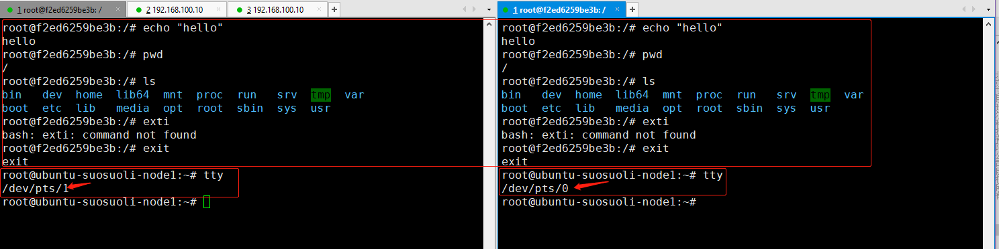

在上图可以看出，在不同的主机终端进入 ubuntu 容器后，操作都是同步的，在容器
中都分配了同一个终端。一边退出后，其它的终端也退出了，退出后容器也关闭了。
下面就无法再 attach 回去了:

```bash
root@ubuntu-suosuoli-node1:~# docker attach attach_in
You cannot attach to a stopped container, start it first  # 提示容器已经停止
root@ubuntu-suosuoli-node1:~# docker ps -a
CONTAINER ID        IMAGE               COMMAND             CREATED             STATUS                       PORTS               NAMES
f2ed6259be3b        ubuntu              "/bin/bash"         5 minutes ago       Exited (127) 2 minutes ago                       attach_in
```

#### 3.2.12.2 使用 exec

可以使用 `docker exec` 命令在容器中执行单次命令或是进入容器，不大推荐此方式，
使用`docker exec` 命令进入容器后 exit 退出容器其并不会停止。

```bash
root@ubuntu-suosuoli-node1:~# docker exec -it attach_in /bin/bash
root@f2ed6259be3b:/# echo $SHELLS

root@f2ed6259be3b:/# echo $PATH
/usr/local/sbin:/usr/local/bin:/usr/sbin:/usr/bin:/sbin:/bin
root@f2ed6259be3b:/# exit
exit
root@ubuntu-suosuoli-node1:~# docker ps  # 容器未退出
CONTAINER ID        IMAGE               COMMAND             CREATED             STATUS              PORTS               NAMES
f2ed6259be3b        ubuntu              "/bin/bash"         10 minutes ago      Up About a minute                       attach_i
```

#### 3.2.12.3 使用 nsenter

推荐使用 nsenter 命令进入容器，该命令需要通过容器的 PID 进入到容器内部，比较麻烦。
不过可以使用`docker inspect` 命令获取到容器的 PID。

安装 nsenter 工具，包名 Ubuntu 和 CentOS 一样豆角 util-linux

```bash
root@ubuntu-suosuoli-node1:~# apt install util-linux
[root@docker-server-node1 ~]# yum install util-linux

root@ubuntu-suosuoli-node1:~# man nsenter
NAME
       nsenter - run program with namespaces of other processes # 使用其他进程的名称空间运行程序

SYNOPSIS
       nsenter [options] [program [arguments]]
       ...
```

`docker inspect NAME/ID` 命令使用，该命令用来获取当前运行的容器的底层对象信息，以 JSON
格式返回到标准输出。

```bash
root@ubuntu-suosuoli-node1:~# docker ps
CONTAINER ID        IMAGE               COMMAND             CREATED             STATUS              PORTS               NAMES
f2ed6259be3b        ubuntu              "/bin/bash"         17 minutes ago      Up 7 minutes                            attach_in
root@ubuntu-suosuoli-node1:~# docker inspect attach_in
[
    {
        "Id": "f2ed6259be3bdda51cfad5aaa89ad2716219542fd4ac133b70a38ae2863eca4d",
        "Created": "2020-02-18T08:47:41.627566286Z",
        "Path": "/bin/bash",
        "Args": [],
        "State": {
            "Status": "running",
            "Running": true,
            "Paused": false,
            "Restarting": false,
            "OOMKilled": false,
            "Dead": false,
            "Pid": 18471,
            "ExitCode": 0,
            "Error": "",
            "StartedAt": "2020-02-18T08:57:23.404169974Z",
            "FinishedAt": "2020-02-18T08:50:30.555628462Z"
        },
        "Image": "sha256:ccc6e87d482b79dd1645affd958479139486e47191dfe7a997c862d89cd8b4c0",
        "ResolvConfPath": "/var/lib/docker/containers/f2ed6259be3bdda51cfad5aaa89ad2716219542fd4ac133b70a38ae2863eca4d/resolv.conf",
        "HostnamePath": "/var/lib/docker/containers/f2ed6259be3bdda51cfad5aaa89ad2716219542fd4ac133b70a38ae2863eca4d/hostname",
        "HostsPath": "/var/lib/docker/containers/f2ed6259be3bdda51cfad5aaa89ad2716219542fd4ac133b70a38ae2863eca4d/hosts",
        "LogPath": "/var/lib/docker/containers/f2ed6259be3bdda51cfad5aaa89ad2716219542fd4ac133b70a38ae2863eca4d/f2ed6259be3bdda51cfad5aaa89ad2716219542fd4ac133b70a38ae2863eca4d-json.log",
        "Name": "/attach_in",
        ......
        省略一大堆
```

可以使用该命令返回的 JSON 格式中的键来获取特定的信息，这样就可以获取当前运行的
容器的任何信息如:

```bash
root@ubuntu-suosuoli-node1:~# docker inspect -f "{{.NetworkSettings.IPAddress}}" attach_in
172.17.0.2
   # -f 选项指定模板，模板是go语言风格的模板
```

`docker inspect -f "{{.State.Pid}}" NAME/ID` 获取容器的 PID。获取到 docker 容
器的 PID，就可以使用 nsenter 命令通过 PID 进入到容器内。

```bash
root@ubuntu-suosuoli-node1:~# docker inspect -f "{{.State.Pid}}" attach_in
18471
# 获取到docker容器的PID，就可以使用nsenter命令通过PID进入到容器内
root@ubuntu-suosuoli-node1:~# nsenter -t 18471 -m -u -i -n -p  # -t 指定一个目标进程，-m -u -i -n -p表示进入相应的命名空间
mesg: ttyname failed: No such device
root@f2ed6259be3b:/# tty  # 未分配终端
not a tty
root@f2ed6259be3b:/# ls
bin  boot  dev  etc  home  lib  lib64  media  mnt  opt  proc  root  run  sbin  srv  sys  tmp  usr  var
root@f2ed6259be3b:/# pwd
/
root@f2ed6259be3b:/# echo "hello docker"
hello docker
root@f2ed6259be3b:/# exit
logout
root@ubuntu-suosuoli-node1:~# docker ps  # 退出容器后，容器任然运行
CONTAINER ID        IMAGE               COMMAND             CREATED             STATUS              PORTS               NAMES
f2ed6259be3b        ubuntu              "/bin/bash"         29 minutes ago      Up 19 minutes                           attach_in
```

#### 3.2.12.4 使用脚本

由于使用 nsenter 命令进入容器需要提前使用`docker inspect -f "{{.State.Pid}}"`
来获取容器 PID，比较麻烦，一个折中的方案是将 nsenter 命令和`docker inspect`
命令写入脚本，进入某个容器时，通过脚本和容器名称就可以进入。

脚本可以这样写:将容器名作为参数传给脚本

```bash
#!/bin/bash
if [[ $# -eq 0 ]]; then
    echo "Usage: `basename $0` CONTAINER_NAME"
    exit 80;
fi

enter(){
    local C_NAME=$1
    PID=`docker inspect -f "{{.State.Pid}}" ${C_NAME}`
    nsenter -t ${PID} -m -u -n -i -p
}

enter $1
```

测试脚本是否可以使用:

```bash
root@ubuntu-suosuoli-node1:/data# chmod u+x enter_container.sh
root@ubuntu-suosuoli-node1:/data# ./enter_container.sh
Usage: enter_container.sh CONTAINER_NAME
root@ubuntu-suosuoli-node1:/data# echo $?
80

root@ubuntu-suosuoli-node1:/data# docker ps
CONTAINER ID        IMAGE               COMMAND             CREATED             STATUS              PORTS               NAMES
f2ed6259be3b        ubuntu              "/bin/bash"         45 minutes ago      Up 35 minutes                           attach_in
root@ubuntu-suosuoli-node1:/data# ./enter_container.sh attach_in  # 进入容器
mesg: ttyname failed: No such device
root@f2ed6259be3b:/# echo "hey, I'm in..."
hey, I'm in...
root@f2ed6259be3b:/# echo "I'm leaving now..."
I'm leaving now...
root@f2ed6259be3b:/# exit
logout
```

### 3.2.13 查看容器内部 hosts 文件

在 Docker 容器实例中，默认容器会将自己的 ID 添加到 hosts 文件中。
这样容器可以将自己的 ID 解析为自己的 IP。

```bash
root@ubuntu-suosuoli-node1:~# docker run -it -p 80:80 --name=nginx_ins_host nginx:1.16.1 /bin/bash
root@e8367bba0dc2:/# cat /etc/hosts
127.0.0.1	localhost
::1	localhost ip6-localhost ip6-loopback
fe00::0	ip6-localnet
ff00::0	ip6-mcastprefix
ff02::1	ip6-allnodes
ff02::2	ip6-allrouters
172.17.0.3	e8367bba0dc2  # 默认容器会将自己的ID添加到hosts文件中
root@e8367bba0dc2:/# ping  3e8367bba0dc2
bash: ping: command not found
root@e8367bba0dc2:/# apt update
...
root@e8367bba0dc2:/# apt install iputils-ping
...

root@e8367bba0dc2:/# ping e8367bba0dc2  # ping此容器ID后其将ID解析为自己的IP
PING e8367bba0dc2 (172.17.0.3) 56(84) bytes of data.
64 bytes from e8367bba0dc2 (172.17.0.3): icmp_seq=1 ttl=64 time=0.013 ms
64 bytes from e8367bba0dc2 (172.17.0.3): icmp_seq=2 ttl=64 time=0.026 ms
64 bytes from e8367bba0dc2 (172.17.0.3): icmp_seq=3 ttl=64 time=0.025 ms
64 bytes from e8367bba0dc2 (172.17.0.3): icmp_seq=4 ttl=64 time=0.064 ms
^C
--- e8367bba0dc2 ping statistics ---
4 packets transmitted, 4 received, 0% packet loss, time 34ms
rtt min/avg/max/mdev = 0.013/0.032/0.064/0.019 ms
```

### 3.2.14 批量关闭正在运行的容器

```bash
root@ubuntu-suosuoli-node1:~# docker ps -a
CONTAINER ID        IMAGE               COMMAND                  CREATED             STATUS              PORTS               NAMES
1b407ff67f0e        ubuntu              "/bin/bash"              5 seconds ago       Up 4 seconds                            youthful_dijkstra
142ab9254159        alpine              "/bin/sh"                11 seconds ago      Up 9 seconds                            festive_elion
26410489f4ec        nginx               "nginx -g 'daemon of…"   15 seconds ago      Up 14 seconds       80/tcp              priceless_snyder
f2ed6259be3b        ubuntu              "/bin/bash"              59 minutes ago      Up About an hour                        attach_in
root@ubuntu-suosuoli-node1:~# docker ps -a -q
1b407ff67f0e
142ab9254159
26410489f4ec
f2ed6259be3b

# 关闭所有容器
root@ubuntu-suosuoli-node1:~# docker stop `docker ps -a -q`
1b407ff67f0e
142ab9254159
26410489f4ec
f2ed6259be3b
root@ubuntu-suosuoli-node1:~# docker ps
CONTAINER ID        IMAGE               COMMAND             CREATED             STATUS              PORTS               NAMES
```

### 3.2.15 批量强制关闭正在运行的容器

```bash
root@ubuntu-suosuoli-node1:~# docker start `docker ps -a -q`
1b407ff67f0e
142ab9254159
26410489f4ec
f2ed6259be3b
root@ubuntu-suosuoli-node1:~# docker ps
CONTAINER ID        IMAGE               COMMAND                  CREATED             STATUS              PORTS               NAMES
1b407ff67f0e        ubuntu              "/bin/bash"              4 minutes ago       Up 12 seconds                           youthful_dijkstra
142ab9254159        alpine              "/bin/sh"                4 minutes ago       Up 12 seconds                           festive_elion
26410489f4ec        nginx               "nginx -g 'daemon of…"   4 minutes ago       Up 12 seconds       80/tcp              priceless_snyder
f2ed6259be3b        ubuntu              "/bin/bash"              About an hour ago   Up 11 seconds                           attach_in
root@ubuntu-suosuoli-node1:~# docker kill `docker ps -a -q`
1b407ff67f0e
142ab9254159
26410489f4ec
f2ed6259be3b
root@ubuntu-suosuoli-node1:~# docker ps
CONTAINER ID        IMAGE               COMMAND             CREATED             STATUS              PORTS               NAMES
```

### 3.2.16 批量删除已经退出的容器

```bash
root@ubuntu-suosuoli-node1:~# docker ps
CONTAINER ID        IMAGE               COMMAND             CREATED             STATUS              PORTS               NAMES
142ab9254159        alpine              "/bin/sh"           6 minutes ago       Up 29 seconds                           festive_elion
f2ed6259be3b        ubuntu              "/bin/bash"         About an hour ago   Up 28 seconds                           attach_in
root@ubuntu-suosuoli-node1:~# docker ps -a
CONTAINER ID        IMAGE               COMMAND                  CREATED             STATUS                            PORTS               NAMES
1b407ff67f0e        ubuntu              "/bin/bash"              6 minutes ago       Exited (0) 4 seconds ago                              youthful_dijkstra
142ab9254159        alpine              "/bin/sh"                6 minutes ago       Up 31 seconds                                         festive_elion
26410489f4ec        nginx               "nginx -g 'daemon of…"   6 minutes ago       Exited (137) About a minute ago                       priceless_snyder
f2ed6259be3b        ubuntu              "/bin/bash"              About an hour ago   Up 31 seconds                                         attach_in

root@ubuntu-suosuoli-node1:~# docker rm -f `docker ps -a -q -f status=exited`  # -f 选项指定过滤条件
1b407ff67f0e
26410489f4ec
root@ubuntu-suosuoli-node1:~# docker ps -a
CONTAINER ID        IMAGE               COMMAND             CREATED             STATUS              PORTS               NAMES
142ab9254159        alpine              "/bin/sh"           7 minutes ago       Up About a minute                       festive_elion
f2ed6259be3b        ubuntu              "/bin/bash"         About an hour ago   Up About a minute                       attach_in
```

`docker ps`命令使用`-f`选项可以选择性的过滤容器，可以基于容器名称和状态

```bash
root@ubuntu-suosuoli-node1:~# docker ps -a -f name=attach_in
CONTAINER ID        IMAGE               COMMAND             CREATED             STATUS              PORTS               NAMES
f2ed6259be3b        ubuntu              "/bin/bash"         About an hour ago   Up 2 minutes                            attach_in
```

### 3.2.17 删除所有容器

使用`docker ps`命令的`-q`选项和`-a`选项就可以获取所有的容器 ID，再使用
`docker rm IDs`命令批量删除容器。

```bash
root@ubuntu-suosuoli-node1:~# docker rm -f `docker ps -a -q`
142ab9254159
f2ed6259be3b
...
```

### 3.2.18 指定容器 DNS

Docker 容器采用的 Dns 服务默认采用宿主机的 dns 地址，也可以在创建和
启动容器时指定 dns。

默认的 DNS

```bash
# 查看主机DNS
root@ubuntu-suosuoli-node1:~# systemd-resolve --status
 DNSSEC supported: no
         DNS Servers: 192.168.100.2
          DNS Domain: localdomain
          ...

# 创建容器并查看默认的DNS
root@ubuntu-suosuoli-node1:~# docker run -it --name=dns_ins ubuntu /bin/bash
root@d21948937807:/# cat /etc/resolv.conf
...
nameserver 192.168.100.2
search localdomain
```

指定 DNS

```bash
root@ubuntu-suosuoli-node1:~# docker run -it --name=specify_dns --rm --dns=223.6.6.6 ubuntu /bin/bash
root@9a3c5b54dc77:/# cat /etc/resolv.conf   # 查看容器中的DNS为指定的DNS
search localdomain
nameserver 223.6.6.6
root@9a3c5b54dc77:/#
```

# Reference

[Linux Namespace-WIKI](https://en.wikipedia.org/wiki/Linux_namespaces)
[Linux Programmer's Manual](http://man7.org/linux/man-pages/man7/namespaces.7.html)
[Linux Cgroups 文档 manpage](http://man7.org/linux/man-pages/man7/cgroups.7@@man-pages.html)
[Docker-pros-and-cons](https://affinitybridge.com/blog/pros-and-cons-docker)
[Discussing Docker. Pros and Cons](https://phauer.com/2015/discussing-docker-pros-and-cons/)
