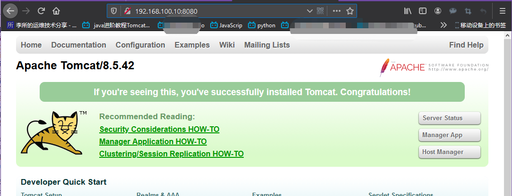
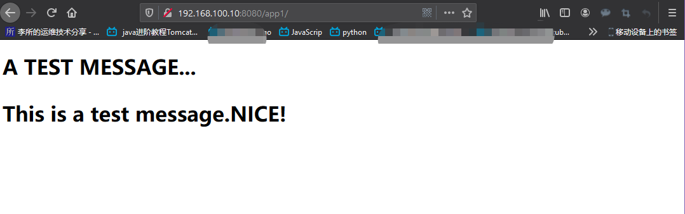

看到房价看到师傅几十块的房价上岛咖啡坚实的开发坚实的开发坚实的开发就速度快放假
Docker Registry 作为 Docker 的核心组件之一负责镜像内容的存储与分发，客户端的
docker pull 以及 push 命令都将直接与 registry 进行交互,最初版本的 registry
由 Python 实现,由于设计初期在安全性，性能以及 API 的设计上有着诸多的缺陷，该
版本在 0.9 之后停止了开发，由新的项目 distribution（新的 docker register 被
称为 Distribution）来重新设计并开发下一代 registry，新的项目由 go 语言开发，
所有的 API，底层存储方式，系统架构都进行了全面的重新设计已解决上一代 registry
中存在的问题，2016 年 4 月份 rgistry 2.0 正式发布，docker 1.6 版本开始支持
registry 2.0，而八月份随着 docker 1.8 发布，docker hub 正式启用 2.1 版本
registry 全面替代之前版本 registry，新版 registry 对镜像存储格式进行了重新设
计并和旧版不兼容，docker 1.5 和之前的版本无法读取 2.0 的镜像，另外，Registry
2.4 版本之后支持了回收站机制，也就是可以删除镜像了，在 2.4 版本之前是无法支持
删除镜像的，所以如果你要使用最好是大于 Registry 2.4 版本的，目前最新版本为 2.7.x。

[官方文档地址](https://docs.docker.com/registry/)
[官方 github 地址](https://github.com/docker/distribution)

下面就通过官方提供的 docker registry 镜像来简单搭建一套本地私有仓库 Registry。

# 一.下载 Docker Registry 镜像

```bash
root@ubuntu-suosuoli-node1:~# docker pull registry
Using default tag: latest
latest: Pulling from library/registry
486039affc0a: Pull complete
ba51a3b098e6: Pull complete
8bb4c43d6c8e: Pull complete
6f5f453e5f2d: Pull complete
42bc10b72f42: Pull complete
Digest: sha256:7d081088e4bfd632a88e3f3bcd9e007ef44a796fddfe3261407a3f9f04abe1e7
Status: Downloaded newer image for registry:latest
docker.io/library/registry:latest

root@ubuntu-suosuoli-node1:~# docker images
REPOSITORY          TAG                 IMAGE ID            CREATED             SIZE
registry            latest              708bc6af7e5e        3 weeks ago         25.8MB
...
```

# 二.搭建单机仓库

## 创建授权使用目录

创建一个目录进行授权使用

```bash
root@ubuntu-suosuoli-node1:~# mkdir /docker/auth -pv
mkdir: created directory '/docker'
mkdir: created directory '/docker/auth
```

## 创建用户

创建一个用户并生成密码

```bash
root@ubuntu-suosuoli-node1:~# cd /docker/
root@ubuntu-suosuoli-node1:/docker# docker run --entrypoint htpasswd registry -Bbn stevenux stevenux > auth/htpasswd

# --entrypoint 表示覆盖镜像的默认入口
# htpasswd 工具用来生成用户名和密码
# htpasswd选项-B 表示使用bcrypt加密方式加密密码
            # -b 表示从命令行接收密码
            # -n 表示将加密的密码输出到标准输出
```

## 验证用户密码是否生成

```bash
root@ubuntu-suosuoli-node1:/docker# cat auth/htpasswd
stevenux:$2y$05$6C5M8zP6tzigy52bvtesIOykRN5PGE474c2cVz4olx.Q3fzF4RFqu
```

## 启动 Docker Registry

```bash
root@ubuntu-suosuoli-node1:/docker# docker run -d -p 5000:5000 --restart=always --name registry_1 -v /docker/auth:/auth -e "REGISTRY_AUTH=htpasswd" -e "REGISTRY_AUTH_HTPASSWD_REALM=Registry Realm" -e REGISTRY_AUTH_HTPASSWD_PATH=/auth/htpasswd registry
1fee90786f71b2c974562c16c76184b059259ef7d602e0692fdade1f176f07ad
```

## 验证端口和容器

```bash
root@ubuntu-suosuoli-node1:/docker/auth# docker ps
CONTAINER ID        IMAGE                  COMMAND                  CREATED              STATUS              PORTS                                        NAMES
1fee90786f71        registry               "/entrypoint.sh /etc…"   About a minute ago   Up About a minute   0.0.0.0:5000->5000/tcp                       registry_1
3d98810b67a9        tomcat-business:app2   "/apps/tomcat/bin/ru…"   2 hours ago          Up 2 hours          8005/tcp, 8009/tcp, 0.0.0.0:8080->8080/tcp   nostalgic_galileo
71cd351c28b6        haproxy-ubuntu:v1      "/usr/bin/run_haprox…"   3 hours ago          Up 3 hours          0.0.0.0:80->80/tcp, 0.0.0.0:9999->9999/tcp   quizzical_saha
root@ubuntu-suosuoli-node1:/docker/auth# ss -ntl | grep 5000
LISTEN   0         20480                     *:5000                   *:*
root@ubuntu-suosuoli-node1:/docker/auth# lsof -i:5000
COMMAND     PID USER   FD   TYPE DEVICE SIZE/OFF NODE NAME
docker-pr 86390 root    4u  IPv6 869094      0t0  TCP *:5000 (LISTEN)
```

## 测试登录仓库

### 报错

```bash
root@ubuntu-suosuoli-node1:/docker/auth# docker login 192.168.100.18:5000
Username: stevenux
Password:
Error response from daemon: Get https://192.168.100.18:5000/v2/: http: server gave HTTP response to HTTPS client
# 指服务端未使用https协议，而客户端使用了https协议
```

### 解决报错

编辑各 docker 服务器/etc/sysconfig/docker 配置文件如下：

编辑各 dockerd 的 sesrvice 文件

Server1:192.168.100.18 上:

```bash
root@ubuntu-suosuoli-node1:~# vim /lib/systemd/system/docker.service
...
[Service]
Type=notify
# the default is not to use systemd for cgroups because the delegate issues still
# exists and systemd currently does not support the cgroup feature set required
# for containers run by docker
ExecStart=/usr/bin/dockerd -H fd:// --containerd=/run/containerd/containerd.sock --insecure-registry 192.168.100.18:5000
ExecReload=/bin/kill -s HUP $MAINPID
TimeoutSec=0
RestartSec=2
Restart=always
...
root@ubuntu-suosuoli-node1:~# systemctl daemon-reload
root@ubuntu-suosuoli-node1:~# systemctl restart docker
```

Server2:192.168.100.10 上:

```bash
[root@docker-server-node1 ~]# vim /usr/lib/systemd/system/docker.service
...
[Service]
Type=notify
ExecStart=/usr/bin/dockerd -H fd:// --containerd=/run/containerd/containerd.sock --insecure-registry 192.168.100.18:5000
#  添加 --insecure-registry
ExecReload=/bin/kill -s HUP $MAINPID
TimeoutSec=0
RestartSec=2
Restart=always
...

[root@docker-server-node1 ~]# systemctl daemon-reload
[root@docker-server-node1 ~]# systemctl restart docker
```

## Server1 登录上传

```bash
# 登录
root@ubuntu-suosuoli-node1:~# docker login 192.168.100.18:5000
Username: stevenux
Password:
WARNING! Your password will be stored unencrypted in /root/.docker/config.json.
Configure a credential helper to remove this warning. See
https://docs.docker.com/engine/reference/commandline/login/#credentials-store

Login Succeeded

# 贴tag
root@ubuntu-suosuoli-node1:~# docker images
REPOSITORY          TAG                 IMAGE ID            CREATED             SIZE
registry            latest              708bc6af7e5e        3 weeks ago         25.8MB
...
# 给我贴
root@ubuntu-suosuoli-node1:~# docker tag tomcat-business:app1 192.168.100.18:5000/stevenux/tomcat-business:app1

# 上传
root@ubuntu-suosuoli-node1:~# docker push 192.168.100.18:5000/stevenux/tomcat-business:app1
The push refers to repository [192.168.100.18:5000/stevenux/tomcat-business]
62791f851d99: Pushed
7d72a1f309c9: Pushed
3223435a55be: Pushed
c008fbaad5eb: Pushed
225685fdf5bc: Pushed
53af0c1a7161: Pushed
acbc74ba6e8e: Pushed
619786ec8558: Pushed
d2d072a76faf: Pushed
99755158254e: Pushing [==================>                                ]    148MB/403.7MB
936594693080: Pushed
94c4c1c2d2f2: Pushing [=============>                                     ]  78.48MB/287.5MB
5d3faeb274b6: Pushed
034f282942cd: Pushing [===================>                               ]  79.41MB/203.6MB
.....
5d3faeb274b6: Pushed
034f282942cd: Pushed
app1: digest: sha256:5f0508ff984eace6b5ba0c295053c10b5e4875957723228df5d04403ed9c93d1 size: 3245

root@ubuntu-suosuoli-node1:~# docker images
REPOSITORY                                     TAG                 IMAGE ID            CREATED             SIZE
192.168.100.18:5000/stevenux/tomcat-business   app1                4c2f165d813b        7 hours ago         947MB
.l....
```

## Server2 下载使用

```bash
[root@docker-server-node1 ~]# docker login 192.168.100.18:5000
Username: stevenux
Password:
WARNING! Your password will be stored unencrypted in /root/.docker/config.json.
Configure a credential helper to remove this warning. See
https://docs.docker.com/engine/reference/commandline/login/#credentials-store

Login Succeeded

[root@docker-server-node1 ~]# docker pull 192.168.100.18:5000/stevenux/tomcat-business:app1
app1: Pulling from stevenux/tomcat-business
Digest: sha256:5f0508ff984eace6b5ba0c295053c10b5e4875957723228df5d04403ed9c93d1
Status: Downloaded newer image for 192.168.100.18:5000/stevenux/tomcat-business:app1
192.168.100.18:5000/stevenux/tomcat-business:app1
[root@docker-server-node1 ~]# docker images
REPOSITORY                                                 TAG                 IMAGE ID            CREATED             SIZE
192.168.100.18:5000/stevenux/tomcat-business               app1                4c2f165d813b        7 hours ago         947MB
tomcat-business                                            app1                4c2f165d813b        7 hours ago         947MB

```

启动 tomcat 容器

```bash
[root@docker-server-node1 ~]# docker run -it -d -p 8080:8080 192.168.100.18:5000/stevenux/tomcat-business:app1
fd781c553385ae926740ca26f0190fb6ffe77761ca1d0f0ee65c5f3a3230be60
[root@docker-server-node1 ~]# lsof -i:8080
COMMAND     PID USER   FD   TYPE  DEVICE SIZE/OFF NODE NAME
docker-pr 64560 root    4u  IPv6 1971347      0t0  TCP *:webcache (LISTEN)
```

访问测试


