Harbor 是一个用于存储和分发 Docker 镜像的企业级 Registry 服务器，由 vmware
开源，其通过添加一些企业必需的功能特性，例如安全、标识和管理等，扩展了开源
Docker Distribution。作为一个企业级私有 Registry 服务器，Harbor 提供了更
好的性能和安全。提升用户使用 Registry 构建和运行环境传输镜像的效率。Harbor
支持安装在多个 Registry 节点的镜像资源复制，镜像全部保存在私有 Registry 中，
确保数据和知识产权在公司内部网络中管控，另外，Harbor 也提供了高级的安全
特性，诸如用户管理，访问控制和活动审计等。

[vmware 官方开源服务列表地址](https://vmware.github.io/harbor/cn/)
[harbor 官方 github 地址](https://github.com/vmware/harbor)
[harbor 官方网址](https://goharbor.io/)

# 一. Harbor 功能介绍

**基于角色的访问控制**：用户与 Docker 镜像仓库通过“项目”进行组织管理，一个用户可
以对多个镜像仓库在同一命名空间（project）里有不同的权限。
**镜像复制**：镜像可以在多个 Registry 实例中复制（同步）。尤其适合于负载均衡，高
可用，混合云和多云的场景。
**图形化用户界面**：用户可以通过浏览器来浏览，检索当前 Docker 镜像仓库，管理项目
和命名空间。
**AD/LDAP 支**：Harbor 可以集成企业内部已有的 AD/LDAP，用于鉴权认证管理。
**审计管理**：所有针对镜像仓库的操作都可以被记录追溯，用于审计管理。
**国际化**：已拥有英文、中文、德文、日文和俄文的本地化版本。更多的语言将会添加进来。
**RESTful API - RESTful API**：提供给管理员对于 Harbor 更多的操控, 使得与其它管
理软件集成变得更容易。
**部署简单**：提供在线和离线两种安装工具， 也可以安装到 vSphere 平台(OVA 方
式)虚拟设备。

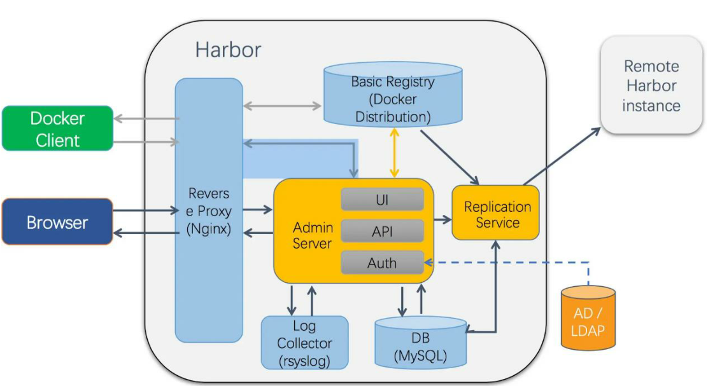

```ruby
nginx：            harbor的一个反向代理组件，代理registry、ui、token等服务。这个代理会转发
                   harbor web和docker client的各种请求到后端服务上。

harbor-adminserver：harbor系统管理接口，可以修改系统配置以及获取系统信息。
harbor-db：         存储项目的元数据、用户、规则、复制策略等信息。
harbor-jobservice： harbor里面主要是为了镜像仓库之前同步使用的。
harbor-log：        收集其他harbor的日志信息。
harbor-ui：         一个用户界面模块，用来管理registry。
registry：          存储docker images的服务，并且提供pull/push服务。
redis：             存储缓存信息
webhook：           当registry中的image状态发生变化的时候去记录更新日志、复制等操作。
token service：     在docker client进行pull/push的时候负责token的发放。
```

# 二. Harbor 安装

## Server1 安装 Docker

```bash
[root@docker-server-node1 ~]# wget -O /etc/yum.repos.d/docker-ce.repo https://mirrors.aliyun.com/docker-ce/linux/centos/docker-ce.repo
[root@docker-server-node1 ~]# yum install docker-ce -y
[root@docker-server-node1 ~]# systemctl start docker
```

## Server2 安装 Docker

```bash
[root@docker-server-node2 ~]# wget -O /etc/yum.repos.d/docker-ce.repo https://mirrors.aliyun.com/docker-ce/linux/centos/docker-ce.repo
[root@docker-server-node2 ~]# yum install docker-ce -y
[root@docker-server-node2 ~]# systemctl start docker
```

## 下载 Harbor 安装包

本次使用当前 harbor 1.7.6 离线安装包，具体名称为
`harbor-offline-installer-v1.7.6.tgz`

### 离线安装包

推荐使用离线完整安装包

```bash
[root@docker-server-node1 ~]# cd /usr/local/src/
[root@docker-server-node1 src]# wget https://storage.googleapis.com/harbor-releases/release-1.7.0/harbor-offline-installer-v1.7.5.tgz
```

### 在线安装包

不推荐使用在线安装包安装，需要从网络下载全部所需文件

```bash
[root@docker-server-node1 src]# wget
https://github.com/vmware/harbor/releases/download/v1.7.5/harbor-online-
installer-v1.10.1.tgz
```

# 三.配置 Harbor

## 3.1 解压并编辑 harbor.cfg

```bash
[root@docker-server-node1 src]# tar -xf harbor-offline-installer-v1.7.6.tgz
[root@docker-server-node1 src]# ln -sv /usr/local/src/harbor /usr/local/
‘/usr/local/harbor’ -> ‘/usr/local/src/harbor’

[root@docker-server-node1 src]# cd /usr/local/harbor/
[root@docker-server-node1 harbor]# ll
total 587744
drwxr-xr-x 3 root root        23 Feb 20 22:54 common
-rw-r--r-- 1 root root      3398 Feb 10 14:18 common.sh
-rw-r--r-- 1 root root       939 Sep 12 11:27 docker-compose.chartmuseum.yml
-rw-r--r-- 1 root root       975 Sep 12 11:27 docker-compose.clair.yml
-rw-r--r-- 1 root root      1434 Sep 12 11:27 docker-compose.notary.yml
-rw-r--r-- 1 root root      5608 Sep 12 11:27 docker-compose.yml
drwxr-xr-x 2 root root        35 Feb 20 22:44 goharbor
-rw-r--r-- 1 root root      8033 Sep 12 11:27 harbor.cfg
-rw-r--r-- 1 root root 600483180 Sep 12 11:28 harbor.v1.7.6.tar.gz
-rw-r--r-- 1 root root      5880 Feb 20 22:39 harbor.yml
drwxr-xr-x 2 root root        24 Feb 20 22:44 input
-rwxr-xr-x 1 root root      5739 Sep 12 11:27 install.sh
-rw-r--r-- 1 root root     11347 Sep 12 11:27 LICENSE
-rw-r--r-- 1 root root   1263409 Sep 12 11:27 open_source_license
-rwxr-xr-x 1 root root     36337 Sep 12 11:27 prepare
```

## 3.2 更新 harbor 配置

### 3.2.1 首次部署更新操作

```bash
# 使用prepare脚本更新配置
[root@docker-server-node1 harbor]# ./prepare
Generated and saved secret to file: /data/secretkey
Generated configuration file: ./common/config/nginx/nginx.conf
Generated configuration file: ./common/config/adminserver/env
Generated configuration file: ./common/config/core/env
Generated configuration file: ./common/config/registry/config.yml
Generated configuration file: ./common/config/db/env
Generated configuration file: ./common/config/jobservice/env
Generated configuration file: ./common/config/jobservice/config.yml
Generated configuration file: ./common/config/log/logrotate.conf
Generated configuration file: ./common/config/registryctl/env
Generated configuration file: ./common/config/core/app.conf
Generated certificate, key file: ./common/config/core/private_key.pem, cert file: ./common/config/registry/root.crt
The configuration files are ready, please use docker-compose to start the service.
```

执行完毕后会在当前目录生成一个 docker-compose.yml 文件，用于配置数据目
录等配置信息。

```bash
[root@docker-server-node1 harbor]# ll docker-compose.yml
-rw-r--r-- 1 root root 5608 Sep 12 11:27 docker-compose.yml
```

### 3.2.2 后期修改配置操作

如果 harbor 运行一段时间之后需要更改配置，则步骤如下:

#### 停止 harbor 编辑配置文件

```bash
[root@docker-server-node1 harbor]# docker-compose stop
[root@docker-server-node1 harbor]# vim harbor.cfg
...
```

#### 更新配置

```bash
[root@docker-server-node1 harbor]# ./prepare  # 使用该脚本更新配置，先删除，后再生成
Clearing the configuration file: ./common/config/adminserver/env
Clearing the configuration file: ./common/config/core/env
Clearing the configuration file: ./common/config/core/app.conf
Clearing the configuration file: ./common/config/core/private_key.pem
Clearing the configuration file: ./common/config/db/env
Clearing the configuration file: ./common/config/jobservice/env
Clearing the configuration file: ./common/config/jobservice/config.yml
Clearing the configuration file: ./common/config/registry/config.yml
Clearing the configuration file: ./common/config/registry/root.crt
Clearing the configuration file: ./common/config/registryctl/env
Clearing the configuration file: ./common/config/registryctl/config.yml
Clearing the configuration file: ./common/config/nginx/nginx.conf
Clearing the configuration file: ./common/config/log/logrotate.conf
loaded secret from file: /data/secretkey
Generated configuration file: ./common/config/nginx/nginx.conf
Generated configuration file: ./common/config/adminserver/env
Generated configuration file: ./common/config/core/env
Generated configuration file: ./common/config/registry/config.yml
Generated configuration file: ./common/config/db/env
Generated configuration file: ./common/config/jobservice/env
Generated configuration file: ./common/config/jobservice/config.yml
Generated configuration file: ./common/config/log/logrotate.conf
Generated configuration file: ./common/config/registryctl/env
Generated configuration file: ./common/config/core/app.conf
Generated certificate, key file: ./common/config/core/private_key.pem, cert file: ./common/config/registry/root.crt
The configuration files are ready, please use docker-compose to start the service.
```

#### 启动 harbor

```bash
[root@docker-server-node1 harbor]# docker-compose start
Starting log         ... done
Starting registry    ... done
Starting registryctl ... done
Starting postgresql  ... done
Starting adminserver ... done
Starting core        ... done
Starting portal      ... done
Starting redis       ... done
Starting jobservice  ... done
Starting proxy       ... done
```

## 3.3 官方推荐的方式启动 harbor

### 3.3.1 部署

```bash
[root@docker-server-node1 harbor]# yum install python-pip –y
[root@docker-server-node1 harbor]# pip install docker-compose
......
gcc -pthread -fno-strict-aliasing -O2 -g -pipe -Wall -Wp,-D_FORTIFY_SOURCE=2 -fexceptions -fstack-protector-strong --param=ssp-buffer-size=4 -grecord-gcc-switches -m64 -mtune=generic -D_GNU_SOURCE -fPIC -fwrapv -DNDEBUG -O2 -g -pipe -Wall -Wp,-D_FORTIFY_SOURCE=2 -fexceptions -fstack-protector-strong --param=ssp-buffer-size=4 -grecord-gcc-switches -m64 -mtune=generic -D_GNU_SOURCE -fPIC -fwrapv -fPIC -I/usr/include/python2.7 -c _posixsubprocess.c -o build/temp.linux-x86_64-2.7/_posixsubprocess.o
    _posixsubprocess.c:16:20: fatal error: Python.h: No such file or directory  # 该错误是因为缺失python-devel
     #include "Python.h"
                        ^
    compilation terminated.
    error: command 'gcc' failed with exit status 1

    ----------------------------------------
Command "/usr/bin/python2 -u -c "import setuptools, tokenize;__file__='/tmp/pip-build-pn2G8c/subprocess32/setup.py';exec(compile(getattr(tokenize, 'open', open)(__file__).read().replace('\r\n', '\n'), __file__, 'exec'))" install --record /tmp/pip-U1nvER-record/install-record.txt --single-version-externally-managed --compile" failed with error code 1 in /tmp/pip-build-pn2G8c/subprocess32/
You are using pip version 8.1.2, however version 20.0.2 is available.
You should consider upgrading via the 'pip install --upgrade pip' command.

# 安装python-devel
[root@docker-server-node1 harbor]# yum install python-devel

[root@docker-server-node1 harbor]# pip install docker-compose
Collecting docker-compose
......
Running setup.py install for functools32 ... done
  Running setup.py install for PyYAML ... done
  Running setup.py install for pycparser ... done
Successfully installed PyYAML-5.3 attrs-19.3.0 backports.shutil-get-terminal-size-1.0.0 bcrypt-3.1.7 cached-property-1.5.1 cffi-1.14.0 configparser-4.0.2 contextlib2-0.6.0.post1 cryptography-2.8 docker-4.2.0 docker-compose-1.25.4 enum34-1.1.6 functools32-3.2.3.post2 importlib-metadata-1.5.0 jsonschema-3.2.0 paramiko-2.7.1 pathlib2-2.3.5 pycparser-2.19 pynacl-1.3.0 pyrsistent-0.15.7 scandir-1.10.0 subprocess32-3.5.4 unknown-0.0.0 websocket-client-0.57.0


[root@docker-server-node1 harbor]# ./install.sh  #官方构建harbor和启动方式，推荐此方法，会下载官方的docker 镜像
[root@docker-server-node2 harbor]# ./install.sh

[Step 0]: checking installation environment ...

Note: docker version: 19.03.6

Note: docker-compose version: 1.25.4

[Step 1]: loading Harbor images ...
b80136ee24a4: Loading layer [==================================================>]  34.25MB/34.25MB
1f2db9bc717e: Loading layer [==================================================>]  63.49MB/63.49MB
3ea31adb1f16: Loading layer [==================================================>]  52.48MB/52.48MB
70134bbcd2db: Loading layer [==================================================>]  6.656kB/6.656kB
1f1b4fc154ff: Loading layer [==================================================>]  2.048kB/2.048kB
f16fb7c6177e: Loading layer [==================================================>]   7.68kB/7.68kB
c63d53b4b8d0: Loading layer [==================================================>]   2.56kB/2.56kB
787514dd6c1a: Loading layer [==================================================>]   2.56kB/2.56kB
381c81ec71b2: Loading layer [==================================================>]   2.56kB/2.56kB
......
[Step 2]: preparing environment ...
Generated and saved secret to file: /data/secretkey
Generated configuration file: ./common/config/nginx/nginx.conf
Generated configuration file: ./common/config/adminserver/env
Generated configuration file: ./common/config/core/env
Generated configuration file: ./common/config/registry/config.yml
Generated configuration file: ./common/config/db/env
Generated configuration file: ./common/config/jobservice/env
Generated configuration file: ./common/config/jobservice/config.yml
Generated configuration file: ./common/config/log/logrotate.conf
Generated configuration file: ./common/config/registryctl/env
Generated configuration file: ./common/config/core/app.conf
Generated certificate, key file: ./common/config/core/private_key.pem, cert file: ./common/config/registry/root.crt
The configuration files are ready, please use docker-compose to start the service.


[Step 3]: checking existing instance of Harbor ...


[Step 4]: starting Harbor ...
Creating network "harbor_harbor" with the default driver
Creating harbor-log ... done
Creating registry           ... done
Creating harbor-db          ... done
Creating registryctl        ... done
Creating redis              ... done
Creating harbor-adminserver ... done
Creating harbor-core        ... done
Creating harbor-portal      ... done
Creating harbor-jobservice  ... done
Creating nginx              ... done

✔ ----Harbor has been installed and started successfully.----

Now you should be able to visit the admin portal at http://192.168.100.19.
For more details, please visit https://github.com/goharbor/harbor .
```

### 3.3.2 查看本地镜像

```bash
[root@docker-server-node2 harbor]# docker images
REPOSITORY                                                 TAG                 IMAGE ID            CREATED             SIZE
goharbor/chartmuseum-photon                                v0.8.1-v1.7.6       ca4e65cc8cbf        5 months ago        114MB
goharbor/harbor-migrator                                   v1.7.6              bd65976b2563        5 months ago        680MB
goharbor/redis-photon                                      v1.7.6              477066fd0e02        5 months ago        109MB
goharbor/clair-photon                                      v2.0.8-v1.7.6       a65550304aa5        5 months ago        165MB
goharbor/notary-server-photon                              v0.6.1-v1.7.6       1bfca6aac750        5 months ago        136MB
goharbor/notary-signer-photon                              v0.6.1-v1.7.6       8535add7bfa5        5 months ago        133MB
goharbor/harbor-registryctl                                v1.7.6              bb06dcda87fa        5 months ago        103MB
goharbor/registry-photon                                   v2.6.2-v1.7.6       8fa930eedbea        5 months ago        87.7MB
goharbor/nginx-photon                                      v1.7.6              fea7c162d250        5 months ago        37MB
goharbor/harbor-log                                        v1.7.6              f9b50bc6e136        5 months ago        82.6MB
goharbor/harbor-jobservice                                 v1.7.6              cfac2ab2d45a        5 months ago        85.1MB
goharbor/harbor-core                                       v1.7.6              37379145c410        5 months ago        96.6MB
goharbor/harbor-portal                                     v1.7.6              eafab006217d        5 months ago        41.7MB
goharbor/harbor-adminserver                                v1.7.6              2d91210e25ed        5 months ago        73.3MB
```

### 3.3.3 查看本地端口

```bash
[root@docker-server-node2 harbor]# ss -ntl
State      Recv-Q Send-Q                 Local Address:Port            Peer Address:Port
LISTEN     0      100                        127.0.0.1:25                         *:*
LISTEN     0      128                        127.0.0.1:9000                       *:*
LISTEN     0      1024                       127.0.0.1:1514                       *:*
LISTEN     0      50                                 *:3306                       *:*
LISTEN     0      128                                *:111                        *:*
LISTEN     0      128                                *:22                         *:*
LISTEN     0      100                            [::1]:25                      [::]:*
LISTEN     0      1024                            [::]:443                     [::]:*
LISTEN     0      1024                            [::]:4443                    [::]:*
LISTEN     0      128                             [::]:111                     [::]:*
LISTEN     0      1024                            [::]:80                      [::]:*
LISTEN     0      128                             [::]:22                      [::]:*
```

### 3.3.4 访问 web 管理界面

Server2:192.168.100.19
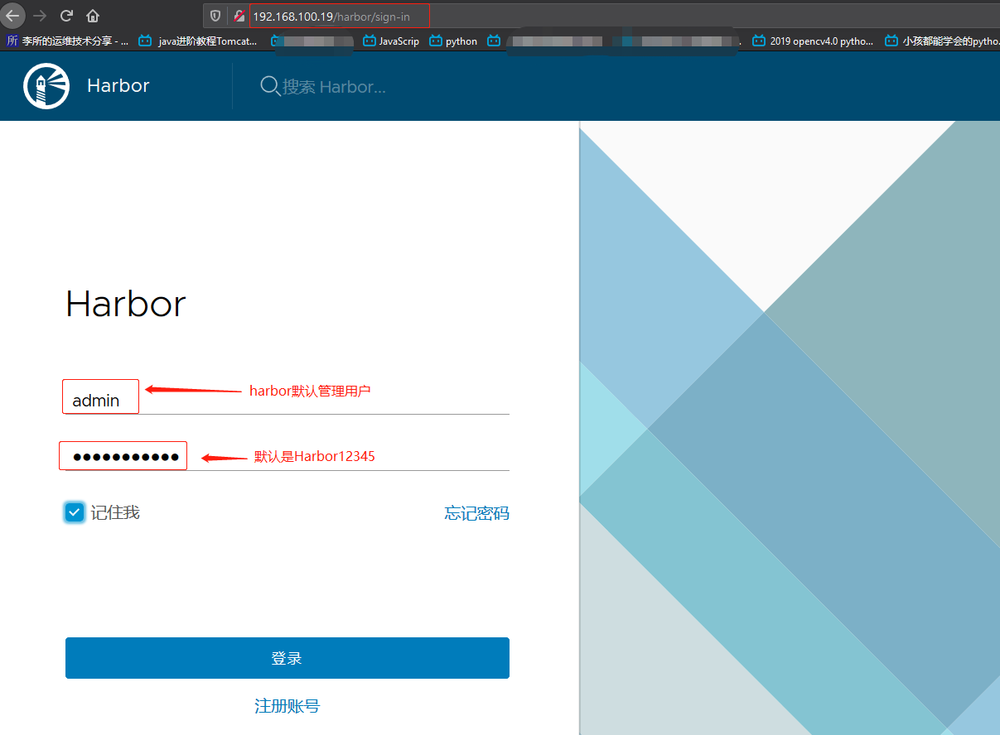

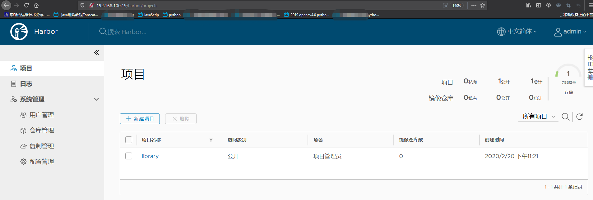

Server1:192.168.100.10
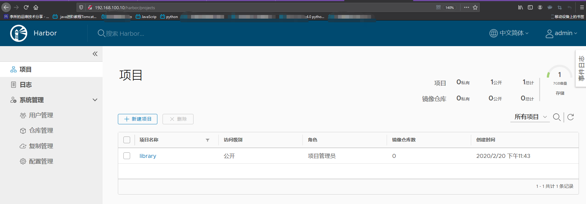

## 3.4 非官方推荐的方式启动 harbor

```bash
[root@docker-server-node1 harbor]# docker-compose up -d
```

# 四. 配置 docker 使用 harbor 仓库

## 4.1 编辑 docker 启动文件并重启

```bash
[root@docker-server-node2 ~]# vim /usr/lib/systemd/system/docker.service
[Service]
Type=notify
# the default is not to use systemd for cgroups because the delegate issues still
# exists and systemd currently does not support the cgroup feature set required
# for containers run by docker
ExecStart=/usr/bin/dockerd -H fd:// --containerd=/run/containerd/containerd.sock --insecure-registry 192.168.100.19:5000 --insecure-registry 192.168.100.10:5000
ExecReload=/bin/kill -s HUP $MAINPID
TimeoutSec=0
RestartSec=2
Restart=always

[root@docker-server-node2 harbor]# systemctl daemon-reload
[root@docker-server-node2 harbor]# systemctl restart docker
[root@docker-server-node2 harbor]# docker-compose start
```

## 4.2 验证能否登陆

```bash
[root@docker-server-node1 harbor]# docker login 192.168.100.19
Username: admin
Password:
WARNING! Your password will be stored unencrypted in /root/.docker/config.json.
Configure a credential helper to remove this warning. See
https://docs.docker.com/engine/reference/commandline/login/#credentials-store

Login Succeeded
```

## 4.3 测试上传镜像

将之前单机仓库构构建的 Nginx 镜像上传到 harbor 服务器用于测试

```bash
# 贴tag
[root@docker-server-node1 harbor]# docker tag alpine:latest 192.168.100.10/library/alpine:latest

# 登录
[root@docker-server-node1 harbor]# docker login 192.168.100.19
Username: admin
Password:
WARNING! Your password will be stored unencrypted in /root/.docker/config.json.
Configure a credential helper to remove this warning. See
https://docs.docker.com/engine/reference/commandline/login/#credentials-store

Login Succeeded

# 上传
[root@docker-server-node2 harbor]# docker push 192.168.100.19/library/alpine:latest
The push refers to repository [192.168.100.19/library/alpine]
5216338b40a7: Pushed
latest: digest: sha256:ddba4d27a7ffc3f86dd6c2f92041af252a1f23a8e742c90e6e1297bfa1bc0c45 size: 528
```

web 界面确认

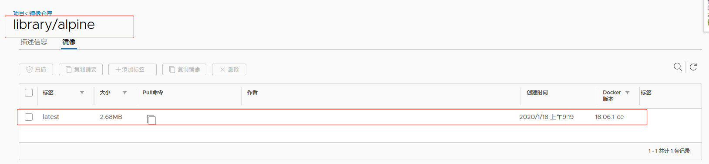

## 4.4 测试从 harbor 下载镜像使用

需要从 192.168.100.19 下载的 dockerd 都需要改启动文件加上
--insecure-registry 选项

```bash
[root@docker-server-node2 ~]# vim /usr/lib/systemd/system/docker.service
[Service]
Type=notify
# the default is not to use systemd for cgroups because the delegate issues still
# exists and systemd currently does not support the cgroup feature set required
# for containers run by docker
ExecStart=/usr/bin/dockerd -H fd:// --containerd=/run/containerd/containerd.sock --insecure-registry 192.168.100.19:5000 --insecure-registry 192.168.100.10:5000
ExecReload=/bin/kill -s HUP $MAINPID
TimeoutSec=0
RestartSec=2
Restart=always

[root@docker-server-node2 harbor]# systemctl daemon-reload
[root@docker-server-node2 harbor]# systemctl restart docker
[root@docker-server-node2 harbor]# docker-compose start
```

测试下载，点击复制 pull 命令


```bash
[root@docker-server-node2 harbor]# docker pull 192.168.100.19/library/alpine:latest

[root@docker-server-node2 harbor]# docker pull 192.168.100.19/library/alpine:latest
latest: Pulling from library/alpine
Digest: sha256:ddba4d27a7ffc3f86dd6c2f92041af252a1f23a8e742c90e6e1297bfa1bc0c45
Status: Downloaded newer image for 192.168.100.19/library/alpine:latest
192.168.100.19/library/alpine:latest

[root@docker-server-node2 src]# docker images
[root@docker-server-node2 harbor]# docker images | grep alpine
192.168.100.19/library/alpine                              latest              e7d92cdc71fe        5 weeks ago         5.59MB
...

[root@docker-server-node2 harbor]# docker run --rm -it 192.168.100.19/library/alpine:latest sh
/ # cat /etc/issue
Welcome to Alpine Linux 3.11
Kernel \r on an \m (\l)

/ #
```

# 五.实现 harbor 高可用

Harbor 有两种高可用实现方式：
: 基于共享存储实现
: 基于镜像复制实现

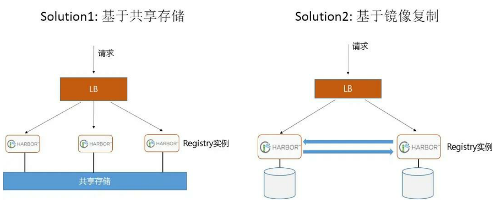

Harbor 支持基于策略的 Docker 镜像复制功能，这类似于 MySQL 的主从同步，
其可以实现不同的数据中心、不同的运行环境之间同步镜像，并提供友好的管理
界面，大大简化了实际运维中的镜像管理工作，已经有用很多互联网公司使用
harbor 搭建内网 docker 仓库的案例，并且还有实现了双向复制的案列。

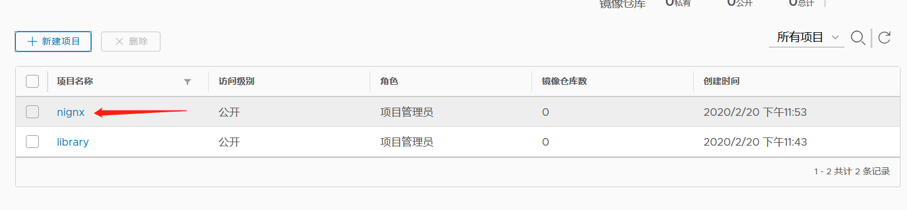
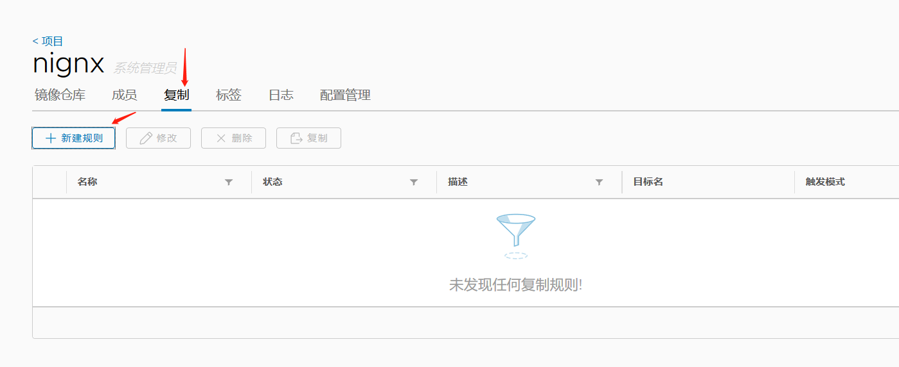
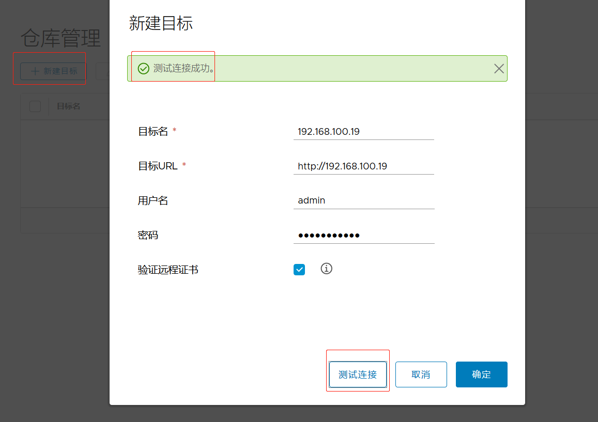
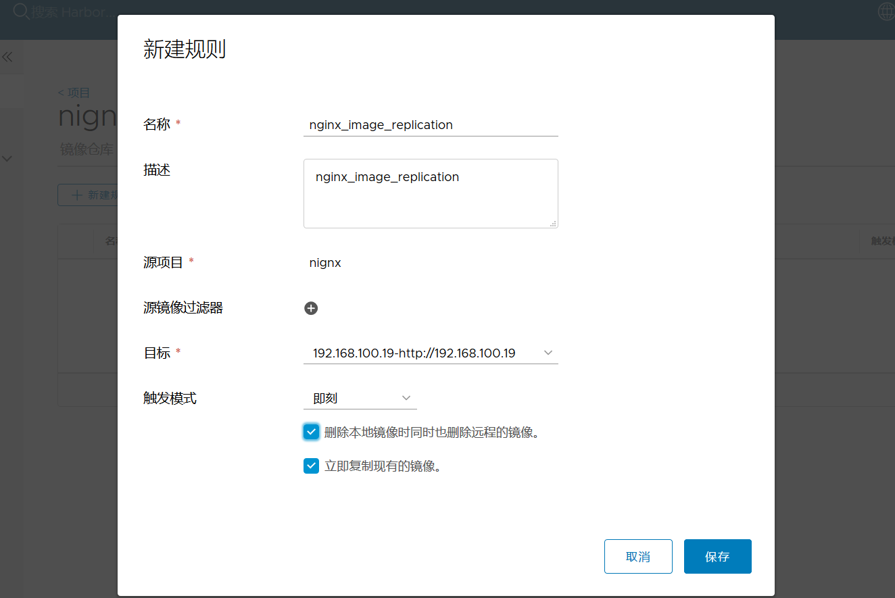

## 5.1 新部署一台 harbor 服务器

Server1:192.168.100.10

此处 Server1 为从 Harbor，主 Harbor 为 Server2:192.168.100.19
主在向从复制镜像时，需要从 Harbor 有相同的镜像仓库名。此实验都使
用默认的 library。

部署:

```bash
[root@docker-server-node1 src]# pwd
/usr/local/src
[root@docker-server-node1 src]# tar xf harbor-offline-installer-v1.7.6.tgz
[root@docker-server-node1 local]# ln -s /usr/local/src/harbor /usr/local/harbor
[root@docker-server-node1 harbor]# pwd
/usr/local/harbor
[root@docker-server-node1 harbor]# ll
total 587744
drwxr-xr-x 4 root root        37 Feb 20 23:00 common
-rw-r--r-- 1 root root      3398 Feb 10 14:18 common.sh
-rw-r--r-- 1 root root       939 Sep 12 11:27 docker-compose.chartmuseum.yml
-rw-r--r-- 1 root root       975 Sep 12 11:27 docker-compose.clair.yml
-rw-r--r-- 1 root root      1434 Sep 12 11:27 docker-compose.notary.yml
-rw-r--r-- 1 root root      5608 Sep 12 11:27 docker-compose.yml
drwxr-xr-x 2 root root        35 Feb 20 22:44 goharbor
-rw-r--r-- 1 root root      8016 Feb 20 23:11 harbor.cfg
-rw-r--r-- 1 root root 600483180 Sep 12 11:28 harbor.v1.7.6.tar.gz
-rw-r--r-- 1 root root      5880 Feb 20 22:39 harbor.yml
drwxr-xr-x 2 root root        24 Feb 20 22:44 input
-rwxr-xr-x 1 root root      5739 Sep 12 11:27 install.sh
-rw-r--r-- 1 root root     11347 Sep 12 11:27 LICENSE
-rw-r--r-- 1 root root   1263409 Sep 12 11:27 open_source_license
-rwxr-xr-x 1 root root     36337 Sep 12 11:27 prepare

[root@docker-server-node1 harbor]# ./prepare
......

[root@docker-server-node1 harbor]# ./install.sh
......
```

从 Harbor 部署好的样子:


## 5.3 在主 Harbor 默认的 library 参考添加复制规则

从 harbor 的 library 仓库，与主 harbor 仓库名称 library 一致。当然，
也可以创建新的仓库，主从的仓库名保持一致即可。

在主 Harbor Server2:192.168.100.19 的仓库管理添加从 Harbor 作为目标:

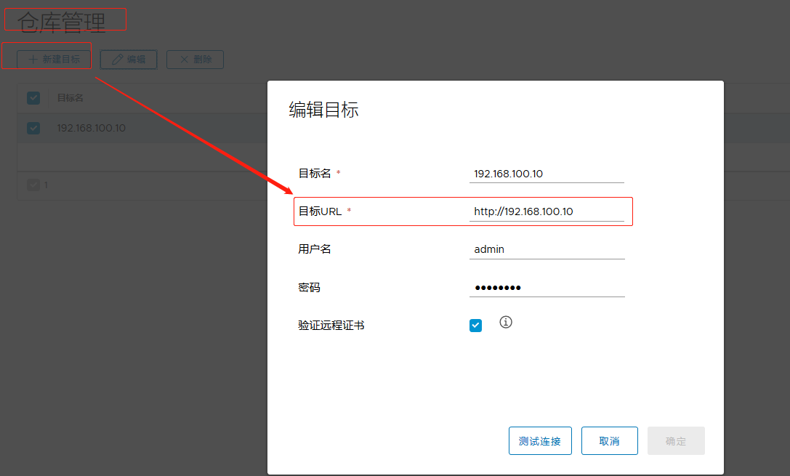

在主 Harbor Server2:192.168.100.19 的 library 添加复制规则:

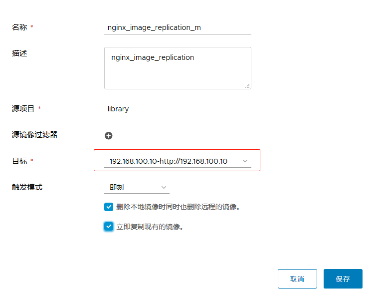

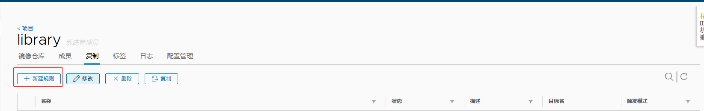

## 5.4 查看主 harbor 同步情况

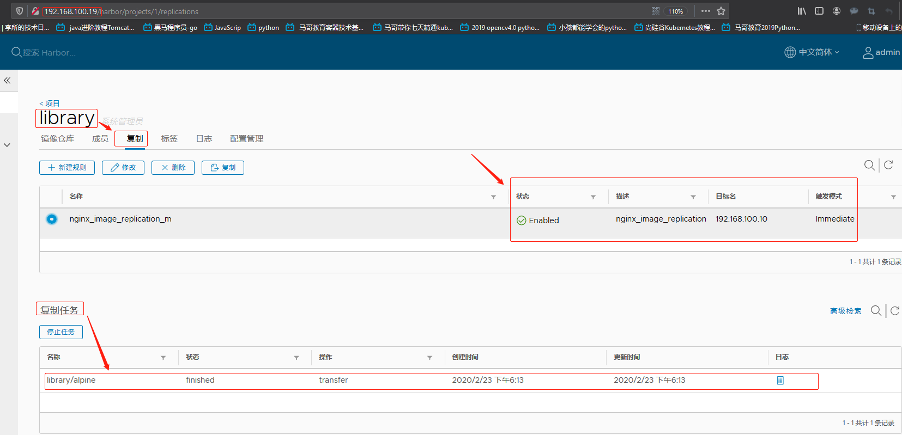

## 5.5 从 harbor 查看镜像

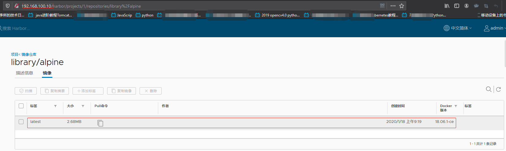

## 5.6 在从 harbor 仓库下载镜像使用

从 Harbor 上将同步的 alpine 镜像 pull 下来测试

```bash
[root@docker-server-node1 ~]# docker pull 192.168.100.10/library/alpine:latest
latest: Pulling from library/alpine
c9b1b535fdd9: Already exists
Digest: sha256:ddba4d27a7ffc3f86dd6c2f92041af252a1f23a8e742c90e6e1297bfa1bc0c45
Status: Downloaded newer image for 192.168.100.10/library/alpine:latest
192.168.100.10/library/alpine:latest

[root@docker-server-node1 ~]# docker images | grep alpine
192.168.100.10/library/alpine                  latest              e7d92cdc71fe        5 weeks ago         5.59MB
...

[root@docker-server-node1 ~]# docker run -it --rm 192.168.100.10/library/alpine:latest sh
/ # cat /etc/issue
Welcome to Alpine Linux 3.11
Kernel \r on an \m (\l)

/ #
```

# 六.实现 harbor 双向同步

在从 Harbor(192.168.100.10)创建复制规则，将上传到从 Harbor 的镜像同步到
主 Harbor(192.168.100.19)，两边都在 library 仓库创建复制规则。

## 6.1 在 docker 客户端导入 centos 基础镜像

在从 Harbor 的 docker 导入 centos 镜像，用于同步准备

```bash
[root@docker-server-node1 ~]# docker load -i /opt/centos-latest-image.tar.gz
0683de282177: Loading layer [==================================================>]  244.9MB/244.9MB
Loaded image: centos:latest
[root@docker-server-node1 ~]# docker images
REPOSITORY                                     TAG                 IMAGE ID            CREATED             SIZE
centos                                         latest              470671670cac        5 weeks ago         237MB
...

```

## 6.2 贴 tag

```bash
[root@docker-server-node1 ~]# docker tag centos:latest 192.168.100.10/library/centos:latest

[root@docker-server-node1 ~]# docker images | grep centos
192.168.100.10/library/centos                  latest              470671670cac        5 weeks ago         237MB
centos                                         latest              470671670cac        5 weeks ago         237MB

```

## 6.3 上传到从 harbor

```bash
[root@docker-server-node1 ~]# docker push 192.168.100.10/library/centos:latest
The push refers to repository [192.168.100.10/library/centos]
0683de282177: Pushed
latest: digest: sha256:9e0c275e0bcb495773b10a18e499985d782810e47b4fce076422acb4bc3da3dd size: 529
```

## 6.4 到从 harbor 确认

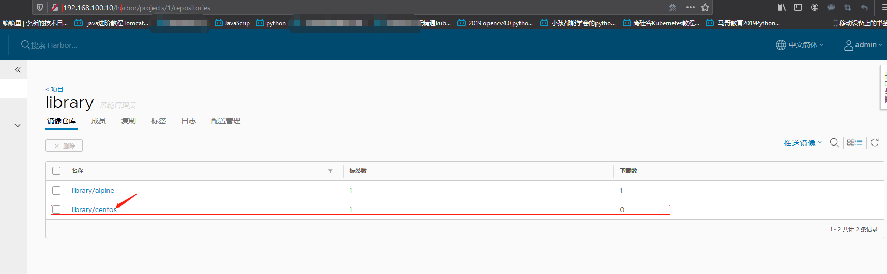

## 6.5 在从 harbor 创建同步规则

规则方式与主 harbor 相同，写对方的 IP+用户名密码，然后点测试连接，确认可
以测试连接通过。

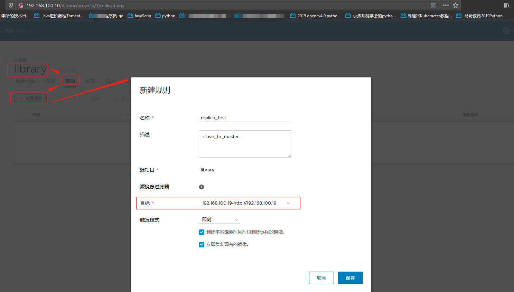

同样，创建规则时的目标要到仓库管理项去配置:新建目标
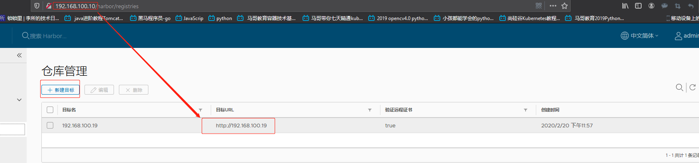

## 6.6 到主 harbor 确认

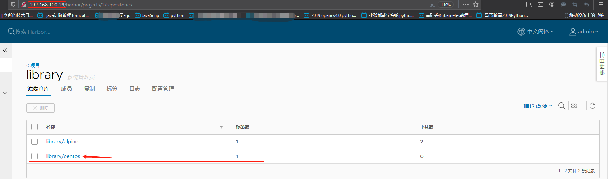

## 6.7 docker 端测试

```bash
[root@docker-server-node2 harbor]# docker images | grep centos
[root@docker-server-node2 harbor]# docker pull 192.168.100.19/library/centos:latest
latest: Pulling from library/centos
8a29a15cefae: Pull complete
Digest: sha256:9e0c275e0bcb495773b10a18e499985d782810e47b4fce076422acb4bc3da3dd
Status: Downloaded newer image for 192.168.100.19/library/centos:latest
192.168.100.19/library/centos:latest
[root@docker-server-node2 harbor]# docker run --rm -it 192.168.100.19/library/centos:latest bash
[root@63e4aa284f50 /]# cat /etc/issue
\S
Kernel \r on an \m


```

## 6.8 harbor https 配置

```bash
# openssl genrsa -out /usr/local/src/harbor/certs/harbor-ca.key 2048
# openssl req -x509 -new -nodes -key /usr/local/src/harbor/certs/harbor-ca.key  -subj "/CN=harbor.suosuoli.local -days 7120 -out /usr/local/src/harbor/certs/harbor-ca.crt

# vim harbor.cfg
  hostname = harbor.suosuoli.local
  ui_url_protocol = https
  ssl_cert = /usr/local/src/harbor/certs/harbor-ca.crt
ssl_cert_key = /usr/local/src/harbor/certs/harbor-ca.key
harbor_admin_password = stevenux
# ./install.sh
# yum install docker-ce-18.06.3.ce-3.el7.x86_64.rpm
# yum install docker-compose
# mkdir /etc/docker/certs.d/harbor.suosuoli.local -p
# cp certs/harbor-ca.crt  /etc/docker/certs.d/harbor.suosuli.local/
# docker login harbor.suosuoli.local
```
