<h1><font face="黑体" color="grey">Docker 应用数据管理</font></h1>

Docker 容器在运行中生成了新的数据或者修改了某个容器内部已经存在的文件内容，
那么新产生的数据将会被 CoW 机制(copy on write 写时复制)复制到读写层进行持
久化保存，这个读写层就是容器的工作目录，但是并不意味着该可写层的数据就实
现了真正的数据持久，此处只是相对于容器的生命周期来说实现了数据持久化，这
些处于可写层的数据是不可以使用常规的手动随意备份和负载的，是由 docker 特定
的存储驱动管理的。

如下图容器对根的数据写入到了自己的可写层，但是把/data 目录中的数据写入到了
一个另外的 volume(数据卷)中用于数据持久化。这种数据持久化方式可以使用 docker
的数据卷存储实现。

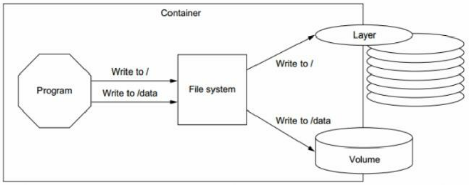

如上图的`write to /`动作，该动作将新创建的数据存储到了容器的可写层，
真正的意思是:

1. 该数据会在容器被删除后随之被删除，如果主机上的普通进程需要该数据，
   是很难将其从容器的取出的。
2. 某容器的可写层是和主机紧密耦合的，移动里面的数据比较困难。
3. 将数据写入容器的可写层是由存储驱动管理的。docker 的存储驱动基于 linux
   内核提供了 union 文件系统，使用存储驱动将数据保存到可写层降低了性能(相
   较于数据卷，数据卷不需要 union 文件系统抽象，直接将数据写入到主机的磁盘)。

为了将容器里面需要持久化的数据存储到物理主机磁盘(即使容器已经停止运行或被删除)，
Docker 提供了两个选择:

1. volumes(数据卷)
2. bind mounts(挂载)

如果运行于 linux，还支持 tmpfs mount 数据持久化，如果在 windows 运行 docker 则
还支持 named pipe。

# 一. Docker 数据管理的三种方式

Docker 的镜像是分层设计的，镜像层是只读的，通过镜像启动的容器添加了一层可读写
的文件系统，用户写入的数据都保存在这一层当中。

如果要将写入到容器的数据永久保存，则需要将容器中的数据保存到宿主机的指定目录，
目前 Docker 的数据管理分为下面三种:

1. 数据卷(data volume):数据卷类似于挂载的一块磁盘，由 docker 复制管理该挂载
   的数据卷，一般该数据卷位于物理机磁盘的`/var/lib/docker/volumes/`目录。

2. bind mounts(挂载):将物理机磁盘目录或文件挂载到容器中，该挂载的文件或目录
   无法使用 docker CLI 管理，而 data volume 可以。另外，该文件或目录是可以
   在物理机随意改动的。如果挂载时容器没有相应的目录，则自动创建。

3. 数据卷容器(Data volume container): 数据卷容器是将宿主机的目录挂载至一个
   专门的数据卷容器，然后让其他容器通过数据卷容器读写宿主机的数据。实质上是
   数据卷方式。

# 二. 使用数据卷(data valume)

## 2.1 什么是数据卷?

数据卷被抽象为 docker 可以管理的物理机磁盘区域，其实质上是宿主机上的目录或
者文件，可以被直接 mount 到容器当中，可以指定读写方式或者只读方式挂载。

实际生产环境中，需要针对不同类型的服务、不同类型的数据存储要求做相应的规划，
最终保证服务的可扩展性、稳定性以及数据的安全性。

实际生产环境部署应用时，往往需要考虑多重因素，例如容器跑的服务是否是有状态
的，数据的重要性，是否需要持久化数据，哪部分数据需要持久化等等。例如容器运
行的服务为 mysql，则该服务是有状态的并且数据是非常重要的，必须持久化和备份。
若运行的是代理服务如 haproxy 或者 lvs，那么完全没有需要持久化的数据，同时也是
无状态的。 如下图：

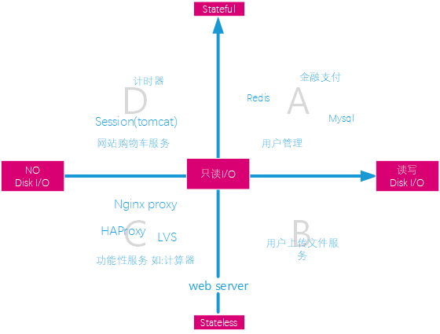

如上图，处于 A 象限的服务或功能都需要有操作前后的状态跟踪，这样一来，
各个操作之间的数据必须持久化到磁盘，因此这些服务既有状态的变更也涉及
到大量的磁盘 I/O。处于 B 象限的服务如上传文件服务，这些动作都是冥等
的，无需状态记录，但是上传的数据必须存储。处于 C 象限的服务纯属功能
性服务，如反向代理服务和在线的计算器等服务。处于 B 和 C 象限之间的负轴
表示在启动时 web 服务会读取磁盘的配置等文件。处于 D 象限的服务如 tomcat
的 session 会话服务等都是与状态强相关的，但是不需要持久化存储于磁盘，
只是短时间使用，一般都存储于内存的缓存。


如上图，挂载是将文件系统的文件挂载到 docker 中使用，实际存储位置为
`Docker area`之外。而 volume 数据卷则是将目录映射到`Docker area`，
由 Docker 管理，即图中橙色区域。

## 2.2 使用数据卷示例

在搭建小型的 web 站点时可以将部署代码放在物理主机文件系统，以数据卷的方式
提供给容器使用，而不需要将代码提前部署到容器的镜像中。

app 以数据卷的方式，提供给容器使用，比如容器可以直接宿主机本地的 web
app，而需要将代码提前添加到容器中，此方式适用于小型 web 站点。下面演示
使用此方法管理 web 应用的数据。配置文件可以以只读方式提供给容器读取，
使用两个 app 来演示，一个可以在容器读写数据卷的数据，一个则只能读。

### 2.2.1 准备测试应用数据

创建数据目录和测试页面:

#### app1 的数据和页面

```html
root@ubuntu-suosuoli-node1:~# mkdir /data/app1 -pv mkdir: created directory
'/data/app1' root@ubuntu-suosuoli-node1:~# vim /data/app1/index.html

<!DOCTYPE html>
<head>
    <h1>Volume app test1</h1>
  </head>
  <body>
  <p>A test page...</p>
  </body>
</html>
```

#### app2 的数据和测试页面

```html
root@ubuntu-suosuoli-node1:~# mkdir  /data/app2/
root@ubuntu-suosuoli-node1:~# vim /data/app2/index.html
<!DOCTYPE html>
<head>
    <h1>Volume app test2</h1>
  </head>
  <body>
  <p>A test page...</p>
  </body>
</html>
```

### 2.2.2 启动 Tomcat 容器并映射数据卷

使用两个容器，一个为默认映射参数；另一个为只读映射。只读映射的
目录，docker 容器只能读取目录中的文件内容，无法更改。可以在宿主
机更改数据。

#### 启动第一个 tomcat 容器

```bash
root@ubuntu-suosuoli-node1:~# docker images  |grep tomcat
tomcat-business                         app2                b36c6d580d28        5 days ago          947MB
# 使用app1测试
tomcat-business                         app1                4c2f165d813b        5 days ago          947MB
tomcat-base                             v8.5.42             6533b305cfc0        5 days ago          934MB

# 先确定tomcat的应用部署目录，也可以看Dockerfile确定
root@ubuntu-suosuoli-node1:~# docker run -it --rm tomcat-business:app1 bash
[root@b68839f616ab /]# find / -name tomcat
/apps/tomcat
[root@b68839f616ab /]# ll /apps/tomcat/webapps/  # 将宿主机的应用映射到该目录
total 20
drwxr-x--- 1 www www 4096 Jun  5  2019 docs
drwxr-x--- 1 www www 4096 Jun  5  2019 examples
drwxr-x--- 1 www www 4096 Jun  5  2019 host-manager
drwxr-x--- 1 www www 4096 Jun  5  2019 manager
drwxr-x--- 1 www www 4096 Jun  5  2019 ROOT
[root@b68839f616ab /]# exit
exit

# 将宿主机:/data/app1/目录映射到容器的:/apps/tomcat/webapps/app1，容器中app1目录会自动创建
root@ubuntu-suosuoli-node1:~# docker run -it -d -p 8080:8080 --name volume-test1 -v  /data/app1/:/apps/tomcat/webapps/app1 tomcat-business:app1
51b3d0ad7c345163ea8843c50d277d213e7bcdc9899221df7ed6b45ad74f7ae1

root@ubuntu-suosuoli-node1:~# ss -ntl | grep 8080
LISTEN   0         20480                     *:8080                   *:*
root@ubuntu-suosuoli-node1:~# lsof -i:8080
COMMAND      PID USER   FD   TYPE  DEVICE SIZE/OFF NODE NAME
docker-pr 115026 root    4u  IPv6 1463154      0t0  TCP *:http-alt (LISTEN)
```

#### 启动第二个 tomcat 容器

```bash
# 将宿主机:/data/app2/目录映射到容器的:/apps/tomcat/webapps/app2
# 注意是只读挂载:"-v /host/path/:/container/path:ro"
root@ubuntu-suosuoli-node1:~# docker run -it -d -p 8181:8080 --name volume-test2 -v  /data/app2/:/apps/tomcat/webapps/app2:ro tomcat-business:app2
2e4ba50b638482d43892e12fb061194827c4a6369cdb9786d176379004369725

root@ubuntu-suosuoli-node1:~# ss -ntl | grep 8181
LISTEN   0         20480                     *:8181                   *:*
root@ubuntu-suosuoli-node1:~# lsof -i:8181
COMMAND      PID USER   FD   TYPE  DEVICE SIZE/OFF NODE NAME
docker-pr 116048 root    4u  IPv6 1471880      0t0  TCP *:8181 (LISTEN)
```

### 2.2.3 查看容器是否正常提供服务

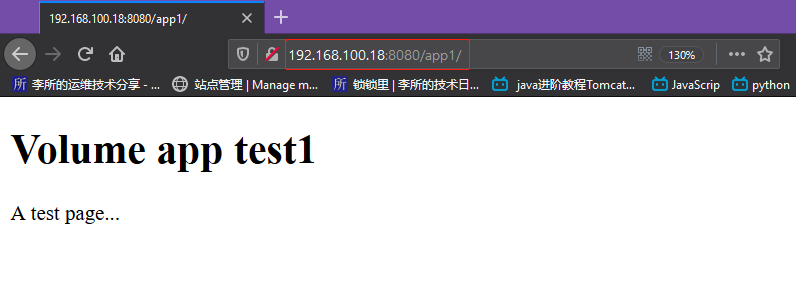

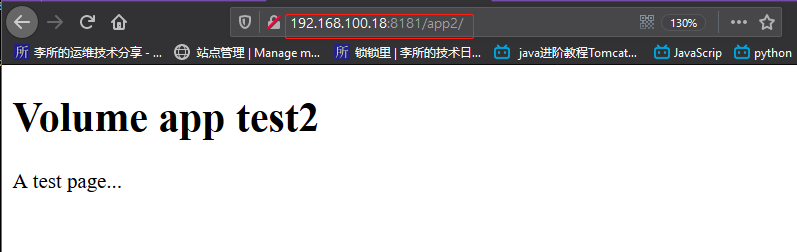

### 2.2.4 进入容器测试应用写入数据

#### app1-容器 1 改数据

```bash
root@ubuntu-suosuoli-node1:~# docker ps
CONTAINER ID        IMAGE                  COMMAND                  CREATED              STATUS              PORTS                                        NAMES
2e4ba50b6384        tomcat-business:app2   "/apps/tomcat/bin/ru…"   About a minute ago   Up About a minute   8005/tcp, 8009/tcp, 0.0.0.0:8181->8080/tcp   volume-test2
03c132cb95f3        tomcat-business:app1   "/apps/tomcat/bin/ru…"   13 minutes ago       Up 13 minutes       8005/tcp, 8009/tcp, 0.0.0.0:8080->8080/tcp   volume-test1
root@ubuntu-suosuoli-node1:~# docker exec -it volume-test1 /bin/bash
# 修改数据
[root@03c132cb95f3 /]# vim /apps/tomcat/webapps/app1/index.html
<!DOCTYPE html>
<head>
    <h1>Volume app test1</h1>
  </head>
  <body>
  <p>A test page...</p>

<!-- 新增数据 -->
  <font color="red"><p>Added in container...</p></font>

  </body>
</html>

[root@03c132cb95f3 /]# exit
exit
```

#### app2-容器 2 改数据

```bash
root@ubuntu-suosuoli-node1:~# docker exec -it volume-test2 /bin/bash
[root@2e4ba50b6384 /]# vim /apps/tomcat/webapps/app2/index.html
```

由于宿主机的`/data/app2`目录只读方式映射到`/apps/tomcat/webapps/app2/`，
因此，修改该容器的数据卷中的文件时提示无法以可读打开该文件，无法修改。
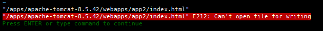

```bash
[root@2e4ba50b6384 /]# exit
exit
```

### 2.2.5 在宿主机验证和访问 web

#### app1 测试页面多一行红色文字

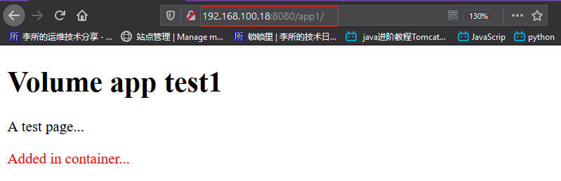

#### app2 测试页面不变

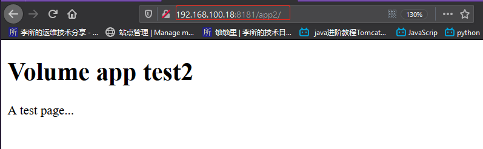

### 2.2.6 在宿主机修改应用数据

由于在宿主机两个数据卷(/data/app{1,2})都是可更改的，所以两个容器
的测试页面内容都会变更。

#### 在宿主机修改 app1 数据

```bash
root@ubuntu-suosuoli-node1:~# vim /data/app1/index.html
<!DOCTYPE html>
<head>
    <h1>Volume app test1</h1>
  </head>
  <body>
  <p>A test page...</p>
  <font color="red"><p>Added in container...</p></font>

  <!-- 新增数据 -->
  <font color="blue"><p>Added outside...</p></font>

  </body>
</html>

```

#### 在宿主机修改 app2 数据

```bash
root@ubuntu-suosuoli-node1:~# vim /data/app2/index.html
<!DOCTYPE html>
<head>
    <h1>Volume app test2</h1>
  </head>
  <body>
  <p>A test page...</p>

  <!-- 新增数据 -->
  <p>Added outside.............</p>

  </body>
</html>

```

### 2.2.7 访问 web 验证数据改动

新增数据显示
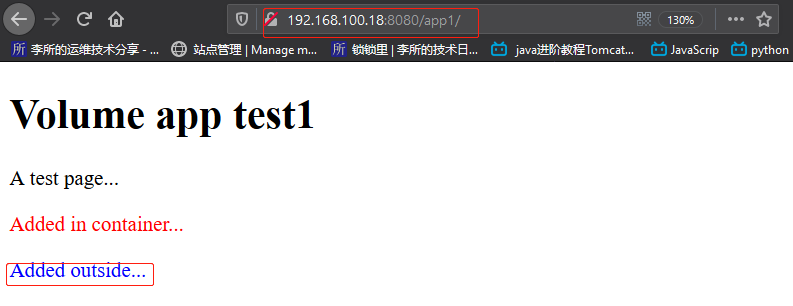

新增数据显示
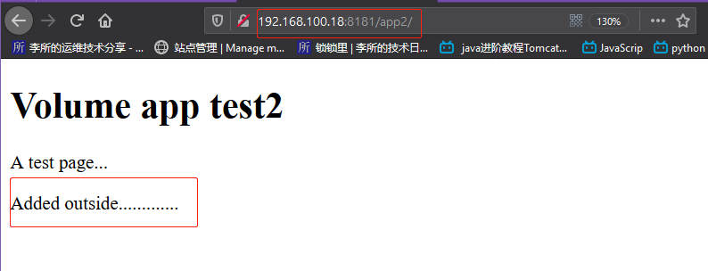

### 2.2.8 找到 app1 和 app2 在宿主机上的位置

app1 和 app2 在容器中的位置就是 tomcat 的部署目录。而其在宿主机的磁盘上的
位置则需要借助`docker inspect`命令找到。该命令可以以 json 格式输出某 ID 的
容器的详细信息。

找到容器中具体的数据可以通过下面的步骤完成:
`docker ps`确定容器 ID -->`docker inspect ID` --> `docker inspect -f "{{}}" ID`
其中`docker inspect`的`-f`选项时指定 go 语言风格的模板来获取特定的数据。

如下面就是确定 app1 的数据的过程:

```bash
# 找到容器ID或者名称
root@ubuntu-suosuoli-node1:~# docker ps | grep app1
03c132cb95f3        tomcat-business:app1   "/apps/tomcat/bin/ru…"   47 minutes ago      Up About an hour    8005/tcp, 8009/tcp, 0.0.0.0:8080->8080/tcp   volume-test1

# 找到存储驱动overlay2相关的信息
root@ubuntu-suosuoli-node1:~# docker inspect 03c132cb95f3 | grep -A 8 GraphDriver
        "GraphDriver": {
            "Data": {
                "LowerDir": "/var/lib/docker/overlay2/46031c68ff221e61efafad1b12ee840103ba1d085c562f01ef0e7a6293395d75-init/diff:/var/lib/docker/overlay2/4b2263b6109722de89e0d883afeae17967ca07d7dc907e28cdb6cf9bbea172cb/diff:/var/lib/docker/overlay2/a18bfe0e577f2b3dc9b56fcb2e3a4a0c3fec5f3faf6eeb365950485089cc3cef/diff:/var/lib/docker/overlay2/df359ad4211a64a094bac74882169d1435382591df183b172c87fa47d3395a47/diff:/var/lib/docker/overlay2/babcc63ff9010879020bfc8c4cc314f5ee70ecf7ed8b591633a9a6e205521cad/diff:/var/lib/docker/overlay2/526b3a0340f552645a25295c873671c55a2c5aa4d8cd1095b7d9cf82057fa33e/diff:/var/lib/docker/overlay2/877cda7555ce08b9e949dacc7cfceefec20c4158725aa5744ef476a21ed219f9/diff:/var/lib/docker/overlay2/44cbb97360b4b505e3aabb0cb78b571f14d9832140be183a94a24a51c4870664/diff:/var/lib/docker/overlay2/19b05add05f10a7396b25e678717d2de3fb0c05f51fa341b9050881c95e23c37/diff:/var/lib/docker/overlay2/ba07a3933ba37b97fa4b28d17c4283af77b7f9eae37775a83cc8508be8107014/diff:/var/lib/docker/overlay2/372d540eb152daf9a725e8839255edf59e18e90fadfecd9deccc2f019be44e14/diff:/var/lib/docker/overlay2/28d7c774dfb7f861cec44f3e1bb3e7a2ff5e0e0e525f9d2da85e27708895dd40/diff:/var/lib/docker/overlay2/55268c08ee93598f8ff2016b2bad60fcbb8f355788dacfed9cd7219b5a217bde/diff:/var/lib/docker/overlay2/ee1228bd600c442a46b2f786e1736f4022d800105446f723c1d59b7e57633583/diff:/var/lib/docker/overlay2/2f75b3977836850c0cb0226ce826d0ad8ac04452354075bbfb70718302a8d72d/diff",
                "MergedDir": "/var/lib/docker/overlay2/46031c68ff221e61efafad1b12ee840103ba1d085c562f01ef0e7a6293395d75/merged",
                "UpperDir": "/var/lib/docker/overlay2/46031c68ff221e61efafad1b12ee840103ba1d085c562f01ef0e7a6293395d75/diff",
                "WorkDir": "/var/lib/docker/overlay2/46031c68ff221e61efafad1b12ee840103ba1d085c562f01ef0e7a6293395d75/work"
            },
            "Name": "overlay2"
        },

# 通过使用go风格的模板格式指定json中的键来获取特定数据
root@ubuntu-suosuoli-node1:/var/lib/docker/overlay2# docker inspect -f "{{.GraphDriver}}" 03c132cb95f3
{map[LowerDir:/var/lib/docker/overlay2/46031c68ff221e61efafad1b12ee840103ba1d085c562f01ef0e7a6293395d75-init/diff:/var/lib/docker/overlay2/4b2263b6109722de89e0d883afeae17967ca07d7dc907e28cdb6cf9bbea172cb/diff:/var/lib/docker/overlay2/a18bfe0e577f2b3dc9b56fcb2e3a4a0c3fec5f3faf6eeb365950485089cc3cef/diff:/var/lib/docker/overlay2/df359ad4211a64a094bac74882169d1435382591df183b172c87fa47d3395a47/diff:/var/lib/docker/overlay2/babcc63ff9010879020bfc8c4cc314f5ee70ecf7ed8b591633a9a6e205521cad/diff:/var/lib/docker/overlay2/526b3a0340f552645a25295c873671c55a2c5aa4d8cd1095b7d9cf82057fa33e/diff:/var/lib/docker/overlay2/877cda7555ce08b9e949dacc7cfceefec20c4158725aa5744ef476a21ed219f9/diff:/var/lib/docker/overlay2/44cbb97360b4b505e3aabb0cb78b571f14d9832140be183a94a24a51c4870664/diff:/var/lib/docker/overlay2/19b05add05f10a7396b25e678717d2de3fb0c05f51fa341b9050881c95e23c37/diff:/var/lib/docker/overlay2/ba07a3933ba37b97fa4b28d17c4283af77b7f9eae37775a83cc8508be8107014/diff:/var/lib/docker/overlay2/372d540eb152daf9a725e8839255edf59e18e90fadfecd9deccc2f019be44e14/diff:/var/lib/docker/overlay2/28d7c774dfb7f861cec44f3e1bb3e7a2ff5e0e0e525f9d2da85e27708895dd40/diff:/var/lib/docker/overlay2/55268c08ee93598f8ff2016b2bad60fcbb8f355788dacfed9cd7219b5a217bde/diff:/var/lib/docker/overlay2/ee1228bd600c442a46b2f786e1736f4022d800105446f723c1d59b7e57633583/diff:/var/lib/docker/overlay2/2f75b3977836850c0cb0226ce826d0ad8ac04452354075bbfb70718302a8d72d/diff MergedDir:/var/lib/docker/overlay2/46031c68ff221e61efafad1b12ee840103ba1d085c562f01ef0e7a6293395d75/merged UpperDir:/var/lib/docker/overlay2/46031c68ff221e61efafad1b12ee840103ba1d085c562f01ef0e7a6293395d75/diff WorkDir:/var/lib/docker/overlay2/46031c68ff221e61efafad1b12ee840103ba1d085c562f01ef0e7a6293395d75/work] overlay2}
root@ubuntu-suosuoli-node1:/var/lib/docker/overlay2# docker inspect -f "{{.GraphDriver.Data}}" 03c132cb95f3
map[LowerDir:/var/lib/docker/overlay2/46031c68ff221e61efafad1b12ee840103ba1d085c562f01ef0e7a6293395d75-init/diff:/var/lib/docker/overlay2/4b2263b6109722de89e0d883afeae17967ca07d7dc907e28cdb6cf9bbea172cb/diff:/var/lib/docker/overlay2/a18bfe0e577f2b3dc9b56fcb2e3a4a0c3fec5f3faf6eeb365950485089cc3cef/diff:/var/lib/docker/overlay2/df359ad4211a64a094bac74882169d1435382591df183b172c87fa47d3395a47/diff:/var/lib/docker/overlay2/babcc63ff9010879020bfc8c4cc314f5ee70ecf7ed8b591633a9a6e205521cad/diff:/var/lib/docker/overlay2/526b3a0340f552645a25295c873671c55a2c5aa4d8cd1095b7d9cf82057fa33e/diff:/var/lib/docker/overlay2/877cda7555ce08b9e949dacc7cfceefec20c4158725aa5744ef476a21ed219f9/diff:/var/lib/docker/overlay2/44cbb97360b4b505e3aabb0cb78b571f14d9832140be183a94a24a51c4870664/diff:/var/lib/docker/overlay2/19b05add05f10a7396b25e678717d2de3fb0c05f51fa341b9050881c95e23c37/diff:/var/lib/docker/overlay2/ba07a3933ba37b97fa4b28d17c4283af77b7f9eae37775a83cc8508be8107014/diff:/var/lib/docker/overlay2/372d540eb152daf9a725e8839255edf59e18e90fadfecd9deccc2f019be44e14/diff:/var/lib/docker/overlay2/28d7c774dfb7f861cec44f3e1bb3e7a2ff5e0e0e525f9d2da85e27708895dd40/diff:/var/lib/docker/overlay2/55268c08ee93598f8ff2016b2bad60fcbb8f355788dacfed9cd7219b5a217bde/diff:/var/lib/docker/overlay2/ee1228bd600c442a46b2f786e1736f4022d800105446f723c1d59b7e57633583/diff:/var/lib/docker/overlay2/2f75b3977836850c0cb0226ce826d0ad8ac04452354075bbfb70718302a8d72d/diff MergedDir:/var/lib/docker/overlay2/46031c68ff221e61efafad1b12ee840103ba1d085c562f01ef0e7a6293395d75/merged UpperDir:/var/lib/docker/overlay2/46031c68ff221e61efafad1b12ee840103ba1d085c562f01ef0e7a6293395d75/diff WorkDir:/var/lib/docker/overlay2/46031c68ff221e61efafad1b12ee840103ba1d085c562f01ef0e7a6293395d75/work]
root@ubuntu-suosuoli-node1:/var/lib/docker/overlay2# docker inspect -f "{{.GraphDriver.Data.LowerDir}}" 03c132cb95f3
/var/lib/docker/overlay2/46031c68ff221e61efafad1b12ee840103ba1d085c562f01ef0e7a6293395d75-init/diff:/var/lib/docker/overlay2/4b2263b6109722de89e0d883afeae17967ca07d7dc907e28cdb6cf9bbea172cb/diff:/var/lib/docker/overlay2/a18bfe0e577f2b3dc9b56fcb2e3a4a0c3fec5f3faf6eeb365950485089cc3cef/diff:/var/lib/docker/overlay2/df359ad4211a64a094bac74882169d1435382591df183b172c87fa47d3395a47/diff:/var/lib/docker/overlay2/babcc63ff9010879020bfc8c4cc314f5ee70ecf7ed8b591633a9a6e205521cad/diff:/var/lib/docker/overlay2/526b3a0340f552645a25295c873671c55a2c5aa4d8cd1095b7d9cf82057fa33e/diff:/var/lib/docker/overlay2/877cda7555ce08b9e949dacc7cfceefec20c4158725aa5744ef476a21ed219f9/diff:/var/lib/docker/overlay2/44cbb97360b4b505e3aabb0cb78b571f14d9832140be183a94a24a51c4870664/diff:/var/lib/docker/overlay2/19b05add05f10a7396b25e678717d2de3fb0c05f51fa341b9050881c95e23c37/diff:/var/lib/docker/overlay2/ba07a3933ba37b97fa4b28d17c4283af77b7f9eae37775a83cc8508be8107014/diff:/var/lib/docker/overlay2/372d540eb152daf9a725e8839255edf59e18e90fadfecd9deccc2f019be44e14/diff:/var/lib/docker/overlay2/28d7c774dfb7f861cec44f3e1bb3e7a2ff5e0e0e525f9d2da85e27708895dd40/diff:/var/lib/docker/overlay2/55268c08ee93598f8ff2016b2bad60fcbb8f355788dacfed9cd7219b5a217bde/diff:/var/lib/docker/overlay2/ee1228bd600c442a46b2f786e1736f4022d800105446f723c1d59b7e57633583/diff:/var/lib/docker/overlay2/2f75b3977836850c0cb0226ce826d0ad8ac04452354075bbfb70718302a8d72d/diff

root@ubuntu-suosuoli-node1:/var/lib/docker/overlay2# docker inspect -f "{{.GraphDriver.Data.MergedDir}}" 03c132cb95f3
/var/lib/docker/overlay2/46031c68ff221e61efafad1b12ee840103ba1d085c562f01ef0e7a6293395d75/merged

root@ubuntu-suosuoli-node1:/var/lib/docker/overlay2# docker inspect -f "{{.GraphDriver.Data.UpperDir}}" 03c132cb95f3
/var/lib/docker/overlay2/46031c68ff221e61efafad1b12ee840103ba1d085c562f01ef0e7a6293395d75/diff

root@ubuntu-suosuoli-node1:/var/lib/docker/overlay2# docker inspect -f "{{.GraphDriver.Data.WorkDir}}" 03c132cb95f3
/var/lib/docker/overlay2/46031c68ff221e61efafad1b12ee840103ba1d085c562f01ef0e7a6293395d75/work
```

上面 go 模板中使用的各键就代表了容器在宿主机的文件系统(可写层)和其对应的只读层:

```ruby
LowerDir： image镜像层(镜像本身，只读)
UpperDir： 容器的上层(读写)
MergedDir：容器的文件系统，使用Union FS（联合文件系统）将lowerdir和 upperdir合并给容器使用。
WorkDir：  容器在宿主机的工作目录
```

app1 的数据可以在该容器的 MergedDir 下找到，如下:

```bash
root@ubuntu-suosuoli-node1:~# ll /var/lib/docker/overlay2/46031c68ff221e61efafad1b12ee840103ba1d085c562f01ef0e7a6293395d75/merged
total 88
drwxr-xr-x 1 root  root   4096 Feb 25 16:58 ./
drwx------ 5 root  root   4096 Feb 25 16:58 ../
-rw-r--r-- 1 root  root  12105 Oct 25 00:09 anaconda-post.log
drwxr-xr-x 1 steve steve  4096 Feb 20 14:31 apps/
lrwxrwxrwx 1 root  root      7 Oct 25 00:08 bin -> usr/bin/
drwxr-xr-x 1 root  root   4096 Feb 25 16:58 dev/
-rwxr-xr-x 1 root  root      0 Feb 25 16:58 .dockerenv*
drwxr-xr-x 1 root  root   4096 Feb 25 16:58 etc/
drwxr-xr-x 1 root  root   4096 Feb 20 11:25 home/
lrwxrwxrwx 1 root  root      7 Oct 25 00:08 lib -> usr/lib/
lrwxrwxrwx 1 root  root      9 Oct 25 00:08 lib64 -> usr/lib64/
drwxr-xr-x 2 root  root   4096 Apr 11  2018 media/
drwxr-xr-x 2 root  root   4096 Apr 11  2018 mnt/
drwxr-xr-x 2 root  root   4096 Apr 11  2018 opt/
drwxr-xr-x 2 root  root   4096 Oct 25 00:08 proc/
dr-xr-x--- 1 root  root   4096 Feb 25 17:16 root/
drwxr-xr-x 1 root  root   4096 Feb 20 11:25 run/
lrwxrwxrwx 1 root  root      8 Oct 25 00:08 sbin -> usr/sbin/
drwxr-xr-x 2 root  root   4096 Apr 11  2018 srv/
drwxr-xr-x 2 root  root   4096 Oct 25 00:08 sys/
drwxrwxrwt 1 root  root   4096 Feb 25 16:58 tmp/
drwxr-xr-x 1 root  root   4096 Oct 25 00:08 usr/
drwxr-xr-x 1 root  root   4096 Oct 25 00:08 var/
root@ubuntu-suosuoli-node1:~# ll /var/lib/docker/overlay2/46031c68ff221e61efafad1b12ee840103ba1d085c562f01ef0e7a6293395d75/merged/apps/apache-tomcat-8.5.42/webapps/app1/
total 12
drwxr-xr-x 1 steve steve 4096 Feb 20 14:31 ./
drwxr-x--- 1 steve steve 4096 Feb 20 14:31 ../
-rw-r--r-- 1 steve steve  125 Feb 20 13:54 index.html

root@ubuntu-suosuoli-node1:~# cat /var/lib/docker/overlay2/46031c68ff221e61efafad1b12ee840103ba1d085c562f01ef0e7a6293395d75/merged/apps/apache-tomcat-8.5.42/webapps/app1/index.html
<DOCTYPE HTML/>
<head>
	<h1>A TEST MESSAGE... <h1/>
<head/>
<body>
	<p>This is a test message.<span>NICE!<span/><p/>
<body/>

# 可以看到，数据是镜像自带的数据，数据卷中的则存在于宿主机上的/data/app1/目录
```

### 2.2.9 删除容器再查看应用数据是否存在

容器被删除后可写层的数据都会被销毁，但是 LowerDir 中的数据还在:

```bash
root@ubuntu-suosuoli-node1:~# docker rm -f `docker ps -aq`
2e4ba50b6384
03c132cb95f3

# UpperDir，MergedDir和WorkDir内的数据都会被销毁
{
"MergedDir": "/var/lib/docker/overlay2/46031c68ff221e61efafad1b12ee840103ba1d085c562f01ef0e7a6293395d75/merged",
                "UpperDir": "/var/lib/docker/overlay2/46031c68ff221e61efafad1b12ee840103ba1d085c562f01ef0e7a6293395d75/diff",
                "WorkDir": "/var/lib/docker/overlay2/46031c68ff221e61efafad1b12ee840103ba1d085c562f01ef0e7a6293395d75/work"
}

root@ubuntu-suosuoli-node1:~# ll /var/lib/docker/overlay2/46031c68ff221e61efafad1b12ee840103ba1d085c562f01ef0e7a6293395d75/merged
ls: cannot access '/var/lib/docker/overlay2/46031c68ff221e61efafad1b12ee840103ba1d085c562f01ef0e7a6293395d75/merged': No such file or directory
root@ubuntu-suosuoli-node1:~# ll /var/lib/docker/overlay2/46031c68ff221e61efafad1b12ee840103ba1d085c562f01ef0e7a6293395d75/diff
ls: cannot access '/var/lib/docker/overlay2/46031c68ff221e61efafad1b12ee840103ba1d085c562f01ef0e7a6293395d75/diff': No such file or directory
root@ubuntu-suosuoli-node1:~# ll /var/lib/docker/overlay2/46031c68ff221e61efafad1b12ee840103ba1d085c562f01ef0e7a6293395d75/work
ls: cannot access '/var/lib/docker/overlay2/46031c68ff221e61efafad1b12ee840103ba1d085c562f01ef0e7a6293395d75/work': No such file or directory

# LowerDir中的数据还存在
root@ubuntu-suosuoli-node1:~# ll /var/lib/docker/overlay2/2f75b3977836850c0cb0226ce826d0ad8ac04452354075bbfb70718302a8d72d/diff/:
total 76
drwxr-xr-x 16 root root  4096 Feb 19 22:22 ./
drwx------  3 root root  4096 Feb 19 22:22 ../
-rw-r--r--  1 root root 12105 Oct 25 00:09 anaconda-post.log
lrwxrwxrwx  1 root root     7 Oct 25 00:08 bin -> usr/bin/
drwxr-xr-x  2 root root  4096 Oct 25 00:08 dev/
drwxr-xr-x 47 root root  4096 Oct 25 00:09 etc/
drwxr-xr-x  2 root root  4096 Apr 11  2018 home/
lrwxrwxrwx  1 root root     7 Oct 25 00:08 lib -> usr/lib/
lrwxrwxrwx  1 root root     9 Oct 25 00:08 lib64 -> usr/lib64/
drwxr-xr-x  2 root root  4096 Apr 11  2018 media/
drwxr-xr-x  2 root root  4096 Apr 11  2018 mnt/
drwxr-xr-x  2 root root  4096 Apr 11  2018 opt/
drwxr-xr-x  2 root root  4096 Oct 25 00:08 proc/
dr-xr-x---  2 root root  4096 Oct 25 00:09 root/
drwxr-xr-x 11 root root  4096 Oct 25 00:09 run/
lrwxrwxrwx  1 root root     8 Oct 25 00:08 sbin -> usr/sbin/
drwxr-xr-x  2 root root  4096 Apr 11  2018 srv/
drwxr-xr-x  2 root root  4096 Oct 25 00:08 sys/
drwxrwxrwt  7 root root  4096 Oct 25 00:09 tmp/
drwxr-xr-x 13 root root  4096 Oct 25 00:08 usr/
drwxr-xr-x 18 root root  4096 Oct 25 00:08 var/

root@ubuntu-suosuoli-node1:~# cat /var/lib/docker/overlay2/a18bfe0e577f2b3dc9b56fcb2e3a4a0c3fec5f3faf6eeb365950485089cc3cef/diff/apps/apache-tomcat-8.5.42/webapps/app1/index.html
<DOCTYPE HTML/>
<head>
	<h1>A TEST MESSAGE... <h1/>
<head/>
<body>
	<p>This is a test message.<span>NICE!<span/><p/>
<body/>
```

#### 删除容器后宿主机的数据不会被删除

```bash
root@ubuntu-suosuoli-node1:~# cat /data/app1/index.html
<!DOCTYPE html>
<head>
    <h1>Volume app test1</h1>
  </head>
  <body>
  <p>A test page...</p>
  <font color="red"><p>Added in container...</p></font>
  <font color="blue"><p>Added outside...</p></font>
  </body>
</html>
root@ubuntu-suosuoli-node1:~# cat /data/app2/index.html
<!DOCTYPE html>
<head>
    <h1>Volume app test2</h1>
  </head>
  <body>
  <p>A test page...</p>
  <p>Added outside.............</p>
  </body>
</html>
```

### 2.2.9 数据卷的特点

1、数据卷是宿主机的目录或者文件，并且可以在多个容器之间共同使用。
2、在宿主机对数据卷更改数据后会在所有容器里面会立即更新。
3、数据卷的数据可以持久保存，即使删除使用使用该容器卷的容器也不影响。
4、在容器里面的写入数据不会影响到镜像本身。

### 2.2.10 数据卷使用场景

1、日志输出
2、静态 web 页面
3、应用配置文件
4、多容器间目录或文件共享

# 三. 使用挂载(bind mounts)

## 3.1 什么是挂载?

文件挂载用于很少更改文件内容的场景，比如 nginx 的配置文件、tomcat 的配
置文件等。直接将宿主机的文件系统中的某些文件挂载到容器的目录，其存储位置
为宿主机的文件系统，如图中的橙色部分:


## 3.2 使用挂载示例

若挂载配置文件则必须附带 ro 选项，使其只读。

### 3.2.1 启动一个 nginx 容器并挂载 index.html

```bash
root@ubuntu-suosuoli-node1:~# docker run -it -d -p 80:80 --name mout-file-test -v /data/app1/index.html:/usr/local/nginx/html/index.html nginx:compiled_V1
7c98e8ba38200c702dc168960a0abbfd39abc4b2ccd05b4a875a54b465707ce2

root@ubuntu-suosuoli-node1:~# cat /data/app1/index.html
<!DOCTYPE html>
<head>
    <h1>Volume app test1</h1>
  </head>
  <body>
  <p>A test page...</p>
  <font color="red"><p>Added in container...</p></font>
  <font color="blue"><p>Added outside...</p></font>
  </body>
</html>
```

### 3.2.3 验证

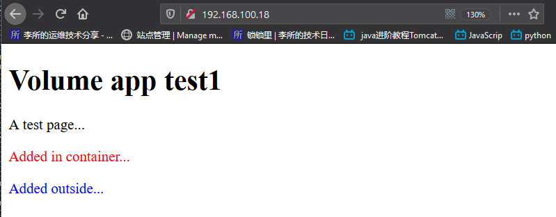

### 3.2.3 容器测试数据读写

```bash
root@ubuntu-suosuoli-node1:~# docker exec -it mout-file-test bash
[root@7c98e8ba3820 /]# vim /usr/local/nginx/html/index.html
<!DOCTYPE html>
<head>
    <h1>Volume app test1</h1>
  </head>
  <body>
  <p>A test page...</p>
  <font color="red"><p>Added in container...</p></font>
  <font color="blue"><p>Added outside...</p></font>

  <!--新增内容-->
  <font color="green"><p>Added for mount test...</p></font>

  </body>
</html>
```

### 3.2.5 访问 web 验证

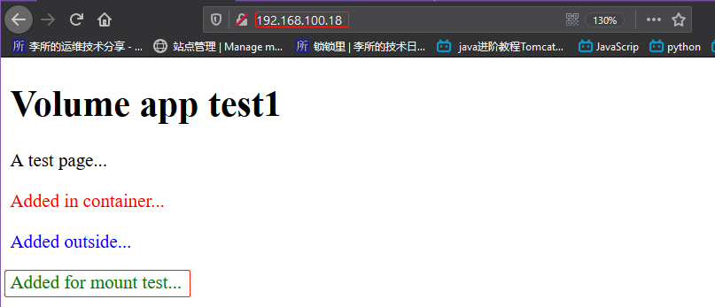

### 3.2.4 挂载多个目录

```bash
root@ubuntu-suosuoli-node1:~# docker run -it -d -p 88:80 --name muilt-test -v /data/app1/index.html:/usr/local/nginx/html/index1.html -v /data/app2/index.html:/usr/local/nginx/html/index2.html nginx:compiled_V1
ca593467768cc7cd8f4d2ecbbf478f1a1a857ddd4b82a069beaeccb969123820
root@ubuntu-suosuoli-node1:~# lsof -i:88
COMMAND      PID USER   FD   TYPE  DEVICE SIZE/OFF NODE NAME
docker-pr 119541 root    4u  IPv6 1510446      0t0  TCP *:kerberos (LISTEN)
```

### 3.2.5 验证 web 访问

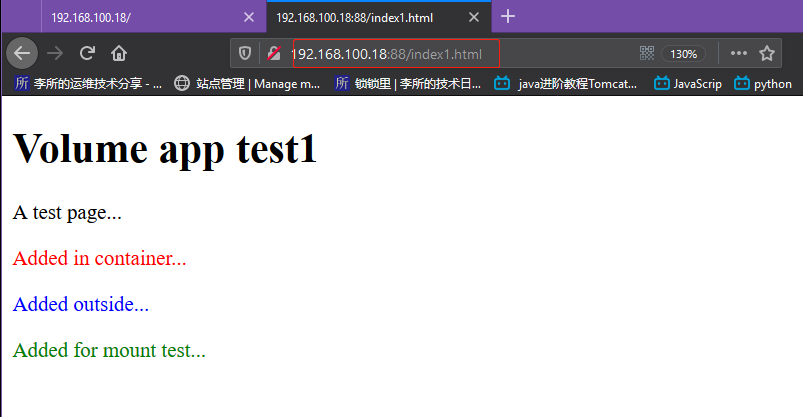

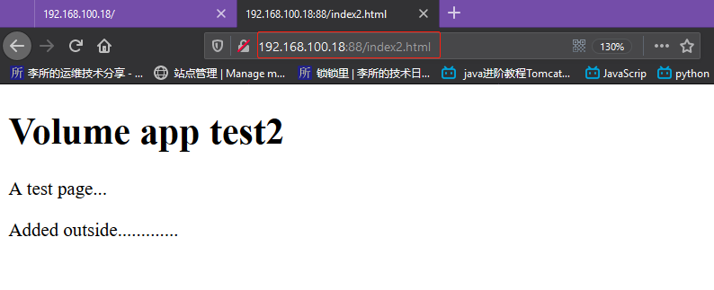

# 四. 使用数据卷容器(data volume container)

## 4.1 什么是数据卷容器?

数据卷容器可以让数据在多个 docker 容器之间共享，比如：创建一个 A
容器后即可以让 B 容器访问 A 容器的内容，而容器 C 也可以访问 A 容
器的内容，这个运行的容器 A 作为 Server，用于提供卷的挂载服务，这个
卷可以为其他容器提供数据存储服务，其他使用此卷的容器作为 client 端。

## 4.2 使用数据卷容器示例

### 4.2.1 启动数据卷容器(Server)

启动一个容器，挂载宿主机的数据目录：
将宿主机的 app1 和 app2 的 web 测试页面，分别挂载到数据卷容器 server
端，然后通过 server 端共享给 client 端使用。

```bash
root@ubuntu-suosuoli-node1:~# docker run -it -d --name volume-server -v /data/app1/:/usr/local/nginx/html/app1 -v /data/app2/:/usr/local/nginx/html/app2 nginx:compiled_V1
f171a60ad9582a905965173712c4842cf3d7dba134290ffab7af56934d268116
```

### 4.2.2 启动两个 client 容器

使用`--volumes-from`选项加数据卷容器的名称来指定挂载目录：

```bash
# 启动client1
root@ubuntu-suosuoli-node1:~# docker run -it -d -p 80:80 --name client1 --volumes-from volume-server nginx:compiled_V1
ef977b052a355191a0dbd1f3011ad26da3710bf6bf29fc4b34ac9884da945304

# 启动client2
root@ubuntu-suosuoli-node1:~# docker run -it -d -p 82:80 --name client2 --volumes-from volume-server nginx:compiled_V1
87d97fddfe6e87774a023bebc7bbdd67d3053798df2b5b4fce9d94cb4efd2936

root@ubuntu-suosuoli-node1:~# lsof -i:80,82
COMMAND      PID USER   FD   TYPE  DEVICE SIZE/OFF NODE NAME
docker-pr 120131 root    4u  IPv6 1514742      0t0  TCP *:http (LISTEN)
docker-pr 120299 root    4u  IPv6 1514096      0t0  TCP *:82 (LISTEN)

```

### 4.2.3 进入两个容器测试写数据

```bash
# client1
root@ubuntu-suosuoli-node1:~# docker exec -it client1 /bin/bash
[root@ef977b052a35 /]# cat "This is app1..." > /usr/local/nginx/html/app1/index.html
cat: This is app1...: No such file or directory
[root@ef977b052a35 /]# echo "This is app1..." > /usr/local/nginx/html/app1/index.html
[root@ef977b052a35 /]# exit
exit

# client2
root@ubuntu-suosuoli-node1:~# docker exec -it client2 /bin/bash
[root@87d97fddfe6e /]# echo "This is the app2..." > /usr/local/nginx/html/app2/index.html
[root@87d97fddfe6e /]# exit
exit
```

### 4.2.4 访问 web 测试页面

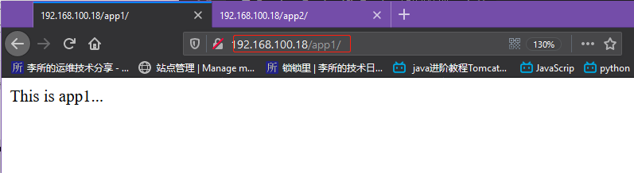

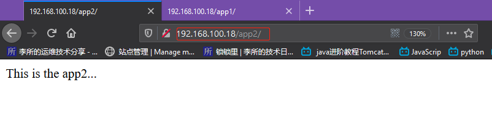

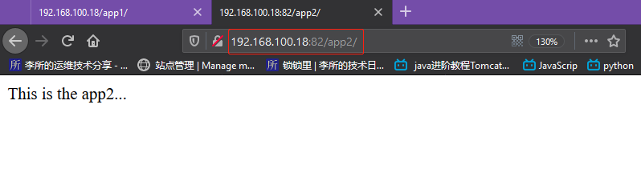

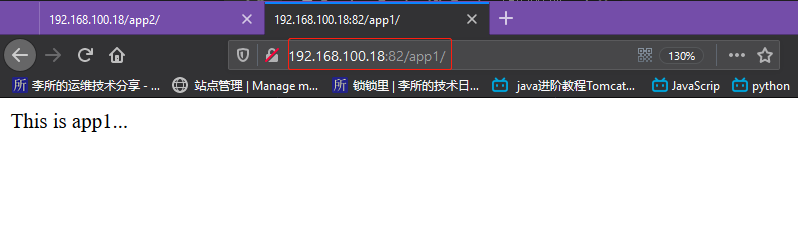

可以看出，所有的 client 都共享了`volume-server`挂载的数据卷。

### 4.2.5 查看宿主机数据是否改变

```bash
root@ubuntu-suosuoli-node1:~# cat /data/app1/index.html
This is app1...
root@ubuntu-suosuoli-node1:~# cat /data/app2/index.html
This is the app2...
```

可以看到数据改变

### 4.2.6 关闭 vulome-server 测试可否启动新容器

```bash
root@ubuntu-suosuoli-node1:~# docker ps
CONTAINER ID        IMAGE               COMMAND                  CREATED             STATUS              PORTS                         NAMES
87d97fddfe6e        nginx:compiled_V1   "nginx -g 'daemon of…"   14 minutes ago      Up 14 minutes       443/tcp, 0.0.0.0:82->80/tcp   client2
ef977b052a35        nginx:compiled_V1   "nginx -g 'daemon of…"   15 minutes ago      Up 15 minutes       0.0.0.0:80->80/tcp, 443/tcp   client1
f171a60ad958        nginx:compiled_V1   "nginx -g 'daemon of…"   18 minutes ago      Up 18 minutes       80/tcp, 443/tcp               volume-server

# 停止数据卷容器
root@ubuntu-suosuoli-node1:~# docker stop volume-server

# 创建新的挂载数据卷容器的数据卷的容器
root@ubuntu-suosuoli-node1:~# docker run -it -d -p 84:80 --name client3-with-stoped-server --volumes-from volume-server nginx:compiled_V1
46bfe3e8fb9dcd0c64ceb3873a3902b116b595dbaa57ce10978019a6cd01713d
root@ubuntu-suosuoli-node1:~# docker ps
CONTAINER ID        IMAGE               COMMAND                  CREATED             STATUS              PORTS                         NAMES
46bfe3e8fb9d        nginx:compiled_V1   "nginx -g 'daemon of…"   4 seconds ago       Up 3 seconds        443/tcp, 0.0.0.0:84->80/tcp   client3-with-stoped-server
87d97fddfe6e        nginx:compiled_V1   "nginx -g 'daemon of…"   15 minutes ago      Up 15 minutes       443/tcp, 0.0.0.0:82->80/tcp   client2
ef977b052a35        nginx:compiled_V1   "nginx -g 'daemon of…"   16 minutes ago      Up 16 minutes       0.0.0.0:80->80/tcp, 443/tcp   client1
```

可以看到，在 volume-server 停止后，任然可以使用该容器名来作为卷来源，访问测试:

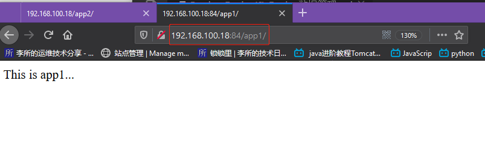

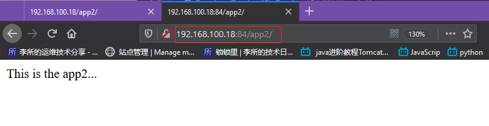

### 4.2.7 测试删除 volume-server 容器再创建新容器

```bash
# 删除卷server容器
root@ubuntu-suosuoli-node1:~# docker rm -fv volume-server
volume-server

# 尝试创建使用volume-server的容器
root@ubuntu-suosuoli-node1:~# docker run -it -d -p 86:80 --name client6 --volumes-from volume-server nginx:latest
Unable to find image 'nginx:latest' locally
latest: Pulling from library/nginx
Digest: sha256:ad5552c786f128e389a0263104ae39f3d3c7895579d45ae716f528185b36bc6f
Status: Image is up to date for nginx:latest
docker: Error response from daemon: No such container: volume-server. # 报错，没有该容器
See 'docker run --help'.
```

虽然 volume-server 被删除，但是之前创建的 client 不受影响:

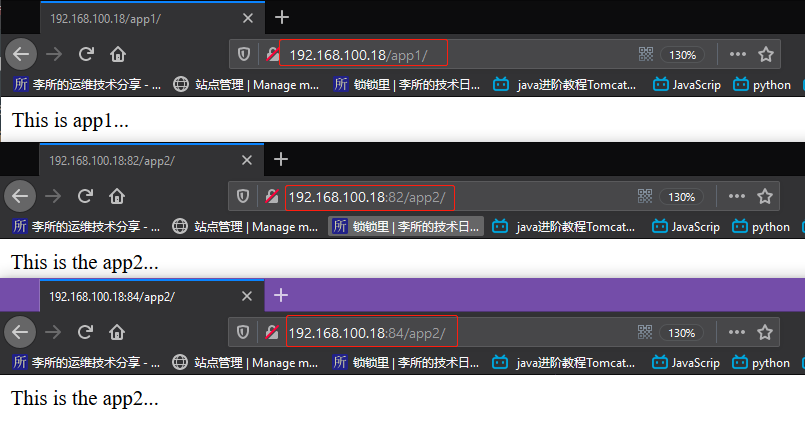

### 4.2.8 重新创建数据卷 server 容器再创建 client

```bash
root@ubuntu-suosuoli-node1:~# docker ps
CONTAINER ID        IMAGE               COMMAND                  CREATED             STATUS              PORTS                         NAMES
46bfe3e8fb9d        nginx:compiled_V1   "nginx -g 'daemon of…"   10 minutes ago      Up 10 minutes       443/tcp, 0.0.0.0:84->80/tcp   client3-with-stoped-server
87d97fddfe6e        nginx:compiled_V1   "nginx -g 'daemon of…"   26 minutes ago      Up 26 minutes       443/tcp, 0.0.0.0:82->80/tcp   client2
ef977b052a35        nginx:compiled_V1   "nginx -g 'daemon of…"   27 minutes ago      Up 27 minutes       0.0.0.0:80->80/tcp, 443/tcp   client1

# 重新创建server容器
root@ubuntu-suosuoli-node1:~# docker run -it -d --name volume-server -v /data/app1/:/usr/local/nginx/html/app1 -v /data/app2/:/usr/local/nginx/html/app2 nginx:compiled_V1
6e003aa25073612f3245d2efc19c963d43c775e498480fd56678c615e8b581c4

# 创建client
root@ubuntu-suosuoli-node1:~# docker run -it -d -p 86:80 --name client6 --volumes-from volume-server nginx:latest
34bdbc2c03aeccba4320c41dbc3d6363a161f823b42d190b4a60d136b78707a3
```

在当前环境下，即使把提供卷的容器 Server 删除，已经运行的容器 Client 依然
可以使用挂载的卷，因为容器是通过挂载访问数据的，但是无法创建新的卷容器
客户端，但是再把卷容器 Server 创建后即可正常创建卷容器 Client，此方式可以
用于线上共享数据目录等环境，因为即使数据卷容器被删除了，其他已经运行的
容器依然可以挂载使用。

数据卷容器可以作为共享的方式为其他容器提供文件共享，类似于 NFS 共享，
可以在生产中启动一个实例挂载本地的目录，然后其他的容器分别挂载此容器的
目录，即可保证各容器之间的数据一致性。
