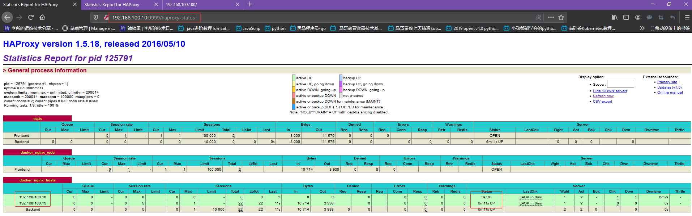
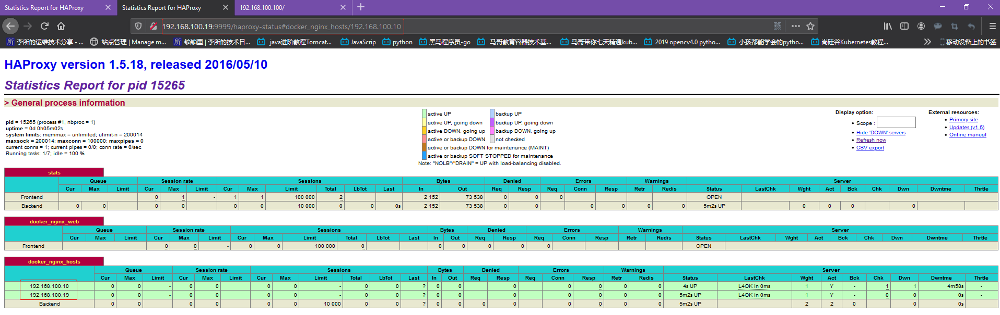

<h1><font face="黑体" color="grey">Docker 网络管理(1)-使用容器跑nginx并实现高可用</font></h1>

# 一. 安装配置 Keepalived

## 1.1 node1 安装 Keepalived

```bash
[root@docker-server-node1 ~]# yum install -y keepalived
[root@docker-server-node1 ~]# vim /etc/keepalived/keepalived.conf

vrrp_instance MAKE_VIP_INT {
    state MASTER
    interface eth0
    virtual_router_id 1
    priority 100
    advert_int 1
    unicast_src_ip 192.168.100.10
    unicast_peer {
        192.168.100.19
    }
authentication {
        auth_type PASS
        auth_pass stevenux
    }
    virtual_ipaddress {
        192.168.100.100/24 dev eth0 label eth0:1
    }
}

[root@docker-server-node1 ~]# systemctl start keepalived
[root@docker-server-node1 ~]# ip addr show eth0
2: eth0: <BROADCAST,MULTICAST,UP,LOWER_UP> mtu 1500 qdisc pfifo_fast state UP group default qlen 1000
    link/ether 00:0c:29:a2:04:ef brd ff:ff:ff:ff:ff:ff
    inet 192.168.100.10/24 brd 192.168.100.255 scope global noprefixroute dynamic eth0
       valid_lft 721511sec preferred_lft 721511sec
    inet 192.168.100.100/24 scope global secondary eth0:1
       valid_lft forever preferred_lft forever
    inet6 fe80::24bc:4ef9:7f2a:f1cc/64 scope link noprefixroute
       valid_lft forever preferred_lft forever
[root@docker-server-node1 ~]# systemctl enable keepalived
Created symlink from /etc/systemd/system/multi-user.target.wants/keepalived.service to /usr/lib/systemd/system/keepalived.service.
```

## 1.2 node2 安装 Keepalived

```bash
[root@docker-server-node2 ~]# yum install keepalived -y

[root@docker-server-node2 ~]# vim /etc/keepalived/keepalived.conf

vrrp_instance MAKE_VIP_INT {
    state MASTER
    interface eth0
    virtual_router_id 1
    priority 50
    advert_int 1
    unicast_src_ip 192.168.100.19
    unicast_peer {
        192.168.100.10
    }
authentication {
        auth_type PASS
        auth_pass stevenux
    }
    virtual_ipaddress {
        192.168.100.100/24 dev eth0 label eth0:1
    }
}

[root@docker-server-node2 ~]# systemctl start keepalived

[root@docker-server-node2 ~]# ip addr show eth0
2: eth0: <BROADCAST,MULTICAST,UP,LOWER_UP> mtu 1500 qdisc pfifo_fast state UP group default qlen 1000
    link/ether 00:0c:29:6f:8f:6a brd ff:ff:ff:ff:ff:ff
    inet 192.168.100.19/24 brd 192.168.100.255 scope global noprefixroute dynamic eth0
       valid_lft 721622sec preferred_lft 721622sec
    inet 192.168.100.100/24 scope global secondary eth0:1
       valid_lft forever preferred_lft forever
    inet6 fe80::ca0b:62e1:2c5e:8a90/64 scope link noprefixroute
       valid_lft forever preferred_lft forever
[root@docker-server-node2 ~]# systemctl enable keepalived
Created symlink from /etc/systemd/system/multi-user.target.wants/keepalived.service to /usr/lib/systemd/system/keepalived.service.
```

# 二. 安装配置 HAProxy

## 2.1 配置内核参数

```bash
[root@docker-server-node1 ~]# vim /etc/sysctl.conf
net.ipv4.ip_nonlocal_bind=1
...
[root@docker-server-node1 ~]# sysctl -p
net.ipv4.ip_nonlocal_bind = 1
...

[root@docker-server-node2 ~]# vim /etc/sysctl.conf
net.ipv4.ip_nonlocal_bind = 1
...
[root@docker-server-node2 ~]# sysctl -p
net.ipv4.ip_nonlocal_bind = 1
...
```

## 2.2 node1 安装 HAProxy

```bash
[root@docker-server-node1 ~]# yum install haproxy -y
[root@docker-server-node1 ~]# vim /etc/haproxy/haproxy.cfg'

[root@docker-server-node1 harbor]# cat /etc/haproxy/haproxy.cfg
global
    maxconn 100000
    uid 99
    gid 99
    daemon
    nbproc 1
    log 127.0.0.1 local0 info

defaults
    option http-keep-alive
    #option  forwardfor
    maxconn 100000
    mode tcp
    timeout connect 500000ms
    timeout client  500000ms
    timeout server  500000ms

listen stats
    mode http
    bind 0.0.0.0:9999
    stats enable
    log global
    stats uri     /haproxy-status
    stats auth    haadmin:stevenux

#================================================================
frontend docker_nginx_web
    bind 192.168.10.100:80
    mode http
    default_backend docker_nginx_hosts

backend docker_nginx_hosts
    mode http
    #balance source
    balance roundrobin
    server 192.168.100.10   192.168.100.10:81 check inter 2000 fall 3 rise 5
    server 192.168.100.19   192.168.100.19:81 check inter 2000 fall 3 rise 5

[root@docker-server-node1 ~]# systemctl start haproxy.service
[root@docker-server-node1 ~]# systemctl enable haproxy.service
Created symlink from /etc/systemd/system/multi-user.target.wants/haproxy.service to /usr/lib/systemd/system/haproxy.service.
[root@docker-server-node1 harbor]# lsof -i:80
COMMAND    PID   USER   FD   TYPE   DEVICE SIZE/OFF NODE NAME
haproxy 122872 nobody    6u  IPv4 15247661      0t0  TCP 192.168.10.100:http (LISTEN)

```

## 2.3 node2 安装 HAProxy

```bash
[root@docker-server-node2 ~]# yum install haproxy –y

[root@docker-server-node2 harbor]# cat /etc/haproxy/haproxy.cfg
global
    maxconn 100000
    uid 99
    gid 99
    daemon
    nbproc 1
    log 127.0.0.1 local0 info

defaults
    option http-keep-alive
    #option  forwardfor
    maxconn 100000
    mode tcp
    timeout connect 500000ms
    timeout client  500000ms
    timeout server  500000ms

listen stats
    mode http
    bind 0.0.0.0:9999
    stats enable
    log global
    stats uri     /haproxy-status
    stats auth    haadmin:stevenux

#================================================================
frontend docker_nginx_web
    bind 192.168.100.100:80
    mode http
    default_backend docker_nginx_hosts

backend docker_nginx_hosts
    mode http
    #balance source
    balance roundrobin
    server 192.168.100.10   192.168.100.10:81 check inter 2000 fall 3 rise 5
    server 192.168.100.19   192.168.100.19:81 check inter 2000 fall 3 rise 5

[root@docker-server-node2 ~]# systemctl start haproxy.service
[root@docker-server-node2 ~]# systemctl enable haproxy.service
Created symlink from /etc/systemd/system/multi-user.target.wants/haproxy.service to /usr/lib/systemd/system/haproxy.service.
[root@docker-server-node2 harbor]# lsof -i:80
COMMAND   PID   USER   FD   TYPE   DEVICE SIZE/OFF NODE NAME
haproxy 13295 nobody    6u  IPv4 15301417      0t0  TCP 192.168.100.100:http (LISTEN)

```

# 三. 启动 nginx 容器并验证

## 3.1 编写 node1 的 nginx 页面

```bash
[root@docker-server-node1 harbor]# mkdir /data/nginx1/
[root@docker-server-node1 harbor]# vim /data/nginx1/index.html
<DOCTYPE HTML>
<head>
<h1>Messages<h1>
</head>
<body>
<p>This is a test message from node1.</p>
</body>

```

## 3.2 编写 node2 的 nginx 页面

```bash
[root@docker-server-node2 harbor]# mkdir /data/nginx2
[root@docker-server-node2 harbor]# vim /data/nginx2index.html

<DOCTYPE HTML>
<head>
<h1>Messages<h1>
</head>
<body>
<p>This is a test message from node2.</p>
</body>
```

## 3.3 node1 启动 nginx 容器并访问

```bash
[root@docker-server-node1 harbor]# docker run -it -d -p 82:80 --name nginx-node1 -v /data/nginx1/index.html:/usr/local/nginx/html/index.html nginx:compiled_V1
b422b9569516209549f92a82ce422b30fcb0440340df6b13c31ec097e2fc35c0
[root@docker-server-node1 harbor]# lsof -i:82
COMMAND      PID USER   FD   TYPE   DEVICE SIZE/OFF NODE NAME
docker-pr 125323 root    4u  IPv6 15271492      0t0  TCP *:xfer (LISTEN)
```


## 3.4 node2 启动 nginx 容器并访问

```bash
[root@docker-server-node2 ~]# docker run -it -d -p 82:80 --name nginx-node2 -v /data/nginx2/index.html:/usr/local/nginx/html/index.html nginx:compiled_V1
930bc5f3b322d78ac12002aed42e4a356fd8c1975f0b0dd5108e7b9ced0489cd
[root@docker-server-node2 ~]# lsof -i:82
COMMAND     PID USER   FD   TYPE   DEVICE SIZE/OFF NODE NAME
docker-pr 15025 root    4u  IPv6 15318881      0t0  TCP *:xfer (LISTEN)
```


## 3.5 访问 VIP

```bash
# node1情况，VIP目前在node1上
[root@docker-server-node1 ~]# lsof -i:80
COMMAND    PID   USER   FD   TYPE   DEVICE SIZE/OFF NODE NAME
haproxy 125791 nobody    1u  IPv4 15279077      0t0  TCP docker-server-node1:http->192.168.100.1:64693 (ESTABLISHED)
haproxy 125791 nobody    6u  IPv4 15276572      0t0  TCP docker-server-node1:http (LISTEN)
[root@docker-server-node1 ~]# ip addr show eth0
2: eth0: <BROADCAST,MULTICAST,UP,LOWER_UP> mtu 1500 qdisc pfifo_fast state UP group default qlen 1000
    link/ether 00:0c:29:a2:04:ef brd ff:ff:ff:ff:ff:ff
    inet 192.168.100.10/24 brd 192.168.100.255 scope global noprefixroute dynamic eth0
       valid_lft 713889sec preferred_lft 713889sec
    inet 192.168.100.100/24 scope global secondary eth0:1
       valid_lft forever preferred_lft forever
    inet6 fe80::24bc:4ef9:7f2a:f1cc/64 scope link noprefixroute
       valid_lft forever preferred_lft forever

# node2 情况
[root@docker-server-node2 ~]# lsof -i:80
COMMAND   PID   USER   FD   TYPE   DEVICE SIZE/OFF NODE NAME
haproxy 15265 nobody    6u  IPv4 15324226      0t0  TCP 192.168.100.100:http (LISTEN)
[root@docker-server-node2 ~]# ip addr show eth0
2: eth0: <BROADCAST,MULTICAST,UP,LOWER_UP> mtu 1500 qdisc pfifo_fast state UP group default qlen 1000
    link/ether 00:0c:29:6f:8f:6a brd ff:ff:ff:ff:ff:ff
    inet 192.168.100.19/24 brd 192.168.100.255 scope global noprefixroute dynamic eth0
       valid_lft 713909sec preferred_lft 713909sec
    inet6 fe80::ca0b:62e1:2c5e:8a90/64 scope link noprefixroute
       valid_lft forever preferred_lft forever
```

访问`http://192.160.100.100/`


访问 VIP 的流量被 Keepalived 定向到 node1，node1 的 haproxy 默认是轮询调度，
所以刷新后会显示另一个 nginx 容器页面:


## 3.6 访问 node1-haproxy 状态页



## 3.7 访问 node2-haproxy 状态页


