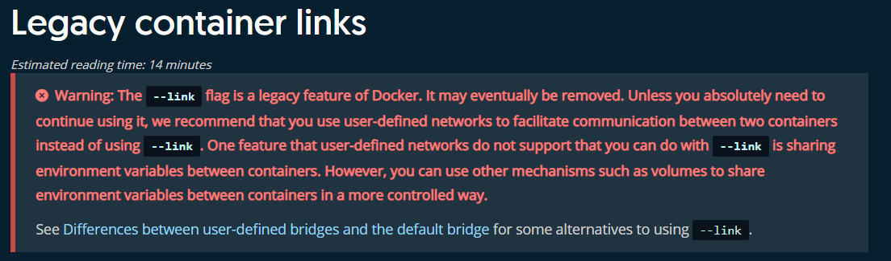

<h1><font face="黑体" color="grey">Docker 网络管理(2)-容器间的互联</font></h1>

Docker 提供了使用容器的名称来相互通讯的功能，即在同一个宿主机上的容器之间
可以通过自定义的容器名称相互访问，比如一个业务前端静态页面是使用 nginx，动
态页面使用的是 tomcat，由于容器在启动的时候其内部 IP 地址是 DHCP 随机分配
的，所以如果通过内部访问的话，自定义名称是相对比较固定的，因此比较适用于此
场景。

实质上两个容器之间的互联是 Dcoker 通过共享容器的环境变量和向`/etc/hosts`
文件中新增条目实现的。比如:容器 A (为一个 web 服务容器)想要和 B(为数据库容
器名为 db )通讯，那么实际是先创建 B 容器，并给 B 指明一个容器名称。在创建
A 时使用`--link`选项来应用 B 容器的环境变量及将 B 的 IP 和对于关系添加进 A
容器的`/etc/hosts`文件中，这样容器 A 就可以访问容器 B 了，而且容器 B 可以
不向外部暴露任何端口，因为 A 提供的是数据库服务，而容器 A 需要数据库服务，
这时只需将容器 A 提供的 web 服务暴露端口就行。另外，如 nginx 和 tomcat 的
关系也可以使用类似的通讯方式，nginx 暴露端口，而 tomcat 不需要。

只不过，在 Dcoker 提供了 bridge 网络和自定义容器网络后，官方已不建议
继续使用`--link`的方式实现容器之间互联。[说明](https://docs.docker.com/network/links/)



# 一. 通过容器名称互联

## 1.1 启动一个 tomcat 容器

```bash
root@ubuntu-suosuoli-node1:~# docker images
REPOSITORY                              TAG                 IMAGE ID            CREATED             SIZE
tomcat-business                         app2                b36c6d580d28        6 days ago          947MB
tomcat-business                         app1                4c2f165d813b        6 days ago          947MB
......

root@ubuntu-suosuoli-node1:~# docker run -it -d --name tomcat-link-source tomcat-business:app1
ae52558d209522d73df4006b8ca9de5b54699d094bae933c2422b3cfd7c94125

root@ubuntu-suosuoli-node1:~# docker ps
CONTAINER ID        IMAGE                  COMMAND                  CREATED             STATUS              PORTS                          NAMES
ae52558d2095        tomcat-business:app1   "/apps/tomcat/bin/ru…"   4 seconds ago       Up 3 seconds        8005/tcp, 8009/tcp, 8080/tcp   tomcat-link-source
```

## 1.2 查看 hosts 文件内容

```bash
root@ubuntu-suosuoli-node1:~# docker ps
CONTAINER ID        IMAGE                  COMMAND                  CREATED              STATUS              PORTS                          NAMES
ae52558d2095        tomcat-business:app1   "/apps/tomcat/bin/ru…"   About a minute ago   Up About a minute   8005/tcp, 8009/tcp, 8080/tcp   tomcat-link-source
root@ubuntu-suosuoli-node1:~# docker exec -it tomcat-link-source /bin/bash
[root@ae52558d2095 /]# ip addr show eth0
4: eth0@if5: <BROADCAST,MULTICAST,UP,LOWER_UP> mtu 1500 qdisc noqueue state UP group default
    link/ether 02:42:ac:11:00:02 brd ff:ff:ff:ff:ff:ff link-netnsid 0
    inet 172.17.0.2/16 brd 172.17.255.255 scope global eth0  # 该容器在默认的bridge网络获取的地址
       valid_lft forever preferred_lft forever
[root@ae52558d2095 /]# cat /etc/hosts
127.0.0.1	localhost
::1	localhost ip6-localhost ip6-loopback
fe00::0	ip6-localnet
ff00::0	ip6-mcastprefix
ff02::1	ip6-allnodes
ff02::2	ip6-allrouters
172.17.0.2	ae52558d2095  # tomcat容器本身的IP和主机名被放在自己的hosts文件中
                          # 这样，tomcat就可以解析自己的主机名

[root@ae52558d2095 /]# exit
exit
```

## 1.3 启动一个 nginx 容器并连接 tomcat 容器

```bash
root@ubuntu-suosuoli-node1:~# docker run -it -dd -p 80:80 --name nginx-link-tomcat --link tomcat-link-source nginx-ubunt:v1
44517f04e7552fd752d06786f0b93e5feffba471f5c3e712a1e83bb1325f6883
root@ubuntu-suosuoli-node1:~# lsof -i:80
COMMAND    PID USER   FD   TYPE DEVICE SIZE/OFF NODE NAME
docker-pr 3988 root    4u  IPv6  67860      0t0  TCP *:http (LISTEN)
```

## 1.4 查看 hosts 文件内容

```bash
root@ubuntu-suosuoli-node1:~# docker ps
CONTAINER ID        IMAGE                  COMMAND                  CREATED             STATUS              PORTS                          NAMES
44517f04e755        nginx-ubunt:v1         "nginx"                  30 seconds ago      Up 29 seconds       0.0.0.0:80->80/tcp, 443/tcp    nginx-link-tomcat
ae52558d2095        tomcat-business:app1   "/apps/tomcat/bin/ru…"   8 minutes ago       Up 8 minutes        8005/tcp, 8009/tcp, 8080/tcp   tomcat-link-source

root@ubuntu-suosuoli-node1:~# docker exec -it nginx-link-tomcat /bin/bash

root@44517f04e755:/# cat /etc/hosts
127.0.0.1	localhost
::1	localhost ip6-localhost ip6-loopback
fe00::0	ip6-localnet
ff00::0	ip6-mcastprefix
ff02::1	ip6-allnodes
ff02::2	ip6-allrouters
172.17.0.2	tomcat-link-source ae52558d2095 # tomcat的IP和主机名解析条目
172.17.0.3	44517f04e755  # nginx容器自己的条目
```

## 1.6 查看 env

查看两个容器的环境变量情况:

1. tomcat 容器(172.17.0.2)

```bash
root@ubuntu-suosuoli-node1:~# docker ps
CONTAINER ID        IMAGE                  COMMAND                  CREATED             STATUS              PORTS                          NAMES
44517f04e755        nginx-ubunt:v1         "nginx"                  5 minutes ago       Up 5 minutes        0.0.0.0:80->80/tcp, 443/tcp    nginx-link-tomcat
ae52558d2095        tomcat-business:app1   "/apps/tomcat/bin/ru…"   13 minutes ago      Up 13 minutes       8005/tcp, 8009/tcp, 8080/tcp   tomcat-link-source
root@ubuntu-suosuoli-node1:~# docker exec -it tomcat-link-source /bin/bash

[root@ae52558d2095 /]# ip addr show eth0 | grep inet
    inet 172.17.0.2/16 brd 172.17.255.255 scope global eth0

[root@ae52558d2095 /]# env
HOSTNAME=ae52558d2095
TERM=xterm
CATALINA_HOME=/apps/tomcat
TOMCAT_MAJOR_VERSION=8
JRE_HOME=/usr/local/jdk/jre
LS_COLORS=rs=0:di=01;34:ln=01;36:mh=00:pi=40;33:so=01;35:do=01;35:bd=40;33;01:cd=40;33;01:or=40;31;01:mi=01;05;37;41:su=37;41:sg=30;43:ca=30;41:tw=30;42:ow=34;42:st=37;44:ex=01;32:*.tar=01;31:*.tgz=01;31:*.arc=01;31:*.arj=01;31:*.taz=01;31:*.lha=01;31:*.lz4=01;31:*.lzh=01;31:*.lzma=01;31:*.tlz=01;31:*.txz=01;31:*.tzo=01;31:*.t7z=01;31:*.zip=01;31:*.z=01;31:*.Z=01;31:*.dz=01;31:*.gz=01;31:*.lrz=01;31:*.lz=01;31:*.lzo=01;31:*.xz=01;31:*.bz2=01;31:*.bz=01;31:*.tbz=01;31:*.tbz2=01;31:*.tz=01;31:*.deb=01;31:*.rpm=01;31:*.jar=01;31:*.war=01;31:*.ear=01;31:*.sar=01;31:*.rar=01;31:*.alz=01;31:*.ace=01;31:*.zoo=01;31:*.cpio=01;31:*.7z=01;31:*.rz=01;31:*.cab=01;31:*.jpg=01;35:*.jpeg=01;35:*.gif=01;35:*.bmp=01;35:*.pbm=01;35:*.pgm=01;35:*.ppm=01;35:*.tga=01;35:*.xbm=01;35:*.xpm=01;35:*.tif=01;35:*.tiff=01;35:*.png=01;35:*.svg=01;35:*.svgz=01;35:*.mng=01;35:*.pcx=01;35:*.mov=01;35:*.mpg=01;35:*.mpeg=01;35:*.m2v=01;35:*.mkv=01;35:*.webm=01;35:*.ogm=01;35:*.mp4=01;35:*.m4v=01;35:*.mp4v=01;35:*.vob=01;35:*.qt=01;35:*.nuv=01;35:*.wmv=01;35:*.asf=01;35:*.rm=01;35:*.rmvb=01;35:*.flc=01;35:*.avi=01;35:*.fli=01;35:*.flv=01;35:*.gl=01;35:*.dl=01;35:*.xcf=01;35:*.xwd=01;35:*.yuv=01;35:*.cgm=01;35:*.emf=01;35:*.axv=01;35:*.anx=01;35:*.ogv=01;35:*.ogx=01;35:*.aac=01;36:*.au=01;36:*.flac=01;36:*.mid=01;36:*.midi=01;36:*.mka=01;36:*.mp3=01;36:*.mpc=01;36:*.ogg=01;36:*.ra=01;36:*.wav=01;36:*.axa=01;36:*.oga=01;36:*.spx=01;36:*.xspf=01;36:
PATH=/usr/local/sbin:/usr/local/bin:/usr/sbin:/usr/bin:/sbin:/bin:/usr/local/jdk/bin
PWD=/
APP_DIR=/apps/tomcat/webapps
JAVA_HOME=/usr/local/jdk
LANG=en_US.UTF-8
TZ=Asia/Shanghai
SHLVL=1
HOME=/root
CLASSPATH=/usr/local/jdk/lib:/usr/local/jdk/jre/lib
TOMCAT_MINOR_VERSION=5.42
_=/usr/bin/env
```

可以看到 tomcat 的环境变量只是记录了必要的 jdk 环境变量。

2. nginx 容器(172.17.0.3)

```bash
root@ubuntu-suosuoli-node1:~# docker exec -it nginx-link-tomcat /bin/bash

root@44517f04e755:/# ip addr show eth0 | grep inet
    inet 172.17.0.3/16 brd 172.17.255.255 scope global eth0

root@44517f04e755:/# env
LS_COLORS=rs=0:di=01;34:ln=01;36:mh=00:pi=40;33:so=01;35:do=01;35:bd=40;33;01:cd=40;33;01:or=40;31;01:mi=00:su=37;41:sg=30;43:ca=30;41:tw=30;42:ow=34;42:st=37;44:ex=01;32:*.tar=01;31:*.tgz=01;31:*.arc=01;31:*.arj=01;31:*.taz=01;31:*.lha=01;31:*.lz4=01;31:*.lzh=01;31:*.lzma=01;31:*.tlz=01;31:*.txz=01;31:*.tzo=01;31:*.t7z=01;31:*.zip=01;31:*.z=01;31:*.Z=01;31:*.dz=01;31:*.gz=01;31:*.lrz=01;31:*.lz=01;31:*.lzo=01;31:*.xz=01;31:*.zst=01;31:*.tzst=01;31:*.bz2=01;31:*.bz=01;31:*.tbz=01;31:*.tbz2=01;31:*.tz=01;31:*.deb=01;31:*.rpm=01;31:*.jar=01;31:*.war=01;31:*.ear=01;31:*.sar=01;31:*.rar=01;31:*.alz=01;31:*.ace=01;31:*.zoo=01;31:*.cpio=01;31:*.7z=01;31:*.rz=01;31:*.cab=01;31:*.wim=01;31:*.swm=01;31:*.dwm=01;31:*.esd=01;31:*.jpg=01;35:*.jpeg=01;35:*.mjpg=01;35:*.mjpeg=01;35:*.gif=01;35:*.bmp=01;35:*.pbm=01;35:*.pgm=01;35:*.ppm=01;35:*.tga=01;35:*.xbm=01;35:*.xpm=01;35:*.tif=01;35:*.tiff=01;35:*.png=01;35:*.svg=01;35:*.svgz=01;35:*.mng=01;35:*.pcx=01;35:*.mov=01;35:*.mpg=01;35:*.mpeg=01;35:*.m2v=01;35:*.mkv=01;35:*.webm=01;35:*.ogm=01;35:*.mp4=01;35:*.m4v=01;35:*.mp4v=01;35:*.vob=01;35:*.qt=01;35:*.nuv=01;35:*.wmv=01;35:*.asf=01;35:*.rm=01;35:*.rmvb=01;35:*.flc=01;35:*.avi=01;35:*.fli=01;35:*.flv=01;35:*.gl=01;35:*.dl=01;35:*.xcf=01;35:*.xwd=01;35:*.yuv=01;35:*.cgm=01;35:*.emf=01;35:*.ogv=01;35:*.ogx=01;35:*.aac=00;36:*.au=00;36:*.flac=00;36:*.m4a=00;36:*.mid=00;36:*.midi=00;36:*.mka=00;36:*.mp3=00;36:*.mpc=00;36:*.ogg=00;36:*.ra=00;36:*.wav=00;36:*.oga=00;36:*.opus=00;36:*.spx=00;36:*.xspf=00;36:
TOMCAT_LINK_SOURCE_PORT_8080_TCP_PORT=8080
HOSTNAME=44517f04e755
TOMCAT_LINK_SOURCE_PORT_8005_TCP_PROTO=tcp
TOMCAT_LINK_SOURCE_ENV_TOMCAT_MINOR_VERSION=5.42
TOMCAT_LINK_SOURCE_ENV_CATALINA_HOME=/apps/tomcat
TOMCAT_LINK_SOURCE_PORT_8009_TCP_PORT=8009
TOMCAT_LINK_SOURCE_ENV_TOMCAT_MAJOR_VERSION=8
PWD=/
TOMCAT_LINK_SOURCE_PORT_8080_TCP_ADDR=172.17.0.2
TOMCAT_LINK_SOURCE_PORT_8080_TCP_PROTO=tcp
TOMCAT_LINK_SOURCE_ENV_APP_DIR=/apps/tomcat/webapps
HOME=/root
TOMCAT_LINK_SOURCE_ENV_JRE_HOME=/usr/local/jdk/jre
TOMCAT_LINK_SOURCE_PORT_8009_TCP=tcp://172.17.0.2:8009
TOMCAT_LINK_SOURCE_PORT_8005_TCP_ADDR=172.17.0.2
TOMCAT_LINK_SOURCE_ENV_JAVA_HOME=/usr/local/jdk
TOMCAT_LINK_SOURCE_PORT_8005_TCP=tcp://172.17.0.2:8005
TOMCAT_LINK_SOURCE_PORT=tcp://172.17.0.2:8005
TOMCAT_LINK_SOURCE_PORT_8009_TCP_PROTO=tcp
TOMCAT_LINK_SOURCE_PORT_8080_TCP=tcp://172.17.0.2:8080
TERM=xterm
TOMCAT_LINK_SOURCE_PORT_8009_TCP_ADDR=172.17.0.2
TOMCAT_LINK_SOURCE_NAME=/nginx-link-tomcat/tomcat-link-source
SHLVL=1
TOMCAT_LINK_SOURCE_PORT_8005_TCP_PORT=8005
TOMCAT_LINK_SOURCE_ENV_TZ=Asia/Shanghai
TOMCAT_LINK_SOURCE_ENV_CLASSPATH=/usr/local/jdk/lib:/usr/local/jdk/jre/lib
TOMCAT_LINK_SOURCE_ENV_LANG=en_US.UTF-8
PATH=/usr/local/sbin:/usr/local/bin:/usr/sbin:/usr/bin:/sbin:/bin
_=/usr/bin/env

root@44517f04e755:/# exit
exit
```

可以看到 nginx 容器中记录了很多关于 tomcat 容器的信息的环境变量。

```bash
TOMCAT_LINK_SOURCE_PORT_8080_TCP_PORT=8080
HOSTNAME=44517f04e755
TOMCAT_LINK_SOURCE_PORT_8005_TCP_PROTO=tcp
TOMCAT_LINK_SOURCE_ENV_TOMCAT_MINOR_VERSION=5.42
TOMCAT_LINK_SOURCE_ENV_CATALINA_HOME=/apps/tomcat
TOMCAT_LINK_SOURCE_PORT_8009_TCP_PORT=8009
TOMCAT_LINK_SOURCE_ENV_TOMCAT_MAJOR_VERSION=8
PWD=/
TOMCAT_LINK_SOURCE_PORT_8080_TCP_ADDR=172.17.0.2
TOMCAT_LINK_SOURCE_PORT_8080_TCP_PROTO=tcp
TOMCAT_LINK_SOURCE_ENV_APP_DIR=/apps/tomcat/webapps
HOME=/root
TOMCAT_LINK_SOURCE_ENV_JRE_HOME=/usr/local/jdk/jre
TOMCAT_LINK_SOURCE_PORT_8009_TCP=tcp://172.17.0.2:8009
TOMCAT_LINK_SOURCE_PORT_8005_TCP_ADDR=172.17.0.2
TOMCAT_LINK_SOURCE_ENV_JAVA_HOME=/usr/local/jdk
TOMCAT_LINK_SOURCE_PORT_8005_TCP=tcp://172.17.0.2:8005
TOMCAT_LINK_SOURCE_PORT=tcp://172.17.0.2:8005
TOMCAT_LINK_SOURCE_PORT_8009_TCP_PROTO=tcp
TOMCAT_LINK_SOURCE_PORT_8080_TCP=tcp://172.17.0.2:8080
TERM=xterm
TOMCAT_LINK_SOURCE_PORT_8009_TCP_ADDR=172.17.0.2
TOMCAT_LINK_SOURCE_NAME=/nginx-link-tomcat/tomcat-link-source
SHLVL=1
TOMCAT_LINK_SOURCE_PORT_8005_TCP_PORT=8005
TOMCAT_LINK_SOURCE_ENV_TZ=Asia/Shanghai
TOMCAT_LINK_SOURCE_ENV_CLASSPATH=/usr/local/jdk/lib:/usr/local/jdk/jre/lib
TOMCAT_LINK_SOURCE_ENV_LANG=en_US.UTF-8
```

## 1.5 测试通讯

```bash
root@44517f04e755:/# ping tomcat-link-source
bash: ping: command not found
root@44517f04e755:/# cat /etc/issue
Ubuntu 18.04.3 LTS \n \l

root@44517f04e755:/# apt update
root@44517f04e755:/# apt install -y inetutils-ping

root@44517f04e755:/# ping tomcat-link-source  # 使用tomcat容器名称ping测试
PING tomcat-link-source (172.17.0.2): 56 data bytes
64 bytes from 172.17.0.2: icmp_seq=0 ttl=64 time=0.058 ms
64 bytes from 172.17.0.2: icmp_seq=1 ttl=64 time=0.052 ms
^C--- tomcat-link-source ping statistics ---
2 packets transmitted, 2 packets received, 0% packet loss
round-trip min/avg/max/stddev = 0.052/0.055/0.058/0.000 ms

root@44517f04e755:/# ping ae52558d2095 # 使用tomcat容器主机名ping测试
PING tomcat-link-source (172.17.0.2): 56 data bytes
64 bytes from 172.17.0.2: icmp_seq=0 ttl=64 time=0.047 ms
64 bytes from 172.17.0.2: icmp_seq=1 ttl=64 time=0.052 ms
^C--- tomcat-link-source ping statistics ---
2 packets transmitted, 2 packets received, 0% packet loss
round-trip min/avg/max/stddev = 0.047/0.050/0.052/0.000 ms

```

# 二. 通过自定义的容器别名互联

在自定义的容器名称通讯中，自定义的容器名称可能会发生变化，那么一旦名
称发生变化，程序源代码也要随之发生变化，比如程序通过容器名称进行服务
调用，但是容器名称发生变化之后再使用之前的名称肯定是无法成功调用，每
次都进行更改的话又比较麻烦，因此可以使用自定义别名的方式解决，即容器
名称可以随意更，只要不更改别名即可，命令格式：

```bash
docker run -d --name 新容器名称 --link 目标容器名称:目标容器自定义的名称 -p 本地端口:容器端口 镜像名称 shell 命令
```

## 2.1 启动第三个容器(nginx)并连接 tomcat

连接 tomcat 容器的同时给它取个别名叫 tom

```bash
# --link NAME:ALIAS
root@ubuntu-suosuoli-node1:~# docker run -it -d -p 82:80 --name nginx-link-tomcat-alias --link tomcat-link-source:tom nginx-ubunt:v1
e43e83eb5e112e6d65b65d4e9527977a45f8a343e11169cb8adf199b8104f15b

root@ubuntu-suosuoli-node1:~# lsof -i:82
COMMAND    PID USER   FD   TYPE DEVICE SIZE/OFF NODE NAME
docker-pr 4751 root    4u  IPv6  83535      0t0  TCP *:82 (LISTEN)
```

## 2.2 查看 hosts 文件内容

```bash
root@ubuntu-suosuoli-node1:~# docker ps
CONTAINER ID        IMAGE                  COMMAND                  CREATED             STATUS              PORTS                          NAMES
e43e83eb5e11        nginx-ubunt:v1         "nginx"                  2 minutes ago       Up 2 minutes        443/tcp, 0.0.0.0:82->80/tcp    nginx-link-tomcat-alias
44517f04e755        nginx-ubunt:v1         "nginx"                  18 minutes ago      Up 18 minutes       0.0.0.0:80->80/tcp, 443/tcp    nginx-link-tomcat
ae52558d2095        tomcat-business:app1   "/apps/tomcat/bin/ru…"   26 minutes ago      Up 26 minutes       8005/tcp, 8009/tcp, 8080/tcp   tomcat-link-source

root@ubuntu-suosuoli-node1:~# docker exec -it nginx-link-tomcat-alias /bin/bash
root@e43e83eb5e11:/# cat /etc/hosts
127.0.0.1	localhost
::1	localhost ip6-localhost ip6-loopback
fe00::0	ip6-localnet
ff00::0	ip6-mcastprefix
ff02::1	ip6-allnodes
ff02::2	ip6-allrouters
172.17.0.2	tom ae52558d2095 tomcat-link-source  # tomcat容器的解析条目，tom为别名
172.17.0.4	e43e83eb5e11  # nginx自己的解析条目
```

可以看到 tom 这一别名也被新启动的 nginx 容器加到 hosts 解析条目中，
这样的话，后期业务变更后，可能 tomcat 的容器名称`tomcat-link-source`
可以变更，而别名任然使用 tom 就可以保证 nginx 容器和 tomcat 容器的联通性。

## 2.3 检查自定义别名通讯情况

```bash
root@e43e83eb5e11:/# ping
bash: ping: command not found
root@e43e83eb5e11:/# apt update
root@e43e83eb5e11:/# apt install -y inetutils-ping

root@e43e83eb5e11:/# ping tom
PING tom (172.17.0.2): 56 data bytes
64 bytes from 172.17.0.2: icmp_seq=0 ttl=64 time=0.076 ms
64 bytes from 172.17.0.2: icmp_seq=1 ttl=64 time=0.053 ms
^C--- tom ping statistics ---
2 packets transmitted, 2 packets received, 0% packet loss
round-trip min/avg/max/stddev = 0.053/0.065/0.076/0.000 ms

root@e43e83eb5e11:/# ping ae52558d2095
PING tom (172.17.0.2): 56 data bytes
64 bytes from 172.17.0.2: icmp_seq=0 ttl=64 time=0.058 ms
64 bytes from 172.17.0.2: icmp_seq=1 ttl=64 time=0.065 ms
^C--- tom ping statistics ---
2 packets transmitted, 2 packets received, 0% packet loss
round-trip min/avg/max/stddev = 0.058/0.061/0.065/0.000 ms

root@e43e83eb5e11:/# ping tomcat-link-source
PING tom (172.17.0.2): 56 data bytes
64 bytes from 172.17.0.2: icmp_seq=0 ttl=64 time=0.046 ms
64 bytes from 172.17.0.2: icmp_seq=1 ttl=64 time=0.052 ms
^C--- tom ping statistics ---
2 packets transmitted, 2 packets received, 0% packet loss
round-trip min/avg/max/stddev = 0.046/0.049/0.052/0.000 ms
```
