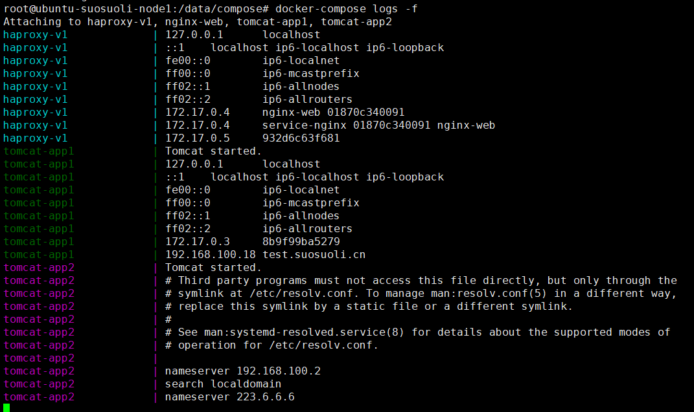

<h1><font face="黑体" color="grey">Docker之旅(8)-单机编排docker compose</font></h1>

当在宿主机启动较多的容器时候，如果都是手动操作会觉得比较麻烦而且容易出错，
并且每个容器之间也会有先后启动的顺序依赖等。这个时候推荐使用 docker 单机
编排工具 `docker-compose`，`docker-compose` 是 docker 容器的一种单机编排服务，
docker-compose 是一个管理多个容器的工具，比如可以解决容器之间的依赖关系，
就像启动一个 nginx 前端服务的时候会调用后端的 tomcat，那就得先启动 tomcat，
但是启动 tomcat 容器还需要依赖数据库，那就还得先启动数据库，docker-compose
就可以解决这样的嵌套依赖关系，其完全可以替代 docker run 对容器进行创建、启动
和停止。

`docker-compose` 项目是 Docker 官方的开源项目，负责实现对 Docker 容器集群的快
速编排，docker-compose 将所管理的容器分为三层，分别是工程(project)，服务
(service)及容器(container)。

docker-compose 是一个用于定义和运行多个容器 Docker 应用程序的工具。使用
Compose，可以使用 YAML 文件来配置应用程序的服务。然后，使用一个命令，从
配置中创建并启动所有服务。所以在使用 docker-compose 时编写比较规范的`.yaml`
或则`.yml` 文件是比较重要的。Compose 文件就是一个 YAML 文件，用其来定义
服务、网络和数据卷等。`docker-compose` 默认会在当前目录找该文件，即
`./docker-compose.yml`。

[Docker-compose 项目地址](https://github.com/docker/compose)

`docker-compose.yaml` 文件示例:

```yaml
version: "3.7"
services:
  redis:
    image: redis:alpine
    ports:
      - "6379"
    networks:
      - frontend
    deploy:
      replicas: 2
      update_config:
        parallelism: 2
        delay: 10s
      restart_policy:
        condition: on-failure

  db:
    image: postgres:9.4
    volumes:
      - db-data:/var/lib/postgresql/data
    networks:
      - backend
    deploy:
      placement:
        constraints: [node.role == manager]

  vote:
    image: dockersamples/examplevotingapp_vote:before
    ports:
      - "5000:80"
    networks:
      - frontend
    depends_on:
      - redis
    deploy:
      replicas: 2
      update_config:
        parallelism: 2
      restart_policy:
        condition: on-failure

  result:
    image: dockersamples/examplevotingapp_result:before
    ports:
      - "5001:80"
    networks:
      - backend
    depends_on:
      - db
    deploy:
      replicas: 1
      update_config:
        parallelism: 2
        delay: 10s
      restart_policy:
        condition: on-failure

  worker:
    image: dockersamples/examplevotingapp_worker
    networks:
      - frontend
      - backend
    deploy:
      mode: replicated
      replicas: 1
      labels: [APP=VOTING]
      restart_policy:
        condition: on-failure
        delay: 10s
        max_attempts: 3
        window: 120s
      placement:
        constraints: [node.role == manager]

  visualizer:
    image: dockersamples/visualizer:stable
    ports:
      - "8080:8080"
    stop_grace_period: 1m30s
    volumes:
      - "/var/run/docker.sock:/var/run/docker.sock"
    deploy:
      placement:
        constraints: [node.role == manager]

networks:
  frontend:
  backend:

volumes:
  db-data:
```

# 一. 安装 docker-compose

## 1.1 安装 python-pip 包管理器

在 linux 平台，安装`python-pip` 包会安装 pip 命令，pip 命令是一个
pyhton 安装包的安装管理工具，其类似于 ubuntu 的 apt 或者 redhat
的 yum，但是 pip 只安装 python 相关的安装包。pip 工具可以在多种
操作系统安装和使用。

Ubuntu1804 安装

```bash
root@ubuntu-suosuoli-node1:~# apt update
root@ubuntu-suosuoli-node1:~# apt install python3-pip
```

CentOS 安装

```bash
~$ yum install epel-release
~$ yum install -y python3-pip
```

## 1.2 安装 docker-compose

Ubuntu 1804

```bash
root@ubuntu-suosuoli-node1:~# pip3 install docker-compose
root@ubuntu-suosuoli-node1:~# docker-compose version
docker-compose version 1.25.4, build unknown
docker-py version: 4.2.0
CPython version: 3.6.9
OpenSSL version: OpenSSL 1.1.1  11 Sep 2018

root@ubuntu-suosuoli-node1:~# docker-compose --help
Define and run multi-container applications with Docker.

Usage:
  docker-compose [-f <arg>...] [options] [COMMAND] [ARGS...]
  docker-compose -h|--help

# 常用选项：
-f，–file FILE         #指定Compose模板文件，默认为docker-compose.yml。
-p，–project-name NAME #指定项目名称，默认将使用当前所在目录名称作为项目名。
--verbose              #显示更多输出信息
--log-level LEVEL      #定义日志级别 (DEBUG, INFO, WARNING, ERROR, CRITICAL)
--no-ansi              #不显示ANSI控制字符
-v, --version          #显示版本
config  -q #查看当前配置，没有错误不输出任何信息
build     # 通过docker-compose构建镜像
bundle    # 从当前docker compose文件生成一个以当前目录为名称的从Compose 文件生成一个分布式应用程序捆绑包（DAB）。
create    # 创建服务
down      # 停止和删除所有容器、网络、镜像和卷

events    # 从容器接收实时事件，可以指定json日志格式，如
    # docker-compose  events --json

exec      # 进入指定容器进行操作
help      # 显示帮助细信息
images    # 显示当前服务器的docker镜像信息，和docker images基本一致
kill      # 强制终止运行中的容器
logs      # 查看容器的日志
pause     # 暂停服务

port      # 查看端口
    # docker-compose port  --protocol=tcp nginx 80

ps        # 列出容器
pull      # 重新拉取镜像
push      # 上传镜像
restart   # 重启服务
rm        # 删除已经停止的服务
run       # 一次性运行容器,等于docker run --rm

scale     # 设置指定服务运行的容器个数
    # docker-compose  scale nginx=2

start     # 启动服务
stop      # 停止服务
top       # 显示容器运行状态
unpause   # 取消暂定
up        # 创建并启动容器
version   # 显示docker-compose版本信息
```

CentOS

```bash
~$ pip3 install docker-compose
~$ docker-compose version
~$ docker-compose --help
```

注：官方二进制下载地址：https://github.com/docker/compose/releases

# 二. 使用 docker-compose 启动单个容器

编写 yaml 格式的 compose 文件时，可以在任意目录新建`.yaml`文件，并从
该目录启动容器。

## 2.1 编写构建单个容器的 compose 文件

编写 yml 格式的 docker-compose 文件，启动一个 nginx 服务，yaml 文档
的语法严格要求上下各行缩进的关系。

```bash
root@ubuntu-suosuoli-node1:~# mkdir  /data/compose
root@ubuntu-suosuoli-node1:~# cd /data/compose
root@ubuntu-suosuoli-node1:/data/compose# vim docker-compose.yaml
```

```yaml
service-nginx:
  image: nginx:compiled_V1
  expose:
    - 80
    - 443
  ports:
    - "80:80"
    - "443:443"
```

## 2.2 启动容器

在 docker compose 文件所在的目录执行`docker-compose up -d`
不加`-d`选项表示前台启动容器。

```bash
root@ubuntu-suosuoli-node1:/data/compose# docker-compose up -d
Creating compose_service-nginx_1 ... done
```

## 2.3 访问 web 测试

```bash
root@ubuntu-suosuoli-node1:/data/compose# ip addr show eth0 | grep inet
    inet 192.168.100.13/24 brd 192.168.100.255 scope global dynamic eth0
```


## 2.4 compose 启动的容器名

容器的在启动的时候，会给容器自定义一个名称，在 service name 后面加`_1`
在前面加当前目录名`compose_`

```bash
root@ubuntu-suosuoli-node1:/data/compose# docker ps
CONTAINER ID        IMAGE               COMMAND                  CREATED             STATUS              PORTS                         NAMES
9060a76a2dc4        nginx:compiled_V1   "nginx -g 'daemon of…"   2 minutes ago       Up 2 minutes        0.0.0.0:80->80/tcp, 443/tcp   compose_service-nginx_1
```

## 2.5 自定义容器名使用`comtainer_name`

```bash
root@ubuntu-suosuoli-node1:/data/compose# vim docker-compose.yaml
```

```yaml
service-nginx:
  image: nginx:compiled_V1
  container_name: service-nginx
  expose:
    - 80
    - 443
  ports:
    - "80:80"
    - "443:443"
```

```bash
root@ubuntu-suosuoli-node1:/data/compose# docker-compose down
Stopping compose_service-nginx_1 ... done
Removing compose_service-nginx_1 ... done
root@ubuntu-suosuoli-node1:/data/compose# docker-compose up -d
Creating service-nginx ... done
root@ubuntu-suosuoli-node1:/data/compose# docker ps
CONTAINER ID        IMAGE               COMMAND                  CREATED             STATUS              PORTS                                      NAMES
f8e402b17985        nginx:compiled_V1   "nginx -g 'daemon of…"   3 seconds ago       Up 2 seconds        0.0.0.0:80->80/tcp, 0.0.0.0:443->443/tcp   service-nginx
```

## 2.6 查看容器进程

```bash
root@ubuntu-suosuoli-node1:/data/compose# docker-compose ps
    Name              Command          State                    Ports
---------------------------------------------------------------------------------------
service-nginx   nginx -g daemon off;   Up      0.0.0.0:443->443/tcp, 0.0.0.0:80->80/tcp
```

# 三. 使用 docker-compose 启动多个容器

## 3.1 编写构建多个容器的 compose 文件

```bash
root@ubuntu-suosuoli-node1:/data/compose# vim docker-compose.yaml
```

```yaml
service-nginx:
  image: nginx:compiled_V1
  container_name: service-nginx
  expose:
    - 80
    - 443
  ports:
    - "80:80"
    - "443:443"

service-tomcat-app1:
  images: tomcat-business:app1
  container_name: tomcat-app1
  expose:
    - 8080
  ports:
    - "8080:8080"
```

## 3.2 重启容器

```bash
root@ubuntu-suosuoli-node1:/data/compose# docker-compose stop
Stopping service-nginx ... done
root@ubuntu-suosuoli-node1:/data/compose# docker-compose down
Removing service-nginx ... done

root@ubuntu-suosuoli-node1:/data/compose# docker-compose up -d
Creating tomcat-app1   ... done
Creating service-nginx ... done

root@ubuntu-suosuoli-node1:/data/compose# ss -tnl | grep 80
LISTEN   0         20480                     *:8080                   *:*
LISTEN   0         20480                     *:80                     *:*
...
root@ubuntu-suosuoli-node1:/data/compose# lsof -i:80
COMMAND     PID USER   FD   TYPE DEVICE SIZE/OFF NODE NAME
docker-pr 15625 root    4u  IPv6 715730      0t0  TCP *:http (LISTEN)
root@ubuntu-suosuoli-node1:/data/compose# lsof -i:8080
COMMAND     PID USER   FD   TYPE DEVICE SIZE/OFF NODE NAME
docker-pr 15637 root    4u  IPv6 715754      0t0  TCP *:http-alt (LISTEN)
```

## 3.3 访问 web 测试


## 3.4 单机编排常用命令

### 3.4.1 重启单个容器

使用`docker-compose restart service_name`重启某个容器

```bash
root@ubuntu-suosuoli-node1:/data/compose# cat docker-compose.yaml
service-nginx:
  image: nginx:compiled_V1
  container_name: service-nginx
  expose:
    - 80
    - 443
  ports:
    - "80:80"
    - "443:443"

service-tomcat-app1:
  image: tomcat-business:app1
  container_name: tomcat-app1
  expose:
    - 8080
  ports:
    - "8080:8080"
root@ubuntu-suosuoli-node1:/data/compose# docker-compose  restart service-nginx
Restarting service-nginx ... done
root@ubuntu-suosuoli-node1:/data/compose# docker-compose  restart service-tomcat-app1
Restarting tomcat-app1 ... done
```


### 3.4.2 重启所有容器

使用`docker-compose restart`重启所有容器

```bash
root@ubuntu-suosuoli-node1:/data/compose# docker-compose restart
Restarting service-nginx ... done
Restarting tomcat-app1   ... done
```

### 3.4.3 停止后启动单个容器

```bash
root@ubuntu-suosuoli-node1:/data/compose# docker-compose stop service-nginx
Stopping service-nginx ... done
root@ubuntu-suosuoli-node1:/data/compose# docker-compose start service-nginx
Starting service-nginx ... done
```

### 3.4.4 停止和启动所有容器

```bash
root@ubuntu-suosuoli-node1:/data/compose# docker-compose stop
Stopping service-nginx ... done
Stopping tomcat-app1   ... done
root@ubuntu-suosuoli-node1:/data/compose# docker-compose start
Starting service-nginx       ... done
Starting service-tomcat-app1 ... done
```

# 四. 定义数据卷

## 4.1 创建文件和目录

```bash
root@ubuntu-suosuoli-node1:/data/compose# ll /data/app1
total 12
drwxr-xr-x  2 root root 4096 Feb 25 17:25 ./
drwxr-xr-x 10 root root 4096 Feb 29 11:07 ../
-rw-r--r--  1 root root   16 Feb 25 20:47 index.html
root@ubuntu-suosuoli-node1:/data/compose# cat /data/app1/index.html
This is app1...
```

## 4.2 编写 compose 文件

```bash
root@ubuntu-suosuoli-node1:/data/compose# vim volume-compose.yaml
```

```yaml
service-nginx:
  image: nginx:compiled_V1
  container_name: nginx-web1
  volumes:
    - /data/app1/:/usr/local/nginx/html/
  expose:
    - 80
    - 443
  ports:
    - "80:80"
    - "443:443"

service-tomcat-app1:
  image: tomcat-business:app1
  container_name: tomcat-app1
  expose:
    - 8080
  ports:
    - "8080:8080"
```

## 4.3 重启容器

```bash
root@ubuntu-suosuoli-node1:/data/compose# docker-compose down
Stopping service-nginx ... done
Stopping tomcat-app1   ... done
Removing service-nginx ... done
Removing tomcat-app1   ... done

root@ubuntu-suosuoli-node1:/data/compose# docker-compose -f ./volume-compose.yaml up -d
Creating tomcat-app1 ... done
Creating nginx-web1  ... done
```

## 4.4 访问 web 验证

```bash
root@ubuntu-suosuoli-node1:/data/compose# docker ps
CONTAINER ID        IMAGE                  COMMAND                  CREATED             STATUS              PORTS                                        NAMES
2e7244785408        nginx:compiled_V1      "nginx -g 'daemon of…"   3 minutes ago       Up 3 minutes        0.0.0.0:80->80/tcp, 0.0.0.0:443->443/tcp     nginx-web1
d8c537c89088        tomcat-business:app1   "/apps/tomcat/bin/ru…"   3 minutes ago       Up 3 minutes        8005/tcp, 8009/tcp, 0.0.0.0:8080->8080/tcp   tomcat-app1
root@ubuntu-suosuoli-node1:/data/compose# docker exec -it nginx-web1 /bin/bash
[root@2e7244785408 /]# cat /usr/local/nginx/html/index.html
This is app1...
[root@2e7244785408 /]# exit
exit
root@ubuntu-suosuoli-node1:/data/compose# cat /data/app1/index.html
This is app1...

```


# 五. 单机版 nginx+tomcat 部署示例

编写 docker-compose.yml 文件，实现单机版本的 nginx+tomcat 的动静分离 web
站点，要求从 nginx 作为访问入口，当访问指定 URL 的时候转发至 tomcat 服务
器响应。

## 5.1 制作 HAProxy 镜像

### 5.1.1 HAProxy 镜像上下文

```bash
root@ubuntu-suosuoli-node1:/opt/dockerfile/dockerfile-example/system/centos/haproxy# ll
total 24
drwxr-xr-x 2 root root 4096 Feb 25 10:41 ./
drwxr-xr-x 3 root root 4096 Feb 20 16:59 ../
-rwxr--r-- 1 root root   48 Feb 20 17:15 docker_build_cmd.sh*
-rw-r--r-- 1 root root  768 Feb 20 17:34 Dockerfile
-rw-r--r-- 1 root root    0 Feb 25 10:41 haproxy-2.0.5.tar.gz
-rw-r--r-- 1 root root  714 Feb 20 17:13 haproxy.cfg
-rwxr-xr-x 1 root root   77 Feb 20 17:36 run_haproxy.sh*
```

### 5.1.2 Dockerfile

```Dockerfile
root@ubuntu-suosuoli-node1:/opt/dockerfile/dockerfile-example/system/centos/haproxy# cat Dockerfile
# A HAProxy image based on centos-base:v1 with some tools installed

FROM centos-base:v1

RUN yum install -y yum install gcc gcc-c++ glibc glibc-devel \
    pcre pcre-devel openssl openssl-devel systemd-devel net-tools \
    vim iotop bc zip unzip zlib-devel lrzsz tree screen lsof tcpdump \
    wget ntpdate

ADD haproxy-2.0.5.tar.gz /usr/local/src/

RUN cd /usr/local/src/haproxy-2.0.5 && \
    make ARCH=x86_64 TARGET=linux-glibc USE_PCRE=1 USE_OPENSSL=1 USE_ZLIB=1 \
    USE_SYSTEMD=1 USE_CPU_AFFINITY=1 PREFIX=/usr/local/haproxy && \
    make install PREFIX=/usr/local/haproxy && \
    cp haproxy /usr/sbin/ && \
    mkdir /usr/local/haproxy/run

ADD haproxy.cfg /etc/haproxy/

ADD run_haproxy.sh /usr/bin

EXPOSE 80 9999

CMD ["/usr/bin/run_haproxy.sh"]
```

### 5.1.3 HAProxy 配置文件

```bash
root@ubuntu-suosuoli-node1:/opt/dockerfile/dockerfile-example/system/centos/haproxy# cat haproxy.cfg
global
chroot /usr/local/haproxy
#stats socket /var/lib/haproxy/haproxy.sock mode 600 level admin
uid 99
gid 99
daemon
nbproc 1
pidfile /usr/local/haproxy/run/haproxy.pid
log 127.0.0.1 local3 info

defaults
option http-keep-alive
option  forwardfor
mode http
timeout connect 300000ms
timeout client  300000ms
timeout server  300000ms

listen stats
 mode http
 bind 0.0.0.0:9999
 stats enable
 log global
 stats uri     /haproxy-status
 stats auth    haadmin:stevenux

listen  web_port_80
 bind 0.0.0.0:80
 mode http
 log global
 balance roundrobin
 server web1  127.0.0.1:8800  check inter 3000 fall 2 rise 5

listen  web_port_443
 bind 0.0.0.0:443
 mode http
 log global
 balance roundrobin
 server web1  127.0.0.1:8443  check inter 3000 fall 2 rise 5
```

### 5.1.4 HAProxy 运行脚本

```bash
root@ubuntu-suosuoli-node1:/opt/dockerfile/dockerfile-example/system/centos/haproxy# cat run_haproxy.sh
#!/bin/bash
/usr/sbin/haproxy -f /etc/haproxy/haproxy.cfg
tail -f /etc/hosts
```

### 5.1.5 镜像构建脚本

```bash
root@ubuntu-suosuoli-node1:/opt/dockerfile/dockerfile-example/system/centos/haproxy# cat docker_build_cmd.sh
#!/bin/bash
docker build -t haproxy-ubuntu:v1 .
```

### 5.1.6 构建 HAProxy 镜像

```bash
root@ubuntu-suosuoli-node1:/opt/dockerfile/dockerfile-example/system/centos/haproxy# ./docker_build_cmd.sh
Sending build context to Docker daemon  2.546MB
Step 1/8 : FROM centos-base:v1
 ---> 729c515f2078
Step 2/8 : RUN yum install -y yum install gcc gcc-c++ glibc glibc-devel     pcre pcre-devel openssl openssl-devel systemd-devel net-tools     vim iotop bc zip unzip zlib-devel lrzsz tree screen lsof tcpdump     wget ntpdate
 ---> Using cache
 ---> e8cfccf03783
Step 3/8 : ADD haproxy-2.0.5.tar.gz /usr/local/src/
 ---> Using cache
 ---> a6b31b35ffec
Step 4/8 : RUN cd /usr/local/src/haproxy-2.0.5 &&     make ARCH=x86_64 TARGET=linux-glibc USE_PCRE=1 USE_OPENSSL=1 USE_ZLIB=1     USE_SYSTEMD=1 USE_CPU_AFFINITY=1 PREFIX=/usr/local/haproxy &&     make install PREFIX=/usr/local/haproxy &&     cp haproxy /usr/sbin/ &&     mkdir /usr/local/haproxy/run
 ---> Using cache
 ---> 48628430e4a9
Step 5/8 : ADD haproxy.cfg /etc/haproxy/
 ---> c28219089d8e
Step 6/8 : ADD run_haproxy.sh /usr/bin
 ---> 4e61a58ce316
Step 7/8 : EXPOSE 80 9999
 ---> Running in cfe69dd4b8e6
Removing intermediate container cfe69dd4b8e6
 ---> aea10882c7be
Step 8/8 : CMD ["/usr/bin/run_haproxy.sh"]
 ---> Running in 5c9e9907ee16
Removing intermediate container 5c9e9907ee16
 ---> 12599307af4a
Successfully built 12599307af4a
Successfully tagged haproxy-ubuntu:v1
```

## 5.2 准备 nginx 镜像

### 5.2.1 镜像上下文

```bash
root@ubuntu-suosuoli-node1:/opt/dockerfile/dockerfile-example/web/nginx/ubuntu-nginx# pwd
/opt/dockerfile/dockerfile-example/web/nginx/ubuntu-nginx
root@ubuntu-suosuoli-node1:/opt/dockerfile/dockerfile-example/web/nginx/ubuntu-nginx# ll
total 1044
drwxr-xr-x 2 root root    4096 Feb 20 16:35 ./
drwxr-xr-x 4 root root    4096 Feb 25 09:57 ../
-rwxr--r-- 1 root root      45 Feb 20 16:34 docker_build_cmd.sh*
-rw-r--r-- 1 root root     610 Feb 20 16:33 Dockerfile
-rw-r--r-- 1 root root 1032630 Feb 20 16:35 nginx-1.16.1.tar.gz
-rw-r--r-- 1 root root    2674 Feb 20 16:34 nginx.conf
-rw-r--r-- 1 root root   10240 Feb 20 16:35 suosuoli.tar.gz

```

### 5.2.2 构建镜像

```bash
root@ubuntu-suosuoli-node1:/opt/dockerfile/dockerfile-example/web/nginx/ubuntu-nginx# ./docker_build_cmd.sh
Sending build context to Docker daemon  1.051MB
Step 1/8 : FROM ubuntu-base:v1
 ---> cea7344c8fbf
Step 2/8 : ADD nginx-1.16.1.tar.gz /usr/local/src
 ---> Using cache
 ---> b53d38ca4edc
Step 3/8 : RUN cd /usr/local/src/nginx-1.16.1 &&     ./configure --prefix=/apps/nginx &&     make && make install &&     ln -sv /apps/nginx/sbin/nginx /usr/bin &&     rm -rf /usr/local/src/nginx-1.16.1 &&     rm -rf /usr/local/src/nginx-1.16.1.tar.gz
 ---> Using cache
 ---> dd6e13932516
Step 4/8 : ADD nginx.conf /apps/nginx/conf/nginx.conf
 ---> Using cache
 ---> ff665ea05f69
Step 5/8 : ADD suosuoli.tar.gz /data/nginx/html
 ---> Using cache
 ---> dd367b0be1b3
Step 6/8 : RUN groupadd -g 2019 nginx &&     useradd -g nginx -s /usr/sbin/nologin -u 2019 nginx &&     chown -R nginx.nginx /apps/nginx /data/nginx
 ---> Using cache
 ---> 67c4a641d0f8
Step 7/8 : EXPOSE 80 443
 ---> Using cache
 ---> 9747a7021fdd
Step 8/8 : CMD ["nginx"]
 ---> Using cache
 ---> ce5d71aaf355
Successfully built ce5d71aaf355
Successfully tagged nginx-ubunt:v1
```

由于之前构建过，所以都使用了 cache。

## 5.3 准备 tomcat 镜像

### 5.3.1 镜像上下文

```bash
root@ubuntu-suosuoli-node1:/opt/dockerfile/dockerfile-example/web/tomcat# pwd
/opt/dockerfile/dockerfile-example/web/tomcat
root@ubuntu-suosuoli-node1:/opt/dockerfile/dockerfile-example/web/tomcat# ll tomcat-app1/
total 24
drwxr-xr-x 3 root root 4096 Feb 20 14:18 ./
drwxr-xr-x 4 root root 4096 Feb 20 13:35 ../
drwxr-xr-x 2 root root 4096 Feb 20 13:54 app1/
-rwxr--r-- 1 root root   51 Feb 20 13:56 docker_build_cmd.sh*
-rw-r--r-- 1 root root  491 Feb 20 13:56 Dockerfile
-rwxr-xr-x 1 root root  198 Feb 20 14:18 run_tomcat.sh*

```

### 5.3.2 构建

```bash
root@ubuntu-suosuoli-node1:/opt/dockerfile/dockerfile-example/web/tomcat# ./docker_build_cmd.sh
Sending build context to Docker daemon  9.726MB
Step 1/11 : FROM jdk-base:v8.241
 ---> d024ec787a4f
Step 2/11 : LABEL author="lisuo"       personal_site="www.suosuoli.cn"       contact="stvobs@163.com"
 ---> Using cache
 ---> 057c65610c25
Step 3/11 : ENV TZ "Asia/Shanghai"
 ---> Using cache
 ---> 333346e4d836
Step 4/11 : ENV LANG en_US.UTF-8
 ---> Using cache
 ---> f11866983f76
Step 5/11 : ENV TOMCAT_MAJOR_VERSION 8
 ---> Using cache
 ---> c4ebfee765a0
Step 6/11 : ENV TOMCAT_MINOR_VERSION 5.42
 ---> Using cache
 ---> aed0454ea780
Step 7/11 : ENV CATALINA_HOME /apps/tomcat
 ---> Using cache
 ---> 36c8238a5aff
Step 8/11 : ENV APP_DIR ${CATALINA_HOME}/webapps
 ---> Using cache
 ---> d90c45859526
Step 9/11 : RUN mkdir /apps
 ---> Using cache
 ---> 6487926fb016
Step 10/11 : ADD apache-tomcat-8.5.42.tar.gz /apps
 ---> Using cache
 ---> 5bf1f8919814
Step 11/11 : RUN ln -sv /apps/apache-tomcat-8.5.42 /apps/tomcat
 ---> Using cache
 ---> 6533b305cfc0
Successfully built 6533b305cfc0
Successfully tagged tomcat-base:v8.5.42
```

由于之前构建过，所以都使用了 cache。

## 5.4 准备 compose 文件和配置文件

### 5.4.1 准备 compose 文件

```bash
root@ubuntu-suosuoli-node1:/data/compose# cat nginx-tomcat-compose.yaml
service-haproxy:
  image: haproxy-ubuntu:v1
  container_name: haproxy-v1
  expose:
    - 80
    - 443
    - 9999
  ports:
    - "80:80"
    - "443:443"
    - "9999:9999"
  links:
    - service-nginx

service-nginx:
  image: nginx:compiled_V1
  container_name: nginx-web
  volumes:
    - /data/nginx/suosuoli:/usr/local/nginx/html/suosuoli
    - /data/nginx/static:/usr/local/nginx/html/static
  expose:
    - 80
    - 443
      #  ports:
      #    - "8800:80"
      #    - "8443:443"

  links:
    - service-tomcat-app1
    - service-tomcat-app2

service-tomcat-app1:
  image: tomcat-business:app1
  container_name: tomcat-app1
  volumes:
    - /data/tomcat/webapps/suosuoli:/apps/tomcat/webapps/
  expose:
    - 8080
      #  ports:
      #    - "8081:8080"

service-tomcat-app2:
  image: tomcat-business:app2
  container_name: tomcat-app2
  volumes:
    - /data/tomcat/webapps/suosuoli:/apps/tomcat/webapps/
  expose:
    - 8080
      #  ports:
      #    - "8082:8080"
```

### 5.4.2 准备 nginx 静态文件

```bash
root@ubuntu-suosuoli-node1:~# cd /data/nginx/static/
root@ubuntu-suosuoli-node1:/data/nginx/static# rz

root@ubuntu-suosuoli-node1:/data/nginx/static# ll
total 40
drwxr-xr-x 2 root root  4096 Feb 29 13:23 ./
drwxr-xr-x 4 root root  4096 Feb 29 13:20 ../
-rw-r--r-- 1 root root 30470 Oct 25 08:06 amazed.png
root@ubuntu-suosuoli-node1:/data/nginx/static# vim index.html
```

```html
<!DOCTYPE html>
<html lang="en">
  <head>
    <meta charset="UTF-8" />
    <title>js_start</title>
    <h1 id="h">Hello, this is a js test message...</h1>
  </head>
  <body>
    <canvas
      id="myCanvas"
      width="600"
      height="400"
      style="border: 8px solid #009"
    ></canvas>
    <script>
                                  const canvas = document.getElementById("myCanvas");
      const context = canvas.getContext("2d");

      let x = 50;
      let y = 50;

      let xChange = 0.6;
      let yChange = 0.3;

      function blob(xloc, yloc, sizeroke();

                          if (x >= canvas.width - 40|| x <= 40) {
                                                  xChange *= -1;
                                              }

                          if (y >= canvas.height - 40|| y <= 40) {
                                                  yChange *= -1;
                                              }

                          x += xChange;
                          y += yChange; }

          setInterval(function () {
                                 blob(x, y, 40, "green")

                              }, 1);


      document.getElementById("mod").value = "click";
    </script>
  </body>
</html>
```

### 5.4.3 准备 nginx.conf 文件

```bash
user  nginx;
worker_processes  1;
daemon off;
error_log  logs/error.log  notice;
pid        logs/nginx.pid;
events {
    worker_connections  1024;
}
http {
    include       mime.types;
    default_type  application/octet-stream;
    log_format  main  '$remote_addr - $remote_user [$time_local] "$request" '
                      '$status $body_bytes_sent "$http_referer" '
                      '"$http_user_agent" "$http_x_forwarded_for"';
upstream tomcat_server {
    server service-tomcat-app1:8080;
    server service-tomcat-app2:8080;
}
    access_log  logs/access.log  main;
    sendfile        on;
    keepalive_timeout  65;
    server {
        listen       80;
        server_name  localhost;
        access_log  logs/host.access.log  main;
        location / {
            root   html;
            index  index.html index.htm;
        }
        location /suosuoli {
        root /usr/local/nginx/html;
        index index.html
}

        location /app {
        proxy_pass http://tomcat_server;
        proxy_set_header   Host    $host;
        proxy_set_header   X-Forwarded-For $proxy_add_x_forwarded_for;
        proxy_set_header   X-Real-IP $remote_addr;


}
        error_page   500 502 503 504  /50x.html;
        location = /50x.html {
            root   html;
        }
    }
}
```

### 5.4.4 准备 tomcat 页面

```bash
root@ubuntu-suosuoli-node1:~# mkdir -pv /data/tomcat/webapps/suosuoli
root@ubuntu-suosuoli-node1:~# cd /data/tomcat/webapps/suosuoli
root@ubuntu-suosuoli-node1:/data/tomcat/webapps/suosuoli# vim host-info.jsp
```

```jsp
<%@page import="java.util.Enumeration"%>
<br />
host: <%try{out.println(""+java.net.InetAddress.getLocalHost().getHostName());}catch(Exception e){}%>
<br />
remoteAddr: <%=request.getRemoteAddr()%>
<br />
remoteHost: <%=request.getRemoteHost()%>
<br />
sessionId: <%=request.getSession().getId()%>
<br />
serverName:<%=request.getServerName()%>
<br />
scheme:<%=request.getScheme()%>
<br />
<%request.getSession().setAttribute("t1","t2");%>
<%
        Enumeration en = request.getHeaderNames();
        while(en.hasMoreElements()){
        String hd = en.nextElement().toString();
                out.println(hd+" : "+request.getHeader(hd));
        out.println("<br />");
        }
%>
```

### 5.4.5 启动容器

```bash
root@ubuntu-suosuoli-node1:/data/tomcat/webapps/suosuoli# cd  /data/compose/
root@ubuntu-suosuoli-node1:/data/compose# docker-compose -f nginx-tomcat-compose.yaml up -d
Creating tomcat-app2 ... done
Creating tomcat-app1 ... done
Creating nginx-web   ... done
Creating haproxy-v1  ... done
```

## 5.5 验证容器是否启动

```bash
root@ubuntu-suosuoli-node1:/data/compose# docker-compose ps
   Name                  Command               State                                Ports
-----------------------------------------------------------------------------------------------------------------------
haproxy-v1    /usr/bin/run_haproxy.sh          Up      0.0.0.0:443->443/tcp, 0.0.0.0:80->80/tcp, 0.0.0.0:9999->9999/tcp
nginx-web     nginx                            Up      443/tcp, 80/tcp
tomcat-app1   /apps/tomcat/bin/run_tomcat.sh   Up      8005/tcp, 8009/tcp, 8080/tcp
tomcat-app2   /apps/tomcat/bin/run_tomcat.sh   Up      8005/tcp, 8009/tcp, 8080/tcp


root@ubuntu-suosuoli-node1:/data/compose# docker ps
CONTAINER ID        IMAGE                  COMMAND                  CREATED             STATUS              PORTS                                                              NAMES
33cc1026bbc6        haproxy-ubuntu:v1      "/usr/bin/run_haprox…"   20 minutes ago      Up 20 minutes       0.0.0.0:80->80/tcp, 0.0.0.0:443->443/tcp, 0.0.0.0:9999->9999/tcp   haproxy-v1
994b9226d1b3        nginx-ubunt:v1         "nginx"                  20 minutes ago      Up 4 minutes        80/tcp, 443/tcp                                                    nginx-web
e601c88b1e45        tomcat-business:app1   "/apps/tomcat/bin/ru…"   20 minutes ago      Up 20 minutes       8005/tcp, 8009/tcp, 8080/tcp                                       tomcat-app1
59008c4131cf        tomcat-business:app2   "/apps/tomcat/bin/ru…"   20 minutes ago      Up 20 minutes       8005/tcp, 8009/tcp, 8080/tcp                                       tomcat-app2root@ubuntu-suosuoli-node1:/data/compose# docker ps
CONTAINER ID        IMAGE                  COMMAND                  CREATED             STATUS              PORTS                                                              NAMES
33cc1026bbc6        haproxy-ubuntu:v1      "/usr/bin/run_haprox…"   20 minutes ago      Up 20 minutes       0.0.0.0:80->80/tcp, 0.0.0.0:443->443/tcp, 0.0.0.0:9999->9999/tcp   haproxy-v1
994b9226d1b3        nginx-ubunt:v1         "nginx"                  20 minutes ago      Up 4 minutes        80/tcp, 443/tcp                                                    nginx-web
e601c88b1e45        tomcat-business:app1   "/apps/tomcat/bin/ru…"   20 minutes ago      Up 20 minutes       8005/tcp, 8009/tcp, 8080/tcp                                       tomcat-app1
59008c4131cf        tomcat-business:app2   "/apps/tomcat/bin/ru…"   20 minutes ago      Up 20 minutes       8005/tcp, 8009/tcp, 8080/tcp                                       tomcat-app2
```

## 5.6 查看启动日志

```bash
root@ubuntu-suosuoli-node1:/data/compose# docker-compose logs -f
Attaching to haproxy-v1, nginx-web, tomcat-app1, tomcat-app2
haproxy-v1             | 127.0.0.1	localhost
haproxy-v1             | ::1	localhost ip6-localhost ip6-loopback
haproxy-v1             | fe00::0	ip6-localnet
haproxy-v1             | ff00::0	ip6-mcastprefix
haproxy-v1             | ff02::1	ip6-allnodes
haproxy-v1             | ff02::2	ip6-allrouters
haproxy-v1             | 172.17.0.4	nginx-web 01870c340091
haproxy-v1             | 172.17.0.4	service-nginx 01870c340091 nginx-web
haproxy-v1             | 172.17.0.5	932d6c63f681
tomcat-app1            | Tomcat started.
tomcat-app1            | 127.0.0.1	localhost
tomcat-app1            | ::1	localhost ip6-localhost ip6-loopback
tomcat-app1            | fe00::0	ip6-localnet
tomcat-app1            | ff00::0	ip6-mcastprefix
tomcat-app1            | ff02::1	ip6-allnodes
tomcat-app1            | ff02::2	ip6-allrouters
tomcat-app1            | 172.17.0.3	8b9f99ba5279
tomcat-app1            | 192.168.100.18 test.suosuoli.cn
tomcat-app2            | Tomcat started.
tomcat-app2            | # Third party programs must not access this file directly, but only through the
tomcat-app2            | # symlink at /etc/resolv.conf. To manage man:resolv.conf(5) in a different way,
tomcat-app2            | # replace this symlink by a static file or a different symlink.
tomcat-app2            | #
tomcat-app2            | # See man:systemd-resolved.service(8) for details about the supported modes of
tomcat-app2            | # operation for /etc/resolv.conf.
tomcat-app2            |
tomcat-app2            | nameserver 192.168.100.2
tomcat-app2            | search localdomain
tomcat-app2            | nameserver 223.6.6.6
```



## 5.7 访问测试

### 5.7.1 访问 haproxy


### 5.7.2 访问 nginx 静态页面


### 5.7.3 访问 tomcat 静态页面


### 5.7.4 访问 tomcat 动态页面


