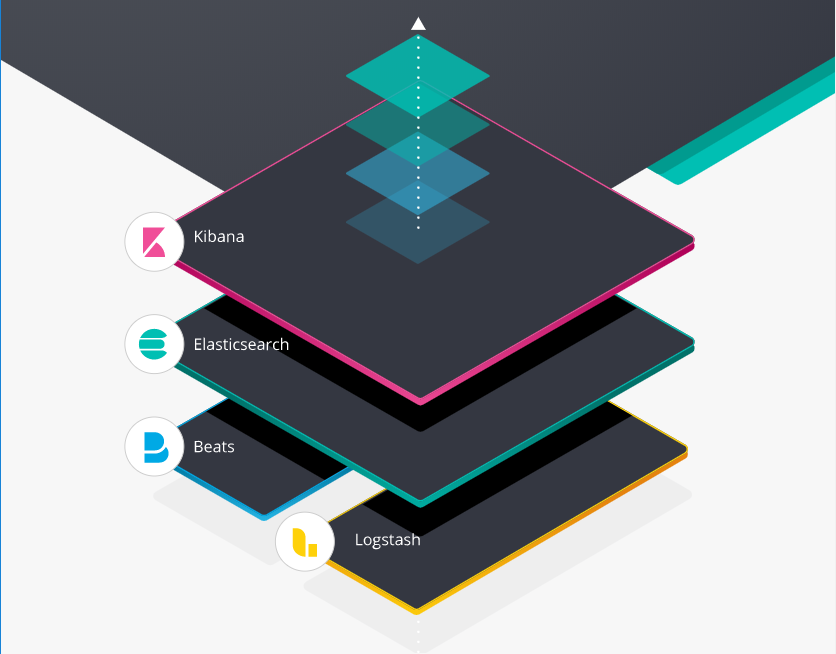
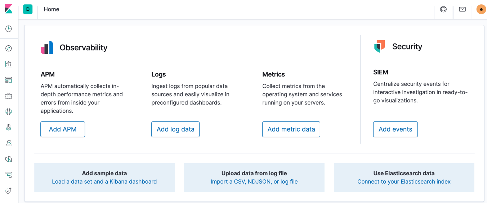
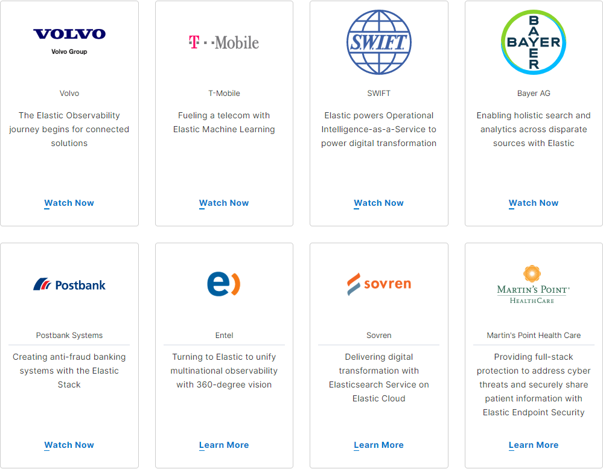
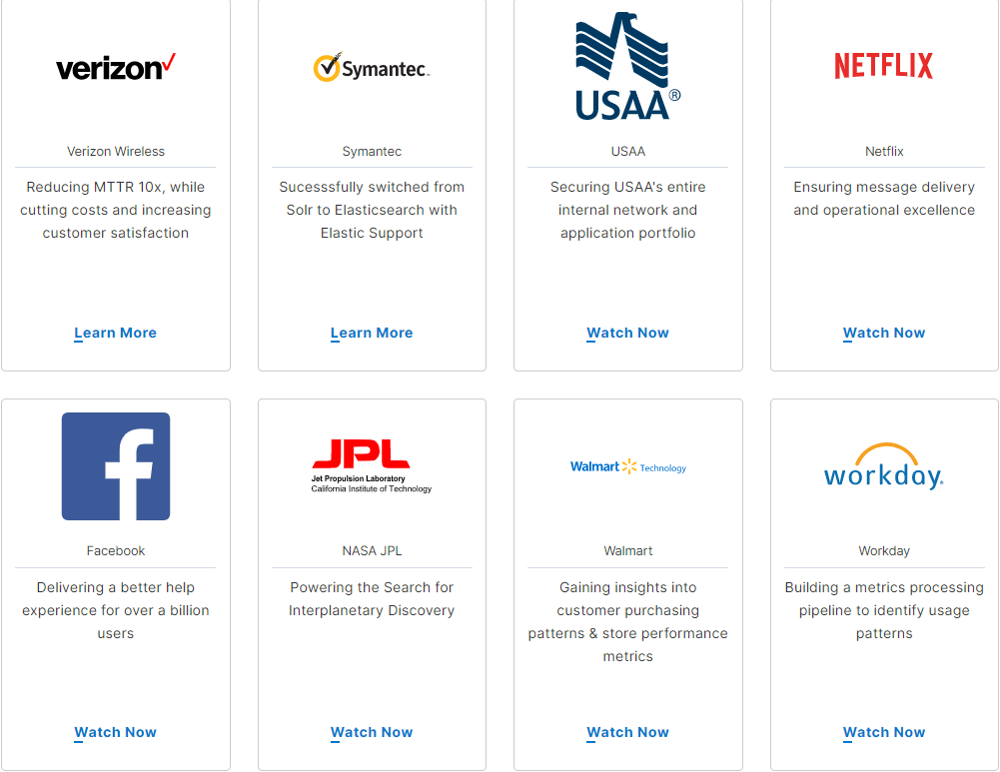
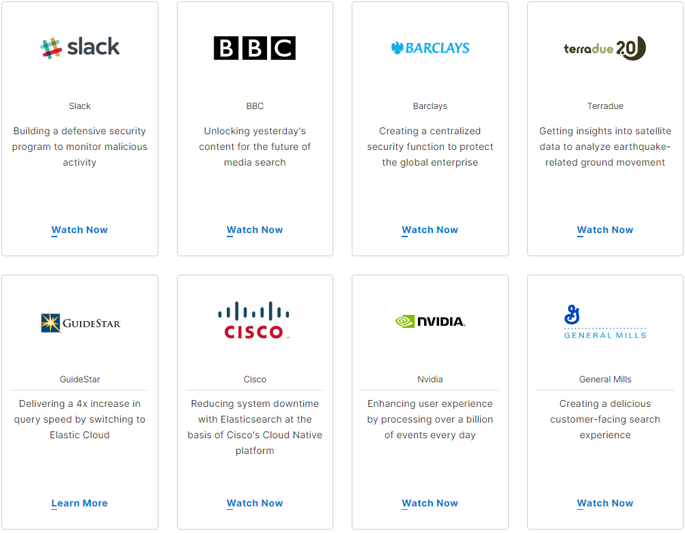

# 一. 什么是 ELK？

"**ELK**" 实际上是三个开源项目的名称首字母缩略词：**Elasticsearch**、**Logstash**和**Kibana**。
`Elasticsearch` 是一个搜索分析引擎。
`Logstash` 是一个服务端数据处理管道，它可以同时从多个数据源获取数据，处理后送给 Elasticsearch。
`Kibana` 则用来将 Elasticsearch 中的数据可视化为图表。

ELK 是 elastic 公司研发的一套完整的日志收集、分析和展示的企业级解决方案，
在这三个软件当中，每个软件用于完成不同的功能，ELK 又称为 ELK stack。
官方域名为:elastic.co

ELK stack 的有如下优点：
**处理方式灵活**：elasticsearch 是实时全文索引，具有强大的搜索功能
**配置相对简单**：elasticsearch 的 API 全部使用 JSON 接口，logstash 使用模
块配置，kibana 的配置文件部分更简单
**检索性能高效**：基于优秀的设计，虽然每次查询都是实时，但是也可以达到百亿级数
据的查询秒级响应
**集群线性扩展**：elasticsearch 和 logstash 都可以灵活线性扩展
**前端操作绚丽**：kibana 的前端设计比较绚丽，而且操作简单

# 二. 什么是 Elasticsearch?

Elasticsearch 是一个开源的、分布式的、基于 JSON 且具有 RESTful API 风格的
高度可扩展的开源全文搜索和分析引擎，它可实现数据的实时全文搜索、支持分布式、
支持数据高可用、提供易用的 API 接口，可以处理大规模日志数据，比如 Nginx、
Tomcat、系统日志等。

Elasticsearch 使用 Java 语言开发，是建立在全文搜索引擎 Apache Lucene 基础
之上开发的搜索引擎。[Apache-lucene](https://lucene.apache.org/)

无论数据类型是结构化或非结构化文本、数字数据还是地理空间数据，Elasticsearch
都可以有效地存储和索引这些数据，并支持快速搜索。可以使用非常简单的数据检索和
聚合信息来发现数据中的趋势和模式。随着数据和查询量的增长，Elasticsearch 的分
布式特性可以让集群的性能无缝地随之增长。

Elasticsearch 特点：

1. 灵活高可扩展
2. 实时搜索、实时分析
3. 分布式架构、实时文件存储
4. 文档导向，所有对象都是文档
5. 高可用，易扩展，支持集群，分片与复制
6. 接口友好，支持 json
7. 很受欢迎

# 三. 什么是 Logstash?

Logstash 是一个具有传输实时数据流能力的开源数据收集引擎，其可以通过插件实现
日志收集和转发，支持日志过滤，支持普通 log、自定义 json 格式的日志解析，动态
的处理和统一不同来源的数据，最终将数据规范化并发送给 elasticsearch。

Logstash 特点：

1. 可水平扩展的数据处理管道(data processing pipeline)
2. 基于插件的管道架构(pluggable pipeline architecture)
3. 对开发人员友好的插件
4. 接收各种来源的数据输入，如 apache，tomcat，log4j、syslog
5. 将数据存储到数据库或者推送到消息队列如 Kafka、RabbitMQ
6. 输出数据目标可以是 Elasticsearch、Zabbix、DHFS、MongoDB 等

# 四. 什么是 Kibana?

Kibana 是一个开源的数据分析和可视化平台。提供 WEB UI 来给管理员或者开
发者查看和分析数据。其可以将分布的 Elasticsearch 数据集中可视化管理。

Kibana 为 elasticsearch 提供一个查看数据的 web 界面，其主要是通过调用
elasticsearch 的 API 接口进行数据查找，并进行前端数据可视化的展现，另
外还可以针对特定格式的数据生成相应的表格、柱状图、饼图等。

# 五. 为什么使用 EKL?

## 5.1 EKL 的优势

ELK 组件在海量日志系统的运维中，可用于解决以下主要问题：

- 分布式日志数据统一收集，实现日志集中式查询和管理
- 故障排查
- 安全信息上报和事件管理
- 报表展示功能

ELK 组件在大数据运维系统中，主要可解决的问题如下：

- 日志查询，问题排查，故障恢复，故障自愈
- 应用日志分析，错误报警
- 性能分析，用户行为分析

## 5.2 EKL 的用户

# The Adventure of ELK

