案例规划如下：


由于实验环境限制，将 filebeat 和 logstash 部署在 tomcat-server-nodeX，将 redis 和
写 ES 集群的 logstash 部署在 redis-server，将 HAproxy 和 Keepalived 部署在
tomcat-server-nodeX。将 Kibana 部署在 ES 集群主机。

环境：

| 主机名              | 核心 | RAM | IP              | 运行的服务                                 |
| :------------------ | :--- | :-- | :-------------- | :----------------------------------------- |
| es-server-node1     | 2    | 4G  | 192.168.100.142 | Elasticsearch、Kibana、Head、Cerebro       |
| es-server-node2     | 2    | 4G  | 192.168.100.144 | Elasticsearch 、Kibana                     |
| es-server-node3     | 2    | 4G  | 192.168.100.146 | Elasticsearch 、Kibana                     |
| tomcat-server-node1 | 2    | 2G  | 192.168.100.150 | logstash、filebeat、haproxy、tomcat        |
| tomcat-server-node2 | 2    | 2G  | 192.168.100.152 | logstash、filebeat、haproxy、nginx、tomcat |
| redis-server        | 2    | 2G  | 192.168.100.154 | redis、logstash、MySQL                     |

# 一. 基础环境说明

## 1.1 ES 和 logstash 需要 JAVA 环境

前提：关闭防火墙和 SELinux，时间同步

### ES 安装说明

不同的 ES 版本需要的依赖和说明，查看官方文档：
[ES 安装说明](https://www.elastic.co/guide/en/elasticsearch/reference/current/deb.html)

### Logstash 安装说明

不同的 ES 版本需要的依赖和说明，查看官方文档：
[Logstash 安装说明](https://www.elastic.co/guide/en/logstash/current/installing-logstash.html)

## 1.2 HAProxy 和 redis 及 nginx 编译基础工具安装

Ubuntu 安装：

```bash
apt -y purge ufw lxd lxd-client lxcfs liblxc-common
apt -y install iproute2 ntpdate tcpdump telnet traceroute nfs-kernel-server nfs-common lrzsz tree openssl libssl-dev libpcre3 libpcre3-dev zlib1g-dev  gcc make openssh-server  iotop unzip zip
```

CentOS7 安装：

```bash
yum -y install vim-enhanced tcpdump lrzsz tree telnet bash-completion net-tools wget bzip2 lsof tmux man-pages zip unzip nfs-utils gcc make gcc-c++ glibc glibc-devel pcre pcre-devel openssl  openssl-devel systemd-devel zlib-devel
```

# 二. 配置 filebeat 将数据通过 logstash 写入 redis

日志流动路径：
`tomcat-server:filebeat --> tomcat-server:logstash --> redis-server:redis`

## 2.1 filebeat 配置

### 2.1.1 tomcat-server-node1

[filebeat: logstash-output doc](https://www.elastic.co/guide/en/beats/filebeat/current/logstash-output.html)

```bash
root@tomcat-server-node1:~# ip addr sho eth0 | grep "inet "
    inet 192.168.100.150/24 brd 192.168.100.255 scope global eth0

root@tomcat-server-node1:~# vim /etc/filebeat/filebeat.yml
...
filebeat.inputs:
- type: log
  enabled: true
  paths:
    - /var/log/syslog
  document_type: system-log
  exclude_lines: ['^DBG']
  fields:
    name: syslog_from_filebeat_150  # 该值用来在logstash区分日志来源，以输出到不同目标或创建不同index(输出目标为elasticsearch时)
utput.logstash:
  hosts: ["192.168.100.150:5044"]
```

### 2.1.2 tomcat-server-node2

```bash
root@tomcat-server-node2:~# ip addr show eth0 | grep "inet "
    inet 192.168.100.152/24 brd 192.168.100.255 scope global eth0

root@tomcat-server-node2:~# vim /etc/filebeat/filebeat.yml
...
filebeat.inputs:
- type: log
  enabled: true
  paths:
    - /var/log/syslog
  document_type: system-log
  exclude_lines: ['^DBG']
  fields:
    name: syslog_from_filebeat_152
output.logstash:
  hosts: ["192.168.100.152:5044"]
...
```

## 2.2 logstash 配置

[logstash filebeat input plugin](https://www.elastic.co/guide/en/logstash/current/plugins-inputs-beats.html)
[logstash redis output plugin](https://www.elastic.co/guide/en/logstash/current/plugins-outputs-redis.html)

### 2.2.1 tomcat-server-node1

```bash
root@tomcat-server-node1:/etc/logstash/conf.d# cat syslog_from_filebeat.conf
input {
  beats {
    host => "192.168.100.150"
    port => "5044"
  }
}

output {
  redis {
    host => "192.168.100.154"
    port => "6379"
    db   => "1"
    key  => "syslog_150"
    data_type => "list"
    password  => "stevenux"
  }
}
```

重启 logstash：

```bash
~# systemctl restart logstash
```

### 2.2.2 tomca-server-node2

```bash
root@tomcat-server-node2:/etc/logstash/conf.d# cat syslog_from_filebeat.conf
input {
  beats {
    host => "192.168.100.152"
    port => "5044"
  }
}

output {
  redis {
    host => "192.168.100.154"
    port => "6379"
    db   => "1"
    key  => "syslog_152"
    data_type => "list"
    password  => "stevenux"
  }
}

```

重启 logstash：

```bash
~# systemctl restart logstash
```

## 2.3 redis 配置

### 2.3.1 关闭 RDB 和 AOF 数据持久

```bash
root@redis-server:/etc/logstash/conf.d# cat /usr/local/redis/redis.conf
...
bind 0.0.0.0
port 6379
daemonize yes
supervised no
pidfile /var/run/redis_6379.pid
loglevel notice
databases 16
# requirepass foobared  # 设置密码
#save 900  # 关闭RDB
#save 300
#save 60 10000
#dbfilename dump.rdb
appendonly no  # 关闭AOF
...
```

### 2.3.2 设置密码

开启 redis 后使用 redis-cli 设置密码，重启 redis 后失效：

```bash
127.0.0.1> CONFIG SET requirepass 'stevenux'
```

启动 redis：

```bash
root@redis-server:/etc/logstash/conf.d# /usr/local/redis/src/redis-server &
```

## 2.4 查看 logstash 和 filebeat 日志及 redis 数据

### 2.4.1 redis 数据

```bash
root@redis-server:~# redis-cli
127.0.0.1:6379> AUTH stevenux
OK
127.0.0.1:6379> SELECT 1
OK
127.0.0.1:6379[1]> KEYS *
1) "syslog_152"
2) "syslog_150"
127.0.0.1:6379[1]> LLEN syslog_152
(integer) 3760
127.0.0.1:6379[1]> LLEN syslog_150
(integer) 4125
127.0.0.1:6379[1]> LPOP syslog_152
"{\"agent\":{\"hostname\":\"tomcat-server-node2\",\"id\":\"93f937e9-e692-4434-8b83-7562f95ef976\",\"type\":\"filebeat\",\"version\":\"7.6.1\",\"ephemeral_id\":\"5cf51f37-15b3-44b7-bd01-293f0290774b\"},\"host\":{\"name\":\"tomcat-server-node2\",\"hostname\":\"tomcat-server-node2\",\"id\":\"e96c1092201442a4aeb7f67c5c417605\",\"architecture\":\"x86_64\",\"containerized\":false,\"os\":{\"codename\":\"bionic\",\"name\":\"Ubuntu\",\"platform\":\"ubuntu\",\"kernel\":\"4.15.0-55-generic\",\"family\":\"debian\",\"version\":\"18.04.3 LTS (Bionic Beaver)\"}},\"input\":{\"type\":\"log\"},\"@timestamp\":\"2020-03-22T05:52:07.572Z\",\"ecs\":{\"version\":\"1.4.0\"},\"tags\":[\"beats_input_codec_plain_applied\"],\"log\":{\"offset\":21760382,\"file\":{\"path\":\"/var/log/syslog\"}},\"message\":\"Mar 22 13:52:00 tomcat-server-node2 filebeat[1136]: 2020-03-22T13:52:00.256+0800#011ERROR#011pipeline/output.go:100#011Failed to connect to backoff(async(tcp://192.168.100.152:5044)): dial tcp 192.168.100.152:5044: connect: connection refused\",\"@version\":\"1\",\"fields\":{\"name\":\"syslog_from_filebeat_152\"}}"
127.0.0.1:6379[1]> LPOP syslog_150
"{\"@timestamp\":\"2020-03-22T05:46:08.122Z\",\"tags\":[\"beats_input_codec_plain_applied\"],\"fields\":{\"name\":\"syslog_from_filebeat_150\"},\"@version\":\"1\",\"agent\":{\"hostname\":\"tomcat-server-node1\",\"id\":\"93f937e9-e692-4434-8b83-7562f95ef976\",\"version\":\"7.6.1\",\"type\":\"filebeat\",\"ephemeral_id\":\"a03ec121-e70b-4039-a696-3e7ccefcb510\"},\"host\":{\"name\":\"tomcat-server-node1\",\"os\":{\"name\":\"Ubuntu\",\"platform\":\"ubuntu\",\"family\":\"debian\",\"kernel\":\"4.15.0-55-generic\",\"version\":\"18.04.3 LTS (Bionic Beaver)\",\"codename\":\"bionic\"},\"containerized\":false,\"architecture\":\"x86_64\",\"id\":\"e96c1092201442a4aeb7f67c5c417605\",\"hostname\":\"tomcat-server-node1\"},\"input\":{\"type\":\"log\"},\"ecs\":{\"version\":\"1.4.0\"},\"message\":\"Mar 22 13:11:57 tomcat-server-node1 kernel: [    0.000000]   2 disabled\",\"log\":{\"offset\":21567440,\"file\":{\"path\":\"/var/log/syslog\"}}}"
127.0.0.1:6379[1]>
```

### 2.4.2 logstash 日志

```bash
root@tomcat-server-node1:/etc/logstash/conf.d# tail /var/log/logstash/logstash-plain.log  -n66
...
[2020-03-22T13:49:33,428][INFO ][logstash.runner          ] Starting Logstash {"logstash.version"=>"7.6.1"}
[2020-03-22T13:49:35,044][INFO ][org.reflections.Reflections] Reflections took 35 ms to scan 1 urls, producing 20 keys and 40 values
[2020-03-22T13:49:35,573][WARN ][org.logstash.instrument.metrics.gauge.LazyDelegatingGauge][main] A gauge metric of an unknown type (org.jruby.RubyArray) has been create for key: cluster_uuids. This may result in invalid serialization.  It is recommended to log an issue to the responsible developer/development team.
[2020-03-22T13:49:35,603][INFO ][logstash.javapipeline    ][main] Starting pipeline {:pipeline_id=>"main", "pipeline.workers"=>2, "pipeline.batch.size"=>125, "pipeline.batch.delay"=>50, "pipeline.max_inflight"=>250, "pipeline.sources"=>["/etc/logstash/conf.d/syslog_from_filebeat.conf"], :thread=>"#<Thread:0xacd988b run>"}
[2020-03-22T13:49:36,337][INFO ][logstash.inputs.beats    ][main] Beats inputs: Starting input listener {:address=>"192.168.100.150:5044"}
[2020-03-22T13:49:36,354][INFO ][logstash.javapipeline    ][main] Pipeline started {"pipeline.id"=>"main"}
[2020-03-22T13:49:36,426][INFO ][logstash.agent           ] Pipelines running {:count=>1, :running_pipelines=>[:main], :non_running_pipelines=>[]}
[2020-03-22T13:49:36,482][INFO ][org.logstash.beats.Server][main] Starting server on port: 5044
[2020-03-22T13:49:36,728][INFO ][logstash.agent           ] Successfully started Logstash API endpoint {:port=>9600}
```

### 2.4.2 filebeat 日志

```bash
root@tomcat-server-node1:/etc/logstash/conf.d# tail /var/log/syslog  -n2
Mar 22 13:53:35 tomcat-server-node1 filebeat[1162]: 2020-03-22T13:53:35.082+0800#011INFO#011[monitoring]#011log/log.go:145#011Non-zero metrics in the last 30s#011{"monitoring": {"metrics": {"beat":{"cpu":{"system":{"ticks":990,"time":{"ms":6}},"total":{"ticks":1440,"time":{"ms":6},"value":1440},"user":{"ticks":450}},"handles":{"limit":{"hard":4096,"soft":1024},"open":11},"info":{"ephemeral_id":"a03ec121-e70b-4039-a696-3e7ccefcb510","uptime":{"ms":450355}},"memstats":{"gc_next":14313856,"memory_alloc":11135512,"memory_total":142802472},"runtime":{"goroutines":29}},"filebeat":{"events":{"added":1,"done":1},"harvester":{"files":{"cf3638b8-1dfe-4b35-acd1-d3ec67a6780e":{"last_event_published_time":"2020-03-22T13:53:07.351Z","last_event_timestamp":"2020-03-22T13:53:07.351Z","read_offset":1259,"size":1259}},"open_files":1,"running":1}},"libbeat":{"config":{"module":{"running":0}},"output":{"events":{"acked":1,"batches":1,"total":1},"read":{"bytes":6},"write":{"bytes":1134}},"pipeline":{"clients":1,"events":{"active":0,"published":1,"total":1},"queue":{"acked":1}}},"registrar":{"states":{"current":2,"update":1},"writes":{"success":1,"total":1}},"system":{"load":{"1":0.03,"15":0.41,"5":0.56,"norm":{"1":0.015,"15":0.205,"5":0.28}}}}}}
Mar 22 13:54:05 tomcat-server-node1 filebeat[1162]: 2020-03-22T13:54:05.082+0800#011INFO#011[monitoring]#011log/log.go:145#011Non-zero metrics in the last 30s#011{"monitoring": {"metrics": {"beat":{"cpu":{"system":{"ticks":990,"time":{"ms":4}},"total":{"ticks":1450,"time":{"ms":9},"value":1450},"user":{"ticks":460,"time":{"ms":5}}},"handles":{"limit":{"hard":4096,"soft":1024},"open":11},"info":{"ephemeral_id":"a03ec121-e70b-4039-a696-3e7ccefcb510","uptime":{"ms":480354}},"memstats":{"gc_next":14313856,"memory_alloc":12851080,"memory_total":144518040},"runtime":{"goroutines":29}},"filebeat":{"events":{"added":1,"done":1},"harvester":{"files":{"cf3638b8-1dfe-4b35-acd1-d3ec67a6780e":{"last_event_published_time":"2020-03-22T13:53:42.357Z","last_event_timestamp":"2020-03-22T13:53:42.357Z","read_offset":1245,"size":1245}},"open_files":1,"running":1}},"libbeat":{"config":{"module":{"running":0}},"output":{"events":{"acked":1,"batches":1,"total":1},"read":{"bytes":6},"write":{"bytes":1130}},"pipeline":{"clients":1,"events":{"active":0,"published":1,"total":1},"queue":{"acked":1}}},"registrar":{"states":{"current":2,"update":1},"writes":{"success":1,"total":1}},"system":{"load":{"1":0.02,"15":0.39,"5":0.5,"norm":{"1":0.01,"15":0.195,"5":0.25}}}}}}
```

# 三. 配置 logstash 取出 redis 数据写入 ES 集群

日志数据流动：
`redis-server: redis --> redis-server: logstash --> es-server-nodeX: elasticsearch`

## 3.1 logstash 配置

```bash
root@redis-server:/etc/logstash/conf.d# vim syslog_redis_to_es.conf
root@redis-server:/etc/logstash/conf.d# cat syslog_redis_to_es.conf
input {
  redis {
    host => "192.168.100.154"
    port => "6379"
    data_type => "list"
    db => "1"
    key => "syslog_150"
    password => "stevenux"
  }

  redis {
    host => "192.168.100.154"
    port => "6379"
    data_type => "list"
    db => "1"
    key => "syslog_152"
    password => "stevenux"
  }

}

output {

  if [fields][name] == "syslog_from_filebeat_150" {   # 该判断值在filebeat配置文件中定义
    elasticsearch {
      hosts => ["192.168.100.144:9200"]
      index => "syslog_from_filebeat_150-%{+YYYY.MM.dd}"
    }
  }

  if [fields][name] == "syslog_from_filebeat_152" {
    elasticsearch {
      hosts => ["192.168.100.144:9200"]
      index => "syslog_from_filebeat_152-%{+YYYY.MM.dd}"
    }
  }

}

```

测试语法：

```bash
root@redis-server:/etc/logstash/conf.d# pwd
/etc/logstash/conf.d
root@redis-server:/etc/logstash/conf.d# /usr/share/logstash/bin/logstash -f syslog_redis_to_es.conf -t
```

启动 logstash：

```bash
root@redis-server:/etc/logstash/conf.d# systemctl restart logstash
```

查看 redis 数据是否被取走：

```bash
127.0.0.1:6379[1]> KEYS *
1) "syslog_152"
2) "syslog_150"
127.0.0.1:6379[1]> llen syslog_152
(integer) 3804
127.0.0.1:6379[1]> llen syslog_152
(integer) 3804
127.0.0.1:6379[1]> KEYS *
1) "syslog_152"
2) "syslog_150"
127.0.0.1:6379[1]> llen syslog_152
(integer) 3805
127.0.0.1:6379[1]> llen syslog_152
(integer) 3808
127.0.0.1:6379[1]> KEYS *
1) "syslog_152"
2) "syslog_150"
127.0.0.1:6379[1]> KEYS *
1) "syslog_152"
2) "syslog_150"
127.0.0.1:6379[1]> KEYS *
1) "syslog_152"
2) "syslog_150"
127.0.0.1:6379[1]> KEYS *
(empty list or set)   # gone
127.0.0.1:6379[1]> KEYS *
(empty list or set)
127.0.0.1:6379[1]> KEYS *
(empty list or set)
```

## 3.2 查看 head 是否生成 index


## 3.3 在 Kibana 查看


# 四.将日志写入 MySQL

写入数据库的目的是用于持久化保存重要数据，比如状态码、客户端 IP、客户
端浏览器版本等等，用于后期按月做数据统计等。

## 4.1 安装 MySQL

使用 apt 安装：

```bash
root@redis-server:~# apt install mysql-server
root@redis-server:~# mysql
Welcome to the MySQL monitor.  Commands end with ; or \g.
Your MySQL connection id is 2
Server version: 5.7.29-0ubuntu0.18.04.1 (Ubuntu)
...
mysql> ALTER USER user() IDENTIFIED BY 'stevenux';  # 更root密码
Query OK, 0 rows affected (0.00 sec)

mysql> FLUSH PRIVILEGES;
Query OK, 0 rows affected (0.00 sec)

mysql>
```

## 4.2 创建 logstash 用户并授权

### 4.2.1 创建数据库和用户授权

授权 `logstash` 用户访问数据库，将数据存入新建的数据库 `log_data`:

```bash
...
mysql> CREATE DATABASE log_data  CHARACTER SET utf8 COLLATE utf8_bin;
Query OK, 1 row affected (0.00 sec)

mysql> GRANT ALL PRIVILEGES ON log_data.* TO logstash@"%" IDENTIFIED BY 'stevenux';
Query OK, 0 rows affected, 1 warning (0.00 sec)

mysql> FLUSH PRIVILEGES;
Query OK, 0 rows affected (0.00 sec)

mysql>
```

### 4.2.2 测试 logstash 用户连接数据库

```bash
root@redis-server:~# mysql -ulogstash -p
Enter password: (stevenux)
Welcome to the MySQL monitor.  Commands end with ; or \g.
Your MySQL connection id is 5
Server version: 5.7.29-0ubuntu0.18.04.1 (Ubuntu)
...

mysql> SHOW DATABASES;
+--------------------+
| Database           |
+--------------------+
| information_schema |
| log_data           |
+--------------------+
2 rows in set (0.00 sec)

mysql>
```

## 4.3 配置 logstash 连接数据库

logstash 连接 MySQL 数据库需要使用 MySQL 官方的 JDBC 驱动程序`MySQL Connector/J`。
MySQL Connector/J 是 MySQL 官方 JDBC 驱动程序，JDBC(Java Data Base Connectivity)
java 数据库连接器，是一种用于执行 SQL 语句的 Java API，可以为多种关系数据库提供
统一访问，它由一组用 Java 语言编写的类和接口组成。

[JDBC 官方下载地址-各种语言](https://dev.mysql.com/downloads/connector/)
[此实验使用的 jar 包](https://downloads.mysql.com/archives/c-j/)

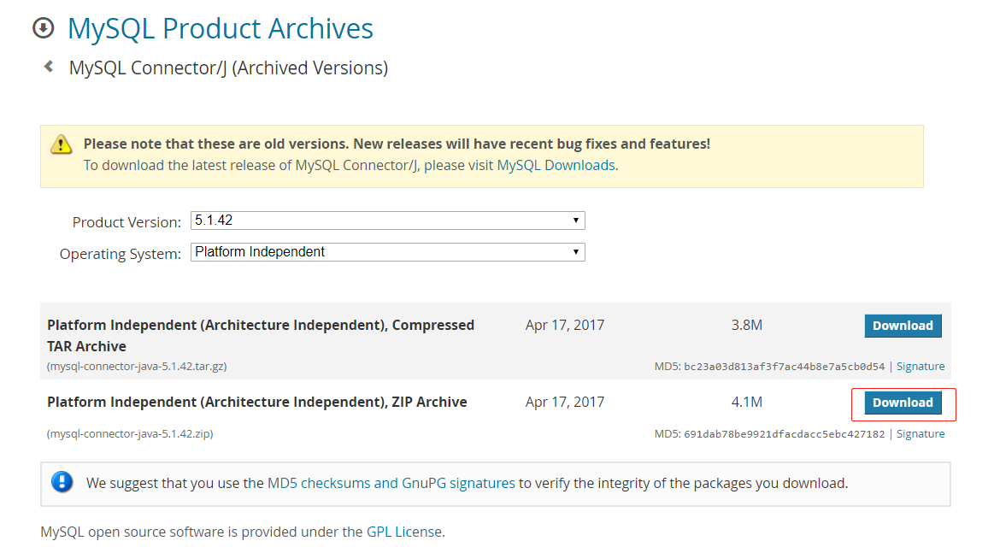

### 4.3.1 下载驱动 jar 包

```bash
root@redis-server:/usr/local/src# pwd
/usr/local/src
root@redis-server:/usr/local/src# wget https://downloads.mysql.com/archives/get/p/3/file/mysql-connector-java-5.1.42.zip
```

### 4.3.2 安装 jar 包到 logstash

```bash
# 解压zip包
root@redis-server:/usr/local/src# unzip mysql-connector-java-5.1.42.zip
root@redis-server:/usr/local/src# ll mysql-connector-java-5.1.42
total 1468
drwxr-xr-x 4 root root   4096 Apr 17  2017 ./
drwxr-xr-x 5 root root   4096 Mar 22 15:05 ../
-rw-r--r-- 1 root root  91463 Apr 17  2017 build.xml
-rw-r--r-- 1 root root 244278 Apr 17  2017 CHANGES
-rw-r--r-- 1 root root  18122 Apr 17  2017 COPYING
drwxr-xr-x 2 root root   4096 Apr 17  2017 docs/
-rw-r--r-- 1 root root 996444 Apr 17  2017 mysql-connector-java-5.1.42-bin.jar
-rw-r--r-- 1 root root  61407 Apr 17  2017 README
-rw-r--r-- 1 root root  63658 Apr 17  2017 README.txt
drwxr-xr-x 8 root root   4096 Apr 17  2017 src/

# 安装logstash的要求创建目录
root@redis-server:/usr/local/src# mkdir -pv /usr/share/logstash/vendor/jar/jdbc
mkdir: created directory '/usr/share/logstash/vendor/jar'
mkdir: created directory '/usr/share/logstash/vendor/jar/jdbc'

# 将jar包拷贝过去
root@redis-server:/usr/local/src# cp mysql-connector-java-5.1.42/mysql-connector-java-5.1.42-bin.jar /usr/share/logstash/vendor/jar/jdbc/

# 更改权限
root@redis-server:/usr/local/src# chown logstash.logstash /usr/share/logstash/vendor/jar -R
root@redis-server:/usr/local/src# ll /usr/share/logstash/vendor/jar/
total 12
drwxr-xr-x 3 logstash logstash 4096 Mar 22 15:07 ./
drwxrwxr-x 5 logstash logstash 4096 Mar 22 15:07 ../
drwxr-xr-x 2 logstash logstash 4096 Mar 22 15:09 jdbc/
root@redis-server:/usr/local/src# ll /usr/share/logstash/vendor/jar/jdbc/
total 984
drwxr-xr-x 2 logstash logstash   4096 Mar 22 15:09 ./
drwxr-xr-x 3 logstash logstash   4096 Mar 22 15:07 ../
-rw-r--r-- 1 logstash logstash 996444 Mar 22 15:09 mysql-connector-java-5.1.42-bin.jar
```

## 4.4 配置 logstash 的输出插件

### 4.4.1 配置 gem 源

logstash 的输出到 SQL 的插件为`logstash-output-jdbc`，该插件使用了 shell
脚本和 ruby 脚本写成，所以需要使用 ruby 的包管理器 gem 和 gem 源。

国外的 gem 源由于网络原因，从国内访问太慢而且不稳定，还经常安装不成功，因此
之前一段时间很多人都是使用国内淘宝的 gem 源https://ruby.taobao.org/，现在
淘宝的 gem 源虽然还可以使用，但是已经停止维护更新。[其官方介绍](https://gems.ruby-china.com/)

```bash
root@redis-server:/usr/local/src# snap install ruby
root@redis-server:/usr/local/src# apt install gem

# 更改源
root@redis-server:/usr/local/src# gem sources --add https://gems.ruby-china.com/ --remove https://rubygems.org/
https://gems.ruby-china.com/ added to sources
https://rubygems.org/ removed from sources

# 查看源
root@redis-server:/usr/local/src# gem sources -l
*** CURRENT SOURCES ***

https://gems.ruby-china.com/   # 确认只有ruby-china
```

### 4.4.2 安装配置 logstash-output-jdbc 插件

该插件可以将 logstash 的数据通过 JDBC 输出到 SQL 数据库。使用 logstash 自带的
`/usr/share/logstash/bin/logstash-plugin`工具安装该插件。

[Github: logstash-output-jdbc](https://github.com/theangryangel/logstash-output-jdbc)
[logstash 使用该插件配置示例](https://github.com/theangryangel/logstash-output-jdbc/blob/master/examples/mysql.md)

```bash
# 查看已安装的插件
root@redis-server:~# /usr/share/logstash/bin/logstash-plugin list
...
logstash-codec-avro
logstash-codec-cef
logstash-codec-collectd
logstash-codec-dots
logstash-codec-edn
logstash-codec-edn_lines
logstash-codec-es_bulk
logstash-codec-fluent
logstash-codec-graphite
logstash-codec-json
...

# 安装logstash-output-jdbc
root@redis-server:~# /usr/share/logstash/bin/logstash-plugin install logstash-output-jdbc
...
Validating logstash-output-jdbc
Installing logstash-output-jdbc
Installation successful  # 安装完成
```

## 4.5 事先在数据库创建表结构

收集 tomcat 的访问日志中的 clientip,status,AgentVersion,method 和
访问时间等字段值。时间字段使用系统时间。

```bash
root@redis-server:~# mysql -ulogstash -p
Enter password:
...
mysql> show databases;
+--------------------+
| Database           |
+--------------------+
| information_schema |
| log_data           |
+--------------------+
2 rows in set (0.00 sec)

mysql> select CURRENT_TIMESTAMP;
+---------------------+
| CURRENT_TIMESTAMP   |
+---------------------+
| 2020-03-22 16:36:33 |
+---------------------+
1 row in set (0.00 sec)

mysql> USE log_data;
Database changed
mysql> CREATE TABLE tom_log (host varchar(128), status int(32), clientip varchar(50), AgentVersion varchar(512), time timestamp default current_timestamp);
Query OK, 0 rows affected (0.02 sec)

mysql> show tables;
+--------------------+
| Tables_in_log_data |
+--------------------+
| tom_log            |
+--------------------+
1 row in set (0.00 sec)

mysql> desc tom_log;
+--------------+--------------+------+-----+-------------------+-------+
| Field        | Type         | Null | Key | Default           | Extra |
+--------------+--------------+------+-----+-------------------+-------+
| host         | varchar(128) | YES  |     | NULL              |       |
| status       | int(32)      | YES  |     | NULL              |       |
| clientip     | varchar(50)  | YES  |     | NULL              |       |
| AgentVersion | varchar(512) | YES  |     | NULL              |       |
| time         | timestamp    | NO   |     | CURRENT_TIMESTAMP |       |  # 时间字段
+--------------+--------------+------+-----+-------------------+-------+
5 rows in set (0.02 sec)
```

## 4.6 syslog 更改为手机 tomcat 访问日志

### 4.6.1 保证 tomcat 的日志格式为 json

```bash
root@tomcat-server-node1:~# cat /usr/local/tomcat/conf/server.xml
...
<Server>
...
  <Service>
  ...
    <Engine>
    ...
      <Host>
      ...
          <Valve className="org.apache.catalina.valves.AccessLogValve" directory="logs"
               prefix="tomcat_access_log" suffix=".log"
	       pattern="{&quot;clientip&quot;:&quot;%h&quot;,&quot;ClientUser&quot;:&quot;%l&quot;,&quot;authenticated&quot;:&quot;%u&quot;,&quot;AccessTime&quot;:&quot;%t&quot;,&quot;method&quot;:&quot;%r&quot;,&quot;status&quot;:&quot;%s&quot;,&quot;SendBytes&quot;:&quot;%b&quot;,&quot;Query?string&quot;:&quot;%q&quot;,&quot;partner&quot;:&quot;%{Referer}i&quot;,&quot;AgentVersion&quot;:&quot;%{User-Agent}i&quot;}" />

      </Host>
    </Engine>
  </Service>
</Server>
```

### 4.6.2 filebeat 配置

**tomcat-server-node1**

```bash
root@tomcat-server-node1:~# cat /etc/filebeat/filebeat.yml
...
filebeat.inputs:
- type: log
  enabled: true
  paths:
    - /var/log/syslog
  document_type: system-log
  exclude_lines: ['^DBG']
  #include_lines: ['^ERR', '^WARN']
  fields:
    name: syslog_from_filebeat_150  # 自定义条目

filebeat.inputs:
- type: log
  enabled: true
  paths:
    - /usr/local/tomcat/logs/tomcat_access_log.2020-03-22.log
  document_type: tomcat-log
  exclude_lines: ['^DBG']
  fields:
    name: tom_from_filebeat_150
# logstash输出
output.logstash:
  hosts: ["192.168.100.150:5044"]
```

**tomcat-server-node2**

```bash
root@tomcat-server-node2:~# cat /etc/filebeat/filebeat.yml
...
filebeat.inputs:
- type: log
  enabled: true
  paths:
    - /var/log/syslog
  document_type: system-log
  exclude_lines: ['^DBG']
  fields:
    name: syslog_from_filebeat_152  # 自定义字段

filebeat.inputs:
- type: log
  enabled: true
  paths:
    - /usr/local/tomcat/logs/tomcat_access_log.2020-03-22.log
  document_type: tomcat-log
  exclude_lines: ['^DBG']
  fields:
    name: tom_from_filebeat_152

# logstash输出
output.logstash:
  hosts: ["192.168.100.152:5044"]
```

### 4.6.3 logstash 配置

**tomcat-server-node1**

```bash
root@tomcat-server-node1:~# cat /etc/logstash/conf.d/tom_from_filebeat.conf
input {
  beats {
    host => "192.168.100.150"
    port => "5044"
  }
}

output {
  if [fields][name] == "tom_from_filebeat_150" {
    redis {
      host => "192.168.100.154"
      port => "6379"
      db   => "1"
      key  => "tomlog_150"
      data_type => "list"
      password  => "stevenux"
    }
  }
}
```

**tomcat-server-node2**

```bash
root@tomcat-server-node2:~# cat /etc/logstash/conf.d/tomlog_from_filebeat.conf
input {
  beats {
    host => "192.168.100.152"
    port => "5044"
  }
}

output {
  if [fields][name] == "tom_from_filebeat_152" {
    redis {
      host => "192.168.100.154"
      port => "6379"
      db   => "1"
      key  => "tomlog_152"
      data_type => "list"
      password  => "stevenux"
    }
  }
}
```

### 4.6.4 查看 redis 数据

```bash
root@redis-server:/etc/logstash/conf.d# redis-cli
127.0.0.1:6379> auth stevenux
OK
127.0.0.1:6379> select 1
OK
127.0.0.1:6379[12]> KEYS *
(empty list or set)
127.0.0.1:6379[1]> KEYS *
(empty list or set)
127.0.0.1:6379[1]> KEYS *
(empty list or set)
1) "tomlog_150"
127.0.0.1:6379[1]> KEYS *
1) "tomlog_150"
127.0.0.1:6379[1]> KEYS *
1) "tomlog_150"
127.0.0.1:6379[1]> KEYS *
1) "tomlog_150"
127.0.0.1:6379[1]> KEYS *
1) "tomlog_150"
.....
127.0.0.1:6379[1]>
127.0.0.1:6379[1]>
127.0.0.1:6379[1]>127.0.0.1:6379[1]> KEYS *
1) "tomlog_150"
2) "tomlog_152"
127.0.0.1:6379[1]>

```

## 4.6 配置 logstash 输出到 MySQL

日志数据流动：
`redis-server:redis --> redis-server: logstash --> redis-server: MySQL`

[logstash 使用该插件配置示例:](https://github.com/theangryangel/logstash-output-jdbc/blob/master/examples/mysql.md)

```bash
input
{
	stdin { }
}
output {
	jdbc {
        driver_class => "com.mysql.jdbc.Driver"
		connection_string => "jdbc:mysql://HOSTNAME/DATABASE?user=USER&password=PASSWORD"
		statement => [ "INSERT INTO log (host, timestamp, message) VALUES(?, CAST(? AS timestamp), ?)", "host", "@timestamp", "message" ]
	}
}
```

数据库连接出错解决：

```bash
~# mysql -ulogstash -h192.168.100.154 -pstevenux
mysql: [Warning] Using a password on the command line interface can be insecure.
# 出现以下错误，则更改一下监听地址为所有地址
ERROR 2003 (HY000): Can\'t connect to MySQL server on '192.168.100.154' (111)

~# vim /etc/logstash/conf.d# vim /etc/mysql/mysql.conf.d/mysqld.cnf
...
bind-address            = 0.0.0.0
...

# 重启
root@redis-server:/etc/logstash/conf.d# systemctl restart mysql

# 连接试试
root@redis-server:/etc/logstash/conf.d# mysql -ulogstash -h192.168.100.154 -p
Enter password:

mysql> show databases;
+--------------------+
| Database           |
+--------------------+
| information_schema |
| log_data           |
+--------------------+
2 rows in set (0.01 sec)
```

确保 logstash 已经安装插件：

```bash
root@redis-server:/etc/logstash/conf.d# /usr/share/logstash/bin/logstash-plugin list | grep jdbc
...
logstash-integration-jdbc
 ├── logstash-input-jdbc
 ├── logstash-filter-jdbc_streaming
 └── logstash-filter-jdbc_static
logstash-output-jdbc

root@redis-server:~# ll /usr/share/logstash/vendor/jar/jdbc/mysql-connector-java-5.1.42-bin.jar
-rw-r--r-- 1 logstash logstash 996444 Mar 22 15:09 /usr/share/logstash/vendor/jar/jdbc/mysql-connector-java-5.1.42-bin.jar
```

配置 logstash：

```bash
root@redis-server:~# cat /etc/logstash/conf.d/tomlog_from_redis_to_mysql.conf
input {
  redis {
    host => "192.168.100.154"
    port => "6379"
    db   => "1"
    data_type => "list"
    key       => "tomlog_150"
    password  => "stevenux"
  }
  redis {
    host => "192.168.100.154"
    port => "6379"
    db   => "1"
    data_type => "list"
    key       => "tomlog_152"
    password  => "stevenux"
  }
}

output {
  jdbc {
      driver_class => "com.mysql.jdbc.Driver"
      connection_string => "jdbc:mysql://192.168.100.154/log_data?user=logstash&password=stevenux"
      statement => [ "INSERT INTO tom_log (host, status, clientip, AgentVersion, time) VALUES(?, ?, ?, ?, ?)", "host", "status", "clientip", "AgentVersion","time" ]
    }
}
```

检查语法：

```bash
root@redis-server:~# /usr/share/logstash/bin/logstash -f /etc/logstash/conf.d/tomlog_from_redis_to_mysql.conf -t
...
[INFO ] 2020-03-22 17:13:34.157 [LogStash::Runner] Reflections - Reflections took 41 ms to scan 1 urls, producing 20 keys and 40 values
Configuration OK
[INFO ] 2020-03-22 17:13:34.593 [LogStash::Runner] runner - Using config.test_and_exit mode. Config Validation Result: OK. Exiting Logstash
```

## 4.7 测试

### 4.7.1 访问一下

```bash
root@es-server-node2:~# curl 192.168.100.152:8080
root@es-server-node2:~# curl 192.168.100.152:8080/not_exists
root@es-server-node3:~# curl 192.168.100.152:8080
root@es-server-node3:~# curl 192.168.100.152:8080/not_exists
```

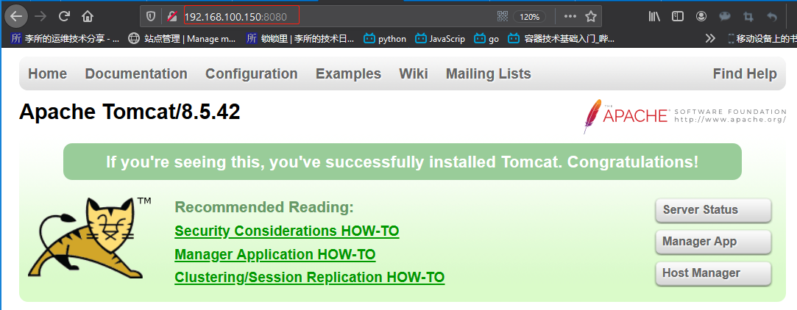

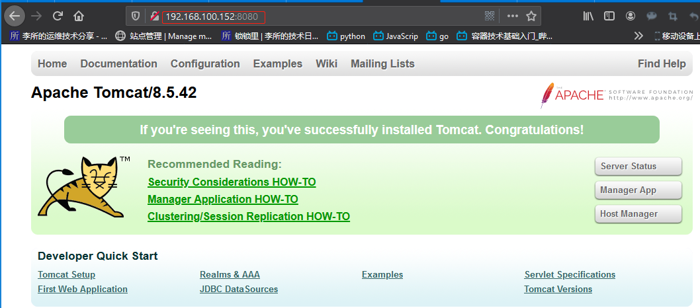

### 4.7.2 查看数据

```bash
root@redis-server:/etc/logstash/conf.d# mysql -ulogstash -h192.168.100.154 -p
Enter password:
...
mysql> SHOW DATABASES;
+--------------------+
| Database           |
+--------------------+
| information_schema |
| log_data           |
+--------------------+
2 rows in set (0.00 sec)

mysql> USE log_data;
Reading table information for completion of table and column names
You can turn off this feature to get a quicker startup with -A

Database changed
mysql> SHOW TABLES;
+--------------------+
| Tables_in_log_data |
+--------------------+
| tom_log            |
+--------------------+
1 row in set (0.00 sec)

mysql> SELECT COUNT(*) FROM tom_log;
+----------+
| COUNT(*) |
+----------+
|     2072 |
+----------+
1 row in set (0.00 sec)

mysql> SELECT * FROM tom_log ORDER BY time DESC LIMIT 5 \G
*************************** 1. row ***************************
        host: tomcat-server-node2
      status: 200
    clientip: 192.168.100.146
AgentVersion: curl/7.58.0
        time: 2020-03-22 21:05:42
*************************** 2. row ***************************
        host: tomcat-server-node2
      status: 200
    clientip: 192.168.100.152
AgentVersion: curl/7.58.0
        time: 2020-03-22 21:05:42
*************************** 3. row ***************************
        host: tomcat-server-node2
      status: 200
    clientip: 192.168.100.150
AgentVersion: curl/7.58.0
        time: 2020-03-22 21:05:42
*************************** 4. row ***************************
        host: tomcat-server-node2
      status: 200
    clientip: 192.168.100.144
AgentVersion: curl/7.58.0
        time: 2020-03-22 21:05:42
*************************** 5. row ***************************
        host: tomcat-server-node2
      status: 200
    clientip: 192.168.100.150
AgentVersion: curl/7.58.0
        time: 2020-03-22 21:05:42
5 rows in set (0.01 sec)

```

### 4.7.3 写 MySQL 的 logstash 日志

```bash
root@redis-server:/etc/logstash/conf.d# tail /var/log/logstash/logstash-plain.log -n12
[2020-03-22T20:48:54,555][INFO ][logstash.runner          ] Starting Logstash {"logstash.version"=>"7.6.1"}
[2020-03-22T20:48:56,366][INFO ][org.reflections.Reflections] Reflections took 33 ms to scan 1 urls, producing 20 keys and 40 values
[2020-03-22T20:48:56,825][INFO ][logstash.outputs.jdbc    ][main] JDBC - Starting up
[2020-03-22T20:48:56,892][INFO ][com.zaxxer.hikari.HikariDataSource][main] HikariPool-1 - Starting...
[2020-03-22T20:48:57,242][INFO ][com.zaxxer.hikari.HikariDataSource][main] HikariPool-1 - Start completed.
[2020-03-22T20:48:57,326][WARN ][org.logstash.instrument.metrics.gauge.LazyDelegatingGauge][main] A gauge metric of an unknown type (org.jruby.RubyArray) has been create for key: cluster_uuids. This may result in invalid serialization.  It is recommended to log an issue to the responsible developer/development team.
[2020-03-22T20:48:57,331][INFO ][logstash.javapipeline    ][main] Starting pipeline {:pipeline_id=>"main", "pipeline.workers"=>2, "pipeline.batch.size"=>125, "pipeline.batch.delay"=>50, "pipeline.max_inflight"=>250, "pipeline.sources"=>["/etc/logstash/conf.d/tomlog_from_redis_to_mysql.conf"], :thread=>"#<Thread:0x752a3c2 run>"}
[2020-03-22T20:48:58,173][INFO ][logstash.inputs.redis    ][main] Registering Redis {:identity=>"redis://<password>@192.168.100.154:6379/1 list:tomlog_150"}
[2020-03-22T20:48:58,178][INFO ][logstash.inputs.redis    ][main] Registering Redis {:identity=>"redis://<password>@192.168.100.154:6379/1 list:tomlog_152"}
[2020-03-22T20:48:58,193][INFO ][logstash.javapipeline    ][main] Pipeline started {"pipeline.id"=>"main"}
[2020-03-22T20:48:58,313][INFO ][logstash.agent           ] Pipelines running {:count=>1, :running_pipelines=>[:main], :non_running_pipelines=>[]}
[2020-03-22T20:48:58,813][INFO ][logstash.agent           ] Successfully started Logstash API endpoint {:port=>9600}

```

# 五. 通过 HAProxy 代理 Kibana

## 5.1 部署 Kibana

### 5.1.1 es-server-node1

```bash
# 安装
root@es-server-node1:/usr/local/src# dpkg -i kibana-7.6.1-amd64.deb
Selecting previously unselected package kibana.
(Reading database ... 85899 files and directories currently installed.)
Preparing to unpack kibana-7.6.1-amd64.deb ...
Unpacking kibana (7.6.1) ...
Setting up kibana (7.6.1) ...
Processing triggers for ureadahead (0.100.0-21) ...
Processing triggers for systemd (237-3ubuntu10.24) ...

# 配置文件
root@es-server-node1:/usr/local/src# grep "^[a-Z]" /etc/kibana/kibana.yml
server.port: 5601
server.host: "0.0.0.0"
server.name: "kibana-demo-node1"
elasticsearch.hosts: ["http://192.168.100.144:9200"]
```

### 5.1.2 es-server-node2

```bash
# 安装
root@es-server-node1:/usr/local/src# dpkg -i kibana-7.6.1-amd64.deb
Selecting previously unselected package kibana.
(Reading database ... 85899 files and directories currently installed.)
Preparing to unpack kibana-7.6.1-amd64.deb ...
Unpacking kibana (7.6.1) ...
Setting up kibana (7.6.1) ...
Processing triggers for ureadahead (0.100.0-21) ...
Processing triggers for systemd (237-3ubuntu10.24) ...

# 配置文件
root@es-server-node1:/usr/local/src# grep "^[a-Z]" /etc/kibana/kibana.yml
server.port: 5601
server.host: "0.0.0.0"
server.name: "kibana-demo-node2"
elasticsearch.hosts: ["http://192.168.100.144:9200"]
```

### 5.1.3 es-server-node3

将之前安装好的 kibana 配置文件分发给 node1 和 node2

```bash
root@es-server-node3:~# scp  /etc/kibana/kibana.yml  192.168.100.142:/etc/kibana/
root@es-server-node3:~# scp  /etc/kibana/kibana.yml  192.168.100.144:/etc/kibana/
```

### 5.2.4 查看 kibana 主界面

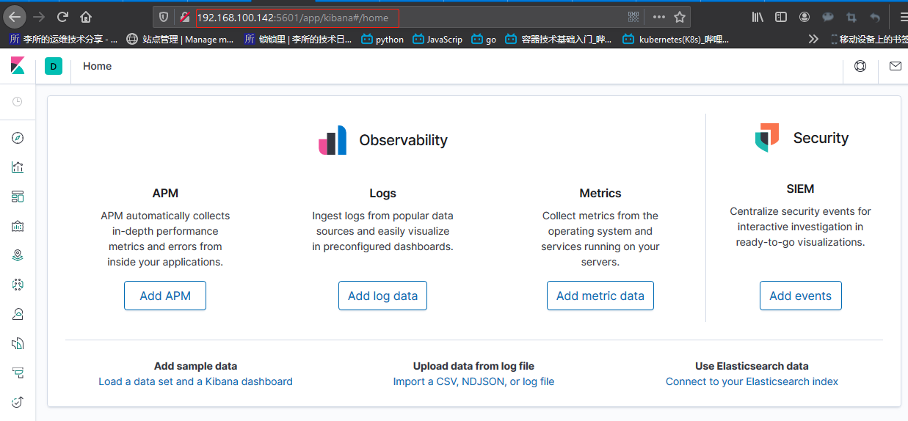

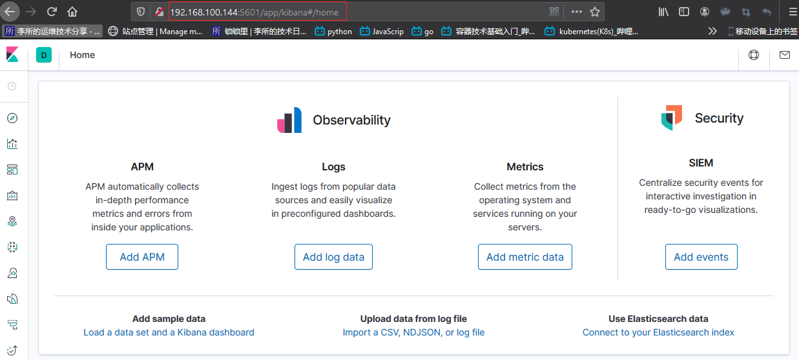

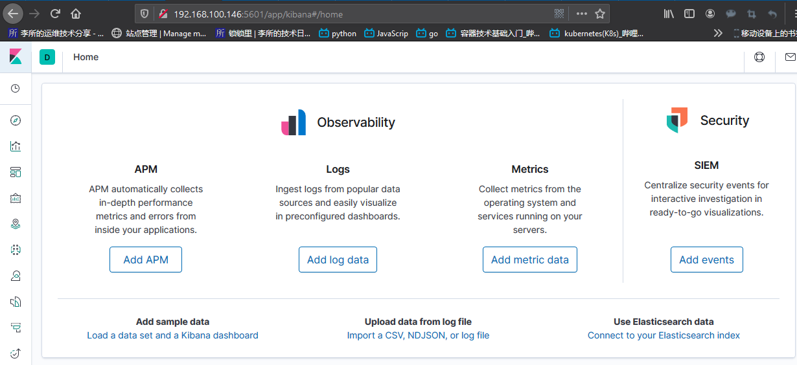

## 5.2 HAProxy 和 keepalived 配置

### 5.2.1 Keepalived 配置

**tomcat-server-node1**

```bash
~# apt install  keepalived -y
~# vim /etc/keepalived/keepalived.conf
root@tomcat-server-node1:~# cat /etc/keepalived/keepalived.conf
global_defs {
    notification_email {
    root@localhost
    }
notification_email_from keepalived@localhost
smtp_server 127.0.0.1
smtp_connect_timeout 30
router_id ha1.example.com
vrrp_skip_check_adv_addr
vrrp_strict
vrrp_garp_interval 0
vrrp_gna_interval 0

vrrp_mcast_group4 224.0.0.18
#vrrp_iptables
}

vrrp_instance VI_1 {
state MASTER
interface eth0
virtual_router_id 80
priority 100
advert_int 1
authentication {
auth_type PASS
auth_pass stevenux
}
virtual_ipaddress {
    192.168.100.200 dev eth0 label eth0:0
}
}

root@tomcat-server-node1:~# systemctl start keepalived

root@tomcat-server-node1:~# ip addr show eth0 | grep inet
    inet 192.168.100.150/24 brd 192.168.100.255 scope global eth0
    inet 192.168.100.200/32 scope global eth0:0
    inet6 fe80::20c:29ff:fe64:9fdf/64 scope link
```

**tomcat-server-node2**

```bash
~# apt install  keepalived -y
~# vim /etc/keepalived/keepalived.conf

root@tomcat-server-node2:/etc/logstash/conf.d# cat /etc/keepalived/keepalived.conf
global_defs {
    notification_email {
    root@localhost
    }
notification_email_from keepalived@localhost
smtp_server 127.0.0.1
smtp_connect_timeout 30
router_id ha1.example.com
vrrp_skip_check_adv_addr
vrrp_strict
vrrp_garp_interval 0
vrrp_gna_interval 0

vrrp_mcast_group4 224.0.0.18
#vrrp_iptables
}

vrrp_instance VI_1 {
state BACKUP
interface eth0
virtual_router_id 80
priority 80
advert_int 1
authentication {
auth_type PASS
auth_pass stevenux
}
virtual_ipaddress {
    192.168.100.200 dev eth0 label eth0:0
}
}

root@tomcat-server-node1:~# systemctl start keepalived

root@tomcat-server-node2:/etc/logstash/conf.d# ip addr show eth0 | grep eth0
2: eth0: <BROADCAST,MULTICAST,UP,LOWER_UP> mtu 1500 qdisc fq_codel state UP group default qlen 1000
    inet 192.168.100.152/24 brd 192.168.100.255 scope global eth0
```

### 5.2.2 HAProxy 配置

**tomcat-server-node1**

```bash
root@tomcat-server-node1:~# cat /etc/haproxy/haproxy.cfg
global
	log /dev/log	local0
	log /dev/log	local1 notice
	chroot /var/lib/haproxy
	stats socket /run/haproxy/admin.sock mode 660 level admin expose-fd listeners
	stats timeout 30s
	user haproxy
	group haproxy
	daemon
	log 127.0.0.1 local6 info
	ca-base /etc/ssl/certs
	crt-base /etc/ssl/private

	ssl-default-bind-ciphers ECDH+AESGCM:DH+AESGCM:ECDH+AES256:DH+AES256:ECDH+AES128:DH+AES:RSA+AESGCM:RSA+AES:!aNULL:!MD5:!DSS
	ssl-default-bind-options no-sslv3

defaults
	log	global
	mode	http
	option	httplog
	option	dontlognull
        timeout connect 5000
        timeout client  50000
        timeout server  50000
	errorfile 400 /etc/haproxy/errors/400.http
	errorfile 403 /etc/haproxy/errors/403.http
	errorfile 408 /etc/haproxy/errors/408.http
	errorfile 500 /etc/haproxy/errors/500.http
	errorfile 502 /etc/haproxy/errors/502.http
	errorfile 503 /etc/haproxy/errors/503.http
	errorfile 504 /etc/haproxy/errors/504.http

listen stats
 	mode http
 	bind 0.0.0.0:9999
 	stats enable
 	log global
 	stats uri     /haproxy-status
 	stats auth    haadmin:stevenux

listen elasticsearch_cluster
  mode http
  balance roundrobin
  bind 192.168.100.200:80
  server 192.168.100.142 192.168.100.142:5601 check inter 3s fall 3 rise 5
  server 192.168.100.144 192.168.100.144:5601 check inter 3s fall 3 rise 5
  server 192.168.100.146 192.168.100.146:5601 check inter 3s fall 3 rise 5

root@tomcat-server-node1:~# systemctl restart haproxy
```

**tomcat-server-node2**

```bash
root@tomcat-server-node2:~# cat /etc/haproxy/haproxy.cfg
global
	log /dev/log	local0
	log /dev/log	local1 notice
	chroot /var/lib/haproxy
	stats socket /run/haproxy/admin.sock mode 660 level admin expose-fd listeners
	stats timeout 30s
	user haproxy
	group haproxy
	daemon
	log 127.0.0.1 local6 info
	ca-base /etc/ssl/certs
	crt-base /etc/ssl/private

	ssl-default-bind-ciphers ECDH+AESGCM:DH+AESGCM:ECDH+AES256:DH+AES256:ECDH+AES128:DH+AES:RSA+AESGCM:RSA+AES:!aNULL:!MD5:!DSS
	ssl-default-bind-options no-sslv3

defaults
	log	global
	mode	http
	option	httplog
	option	dontlognull
        timeout connect 5000
        timeout client  50000
        timeout server  50000
	errorfile 400 /etc/haproxy/errors/400.http
	errorfile 403 /etc/haproxy/errors/403.http
	errorfile 408 /etc/haproxy/errors/408.http
	errorfile 500 /etc/haproxy/errors/500.http
	errorfile 502 /etc/haproxy/errors/502.http
	errorfile 503 /etc/haproxy/errors/503.http
	errorfile 504 /etc/haproxy/errors/504.http

listen stats
 	mode http
 	bind 0.0.0.0:9999
 	stats enable
 	log global
 	stats uri     /haproxy-status
 	stats auth    haadmin:stevenux

listen elasticsearch_cluster
  mode http
  balance roundrobin
  bind 192.168.100.200:80
  server 192.168.100.142 192.168.100.142:5601 check inter 3s fall 3 rise 5
  server 192.168.100.144 192.168.100.144:5601 check inter 3s fall 3 rise 5
  server 192.168.100.146 192.168.100.146:5601 check inter 3s fall 3 rise 5

root@tomcat-server-node2:~# systemctl restart haproxy.service
```

## 5.3 访问效果

### 5.3.1 访问一下 HAProxy 状态页

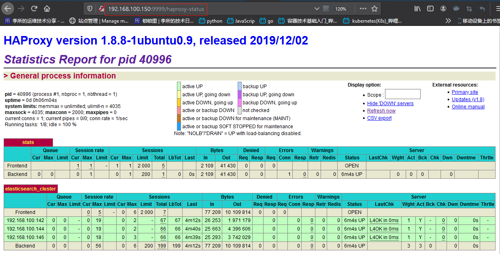

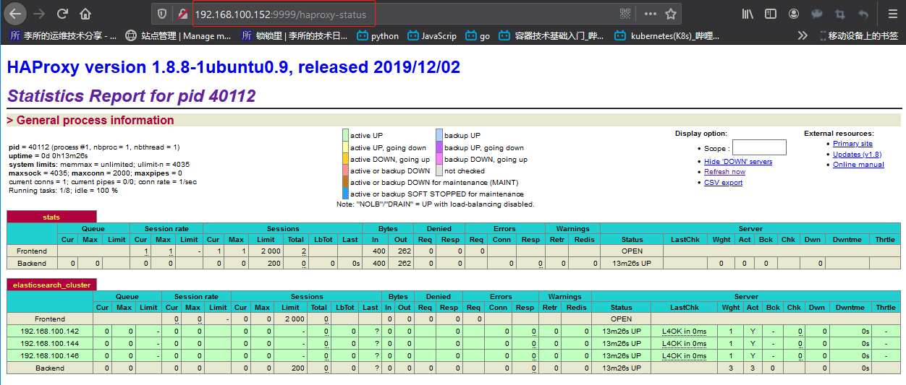

### 5.3.2 访问 VIP 查看 Kibana

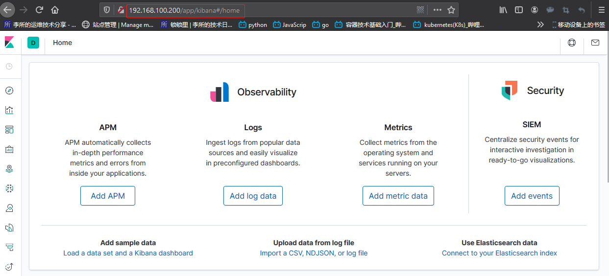

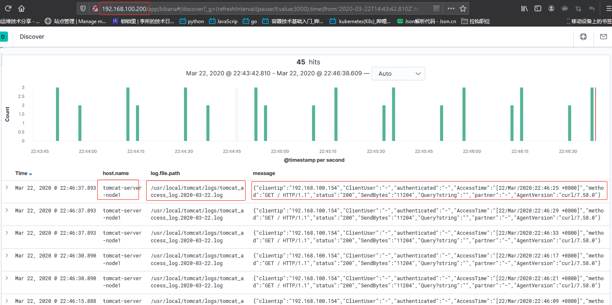

# 六. 通过 nginx 代理 Kibana

将 nginx 作为反向代理服务器，增加登录用户认证功能，有效避免无关人员随意访问 kibana 页面。

## 6.1 nginx 配置

```bash
root@tomcat-server-node1:~# cat /apps/nginx/conf/nginx.conf

worker_processes  1;

events {
    worker_connections  1024;
}

http {
    include       mime.types;
    default_type  application/octet-stream;

    log_format  access_json  '{"@timestamp":"$time_iso8601",'
        		     '"host":"$server_addr",'
        		     '"clientip":"$remote_addr",'
        		     '"size":$body_bytes_sent,'
        		     '"responsetime":$request_time,'
        		     '"upstreamtime":"$upstream_response_time",'
        		     '"upstreamhost":"$upstream_addr",'
        		     '"http_host":"$host",'
        		     '"url":"$uri",'
        		     '"domain":"$host",'
        		     '"xff":"$http_x_forwarded_for",'
        		     '"referer":"$http_referer",'
        		     '"status":"$status"}';

    access_log  logs/access.log  access_json;

    sendfile        on;
    keepalive_timeout  65;
    upstream kibana_server {
        server  192.168.100.142:5601 weight=1 max_fails=3 fail_timeout=60;
    }
    server {
        listen 80;
        server_name 192.168.100.150;
        location / {
        proxy_pass http://kibana_server;
        proxy_http_version 1.1;
        proxy_set_header Upgrade $http_upgrade;
        proxy_set_header Connection 'upgrade';
        proxy_set_header Host $host;
        proxy_cache_bypass $http_upgrade;
        }
       }
    }

root@tomcat-server-node1:~# nginx -t
nginx: the configuration file /apps/nginx/conf/nginx.conf syntax is ok
nginx: configuration file /apps/nginx/conf/nginx.conf test is successful
root@tomcat-server-node1:~# nginx -s reload
```

## 6.2 访问试试


## 6.3 登录认证配置

### 6.3.1 创建认证文件

```bash
# Centos
~# yum install httpd-tools

# Ubuntu
root@tomcat-server-node1:~# apt install apache-utils

root@tomcat-server-node1:~# htpasswd -bc  /apps/nginx/conf/htpasswd.users stevenux stevenux
Adding password for user stevenux
root@tomcat-server-node1:~# cat /apps/nginx/conf/htpasswd.users
stevenux:$apr1$xYOszdHs$b2GX4zCBNv6tuNj427WoT1
root@tomcat-server-node1:~# htpasswd -b  /apps/nginx/conf/htpasswd.users jack stevenux
Adding password for user jack
root@tomcat-server-node1:~# cat /apps/nginx/conf/htpasswd.users
stevenux:$apr1$xYOszdHs$b2GX4zCBNv6tuNj427WoT1
jack:$apr1$hfqwuymq$J4G86iNOyjUA08yMPhVU8.
```

### 6.3.2 nginx 配置

```bash
root@tomcat-server-node1:~# vim /apps/nginx/conf/nginx.conf
...
server {
        listen 80;
        server_name 192.168.100.150;
        auth_basic "Restricted Access";  # 添加这两翰
        auth_basic_user_file /apps/nginx/conf/htpasswd.users;
        location / {
        proxy_pass http://kibana_server;
        proxy_http_version 1.1;
        proxy_set_header Upgrade $http_upgrade;
        proxy_set_header Connection 'upgrade';
        proxy_set_header Host $host;
        proxy_cache_bypass $http_upgrade;
        }
...

root@tomcat-server-node1:~# nginx -t
nginx: the configuration file /apps/nginx/conf/nginx.conf syntax is ok
nginx: configuration file /apps/nginx/conf/nginx.conf test is successful
root@tomcat-server-node1:~# nginx -s reload
```

## 6.4 访问试试

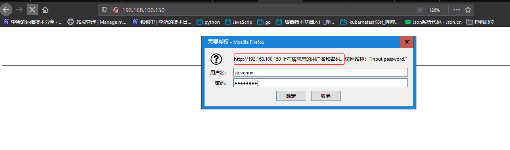

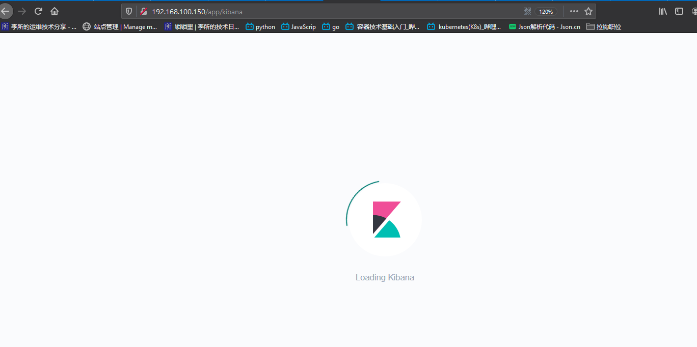


