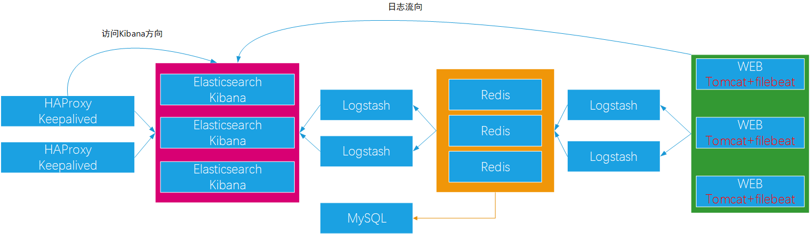
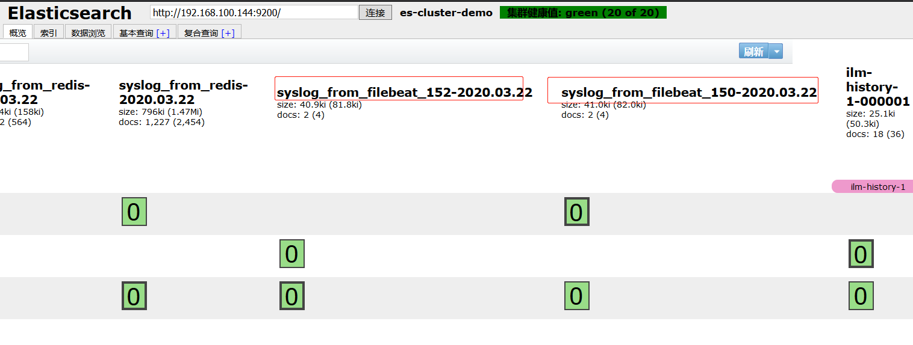
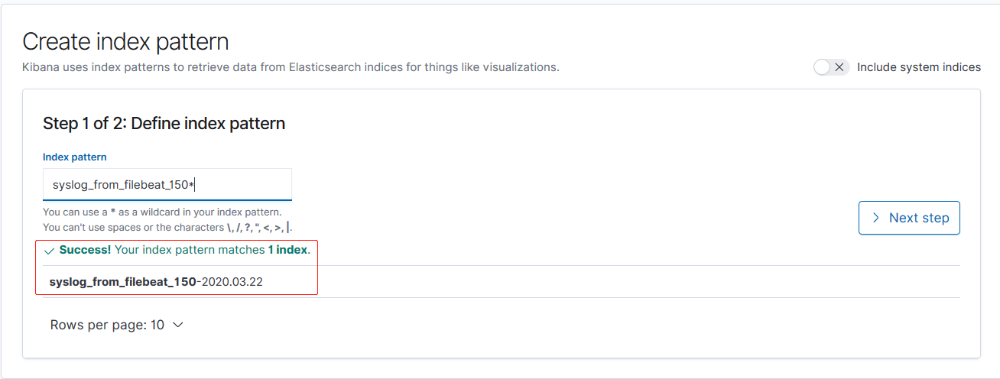
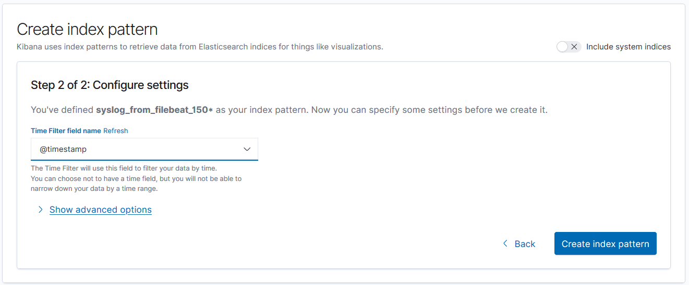
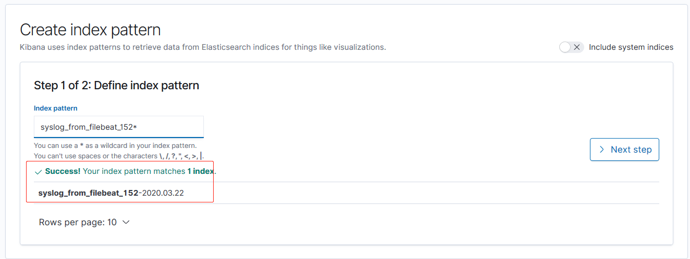
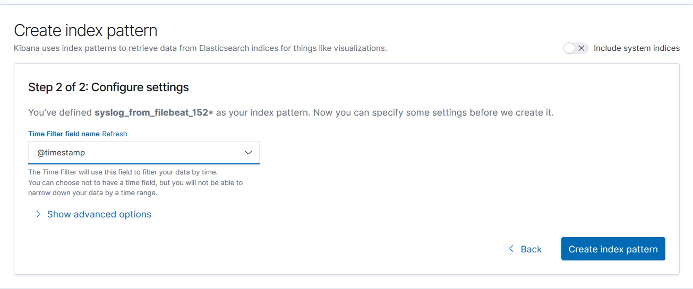
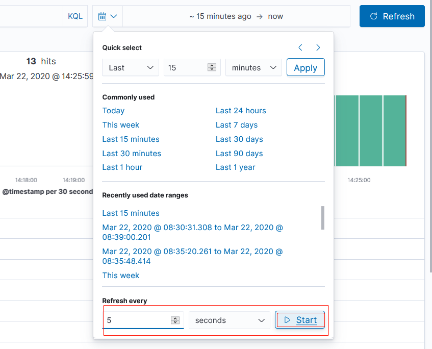
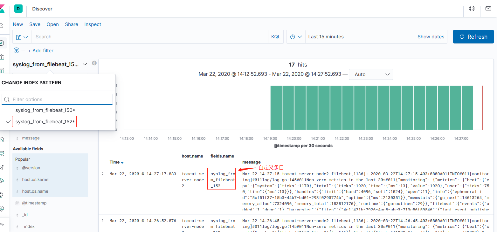
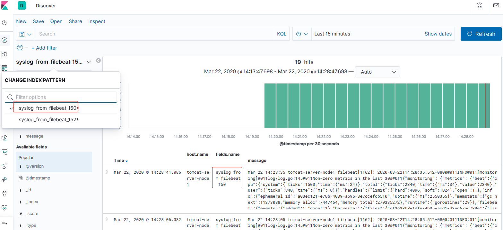

案例规划如下：



由于实验环境限制，将 filebeat 和 logstash 部署在 tomcat-server-nodeX，将 redis 和
写 ES 集群的 logstash 部署在 redis-server，将 HAproxy 和 Keepalived 部署在
tomcat-server-nodeX。将 Kibana 部署在 ES 集群主机。

环境：

| 主机名              | 核心 | RAM | IP              | 运行的服务                                 |
| :------------------ | :--- | :-- | :-------------- | :----------------------------------------- |
| es-server-node1     | 2    | 4G  | 192.168.100.142 | Elasticsearch、Kibana、Head、Cerebro       |
| es-server-node2     | 2    | 4G  | 192.168.100.144 | Elasticsearch 、Kibana                     |
| es-server-node3     | 2    | 4G  | 192.168.100.146 | Elasticsearch 、Kibana                     |
| tomcat-server-node1 | 2    | 2G  | 192.168.100.150 | logstash、filebeat、haproxy、tomcat        |
| tomcat-server-node2 | 2    | 2G  | 192.168.100.152 | logstash、filebeat、haproxy、nginx、tomcat |
| redis-server        | 2    | 2G  | 192.168.100.154 | redis、logstash、MySQL                     |

# 一. 基础环境说明

## 1.1 ES 和 logstash 需要 JAVA 环境

前提：关闭防火墙和 SELinux，时间同步

### ES 安装说明

不同的 ES 版本需要的依赖和说明，查看官方文档：
[ES 安装说明](https://www.elastic.co/guide/en/elasticsearch/reference/current/deb.html)

### Logstash 安装说明

不同的 ES 版本需要的依赖和说明，查看官方文档：
[Logstash 安装说明](https://www.elastic.co/guide/en/logstash/current/installing-logstash.html)

## 1.2 HAProxy 和 redis 及 nginx 编译基础工具安装

Ubuntu 安装：

```bash
apt -y purge ufw lxd lxd-client lxcfs liblxc-common
apt -y install iproute2 ntpdate tcpdump telnet traceroute nfs-kernel-server nfs-common lrzsz tree openssl libssl-dev libpcre3 libpcre3-dev zlib1g-dev  gcc make openssh-server  iotop unzip zip
```

CentOS7 安装：

```bash
yum -y install vim-enhanced tcpdump lrzsz tree telnet bash-completion net-tools wget bzip2 lsof tmux man-pages zip unzip nfs-utils gcc make gcc-c++ glibc glibc-devel pcre pcre-devel openssl  openssl-devel systemd-devel zlib-devel
```

# 二. 配置 filebeat 将数据通过 logstash 写入 redis

日志流动路径：
`tomcat-server:filebeat --> tomcat-server:logstash --> redis-server:redis`

## 2.1 filebeat 配置

### 2.1.1 tomcat-server-node1

[filebeat: logstash-output doc](https://www.elastic.co/guide/en/beats/filebeat/current/logstash-output.html)

```bash
root@tomcat-server-node1:~# ip addr sho eth0 | grep "inet "
    inet 192.168.100.150/24 brd 192.168.100.255 scope global eth0

root@tomcat-server-node1:~# vim /etc/filebeat/filebeat.yml
...
filebeat.inputs:
- type: log
  enabled: true
  paths:
    - /var/log/syslog
  document_type: system-log
  exclude_lines: ['^DBG']
  fields:
    name: syslog_from_filebeat_150  # 该值用来在logstash区分日志来源，以输出到不同目标或创建不同index(输出目标为elasticsearch时)
utput.logstash:
  hosts: ["192.168.100.150:5044"]
```

### 2.1.2 tomcat-server-node2

```bash
root@tomcat-server-node2:~# ip addr show eth0 | grep "inet "
    inet 192.168.100.152/24 brd 192.168.100.255 scope global eth0

root@tomcat-server-node2:~# vim /etc/filebeat/filebeat.yml
...
filebeat.inputs:
- type: log
  enabled: true
  paths:
    - /var/log/syslog
  document_type: system-log
  exclude_lines: ['^DBG']
  fields:
    name: syslog_from_filebeat_152
output.logstash:
  hosts: ["192.168.100.152:5044"]
...
```

## 2.2 logstash 配置

[logstash filebeat input plugin](https://www.elastic.co/guide/en/logstash/current/plugins-inputs-beats.html)
[logstash redis output plugin](https://www.elastic.co/guide/en/logstash/current/plugins-outputs-redis.html)

### 2.2.1 tomcat-server-node1

```bash
root@tomcat-server-node1:/etc/logstash/conf.d# cat syslog_from_filebeat.conf
input {
  beats {
    host => "192.168.100.150"
    port => "5044"
  }
}

output {
  redis {
    host => "192.168.100.154"
    port => "6379"
    db   => "1"
    key  => "syslog_150"
    data_type => "list"
    password  => "stevenux"
  }
}
```

重启 logstash：

```bash
~# systemctl restart logstash
```

### 2.2.2 tomca-server-node2

```bash
root@tomcat-server-node2:/etc/logstash/conf.d# cat syslog_from_filebeat.conf
input {
  beats {
    host => "192.168.100.152"
    port => "5044"
  }
}

output {
  redis {
    host => "192.168.100.154"
    port => "6379"
    db   => "1"
    key  => "syslog_152"
    data_type => "list"
    password  => "stevenux"
  }
}

```

重启 logstash：

```bash
~# systemctl restart logstash
```

## 2.3 redis 配置

### 2.3.1 关闭 RDB 和 AOF 数据持久

```bash
root@redis-server:/etc/logstash/conf.d# cat /usr/local/redis/redis.conf
...
bind 0.0.0.0
port 6379
daemonize yes
supervised no
pidfile /var/run/redis_6379.pid
loglevel notice
databases 16
# requirepass foobared  # 设置密码
#save 900  # 关闭RDB
#save 300
#save 60 10000
#dbfilename dump.rdb
appendonly no  # 关闭AOF
...
```

### 2.3.2 设置密码

开启 redis 后使用 redis-cli 设置密码，重启 redis 后失效：

```bash
127.0.0.1> CONFIG SET requirepass 'stevenux'
```

启动 redis：

```bash
root@redis-server:/etc/logstash/conf.d# /usr/local/redis/src/redis-server &
```

## 2.4 查看 logstash 和 filebeat 日志及 redis 数据

### 2.4.1 redis 数据

```bash
root@redis-server:~# redis-cli
127.0.0.1:6379> AUTH stevenux
OK
127.0.0.1:6379> SELECT 1
OK
127.0.0.1:6379[1]> KEYS *
1) "syslog_152"
2) "syslog_150"
127.0.0.1:6379[1]> LLEN syslog_152
(integer) 3760
127.0.0.1:6379[1]> LLEN syslog_150
(integer) 4125
127.0.0.1:6379[1]> LPOP syslog_152
"{\"agent\":{\"hostname\":\"tomcat-server-node2\",\"id\":\"93f937e9-e692-4434-8b83-7562f95ef976\",\"type\":\"filebeat\",\"version\":\"7.6.1\",\"ephemeral_id\":\"5cf51f37-15b3-44b7-bd01-293f0290774b\"},\"host\":{\"name\":\"tomcat-server-node2\",\"hostname\":\"tomcat-server-node2\",\"id\":\"e96c1092201442a4aeb7f67c5c417605\",\"architecture\":\"x86_64\",\"containerized\":false,\"os\":{\"codename\":\"bionic\",\"name\":\"Ubuntu\",\"platform\":\"ubuntu\",\"kernel\":\"4.15.0-55-generic\",\"family\":\"debian\",\"version\":\"18.04.3 LTS (Bionic Beaver)\"}},\"input\":{\"type\":\"log\"},\"@timestamp\":\"2020-03-22T05:52:07.572Z\",\"ecs\":{\"version\":\"1.4.0\"},\"tags\":[\"beats_input_codec_plain_applied\"],\"log\":{\"offset\":21760382,\"file\":{\"path\":\"/var/log/syslog\"}},\"message\":\"Mar 22 13:52:00 tomcat-server-node2 filebeat[1136]: 2020-03-22T13:52:00.256+0800#011ERROR#011pipeline/output.go:100#011Failed to connect to backoff(async(tcp://192.168.100.152:5044)): dial tcp 192.168.100.152:5044: connect: connection refused\",\"@version\":\"1\",\"fields\":{\"name\":\"syslog_from_filebeat_152\"}}"
127.0.0.1:6379[1]> LPOP syslog_150
"{\"@timestamp\":\"2020-03-22T05:46:08.122Z\",\"tags\":[\"beats_input_codec_plain_applied\"],\"fields\":{\"name\":\"syslog_from_filebeat_150\"},\"@version\":\"1\",\"agent\":{\"hostname\":\"tomcat-server-node1\",\"id\":\"93f937e9-e692-4434-8b83-7562f95ef976\",\"version\":\"7.6.1\",\"type\":\"filebeat\",\"ephemeral_id\":\"a03ec121-e70b-4039-a696-3e7ccefcb510\"},\"host\":{\"name\":\"tomcat-server-node1\",\"os\":{\"name\":\"Ubuntu\",\"platform\":\"ubuntu\",\"family\":\"debian\",\"kernel\":\"4.15.0-55-generic\",\"version\":\"18.04.3 LTS (Bionic Beaver)\",\"codename\":\"bionic\"},\"containerized\":false,\"architecture\":\"x86_64\",\"id\":\"e96c1092201442a4aeb7f67c5c417605\",\"hostname\":\"tomcat-server-node1\"},\"input\":{\"type\":\"log\"},\"ecs\":{\"version\":\"1.4.0\"},\"message\":\"Mar 22 13:11:57 tomcat-server-node1 kernel: [    0.000000]   2 disabled\",\"log\":{\"offset\":21567440,\"file\":{\"path\":\"/var/log/syslog\"}}}"
127.0.0.1:6379[1]>
```

### 2.4.2 logstash 日志

```bash
root@tomcat-server-node1:/etc/logstash/conf.d# tail /var/log/logstash/logstash-plain.log  -n66
...
[2020-03-22T13:49:33,428][INFO ][logstash.runner          ] Starting Logstash {"logstash.version"=>"7.6.1"}
[2020-03-22T13:49:35,044][INFO ][org.reflections.Reflections] Reflections took 35 ms to scan 1 urls, producing 20 keys and 40 values
[2020-03-22T13:49:35,573][WARN ][org.logstash.instrument.metrics.gauge.LazyDelegatingGauge][main] A gauge metric of an unknown type (org.jruby.RubyArray) has been create for key: cluster_uuids. This may result in invalid serialization.  It is recommended to log an issue to the responsible developer/development team.
[2020-03-22T13:49:35,603][INFO ][logstash.javapipeline    ][main] Starting pipeline {:pipeline_id=>"main", "pipeline.workers"=>2, "pipeline.batch.size"=>125, "pipeline.batch.delay"=>50, "pipeline.max_inflight"=>250, "pipeline.sources"=>["/etc/logstash/conf.d/syslog_from_filebeat.conf"], :thread=>"#<Thread:0xacd988b run>"}
[2020-03-22T13:49:36,337][INFO ][logstash.inputs.beats    ][main] Beats inputs: Starting input listener {:address=>"192.168.100.150:5044"}
[2020-03-22T13:49:36,354][INFO ][logstash.javapipeline    ][main] Pipeline started {"pipeline.id"=>"main"}
[2020-03-22T13:49:36,426][INFO ][logstash.agent           ] Pipelines running {:count=>1, :running_pipelines=>[:main], :non_running_pipelines=>[]}
[2020-03-22T13:49:36,482][INFO ][org.logstash.beats.Server][main] Starting server on port: 5044
[2020-03-22T13:49:36,728][INFO ][logstash.agent           ] Successfully started Logstash API endpoint {:port=>9600}
```

### 2.4.2 filebeat 日志

```bash
root@tomcat-server-node1:/etc/logstash/conf.d# tail /var/log/syslog  -n2
Mar 22 13:53:35 tomcat-server-node1 filebeat[1162]: 2020-03-22T13:53:35.082+0800#011INFO#011[monitoring]#011log/log.go:145#011Non-zero metrics in the last 30s#011{"monitoring": {"metrics": {"beat":{"cpu":{"system":{"ticks":990,"time":{"ms":6}},"total":{"ticks":1440,"time":{"ms":6},"value":1440},"user":{"ticks":450}},"handles":{"limit":{"hard":4096,"soft":1024},"open":11},"info":{"ephemeral_id":"a03ec121-e70b-4039-a696-3e7ccefcb510","uptime":{"ms":450355}},"memstats":{"gc_next":14313856,"memory_alloc":11135512,"memory_total":142802472},"runtime":{"goroutines":29}},"filebeat":{"events":{"added":1,"done":1},"harvester":{"files":{"cf3638b8-1dfe-4b35-acd1-d3ec67a6780e":{"last_event_published_time":"2020-03-22T13:53:07.351Z","last_event_timestamp":"2020-03-22T13:53:07.351Z","read_offset":1259,"size":1259}},"open_files":1,"running":1}},"libbeat":{"config":{"module":{"running":0}},"output":{"events":{"acked":1,"batches":1,"total":1},"read":{"bytes":6},"write":{"bytes":1134}},"pipeline":{"clients":1,"events":{"active":0,"published":1,"total":1},"queue":{"acked":1}}},"registrar":{"states":{"current":2,"update":1},"writes":{"success":1,"total":1}},"system":{"load":{"1":0.03,"15":0.41,"5":0.56,"norm":{"1":0.015,"15":0.205,"5":0.28}}}}}}
Mar 22 13:54:05 tomcat-server-node1 filebeat[1162]: 2020-03-22T13:54:05.082+0800#011INFO#011[monitoring]#011log/log.go:145#011Non-zero metrics in the last 30s#011{"monitoring": {"metrics": {"beat":{"cpu":{"system":{"ticks":990,"time":{"ms":4}},"total":{"ticks":1450,"time":{"ms":9},"value":1450},"user":{"ticks":460,"time":{"ms":5}}},"handles":{"limit":{"hard":4096,"soft":1024},"open":11},"info":{"ephemeral_id":"a03ec121-e70b-4039-a696-3e7ccefcb510","uptime":{"ms":480354}},"memstats":{"gc_next":14313856,"memory_alloc":12851080,"memory_total":144518040},"runtime":{"goroutines":29}},"filebeat":{"events":{"added":1,"done":1},"harvester":{"files":{"cf3638b8-1dfe-4b35-acd1-d3ec67a6780e":{"last_event_published_time":"2020-03-22T13:53:42.357Z","last_event_timestamp":"2020-03-22T13:53:42.357Z","read_offset":1245,"size":1245}},"open_files":1,"running":1}},"libbeat":{"config":{"module":{"running":0}},"output":{"events":{"acked":1,"batches":1,"total":1},"read":{"bytes":6},"write":{"bytes":1130}},"pipeline":{"clients":1,"events":{"active":0,"published":1,"total":1},"queue":{"acked":1}}},"registrar":{"states":{"current":2,"update":1},"writes":{"success":1,"total":1}},"system":{"load":{"1":0.02,"15":0.39,"5":0.5,"norm":{"1":0.01,"15":0.195,"5":0.25}}}}}}
```

# 三. 配置 logstash 取出 redis 数据写入 ES 集群

日志数据流动：
`redis-server: redis --> redis-server: logstash --> es-server-nodeX: elasticsearch`

## 3.1 logstash 配置

```bash
root@redis-server:/etc/logstash/conf.d# vim syslog_redis_to_es.conf
root@redis-server:/etc/logstash/conf.d# cat syslog_redis_to_es.conf
input {
  redis {
    host => "192.168.100.154"
    port => "6379"
    data_type => "list"
    db => "1"
    key => "syslog_150"
    password => "stevenux"
  }

  redis {
    host => "192.168.100.154"
    port => "6379"
    data_type => "list"
    db => "1"
    key => "syslog_152"
    password => "stevenux"
  }

}

output {

  if [fields][name] == "syslog_from_filebeat_150" {   # 该判断值在filebeat配置文件中定义
    elasticsearch {
      hosts => ["192.168.100.144:9200"]
      index => "syslog_from_filebeat_150-%{+YYYY.MM.dd}"
    }
  }

  if [fields][name] == "syslog_from_filebeat_152" {
    elasticsearch {
      hosts => ["192.168.100.144:9200"]
      index => "syslog_from_filebeat_152-%{+YYYY.MM.dd}"
    }
  }

}

```

测试语法：

```bash
root@redis-server:/etc/logstash/conf.d# pwd
/etc/logstash/conf.d
root@redis-server:/etc/logstash/conf.d# /usr/share/logstash/bin/logstash -f syslog_redis_to_es.conf -t
```

启动 logstash：

```bash
root@redis-server:/etc/logstash/conf.d# systemctl restart logstash
```

查看 redis 数据是否被取走：

```bash
127.0.0.1:6379[1]> KEYS *
1) "syslog_152"
2) "syslog_150"
127.0.0.1:6379[1]> llen syslog_152
(integer) 3804
127.0.0.1:6379[1]> llen syslog_152
(integer) 3804
127.0.0.1:6379[1]> KEYS *
1) "syslog_152"
2) "syslog_150"
127.0.0.1:6379[1]> llen syslog_152
(integer) 3805
127.0.0.1:6379[1]> llen syslog_152
(integer) 3808
127.0.0.1:6379[1]> KEYS *
1) "syslog_152"
2) "syslog_150"
127.0.0.1:6379[1]> KEYS *
1) "syslog_152"
2) "syslog_150"
127.0.0.1:6379[1]> KEYS *
1) "syslog_152"
2) "syslog_150"
127.0.0.1:6379[1]> KEYS *
(empty list or set)   # gone
127.0.0.1:6379[1]> KEYS *
(empty list or set)
127.0.0.1:6379[1]> KEYS *
(empty list or set)
```

## 3.2 查看 head 是否生成 index



## 3.3 在 Kibana 查看















# 四.将日志写入 MySQL

写入数据库的目的是用于持久化保存重要数据，比如状态码、客户端 IP、客户
端浏览器版本等等，用于后期按月做数据统计等。

## 4.1 安装 MySQL

使用 apt 安装：

```bash
root@redis-server:~# apt install mysql-server
root@redis-server:~# mysql
Welcome to the MySQL monitor.  Commands end with ; or \g.
Your MySQL connection id is 2
Server version: 5.7.29-0ubuntu0.18.04.1 (Ubuntu)
...
mysql> ALTER USER user() IDENTIFIED BY 'stevenux';  # 更root密码
Query OK, 0 rows affected (0.00 sec)

mysql> FLUSH PRIVILEGES;
Query OK, 0 rows affected (0.00 sec)

mysql>
```

## 4.2 创建 logstash 用户并授权

### 4.2.1 创建数据库和用户授权

授权 `logstash` 用户访问数据库，将数据存入新建的数据库 `log_data`:

```bash
...
mysql> CREATE DATABASE log_data  CHARACTER SET utf8 COLLATE utf8_bin;
Query OK, 1 row affected (0.00 sec)

mysql> GRANT ALL PRIVILEGES ON log_data.* TO logstash@"%" IDENTIFIED BY 'stevenux';
Query OK, 0 rows affected, 1 warning (0.00 sec)

mysql> FLUSH PRIVILEGES;
Query OK, 0 rows affected (0.00 sec)

mysql>
```

### 4.2.2 测试 logstash 用户连接数据库

```bash
root@redis-server:~# mysql -ulogstash -p
Enter password: (stevenux)
Welcome to the MySQL monitor.  Commands end with ; or \g.
Your MySQL connection id is 5
Server version: 5.7.29-0ubuntu0.18.04.1 (Ubuntu)
...

mysql> SHOW DATABASES;
+--------------------+
| Database           |
+--------------------+
| information_schema |
| log_data           |
+--------------------+
2 rows in set (0.00 sec)

mysql>
```

## 4.3 配置 logstash 连接数据库

logstash 连接 MySQL 数据库需要使用 MySQL 官方的 JDBC 驱动程序`MySQL Connector/J`。
MySQL Connector/J 是 MySQL 官方 JDBC 驱动程序，JDBC(Java Data Base Connectivity)
java 数据库连接器，是一种用于执行 SQL 语句的 Java API，可以为多种关系数据库提供
统一访问，它由一组用 Java 语言编写的类和接口组成。

[JDBC 官方下载地址-各种语言](https://dev.mysql.com/downloads/connector/)


# 五. 通过 HAProxy 代理 Kibana

# 六. 通过 nginx 代理 Kibana

```

```
