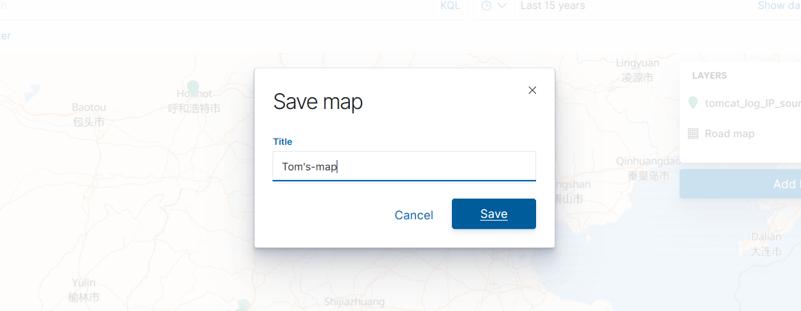

# 一. 下载 GeoLite-City 位置库

到 maxmind 官网注册并下载 GeoLite-City 地图位置库，解压到`/etc/logstash` 文件夹下。
[maxmind 官网](https://dev.maxmind.com/)

```bash
root@redis-server:/etc/logstash# tar xf GeoLite2-City_20200317.tar.gz

root@redis-server:/etc/logstash# cd GeoLite2-City_20200317/
root@redis-server:/etc/logstash/GeoLite2-City_20200317# ll
total 61508
drwxr-xr-x 2 root root     4096 Mar 18 07:30 ./
drwxrwxr-x 5 root root     4096 Mar 24 11:41 ../
-rw-r--r-- 1 root root       55 Mar 18 07:30 COPYRIGHT.txt

# 在logstash从redis取数据时使用该库添加附加的信息，如IP对应的经纬度。
-rw-r--r-- 1 root root 62961742 Mar 18 07:30 GeoLite2-City.mmdb
-rw-r--r-- 1 root root      398 Mar 18 07:30 LICENSE.txt
-rw-r--r-- 1 root root      116 Mar 18 07:30 README.txt
```

# 二. 配置 logstash

[logstash filter geoip 插件说明](https://www.elastic.co/guide/en/logstash/current/plugins-filters-geoip.html)

```bash
root@redis-server:/etc/logstash# vim conf.d/geolite_tomcat_access.conf

input {
  file {
    start_position => "beginning"
    path => "/etc/logstash/access.log"
    codec => "json"
    type => "tom_log"
  }
}


filter {
  if [type] == "tom_log"  {
    geoip {
      source => "clientip"
      target => "geoip"
      #database => "/etc/logstash/GeoLite2-City_20190723/GeoLite2-City.mmdb"
      database => "/etc/logstash/GeoLite2-City_20200317/GeoLite2-City.mmdb"
      add_field => [ "[geoip][coordinates]", "%{[geoip][longitude]}" ]
      add_field => [ "[geoip][coordinates]", "%{[geoip][latitude]}" ]
    }
    mutate {
      convert => [ "[geoip][coordinates]", "float"]
    }
  }
}


output {
  #stdout {
  #  codec => "rubydebug"
  #}
  if [type] == "tom_log"  {
    elasticsearch {
      hosts => ["192.168.100.144:9200"]
      index => "logstash-region-geoip-tomlog"
    }
  }
}

root@redis-server:/etc/logstash# systemctl restart logstash
```

# 三. 在 Kibana 添加 index pattern

## 3.1 查看 head


## 3.2 添加到 Kibana


# 四. 绘制 IP 坐标地图

此处使用 Kibana7.5.1 绘制：

点击左边的地图：


选择来自文档(Documents):


添加图层(Layer)，选择带有 GeoLite 提供的 IP 位置信息的 index pattern：


选择 Geospatial Filed：


自定义图层：


查看：


自定义图标：


保存该地图：


保存：


中国的访问情况：


全球的访问情况：

