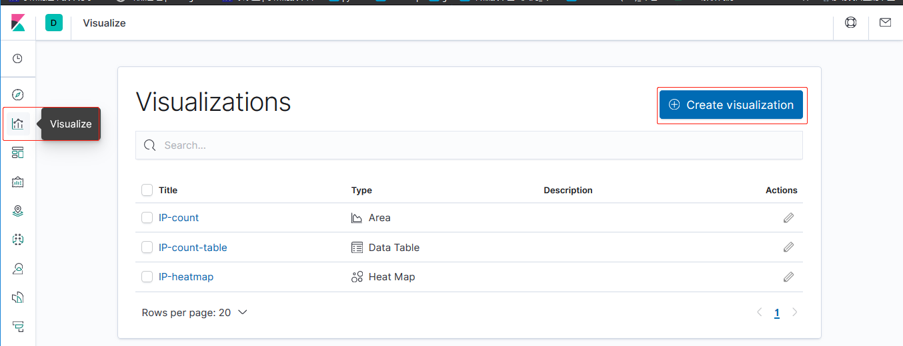
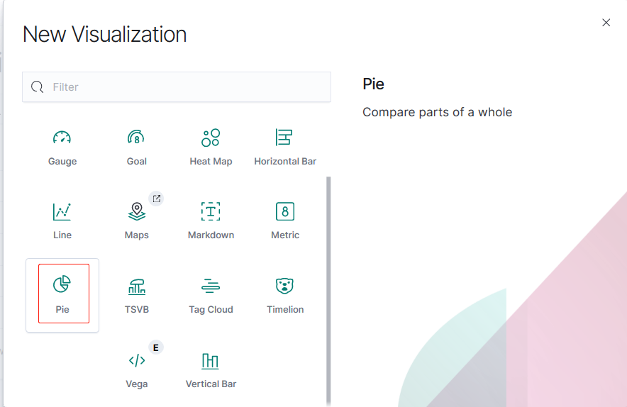

# 面积图-area

选择可视化：

选择面积图：

添加 index pattern 后选择添加 Buckets 添加一个 X 轴：

选择使用词(Terms)作为域(Field)的来源，安装该域的相同的值计数排序，
设置 50 个不同的值用于计数：

保存：

# 数据表-datatable

选择可视化：

选择数据表：

选择 index pattern：

点击按钮更新：

保存：

# 热力图-heatmap-chart

选择可视化：

选择热力图：

点击按钮更新：

效果：

自定义数据范围：

保存：

# 折线图-line-chart

选择可视化：

选择 line chart：

保存：

# markdown 渲染图

选择 markdown：

直接写 markdown 格式的文本即可：

保存：

# 饼图-pie-chart

选择 pie：

保存：

# 垂直条形图-vertical-bar-chart

选择 vertical bar：

保存：

# DashBoard

## 新建一个 dashboard

## 添加图表对象到 dashboard

## 添加完后的效果

## 保存 dashboard

## 进入一个 dashboard

## 全屏效果

