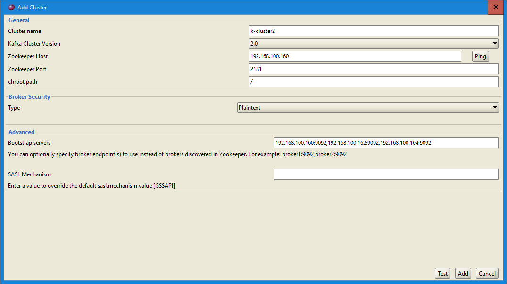
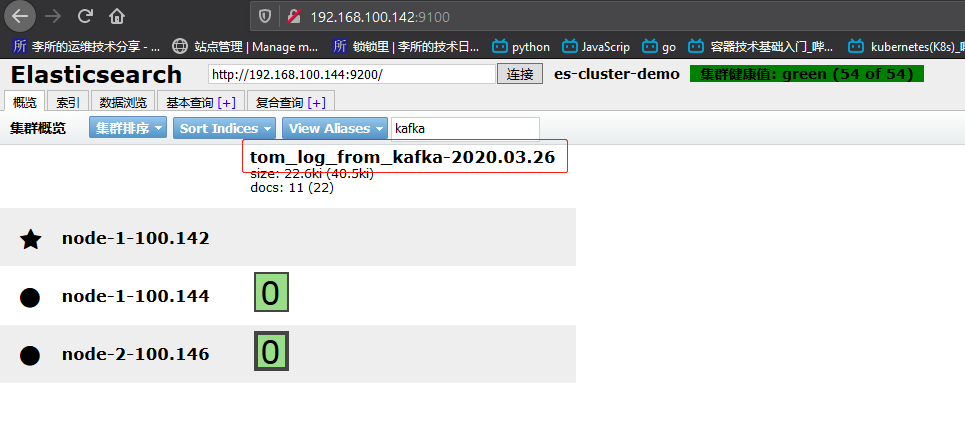

环境：

| 主机名              | IP              | 运行的服务                              |
| :------------------ | :-------------- | :-------------------------------------- |
| es-server-node1     | 192.168.100.142 | Elasticsearch、Head、Cerebro            |
| es-server-node2     | 192.168.100.144 | Elasticsearch 、Logstash                |
| es-server-node3     | 192.168.100.146 | Elasticsearch 、Kibana                  |
| zoo-server-node1    | 192.168.100.160 | zookeeper,kafka                         |
| zoo-server-node2    | 192.168.100.162 | zookeeper,kafka                         |
| zoo-server-node3    | 192.168.100.164 | zookeeper,kafka                         |
| tomcat-server-node1 | 192.168.100.150 | tomcat,dubbo-provider,logstash,filebeat |
| tomcat-server-node2 | 192.168.100.152 | tomcat,dubbo-consumer,logstash,filebeat |

将下图的 redis 换为 kafka


日志数据流：
tomcat-server-node1:`filebeat` --> tomcat-server-node2:`logstash` -->
zoo-server-nodeX:`kafka` --> es-server-node2:`logstash` --> es-server-nodeX:`elasticsearch`

# 一.tomcat-server-node1

filebeat 配置：

```bash
root@tomcat-server-node1:~# cat /etc/filebeat/filebeat.yml
filebeat.inputs:
- type: log
  enabled: true
  paths:
    - /usr/local/tomcat/logs/tomcat_access_log.2020-03-26.log
  document_type: tomcat-log
  exclude_lines: ['^DBG']
  fields:
    name: tom_from_filebeat_150
...
output.logstash:
#  # The Logstash hosts
  codec.json:
#    pretty: true
  hosts: ["192.168.100.152:5044"]
...
```

# 二.tomcat-server-node2

logstash 配置：

```bash
root@tomcat-server-node2:/etc/logstash/conf.d# cat tom_from_filebeat_to_kafka.conf
input {
  beats {
    host => "192.168.100.152"
    port => "5044"
  }
}

output {
  #stdout {
  #  codec => "rubydebug"
  #}
  kafka {
    bootstrap_servers => "192.168.100.160:9092,192.168.100.162:9092,192.168.100.164:9092,"
    topic_id => "tom_log_from_150"
  }
}

```

# 三.zoo-server-node1

## 3.1 配置

zoo-server-node1 上 kafka 和 zookeeper 配置：

Kafka:

```bash
root@zoo-server-node1:~# grep "^[a-Z]" /usr/local/kafka/config/server.properties
broker.id=1
listeners=PLAINTEXT://192.168.100.160:9092
num.network.threads=3
num.io.threads=8
socket.send.buffer.bytes=102400
socket.receive.buffer.bytes=102400
socket.request.max.bytes=104857600
log.dirs=/usr/local/kafka/kafka-logs
num.partitions=1
num.recovery.threads.per.data.dir=1
offsets.topic.replication.factor=1
transaction.state.log.replication.factor=1
transaction.state.log.min.isr=1
log.retention.hours=168
log.segment.bytes=1073741824
log.retention.check.interval.ms=300000
zookeeper.connect=192.168.100.160:2181,192.168.100.162:2181,192.168.100.164:2181
zookeeper.connection.timeout.ms=6000
group.initial.rebalance.delay.ms=0
```

Zookeeper:

```bash
root@zoo-server-node1:~# grep "^[a-Z]" /usr/local/zookeeper/conf/zoo.cfg
tickTime=2000
initLimit=10
syncLimit=5
dataDir=/data/zookeeper
clientPort=2181
maxClientCnxns=128
autopurge.snapRetainCount=3
autopurge.purgeInterval=1
server.1=192.168.100.160:2888:3888
server.2=192.168.100.162:2888:3888
server.3=192.168.100.164:2888:3888
```

## 3.2 查看 kafka 数据

1. 在 kafka 集群中查看：

```bash
root@zoo-server-node1:~# /usr/local/kafka/bin/kafka-topics.sh --list --zookeeper 192.168.100.160:2181,192.168.100.162:2181,192.168.100.164:2181,
__consumer_offsets
hertopic
tom_log_from_150  # 已经生成topic
```

2. 使用 kafka Tools 2.0 在 windows 下查看数据：

点击文件，新建连接：


填好 bootstrap servers，点击测试：


测试成功，连接：


查看是否有名为`tom_log_from_150` 的 topic 节点和数据：


# 四.es-server-node2

es-server-node2 上的 logstash 配置：

```bash
root@es-server-node2:/etc/logstash/conf.d# vim tom_log_from_kafka_to_es.conf
...
root@es-server-node2:/etc/logstash/conf.d# cat tom_log_from_kafka_to_es.conf
input {
  kafka {
    bootstrap_servers => "192.168.100.160:9092"
    topics => "tom_log_from_150"
    consumer_threads => 1
    decorate_events => true
    codec => "json"
    auto_offset_reset => "latest"
  }

}

output {
  elasticsearch {
    hosts => ["192.168.100.142:9200"]
    index => "tom_log_from_kafka-%{+YYYY.MM.dd}"
  }

}

```

# 五.查看数据

## 5.1 查看 head 是否生成 index



## 5.2 查看 zookeeper 集群的消费者


## 5.3 查看 kafka 自己的 topic 信息


# 六.Kibana 添加 index pattern


