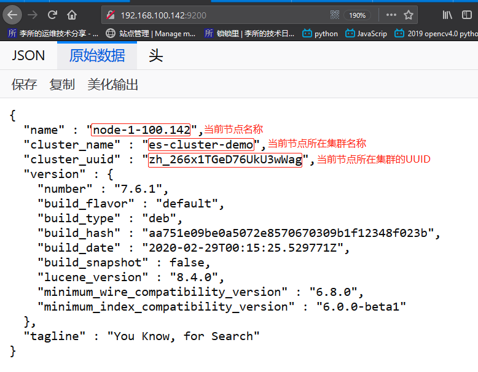
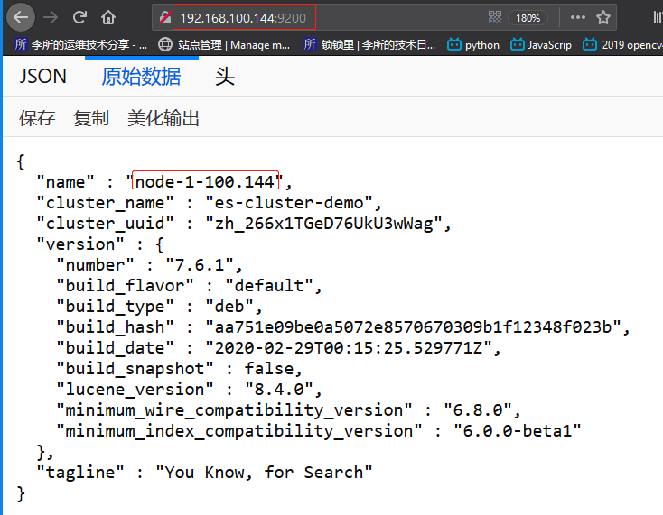
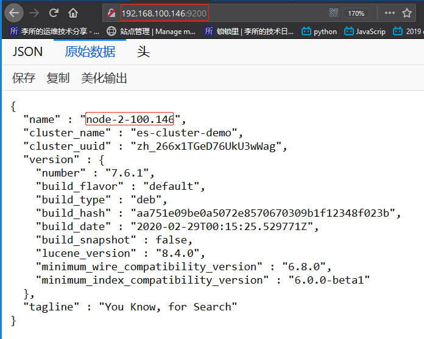
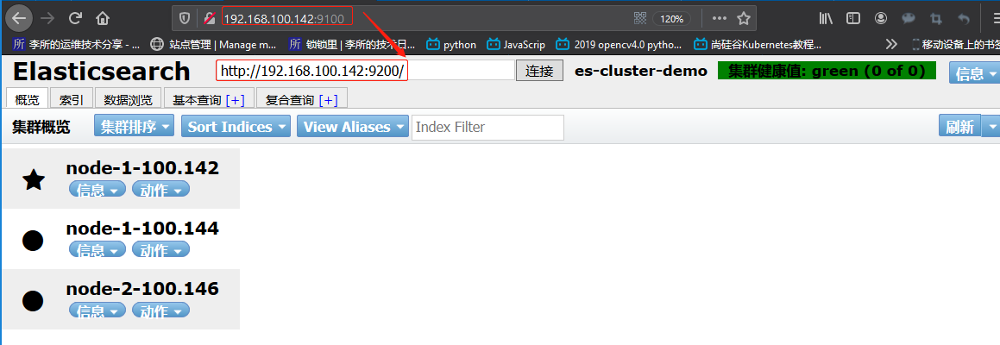
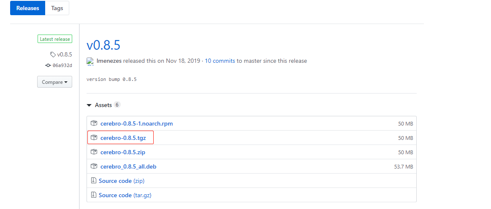
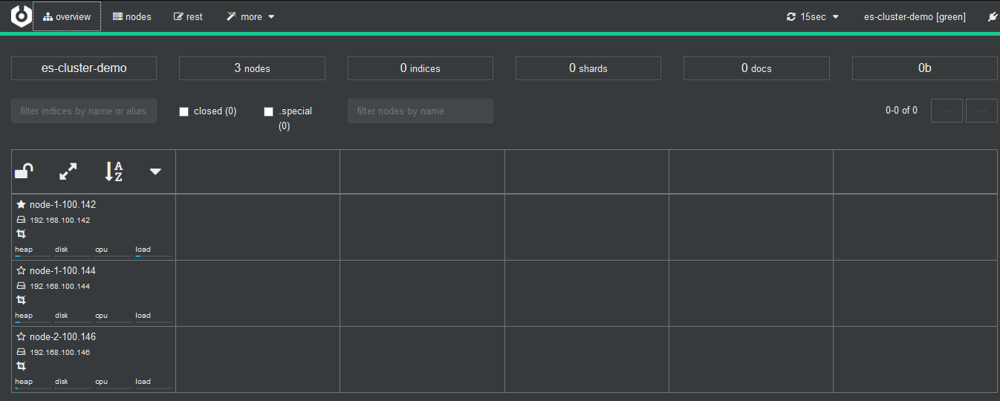
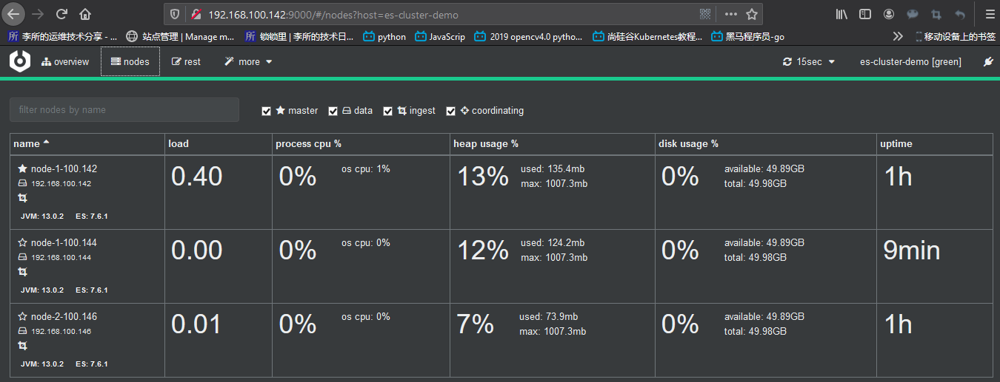
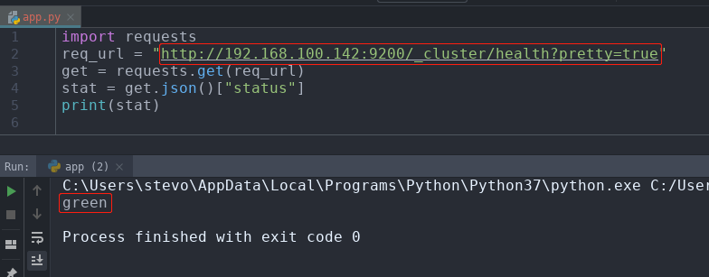

# 一. 部署前准备

最小化安装 Centos 7.x/Ubuntu x86_64 操作系统的虚拟机，vcpu 2，内存 4G 或更多，
操作系统盘 50G，主机名设置规则为 es-server-nodeX ， 额外添加一块单独的数据磁盘
大小为 50G 并格式化挂载到`/data/elk`目录来存储 ES 的数据和日志。

环境：

| 主机名          | IP              | 运行的服务                   |
| :-------------- | :-------------- | :--------------------------- |
| es-server-node1 | 192.168.100.142 | Elasticsearch、Head、Cerebro |
| es-server-node2 | 192.168.100.144 | Elasticsearch 、Logstash     |
| es-server-node3 | 192.168.100.146 | Elasticsearch 、Kibana       |

## 1.1 设置主机名和新增磁盘

设置主机名并重启:

```bash
~# hostnamectl set-hostname es-server-node1 && reboot
~# hostnamectl set-hostname es-server-node2 && reboot
~# hostnamectl set-hostname es-server-node3 && reboot
```

在各主机新增 50G 磁盘，并挂载到`/data/elk`目录:


```bash
root@es-server-node2:~# lsblk
NAME   MAJ:MIN RM  SIZE RO TYPE MOUNTPOINT
sda      8:0    0   40G  0 disk
└─sda1   8:1    0   40G  0 part /
sdb      8:16   0   50G  0 disk   # 新增的磁盘
sr0     11:0    1  900M  0 rom
root@es-server-node2:~# mkfs.xfs -L "ELK-data" /dev/sdb  # 创建文件系统
meta-data=/dev/sdb               isize=512    agcount=4, agsize=3276800 blks
         =                       sectsz=512   attr=2, projid32bit=1
         =                       crc=1        finobt=1, sparse=0, rmapbt=0, reflink=0
data     =                       bsize=4096   blocks=13107200, imaxpct=25
         =                       sunit=0      swidth=0 blks
naming   =version 2              bsize=4096   ascii-ci=0 ftype=1
log      =internal log           bsize=4096   blocks=6400, version=2
         =                       sectsz=512   sunit=0 blks, lazy-count=1
realtime =none                   extsz=4096   blocks=0, rtextents=0
root@es-server-node2:~# blkid
/dev/sr0: UUID="2019-08-05-18-43-22-00" LABEL="Ubuntu-Server 18.04.3 LTS amd64" TYPE="iso9660" PTUUID="4a427a6a" PTTYPE="dos"
/dev/sda1: UUID="20ac9956-a99b-4eb7-b10f-72da0e2df911" TYPE="ext4" PARTUUID="754f5135-01"
/dev/sdb: LABEL="ELK-data" UUID="f7fc3a36-5c5a-4746-8c26-7ac2fb30dbf9" TYPE="xfs"  # 获取UUID

root@es-server-node2:~# mkdir /data/elk -pv
mkdir: created directory '/data'
mkdir: created directory '/data/elk'

root@es-server-node2:~# vim /etc/fstab  # 编辑挂载文件
...
UUID="f7fc3a36-5c5a-4746-8c26-7ac2fb30dbf9" /data/elk/    xfs    defaults   0  0
...

root@es-server-node2:~# mount -a  # 挂载

root@es-server-node2:~# df -HT  # 查看
Filesystem     Type      Size  Used Avail Use% Mounted on
udev           devtmpfs  2.1G     0  2.1G   0% /dev
tmpfs          tmpfs     412M  9.8M  402M   3% /run
/dev/sda1      ext4       43G  5.7G   35G  15% /
tmpfs          tmpfs     2.1G     0  2.1G   0% /dev/shm
tmpfs          tmpfs     5.3M     0  5.3M   0% /run/lock
tmpfs          tmpfs     2.1G     0  2.1G   0% /sys/fs/cgroup
tmpfs          tmpfs     412M     0  412M   0% /run/user/0
/dev/sdb       xfs        54G   88M   54G   1% /data/elk  # 已经挂载
```

## 1.2 关闭防火墙和 SElinux

关闭所有服务器的火墙和 selinux，包括 web 服务器、redis 和 logstash 服务器。
此步骤是为了避免出现因为防火墙策略或 selinux 安全权限引起的各种未知问题。

```bash
~# systemctl disable firewalld
~# systemctl disable NetworkManager
~# sed -i '/SELINUX/s/enforcing/disabled/' /etc/selinux/config
~# echo "* soft nofile 65536" >> /etc/security/limits.conf
```

## 1.3 同步时间

```bash
~# ntpdate ntp.aliyun.com
```

## 1.4 内核参数和资源限制调整

分别在各 es-server-node 上配置：

```bash
~# vim /etc/sysctl.conf
...
vm.max_map_count = 262144
...

~# sysctl -p

~# vim /etc/security/limits.conf
...
*  soft nofile unlimited
*  hard nofile unlimited
*  soft memlock unlimited
*  hard memlock unlimited
...
```

更改上面的配置后，重启系统：

```bash
~# reboot
```

# 二. 部署 Elasticsearch 集群

## 2.1 下载 ES 的 deb 安装包并安装

[ES 各版本下载点](https://www.elastic.co/downloads/past-releases#elasticsearch)

```bash
root@es-server-node2:/usr/local/src# wget https://artifacts.elastic.co/downloads/elasticsearch/elasticsearch-7.6.1-amd64.deb

root@es-server-node2:/usr/local/src# dpkg -i elasticsearch-7.6.1-amd64.deb
```

## 2.2 编辑 ES 配置文件

```bash
root@es-server-node1:~# grep "^[a-Z]" /etc/elasticsearch/elasticsearch.yml
cluster.name: es-cluster-demo
node.name: node-1-100.142
path.data: /data/elk/esdata
path.logs: /data/elk/eslogs
bootstrap.memory_lock: true
network.host: 0.0.0.0
http.port: 9200
discovery.seed_hosts: ["192.168.100.142", "192.168.100.144", "192.168.100.146"]
cluster.initial_master_nodes: ["192.168.100.142", "192.168.100.144", "192.168.100.146"]
gateway.recover_after_nodes: 2
action.destructive_requires_name: true
http.cors.enabled: true
http.cors.allow-origin: "*"

root@es-server-node2:/usr/local/src# grep "^[a-Z]" /etc/elasticsearch/elasticsearch.yml
cluster.name: es-cluster-demo
node.name: node-1-100.140
path.data: /data/elk/esdata
path.logs: /data/elk/eslogs
bootstrap.memory_lock: true
network.host: 0.0.0.0
http.port: 9200
discovery.seed_hosts: ["192.168.100.142", "192.168.100.144", "192.168.100.146"]
cluster.initial_master_nodes: ["192.168.100.142", "192.168.100.144", "192.168.100.146"]
gateway.recover_after_nodes: 2
action.destructive_requires_name: true
http.cors.enabled: true
http.cors.allow-origin: "*"

root@es-server-node3:~# grep "^[a-Z]" /etc/elasticsearch/elasticsearch.yml
cluster.name: es-cluster-demo
node.name: node-2-100.146
path.data: /data/elk/esdata
path.logs: /data/elk/eslogs
bootstrap.memory_lock: true
network.host: 0.0.0.0
http.port: 9200
discovery.seed_hosts: ["192.168.100.142", "192.168.100.144", "192.168.100.146"]
cluster.initial_master_nodes: ["192.168.100.142", "192.168.100.144", "192.168.100.146"]
gateway.recover_after_nodes: 2
action.destructive_requires_name: true
http.cors.enabled: true
http.cors.allow-origin: "*"
```

## 2.3 启动各个 Elasticsearch 实例

启动：

```bash
root@es-server-node1:~# systemctl start elasticsearch.service
root@es-server-node2:~# systemctl start elasticsearch.service
root@es-server-node3:~# systemctl start elasticsearch.service
```

查看启动日志：

```bash
root@es-server-node1:~# tail /data/elk/eslogs/es-cluster-demo.log
[2020-03-17T15:30:11,173][INFO ][o.e.t.TransportService   ] [node-1-100.142] publish_address {192.168.100.142:9300}, bound_addresses {[::]:9300}
[2020-03-17T15:30:11,381][INFO ][o.e.b.BootstrapChecks    ] [node-1-100.142] bound or publishing to a non-loopback address, enforcing bootstrap checks
[2020-03-17T15:30:11,621][INFO ][o.e.c.c.Coordinator      ] [node-1-100.142] setting initial configuration to VotingConfiguration{Q-_aRyUgRcyoV1Nu9bzXUQ,XusEfx2jTXiXppt1hFi9JA,Ltga74JkRIuIybyz8vrWhw}
[2020-03-17T15:30:11,856][INFO ][o.e.c.s.ClusterApplierService] [node-1-100.142] master node changed {previous [], current [{node-1-100.140}{Ltga74JkRIuIybyz8vrWhw}{wprheu5OSfuWPVHNjsiGbA}{192.168.100.144}{192.168.100.144:9300}{dilm}{ml.machine_memory=4112027648, ml.max_open_jobs=20, xpack.installed=true}]}, added {{node-1-100.140}{Ltga74JkRIuIybyz8vrWhw}{wprheu5OSfuWPVHNjsiGbA}{192.168.100.144}{192.168.100.144:9300}{dilm}{ml.machine_memory=4112027648, ml.max_open_jobs=20, xpack.installed=true},{node-2-100.146}{XusEfx2jTXiXppt1hFi9JA}{AzN68NrESTaPj9nriIH0Bg}{192.168.100.146}{192.168.100.146:9300}{dilm}{ml.machine_memory=4112027648, ml.max_open_jobs=20, xpack.installed=true}}, term: 3, version: 25, reason: ApplyCommitRequest{term=3, version=25, sourceNode={node-1-100.140}{Ltga74JkRIuIybyz8vrWhw}{wprheu5OSfuWPVHNjsiGbA}{192.168.100.144}{192.168.100.144:9300}{dilm}{ml.machine_memory=4112027648, ml.max_open_jobs=20, xpack.installed=true}}
[2020-03-17T15:30:12,016][INFO ][o.e.x.s.a.TokenService   ] [node-1-100.142] refresh keys
[2020-03-17T15:30:12,171][INFO ][o.e.x.s.a.TokenService   ] [node-1-100.142] refreshed keys
[2020-03-17T15:30:12,196][INFO ][o.e.l.LicenseService     ] [node-1-100.142] license [61a2b087-a872-42d3-b789-5871f5f93d81] mode [basic] - valid
[2020-03-17T15:30:12,197][INFO ][o.e.x.s.s.SecurityStatusChangeListener] [node-1-100.142] Active license is now [BASIC]; Security is disabled
[2020-03-17T15:30:12,224][INFO ][o.e.h.AbstractHttpServerTransport] [node-1-100.142] publish_address {192.168.100.142:9200}, bound_addresses {[::]:9200}
[2020-03-17T15:30:12,225][INFO ][o.e.n.Node               ] [node-1-100.142] started

root@es-server-node2:~# tail /data/elk/eslogs/es-cluster-demo.log -n44
[2020-03-17T15:29:03,020][INFO ][o.e.x.s.a.s.FileRolesStore] [node-1-100.140] parsed [0] roles from file [/etc/elasticsearch/roles.yml]
[2020-03-17T15:29:03,557][INFO ][o.e.x.m.p.l.CppLogMessageHandler] [node-1-100.140] [controller/1353] [Main.cc@110] controller (64 bit): Version 7.6.1 (Build 6eb6e036390036) Copyright (c) 2020 Elasticsearch BV
[2020-03-17T15:29:04,428][DEBUG][o.e.a.ActionModule       ] [node-1-100.140] Using REST wrapper from plugin org.elasticsearch.xpack.security.Security
[2020-03-17T15:29:04,670][INFO ][o.e.d.DiscoveryModule    ] [node-1-100.140] using discovery type [zen] and seed hosts providers [settings]
[2020-03-17T15:29:06,307][INFO ][o.e.n.Node               ] [node-1-100.140] initialized
[2020-03-17T15:29:06,308][INFO ][o.e.n.Node               ] [node-1-100.140] starting ...
[2020-03-17T15:29:06,497][INFO ][o.e.t.TransportService   ] [node-1-100.140] publish_address {192.168.100.144:9300}, bound_addresses {[::]:9300}
[2020-03-17T15:29:06,904][INFO ][o.e.b.BootstrapChecks    ] [node-1-100.140] bound or publishing to a non-loopback address, enforcing bootstrap checks
[2020-03-17T15:29:06,922][INFO ][o.e.c.c.Coordinator      ] [node-1-100.140] cluster UUID [zh_266x1TGeD76UkU3wWag]
[2020-03-17T15:29:07,057][INFO ][o.e.c.s.MasterService    ] [node-1-100.140] elected-as-master ([1] nodes joined)[{node-1-100.140}{Ltga74JkRIuIybyz8vrWhw}{wprheu5OSfuWPVHNjsiGbA}{192.168.100.144}{192.168.100.144:9300}{dilm}{ml.machine_memory=4112027648, xpack.installed=true, ml.max_open_jobs=20} elect leader, _BECOME_MASTER_TASK_, _FINISH_ELECTION_], term: 3, version: 21, delta: master node changed {previous [], current [{node-1-100.140}{Ltga74JkRIuIybyz8vrWhw}{wprheu5OSfuWPVHNjsiGbA}{192.168.100.144}{192.168.100.144:9300}{dilm}{ml.machine_memory=4112027648, xpack.installed=true, ml.max_open_jobs=20}]}
[2020-03-17T15:29:07,112][INFO ][o.e.c.s.ClusterApplierService] [node-1-100.140] master node changed {previous [], current [{node-1-100.140}{Ltga74JkRIuIybyz8vrWhw}{wprheu5OSfuWPVHNjsiGbA}{192.168.100.144}{192.168.100.144:9300}{dilm}{ml.machine_memory=4112027648, xpack.installed=true, ml.max_open_jobs=20}]}, term: 3, version: 21, reason: Publication{term=3, version=21}
[2020-03-17T15:29:07,182][INFO ][o.e.h.AbstractHttpServerTransport] [node-1-100.140] publish_address {192.168.100.144:9200}, bound_addresses {[::]:9200}
[2020-03-17T15:29:07,183][INFO ][o.e.n.Node               ] [node-1-100.140] started
[2020-03-17T15:29:12,869][INFO ][o.e.c.s.MasterService    ] [node-1-100.140] node-join[{node-2-100.146}{XusEfx2jTXiXppt1hFi9JA}{AzN68NrESTaPj9nriIH0Bg}{192.168.100.146}{192.168.100.146:9300}{dilm}{ml.machine_memory=4112027648, ml.max_open_jobs=20, xpack.installed=true} join existing leader], term: 3, version: 22, delta: added {{node-2-100.146}{XusEfx2jTXiXppt1hFi9JA}{AzN68NrESTaPj9nriIH0Bg}{192.168.100.146}{192.168.100.146:9300}{dilm}{ml.machine_memory=4112027648, ml.max_open_jobs=20, xpack.installed=true}}
[2020-03-17T15:29:12,946][INFO ][o.e.c.s.ClusterApplierService] [node-1-100.140] added {{node-2-100.146}{XusEfx2jTXiXppt1hFi9JA}{AzN68NrESTaPj9nriIH0Bg}{192.168.100.146}{192.168.100.146:9300}{dilm}{ml.machine_memory=4112027648, ml.max_open_jobs=20, xpack.installed=true}}, term: 3, version: 22, reason: Publication{term=3, version=22}
[2020-03-17T15:29:13,368][INFO ][o.e.l.LicenseService     ] [node-1-100.140] license [61a2b087-a872-42d3-b789-5871f5f93d81] mode [basic] - valid
[2020-03-17T15:29:13,369][INFO ][o.e.x.s.s.SecurityStatusChangeListener] [node-1-100.140] Active license is now [BASIC]; Security is disabled
[2020-03-17T15:29:13,376][INFO ][o.e.g.GatewayService     ] [node-1-100.140] recovered [0] indices into cluster_state
[2020-03-17T15:30:11,765][INFO ][o.e.c.s.MasterService    ] [node-1-100.140] node-join[{node-1-100.142}{Q-_aRyUgRcyoV1Nu9bzXUQ}{iDxrjY_WSCa78w_o-UQMVA}{192.168.100.142}{192.168.100.142:9300}{dilm}{ml.machine_memory=4112027648, ml.max_open_jobs=20, xpack.installed=true} join existing leader], term: 3, version: 25, delta: added {{node-1-100.142}{Q-_aRyUgRcyoV1Nu9bzXUQ}{iDxrjY_WSCa78w_o-UQMVA}{192.168.100.142}{192.168.100.142:9300}{dilm}{ml.machine_memory=4112027648, ml.max_open_jobs=20, xpack.installed=true}}
[2020-03-17T15:30:12,221][INFO ][o.e.c.s.ClusterApplierService] [node-1-100.140] added {{node-1-100.142}{Q-_aRyUgRcyoV1Nu9bzXUQ}{iDxrjY_WSCa78w_o-UQMVA}{192.168.100.142}{192.168.100.142:9300}{dilm}{ml.machine_memory=4112027648, ml.max_open_jobs=20, xpack.installed=true}}, term: 3, version: 25, reason: Publication{term=3, version=25}

root@es-server-node3:~# tail /data/elk/eslogs/es-cluster-demo.log
[2020-03-17T15:29:12,551][INFO ][o.e.b.BootstrapChecks    ] [node-2-100.146] bound or publishing to a non-loopback address, enforcing bootstrap checks
[2020-03-17T15:29:12,569][INFO ][o.e.c.c.Coordinator      ] [node-2-100.146] cluster UUID [zh_266x1TGeD76UkU3wWag]
[2020-03-17T15:29:12,925][INFO ][o.e.c.s.ClusterApplierService] [node-2-100.146] master node changed {previous [], current [{node-1-100.140}{Ltga74JkRIuIybyz8vrWhw}{wprheu5OSfuWPVHNjsiGbA}{192.168.100.144}{192.168.100.144:9300}{dilm}{ml.machine_memory=4112027648, ml.max_open_jobs=20, xpack.installed=true}]}, added {{node-1-100.140}{Ltga74JkRIuIybyz8vrWhw}{wprheu5OSfuWPVHNjsiGbA}{192.168.100.144}{192.168.100.144:9300}{dilm}{ml.machine_memory=4112027648, ml.max_open_jobs=20, xpack.installed=true}}, term: 3, version: 22, reason: ApplyCommitRequest{term=3, version=22, sourceNode={node-1-100.140}{Ltga74JkRIuIybyz8vrWhw}{wprheu5OSfuWPVHNjsiGbA}{192.168.100.144}{192.168.100.144:9300}{dilm}{ml.machine_memory=4112027648, ml.max_open_jobs=20, xpack.installed=true}}
[2020-03-17T15:29:12,953][INFO ][o.e.h.AbstractHttpServerTransport] [node-2-100.146] publish_address {192.168.100.146:9200}, bound_addresses {[::]:9200}
[2020-03-17T15:29:12,954][INFO ][o.e.n.Node               ] [node-2-100.146] started
[2020-03-17T15:29:13,174][INFO ][o.e.l.LicenseService     ] [node-2-100.146] license [61a2b087-a872-42d3-b789-5871f5f93d81] mode [basic] - valid
[2020-03-17T15:29:13,175][INFO ][o.e.x.s.s.SecurityStatusChangeListener] [node-2-100.146] Active license is now [BASIC]; Security is disabled
[2020-03-17T15:29:13,425][INFO ][o.e.x.s.a.TokenService   ] [node-2-100.146] refresh keys
[2020-03-17T15:29:13,579][INFO ][o.e.x.s.a.TokenService   ] [node-2-100.146] refreshed keys
[2020-03-17T15:30:11,703][INFO ][o.e.c.s.ClusterApplierService] [node-2-100.146] added {{node-1-100.142}{Q-_aRyUgRcyoV1Nu9bzXUQ}{iDxrjY_WSCa78w_o-UQMVA}{192.168.100.142}{192.168.100.142:9300}{dilm}{ml.machine_memory=4112027648, ml.max_open_jobs=20, xpack.installed=true}}, term: 3, version: 25, reason: ApplyCommitRequest{term=3, version=25, sourceNode={node-1-100.140}{Ltga74JkRIuIybyz8vrWhw}{wprheu5OSfuWPVHNjsiGbA}{192.168.100.144}{192.168.100.144:9300}{dilm}{ml.machine_memory=4112027648, ml.max_open_jobs=20, xpack.installed=true}}
```

# 三. 使用 Head 插件管理 ES 集群

[elasticsearch-head 插件官方镜像](https://hub.docker.com/r/mobz/elasticsearch-head/tags)

## 3.1 安装 Docker

在 es-server-node1 上使用 head 插件：

```bash
# step 1: 安装必要的一些系统工具
sudo apt-get update
sudo apt-get -y install apt-transport-https ca-certificates curl software-properties-common
# step 2: 安装GPG证书
curl -fsSL https://mirrors.aliyun.com/docker-ce/linux/ubuntu/gpg | sudo apt-key add -
# Step 3: 写入软件源信息
sudo add-apt-repository "deb [arch=amd64] https://mirrors.aliyun.com/docker-ce/linux/ubuntu $(lsb_release -cs) stable"
# Step 4: 更新并安装Docker-CE
sudo apt-get -y update
sudo apt-get -y install docker-ce

# 安装指定版本的Docker-CE:
# Step 1: 查找Docker-CE的版本:
# apt-cache madison docker-ce
#   docker-ce | 17.03.1~ce-0~ubuntu-xenial | https://mirrors.aliyun.com/docker-ce/linux/ubuntu xenial/stable amd64 Packages
#   docker-ce | 17.03.0~ce-0~ubuntu-xenial | https://mirrors.aliyun.com/docker-ce/linux/ubuntu xenial/stable amd64 Packages
# Step 2: 安装指定版本的Docker-CE: (VERSION例如上面的17.03.1~ce-0~ubuntu-xenial)
# sudo apt-get -y install docker-ce=[VERSION]
```

## 3.2 使用 Docker 运行 Head 插件

直接从 Docker 运行该插件：

```bash
root@es-server-node1:~# docker run -d -p 9100:9100 mobz/elasticsearch-head:5
Unable to find image 'mobz/elasticsearch-head:5' locally
5: Pulling from mobz/elasticsearch-head
75a822cd7888: Downloading [==============================================>    ]  47.57MB/51.36MB
57de64c72267: Download complete
4306be1e8943: Download complete
871436ab7225: Downloading [=======>                                           ]  18.86MB/129.8MB
0110c26a367a: Download complete
1f04fe713f1b: Download complete
723bac39028e: Downloading [=========================>                         ]  7.822MB/15.55MB
7d8cb47f1c60: Waiting
7328dcf65c42: Waiting
b451f2ccfb9a: Waiting
304d5c28a4cf: Waiting
4cf804850db1: Waiting
```

启动成功后验证 9100 端口：

```bash
root@es-server-node1:~# docker run -d -p 9100:9100 mobz/elasticsearch-head:5
Unable to find image 'mobz/elasticsearch-head:5' locally
5: Pulling from mobz/elasticsearch-head
75a822cd7888: Pull complete
57de64c72267: Pull complete
4306be1e8943: Pull complete
871436ab7225: Pull complete
0110c26a367a: Pull complete
1f04fe713f1b: Pull complete
723bac39028e: Pull complete
7d8cb47f1c60: Pull complete
7328dcf65c42: Pull complete
b451f2ccfb9a: Pull complete
304d5c28a4cf: Pull complete
4cf804850db1: Pull complete
Digest: sha256:55a3c82dd4ba776e304b09308411edd85de0dc9719f9d97a2f33baa320223f34
Status: Downloaded newer image for mobz/elasticsearch-head:5
a95d13d601b2d6bd02795e9f48330bb85077daf59259d33f7c97cf18e2e6cfde
root@es-server-node1:~# docker ps
CONTAINER ID        IMAGE                       COMMAND                  CREATED             STATUS              PORTS                    NAMES
a95d13d601b2        mobz/elasticsearch-head:5   "/bin/sh -c 'grunt s…"   3 minutes ago       Up 3 minutes        0.0.0.0:9100->9100/tcp   focused_wing
root@es-server-node1:~# lsof -i:9100
COMMAND     PID USER   FD   TYPE DEVICE SIZE/OFF NODE NAME
docker-pr 23627 root    4u  IPv6  68664      0t0  TCP *:9100 (LISTEN)
```

## 3.3 访问

### 3.3.1 在浏览器通过 9200 端口直接访问集群







### 3.3.2 访问 Head



# 四. 使用 Cerebro 插件管理 ES 集群

## 4.1 下载 Cerebro

[Cerebro-Github 项目地址](https://github.com/lmenezes/cerebro)
[Release-下载](https://github.com/lmenezes/cerebro/releases)



```bash
root@es-server-node1:/usr/local/src# wget https://github.com/lmenezes/cerebro/releases/download/v0.8.5/cerebro-0.8.5.tgz
```

## 4.2 安装

```bash
root@es-server-node1:/usr/local/src# tar xf cerebro-0.8.5.tgz
root@es-server-node1:/usr/local/src# cd cerebro-0.8.5/
root@es-server-node1:/usr/local/src/cerebro-0.8.5# ll
total 24
drwxr-xr-x 5  501 staff 4096 Nov 18 16:13 ./
drwxr-xr-x 3 root root  4096 Mar 17 16:34 ../
drwxr-xr-x 2  501 staff 4096 Mar 17 16:34 bin/
drwxr-xr-x 3  501 staff 4096 Nov 18 16:13 conf/
drwxr-xr-x 2  501 staff 4096 Mar 17 16:34 lib/
-rw-r--r-- 1  501 staff 2932 Nov 18 16:13 README.md
```

## 4.3 配置并启动

```bash
# 配置
root@es-server-node1:/usr/local/src/cerebro-0.8.5# vim conf/application.conf
...
# A list of known hosts
hosts = [
  {
    host = "http://192.168.100.142:9200"
    name = "es-cluster-demo"
    headers-whitelist = [ "x-proxy-user", "x-proxy-roles", "X-Forwarded-For" ]
  }
  ...
]

# 安装openjdk11
root@es-server-node1:/usr/local/src/cerebro-0.8.5# apt install openjdk-11-jdk

# 启动
root@es-server-node1:/usr/local/src/cerebro-0.8.5# ./bin/cerebro
WARNING: An illegal reflective access operation has occurred
WARNING: Illegal reflective access by com.google.inject.internal.cglib.core.$ReflectUtils$1 (file:/usr/local/src/cerebro-0.8.5/lib/com.google.inject.guice-4.2.2.jar) to method java.lang.ClassLoader.defineClass(java.lang.String,byte[],int,int,java.security.ProtectionDomain)
WARNING: Please consider reporting this to the maintainers of com.google.inject.internal.cglib.core.$ReflectUtils$1
WARNING: Use --illegal-access=warn to enable warnings of further illegal reflective access operations
WARNING: All illegal access operations will be denied in a future release
[info] play.api.Play - Application started (Prod) (no global state)
[info] p.c.s.AkkaHttpServer - Listening for HTTP on /0:0:0:0:0:0:0:0:9000
```

## 4.4 访问





# 五. ES 集群的简单监控

[ES 集群健康状态 API](https://www.elastic.co/guide/cn/elasticsearch/guide/current/_cluster_health.html)

使用`Cluster Health API`来获取当前某个节点所在集群的简要信息。使用该 API
的方式如下：

```bash
~# curl -sXGET http://IP:9200/_cluster/health?pretty=true

## 响应信息
{
  "cluster_name" : "es-cluster-demo",
  "status" : "green",
  "timed_out" : false,
  "number_of_nodes" : 3,
  "number_of_data_nodes" : 3,
  "active_primary_shards" : 0,
  "active_shards" : 0,
  "relocating_shards" : 0,
  "initializing_shards" : 0,
  "unassigned_shards" : 0,
  "delayed_unassigned_shards" : 0,
  "number_of_pending_tasks" : 0,
  "number_of_in_flight_fetch" : 0,
  "task_max_waiting_in_queue_millis" : 0,
  "active_shards_percent_as_number" : 100.0
}
```

响应信息中最重要的一块就是 status 字段。状态可能是下列三个值之一：

**green**
所有的主分片和副本分片都已分配。你的集群是 100% 可用的。
**yellow**
所有的主分片已经分片了，但至少还有一个副本是缺失的。不会有数据丢失，所以搜索
结果依然是完整的。不过，你的高可用性在某种程度上被弱化。如果更多的分片消失，
你就会丢数据了。把 yellow 想象成一个需要及时调查的警告。
**red**
至少一个主分片（以及它的全部副本）都在缺失中。这意味着你在缺少数据：搜索只能
返回部分数据，而分配到这个分片上的写入请求会返回一个异常。

## 5.1 使用 shell 脚本

```bash

```

## 5.2 使用 Python

在 windows 下使用 python 获取集群信息：

```bash
import requests
req_url = "http://192.168.100.142:9200/_cluster/health?pretty=true"
get = requests.get(req_url)
stat = get.json()["status"]
print(stat)
```



在 Linux 下使用 python：

```bash
root@es-server-node1:/data/elk/esdata# vim get_cluster_info.py
```

```py
#!/usr/bin/env python3
# Edited by suosuoli.cn on 2020.03.17
# This script is created for getting elasticsearch cluster info

import smtplib
import subprocess
from email.utils import formataddr
from email.mime.text import MIMEText

false=""
IP="192.168.100.142"
body="curl -sXGET http://" + IP + ":9200/_cluster/health?pretty=true"
pro=subprocess.Popen((body),shell=True,stdout=subprocess.PIPE)
data=pro.stdout.read()
tmp=eval(data)
stat=tmp.get("status")
nu_nodes=tmp.get("number_of_nodes")
act_pri_shard=tmp.get("active_primary_shards")
act_shard=tmp.get("active_shards")
unassigned_shard=tmp.get("unassigned_shards")

print("         集群状态：{}".format(stat))
print("       集群节点数：{}".format(nu_nodes))
print("集群中的主分片数量：{}".format(act_pri_shard))
print("集群中的所有分片数：{}".format(act_shard))
print("集群状态中存在而找不到的分片：{}".format(unassigned_shard))
```

## 5.3 添加到 zabbix 监控

略
