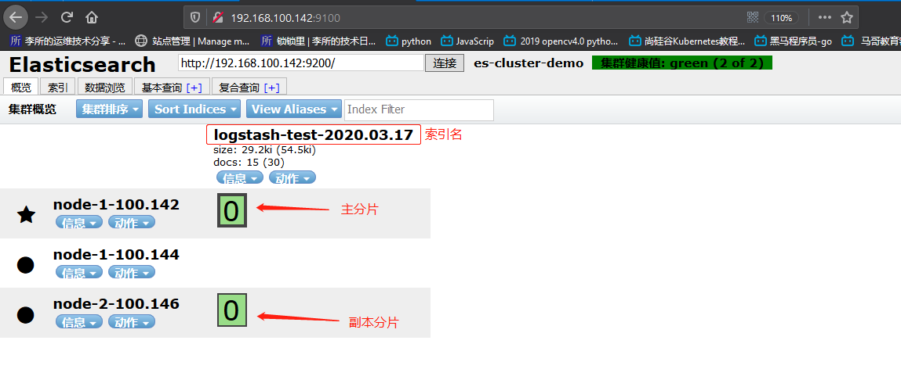
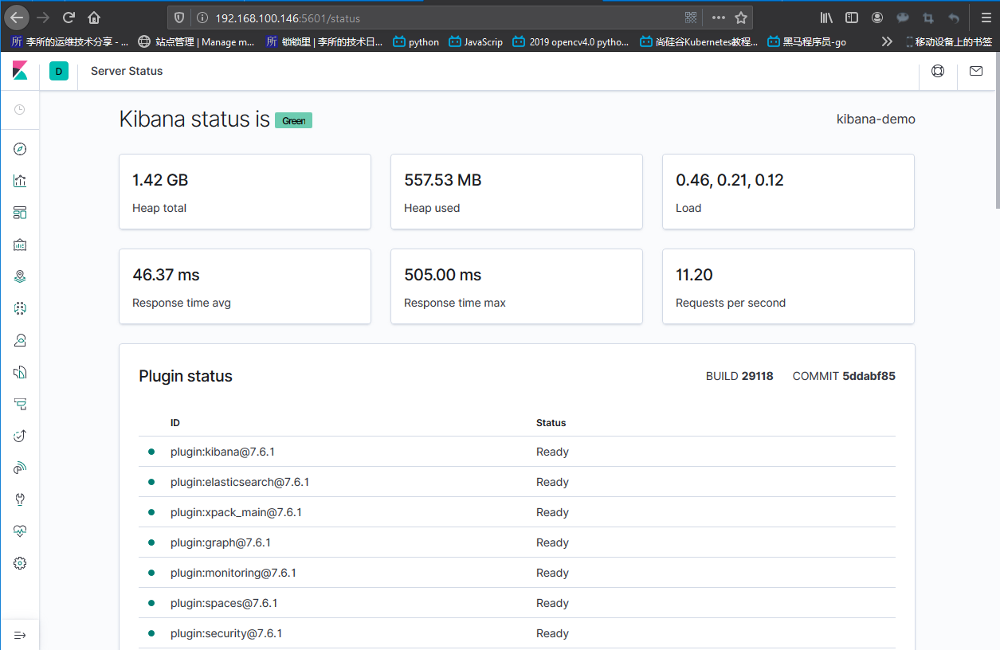
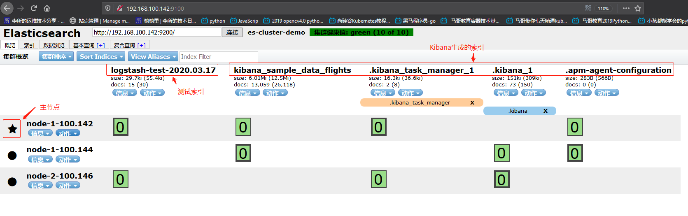
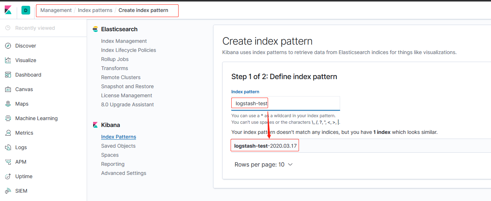
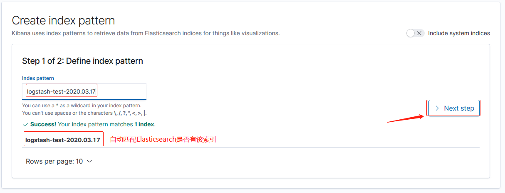
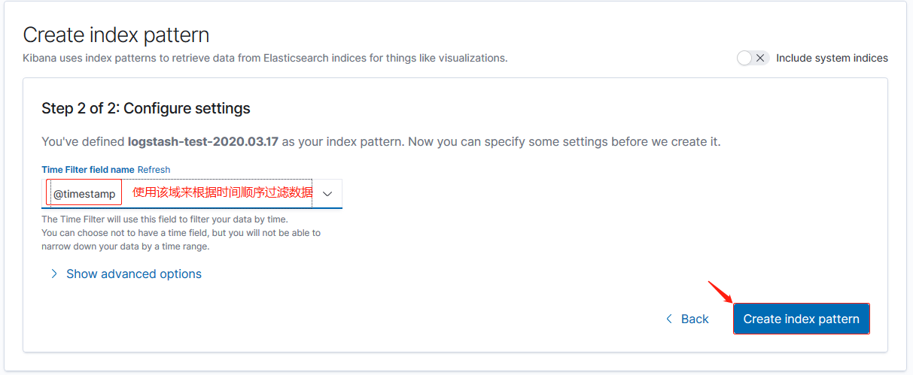
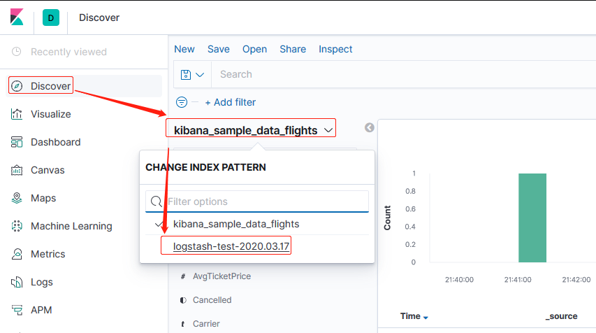
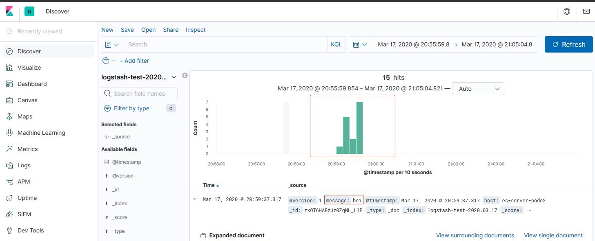
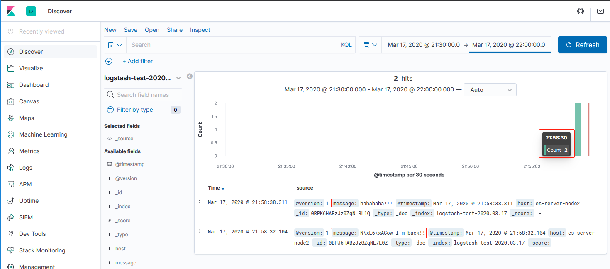

Logstash 是一个开源的数据收集引擎，可以水平伸缩，而且 logstash 在整个 ELK
stack 中是拥有最多插件的一个组件，其可以接收来自不同来源的数据并统一输出到指
定的且可以是多个不同目的地以方便下游的数据可视化和分析。

环境：

| 主机名          | IP              | 运行的服务                   |
| :-------------- | :-------------- | :--------------------------- |
| es-server-node1 | 192.168.100.142 | Elasticsearch、Head、Cerebro |
| es-server-node2 | 192.168.100.144 | Elasticsearch 、Logstash     |
| es-server-node3 | 192.168.100.146 | Elasticsearch 、Kibana       |

# 一. 环境准备及安装

logstash 需要 JAVA8 或者 JAVA11 环境，可以使用 oracle 的版本也可以使用 openjdk

## 1.1 环境准备

安装 java 环境

1. 方式一，安装 openjdk

```bash
# apt安装方式
root@es-server-node2:/usr/local/src# apt install openjdk-11-jdk

root@es-server-node2:/usr/local/src# java -version
openjdk version "11.0.6" 2020-01-14
OpenJDK Runtime Environment (build 11.0.6+10-post-Ubuntu-1ubuntu118.04.1)
OpenJDK 64-Bit Server VM (build 11.0.6+10-post-Ubuntu-1ubuntu118.04.1, mixed mode, sharing)
```

2. 方式二，二进制安装 oracle jdk

```bash
root@es-server-node3:/usr/local/src# tar xf jdk-8u241-linux-x64.tar.gz
root@es-server-node3:/usr/local/src# ln -sv /usr/local/src/jdk1.8.0_241 /usr/local/jdk
'/usr/local/jdk' -> '/usr/local/src/jdk1.8.0_241'

root@es-server-node3:/usr/local/src# vim /etc/profile
...
export JAVA_HOME="/usr/local/jdk"
export PATH="$JAVA_HOME/bin:$PATH"
...

root@es-server-node3:/usr/local/src# . /etc/profile

root@es-server-node3:/usr/local/src# java -version
java version "1.8.0_241"
Java(TM) SE Runtime Environment (build 1.8.0_241-b07)
Java HotSpot(TM) 64-Bit Server VM (build 25.241-b07, mixed mode)
```

## 1.2 安装 logstash

[logstash 各平台安装包下载](https://www.elastic.co/downloads/logstash)
[logstash 安装参考](https://www.elastic.co/guide/en/logstash/current/installing-logstash.html)

```bash
# 下载deb安装包
root@es-server-node2:/usr/local/src# wget https://artifacts.elastic.co/downloads/logstash/logstash-7.6.1.deb

# 安装
root@es-server-node2:/usr/local/src# dpkg -i logstash-7.6.1_.deb
(Reading database ... 101573 files and directories currently installed.)
Preparing to unpack logstash-7.6.1_.deb ...
Unpacking logstash (1:7.6.1-1) over (1:7.6.1-1) ...
Setting up logstash (1:7.6.1-1) ...
Using provided startup.options file: /etc/logstash/startup.options
...
Successfully created system startup script for Logstash

# 修改数据目录下的队列目录权限为logstash
root@es-server-node2:/usr/local/src# chown logstash.logstash /usr/share/logstash/data/queue -R
```

# 二. 测试数据收集

## 2.1 测试标准输入和输出

测试 logstash 从标准输入读取数据，将数据输出给标准输出：

```bash
# 测试一下：
root@es-server-node2:/usr/local/src# /usr/share/logstash/bin/logstash -e 'input { stdin {} } output { stdout {codec => rubydebug }}'
...
[INFO ] 2020-03-17 20:18:24.955 [LogStash::Runner] runner - Starting Logstash {"logstash.version"=>"7.6.1"}
[INFO ] 2020-03-17 20:18:26.179 [Converge PipelineAction::Create<main>] Reflections - Reflections took 30 ms to scan 1 urls, producing 20 keys and 40 values
[WARN ] 2020-03-17 20:18:26.626 [[main]-pipeline-manager] LazyDelegatingGauge - A gauge metric of an unknown type (org.jruby.RubyArray) has been create for key: cluster_uuids. This may result in invalid serialization.  It is recommended to log an issue to the responsible developer/development team.
[INFO ] 2020-03-17 20:18:26.630 [[main]-pipeline-manager] javapipeline - Starting pipeline {:pipeline_id=>"main", "pipeline.workers"=>2, "pipeline.batch.size"=>125, "pipeline.batch.delay"=>50, "pipeline.max_inflight"=>250, "pipeline.sources"=>["config string"], :thread=>"#<Thread:0x76fede95 run>"}
[INFO ] 2020-03-17 20:18:27.586 [[main]-pipeline-manager] javapipeline - Pipeline started {"pipeline.id"=>"main"}
The stdin plugin is now waiting for input:  # stdin插件开始等待输入
[INFO ] 2020-03-17 20:18:27.666 [Agent thread] agent - Pipelines running {:count=>1, :running_pipelines=>[:main], :non_running_pipelines=>[]}
[INFO ] 2020-03-17 20:18:27.849 [Api Webserver] agent - Successfully started Logstash API endpoint {:port=>9600}
Hello,logstash!This is a test message!  # 输入数据测试
{
       "message" => "Hello,logstash!This is a test message!",  # 输出的数据
          "host" => "es-server-node2",
      "@version" => "1",
    "@timestamp" => 2020-03-17T12:18:50.073Z
}
Nice!It works!  # 输入数据
{
       "message" => "Nice!It works!",  # 输出的数据
          "host" => "es-server-node2",
      "@version" => "1",
    "@timestamp" => 2020-03-17T12:19:03.777Z
}
...
```

## 2.2 测试将数据输出到文件

测试将来自标准输入的数据输出到某个文件保存：

```bash
root@es-server-node2:/usr/local/src# /usr/share/logstash/bin/logstash -e 'input { stdin {} } output { file { path => "/tmp/logstash-test-%{+YYYY.MM.dd}.log" }}'
...
[INFO ] 2020-03-17 20:24:40.885 [LogStash::Runner] runner - Starting Logstash {"logstash.version"=>"7.6.1"}
[INFO ] 2020-03-17 20:24:42.204 [Converge PipelineAction::Create<main>] Reflections - Reflections took 32 ms to scan 1 urls, producing 20 keys and
[WARN ] 2020-03-17 20:24:42.629 [[main]-pipeline-manager] LazyDelegatingGauge - A gauge metric of an unknown type (org.jruby.RubyArray) has been cro log an issue to the responsible developer/development team.
[INFO ] 2020-03-17 20:24:42.632 [[main]-pipeline-manager] javapipeline - Starting pipeline {:pipeline_id=>"main", "pipeline.workers"=>2, "pipeline.es"=>["config string"], :thread=>"#<Thread:0x7b36420a run>"}
[INFO ] 2020-03-17 20:24:43.300 [[main]-pipeline-manager] javapipeline - Pipeline started {"pipeline.id"=>"main"}
The stdin plugin is now waiting for input:
[INFO ] 2020-03-17 20:24:43.397 [Agent thread] agent - Pipelines running {:count=>1, :running_pipelines=>[:main], :non_running_pipelines=>[]}
[INFO ] 2020-03-17 20:24:43.561 [Api Webserver] agent - Successfully started Logstash API endpoint {:port=>9600}
This message will be in a file.  # 输入数据
[INFO ] 2020-03-17 20:25:02.435 [[main]>worker1] file - Opening file {:path=>"/tmp/logstash-test-2020.03.17.log"}  # 打开文件并写入数据
Bingo, you find this m[INFO ] 2020-03-17 20:25:12.637 [[main]>worker0] file - Closing file /tmp/logstash-test-2020.03.17.log  # 关闭文件
essage.
[INFO ] 2020-03-17 20:25:17.912 [[main]>worker1] file - Opening file {:path=>"/tmp/logstash-test-2020.03.17.log"}

The end.
[INFO ] 2020-03-17 20:25:52.731 [[main]>worker1] file - Closing file /tmp/logstash-test-2020.03.17.log
```

查看文件内容：文件内容为 json 格式，标准输入的数据为键`message`对应的值。

```bash
root@es-server-node2:~# cat /tmp/logstash-test-2020.03.17.log
{"@timestamp":"2020-03-17T12:25:02.168Z","host":"es-server-node2","@version":"1","message":"This message will be in a file."}
{"@timestamp":"2020-03-17T12:25:17.808Z","host":"es-server-node2","@version":"1","message":"Bingo, you find this message."}
{"@timestamp":"2020-03-17T12:25:23.771Z","host":"es-server-node2","@version":"1","message":""}
{"@timestamp":"2020-03-17T12:25:34.256Z","host":"es-server-node2","@version":"1","message":"The end."}
```

## 2.3 测试将数据输出到 Elasticsearch

```bash
root@es-server-node2:~# /usr/share/logstash/bin/logstash -e 'input { stdin {} } output { elasticsearch { hosts => ["192.168.100.144:9200"] index => "logstash-test-%{+YYYY.MM.dd}"}}'
...
[INFO ] 2020-03-17 20:58:33.409 [LogStash::Runner] runner - Starting Logstash {"logstash.version"=>"7.6.1"}
[INFO ] 2020-03-17 20:58:34.910 [Converge PipelineAction::Create<main>] Reflections - Reflections took 29 ms to scan 1 urls, producing 20 keys and 40 values
[INFO ] 2020-03-17 20:58:35.624 [[main]-pipeline-manager] elasticsearch - Elasticsearch pool URLs updated {:changes=>{:removed=>[], :added=>[http://192.168.100.144:9200/]}}
[WARN ] 2020-03-17 20:58:35.827 [[main]-pipeline-manager] elasticsearch - Restored connection to ES instance {:url=>"http://192.168.100.144:9200/"}
[INFO ] 2020-03-17 20:58:36.020 [[main]-pipeline-manager] elasticsearch - ES Output version determined {:es_version=>7}
[WARN ] 2020-03-17 20:58:36.022 [[main]-pipeline-manager] elasticsearch - Detected a 6.x and above cluster: the `type` event field won\'t be used to determine the document _type {:es_version=>7}
[INFO ] 2020-03-17 20:58:36.252 [[main]-pipeline-manager] elasticsearch - New Elasticsearch output {:class=>"LogStash::Outputs::ElasticSearch", :hosts=>["//192.168.100.144:9200"]}
[INFO ] 2020-03-17 20:58:36.301 [Ruby-0-Thread-6: :1] elasticsearch - Using default mapping template
[WARN ] 2020-03-17 20:58:36.401 [[main]-pipeline-manager] LazyDelegatingGauge - A gauge metric of an unknown type (org.jruby.specialized.RubyArrayOneObject) has been create for key: cluster_uuids. This may result in invalid serialization.  It is recommended to log an issue to the responsible developer/development team.
[INFO ] 2020-03-17 20:58:36.423 [[main]-pipeline-manager] javapipeline - Starting pipeline {:pipeline_id=>"main", "pipeline.workers"=>2, "pipeline.batch.size"=>125, "pipeline.batch.delay"=>50, "pipeline.max_inflight"=>250, "pipeline.sources"=>["config string"], :thread=>"#<Thread:0x16f669fc run>"}
[INFO ] 2020-03-17 20:58:36.427 [Ruby-0-Thread-6: :1] elasticsearch - Attempting to install template {:manage_template=>{"index_patterns"=>"logstash-*", "version"=>60001, "settings"=>{"index.refresh_interval"=>"5s", "number_of_shards"=>1}, "mappings"=>{"dynamic_templates"=>[{"message_field"=>{"path_match"=>"message", "match_mapping_type"=>"string", "mapping"=>{"type"=>"text", "norms"=>false}}}, {"string_fields"=>{"match"=>"*", "match_mapping_type"=>"string", "mapping"=>{"type"=>"text", "norms"=>false, "fields"=>{"keyword"=>{"type"=>"keyword", "ignore_above"=>256}}}}}], "properties"=>{"@timestamp"=>{"type"=>"date"}, "@version"=>{"type"=>"keyword"}, "geoip"=>{"dynamic"=>true, "properties"=>{"ip"=>{"type"=>"ip"}, "location"=>{"type"=>"geo_point"}, "latitude"=>{"type"=>"half_float"}, "longitude"=>{"type"=>"half_float"}}}}}}}
[INFO ] 2020-03-17 20:58:36.471 [Ruby-0-Thread-6: :1] elasticsearch - Installing elasticsearch template to _template/logstash
[INFO ] 2020-03-17 20:58:37.485 [[main]-pipeline-manager] javapipeline - Pipeline started {"pipeline.id"=>"main"}
The stdin plugin is now waiting for input:
[INFO ] 2020-03-17 20:58:37.540 [Agent thread] agent - Pipelines running {:count=>1, :running_pipelines=>[:main], :non_running_pipelines=>[]}
[INFO ] 2020-03-17 20:58:37.719 [Api Webserver] agent - Successfully started Logstash API endpoint {:port=>9600}
This message is going to elasticsearch.  # 输入数据
This message is
is
going
to
to
elas
tic
sear
ch
ch
h
hahahah
hei
hei
```

查看 es 集群是否创建索引并有数据：

去 Head 查看集群是否创建索引：



在 ES 主机查看：

```bash
# 节点1 为主分片
root@es-server-node1:/usr/local/src# ll /data/elk/esdata/nodes/0/indices/
total 0
drwxr-xr-x 3 elasticsearch elasticsearch 36 Mar 17 20:59 ./
drwxr-xr-x 4 elasticsearch elasticsearch 52 Mar 17 20:59 ../
drwxr-xr-x 4 elasticsearch elasticsearch 29 Mar 17 20:59 ohHaXRJ0S1GOqA4ZDrB_oQ/  # 索引的hash

# 节点3 为副本分片
root@es-server-node3:/usr/local/src# ll /data/elk/esdata/nodes/0/indices/
total 0
drwxr-xr-x 3 elasticsearch elasticsearch 36 Mar 17 20:59 ./
drwxr-xr-x 4 elasticsearch elasticsearch 52 Mar 17 20:59 ../
drwxr-xr-x 4 elasticsearch elasticsearch 29 Mar 17 20:59 ohHaXRJ0S1GOqA4ZDrB_oQ/
```

注：早期的 elasticsearch，如 1.X 和 2.X 版本直接显示 index 的名称

# 三. 安装和启动 Kibana

Kibana 是一款开源的数据分析和可视化平台，它是 Elastic Stack 成员之一，其被设计
成和 Elasticsearch 协作，可以使用 Kibana 对 Elasticsearch 索引中的数据进行搜
索、查看、交互操作,您可以很方便的利用图表、表格及地图对数据进行多元化的分析
和呈现。Kibana 基于 [TypeScript](https://typescript.bootcss.com/) 语言开发
Kibana 可以使大数据通俗易懂，简单易用，基于浏览器的界面可以快速创建和分享动态
数据仪表板来追踪 Elasticsearch 的实时数据变化。

[Kibana-Github 项目地址](https://github.com/elastic/kibana)

## 3.1 下载并安装

[Kibana 各平台的安装包](https://www.elastic.co/downloads/kibana)
[Kibana 安装向导](https://www.elastic.co/guide/en/kibana/current/index.html)

```bash
# 下载
root@es-server-node3:/usr/local/src# wget https://artifacts.elastic.co/downloads/kibana/kibana-7.6.1-amd64.deb

# 安装
root@es-server-node3:/usr/local/src# dpkg -i kibana-7.6.1-amd64.deb
Selecting previously unselected package kibana.
(Reading database ... 84513 files and directories currently installed.)
Preparing to unpack kibana-7.6.1-amd64.deb ...
Unpacking kibana (7.6.1) ...
Setting up kibana (7.6.1) ...
Processing triggers for ureadahead (0.100.0-21) ...
Processing triggers for systemd (237-3ubuntu10.24) ...
```

## 3.2 配置

```bash
root@es-server-node3:/usr/local/src# vim /etc/kibana/kibana.yml
...
root@es-server-node3:/usr/local/src# grep "^[a-Z]" /etc/kibana/kibana.yml
server.port: 5601
server.host: "0.0.0.0"
server.name: "kibana-demo"
elasticsearch.hosts: ["http://192.168.100.146:9200"]
```

## 3.3 启动 Kibana 并验证

```bash
root@es-server-node3:/usr/local/src# systemctl start kibana
root@es-server-node3:/usr/local/src# systemctl enable kibana.service
Synchronizing state of kibana.service with SysV service script with /lib/systemd/systemd-sysv-install.
Executing: /lib/systemd/systemd-sysv-install enable kibana

# 查看端口连接情况
root@es-server-node3:/usr/local/src# lsof -i:5601
COMMAND  PID   USER   FD   TYPE DEVICE SIZE/OFF NODE NAME
node    2369 kibana   18u  IPv4 129157      0t0  TCP *:5601 (LISTEN)
node    2369 kibana   29u  IPv4 129245      0t0  TCP es-server-node3:5601->192.168.100.1:50061 (ESTABLISHED)
node    2369 kibana   33u  IPv4 128449      0t0  TCP es-server-node3:5601->192.168.100.1:50062 (ESTABLISHED)
node    2369 kibana   34u  IPv4 128451      0t0  TCP es-server-node3:5601->192.168.100.1:50063 (ESTABLISHED)
node    2369 kibana   35u  IPv4 128453      0t0  TCP es-server-node3:5601->192.168.100.1:50064 (ESTABLISHED)
node    2369 kibana   36u  IPv4 128454      0t0  TCP es-server-node3:5601->192.168.100.1:50065 (ESTABLISHED)
node    2369 kibana   38u  IPv4 128456      0t0  TCP es-server-node3:5601->192.168.100.1:50066 (ESTABLISHED)
```

访问`http://192.168.100.146/status`查看 Kibana 状态



访问`http://192.168.100.142:9100`并连接集群，查看 Kibana 生成的索引和数据：



## 3.4 添加测试生成的索引

填写 index 名称


下一步


选择要过滤的域


## 3.5 Kibana 查看数据展示

如果默认没有显示柱状的图，可能是最近没有写入新的数据，可以查看较长日期
当中的数据或者通过 logstash 新写入数据即可。

选择添加的 index pattern：



查看到测试数据：



## 3.6 通过 logstash 再次输入数据并查看 kibana

### 3.6.1 输入数据

```bash
root@es-server-node2:~# /usr/share/logstash/bin/logstash -e 'input { stdin {} } output { elasticsearch { hosts => ["192.168.100.144:9200"] index => "logstash-test-%{+YYYY.MM.dd}"}}'
...
[INFO ] 2020-03-17 20:58:37.719 [Api Webserver] agent - Successfully started Logstash API endpoint {:port=>9600}
...
Now I'm back!!
[WARN ] 2020-03-17 21:58:32.102 [[main]<stdin] line - Received an event that has a different character encoding than you configured. {:text=>"N\\xE6\\xACow I'm back!!", :expected_charset=>"UTF-8"}
hahahaha!!!
```

### 3.6.2 查看 Kibana 数据更新


