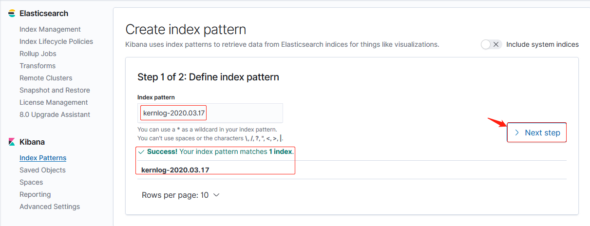

# 一. 通过 logstash 收集单个日志

通过 logstash 收集单个系统日志，并输出至文件

## 1.1 配置 logstash

```bash
root@es-server-node2:~# vim /etc/logstash/conf.d/syslog-demo.conf
input {
    file {
        type => "messagelog"
        path => "/var/log/syslog"
        start_position => "beginning"
         }
}

output {
    file {
        path => "/tmp/%{type}-%{+YYYY.MM.dd}"
         }
}
```

## 1.2 检查配置文件语法并启动 logstash

```bash
root@es-server-node2:~# /usr/share/logstash/bin/logstash -f /etc/logstash/conf.d/syslog-demo.conf -t
...
[INFO ] 2020-03-17 23:08:52.865 [LogStash::Runner] Reflections - Reflections took 37 ms to scan 1 urls, producing 20 keys and 40 values
Configuration OK
[INFO ] 2020-03-17 23:08:53.251 [LogStash::Runner] runner - Using config.test_and_exit mode. Config Validation Result: OK. Exiting Logstash  # config检查OK


# 启动logstash
root@es-server-node2:/tmp# systemctl start logstash
root@es-server-node2:/tmp# systemctl enable logstash
Created symlink /etc/systemd/system/multi-user.target.wants/logstash.service → /etc/systemd/system/logstash.service.
```

## 1.3 生成数据并验证

### 1.3.1 查看 logstash 日志解决不能产生数据问题

更新`/var/log/syslog`后，无数据文件生成：

```bash
root@es-server-node2:/usr/local/src# echo "Test message." >> /var/log/syslog
root@es-server-node2:/usr/local/src# echo "Test message.hahaha" >> /var/log/syslog
```

查看 logstash 日志解决不能在 tmp 目录下产生数据问题，是因为权限问题，logstash 用户
无权限读取`/var/log/syslog`。

```bash
root@es-server-node2:/tmp# tail /var/log/logstash/logstash-plain.log
...
# 如下提示：打开/var/log/syslog失败，权限拒绝
[2020-03-17T23:11:47,337][WARN ][filewatch.tailmode.handlers.createinitial][main] failed to open /var/log/syslog: #<Errno::EACCES: Permission denied - /var/log/syslog>, ["org/jruby/RubyIO.java:1239:in `sysopen'", "org/jruby/RubyFile.java:367:in `initialize'", "org/jruby/RubyIO.java:1158:in `open'"]
[2020-03-17T23:11:47,453][INFO ][logstash.agent           ] Successfully started Logstash API endpoint {:port=>9600}
...
```

### 1.3.2 授权并重启 logstash

```bash
root@es-server-node2:/tmp# chmod 644 /var/log/syslog  # 给其它用户读权限
root@es-server-node2:/tmp# systemctl restart logstash
```

### 1.3.3 重新更新/var/log/syslog

```bash
root@es-server-node2:/usr/local/src# echo "Test message." >> /var/log/syslog
root@es-server-node2:/usr/local/src# echo "Test message.hahaha" >> /var/log/syslog
```

### 1.3.3 查看 logstash 收集到的数据

```bash
root@es-server-node2:~# tail /tmp/messagelog-2020.03.17
......
{"@timestamp":"2020-03-17T15:21:59.808Z","host":"es-server-node2","path":"/var/log/syslog","message":"Test message.","type":"messagelog","@version":"1"}
{"@timestamp":"2020-03-17T15:22:08.820Z","host":"es-server-node2","path":"/var/log/syslog","message":"Test message.hahaha","type":"messagelog","@version":"1"}
```

# 二. 通过 logstash 收集多个日志文件

通过 logstash 收集多个日志文件

## 2.1 配置 logstash 并检查语法

配置：

```bash
root@es-server-node2:~# cat /etc/logstash/conf.d/syslog-demo.conf
input {
    file {
        type => "systemlog"
        path => "/var/log/syslog"
        start_position => "beginning"
        stat_interval => "3"
         }
    file {
        type => "kernlog"
        path => "/var/log/kern.log"
        start_position => "beginning"
        stat_interval => "3"
         }
}

output {
    if [type] == "systemlog"  {
        elasticsearch {
            hosts => ["192.168.100.144:9200"]
            index => "syslog-%{+YYYY.MM.dd}"
                      }
         }
    if [type] == "kernlog"  {
        elasticsearch {
            hosts => ["192.168.100.144:9200"]
            index => "kernlog-%{+YYYY.MM.dd}"
                      }
         }

}
```

检查语法：

```bash
root@es-server-node2:~# /usr/share/logstash/bin/logstash -f /etc/logstash/conf.d/syslog-demo.conf -t
...
[INFO ] 2020-03-17 23:36:24.768 [LogStash::Runner] Reflections - Reflections took 36 ms to scan 1 urls, producing 20 keys and 40 values
Configuration OK  # 检查OK
```

## 2.2 重启 logstash 查看是否报错

```bash
# 重启

# 出现报错
root@es-server-node2:~# grep 'WARN' /var/log/logstash/logstash-plain.log
......
[2020-03-17T23:39:50,133][WARN ][filewatch.tailmode.handlers.createinitial][main] failed to open /var/log/kern.log: #<Errno::EACCES: Permission denied - /var/log/kern.log>, ["org/jruby/RubyIO.java:1239:in `sysopen'", "org/jruby/RubyFile.java:367:in `initialize'", "org/jruby/RubyIO.java:1158:in `open'"]

# 查看文件权限
root@es-server-node2:~# ll /var/log/kern.log
-rw-r----- 1 syslog adm 2257175 Mar 17 23:28 /var/log/kern.log # 其它用户无读权限

# 更改权限
root@es-server-node2:~# chmod 644 /var/log/kern.log
root@es-server-node2:~# ll /var/log/kern.log
-rw-r--r-- 1 syslog adm 2257175 Mar 17 23:28 /var/log/kern.log

# 重启logstash
root@es-server-node2:~# systemctl restart logstash
```

## 2.3 更新被收集日志并验证

### 2.3.1 更新被收集的日志文件

```bash
root@es-server-node2:~# echo "Hello, message from syslog..." >> /var/log/syslog
root@es-server-node2:~# echo "Hello, message from kernlog..." >> /var/log/kernlog
```

### 2.3.2 在 head 插件或者 cerebro 插件查看新生成的 index

Head 插件：


cerebro 插件：


## 2.4 在 Kibana 界面添加索引

### 2.4.1 添加 syslog 索引


### 2.4.2 添加 kernlog 索引




## 2.5 展示日志

### 2.5.1 syslog


### 2.5.2 kernlog


