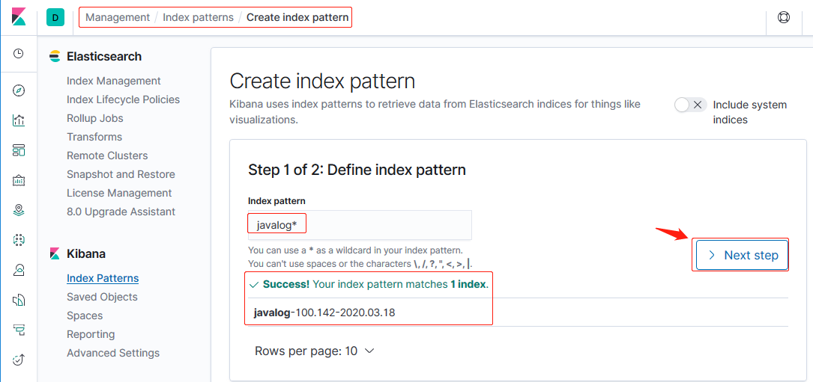
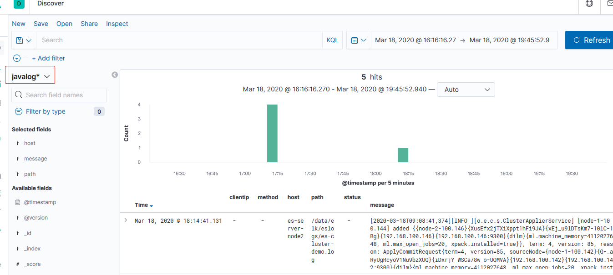

环境：

| 主机名              | IP              | 运行的服务                   |
| :------------------ | :-------------- | :--------------------------- |
| es-server-node1     | 192.168.100.142 | Elasticsearch、Head、Cerebro |
| es-server-node2     | 192.168.100.144 | Elasticsearch 、Logstash     |
| es-server-node3     | 192.168.100.146 | Elasticsearch 、Kibana       |
| nginx-tomcat-server | 192.168.100.150 | logstash、tomcat、nginx      |

# 一. 部署 tomcat 服务

## 1.1 安装 java 环境

预编译包安装：

```bash
~# tar xf jdk-8u241-linux-x64.tar.gz
~# ln -sv /usr/local/src/jdk1.8.0_241 /usr/local/jdk

~# vim /etc/profile
...
export JAVA_HOME="/usr/local/jdk"
export PATH="$JAVA_HOME/bin:$PATH"

~# source /etc/profile
```

apt 安装：

```bash
~# apt install openjdk-8-jdk
或
~# apt install openjdk-11-jdk
```

## 1.2 安装和配置 tomcat

### 1.2.1 安装 tomcat

```bash
~# tar -xf apache-tomcat-8.5.42.tar.gz
~# ln -sv /usr/local/src/apache-tomcat-8.5.42 /usr/local/tomcat
```

### 1.2.2 配置 tomcat 服务日志格式为 json

[自定义日志文档](http://tomcat.apache.org/tomcat-8.5-doc/config/valve.html#Access_Log_Valve)

```bash
# 编辑tomcat配置文件
~# vim /usr/local/tomcat/conf/server.xml
...
    <Host name="localhost"  appBase="webapps" unpackWARs="true" autoDeploy="true">
    ...
        <Valve className="org.apache.catalina.valves.AccessLogValve" directory="logs"
               prefix="tomcat_access_log" suffix=".log"
               pattern="{&quot;clientip&quot;:&quot;%h&quot;,&quot;ClientUser&quot;:&quot;%l&quot;,
               &quot;authenticated&quot;:&quot;%u&quot;,&quot;AccessTime&quot;:&quot;%t&quot;,
               &quot;method&quot;:&quot;%r&quot;,&quot;status&quot;:&quot;%s&quot;,
               &quot;SendBytes&quot;:&quot;%b&quot;,&quot;Query?string&quot;:&quot;%q&quot;,
               &quot;partner&quot;:&quot;%{Referer}i&quot;,&quot;AgentVersion&quot;:&quot;%{User-Agent}i&quot;}" />

      </Host>
      ...
# 其中"&quot;"表示一个双引号
```

### 1.2.3 启动 tomcat 并访问

```bash
root@nginx-tomcat-server:/usr/local/src# cd
root@nginx-tomcat-server:~# /usr/local/tomcat/bin/catalina.sh start
Using CATALINA_BASE:   /usr/local/tomcat
Using CATALINA_HOME:   /usr/local/tomcat
Using CATALINA_TMPDIR: /usr/local/tomcat/temp
Using JRE_HOME:        /usr
Using CLASSPATH:       /usr/local/tomcat/bin/bootstrap.jar:/usr/local/tomcat/bin/tomcat-juli.jar
Tomcat started.

root@nginx-tomcat-server:~# lsof -i:8080
COMMAND   PID USER   FD   TYPE DEVICE SIZE/OFF NODE NAME
java    10081 root   39u  IPv6  38491      0t0  TCP *:http-alt (LISTEN)

root@nginx-tomcat-server:~# curl 127.0.0.1:8080 2> /dev/null | grep "Home"
                <span id="nav-home"><a href="https://tomcat.apache.org/">Home</a></span>
                            <li><a href="https://www.apache.org">Apache Home</a></li>

```

### 1.2.4 借助工具校验日志格式

查看日志：

```bash
# 查看日志格式
root@nginx-tomcat-server:~# tail /usr/local/tomcat/logs/tomcat_access_log.2020-03-18.log
{"clientip":"192.168.100.144","ClientUser":"-",         "authenticated":"-","AccessTime":"[18/Mar/2020:11:41:28 +0800]",         "method":"GET / HTTP/1.1","status":"200",         "SendBytes":"11204","Query?string":"",         "partner":"-","AgentVersion":"curl/7.58.0"}
{"clientip":"127.0.0.1","ClientUser":"-",         "authenticated":"-","AccessTime":"[18/Mar/2020:13:06:09 +0800]",         "method":"GET / HTTP/1.1","status":"200",         "SendBytes":"11204","Query?string":"",         "partner":"-","AgentVersion":"curl/7.58.0"}
{"clientip":"127.0.0.1","ClientUser":"-",         "authenticated":"-","AccessTime":"[18/Mar/2020:13:06:15 +0800]",         "method":"GET / HTTP/1.1","status":"200",         "SendBytes":"11204","Query?string":"",         "partner":"-","AgentVersion":"curl/7.58.0"}
{"clientip":"127.0.0.1","ClientUser":"-",         "authenticated":"-","AccessTime":"[18/Mar/2020:13:06:27 +0800]",         "method":"GET / HTTP/1.1","status":"200",         "SendBytes":"11204","Query?string":"",         "partner":"-","AgentVersion":"curl/7.58.0"}
{"clientip":"127.0.0.1","ClientUser":"-",         "authenticated":"-","AccessTime":"[18/Mar/2020:13:06:43 +0800]",         "method":"GET / HTTP/1.1","status":"200",         "SendBytes":"11204","Query?string":"",         "partner":"-","AgentVersion":"curl/7.58.0"}
{"clientip":"127.0.0.1","ClientUser":"-",         "authenticated":"-","AccessTime":"[18/Mar/2020:13:07:46 +0800]",         "method":"GET / HTTP/1.1","status":"200",         "SendBytes":"11204","Query?string":"",         "partner":"-","AgentVersion":"curl/7.58.0"}
{"clientip":"127.0.0.1","ClientUser":"-",         "authenticated":"-","AccessTime":"[18/Mar/2020:13:07:51 +0800]",         "method":"GET / HTTP/1.1","status":"200",         "SendBytes":"11204","Query?string":"",         "partner":"-","AgentVersion":"curl/7.58.0"}
{"clientip":"127.0.0.1","ClientUser":"-",         "authenticated":"-","AccessTime":"[18/Mar/2020:13:07:51 +0800]",         "method":"GET / HTTP/1.1","status":"200",         "SendBytes":"11204","Query?string":"",         "partner":"-","AgentVersion":"curl/7.58.0"}
```

校验：


### 1.2.5 使用 python 获取某些键和值

在 windows 下简单的获取：

1. 访问 tomcat

```bash
root@es-server-node1:~# curl 192.168.100.150:8080/
root@es-server-node1:~# curl 192.168.100.150:8080/
root@es-server-node1:~# curl 192.168.100.150:8080/hi
root@es-server-node2:~# curl 192.168.100.150:8080/
root@es-server-node2:~# curl 192.168.100.150:8080/
root@es-server-node2:~# curl 192.168.100.150:8080/hello
```

2. 将日志传到 win 下处理：
   

```py
import json

stat_200 = []
stat_404 = []
method_404 = []

# e1
with open('./test_file/tomcat_access_log.2020-03-18.log') as message_json:
    #message = json.load(message_json)
    for line in message_json.readlines():
        fmt_line = eval(line)
        #print(fmt_line.get('clientip'))
        if fmt_line.get("status") == "200":
            stat_200.append(fmt_line.get)
        elif fmt_line.get("status") == "404":
            stat_404.append(fmt_line.get)
            method_404.append(fmt_line.get("method"))

    print("状态码为200的访问次数：{}".format(len(stat_200)))
    print("状态码为404的访问次数：{}".format(len(stat_404)))
    print("状态码为404的访问路径：{}".format(method_404))
```

在 linux 环境下获取和分析：

```bash
root@nginx-tomcat-server:~# vim get_tomcat_accesslog_kv.py
```

测试：

```bash
root@nginx-tomcat-server:~# python3 get_tomcat_accesslog_kv.py
状态码为200的访问次数：130
状态码为404的访问次数：2
状态码为404的访问路径：['GET /hello HTTP/1.1', 'GET /hi HTTP/1.1']
root@nginx-tomcat-server:~# curl 127.0.0.1:8080/not
<!doctype html><html lang="en"><head><title>HTTP Status 404 – Not Found</title><style type="text/css">h1 {font-family:Tahoma,Arial,sans-serif;color:white;background-color:#525D76;font-size:22px;} h2 {font-family:Tahoma,Arial,sans-serif;color:white;background-color:#525D76;font-size:16px;} h3 {font-family:Tahoma,Arial,sans-serif;color:white;background-color:#525D76;font-size:14px;} body {font-family:Tahoma,Arial,sans-serif;color:black;background-color:white;} b {font-family:Tahoma,Arial,sans-serif;color:white;background-color:#525D76;} p {font-family:Tahoma,Arial,sans-serif;background:white;color:black;font-size:12px;} a {color:black;} a.name {color:black;} .line {height:1px;background-color:#525D76;border:none;}</style></head><body><h1>HTTP Status 404 – Not Found</h1><hr class="line" /><p><b>Type</b> Status Report</p><p><b>Message</b> &#47;not</p><p><b>Description</b> The origin server did not find a current representation for the target resource or is not willing to disclose that one exists.</p><hr class="line" /><h3>Apache Tomcat/8.5.42</h3></body></html>root@nginx-tomcat-server:~#
root@nginx-tomcat-server:~#
root@nginx-tomcat-server:~# python3 get_tomcat_accesslog_kv.py
状态码为200的访问次数：130
状态码为404的访问次数：3
状态码为404的访问路径：['GET /hello HTTP/1.1', 'GET /hi HTTP/1.1', 'GET /not HTTP/1.1']
```

代码：

```py
root@nginx-tomcat-server:~# cat get_tomcat_accesslog_kv.py
stat_200 = []
stat_404 = []
method_404 = []

# e1
with open('/usr/local/tomcat/logs/tomcat_access_log.2020-03-18.log') as message_json:
    #message = json.load(message_json)
    for line in message_json.readlines():
        fmt_line = eval(line)
        #print(fmt_line.get('clientip'))
        if fmt_line.get("status") == "200":
            stat_200.append(fmt_line.get)
        elif fmt_line.get("status") == "404":
            stat_404.append(fmt_line.get)
            method_404.append(fmt_line.get("method"))

    print("状态码为200的访问次数：{}".format(len(stat_200)))
    print("状态码为404的访问次数：{}".format(len(stat_404)))
    print("状态码为404的访问路径：{}".format(method_404))
```

# 二. 安装 logstash 并配置收集 tomcat 日志

## 2.1 安装 logstash

```bash
root@nginx-tomcat-server:/usr/local/src# dpkg -i logstash-7.6.1_.deb
```

## 2.2 配置 logstash 收集 tomcat 日志

1. 配置 logstash

```bash
~# vim /etc/logstash/conf.d/tomcat-log.conf

input {

  file {
    path => "/usr/local/tomcat/logs/tomcat_access_log.*.log"
    start_position => "end"
    stat_interval => "3"
    type => "tomcat-accesslog"
    codec => json
  }

}


output {

  if [type] == "tomcat-accesslog"  {

    elasticsearch {
      hosts => ["192.168.100.146:9200"]
      index => "tomcat-accesslog-100.150-%{+YYYY.MM.dd}"
    }

  }

}

# 检查语法
~# /usr/share/logstash/bin/logstash -f /etc/logstash/conf.d/tomcat-log.conf -t
...
[INFO ] ... runner - Using config.test_and_exit mode. Config Validation Result: OK. Exiting Logstash
...
```

2. 使用 root 启动 logstash

```bash
~# vim /etc/systemd/system/logstash.service
[Service]
...
User=root
Group=root
...

~# systemctl start logstash
~# systemctl enable logstash
```

## 2.3 添加索引到 Kibana 并展示


访问一下：

```bash
root@es-server-node3:~# ip addr show eth0 | grep inet
    inet 192.168.100.146/24 brd 192.168.100.255 scope global eth0
    inet6 fe80::20c:29ff:feab:ca14/64 scope link
# 访问四次
root@es-server-node3:~# curl 192.168.100.150:8080/
root@es-server-node3:~# curl 192.168.100.150:8080/
root@es-server-node3:~# curl 192.168.100.150:8080/
root@es-server-node3:~# curl 192.168.100.150:8080/
```

观察到 4 次：


# 三. logstash 收集 java 日志

收集 java 日志涉及到将多行的 java 报错日志合并为一个事件(一条日志)，所以此时
要使用 logstash 的 `Multiline codec` 插件， 其会折叠多行消息并将它们合并成
单个事件(一个消息，该消息对应于键`message`的值)。

## 3.1 在 elasticsearch 服务器部署 logstash

```bash
~# dpkg -i logstash-7.6.1_.deb
```

## 3.2 配置 logstash 并检查语法

```bash
~# vim /etc/logstash/conf.d/java-log.conf
~# cat /etc/logstash/conf.d/java-log.conf
input {
  file {
    path => "/data/elk/eslogs/es-cluster-demo.log"
    type => "javalog"
    start_position => "beginning"
    codec => multiline {
      pattern => "^\["
      negate => "true"
      what => "previous"
    }
  }
}

output {
  if [type] == "javalog" {
    elasticsearch {
      hosts => ["192.168.100.142:9200"]
      index => "javalog-100.142-%{+YYYY.MM.dd}"
    }
  }
}
```

检查语法：

```bash
~# /usr/share/logstash/bin/logstash -f /etc/logstash/conf.d/java-log.conf -t
...
[INFO ] 2020-03-18 17:12:02.426 [LogStash::Runner] runner - Using config.test_and_exit mode. Config Validation Result: OK. Exiting Logstash
...
```

head 查看生成的索引：


## 3.3 Kibana 新增 java 索引




## 3.4 查看数据




## 3.5 重启 ES 集群其他主机查看日志

```bash
root@es-server-node2:~# systemctl restart elasticsearch.service
root@es-server-node3:~# systemctl restart elasticsearch.service
```


