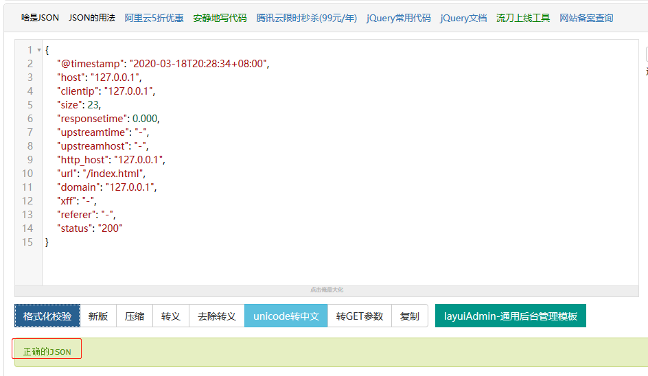
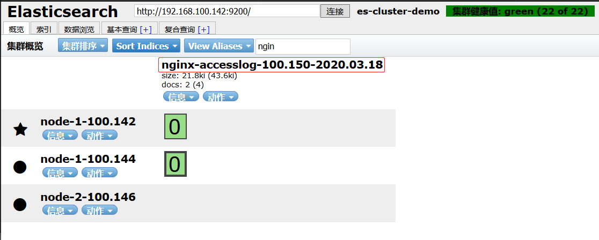
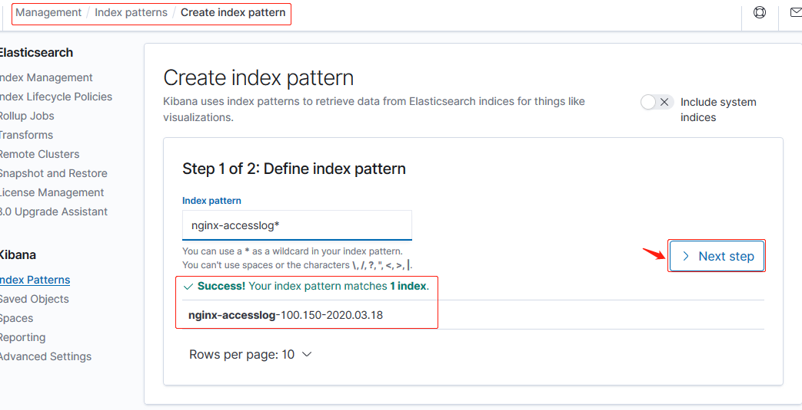
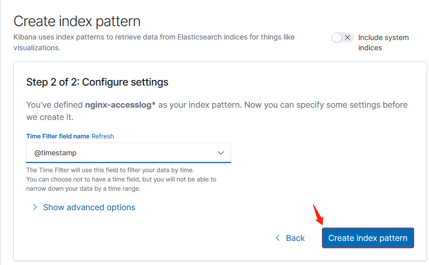
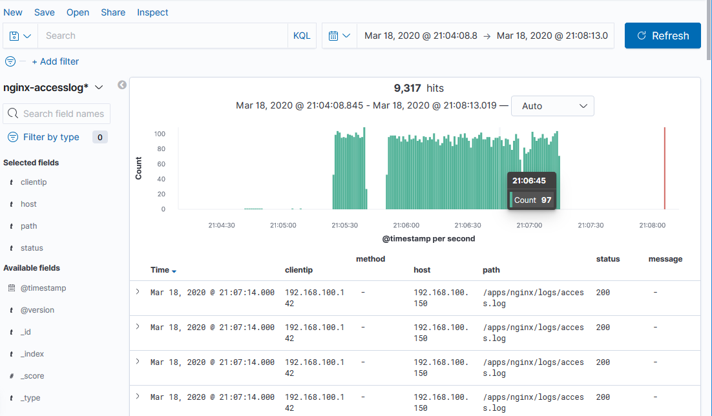

环境：

| 主机名              | IP              | 运行的服务                   |
| :------------------ | :-------------- | :--------------------------- |
| es-server-node1     | 192.168.100.142 | Elasticsearch、Head、Cerebro |
| es-server-node2     | 192.168.100.144 | Elasticsearch 、Logstash     |
| es-server-node3     | 192.168.100.146 | Elasticsearch 、Kibana       |
| nginx-tomcat-server | 192.168.100.150 | logstash、tomcat、nginx      |

# 一. 部署 nginx

## 1.1 编译安装 nginx

```bash
~# cd /usr/local/src
~# wget http://nginx.org/download/nginx-1.16.1.tar.gz
~# tar xf nginx-1.16.1.tar.gz
~# cd nginx-1.16.1
~# ./configure --prefix=/apps/nginx
~# make -j 2 && make install
~# ln -sv /apps/nginx/sbin/nginx /bin/nginx
```

## 1.2 配置 nginx

### 1.2.1 启动 nginx 和准备测试界面

```bash
root@nginx-tomcat-server:~# vim /apps/nginx/html/index.html
<h1>Test page ...</h1>

root@nginx-tomcat-server:~# nginx -t
nginx: the configuration file /apps/nginx/conf/nginx.conf syntax is ok
nginx: configuration file /apps/nginx/conf/nginx.conf test is successful
root@nginx-tomcat-server:~# nginx

root@nginx-tomcat-server:~# curl 127.0.0.1:80
<h1>Test page ...<h1/>
```

### 1.2.2 配置 nginx 日志为 json 格式

```bash
~# vim /apps/nginx/conf/nginx.conf
...
http {
    include       mime.types;
    default_type  application/octet-stream;

    log_format  access_json  '{"@timestamp":"$time_iso8601",'
                             '"host":"$server_addr",'
                             '"clientip":"$remote_addr",'
                             '"size":$body_bytes_sent,'
                             '"responsetime":$request_time,'
                             '"upstreamtime":"$upstream_response_time",'
                             '"upstreamhost":"$upstream_addr",'
                             '"http_host":"$host",'
                             '"url":"$uri",'
                             '"domain":"$host",'
                             '"xff":"$http_x_forwarded_for",'
                             '"referer":"$http_referer",'
                             '"status":"$status"}';

    access_log  logs/access.log  access_json;
......
```

### 1.2.3 校验 json 日志格式

重启 nginx：

```bash
root@nginx-tomcat-server:~# nginx -t
nginx: the configuration file /apps/nginx/conf/nginx.conf syntax is ok
nginx: configuration file /apps/nginx/conf/nginx.conf test is successful
root@nginx-tomcat-server:~# nginx -s reload
```

访问 nginx：

```bash
root@nginx-tomcat-server:~# curl 127.0.0.1
<h1>Test page ...<h1/>
root@nginx-tomcat-server:~# curl 127.0.0.1
<h1>Test page ...<h1/>
root@nginx-tomcat-server:~# curl 127.0.0.1
<h1>Test page ...<h1/>
```

校验 json 日志的格式：

```bash
root@nginx-tomcat-server:~# tail /apps/nginx/logs/access.log
127.0.0.1 - - [18/Mar/2020:11:50:58 +0800] "GET / HTTP/1.1" 200 612 "-" "curl/7.58.0"
127.0.0.1 - - [18/Mar/2020:20:24:44 +0800] "GET / HTTP/1.1" 200 23 "-" "curl/7.58.0"
{"@timestamp":"2020-03-18T20:28:34+08:00","host":"127.0.0.1","clientip":"127.0.0.1","size":23,"responsetime":0.000,"upstreamtime":"-","upstreamhost":"-","http_host":"127.0.0.1","url":"/index.html","domain":"127.0.0.1","xff":"-","referer":"-","status":"200"}
{"@timestamp":"2020-03-18T20:28:35+08:00","host":"127.0.0.1","clientip":"127.0.0.1","size":23,"responsetime":0.000,"upstreamtime":"-","upstreamhost":"-","http_host":"127.0.0.1","url":"/index.html","domain":"127.0.0.1","xff":"-","referer":"-","status":"200"}
{"@timestamp":"2020-03-18T20:28:35+08:00","host":"127.0.0.1","clientip":"127.0.0.1","size":23,"responsetime":0.000,"upstreamtime":"-","upstreamhost":"-","http_host":"127.0.0.1","url":"/index.html","domain":"127.0.0.1","xff":"-","referer":"-","status":"200"}
```



# 二. 配置 logstash

## 2.1 配置收集 nginx 日志写入 elasticsearch

```bash
root@nginx-tomcat-server:~# vim /etc/logstash/conf.d/nginxLog_to_es.conf
root@nginx-tomcat-server:~# cat /etc/logstash/conf.d/nginxLog_to_es.conf
input {
  file {
    path => "/apps/nginx/logs/access.log"
    start_position => "end"
    type => "nginx-accesslog"
    codec => json
  }
}

output {
  if [type] == "nginx-accesslog" {
    elasticsearch {
      hosts => ["192.168.100.142:9200"]
      index => "nginx-accesslog-100.150-%{+YYYY.MM.dd}"
    }
  }
}

```

## 2.2 检查语法

```bash
root@nginx-tomcat-server:~# /usr/share/logstash/bin/logstash -f /etc/logstash/conf.d/nginxLog_to_es.conf  -t
...
[INFO ] 2020-03-18 20:39:30.640 [LogStash::Runner] runner - Using config.test_and_exit mode. Config Validation Result: OK. Exiting Logstash
...
```

## 2.3 head 插件查看索引是否生成



# 三. Kibana 添加索引和展示

## 3.1 添加索引模式





## 3.2 展示

### 3.2.1 使用 curl 命令访问 nginx

```bash
~# while :; do curl 192.168.100.150; done
```

### 3.2.2 查看数据


