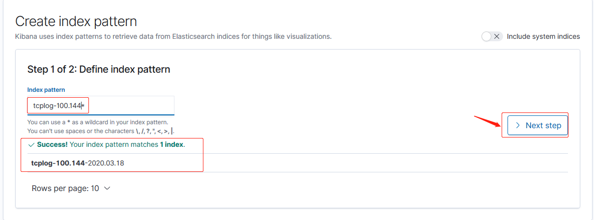
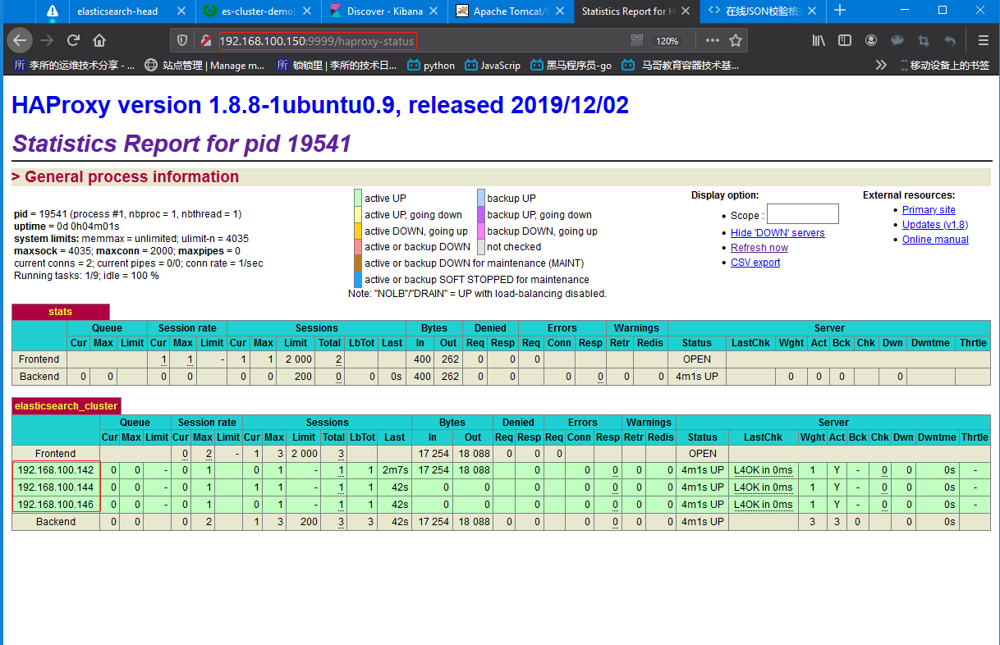

环境：

| 主机名              | IP              | 运行的服务                   |
| :------------------ | :-------------- | :--------------------------- |
| es-server-node1     | 192.168.100.142 | Elasticsearch、Head、Cerebro |
| es-server-node2     | 192.168.100.144 | Elasticsearch 、Logstash     |
| es-server-node3     | 192.168.100.146 | Elasticsearch 、Kibana       |
| nginx-tomcat-server | 192.168.100.150 | logstash、haprxy             |

# 一. 收集 TCP 和 UDP 日志

[TCP input 插件文档](https://www.elastic.co/guide/en/logstash/current/plugins-inputs-tcp.html)
[UDP input 插件文档](https://www.elastic.co/guide/en/logstash/current/plugins-inputs-udp.html)

TCP/UDP input 插件从 TCP socket 读取事件，和 stdin 及 file 插件一样，每个事件
都被认为是一行文本。可以接受 TCP 客户端的连接或者连到一个 TCP 服务器，该选项
由`mode`设置决定。

通过 logstash 的 tcp/udp 插件收集日志，通常用于在向 elasticsearch 日志补录丢失
的部分日志，可以将丢失的日志写到一个文件，然后通过 TCP 日志收集方式直接发送给
logstash 然后再写入到 elasticsearch 服务器。

## 1.1 logstash 配置文件

将通过 tcp 收集到的日志输出到标准输出做测试使用，测试 OK 后改为将数据
输出给 Elasticsearch：

```bash
root@es-server-node2:~# cat /etc/logstash/conf.d/tcp-to-es.conf
input {
  tcp {
    port => 1234
    type => "tcplog"
    mode => "server"
  }
}

output {
  stdout {
    codec => "rubydebug"
  }
}
```

测试语法：

```bash
root@es-server-node2:~# /usr/share/logstash/bin/logstash -f /etc/logstash/conf.d/tcp-to-es.conf -t
...
[INFO ] 2020-03-18 21:43:12.920 [LogStash::Runner] runner - Using config.test_and_exit mode. Config Validation Result: OK. Exiting Logstash
```

## 1.2 启动 logstash

测试时，使用运行为前台进程方式：

```bash
root@es-server-node2:~# /usr/share/logstash/bin/logstash -f /etc/logstash/conf.d/tcp-to-es.conf
...

# 查看是否监听1234端口
root@es-server-node2:~# lsof -i:1234
COMMAND   PID USER   FD   TYPE DEVICE SIZE/OFF NODE NAME
java    25942 root   90u  IPv6 139494      0t0  TCP *:1234 (LISTEN)
```

## 1.3 在其他主机安装 nc 命令并测试

NetCat 简称 nc，在网络工具中有"瑞士军刀"美誉，其功能实用，是一个简单、
可靠的网络工具，可通过 TCP 或 UDP 协议传输读写数据，另外还具有很多其他
功能。

```bash
root@es-server-node3:~# ip addr show eth0 | grep inet
    inet 192.168.100.146/24 brd 192.168.100.255 scope global eth0
    inet6 fe80::20c:29ff:feab:ca14/64 scope link

root@es-server-node3:~# apt install netcat
root@es-server-node3:~# echo "NC message via TCP." | nc 192.168.100.144 1234
```

## 1.4 查看是否接收到数据

```bash
...
[INFO ] 2020-03-18 21:44:40.638 [Api Webserver] agent - Successfully started Logstash API endpoint {:port=>9601}
{
    "@timestamp" => 2020-03-18T13:48:50.488Z,
          "host" => "192.168.100.146",
          "port" => 44441,
      "@version" => "1",
       "message" => "NC message via TCP.",  # 收到数据
          "type" => "tcplog"
}
```

## 1.5 通过 nc 命令发送文件

### 1.5.1 发送

```bash
root@es-server-node3:~# vim message
Hello, a test message!
ha
How'v you been bro?

# 使用标准输入重定向发送
root@es-server-node3:~# nc 192.168.100.144 1234 < message
```

### 1.5.2 查看 logstash 接收

```bash
...
{
    "@timestamp" => 2020-03-18T13:52:32.853Z,
          "host" => "192.168.100.146",
          "port" => 44443,
      "@version" => "1",
       "message" => "ha",
          "type" => "tcplog"
}
{
    "@timestamp" => 2020-03-18T13:52:32.854Z,
          "host" => "192.168.100.146",
          "port" => 44443,
      "@version" => "1",
       "message" => "...",
          "type" => "tcplog"
}
{
    "@timestamp" => 2020-03-18T13:52:32.850Z,
          "host" => "192.168.100.146",
          "port" => 44443,
      "@version" => "1",
       "message" => "Hello, a test message!",
          "type" => "tcplog"
}
{
    "@timestamp" => 2020-03-18T13:52:32.854Z,
          "host" => "192.168.100.146",
          "port" => 44443,
      "@version" => "1",
       "message" => "How'v you been bro? ",
          "type" => "tcplog"
}

```

## 1.6 通过伪设备发送文件

在类 Unix 操作系统中，大部分设备文件都对应有物理设备，比如：块设备文件`/dev/sda`
对应于系统第一块磁盘，`/dev/ttyX`对应某个打开的虚拟终端。但是有的设备文件并不
一定要对应物理设备，我们把没有这种对应关系的设备称为伪设备，比如/dev/null，
/dev/zero，/dev/random 以及/dev/tcp 和/dev/upd 等，Linux 操作系统使用这些伪
设备提供了多种不通的功能，tcp 设备文件只是 dev 下面很多的伪设备当中的一种设备。

### 1.6.1 发送

```bash
# 可能在/dev/目录下并没有对应的tcp设备文件，但是可以使用
root@es-server-node3:~# echo "A message from a pseudo tcp device." > /dev/tcp/192.168.100.144/1234
```

### 1.6.2 查看 logstash 接收的数据

```bash
...
{
    "@timestamp" => 2020-03-18T13:58:53.643Z,
          "host" => "192.168.100.146",
          "port" => 44445,
      "@version" => "1",
       "message" => "A message from a pseudo tcp device.",
          "type" => "tcplog"
}

```

## 1.7 修改 logstash 配置并重启

修改 logstash 配置，将通过 tcp 收集到的日志输出到 elasticsearch

```bash
root@es-server-node2:~# cat /etc/logstash/conf.d/tcp-to-es.conf
input {
  tcp {
    port => 1234
    type => "tcplog"
    mode => "server"
  }
}

output {
  if [type] == "tcplog" {
    elasticsearch {
      hosts => ["192.168.100.142:9200"]
      index => "tcplog-100.144-%{+YYYY.MM.dd}"
    }
  }
}

root@es-server-node2:~# systemctl restart logstash
```

## 1.7 Kibana 添加并查看

### 1.7.1 更新日志

```bash
root@es-server-node3:~# ip addr show eth0 | grep inet
    inet 192.168.100.146/24 brd 192.168.100.255 scope global eth0
    inet6 fe80::20c:29ff:feab:ca14/64 scope link

root@es-server-node3:~# echo "A message from a pseudo tcp device." > /dev/tcp/192.168.100.144/1234
root@es-server-node3:~# echo "A message from nc via tcp." | nc 192.168.100.144 1234
```

### 1.7.2 通过 head 查看索引生成情况


### 1.7.3 增加索引模式




### 1.7.4 查看展示数据


# 二. 通过 rsyslog 服务收集 HAProxy 日志

[suosuoli 博客日志:rsyslog ](https://suosuoli.cn/?p=602)

rsyslog 是个高性能，高安全性和模块化设计的日志系统。 虽然它最初是作为常规系
统日志开发的，但是后来 rsyslog 发展为比较强大的日志系统，可以接受来自各种来
源的输入，转换它们，并将结果输出到不同的目的地。

在 centos 6 及之前的版本叫做 syslog，centos 7 开始叫做 rsyslog，根据官方的
介绍，rsyslog(2013 年版本)可以达到每秒转发百万条日志的级别，[官方网址](http://www.rsyslog.com/)

确认 Centos 系统安装的版本命令如下：

```bash
~# yum list rsyslog
```

Ubuntu 下如下：

```bash
root@es-server-node2:~# apt list rsyslog
Listing... Done
rsyslog/bionic-proposed 8.32.0-1ubuntu4.1 amd64 [upgradable from: 8.32.0-1ubuntu4]
```

## 2.1 安装 HAProxy

```bash
root@nginx-tomcat-server:~# apt  install haproxy
```

## 2.2 编辑 HAProxy 配置文件并启动

```bash
root@nginx-tomcat-server:~# vim /etc/haproxy/haproxy.cfg
root@nginx-tomcat-server:~# cat /etc/haproxy/haproxy.cfg
global
	log /dev/log	local0
	log /dev/log	local1 notice
	chroot /var/lib/haproxy
	stats socket /run/haproxy/admin.sock mode 660 level admin expose-fd listeners
	stats timeout 30s
	user haproxy
	group haproxy
	daemon
	log 127.0.0.1 local6 info   # 定义全局的syslog服务器；日志类型为local6
	ca-base /etc/ssl/certs
	crt-base /etc/ssl/private

	ssl-default-bind-ciphers ECDH+AESGCM:DH+AESGCM:ECDH+AES256:DH+AES256:ECDH+AES128:DH+AES:RSA+AESGCM:RSA+AES:!aNULL:!MD5:!DSS
	ssl-default-bind-options no-sslv3

defaults
	log	global   # 开启日志
	mode	http
	option	httplog
	option	dontlognull
        timeout connect 5000
        timeout client  50000
        timeout server  50000
	errorfile 400 /etc/haproxy/errors/400.http
	errorfile 403 /etc/haproxy/errors/403.http
	errorfile 408 /etc/haproxy/errors/408.http
	errorfile 500 /etc/haproxy/errors/500.http
	errorfile 502 /etc/haproxy/errors/502.http
	errorfile 503 /etc/haproxy/errors/503.http
	errorfile 504 /etc/haproxy/errors/504.http

listen stats
 	mode http
 	bind 0.0.0.0:9999
 	stats enable
 	log global
 	stats uri     /haproxy-status
 	stats auth    haadmin:stevenux

listen elasticsearch_cluster
  mode tcp
  balance roundrobin
  bind 192.168.100.150:1234
  server 192.168.100.142 192.168.100.142:9200 check inter 3s fall 3 rise 5
  server 192.168.100.144 192.168.100.144:9200 check inter 3s fall 3 rise 5
  server 192.168.100.146 192.168.100.146:9200 check inter 3s fall 3 rise 5

# 启动haproxy
root@nginx-tomcat-server:~# systemctl restart haproxy.service
root@nginx-tomcat-server:~# systemctl enable haproxy.service
Synchronizing state of haproxy.service with SysV service script with /lib/systemd/systemd-sysv-install.
Executing: /lib/systemd/systemd-sysv-install enable haproxy

root@nginx-tomcat-server:~# lsof -i:1234
COMMAND   PID    USER   FD   TYPE DEVICE SIZE/OFF NODE NAME
haproxy 19541 haproxy   10u  IPv4 167574      0t0  TCP nginx-tomcat-server:1234 (LISTEN)
```

## 2.3 查看 HAProxy 状态页并测试调度



测试从 1234 端口是否将请求调度到不同的 elasticsearch 主机：

```bash
root@nginx-tomcat-server:~# curl 192.168.100.150:1234
{
  "name" : "node-1-100.142",  # node1
  "cluster_name" : "es-cluster-demo",
  "cluster_uuid" : "zh_266x1TGeD76UkU3wWag",
  "version" : {
    "number" : "7.6.1",
    "build_flavor" : "default",
    "build_type" : "deb",
    "build_hash" : "aa751e09be0a5072e8570670309b1f12348f023b",
    "build_date" : "2020-02-29T00:15:25.529771Z",
    "build_snapshot" : false,
    "lucene_version" : "8.4.0",
    "minimum_wire_compatibility_version" : "6.8.0",
    "minimum_index_compatibility_version" : "6.0.0-beta1"
  },
  "tagline" : "You Know, for Search"
}
root@nginx-tomcat-server:~# curl 192.168.100.150:1234
{
  "name" : "node-1-100.144", # node2
  "cluster_name" : "es-cluster-demo",
  "cluster_uuid" : "zh_266x1TGeD76UkU3wWag",
  "version" : {
    "number" : "7.6.1",
    "build_flavor" : "default",
    "build_type" : "deb",
    "build_hash" : "aa751e09be0a5072e8570670309b1f12348f023b",
    "build_date" : "2020-02-29T00:15:25.529771Z",
    "build_snapshot" : false,
    "lucene_version" : "8.4.0",
    "minimum_wire_compatibility_version" : "6.8.0",
    "minimum_index_compatibility_version" : "6.0.0-beta1"
  },
  "tagline" : "You Know, for Search"
}
root@nginx-tomcat-server:~# curl 192.168.100.150:1234
{
  "name" : "node-2-100.146", # node3
  "cluster_name" : "es-cluster-demo",
  "cluster_uuid" : "zh_266x1TGeD76UkU3wWag",
  "version" : {
    "number" : "7.6.1",
    "build_flavor" : "default",
    "build_type" : "deb",
    "build_hash" : "aa751e09be0a5072e8570670309b1f12348f023b",
    "build_date" : "2020-02-29T00:15:25.529771Z",
    "build_snapshot" : false,
    "lucene_version" : "8.4.0",
    "minimum_wire_compatibility_version" : "6.8.0",
    "minimum_index_compatibility_version" : "6.0.0-beta1"
  },
  "tagline" : "You Know, for Search"
}

```

## 2.4 配置 rsyslog

```bash
root@nginx-tomcat-server:~# vim /etc/rsyslog.conf'
...
# provides UDP syslog reception
module(load="imudp")
input(type="imudp" port="514")

# provides TCP syslog reception
module(load="imtcp")
input(type="imtcp" port="514")
...

root@nginx-tomcat-server:~# vim /etc/rsyslog.d/50-default.conf
...
local6.*     /var/log/haproxy.log
...

```

## 2.5 重启 haproxy 和 rsyslog 并验证

重启 haproxy 和 rsyslog 并查看是否生成 rsyslog 日志:

```bash
root@nginx-tomcat-server:~# systemctl restart haproxy.service rsyslog.service
root@nginx-tomcat-server:~# lsof -i:1234
COMMAND   PID    USER   FD   TYPE DEVICE SIZE/OFF NODE NAME
haproxy 19849 haproxy   10u  IPv4 171473      0t0  TCP nginx-tomcat-server:1234 (LISTEN)
root@nginx-tomcat-server:~# lsof -i:9999
COMMAND   PID    USER   FD   TYPE DEVICE SIZE/OFF NODE NAME
haproxy 19849 haproxy    7u  IPv4 171470      0t0  TCP *:9999 (LISTEN)

root@nginx-tomcat-server:~# curl 192.168.100.150:1234
root@nginx-tomcat-server:~# curl 192.168.100.150:1234
root@nginx-tomcat-server:~# curl 192.168.100.150:1234
root@nginx-tomcat-server:~# curl 192.168.100.150:1234
```

查看日志：

```bash
root@nginx-tomcat-server:~# ll /var/log/haproxy.log
-rw-r----- 1 syslog adm 8074 Mar 19 00:05 /var/log/haproxy.log
root@nginx-tomcat-server:~# tail /var/log/haproxy.log
Mar 19 00:04:53 nginx-tomcat-server haproxy[19849]: 192.168.100.150:32149 [19/Mar/2020:00:04:53.564] elasticsearch_cluster elasticsearch_cluster/192.168.100.144 1/0/3 628 -- 1/1/0/0/0 0/0
Mar 19 00:04:53 localhost haproxy[19849]: 192.168.100.150:32149 [19/Mar/2020:00:04:53.564] elasticsearch_cluster elasticsearch_cluster/192.168.100.144 1/0/3 628 -- 1/1/0/0/0 0/0
Mar 19 00:04:54 nginx-tomcat-server haproxy[19849]: 192.168.100.150:32155 [19/Mar/2020:00:04:54.190] elasticsearch_cluster elasticsearch_cluster/192.168.100.146 1/0/4 628 -- 1/1/0/0/0 0/0
Mar 19 00:04:54 localhost haproxy[19849]: 192.168.100.150:32155 [19/Mar/2020:00:04:54.190] elasticsearch_cluster elasticsearch_cluster/192.168.100.146 1/0/4 628 -- 1/1/0/0/0 0/0
Mar 19 00:05:26 nginx-tomcat-server haproxy[19849]: 192.168.100.150:32223 [19/Mar/2020:00:05:26.122] elasticsearch_cluster elasticsearch_cluster/192.168.100.142 1/0/3 628 -- 1/1/0/0/0 0/0
Mar 19 00:05:26 localhost haproxy[19849]: 192.168.100.150:32223 [19/Mar/2020:00:05:26.122] elasticsearch_cluster elasticsearch_cluster/192.168.100.142 1/0/3 628 -- 1/1/0/0/0 0/0
Mar 19 00:05:26 nginx-tomcat-server haproxy[19849]: 192.168.100.150:32229 [19/Mar/2020:00:05:26.729] elasticsearch_cluster elasticsearch_cluster/192.168.100.144 1/0/3 628 -- 1/1/0/0/0 0/0
Mar 19 00:05:26 localhost haproxy[19849]: 192.168.100.150:32229 [19/Mar/2020:00:05:26.729] elasticsearch_cluster elasticsearch_cluster/192.168.100.144 1/0/3 628 -- 1/1/0/0/0 0/0
Mar 19 00:05:27 nginx-tomcat-server haproxy[19849]: 192.168.100.150:32233 [19/Mar/2020:00:05:27.354] elasticsearch_cluster elasticsearch_cluster/192.168.100.146 1/0/4 628 -- 1/1/0/0/0 0/0
Mar 19 00:05:27 localhost haproxy[19849]: 192.168.100.150:32233 [19/Mar/2020:00:05:27.354] elasticsearch_cluster elasticsearch_cluster/192.168.100.146 1/0/4 628 -- 1/1/0/0/0 0/0

```

## 2.6 编辑 logstash 配置文件

此处实现 rsyslog 的收集需要用到 input 插件 syslog 。编辑 logstash 配置文件，
使其监听在一个本地端口作为日志输入源，haproxy 服务器的 rsyslog 输出 IP:PORT
和 logstash 服务器监听的 IP:PORT 相同，本次的配置是在 `es-server-node2`
上开启 logstash，在 `nginx-tomcat-server` 上收集 apt 安装的 haproxy 的访问
日志并输出到 Elasticsearch 集群，最后由 Kibana 展示，logstash 的配置文件如下:

```bash
root@es-server-node2:~# vim /etc/logstash/conf.d/rsyslog_haproxylog.conf
root@es-server-node2:~# cat  /etc/logstash/conf.d/rsyslog_haproxylog.conf
input {
  syslog {
    type => "rsys_haproxylog"
    port => "1514"
  }
}

# 测试将其输出到标准输出
output {
  elasticsearch {
    hosts => ["192.168.100.144:9200"]
    index => "rsyslog-haproxy-%{+YYYY.MM.dd}"
  }
}

```

检查语法：

```bash
~# /usr/share/logstash/bin/logstash -f /etc/logstash/conf.d/rsyslog_haproxylog.conf -t
...
...Config Validation Result: OK. Exiting Logstash
...
```

## 2.7 更改 tomcat-nginx-server 上的 rsyslog 配置文件

```bash
~# /etc/rsyslog.conf
...
# provides UDP syslog reception
module(load="imudp")
input(type="imudp" port="514")

# provides TCP syslog reception
module(load="imtcp")
input(type="imtcp" port="514")
...

~# vim /etc/rsyslog.d/50-default.conf
...
#local6.*     /var/log/haproxy.log
#local6.*     @@192.168.100.144:516  # centos使用该配置就可以
...

```

### Ubuntu 下需要编辑`/etc/rsyslog.conf/`下的专用于 haproxy 的配置文件:

```bash
~# vim  /etc/rsyslog.d/49-haproxy.conf
# Create an additional socket in haproxy's chroot in order to allow logging via
# /dev/log to chroot'ed HAProxy processes
$AddUnixListenSocket /var/lib/haproxy/dev/log

# Send HAProxy messages to a dedicated logfile
#if $programname startswith 'haproxy' then /var/log/haproxy.log  # 注释原来的行
if $programname startswith 'haproxy' then @@192.168.100.144:516
&~
```

重启 rsyslog 和 haproxy：

```bash
root@nginx-tomcat-server:~# systemctl restart rsyslog haproxy
```

## 2.8 启动 es-server-node2 上的 logstash

以前台进程运行 logstash：

```bash
root@es-server-node2:~# systemctl status logstash
root@es-server-node2:~# /usr/share/logstash/bin/logstash -f /etc/logstash/conf.d/rsyslog_haproxylog.conf
...
[INFO ] 2020-03-19 00:29:31.164 [Api Webserver] agent - Successfully started Logstash API endpoint {:port=>9600}
[INFO ] 2020-03-19 00:34:50.726 [Ruby-0-Thread-11: :1] syslog - Starting syslog tcp listener {:address=>"0.0.0.0:516"}
[INFO ] 2020-03-19 00:34:50.730 [Ruby-0-Thread-10: :1] syslog - Starting syslog udp listener {:address=>"0.0.0.0:516"}
```

## 2.9 访问 haproxy 并验证数据

### 2.9.1 访问 haproxy 并查看索引

```bash
root@es-server-node2:~# curl 192.168.100.150:1234
root@es-server-node2:~# curl 192.168.100.150:1234
root@es-server-node2:~# curl 192.168.100.150:1234
```

查看 head 插件是否生成 index：


### 2.9.2 Kibana 添加 index pattern


### 2.9.3 查看数据


