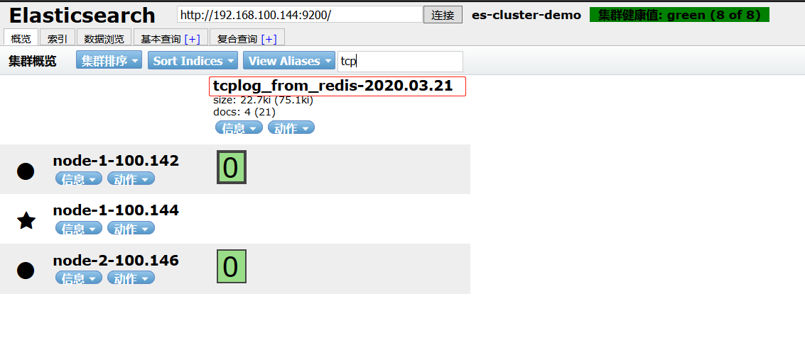
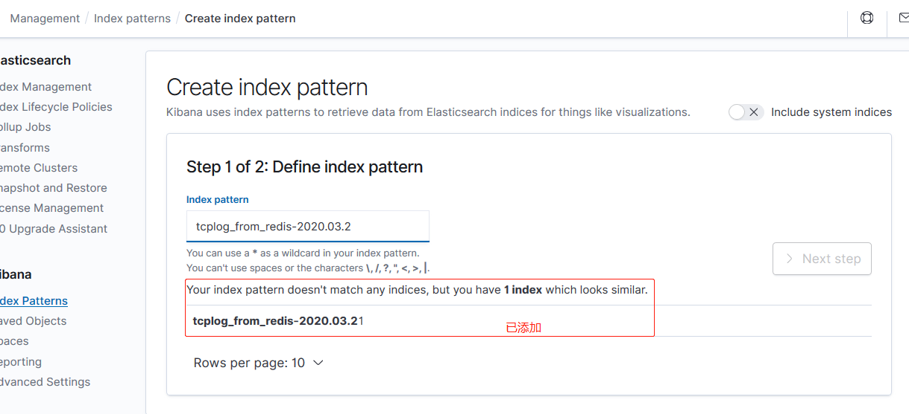
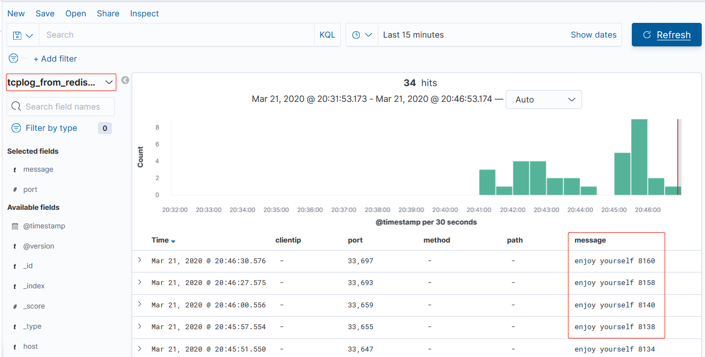

环境：

| 主机名              | IP              | 运行的服务                      |
| :------------------ | :-------------- | :------------------------------ |
| es-server-node1     | 192.168.100.142 | Elasticsearch、Head、Cerebro    |
| es-server-node2     | 192.168.100.144 | Elasticsearch 、Logstash        |
| es-server-node3     | 192.168.100.146 | Elasticsearch 、Kibana          |
| nginx-tomcat-server | 192.168.100.150 | logstash、nginx、tomcat、haprxy |
| redis-server        | 192.168.100.152 | logstash、tomcat、redis         |

# 一. 部署 redis 和 tomcat

## 1.1 安装 redis

[Redis-releases](http://download.redis.io/releases/)

```bash
root@redis-server:~# cd /usr/local/src/
root@redis-server:/usr/local/src# wget http://download.redis.io/releases/redis-4.0.14.tar.gz
root@redis-server:/usr/local/src# ll
total 1712
drwxr-xr-x  2 root root    4096 Mar 19 11:10 ./
drwxr-xr-x 10 root root    4096 Dec 30 23:20 ../
-rw-r--r--  1 root root 1740967 Mar 19  2019 redis-4.0.14.tar.gz

root@redis-server:/usr/local/src# tar xf redis-4.0.14.tar.gz
root@redis-server:/usr/local/src# ln -sv /usr/local/src/redis-4.0.14 /usr/local/redis
'/usr/local/redis' -> '/usr/local/src/redis-4.0.14'

root@redis-server:/usr/local/src# cd /usr/local/redis/deps/
root@redis-server:/usr/local/redis/deps#

root@redis-server:/usr/local/redis/deps# ll
total 44
drwxrwxr-x 6 root root 4096 Mar 19 11:14 ./
drwxrwxr-x 6 root root 4096 Mar 19  2019 ../
drwxrwxr-x 4 root root 4096 Mar 19 11:14 hiredis/
drwxrwxr-x 8 root root 4096 Mar 19 11:14 jemalloc/
drwxrwxr-x 2 root root 4096 Mar 19 11:14 linenoise/
drwxrwxr-x 6 root root 4096 Mar 19  2019 lua/
-rw-r--r-- 1 root root    1 Mar 19 11:14 .make-cflags
-rw-rw-r-- 1 root root 2518 Mar 19  2019 Makefile
-rw-r--r-- 1 root root    1 Mar 19 11:14 .make-ldflags
-rw-r--r-- 1 root root    0 Mar 19 11:14 .make-prerequisites
-rw-rw-r-- 1 root root 3517 Mar 19  2019 README.md
-rwxrwxr-x 1 root root  282 Mar 19  2019 update-jemalloc.sh*

root@redis-server:/usr/local/redis/deps# make hiredis jemalloc linenoise lua

root@redis-server:/usr/local/redis/deps# cd ..
root@redis-server:/usr/local/redis# make

root@redis-server:/usr/local/redis# vim redis.conf

# 配置redis，关闭RDB和AOF数据持久策略
oot@redis-server:/usr/local/redis# grep "^[a-Z]" redis.conf
bind 0.0.0.0
protected-mode yes
port 6379
tcp-backlog 511
timeout 0
tcp-keepalive 300
daemonize yes
supervised no
pidfile /var/run/redis_6379.pid
loglevel notice
logfile ""
databases 16
always-show-logo yes
stop-writes-on-bgsave-error yes
rdbcompression no
rdbchecksum no
slave-serve-stale-data yes
slave-read-only yes
repl-diskless-sync no
repl-diskless-sync-delay 5
repl-disable-tcp-nodelay no
slave-priority 100
lazyfree-lazy-eviction no
lazyfree-lazy-expire no
lazyfree-lazy-server-del no
slave-lazy-flush no
appendonly no
#appendfilename "appendonly.aof"
#appendfsync everysec
#no-appendfsync-on-rewrite no
#auto-aof-rewrite-percentage 100
#auto-aof-rewrite-min-size 64mb
#aof-load-truncated yes
#aof-use-rdb-preamble no
lua-time-limit 5000
slowlog-log-slower-than 10000
slowlog-max-len 128
latency-monitor-threshold 0
notify-keyspace-events ""
hash-max-ziplist-entries 512
hash-max-ziplist-value 64
list-max-ziplist-size -2
list-compress-depth 0
set-max-intset-entries 512
zset-max-ziplist-entries 128
zset-max-ziplist-value 64
hll-sparse-max-bytes 3000
activerehashing yes
client-output-buffer-limit normal 0 0 0
client-output-buffer-limit slave 256mb 64mb 60
client-output-buffer-limit pubsub 32mb 8mb 60
hz 10
aof-rewrite-incremental-fsync yes

# 创建命令软链接
root@redis-server:~# ln -sv /usr/local/redis/src/redis-server /usr/bin/
'/usr/bin/redis-server' -> '/usr/local/redis/src/redis-server'

root@redis-server:~# ln -sv /usr/local/redis/src/redis-cli /usr/bin/
'/usr/bin/redis-cli' -> '/usr/local/redis/src/redis-cli'
```

## 1.2 配置 redis 访问密码

```bash
root@redis-server:~# redis-cli
127.0.0.1:6379> ping HelloRedis.
"HelloRedis."

127.0.0.1:6379> config set requirepass stevenux  # 重启后失效
OK
127.0.0.1:6379> keys *
(error) NOAUTH Authentication required.
127.0.0.1:6379> auth stevenux
OK
127.0.0.1:6379> keys *
(empty list or set)
127.0.0.1:6379>
```

## 1.3 tomcat 部署

略，注意将 tomcat 的日志格式自定义为 json

# 二. 配置 logstash 将日志写入 redis

将 tomcat 服务器的 logstash 收集之后的 tomcat 访问日志写入到 redis 服务器，
然后通过与 ES 集群相连的 logstash 将 redis 服务器的数据取出在写入到
elasticsearch 服务器。需要使用 logstash outpt 插件 redis。

[logstash output plugin redis:官方文档](https://www.elastic.co/guide/en/logstash/current/plugins-outputs-redis.html)

## 2.1 安装 logstash

```bash
# 拷贝之前服务器的logstash deb包
root@nginx-tomcat-server:~# scp /usr/local/src/logstash-7.6.1_.deb 192.168.100.152:/usr/local/src/

# 安装java环境
root@redis-server:/usr/local/src# apt install -y openjdk-11-jdk

# 安装logstash
root@redis-server:/usr/local/src# dpkg -i logstash-7.6.1_.deb
```

## 2.2 配置文件编写

```bash
root@redis-server:~# vim /etc/logstash/conf.d/log-redis.conf
root@redis-server:~# cat /etc/logstash/conf.d/log-redis.conf
input {
  file {
    path => "/usr/local/tomcat/logs/tomcat_access_log.2020-03-19.log"
    type => "tomcat_accesslog_toredis"
    start_position => "beginning"
    stat_interval => "2"
    codec => "json"
  }
  tcp {
    port => "4321"
    mode => "server"
    type => "tcplog_toredis"
  }
}

output {
  if [type] == "tomcat_accesslog_toredis" {
    redis {       # redis插件需要的配置项，查看官方文档获取
      data_type => "list"
      key => "tomcat_accesslog_100.152"
      host => "192.168.100.152"
      port => "6379"
      db => "0"
      password => "stevenux"
    }
  }
  if [type] == "tcplog_toredis" {
    redis {
      data_type => "list"
      key => "tcplog_100.152"
      host => "192.168.100.152"
      port => "6379"
      db => "1"
      password => "stevenux"
    }
  }
}

```

## 2.3 检查语法

```bash
root@redis-server:~# /usr/share/logstash/bin/logstash -f /etc/logstash/conf.d/log-redis.conf  -t
...
...Using config.test_and_exit mode. Config Validation Result: OK. Exiting Logstash
...
```

## 2.4 启动 logstash 验证 redis 数据

访问一下 tomcat：

```bash
~# while : ; do curl 127.0.0.1:8080 ; sleep 1; done
```

查看 redis 键和值：

```bash
root@redis-server:~# redis-cli
127.0.0.1:6379> auth stevenux
OK
127.0.0.1:6379> keys *
1) "tomcat_accesslog_100-152"
127.0.0.1:6379> lpop tomcat_accesslog_100-152
"{\"status\":\"200\",\"Query?string\":\"\",\"path\":\"/usr/local/tomcat/logs/tomcat_access_log.2020-03-19.log\",\"SendBytes\":\"11204\",\"type\":\"tomcat_accesslog_toredis\",\"authenticated\":\"-\",\"AgentVersion\":\"curl/7.58.0\",\"@version\":\"1\",\"method\":\"GET / HTTP/1.1\",\"ClientUser\":\"-\",\"partner\":\"-\",\"@timestamp\":\"2020-03-19T04:34:51.747Z\",\"clientip\":\"127.0.0.1\",\"host\":\"redis-server\",\"AccessTime\":\"[19/Mar/2020:12:34:07 +0800]\"}"
127.0.0.1:6379> lpop tomcat_accesslog_100-152
"{\"status\":\"200\",\"Query?string\":\"\",\"path\":\"/usr/local/tomcat/logs/tomcat_access_log.2020-03-19.log\",\"SendBytes\":\"11204\",\"type\":\"tomcat_accesslog_toredis\",\"authenticated\":\"-\",\"AgentVersion\":\"curl/7.58.0\",\"@version\":\"1\",\"method\":\"GET / HTTP/1.1\",\"ClientUser\":\"-\",\"partner\":\"-\",\"@timestamp\":\"2020-03-19T04:34:51.773Z\",\"clientip\":\"127.0.0.1\",\"host\":\"redis-server\",\"AccessTime\":\"[19/Mar/2020:12:34:09 +0800]\"}"
...
127.0.0.1:6379> select 1
OK
127.0.0.1:6379[1]> keys *
1) "tcplog_100-152"
127.0.0.1:6379[1]> lpop tcplog_100-152
"{\"@version\":\"1\",\"host\":\"redis-server\",\"@timestamp\":\"2020-03-19T04:26:39.043Z\",\"message\":\"Hello , redis.\",\"type\":\"tcplog_toredis\",\"port\":44265}"
127.0.0.1:6379[1]> lpop tcplog_100-152
"{\"@version\":\"1\",\"host\":\"redis-server\",\"@timestamp\":\"2020-03-19T04:26:42.828Z\",\"message\":\"Hello , redis...\",\"type\":\"tcplog_toredis\",\"port\":44277}"
127.0.0.1:6379[1]> lpop tcplog_100-152
"{\"@version\":\"1\",\"host\":\"redis-server\",\"@timestamp\":\"2020-03-19T04:26:46.716Z\",\"message\":\"Hello , redis......\",\"type\":\"tcplog_toredis\",\"port\":44285}"
127.0.0.1:6379[1]> lpop tcplog_100-152
(nil)
127.0.0.1:6379[1]> lpop tcplog_100-152
```

# 三. 配置其它 logstash 从 redis 读取数据

配置专门 logstash 服务器从 redis 读取指定的 key 的数据，并写入到 elasticsearch

## 3.1 logstash 配置

```bash
root@es-server-node2:~# vim /etc/logstash/conf.d/redis_to_es.conf
input {
  redis {
    type => "tcplog_redis"
    data_type => "list"
    key => "tcplog_100-152"
    host => "192.168.100.152"
    port => "6379"
    db => "1"
    password => "stevenux"
    codec => "json"
  }
}

output {
    elasticsearch {
      hosts => ["192.168.100.146:9200"]
      index => "tcplog_from_redis-%{+YYYY.MM.dd}"
    }
}
```

## 3.2 查看Head



# 四. Kibana 展示

## 4.1 更新数据
```bash
~# while :; do let i+=2; echo  "enjoy yourself $[$i + 1]" >> /dev/tcp/192.168.100.152/8008; sleep 3; done
```

## 4.2 添加index pattern



## 4.3 查看


