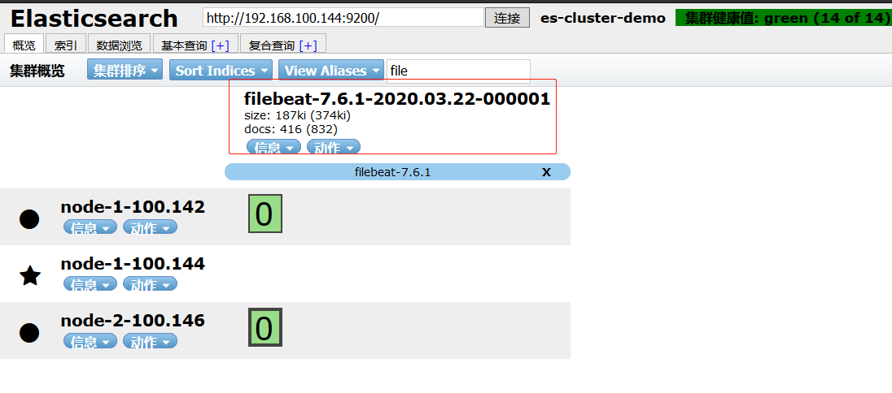
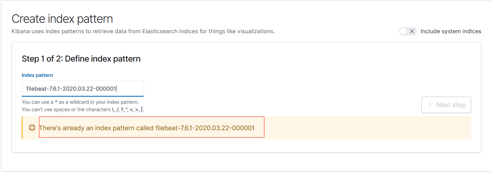
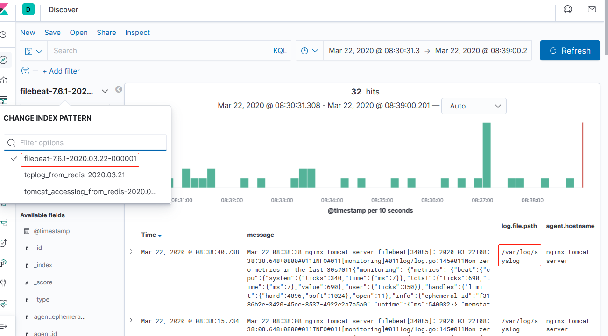
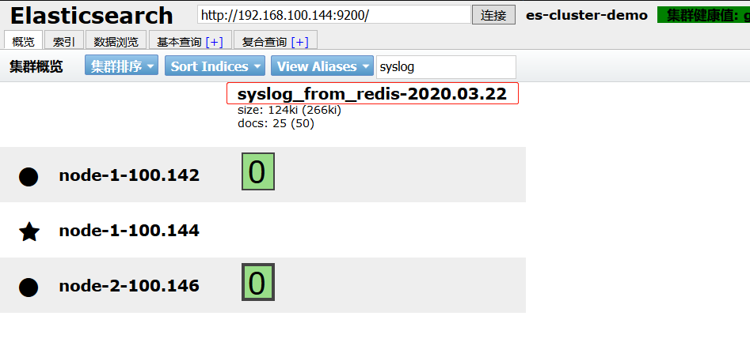
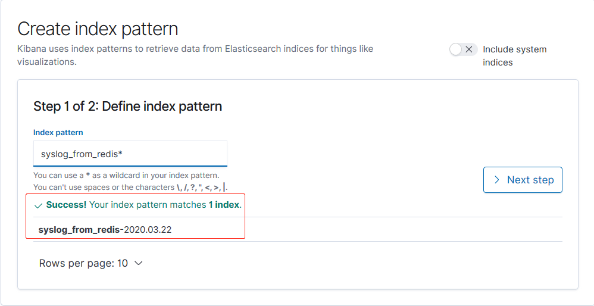
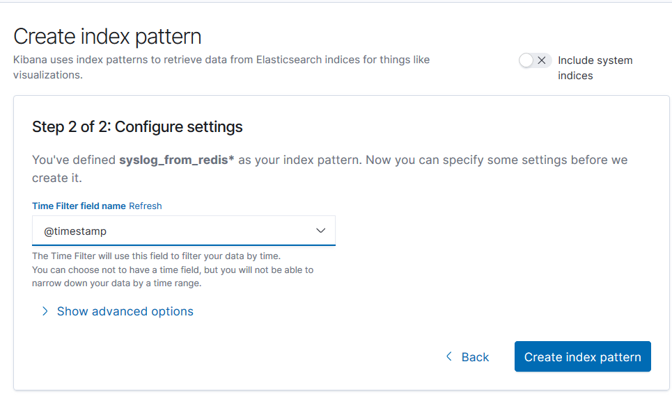
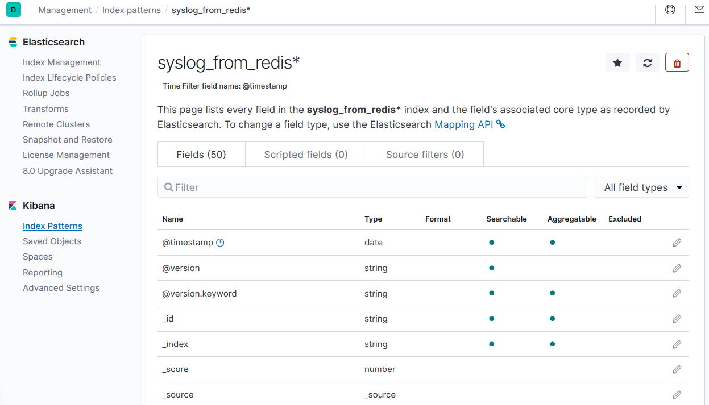
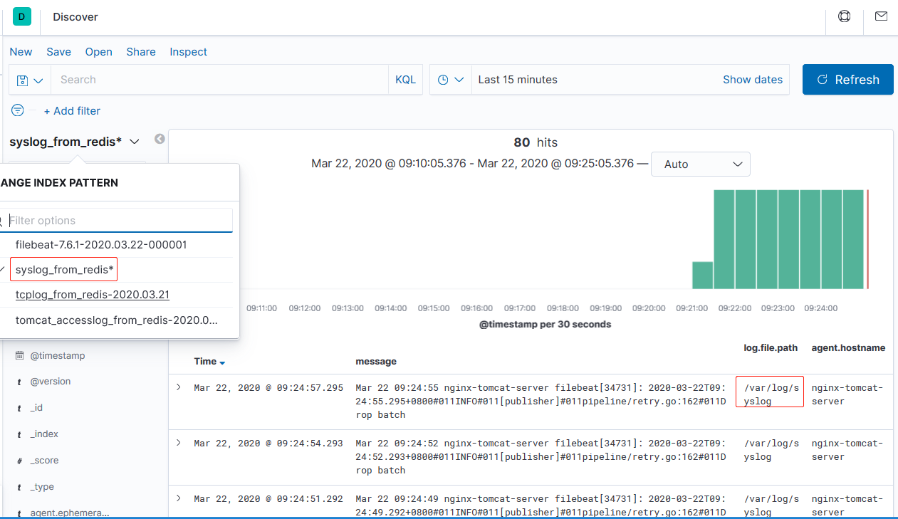
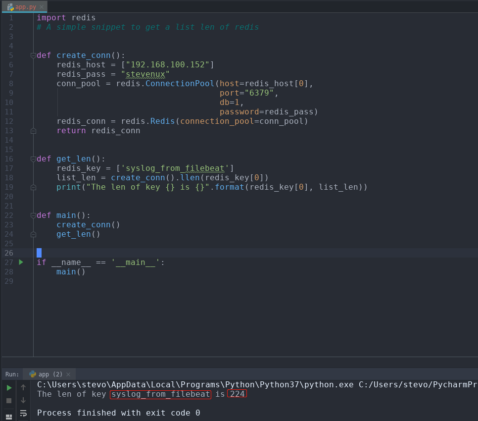

Filebeat 是轻量级单用途的日志收集工具，用于在没有安装 java 的服务器上专
门收集日志，可以将日志转发到 logstash、elasticsearch 或 redis 及 kafka 中
进行下一步处理。

[官网下载地址](https://www.elastic.co/downloads/beats/filebeat)
[官方文档](https://www.elastic.co/guide/en/beats/filebeat/current/filebeat-configuration-details.html)

环境：

| 主机名              | IP              | 运行的服务                      |
| :------------------ | :-------------- | :------------------------------ |
| es-server-node1     | 192.168.100.142 | Elasticsearch、Head、Cerebro    |
| es-server-node2     | 192.168.100.144 | Elasticsearch 、Logstash        |
| es-server-node3     | 192.168.100.146 | Elasticsearch 、Kibana          |
| nginx-tomcat-server | 192.168.100.150 | filebeat、nginx、tomcat、haprxy |
| redis-server        | 192.168.100.152 | logstash、tomcat、redis         |

# 一. 配置 nginx 或 tomcat 的日志为 json

## 1.1 nginx

```bash
~# vim /apps/nginx/conf/nginx.conf
http {
    include       mime.types;
    default_type  application/octet-stream;

    log_format  access_json  '{"@timestamp":"$time_iso8601",'
        		     '"host":"$server_addr",'
        		     '"clientip":"$remote_addr",'
        		     '"size":"$body_bytes_sent",'
        		     '"responsetime":"$request_time",'
        		     '"upstreamtime":"$upstream_response_time",'
        		     '"upstreamhost":"$upstream_addr",'
        		     '"http_host":"$host",'
        		     '"url":"$uri",'
        		     '"domain":"$host",'
        		     '"xff":"$http_x_forwarded_for",'
        		     '"referer":"$http_referer",'
        		     '"status":"$status"}';

    access_log  logs/access.log  access_json;
...
server {
    ...
}
...
}
```

## 1.2 tomcat

```bash
<Server>
  <Service>
    <Engine>
      <Host name="localhost"  appBase="webapps" unpackWARs="true" autoDeploy="true">

        <!-- SingleSignOn valve, share authentication between web applications
             Documentation at: /docs/config/valve.html -->
        <!--
        <Valve className="org.apache.catalina.authenticator.SingleSignOn" />
        -->

        <!-- Access log processes all example.
             Documentation at: /docs/config/valve.html
             Note: The pattern used is equivalent to using pattern="common" -->

        <Valve className="org.apache.catalina.valves.AccessLogValve" directory="logs"
               prefix="tomcat_access_log" suffix=".log"
               pattern="{&quot;clientip&quot;:&quot;%h&quot;,&quot;ClientUser&quot;:&quot;%l&quot;,
               &quot;authenticated&quot;:&quot;%u&quot;,&quot;AccessTime&quot;:&quot;%t&quot;,
               &quot;method&quot;:&quot;%r&quot;,&quot;status&quot;:&quot;%s&quot;,
               &quot;SendBytes&quot;:&quot;%b&quot;,&quot;Query?string&quot;:&quot;%q&quot;,
               &quot;partner&quot;:&quot;%{Referer}i&quot;,&quot;AgentVersion&quot;:&quot;%{User-Agent}i&quot;}" />

      </Host>
    </Engine>
  </Service>
</Server>

```

# 二. 安装 filebeat 并配置收集系统日志写入 ES 集群

## 2.1 安装配置 filebeat

[Ubuntu 各版本清华镜像下载](https://mirrors.tuna.tsinghua.edu.cn/elasticstack/7.x/apt/pool/main/f/filebeat/)

### 2.1.1 下载并安装

```bash
# 下载
~# wget https://mirrors.tuna.tsinghua.edu.cn/elasticstack/7.x/apt/pool/main/f/filebeat/filebeat-7.6.1-amd64.deb
~# ll filebeat-7.6.1-amd64.deb
-rw-r--r-- 1 root root 25079230 Mar 18 15:57 filebeat-7.6.1-amd64.deb

# 安装
~# dpkg -i filebeat-7.6.1-amd64.deb
```

### 2.1.2 配置

```bash
~# vim /etc/filebeat/filebeat.yml
root@nginx-tomcat-server:~# grep '^[^#].*' /etc/filebeat/filebeat.yml | grep -Ev '..#.*'
filebeat.inputs:
- type: log
  enabled: true  # 使该日志收集配置生效
  paths:
    - /var/log/syslog
  exclude_lines: ['^DBG']  # 不收集以DBG开头的行
  #include_lines: ['^ERR', '^WARN'] # 收集
output.elasticsearch:
  hosts: ["192.168.100.142:9200"]
filebeat.config.modules:
  path: ${path.config}/modules.d/*.yml
  reload.enabled: false
setup.template.settings:
  index.number_of_shards: 1
processors:
  - add_host_metadata: ~
  - add_cloud_metadata: ~
  - add_docker_metadata: ~
  - add_kubernetes_metadata: ~
```

## 2.2 添加到 Kibana

### 2.2.1 查看 head 是否生成索引



### 2.2.2 在 Kibana 添加 index pattern

已经添加


### 2.2.3 查看数据



# 三. 配置 filebeat 收集系统日志写入 redis

## 3.1 配置 filebeat

```bash
root@nginx-tomcat-server:~# vim /etc/filebeat/filebeat.yml
root@nginx-tomcat-server:~# grep '^[^#]' /etc/filebeat/filebeat.yml | grep -v '..#.*'
filebeat.inputs:
- type: log
  enabled: true
  paths:
    - /var/log/syslog
  document_type: system-log
  exclude_lines: ['^DBG']
  fields:  # 自定义一个条目
    list: syslog_from_filebeat  # 自定义键为list，值为syslog_from_filebeat
filebeat.config.modules:
  path: ${path.config}/modules.d/*.yml
  reload.enabled: false
setup.template.settings:
  index.number_of_shards: 1
output.redis:  # 输出到redis
  hosts: ["192.168.100.152:6379"]
  password: "stevenux"
  key: "%{[fields.list]:syslog}"  # 使用inputs中定义的fields下的list值作为redis中的key名称，如果该值丢失，则使用syslog作为key名
  db: 1  # 写入redis的数据库1
  timeout: 5
processors:
  - add_host_metadata: ~
  - add_cloud_metadata: ~
  - add_docker_metadata: ~
  - add_kubernetes_metadata: ~

```

## 3.2 redis 配置

```bash
root@redis-server:~# vim /usr/local/src/redis-4.0.14/redis.conf
# 关闭RDB和AOF数据持久化
root@redis-server:~# grep  '^[a-Z]' /usr/local/src/redis-4.0.14/r
edis.conf
bind 0.0.0.0
protected-mode yes
port 6379
tcp-backlog 511
timeout 0
tcp-keepalive 300
daemonize yes
supervised no
pidfile /var/run/redis_6379.pid
loglevel notice
logfile ""
databases 16
always-show-logo yes
stop-writes-on-bgsave-error yes
rdbcompression no
rdbchecksum no
slave-serve-stale-data yes
slave-read-only yes
repl-diskless-sync no
repl-diskless-sync-delay 5
repl-disable-tcp-nodelay no
slave-priority 100
lazyfree-lazy-eviction no
lazyfree-lazy-expire no
lazyfree-lazy-server-del no
slave-lazy-flush no
appendonly no
...
```

## 3.3 启动 filebeat 和 redis

```bash
# filebeat
root@nginx-tomcat-server:~# systemctl restart filebeat

# redis
root@redis-server:~# ll /usr/bin/redis-server
lrwxrwxrwx 1 root root 33 Mar 19 11:21 /usr/bin/redis-server -> /usr/local/redis/src/redis-server*
root@redis-server:~# redis-server
```

## 3.4 查看 redis 数据

```bash
root@redis-server:~# redis-cli
127.0.0.1:6379> auth stevenux
OK
127.0.0.1:6379> select 1
OK
127.0.0.1:6379[1]> KEYS *
1) "syslog_from_filebeat"
127.0.0.1:6379[1]> llen syslog_from_filebeat
(integer) 306
127.0.0.1:6379[1]> lpop syslog_from_filebeat
"{\"@timestamp\":\"2020-03-22T00:52:59.299Z\",\"@metadata\":{\"beat\":\"filebeat\",\"type\":\"_doc\",\"version\":\"7.6.1\"},\"fields\":{\"list\":\"syslog_from_filebeat\"},\"ecs\":{\"version\":\"1.4.0\"},\"host\":{\"containerized\":false,\"hostname\":\"nginx-tomcat-server\",\"architecture\":\"x86_64\",\"os\":{\"version\":\"18.04.3 LTS (Bionic Beaver)\",\"family\":\"debian\",\"name\":\"Ubuntu\",\"kernel\":\"4.15.0-55-generic\",\"codename\":\"bionic\",\"platform\":\"ubuntu\"},\"name\":\"nginx-tomcat-server\",\"id\":\"e96c1092201442a4aeb7f67c5c417605\"},\"agent\":{\"version\":\"7.6.1\",\"type\":\"filebeat\",\"ephemeral_id\":\"ff29ac8e-b6ad-488a-a67a-4d729d368a64\",\"hostname\":\"nginx-tomcat-server\",\"id\":\"93f937e9-e692-4434-8b83-7562f95ef976\"},\"log\":{\"offset\":20873213,\"file\":{\"path\":\"/var/log/syslog\"}},\"message\":\"Mar 22 08:52:59 nginx-tomcat-server systemd[1]: Stopping Filebeat sends log files to Logstash or directly to Elasticsearch....\",\"input\":{\"type\":\"log\"}}"
```

## 3.6 配置 logstash 从该 redis 取数据并写入 ES 集群

测试配置，将日志输出到终端：

```bash
root@es-server-node2:/etc/logstash/conf.d# cat syslog_from_redis_to_es.conf
input {
  redis {
    host => "192.168.100.152"
    port => "6379"
    db => "1"
    key => "syslog_from_filebeat"
    data_type => "list"
    password => "stevenux"
  }
}

output {
  stdout {
    codec => "rubydebug"
  }

}

```

查看终端：

```bash
root@es-server-node2:/etc/logstash/conf.d# /usr/share/logstash/bin/logstash -f /etc/logstash/conf.d/syslog_from_redis_to_es.conf
...
{
        "fields" => {
        "list" => "syslog_from_filebeat"
    },
         "input" => {
        "type" => "log"
    },
           "ecs" => {
        "version" => "1.4.0"
    },
    "@timestamp" => 2020-03-22T01:14:02.948Z,
      "@version" => "1",
           "log" => {
        "offset" => 21002926,
          "file" => {
            "path" => "/var/log/syslog"
        }
    },
          "host" => {
             "hostname" => "nginx-tomcat-server",
                 "name" => "nginx-tomcat-server",
        "containerized" => false,
         "architecture" => "x86_64",
                   "id" => "e96c1092201442a4aeb7f67c5c417605",
                   "os" => {
                "name" => "Ubuntu",
              "kernel" => "4.15.0-55-generic",
            "platform" => "ubuntu",
            "codename" => "bionic",
              "family" => "debian",
             "version" => "18.04.3 LTS (Bionic Beaver)"
        }
    },
       "message" => "Mar 22 09:14:00 nginx-tomcat-server filebeat[34731]: 2020-03-22T09:14:00.949+0800#011INFO#011[publisher]#011pipeline/retry.go:162#011Drop batch",
         "agent" => {
            "hostname" => "nginx-tomcat-server",
                  "id" => "93f937e9-e692-4434-8b83-7562f95ef976",
                "type" => "filebeat",
        "ephemeral_id" => "ff29ac8e-b6ad-488a-a67a-4d729d368a64",
             "version" => "7.6.1"
    }
}

```

改为 Elasticsearch：

```bash
root@es-server-node2:/etc/logstash/conf.d# cat syslog_from_redis_to_es.conf
input {
  redis {
    host => "192.168.100.152"
    port => "6379"
    db => "1"
    key => "syslog_from_filebeat"
    data_type => "list"
    password => "stevenux"
  }
}

output {
  elasticsearch {
    hosts => ["192.168.100.144:9200"]
    index => "syslog_from_redis-%{+YYYY.MM.dd}"
  }

}

root@es-server-node2:/etc/logstash/conf.d# systemctl start logstash
```

## 3.7 查看 head 插件是否生成索引



## 3.8 在 Kibana 添加 index pattern







## 3.9 查看数据



# 四. 监控 redis 数据长度

实际环境当中，可能会出现 reids 当中堆积了大量的数据而 logstash 由于
种种原因未能及时提取日志，此时会导致 redis 服务器的内存被大量使用，
甚至出现内存即将被完全占用的情景。

看 reids 中的日志队列长度(list 长度)会发现有大量的日志堆积在 redis
当中，使用`LLEN KEY`查看 list 的长度。

## 4.1 停止 logstash 取 redis 的数据

```bash
root@es-server-node2:/etc/logstash/conf.d# systemctl stop logstash
```

## 4.2 编写 python 脚本

```bash
import redis


# A simple snippet to get a list len of redis


def create_conn():
    redis_host = ["192.168.100.152"]
    redis_pass = "stevenux"
    conn_pool = redis.ConnectionPool(host=redis_host[0],
                                     port="6379",
                                     db=1,
                                     password=redis_pass)
    redis_conn = redis.Redis(connection_pool=conn_pool)
    return redis_conn


def get_len():
    redis_key = ['syslog_from_filebeat']
    list_len = create_conn().llen(redis_key[0])
    print("The len of key {} is {}".format(redis_key[0], list_len))


def main():
    create_conn()
    get_len()


if __name__ == '__main__':
    main()
```

## 4.3 获取结果

### 4.3.1 windows 下



### 4.3.2 Ubuntu 下

环境准备：

```bash
root@es-server-node2:/etc/logstash/conf.d# apt install python3-pip
root@es-server-node2:/etc/logstash/conf.d# pip3 install redis

root@es-server-node2:/etc/logstash/conf.d# vim get_len_of_key.py
root@es-server-node2:/etc/logstash/conf.d# cat get_len_of_key.py
```

```py
#!/usr/bin/python3

import redis
# A simple snippet to get a list len of redis


def create_conn():
    redis_host = ["192.168.100.152"]
    redis_pass = "stevenux"
    conn_pool = redis.ConnectionPool(host=redis_host[0],
                                     port="6379",
                                     db=1,
                                     password=redis_pass)
    redis_conn = redis.Redis(connection_pool=conn_pool)
    return redis_conn


def get_len():
    redis_key = ['syslog_from_filebeat']
    list_len = create_conn().llen(redis_key[0])
    print("The len of key {} is {}".format(redis_key[0], list_len))


def main():
    create_conn()
    get_len()


if __name__ == '__main__':
    main()

```

获取值：

```bash
root@es-server-node2:/etc/logstash/conf.d# python3 get_len_of_key.py
The len of key syslog_from_filebeat is 363
```
