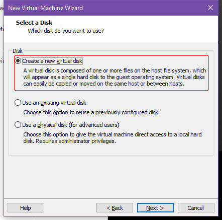
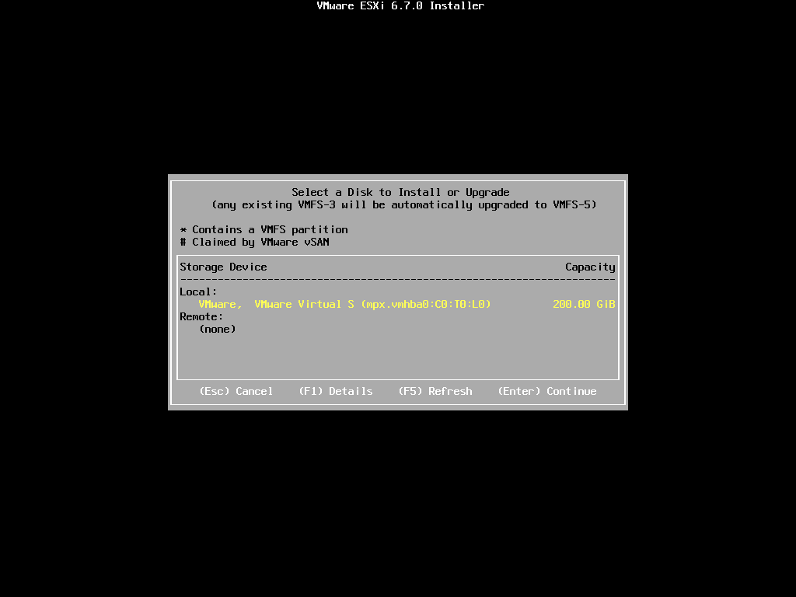
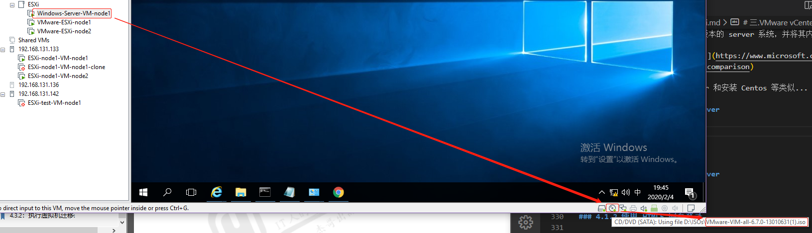
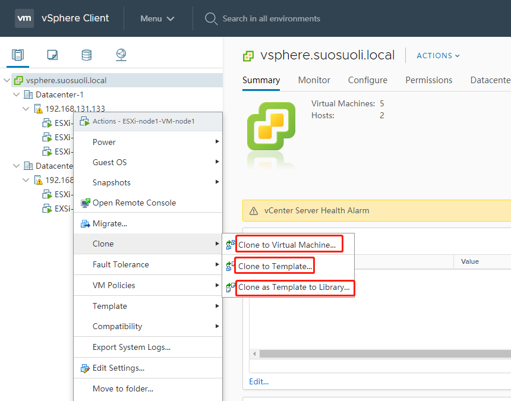
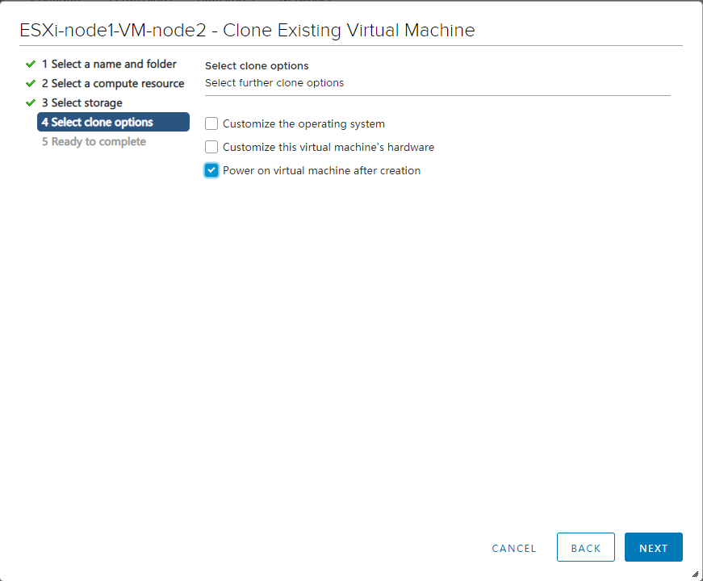
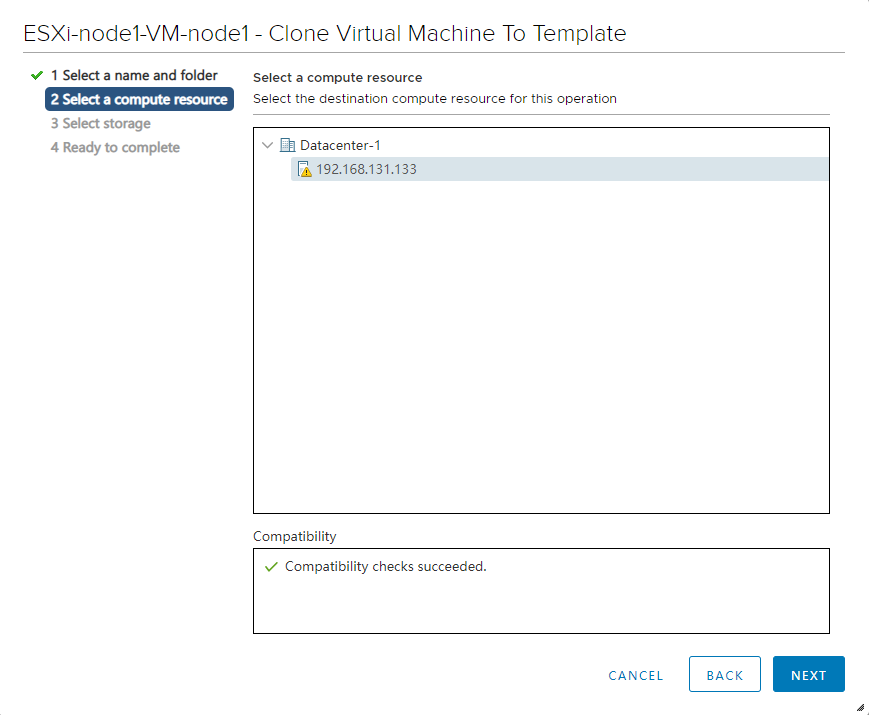
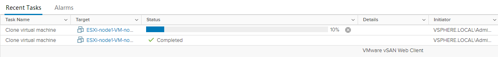
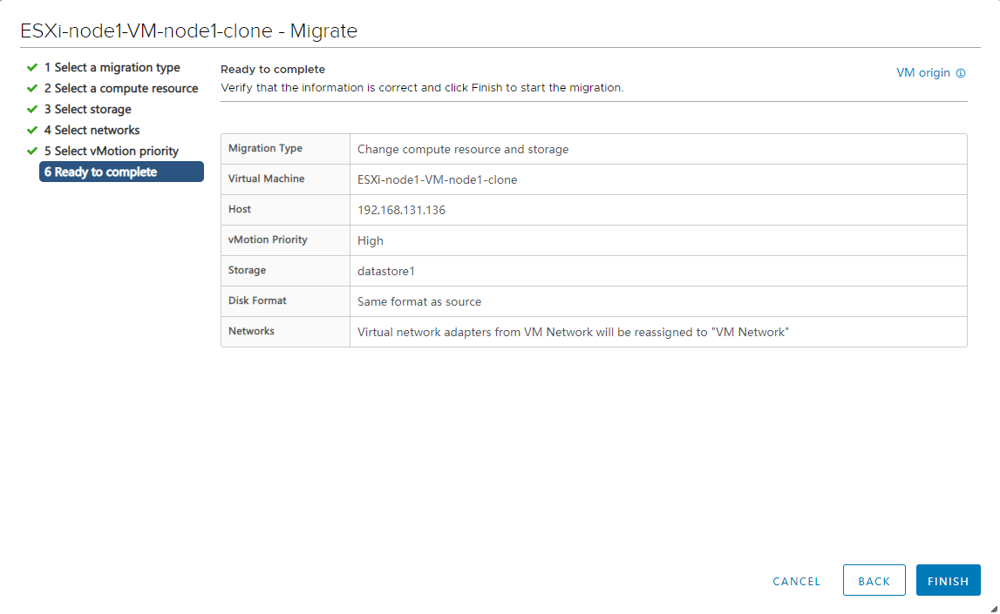

# 一.VMware 介绍

VMware 成立于 1998 年，2003 年存储厂商 EMC 以 6.35 亿美元收购了 VMware；
2015 年 10 月，戴尔宣布以 670 亿美元收购 EMC，VMware 2018 财年全年收入
79.2 亿美元。 [官网](https://www.vmware.com/cn.html)

主要产品:

| 产品                                 | 功能概要                                                                   |
| :----------------------------------- | :------------------------------------------------------------------------- |
| Workstation Pro                      | 面向 Windows 的虚拟化。                                                    |
| Fusion for Mac                       | 面向 Mac 的虚拟化。                                                        |
| ThinApp                              | 是一款无代理应用虚拟化解决方案。                                           |
| Horizon                              | 用于管理虚拟桌面 (VDI)、应用和在线服务的领先平台。                         |
| Horizon Cloud                        | 用于托管虚拟桌面和应用的灵活云计算平台。                                   |
| NSX for Horizon                      | 一款虚拟桌面基础架构 VDI(Virtual Desktop Infrastructure)网络连接解决方案。 |
| VMware Enterprise PKS                | 面向多云企业和服务提供商的生产级 Kubernetes。                              |
| VMware vSphere Integrated Containers | 用于传统应用和容器化应用的企业级容器基础架构。                             |
| vSAN                                 | 经过闪存优化的 vSphere 原生存储，适用于私有云和公有云。                    |

**VMware vSphere:**
业界领先的服务器虚拟化平台，作为基础平台，是云环境的理想之选
[介绍](https://www.vmware.com/cn/products/vsphere.html)

```ruby
Vmware 服务器虚拟化第一个产品叫ESX，后来Vmware在4版本的时候推出了
ESXI，ESXI和ESX的版本最大的技术区别是内核的变化，从4版本开始VMware
把ESX及ESXi产品统称为vSphere，但是VMware从5版本开始以后取消了原来
的ESX版本，所以现在来讲的话vSphere就是ESXI，只是两种叫法而已。一般
官方文档中以称呼vSphere为主。
```

**VMware vCenter Server:**
用于管理跨混合云的 vSphere 环境的集中式平台
[介绍](https://www.vmware.com/cn/products/vcenter-server.html)

**VMware ESXi 和 vCenter Server**


# 二.VMware vSphere

## 2.1 版本选择

现在有如下版本可以选择：5.0 5.5 6.5 6.7
每个版本又分为:
standard 标准版
Enterprise 企业版
Enterprise plus 企业 plus 版

[VMware vsphere 6.5:发行说明](https://docs.vmware.com/cn/VMware-vSphere/6.5/rn/vsphere-esxi-vcenter-server-65-release-notes.html)

```ruby
与 vSphere 6.0 所支持的处理器相比较，vSphere 6.5 不再支持以下处理器：
Intel Xeon 51xx 系列
Intel Xeon 30xx 系列
Intel core 2 duo 6xxx 系列
Intel Xeon 32xx 系列
Intel core 2 quad 6xxx 系列
Intel Xeon 53xx 系列
Intel Xeon 72xx/73xx 系列
```

[VMware vsphere 6.7:发行说明](https://docs.vmware.com/cn/VMware-vSphere/6.7/rn/vsphere-esxi-vcenter-server-67-release-notes.html)

```ruby
与 vSphere 6.5 所支持的处理器相比较，vSphere 6.7 不再支持以下处理器：
Xeon 31xx、33xx、34xx Lynnfield 和 Clarkdale、35xx 和 36xx 系列
Xeon 52xx、54xx、55xx、56xx 系列
Xeon 65xx 系列
Xeon 75xx 和 74xx 系列
i3/i5 Clarkdale 系列
i7-620LE 处理器系列
各种 i3/i5/i7 Nehalem/Bloomfield/Clarksfield、Lynnfield、Clarkdale/Arrandale、Westmere/Gulftown 系列
AMD Barcelona、Shanghai、Champlain、Rana、Istanbul、Magny-Cours、Lisbon系列
Opteron 13xx、23xx、24xx、41xx、61xx、83xx、84xx 系列
Athlon-II-X2 Champlain、Athlon-II-X3/X4 Rana 系列
```

## 2.2 申请使用

如果没有授权的账户，则需要注册账号并申请试用才能下载 VMware 相关产品

### 2.2.1 注册账号

注册地址
https://my.vmware.com/cn/web/vmware/registration
需要到邮箱验证激活注册的帐号

### 2.2.2 申请试用 VMware vSphere

默认的帐号不能下载安装包，需要申请试用相应的产品才可以下载

### 2.2.3 下载 VMware vSphere 安装程序

注册并申请成功后的下载地址类似如下：
https://my.vmware.com/cn/group/vmware/home

## 2.3 安装 VMware ESXi

[官方安装指导文档](https://docs.vmware.com/cn/VMware-vSphere/index.html)

### 2.3.1 新建宿主机

基于 VMware workstation 虚拟机运行 VMware ESXi，安装两台 ESXi 服务器。IP
地址为：`192.168.131.133/24;192.168.131.136/24`

新建虚拟机


自定义


提示最大资源限制


稍后安装操作系统


选择安装的操作系统和版本


命名安装的虚拟机和安装位置选择


分配处理器和每个处理器的核心数


分配内存


选择网络类型


选择 I/O 控制器类型，默认


选择磁盘类型


新建一个磁盘


分配磁盘空间并将其保存为单个文件


磁盘文件名和位置规定


选择 VMware ESXi 安装镜像


启动安装


加载安装器


安装前准备


Enter 安装


F11 同意条款安装


扫描硬件(硬盘)


选择硬盘并按 Enter 安装


选择键盘类型


键入一个 root 用户的密码，字母+数字+特殊字符


提示重新格式化磁盘，F11 安装


安装中


按 Enter 重启


启动中。。。


启动完成


### 2.3.2 新建的 ESXi 主机配置

#### 2.3.2.1 配置静态 IP

输入刚安装时设置的 root 密码登录管理界面


网络配置


IPv4 配置


选择设置静态 IP，按空格键选择


DNS 也配为静态


配置完成后按 Esc，再按 Y 重启网络服务


#### 2.3.2.2 配置允许使用 ssh 协议连接

在`Troubleshooting Options`选项开启 Shell 和 ssh


按 Enter 键更改启用或者禁用


在启用了 Shell 后 Alt+F1 登录 Console，密码就是安装时指定的 root 密码


登录后修改 sshd 的配置文件，可以使用 ssh 协议连接


重启服务


配置完后 Alt+F2 键回到主页面


#### 2.3.2.3 登录 ESXi 的 WEB 管理界面

访问`https://192.168.131.142/`进入 web 管理界面


由于是自签名证书，接受风险继续访问


输入安装时的密码，登录


概览


#### 2.3.2.4 通过 VMware Workstation 管理 ESXi 主机


## 2.4 通过 WEB 界面在 EXSi 主机安装虚拟机

由于实验使用 WVware Workstation 安装 ESXi 系统来模拟机房的 ESXi 主机，再
在 ESXi 主机内安装虚拟机就需要嵌套虚拟化的支持，所以在宿主机需要开启硬件辅
助虚拟化功能，即必须在宿主机的 BIOS 设置中开启 Intel vt-x，如果是 AMD CPU
则是开启 AMD-V 虚拟化技术。一般在 BIOS 的 CPU 处理器设置选项处设置。

### 2.4.1 ISO 镜像准备

先在 Datastore1 存储中创建一个目录来放系统 ISO 镜像


上传 ISO 镜像


在近期事务可以看到正在进行的事务


### 2.4.2 创建虚拟机


### 2.4.3 管理虚拟机

#### 2.4.3.1 配置静态 IP

略

#### 2.4.3.2 远程连接测试

# 三.VMware vCenter Server

VMware vCenter Server 必须安装在 windows server 系统且系统版本是
windows Server 2008 SP2 或更高版本，此次以 windows server 2016 为例。

## 3.1 VMware vCenter Server 运行环境

- VMware vSphere vCenter 需要最小 8176MB 内存，假如内存大小不符合要求，则报错

- 系统环境需要有相关的 C 运行时环境

## 3.2 安装 Windows Server 2016

安装 windows server 2016 以上版本的 server 系统，并将其内存设置为 8176MB
或以上。
[Windoes Servcer 各版本主要区别](https://www.microsoft.com/zh-cn/cloud-platform/windows-server-comparison)

**在 VMware 上安装 Windows Server 和安装 Centos 等类似...**

## 3.3 安装 VMware vCenter Server

将 vCenter Server 的 ISO 镜像挂载到 Windows Server 虚拟机的光盘驱动器


双击运行安装


# 四.管理 VMware vSphere 主机

## 4.1 访问 WMware vCenter Server

### 4.1.1 证书问题

接受风险继续


### 4.1.2 使用 HTML5 网页登录


### 4.1.3 界面概览


## 4.2 管理 VMware vSphere

### 4.2.1 新建数据中心

- 新建数据中心
  
  
  

### 4.2.2 添加 ESXi 主机

- 添加主机
  
  
  
  
  
  
  
  

### 4.2.3 克隆和模板

- clone
  

虚拟机可克隆为虚拟机(可以跨机房克隆)
虚拟机也可以克隆为模板，模板可以转换为虚拟机(也可以跨机房)

#### 4.2.3.1 克隆虚拟机

克隆菜单


此处将数据中心 1 的 ESXi-node1-VM-node2 克隆到数据中心 2


选择克隆到的 EXSi 主机，警告不影响


选择目标主机的存储


自定义此克隆虚拟机的一些选项


概览


克隆任务进行中


成功


#### 4.2.3.2 克隆到模板

克隆到模板







查看 clone 的模板


模板的作用


1. 从该模板创建新虚拟机
2. 将该模板转换为新的虚拟机
3. 使用该模板克隆一个模板
4. 将该模板克隆到库

### 4.2.3 管理已有主机和虚拟机

#### 4.2.3.1 虚拟机状态

虚拟机状态管理


#### 4.2.3.2 使用网页控制台登录虚拟机


#### 4.2.3.3 配置虚拟机静态 IP

略

#### 4.2.3.4 验证能否提供服务

略(安装 nginx 或者 httpd 验证)

## 4.3 在 ESXi 主机之间迁移虚拟机

### 4.3.1 配置 vMotion 专用网络

- 迁移添加 vmotion
  
  
  
  
  
  
  迁移 vmotion summary
  
  

### 4.3.2 迁移

- 迁移操作
- Datacenter-1 到 Datacenter-2：
  
  
  出现下面的情况原因是目前需要迁移的虚拟机连接了一个系统 ISO 镜像，而
  Datacenter-2 中的 192.168.131.136 主机的硬件并没有该 ISO 镜像
  
  只需要将需要迁移的虚拟机连接的 ISO 弹出即可
  
  
  如上图，取消两个勾选框的 √ 就可以

  选择迁移到的主机
  
  选择存储
  
  选择网络
  
  选择迁移操作是否高优先级处理
  
  概览
  
  迁移进度
  

* Datacenter-2 到 Datacenter-1：
  
  
  
  
  
  
  

  迁移进行中...
  

# 五.整个实验概览

实验的物理主机、VMware Workstation、ESXi 主机、ESXi 上的虚拟机、
运行 vCenter Server 的 Windows Server 2016 之间的关系

