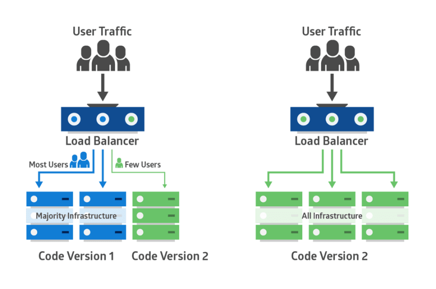

# 概述

随着互联网的发展和 IT 基础设施的进步，软件开发的最大变化之一就是部署的频率。
产品团队越来越重视更早地(且更频繁地)将正式发布的产品部署到生产环境中。几个
月或几年的发布周期正变得越来越少——特别是在那些纯粹的构建和提供软件产品服务
的公司或机构。

在当今的 IT 软件服务行业，使用面向服务的体系结构和微服务架构方法，开发人员
可以设计模块化的代码。这使得他们可以同时将更改写入和部署到整个项目的代码的
不同部分。缩短产品的部署周期的好处是显而易见的：

- 新产品更快进入的进入市场
- 客户在更短时间内得到产品的价值
- 客户的反馈将会更快的回流到产品组，这意味着开发团队可以更快的迭代产品
  和修复 BUG
- 还可以提升开发人员的战斗力和幸福感

然而，这种快速部署的转变也为运营团队或 DevOps 团队带来了新的挑战。对于
更频繁的部署，部署的代码更有可能对站点可靠性或客户体验产生负面影响。这就
是为什么开发部署代码的策略来最小化产品和客户的风险是非常重要的。

# 一. 当前软件应用面临的挑战

当前的应用程序通常是分布式的和基于云的。它们可以弹性地伸缩以满足需求，并且
几乎都是部署与高可用架构的应用，由于高度可用的体系结构，在产生故障时，其更
容易快速恢复。

为满足如今的消费者和客户，这些应用程序几乎总是有频繁的更新部署。例如，一个
移动应用程序或一个消费者 web 站点可能在一个月内经历多次更改。有些甚至可以
一天多次部署到生产环境中。

整个开发项目中需要移动的部件(模块)数量的增加意味着出现问题的可能性更大。随
着多个开发团队在整个代码库中进行更改，当一个问题不可避免地发生时，很难确定
问题的根本原因。

由于消费者和客户的需求变化，产品(某个版本)的生命周期也必须尽量的缩短，在频
繁部署和迭代的过程中，涉及多个开发团队的协作和运维的代码发布维护。这种快速
迭代和发布的过程必须不出任何差错，出错后将比传统的部署方式更难发现问题。这
时候就需要开发代码持续部署集成和持续交付的工具，而随之产生了 CI/CD 的概念。

为了应对这些挑战，应用程序开发团队和基础设施团队应该设计并采用适合其产品的
部署策略。下面就介绍比较常见的代码部署方式。

# 二. 比较受欢迎的部署方式介绍

## 2.1 Big Bang 部署方式

`Big Bang`部署方式是软件行业早期使用的部署发布代码方式，Big bang 部署要求
项目产品在发布之前进行广泛的开发和测试，通常与连续版本发布的"瀑布模型"相关联。
使用该方法部署时，往往是需要多个部门协调进行，替换原版本的全部或几乎全部代码
模块。现代应用程序的优点是在客户端或服务器端定期自动更新。这使得 big bang 方
法对现代软件开发团队来说比较慢、不敏捷。

`Big Bang` 部署方式特点：

- 全部主要的代码打包在同一个部署中
- 使用新的软件完全替换现有的软件
- 部署通常会导致较长的开发和测试周期
- 回滚的失败率很高
- 部署花费的时间很高，还会涉及多个部门

Big bang 部署不适合现代应用程序，因为这种风险对于面向公众或业务关键型应用程序来
说是不可接受的，在这些应用程序中，宕机意味着巨大的财务损失。回滚通常是昂贵的、耗
时的，甚至是不可能的。

只不过 big bang 方法可以用于非生产系统(例如，重新创建开发环境)或供应商打包的解决
方案(如桌面应用程序)。

## 2.2 滚动发布

**滚动发布**：滚动、分阶段或分步部署。比 Big Bang 部署更优，因为滚动发布最小化了
许多相关的风险，包括不容易回滚而导致的用户停机。

在滚动部署中，应用程序的新版本会逐渐取代旧版本。实际的部署过程发生在一段时间内，
而不是一次发布完。在此期间，新版本和旧版本将共存，而不会影响功能或用户体验。这个过
程使回滚任何与旧组件不兼容的新组件变得更容易。

下图表示了滚动部署: 在集群中的每个服务器上，旧版本以蓝色显示，新版本以绿色显示


升级一套应用(多个组件构成的应用)就是滚动部署的一个例子。如果原始应用程序部署在容器
中，则升级应用时可以一次处理一个容器。每个容器都经过修改，以便从应用程序供应商的站
点下载最新的容器镜像。如果其中一个应用程序存在兼容性问题，旧的镜像可以重新创建容器。
在这种情况下，一套应用程序的新旧版本共存，直到每个应用程序都升级了。

## 2.3 蓝绿部署

**蓝绿部署**：该部署方式也可以保证生产环境的稳定使用。在不停用老版本代码(不影响上
一个版本访问)的情况下，在另外一套环境部署新版本然后进行测试，测试通过后将用户流量切
到新版本，其特点为业务无中断，升级风险相对较小。

两个完全一样的生产环境配置部署的两套产品，一个是当前正在运行的生产环境，它接收所有
用户流量(用蓝色表示)。另一个是它的克隆，但是是空闲的(绿色)。两者都使用相同的数据库
后端和应用程序配置:


新版本的应用程序部署在绿色环境中，并对其功能和性能进行了测试。一旦测试结果成功，应用
程序流量将从蓝色路由到绿色。绿色则成为新的生产环境应用，提供服务。


如果在绿色变为活动状态后出现问题，可以将流量路由回蓝色。
在蓝绿部署中，两个系统使用相同的持久层或数据库后端。保持应用程序数据同步是很重要的。

对于写操作，可以使用蓝色的主数据库，对于读操作，可以使用绿色的辅助数据库。一旦启用
了绿色环境，就可以关闭或回收旧的蓝色实例。可以在回收的实例上部署一个更新的版本，并使
其成为下一个版本的新绿色环境。

蓝绿部署依赖于流量路由。这可以通过更新主机的 DNS cname 来实现。但是，较长的 TTL 值
会延迟这些更改。或者，可以更改负载均衡器设置，以便更改立即生效。

**蓝绿部署适用的场景：**

```bash
1、不停止老版本，额外部署一套新版本，等测试发现新版本OK后，删除老版本。
2、蓝绿发布是一种用于升级与更新的发布策略，部署的最小维度是容器，而发布的最小维度
   是应用。
3、蓝绿发布对于增量升级有比较好的支持，但是对于涉及数据表结构变更等等不可逆转的升级，
   并不完全合适用蓝绿发布来实现，需要结合一些业务的逻辑以及数据迁移与回滚的策略才可以完
   全满足需求。
```

## 2.4 金丝雀发布

金丝雀部署类似于蓝绿部署，只是其更倾向于规避风险。其使用的是分阶段从蓝切换到绿的方法，
而不是一步从蓝色切换到绿色。

使用金丝雀部署，可以在产品的基础设施的一小部分中部署新的应用程序代码。一旦应用程序被签
名发布，只有少数用户会被路由到该应用。这样可以最大限度地减少任何影响。

在没有报错的情况下，新版本可以逐步扩展到旧版本的其余部分。
下图演示了金丝雀部署过程:



金丝雀部署发布的主要挑战是设计一种将一些用户路由到新应用程序的方法。此外，一些应用程序
可能总是需要相同的用户组进行测试，而其他应用程序可能每次都需要不同的用户组。

对于将不同用户路由到特定的业务模块，可以考虑下面的技术：

- 在允许外部用户访问之前，将内部用户暴露给部分金丝雀部署的新版本
- 基于源 IP 范围的路由
- 在特定地理区域发布应用程序
- 使用应用程序逻辑向特定用户和组解锁新功能。当应用程序处理其他用户请求时，将删除此逻辑。

## 2.5 A/B 测试

A/B 测试也是同时运行两个 APP 环境，但是和蓝绿部署完全是两码事，A/B 测试是用
来测试应用功能表现的方法，例如可用性、受欢迎程度、可见性等等，蓝绿部署的目的
是安全稳定地发布新版本应用，并在必要时回滚，即蓝绿部署是一套正式环境环境在线，
而 A/B 测试是两套正式环境在线，都提供业务服务。

# 三. 部署最佳实践

在现代的软件团队部署代码过程中，可以遵循很多的最佳实践来降低部署风险：

1. 使用一个部署清单(checklist)。例如，checklist 中的一项可能是"仅在 app 服务停止
   后才能备份所有数据库"，防止数据损坏。

2. 采用持续集成(CI)技术栈。CI 会确保代码库的分支代码(branch)只有在经过一些列的依赖检查、
   单元和集成测试及成功构建后，才能与主分支(master)合并。如果这一系列的操作路径
   上出现错误，则会构建失败，并通知应用团队。因此，使用 CI 意味着对软件的每一个改动
   都要在。CI 工具的例子包括:CircleCI, Jenkins。

3. 采用连续交付(CD)技术栈。CD 配合 CI，将代码打包随时准备部署到一个或多个环境。

4. 使用标准操作环境(SOEs)。使用 SOE 来确保环境的一致性。

5. 使用构建自动化工具来自动化环境构建。有了这些工具，通常只需单击一个按钮就可以摧毁
   整个项目基础设施技术栈并从头开始重建。

6. 在目标服务器中使用配置管理工具，如 Puppet、Chef 或 Ansible 来自动应用操作系统设
   置、应用补丁或安装软件等操作。

7. 使用像 Slack 这样的通信渠道来自动通知不成功的构建和应用程序故障。

8. 创建一个流程，在部署失败时向负责的团队发出警报。

9. 为由于可用性或错误率问题而未能通过健康检查的部署启用自动回滚。

# Reference

Jason Skowronski : https://rollbar.com/blog/deployment-strategies/

Octopus Deploy : https://octopus.com/docs/deployment-patterns/canary-deployments
