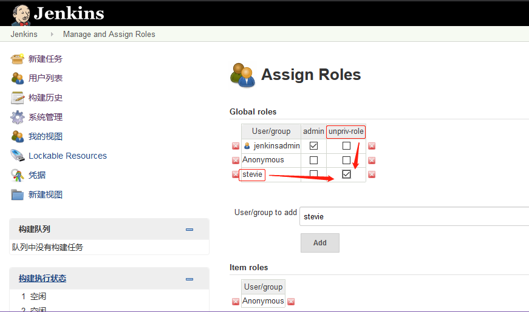

Jenkins 是一款开源 CI&CD 软件，用于自动化各种任务，包括构建、测试和部署软件。
Jenkins 支持各种运行方式，可通过系统包、Docker 或者通过一个独立的 Java 程序。

# 一. 部署 Jenkins

环境:

| 主机名         | IP              |
| :------------- | :-------------- |
| Jenkins-server | 192.168.100.148 |

## 1.1 准备 JAVA 环境

```bash
# 准备jdk并 解压
root@Jenkins-server:~# cd /usr/local/src/
root@Jenkins-server:/usr/local/src# rz -E
rz waiting to receive.
root@Jenkins-server:/usr/local/src# ll
total 189996
drwxr-xr-x  2 root root      4096 Mar 10 15:15 ./
drwxr-xr-x 10 root root      4096 Dec 30 23:20 ../
-rw-r--r--  1 root root 194545143 Feb 20 11:35 jdk-8u241-linux-x64.tar.gz
root@Jenkins-server:/usr/local/src# tar -xf jdk-8u241-linux-x64.tar.gz
root@Jenkins-server:/usr/local/src# ln -sv /usr/local/src/jdk1.8.0_241 /usr/local/jdk
'/usr/local/jdk' -> '/usr/local/src/jdk1.8.0_241'

# 添加环境变量
root@Jenkins-server:/usr/local/src# vim /etc/profile
......
export HISTTIMEFORMAT="%F%T`whoami`"
export LANG="en_US.utf-8"
export JAVA_HOME="/usr/local/jdk"
export CLASSPATH="$JAVA_HOME/jre/lib/rt.jar:$JAVA_HOME/lib/dt.jar:$JAVA_HOME/lib/tools.jar"
export PATH="$JAVA_HOME/bin:$PATH"

# 查看版本
root@Jenkins-server:/usr/local/src# source /etc/profile
root@Jenkins-server:/usr/local/src# java -version
java version "1.8.0_241"
Java(TM) SE Runtime Environment (build 1.8.0_241-b07)
Java HotSpot(TM) 64-Bit Server VM (build 25.241-b07, mixed mode
```

## 1.2 通过 deb 包安装 Jenkins

[官方的 deb 包下载地址](https://pkg.jenkins.io/debian-stable/)

### 1.2.1 安装 daemon 和 jenkins 的 deb 包

```bash
root@Jenkins-server:/usr/local/src# apt install daemon

root@Jenkins-server:/usr/local/src# ll
...
-rw-r--r--  1 root  root   63801152 Mar 10 15:40 jenkins_2.204.4_all.deb

root@Jenkins-server:/usr/local/src# dpkg -i jenkins_2.204.4_all.deb
```

安装出现报错：

```bash
...
Mar 10 15:47:08 Jenkins-server systemd[1]: Starting LSB: Start Jenkins at boot time...
Mar 10 15:47:08 Jenkins-server jenkins[18773]: ERROR: No Java executable found in current PATH: /bin:/usr/bin:/sbin:/usr/sbin  # 在PATH环境变量中未找到java可执行文件
Mar 10 15:47:08 Jenkins-server jenkins[18773]: If you actually have java installed on the system make sure the executable is in the aforementioned path and that 'type -p java' returns the java executable path
...
```

解决方法是将 jdk 文件夹下的 java 可执行文件链接到`/usr/bin/`

```bash
root@Jenkins-server:/usr/local/src# ln -sv /usr/local/jdk/bin/java /usr/bin/
'/usr/bin/java' -> '/usr/local/jdk/bin/java'
```

### 1.2.2 启动 Jenkins

```bash
root@Jenkins-server:/usr/local/src# systemctl start jenkins
root@Jenkins-server:/usr/local/src# systemctl enable jenkins
jenkins.service is not a native service, redirecting to systemd-sysv-install.
Executing: /lib/systemd/systemd-sysv-install enable jenkins
root@Jenkins-server:/usr/local/src# systemctl status jenkins
● jenkins.service - LSB: Start Jenkins at boot time
   Loaded: loaded (/etc/init.d/jenkins; generated)
   Active: active (exited) since Tue 2020-03-10 15:50:26 CST; 10s ago
     Docs: man:systemd-sysv-generator(8)
    Tasks: 0 (limit: 2290)
   CGroup: /system.slice/jenkins.service

Mar 10 15:50:25 Jenkins-server systemd[1]: Starting LSB: Start Jenkins at boot time...
Mar 10 15:50:25 Jenkins-server jenkins[18833]: Correct java version found
Mar 10 15:50:25 Jenkins-server jenkins[18833]:  * Starting Jenkins Automation Server jenkins
Mar 10 15:50:25 Jenkins-server su[18866]: Successful su for jenkins by root
Mar 10 15:50:25 Jenkins-server su[18866]: + ??? root:jenkins
Mar 10 15:50:25 Jenkins-server su[18866]: pam_unix(su:session): session opened for user jenkins by (uid=0)
Mar 10 15:50:25 Jenkins-server su[18866]: pam_unix(su:session): session closed for user jenkins
Mar 10 15:50:26 Jenkins-server jenkins[18833]:    ...done.
Mar 10 15:50:26 Jenkins-server systemd[1]: Started LSB: Start Jenkins at boot time.


root@Jenkins-server:/usr/local/src# ps -ef | grep jenkins
jenkins   18867      1  0 15:50 ?        00:00:00 /lib/systemd/systemd --user
jenkins   18868  18867  0 15:50 ?        00:00:00 (sd-pam)
jenkins   18884      1  0 15:50 ?        00:00:00 /usr/bin/daemon --name=jenkins --inherit --env=JENKINS_HOME=/var/lib/jenkins --output=/var/log/jenkins/jenkins.log --pidfile=/var/run/jenkins/jenkins.pid -- /usr/bin/java -Djava.awt.headless=true -jar /usr/share/jenkins/jenkins.war --webroot=/var/cache/jenkins/war --httpPort=8080
jenkins   18886  18884 31 15:50 ?        00:00:24 /usr/bin/java -Djava.awt.headless=true -jar /usr/share/jenkins/jenkins.war --webroot=/var/cache/jenkins/war --httpPort=8080
root      19021    912  0 15:51 pts/0    00:00:00 grep --color=auto jenkins

root@Jenkins-server:/usr/local/src# lsof -i:8080
COMMAND   PID    USER   FD   TYPE DEVICE SIZE/OFF NODE NAME
java    18886 jenkins  157u  IPv6  63871      0t0  TCP *:http-alt (LISTEN)
```

### 1.2.3 Jenkins 配置

```bash
root@Jenkins-server:~# vim /etc/default/jenkins
root@Jenkins-server:~# grep "^[a-Z]" /etc/default/jenkins
NAME=jenkins
JAVA_ARGS="-Djava.awt.headless=true"
PIDFILE=/var/run/$NAME/$NAME.pid
JENKINS_USER=$NAME
JENKINS_GROUP=$NAME
JENKINS_WAR=/usr/share/$NAME/$NAME.war
JENKINS_HOME=/var/lib/$NAME
RUN_STANDALONE=true
JENKINS_LOG=/var/log/$NAME/$NAME.log
JENKINS_ENABLE_ACCESS_LOG="no"
MAXOPENFILES=8192
HTTP_PORT=8080
PREFIX=/$NAME
JENKINS_ARGS="--webroot=/var/cache/$NAME/war --httpPort=$HTTP_PORT"
```

### 1.2.4 查看看 Jenkins 日志

```bash
root@Jenkins-server:~# tail /var/log/jenkins/jenkins.log -n40

*************************************************************
*************************************************************
*************************************************************

Jenkins initial setup is required. An admin user has been created and a password generated.
Please use the following password to proceed to installation:

22f82f9432184386866c24bbe36b362f  # 初始化安装需要该密码

This may also be found at: /var/lib/jenkins/secrets/initialAdminPassword

*************************************************************
*************************************************************
*************************************************************

2020-03-10 07:50:47.212+0000 [id=25]    INFO    hudson.model.UpdateSite#updateData: Obtained the latest update center data file for UpdateSource default
2020-03-10 07:50:47.927+0000 [id=26]    INFO    jenkins.InitReactorRunner$1#onAttained: Completed initialization
2020-03-10 07:50:47.956+0000 [id=19]    INFO    hudson.WebAppMain$3#run: Jenkins is fully up and running
2020-03-10 07:50:49.489+0000 [id=41]    INFO    hudson.model.UpdateSite#updateData: Obtained the latest update center data file for UpdateSource default
2020-03-10 07:50:50.851+0000 [id=41]    INFO    h.m.DownloadService$Downloadable#load: Obtained the updated data file for hudson.tasks.Maven.MavenInstaller
2020-03-10 07:50:50.852+0000 [id=41]    INFO    hudson.util.Retrier#start: Performed the action check updates server successfully at the attempt #1
2020-03-10 07:50:50.854+0000 [id=41]    INFO    hudson.model.AsyncPeriodicWork#lambda$doRun$0: Finished Download metadata. 16,858 ms

```

### 1.2.5 访问 web 初始化


```bash
root@Jenkins-server:~# cat /var/lib/jenkins/secrets/initialAdminPassword
22f82f9432184386866c24bbe36b362f
```

出现离线问题：


解决：

1. 在安装插件之前，Jenkins 会检查网络的可用性。默认 Jnekins 检查可本机是否可联网是检查
   的`/var/lib/jenkins/updates/default.json` 中定义的第一个键所对应的网址`www.google.com`，
   而国内由于某种不可描述原因，是不能访问谷歌的。将检查地址改为百度或者其它的国内网址即可。

```bash
root@Jenkins-server:~# vim /var/lib/jenkins/updates/default.json
{"connectionCheckUrl":"http://www.google.com/",  # 将该网站换为国内地址

root@Jenkins-server:~# head -c 45 /var/lib/jenkins/updates/default.json
{"connectionCheckUrl":"http://www.baidu.com/"...
```

2. 将`/var/lib/jenkins/hudson.model.UpdateCenter.xml`文件中的插件更新检查地址改成
   国内清华大学地址，然后重启 jenkins 。
   地址：https://mirrors.tuna.tsinghua.edu.cn/jenkins/updates/update-center.json

```bash
root@Jenkins-server:~# vim /var/lib/jenkins/hudson.model.UpdateCenter.xml
<?xml version='1.1' encoding='UTF-8'?>
<sites>
  <site>
    <id>default</id>
    <!-- <url>https://updates.jenkins.io/update-center.json</url> -->
    <url>https://mirrors.tuna.tsinghua.edu.cn/jenkins/updates/update-center.json</url>
  </site>
</sites>

root@Jenkins-server:~# systemctl restart jenkins.service
```

刷新 web 页面，需要再次输入密码，到`/var/lib/jenkins/secrets/initialAdminPassword`
取到密码，继续后出现安装插件页面


### 1.2.6 安装插件

安装推荐的插件，默认情况下从官方下载插件极慢：


### 1.2.7 使用 nginx 代理安装插件

目前 jenkins 官方服务器在国外，从国内在线安装插件速度非常慢，但是可以通过 Nginx
进行 rewrite，将安装插件的请求通过清华大学镜像服务器，以实现插件安装加速，就在
jenkins server 上下载 nginx，使用 nginx 代理，配置如下：

```bash
root@Jenkins-server:~# vim /etc/hosts
127.0.0.1       updates.jenkins-ci.org
...
root@Jenkins-server:~# apt install nginx=1.14.0-0ubuntu1.7

root@Jenkins-server:~# vim /etc/nginx/sites-enabled/default
...
location /download/plugins {
        proxy_set_header Host mirrors.tuna.tsinghua.edu.cn;
        proxy_set_header X-Real-IP $remote_addr;
        proxy_set_header X-Forwarded-For $proxy_add_x_forwarded_for;
        rewrite /download/plugins(.*)  /jenkins/plugins/$1 break;
        proxy_pass http://mirrors.tuna.tsinghua.edu.cn;
}
...

root@Jenkins-server:~# nginx -t
nginx: the configuration file /etc/nginx/nginx.conf syntax is ok
nginx: configuration file /etc/nginx/nginx.conf test is successful
root@Jenkins-server:~# nginx -s reload
```

配置好后刷新安装页面，即可飞速安装...

### 1.2.8 查看看插件安装目录是否有插件

```bash
root@Jenkins-server:~# ll /var/lib/jenkins/plugins/
total 64732
drwxr-xr-x 78 jenkins jenkins    4096 Mar 10 16:35 ./
drwxr-xr-x 15 jenkins jenkins    4096 Mar 10 16:35 ../
drwxr-xr-x  7 jenkins jenkins    4096 Mar 10 16:35 ace-editor/
-rw-r--r--  1 jenkins jenkins 4279042 Mar 10 16:35 ace-editor.jpi
drwxr-xr-x  4 jenkins jenkins    4096 Mar 10 16:35 ant/
drwxr-xr-x  4 jenkins jenkins    4096 Mar 10 16:28 antisamy-markup-formatter/
-rw-r--r--  1 jenkins jenkins  107210 Mar 10 16:28 antisamy-markup-formatter.jpi
-rw-r--r--  1 jenkins jenkins   82963 Mar 10 16:35 ant.jpi
drwxr-xr-x  4 jenkins jenkins    4096 Mar 10 16:35 apache-httpcomponents-client-4-api/
-rw-r--r--  1 jenkins jenkins 1761975 Mar 10 16:35 apache-httpcomponents-client-4-api.jpi
drwxr-xr-x  4 jenkins jenkins    4096 Mar 10 16:35 authentication-tokens/
-rw-r--r--  1 jenkins jenkins   14638 Mar 10 16:35 authentication-tokens.jpi
drwxr-xr-x  4 jenkins jenkins    4096 Mar 10 16:34 bouncycastle-api/
-rw-r--r--  1 jenkins jenkins 4885133 Mar 10 16:34 bouncycastle-api.jpi
drwxr-xr-x  5 jenkins jenkins    4096 Mar 10 16:35 branch-api/
-rw-r--r--  1 jenkins jenkins  308984 Mar 10 16:35 branch-api.jpi
drwxr-xr-x  4 jenkins jenkins    4096 Mar 10 16:34 build-timeout/
-rw-r--r--  1 jenkins jenkins   95589 Mar 10 16:34 build-timeout.jpi
drwxr-xr-x  5 jenkins jenkins    4096 Mar 10 16:26 cloudbees-folder/
...
root@Jenkins-server:~# ll /var/lib/jenkins/plugins/ | wc -l
155
```

### 1.2.9 创建 Jenkins 管理员


用户名应该是：`jenkinsadmin`

### 1.2.10 配置 Jenkins 实例

默认 就行


### 1.2.11 配置完成


### 1.2.12 Jenkins 首页


## 1.3 通过 tomcat 启动 Jenkins

通过 tomcat 8.5.46 运行 jenkins 2.204.4

```bash
~# mkdir /apps
~# cd /apps/
~# cp /usr/local/src/apache-tomcat-8.5.46.tar.gz  .
~# tar xf apache-tomcat-8.5.46.tar.gz
~# cp /usr/local/src/jenkins-2.204.4.war  .
~# sudo apt-get install libxrender-dev  libxtst-dev

~# /apps/apache-tomcat-8.5.46/bin/catalina.sh  start
Using CATALINA_BASE:   /apps/apache-tomcat-8.5.46
Using CATALINA_HOME:   /apps/apache-tomcat-8.5.46
Using CATALINA_TMPDIR: /apps/apache-tomcat-8.5.46/temp
Using JRE_HOME:        /usr/local/jdk
Using CLASSPATH:       /apps/apache-tomcat-8.5.46/bin/bootstrap.jar:/apps/apache-
tomcat-8.5.46/bin/tomcat-juli.jar
Tomcat started.
```

访问`http://192.168.100.148:8080`进行 jenkins 初始化
使用该方式启动的 jenkins 初始化密码位于`/root/.jenkins/secrets/initialAdminPassword`

## 1.4 通过 jar 包直接启动 Jenkins

可以使用 java 可执行命令直接启动 jenkins

```bash
~# java \
-Dcom.sun.management.jmxremote \
-Dcom.sun.management.jmxremote.port=12345 \
-Dcom.sun.management.jmxremote.authenticate=false \
-Dcom.sun.management.jmxremote.ssl=false \
-Djava.rmi.server.hostname="192.168.100.148" \
-jar jenkins-2.204.4.war &
```

访问`http://192.168.100.148:8080`进行 jenkins 初始化
使用该方式启动的 jenkins 初始化密码位于`/root/.jenkins/secrets/initialAdminPassword`

## 1.5 Jenkins 插件安装和管理

[官方插件下载地址](http://updates.jenkins-ci.org/download/plugins/)

### 1.5.1 插件目录

```bash
root@Jenkins-server:~# ll /var/lib/jenkins/plugins/
...
drwxr-xr-x  5 jenkins jenkins    4096 Mar 10 16:35 git/
drwxr-xr-x  4 jenkins jenkins    4096 Mar 10 16:35 git-client/
-rw-r--r--  1 jenkins jenkins 8508380 Mar 10 16:35 git-client.jpi
drwxr-xr-x  7 jenkins jenkins    4096 Mar 10 16:35 github/
drwxr-xr-x  4 jenkins jenkins    4096 Mar 10 16:35 github-api/
-rw-r--r--  1 jenkins jenkins 1219480 Mar 10 16:35 github-api.jpi
drwxr-xr-x  5 jenkins jenkins    4096 Mar 10 16:35 github-branch-source/
-rw-r--r--  1 jenkins jenkins  274638 Mar 10 16:35 github-branch-source.jpi
-rw-r--r--  1 jenkins jenkins 2124964 Mar 10 16:35 github.jpi
-rw-r--r--  1 jenkins jenkins 1437024 Mar 10 16:35 git.jpi
drwxr-xr-x  5 jenkins jenkins    4096 Mar 10 16:35 git-server/
-rw-r--r--  1 jenkins jenkins   30408 Mar 10 16:35 git-server.jpi
drwxr-xr-x  5 jenkins jenkins    4096 Mar 10 16:35 gradle/
-rw-r--r--  1 jenkins jenkins   58363 Mar 10 16:35 gradle.jpi
...

```

### 1.5.2 安装和 gitlab 交互需要的插件

需要安装`Gitlab`、`Gitlab Hook`和 `Gitlab Authentication`等

到 plugin 管理界面


右上角搜索 gitlab，勾选需要安装的插件，点击直接安装


安装中


注意：**安装后重启 Jenkins**，或在上图中勾选安装完后自动重启

# 二. Jenkins 权限管理

基于角色的权限管理，先创建角色和用户，给角色授权，然后把用户关联到有相应权限的角色

## 2.1 安装 Role-based Authorization Strategy


## 2.2 添加用户并更改认证方式

### 2.2.1 创建一个普通用户

1. 到创建用户的管理界面


2. 填写信息


### 2.2.2 更改认证方式为 role-based

Jenkins --> 系统管理 --> 全局安全配置:

默认创建的用户登录后可以做任何操作，取决于默认的认证授权方式


改成 role-based，基于角色认证


## 2.3 创建角色

Jenkins --> 系统管理 --> Manage and Assign Roles(管理和分配角色) --> Manage Roles


添加角色


## 2.4 为角色分配权限


点击页面内末尾的应用，并保存


## 2.5 将用户与角色关联

Jenkins --> 系统管理 --> Manage and Assign Roles(管理和分配角色) --> Assign Roles


添加 stevie 到全局角色`Global roles`


勾选用户 stevie 和角色 unpriv-role 所对应的单元格


点击页面底部的应用，保存


## 2.6 测试普通用户登录


登录后只能看到部分内容，没有系统管理权限，只能执行被授权过的任务


# 三. 配置 Jenkins 邮箱

## 3.1 获取邮箱的第三方授权码

略

## 3.2 配置 Jenkins 管理员邮箱

Jenkins --> 系统管理 --> 系统设置


## 3.3 Jenkins 发邮件配置


