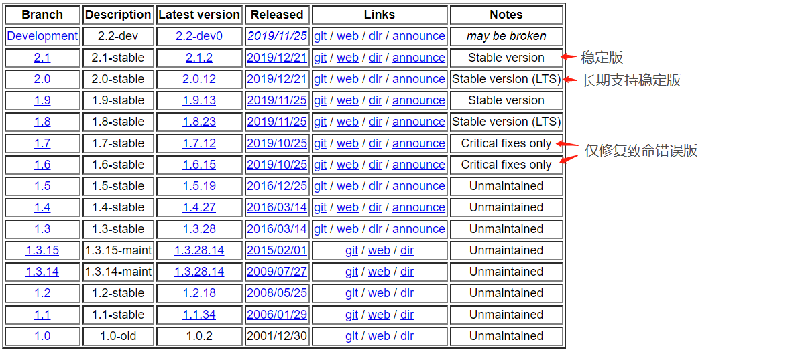
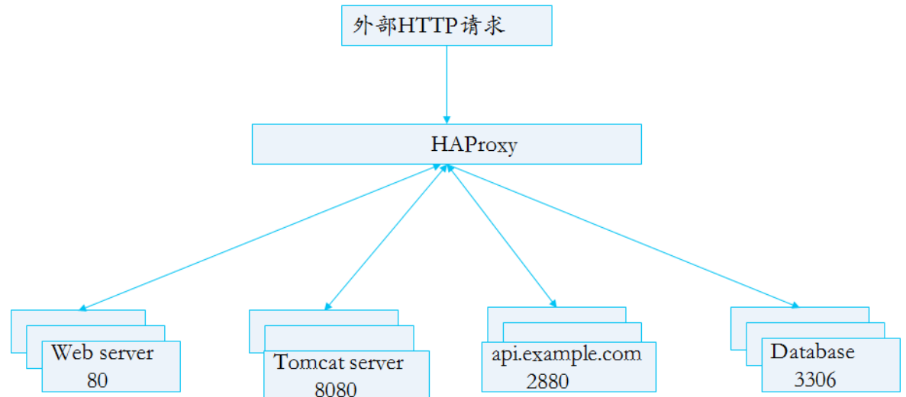
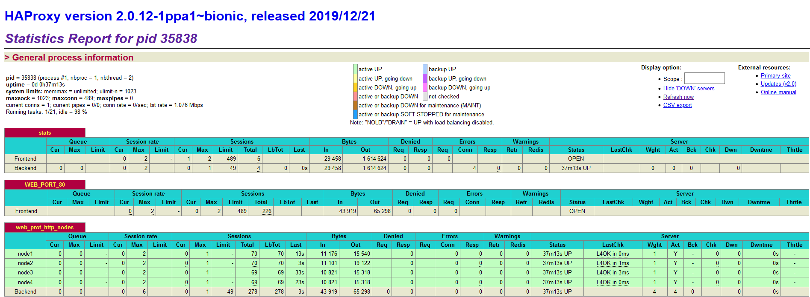

# 一.HAProxy 简介

## 1.1 简介

HAProxy 是一款免费的开源软件，它为 TCP 和基于 http 的应用程序提供了高可用性负
载均衡器和代理服务器解决方案，这些应用程序可以将请求分散到多个服务器上。它是用
C 语言写的，以速度快、效率高而著称(在处理器和内存使用方面)。HAProxy 被 GoDaddy、
GitHub、Bitbucket、Stack Overflow、Reddit、Speedtest.net、Tumblr、Twitter
和 Tuenti 等多家知名网站使用，并被用于亚马逊 AWS 的 OpsWorks 产品中。 -- wiki

HAProxy 是一个免费、非常快速和可靠的解决方案。其提供高可用性，负载均衡，和基于
TCP 与 http 的应用程序的代理能。它特别适合高流量的网站并且目前已经使用在很多的
访问最多的网站上。经过多年的发展，它已经成为事实上的标准的开源负载均衡器，目前
会与大多数主流 Linux 发行版一起发布，并且通常默认部署在云平台上。 -- haproxy.org

HAProxy 是由德国人`Willy Tarreau`[^1]在 2000 年使用 C 语言开发的，他是 Linux
内核的核心贡献者，现在仍然维护着这个项目。

另外，在 2013 年，公司`HAProxy Technologies, LLC`成立，除了致力于开源社区的贡献外，
该公司提供一个商业版的 HAProxy，HAProxy 企业版。该公司提供技术支持和提供扩展 HAProxy
功能的附加模块。

## 1.2 企业版和社区版

[社区版官网](http://www.haproxy.org/)
[社区版源码](https://github.com/haproxy)

[企业版官网](https://www.haproxy.com)

社区版和企业版功能对比

| Features/功能                                                                   | HAProxy Community | HAProxy Enterprise |
| :------------------------------------------------------------------------------ | :---------------- | :----------------- |
| Advanced HTTP/TCP Load Balancing and Persistence:高级 HTTP/TCP 负载均衡和持久性 | 支持              | 支持               |
| Advanced Health Checks:高级健康检查                                             | 支持              | 支持               |
| Application Acceleration:应用程序加速                                           | 支持              | 支持               |
| Advanced Security:高级安装特性                                                  | 支持              | 支持               |
| Advanced Administration:高级管理功能                                            | 支持              | 支持               |
| Backported Features From HAProxy Dev Branch:来自开发分支的新功能                | NO                | 支持               |
| 24x7 Support:7\*24 小时的支持                                                   | NO                | 支持               |
| Real Time Dashboard:实时的管理界面                                              | NO                | 支持               |
| VRRP and Route Health Injection HA Tools:VRRP 等工具                            | NO                | 支持               |
| ACL, Map, and TLS Ticket Key Synchronization:ACL,映射和 TLS 票证秘钥同步        | NO                | 支持               |
| Advanced Application-based DDoS and Bot Protection:基于应用的 DDos 和 Bot 保护  | NO                | 支持               |
| Bot Detection:Bot 机器人探测                                                    | NO                | 支持               |
| Web Application Firewall:应用程序防火墙                                         | NO                | 支持               |
| HTTP Protocol Validation:HTTP 协议验证                                          | NO                | 支持               |
| Realtime Cluster-Wide Tracking:实时集群追踪功能                                 | NO                | 支持               |

## 1.3 HAProxy 功能

HAProxy 功能特性如下
: 针对 TCP 和 HTTP 的反向代理和负载均衡功能
: URL 重写
: Gzip 压缩功能
: 代理协议支持
: 健康性检查
: 支持 HTTP/2 协议
: 多线程(单进程)
: 热加载配置(数千个并发的情况下，不丢失连接)
: 支持 gRPC 协议(google Remote Procedure Call)
: Lua 语言和 SPOE 支持
: 可以针对 HTTP 请求添加 cookie，进行路由后端服务器
: 可平衡负载至后端服务器，并支持持久连接
: 支持所有主服务器故障切换至备用服务器
: 支持专用端口实现监控服务
: 支持不影响现有连接情况下停止接受新连接请求
: 可以在双向添加，修改或删除 HTTP 报文首部
: 响应报文压缩
: 支持基于 pattern 实现连接请求的访问控制
: 通过特定的 URI 为授权用户提供详细的状态信息

目前不具备的功能
: 正向代理--squid，nginx
: 缓存代理--varnish
: web 服务--nginx、tengine、apache、php、tomcat
: UDP--目前不支持 UDP 协议，2.1 版本会支持 UDP 协议代理
: 单机性能--LVS

## 1.4 官方维护的版本说明

HAProxy 官方一般支持两个活动的稳定版本，两个长期支持的稳定版本。另外，还会
为比较旧的两个版本修复一些比较严重的错误。下图为官网目前维护的版本的截图：



HAProxy 的大致工作架构


# 二.HAProxy 安装及基础配置

## 2.1 Ubuntu 安装 HAProxy

### 2.1.1 apt 安装

```bash
# 查看目前源中有哪些版本可选，可以看到都是旧版
root@ubuntu-suosuoli-node1:~# apt-cache madison haproxy
   haproxy | 1.8.8-1ubuntu0.9 | http://mirrors.aliyun.com/ubuntu bionic-security/main amd64 Packages
   haproxy | 1.8.8-1ubuntu0.9 | http://mirrors.aliyun.com/ubuntu bionic-updates/main amd64 Packages
   haproxy | 1.8.8-1ubuntu0.9 | https://mirrors.tuna.tsinghua.edu.cn/ubuntu bionic-updates/main amd64 Packages
   haproxy | 1.8.8-1ubuntu0.9 | https://mirrors.tuna.tsinghua.edu.cn/ubuntu bionic-security/main amd64 Packages
   haproxy |    1.8.8-1 | http://mirrors.aliyun.com/ubuntu bionic/main amd64 Packages
   haproxy |    1.8.8-1 | https://mirrors.tuna.tsinghua.edu.cn/ubuntu bionic/main amd64 Packages
   haproxy |    1.8.8-1 | http://mirrors.aliyun.com/ubuntu bionic/main Sources
   haproxy | 1.8.8-1ubuntu0.9 | http://mirrors.aliyun.com/ubuntu bionic-security/main Sources
   haproxy | 1.8.8-1ubuntu0.9 | http://mirrors.aliyun.com/ubuntu bionic-updates/main Sources1

# 安装必要的依赖
root@ubuntu-suosuoli-node1:~# apt-get install software-properties-common

# 安装HAProxy2.0版，增加有HAProxy 2.0的安装源
root@ubuntu-suosuoli-node1:~# add-apt-repository ppa:vbernat/haproxy-2.0

# 再次查看具有的HAProxy版本信息
root@ubuntu-suosuoli-node1:~# apt-cache madison haproxy
   haproxy | 2.0.12-1ppa1~bionic | http://ppa.launchpad.net/vbernat/haproxy-2.0/ubuntu bionic/main amd64 Packages
......

# 安装
root@ubuntu-suosuoli-node1:~# apt install haproxy=2.0.12-1ppa1~bionic

# 查看版本验证安装情况
root@ubuntu-suosuoli-node1:~# haproxy -v
HA-Proxy version 2.0.12-1ppa1~bionic 2019/12/21 - https://haproxy.org/
```

### 2.2.2 编译安装

```bash
# Ubuntu1804上无lua，所以需要编译安装，HAProxy需要lua5.3版本以上
root@ubuntu-suosuoli-node1:~# apt-cache madison lua
root@ubuntu-suosuoli-node1:~#

root@ubuntu-suosuoli-node1:~# tar -xf /data/lua-5.3.5.tar.gz  -C /usr/local/src/
root@ubuntu-suosuoli-node1:~# cd /usr/local/src/lua-5.3.5
root@ubuntu-suosuoli-node1:/usr/local/src/lua-5.3.5#pwd
/usr/local/src/lua-5.3.5
# 第一次编译出错
root@ubuntu-suosuoli-node1:/usr/local/src/lua-5.3.5# make linux test
gcc -std=gnu99 -O2 -Wall -Wextra -DLUA_COMPAT_5_2 -DLUA_USE_LINUX    -c -o lua.o lua.c
lua.c:82:10: fatal error: readline/readline.h: No such file or directory
 #include <readline/readline.h>
          ^~~~~~~~~~~~~~~~~~~~~
compilation terminated.

# 安装依赖
root@ubuntu-suosuoli-node1:/usr/local/src/lua-5.3.5# sudo apt-get install libreadline-dev

# 再次编译，成功
root@ubuntu-suosuoli-node1:/usr/local/src/lua-5.3.5# make linux
cd src && make linux
make[1]: Entering directory '/usr/local/src/lua-5.3.5/src'
make all SYSCFLAGS="-DLUA_USE_LINUX" SYSLIBS="-Wl,-E -ldl -lreadline"
make[2]: Entering directory '/usr/local/src/lua-5.3.5/src'
gcc -std=gnu99 -O2 -Wall -Wextra -DLUA_COMPAT_5_2 -DLUA_USE_LINUX    -c -o lua.o lua.c
gcc -std=gnu99 -o lua   lua.o liblua.a -lm -Wl,-E -ldl -lreadline
gcc -std=gnu99 -O2 -Wall -Wextra -DLUA_COMPAT_5_2 -DLUA_USE_LINUX    -c -o luac.o luac.c
gcc -std=gnu99 -o luac   luac.o liblua.a -lm -Wl,-E -ldl -lreadline
make[2]: Leaving directory '/usr/local/src/lua-5.3.5/src'
make[1]: Leaving directory '/usr/local/src/lua-5.3.5/src'
src/lua -v
Lua 5.3.5  Copyright (C) 1994-2018 Lua.org, PUC-Rio

# 查看版本
root@ubuntu-suosuoli-node1:/usr/local/src/lua-5.3.5# ./src/lua -v
Lua 5.3.5  Copyright (C) 1994-2018 Lua.org, PUC-Rio


# 准备HAProxy源码
root@ubuntu-suosuoli-node1:~# tar -xvf /data/haproxy-2.0.12.tar.gz -C /usr/local/src/
root@ubuntu-suosuoli-node1:~# cd /usr/local/src/haproxy-2.0.12/
root@ubuntu-suosuoli-node1:/usr/local/src/haproxy-2.0.12# pwd
/usr/local/src/haproxy-2.0.12

# 第一次编译HAProxy，出错
root@ubuntu-suosuoli-node1:/usr/local/src/haproxy-2.0.12# make ARCH=x86_64 TARGET=generic USE_LUA=1 LUA_INC=/usr/local/src/lua-5.3.5/src LUA_LIB=/usr/local/lua-5.3.5/src USE_PCRE=1 USE_OPENSSL=1 USE_ZLIB=1 USE_SYSTEMD=1  USE_CPU_AFFINITY=1 LUA_LIB_NAME=lua5.3.5
  CC      src/ev_poll.o
  CC      src/ssl_sock.o
  CC      src/hlua.o
  CC      src/hlua_fcn.o
  CC      src/proto_http.o
  CC      src/cfgparse-listen.o
  CC      src/proto_htx.o
  CC      src/stream.o
  CC      src/mux_h2.o
  CC      src/stats.o
  CC      src/flt_spoe.o
  CC      src/server.o
  CC      src/checks.o
  CC      src/haproxy.o
src/haproxy.c:72:10: fatal error: systemd/sd-daemon.h: No such file or directory
 #include <systemd/sd-daemon.h>
          ^~~~~~~~~~~~~~~~~~~~~
compilation terminated.

# 安装依赖
root@ubuntu-suosuoli-node1:/usr/local/src/haproxy-2.0.12# apt-get install libsystemd-dev

# 再次编译，出错
root@ubuntu-suosuoli-node1:/usr/local/src/haproxy-2.0.12# make ARCH=x86_64 TARGET=linux-glibc USE_LUA=1 LUA_INC=/usr/local/src/lua-5.3.5/src LUA_LIB=/usr/local/lua-5.3.5/src USE_PCRE=1 USE_OPENSSL=1 USE_ZLIB=1 USE_SYSTEMD=1  USE_CPU_AFFINITY=1
Makefile:532: *** unable to automatically detect the Lua library name, you can enforce its name with LUA_LIB_NAME=<name> (where <name> can be lua5.3, lua53, lua, ...).  Stop.

# 指明lua库名称，再次编译，失败
root@ubuntu-suosuoli-node1:/usr/local/src/haproxy-2.0.12# make ARCH=x86_64 TARGET=linux-glibc USE_LUA=1 LUA_INC=/usr/local/src/lua-5.3.5/src LUA_LIB=/usr/local/lua-5.3.5/src USE_PCRE=1 USE_OPENSSL=1 USE_ZLIB=1 USE_SYSTEMD=1  USE_CPU_AFFINITY=1 LUA_LIB_NAME=lua5.3
  CC      src/version.o
  LD      haproxy
/usr/bin/ld: cannot find -llua5.3
collect2: error: ld returned 1 exit status
Makefile:825: recipe for target 'haproxy' failed
make: *** [haproxy] Error 1
......
略略略略略略略略路嗯嗯撸恶露额略略
```

## 2.2 Centos 安装 HAProxy

### 2.2.1 YUM 包管理器安装 HAProxy

默认的 base 仓库中包含 haproxy 的安装包文件，但是版本比较旧，是 1.5.18
的版本`haproxy-1.5.18-9.el7.x86_64.rpm`，距离当前版本已经有较长时间没有
更新，由于版本比较旧所以有很多功能不支持，如果对功能和性能没有要求可以使
用此版本，否则推荐使用新版本。

```bash
# yum install haproxy -y

#验证haproxy版本
# haproxy -v
HA-Proxy version 1.5.18 2016/05/10
Copyright 2000-2016 Willy Tarreau <willy@haproxy.org>
```

### 2.2.2 第三方的 rpm 包安装

[HAProxy 的 RPM 包下载](https://pkgs.org/download/haproxy)
[包含解决 HAProxy 依赖的 yum 源配置文件](https://centos.pkgs.org/7/cheese-x86_64/cheese-release-7-1.noarch.rpm.html)

```bash
# 下载包含依赖包的yum源
[root@node2 yum.repos.d]# wget http://www.nosuchhost.net/~cheese/fedora/packages/epel-7/x86_64//cheese-release-7-1.noarch.rpm
warning: cheese-release-7-1.noarch.rpm: Header V4 RSA/SHA1 Signature, key ID 3c3ebe43: NOKEY
Preparing...                          ################################# [100%]
Updating / installing...
   1:cheese-release-7-1               ################################# [100%]
[root@node2 yum.repos.d]# ll
total 24
-rw-r--r--  1 root root 6104 Oct  9  2014 cheese-release-7-1.noarch.rpm
-rw-r--r--  1 root root  636 Jul  8  2014 cheese.repo
......
[root@node1 yum.repos.d]# yum repolist

# 下载HAProxy的RPM包
[root@node2 data]# wget http://www.nosuchhost.net/~cheese/fedora/packages/epel-7/x86_64//haproxy-1.8.14-1.el7.x86_64.rpm

[root@node2 data]# yum install haproxy-1.8.14-1.el7.x86_64.rpm

# 查看版本
[root@node2 data]# haproxy -v
HA-Proxy version 1.8.14-52e4d43 2018/09/20
Copyright 2000-2018 Willy Tarreau <willy@haproxy.org>
```

### 2.2.3 编译安装 HAProxy

HAProxy 支持基于 lua 实现功能扩展，lua 是一种小巧的脚本语言，于 1993
年由巴西里约热内卢天主教大学(Pontifical Catholic University of Rio de Janeiro)
里的一个研究小组开发，其设计目的是为了嵌入应用程序中，从而为应用程序提供灵活的
扩展和定制功能。lua 具有以下特点：

```bash
Lua 应用场景
游戏开发
独立应用脚本
Web 应用脚本
扩展和数据库插件，如 MySQL Proxy
安全系统，如入侵检测系统
```

由于 centos 自带的 lua 版本比较低并不符合 HAProxy 要求的 lua 最低版
本(5.3)的要求，因此需要编译安装较新版本 lua 环境，然后才能编译安装 HAProxy。

[HAProxy-2.0.12 下载链接](http://www.haproxy.org/download/2.0/src/haproxy-2.0.12.tar.gz)

[lua-5.3.5 下载链接](https://www.lua.org/ftp/lua-5.3.5.tar.gz)

编译安装过程：

```bash
# 为了编译lua5.3.5安装依赖
[root@node2 ~]# yum install libtermcap-devel ncurses-devel libevent-devel readline-devel

# 准备lua源码
[root@node2 ~]# tar -xvf /data/lua-5.3.5.tar.gz -C /usr/local/src/

# 编译
[root@node2 ~]# cd /usr/local/src/lua-5.3.5
[root@node2 lua-5.3.5]# make linux

[root@node2 lua-5.3.5]# ./src/lua -v
Lua 5.3.5  Copyright (C) 1994-2018 Lua.org, PUC-Rio


# 为了编译HAProxy，安装依赖
[root@node2 ~]# yum install gcc gcc-c++ glibc glibc-devel pcre pcre-devel openssl  openssl-develsystemd-devel net-tools vim iotop bc  zip unzip zlib-devel lrzsz tree screen lsof -y

# 准备HAProxy源码
[root@node2 data]# wget http://www.haproxy.org/download/2.0/src/haproxy-2.0.12.tar.gz
[root@node2 data]# tar -xvf haproxy-2.0.12.tar.gz -C /usr/local/src/
[root@node2 ~]# cd /usr/local/src/haproxy-2.0.12

# 编译
[root@node2 haproxy-2.0.12]# make  ARCH=x86_64 TARGET=linux-glibc  USE_PCRE=1 USE_OPENSSL=1 USE_ZLIB=1   USE_SYSTEMD=1  USE_CPU_AFFINITY=1 LUA_INC=/usr/local/src/lua-5.3.5/src/ LUA_LIB=/usr/local/src/lua-5.3.5/src/ PREFIX=/usr/local/haproxy

# 查看版本
[root@node2 /]# ./usr/local/haproxy/sbin/haproxy -v
HA-Proxy version 2.0.12 2019/12/21 - https://haproxy.org/
```

准备 HAProxy 启动脚本，可以参考包管理器安装的启动脚本

```bash
[root@node2 ~]# cat /usr/lib/systemd/system/haproxy.service
[Unit]
Description=HAProxy Load Balancer
After=network.target

[Service]
Environment="CONFIG=/etc/haproxy/haproxy.cfg" "PIDFILE=/run/haproxy.pid"
ExecStartPre=/usr/sbin/haproxy -f $CONFIG -c -q
ExecStart=/usr/sbin/haproxy -Ws -f $CONFIG -p $PIDFILE
ExecReload=/usr/sbin/haproxy -f $CONFIG -c -q
ExecReload=/bin/kill -USR2 $MAINPID
KillMode=mixed
Type=notify

[Install]
WantedBy=multi-user.target
```

HAProxy 配置文件

```bash
[root@node2 ~]# cat /etc/haproxy/haproxy.cfg
#---------------------------------------------------------------------
# Example configuration for a possible web application.  See the
# full configuration options online.
#
#   https://www.haproxy.org/download/1.8/doc/configuration.txt
#
#---------------------------------------------------------------------

#---------------------------------------------------------------------
# Global settings
#---------------------------------------------------------------------
global
    # to have these messages end up in /var/log/haproxy.log you will
    # need to:
    #
    # 1) configure syslog to accept network log events.  This is done
    #    by adding the '-r' option to the SYSLOGD_OPTIONS in
    #    /etc/sysconfig/syslog
    #
    # 2) configure local2 events to go to the /var/log/haproxy.log
    #   file. A line like the following can be added to
    #   /etc/sysconfig/syslog
    #
    #    local2.*                       /var/log/haproxy.log
    #
    log         127.0.0.1 local2

    chroot      /var/lib/haproxy
    pidfile     /var/run/haproxy.pid
    maxconn     4000
    user        haproxy
    group       haproxy
    daemon

    # turn on stats unix socket
    stats socket /var/lib/haproxy/stats

    # utilize system-wide crypto-policies
    ssl-default-bind-ciphers PROFILE=SYSTEM
    ssl-default-server-ciphers PROFILE=SYSTEM

#---------------------------------------------------------------------
# common defaults that all the 'listen' and 'backend' sections will
# use if not designated in their block
#---------------------------------------------------------------------
defaults
    mode                    http
    log                     global
    option                  httplog
    option                  dontlognull
    option http-server-close
    option forwardfor       except 127.0.0.0/8
    option                  redispatch
    retries                 3
    timeout http-request    10s
    timeout queue           1m
    timeout connect         10s
    timeout client          1m
    timeout server          1m
    timeout http-keep-alive 10s
    timeout check           10s
    maxconn                 3000

#---------------------------------------------------------------------
# main frontend which proxys to the backends
#---------------------------------------------------------------------
frontend main
    bind *:5000
    acl url_static       path_beg       -i /static /images /javascript /stylesheets
    acl url_static       path_end       -i .jpg .gif .png .css .js

    use_backend static          if url_static
    default_backend             app

#---------------------------------------------------------------------
# static backend for serving up images, stylesheets and such
#---------------------------------------------------------------------
backend static
    balance     roundrobin
    server      static 127.0.0.1:4331 check

#---------------------------------------------------------------------
# round robin balancing between the various backends
#---------------------------------------------------------------------
backend app
    balance     roundrobin
    server  app1 127.0.0.1:5001 check
    server  app2 127.0.0.1:5002 check
    server  app3 127.0.0.1:5003 check
    server  app4 127.0.0.1:5004 check
```

haproxy.cfg 文件中定义了 chroot、pidfile、user、group 等参数，如果系统没有相应
的资源会导致 haproxy 无法启动，具体参考日志文件/var/log/messages

启动 HAProxy

```bash
root@ubuntu-suosuoli-node1:~# systemctl start haproxy
root@ubuntu-suosuoli-node1:~# systemctl status haproxy
● haproxy.service - HAProxy Load Balancer
   Loaded: loaded (/lib/systemd/system/haproxy.service; enabled; vendor preset: enabled)
   Active: active (running) since Sat 2020-01-11 15:26:14 CST; 3h 25min ago
     Docs: man:haproxy(1)
           file:/usr/share/doc/haproxy/configuration.txt.gz
 Main PID: 34585 (haproxy)
    Tasks: 3 (limit: 2290)
   CGroup: /system.slice/haproxy.service
           ├─34585 /usr/sbin/haproxy -Ws -f /etc/haproxy/haproxy.cfg -p /run/haproxy.pid -S /run/haproxy-master.sock
           └─34586 /usr/sbin/haproxy -Ws -f /etc/haproxy/haproxy.cfg -p /run/haproxy.pid -S /run/haproxy-master.sock

Jan 11 15:26:14 ubuntu-suosuoli-node1 systemd[1]: Starting HAProxy Load Balancer...
Jan 11 15:26:14 ubuntu-suosuoli-node1 haproxy[34585]: [NOTICE] 010/152614 (34585) : New worker #1 (34586) forked
Jan 11 15:26:14 ubuntu-suosuoli-node1 systemd[1]: Started HAProxy Load Balancer.
root@ubuntu-suosuoli-node1:~# systemctl enable haproxy
Synchronizing state of haproxy.service with SysV service script with /lib/systemd/systemd-sysv-install.
Executing: /lib/systemd/systemd-sysv-install enable haproxy
```

## 2.3 HAProxy 基础配置

HAProxy 的配置文件位于`/etc/haproxy/haproxy.cfg`，配置文件以一个关键字开头，
后面可选的跟以空格隔开的参数，可以一个或多个。配置示例：

```bash
frontend  WEB_PORT_80
    bind 192.168.7.248:80
    mode http
    use_backend  web_prot_http_nodes # 调用后端服务器

backend web_prot_http_nodes  # 在此定义后端服务器配置
    mode  http
    option forwardfor
    server 192.168.7.101 192.168.7.101:8080   check inter 3000 fall 3 rise 5
    server 192.168.7.102 192.168.7.102:8080   check inter 3000 fall 3 rise 5
```

HAProxy 最终的工作行为受三个因素影响：

1. 启动 HAProxy 时在命令行指定的参数，该参数优先级最高

   ```bash
   root@ubuntu-suosuoli-node1:~# ps aux | grep haproxy
   root      34585  0.0  0.4  58340  8712 ?        Ss   15:26   0:00 /usr/sbin/haproxy -Ws -f /etc/haproxy/haproxy.cfg -p /run/haproxy.pid -S /run/haproxy-master.sock
   haproxy   34586  0.0  0.1 132072  3384 ?        Sl   15:26   0:00 /usr/sbin/haproxy -Ws -f /etc/haproxy/haproxy.cfg -p /run/haproxy.pid -S /run/haproxy-master.sock
   ```

2. 配置文件中的"global"配置块，该配置块指定进程级的参数，也可以看做全局参数。
3. proxies 配置区，该配置区可以使用"defaults","listen","frontend"和"backend"等形式(关键字)。

### 2.3.1 配置示例

```bash
global
        log /dev/log    local0
        log /dev/log    local1 notice
        chroot /var/lib/haproxy
        stats socket /run/haproxy/admin.sock mode 660 level admin expose-fd listeners
        stats timeout 30s
        user haproxy
        group haproxy
        daemon

        # Default SSL material locations
        ca-base /etc/ssl/certs
        crt-base /etc/ssl/private

        # See: https://ssl-config.mozilla.org/#server=haproxy&server-version=2.0.3&config=intermediate
        ssl-default-bind-ciphers ECDHE-ECDSA-AES128-GCM-SHA256:ECDHE-RSA-AES128-GCM-SHA256:ECDHE-ECDSA-AES256-GCM-SHA384:ECDHE-RSA-AES256-GCM-SHA384:ECDHE-ECDSA-CHACHA20-POLY1305:ECDHE-RSA-CHACHA20-POLY1305:DHE-RSA-AES128-GCM-SHA256:DHE
-RSA-AES256-GCM-SHA384
        ssl-default-bind-ciphersuites TLS_AES_128_GCM_SHA256:TLS_AES_256_GCM_SHA384:TLS_CHACHA20_POLY1305_SHA256
        ssl-default-bind-options no-sslv3 no-tlsv10 no-tlsv11 no-tls-tickets

defaults
        log     global
        mode    http
        option  httplog
        option  dontlognull
        option  http-keep-alive
        timeout connect 300000ms
        timeout client  300000ms
        timeout server  300000ms
        errorfile 400 /etc/haproxy/errors/400.http
        errorfile 403 /etc/haproxy/errors/403.http
        errorfile 408 /etc/haproxy/errors/408.http
        errorfile 500 /etc/haproxy/errors/500.http
        errorfile 502 /etc/haproxy/errors/502.http
        errorfile 503 /etc/haproxy/errors/503.http
        errorfile 504 /etc/haproxy/errors/504.http


listen stats
        mode http
        bind 172.20.2.189:9999
        stats enable
        log global
        stats uri    /haproxy_status
        stats auth   haadmin:stevenux

frontend  WEB_PORT_80
    bind 172.20.2.189:8080
    mode http
    use_backend  web_prot_http_nodes
backend web_prot_http_nodes
    mode   http
    option forwardfor
    server node1 172.20.2.37:80 check inter 3000 fall 3 rise 5
    server node2 172.20.2.43:80 check inter 3000 fall 3 rise 5
    server node3 172.20.2.44:80 check inter 3000 fall 3 rise 5
    server node4 172.20.2.45:80 check inter 3000 fall 3 rise 5
```

上面的配置会将 http 请求以轮询的方式代理到后端四台服务器，示例

```bash
root@ubuntu-suosuoli-node1:~# while : ; do curl http://172.20.2.189:8080/ ; sleep 1 ; done
node2 172.20.2.43
node3 172.20.2.44
node4 172.20.2.45
node1 172.20.2.37
node2 172.20.2.43
node3 172.20.2.44
node4 172.20.2.45
node1 172.20.2.37
^C
```

访问`http://172.20.2.189:9999/haproxy_status`查看各个服务器状态


### 2.3.2 基础配置详解

`global`全局配置段

```bash
进程及安全配置相关的参数
性能调整相关参数
Debug参数
```

`proxies`代理配置块

```bash
defaults [<name>] # 默认配置项，针对以下的frontend、backend和lsiten生效，可以多个name也可以没有name
frontend <name>   # 前端servername，类似于Nginx的一个虚拟主机 server。
backend  <name>   # 后端服务器组，等于nginx的upstream
listen   <name>   # 将frontend和backend合并在一起配置
```

#### 2.3.2.1 global 配置参数

[global 全局配置官方文档](https://cbonte.github.io/haproxy-dconv/2.0/intro.html)

global 全局配置参数主要有以下：

```bash
chroot #  锁定运行目录
deamon #  以守护进程运行
# stats socket /var/lib/haproxy/haproxy.sock mode 600 level admin # 定义socket文件
user, group, uid, gid  # 运行haproxy的用户身份
nbproc        # 开启的haproxy进程数，应该与CPU保持一致
nbthread      # 指定每个haproxy进程开启的线程数，每个进程只有一个线程
cpu-map 1 0   # 绑定haproxy 进程至指定CPU，该配置表示将进程1与CPU0绑定
maxconn       # 每个haproxy进程的最大并发连接数
maxsslconn    # 每个haproxy进程ssl最大连接数,用于haproxy配置了证书的场景下
maxconnrate   # 每个进程每秒创建的最大连接数量
spread-checks # 后端server状态check随机提前或延迟百分比时间，建议2-5(20%-50%)之间
pidfile       # 指定pid文件路径
log 127.0.0.1  local3 info # 定义全局的syslog服务器；最多可以定义两个
```

#### 2.3.2.2 Proxies 配置参数

[Proxies 配置文档](https://cbonte.github.io/haproxy-dconv/2.0/configuration.html#4)

Proxies 配置涉及四个关键字

| 关键字              | 说明                                                                                                                                                           |
| :------------------ | :------------------------------------------------------------------------------------------------------------------------------------------------------------- |
| defaults [\<name\>] | 默认配置项，针对定义在其后的 frontend、backend 和 lsiten 生效，可以多个 name 也可以没有 name。这些默认的参数会在遇到下一个"defaults"配置关键字时被该默认值重置 |
| frontend \<name\>   | 前端 servername，用于描述一个接受客户端请求的套接字集合，类似于 Nginx 的一个虚拟主机 server。                                                                  |
| backend \<name\>    | 该配置关键字用于描述 HAProxy 转发请求的一组后端服务器，相当于 nginx 的 upstream                                                                                |
| listen   \<name\>   | listen 关键字则是定义了一个完整的代理，该配置块包含了 frontend 和 backend。这种配置方式在只转发 TCP 流量时比较有用。                                           |

**注：name 字段只能使用"-" "\_" "." 和 ":"，并且严格区分大小写，例如：Web 和 web 是**
**完全不同的两组服务器。**

```bash
All proxy names must be formed from upper and lower case letters, digits,
'-' (dash), '_' (underscore) , '.' (dot) and ':' (colon). ACL names are
case-sensitive, which means that "www" and "WWW" are two different proxies.
```

##### 2.3.2.2.1 Proxies 配置-defaults

```bash
defaults name
  option redispatch      # 当server Id对应的服务器挂掉后，强制定向到其他健康的服务器，重新派发
  option abortonclose    # 当服务器负载很高的时候，自动结束掉当前队列处理比较久的链接，关闭
  option http-keep-alive # 开启与客户端的会话保持
  option  forwardfor     # 透传客户端真实IP至后端web服务器
  mode http              # 设置默认工作类型
  timeout http-keep-alive 120s # session 会话保持超时时间，范围内会转发到相同的后端服务器
  timeout connect 120s  # 客户端请求从haproxy到后端server的最长连接等待时间(TCP之前)
  timeout server  600s  # 客户端请求从haproxy到后端服务端的请求处理超时时长(TCP之后)
  timeout client  600s  # 设置haproxy与客户端的最长非活动时间
  timeout  check   5s   # 对后端服务器的默认检测超时时间
```

##### 2.3.2.2.2 Proxies 配置-frontend

```bash
frontend frontend_name
  mode mode_name
  bind <...> # 指定HAProxy的监听地址，可以是IPV4或IPV6，可以同时监听多个IP或端口，可同时用于listen字段中
  bind [<address>]:<port_range> [, ...] [param*]
  use_backend backend_name

listen http_proxy # 监听http的多个IP的多个端口和sock文件
    bind :80,:443,:8801-8810
    bind 10.0.0.1:10080,10.0.0.1:10443
    bind /var/run/ssl-frontend.sock user root mode 600 accept-proxy

listen http_https_proxy # https监听
    bind :80
    bind :443 ssl crt /etc/haproxy/site.pem

listen http_https_proxy_explicit # 监听ipv6、ipv4和unix sock文件，混合监听
    bind ipv6@:80
    bind ipv4@public_ssl:443 ssl crt /etc/haproxy/site.pem
    bind unix@ssl-frontend.sock user root mode 600 accept-proxy

listen external_bind_app1  # 监听file descriptor
    bind "fd@${FD_APP1}"

生产示例：
frontend  WEB_PORT
    bind :80,:8080
    bind 172.20.2.189:10080,:8801-8810,172.20.2.44:9001-9010
    mode  http/tcp      # 指定负载协议类型
    use_backend backend_name  # 调用的后端服务器组名称
```

##### 2.3.2.2.3 Proxies 配置-backend

backend 关键字用于定义一组后端服务器，backend 服务器将被 frontend 进行调用。

```bash
backend backend_name
  mode  http/tcp     #  指定负载协议类型
  option             #  配置选项
  balance <algorithm> [<arguments>] # 定义在后端服务器使用的调度算法
  server  server_name server:port check <...>      #  定义后端real server
```

**注意：option 后面加 httpchk，smtpchk,mysql-check,pgsql-check，ssl-hello-chk 方法**
**可用于实现更多应用层检测功能。**

```bash
check         # 对指定real server进行健康状态检查，默认不开启
  addr  IP    # 可指定的健康状态监测IP
  port  num   # 指定的健康状态监测端口
  inter num   # 健康状态检查间隔时间，默认2000 ms
  fall  num   # 后端服务器失效检查次数，默认为3
  rise  num   # 后端服务器从下线恢复检查次数，默认为2
weight        # 默认为1，最大值为256，0表示不参与负载均衡
backup        # 将后端服务器标记为备份状态
disabled      # 将后端服务器标记为不可用状态
redirect prefix  http://www.magedu.net/   # 将请求临时重定向至其它URL，只适用于http模式
maxconn <maxconn>                         # 当前后端server的最大并发连接数
backlog <backlog>                         # 当server的连接数达到上限后的后援队列长度
```

##### 2.3.2.2.4 frontend+backend 配置实例

```bash
frontend  WEB_PORT_80
    bind 192.168.7.248:80
    mode http
    use_backend  web_prot_http_nodes  # 调用backend

backend web_prot_http_nodes   # 此处定义backend
    mode  http
    option forwardfor
    server 172.20.2.44 172.20.2.44:8080   check inter 3000 fall 3 rise 5
    server 172.20.2.45 172.20.2.45:8080   check inter 3000 fall 3 rise 5
```

##### 2.3.2.2.5 Proxies 配置-listen 替代 frontend+backend

使用 listen 替换 frontend 和 backend 的配置方式

```bash
listen  WEB_PORT_80
    bind 172.20.2.189:80
    mode http
    option  forwardfor
    server web1   172.20.2.44:80   check inter 3000 fall 3 rise 5
    server web2   172.20.2.45:80   check inter 3000 fall 3 rise 5
```

## 脚注

[^1]: 关于 HAProxy 作者:http://1wt.eu/#wami
