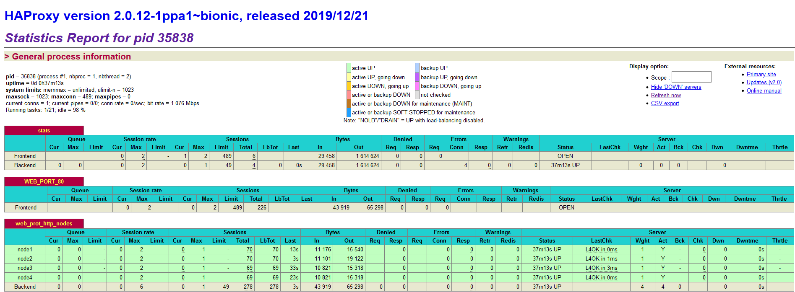
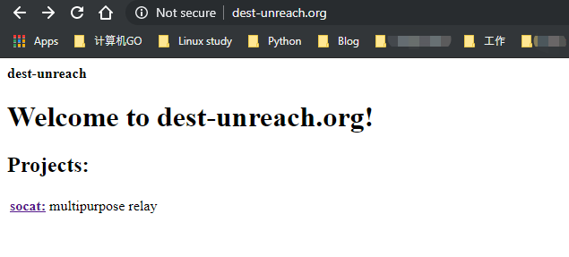
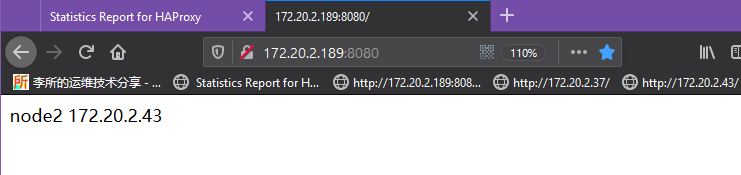
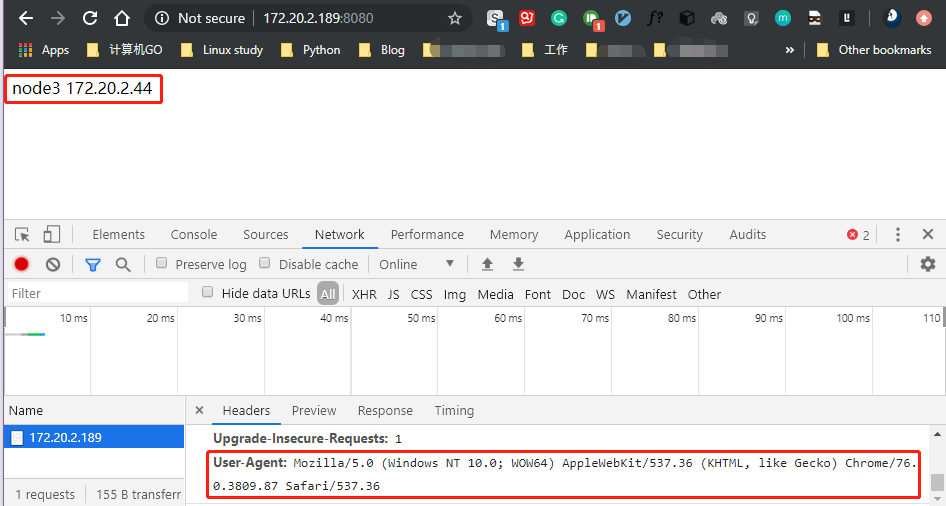
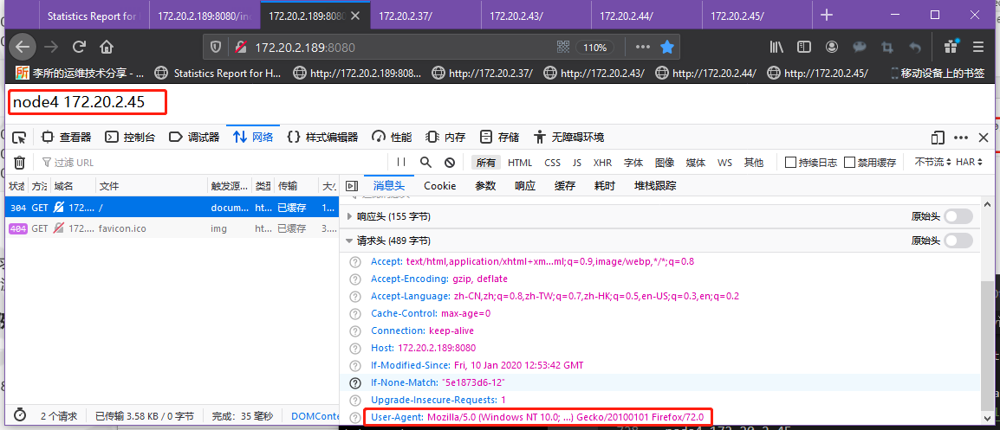

HAProxy 调度算法介绍

HAProxy 的调度算法比较多，在没有设置 mode 或者其它选项时，HAProxy 默认对
后端服务器使用 roundrobin 算法来分配请求处理。对后端服务器指明使用的算法
时使用`balance`关键字，该关键字可在`listen`和`backend`中出现。在 HAProxy
运行时支持动态调整后端服务器权重、并且考虑后端服务器负载等情况的算法，我们
称之为**动态算法**；相反，不能动态调整后端服务器权重也不考虑服务器负载的
算法叫**静态算法**。指定调度策略的典型配置如下：

```bash
backend srv_group1
    mode http
    log global
    # balance <algorithm> [<arguments>]
    balance static-rr
    server web1 ip:port weight 2 check inter 300000ms fall 2 rise 5
```

> [调度算法官方文档说明](https://cbonte.github.io/haproxy-dconv/2.0/configuration.html#4)

本文介绍 HAProxy 算法的同时，使用一台 HAProxy 服务器和四台后端服务器来验证各
调度算法的效果。另外，客户端使用`172.20.2.195 client-node1`，使用该客户端访
问 HAProxy 服务器(http://172.20.2.189:8080)来验证。

HAProxy 服务器
: 172.20.2.189 ubuntu-suosuoli-node1
: 系统:Ubuntu1804

四台后端服务器
: 172.20.2.37 node1
: 172.20.2.43 node2
: 172.20.2.44 node3
: 172.20.2.45 node4
: 系统都为 CentOS7.7

客户端
: 172.20.2.195 client-node1
: 系统为 CentOS7.7

**准备环境**

```bash
root@ubuntu-suosuoli-node1:~# vim /etc/ansible/ansible.cfg
......
[backend]
172.20.2.37
172.20.2.43
172.20.2.44
172.20.2.45
......
root@ubuntu-suosuoli-node1:~# ansible backend -m shell -a "nginx -t"
172.20.2.43 | SUCCESS | rc=0 >>
nginx: the configuration file /etc/nginx/nginx.conf syntax is ok
nginx: configuration file /etc/nginx/nginx.conf test is successful

172.20.2.45 | SUCCESS | rc=0 >>
nginx: the configuration file /etc/nginx/nginx.conf syntax is ok
nginx: configuration file /etc/nginx/nginx.conf test is successful

172.20.2.37 | SUCCESS | rc=0 >>
nginx: the configuration file /apps/nginx/conf/nginx.conf syntax is ok
nginx: configuration file /apps/nginx/conf/nginx.conf test is successful

172.20.2.44 | SUCCESS | rc=0 >>
nginx: the configuration file /etc/nginx/nginx.conf syntax is ok
nginx: configuration file /etc/nginx/nginx.conf test is successful

root@ubuntu-suosuoli-node1:~# ansible backend -m shell -a "nginx -s reload"
172.20.2.37 | SUCCESS | rc=0 >>


172.20.2.45 | SUCCESS | rc=0 >>


172.20.2.43 | SUCCESS | rc=0 >>


172.20.2.44 | SUCCESS | rc=0 >>

root@ubuntu-suosuoli-node1:~# ansible backend -a "hostname"
172.20.2.43 | SUCCESS | rc=0 >>
node2

172.20.2.44 | SUCCESS | rc=0 >>
node3

172.20.2.45 | SUCCESS | rc=0 >>
node4

172.20.2.37 | SUCCESS | rc=0 >>
node1
```

使用的核心配置

```bash
global
    log /dev/log    local0
    log /dev/log    local1 notice
    chroot /var/lib/haproxy
    nbproc 2
    cpu-map 1 0
    cpu-map 2 1
    stats socket /run/haproxy/admin.sock2 mode 660 level admin expose-fd listeners
    #stats socket /run/haproxy/admin.sock1 mode 660 level admin expose-fd listeners process 1
    #stats socket /run/haproxy/admin.sock2 mode 660 level admin expose-fd listeners process 2
    stats timeout 30s
    user haproxy
    group haproxy
    daemon

    # Default SSL material locations
    ca-base /etc/ssl/certs
    crt-base /etc/ssl/private

    # See: https://ssl-config.mozilla.org/#server=haproxy&server-version=2.0.3&config=intermediate
    ssl-default-bind-ciphers ECDHE-ECDSA-AES128-GCM-SHA256:ECDHE-RSA-AES128-GCM-SHA256:ECDHE-ECDSA-AES256-GCM-SHA384:ECDHE-RSA-AES256-GCM-SHA384:ECDHE-ECDSA-CHACHA20-POLY1305:ECDHE-RSA-CHACHA20-POLY1305:DHE-RSA-AES128-GCM-SHA256:DHE-RSA-AES256-GCM-SHA384
    ssl-default-bind-ciphersuites TLS_AES_128_GCM_SHA256:TLS_AES_256_GCM_SHA384:TLS_CHACHA20_POLY1305_SHA256
    ssl-default-bind-options no-sslv3 no-tlsv10 no-tlsv11 no-tls-tickets

defaults
    log     global
    mode    http
    option  httplog
    option  dontlognull
    option  http-keep-alive
    timeout connect 300000ms
    timeout client  300000ms
    timeout server  300000ms
    errorfile 400 /etc/haproxy/errors/400.http
    errorfile 403 /etc/haproxy/errors/403.http
    errorfile 408 /etc/haproxy/errors/408.http
    errorfile 500 /etc/haproxy/errors/500.http
    errorfile 502 /etc/haproxy/errors/502.http
    errorfile 503 /etc/haproxy/errors/503.http
    errorfile 504 /etc/haproxy/errors/504.http

listen stats
    mode http
    bind 172.20.2.189:9999
    stats enable
    log global
    stats uri    /haproxy_status
    stats auth   haadmin:stevenux

frontend  WEB_PORT_8080
    bind 172.20.2.189:8080
    mode http
    use_backend  web_prot_http_nodes

backend web_prot_http_nodes
    mode   http
    # balance roundrobin 默认使用该调度策略
    option forwardfor
    server node1 172.20.2.37:80 weight 1 check inter 3000 fall 3 rise 5
    server node2 172.20.2.43:80 weight 1 check inter 3000 fall 3 rise 5
    server node3 172.20.2.44:80 weight 1 check inter 3000 fall 3 rise 5
    server node4 172.20.2.45:80 weight 1 check inter 3000 fall 3 rise 5
```

访问 WEB 管理界面`http://172.20.2.189:9999/haproxy_status`


# 一.静态调度算法

静态算法：按照事先定义好的规则轮询公平调度，不关心后端服务器的当前负载、链接数
和相应速度等，且无法实时修改权重，只能靠重启 HAProxy 生效。

HAProxy 运行时，要动态修改服务器权重，需要安装额外的工具`socat`。Socat 是 Linux
下的命令行工具，全名叫 `Socket CAT`，Socat 的主要工作原理是建立一个双向的通道，
并在这个通道传输比特流。其支持众多协议和链接方式。如 IP、TCP、UDP、IPv6、Socket
文件等。由于其功能强大，可以有多种用途，由于其可以转发 TCP 流，甚至有人将它配置为
防火墙。

```bash
# Centos安装
yum install socat -y

# 此处使用Ubuntu1804
root@ubuntu-suosuoli-node1:~# apt-cache madison socat
     socat | 1.7.3.2-2ubuntu2 | http://mirrors.aliyun.com/ubuntu bionic/main amd64 Packages
     socat | 1.7.3.2-2ubuntu2 | https://mirrors.tuna.tsinghua.edu.cn/ubuntu bionic/main amd64 Packages
     socat | 1.7.3.2-2ubuntu2 | http://mirrors.aliyun.com/ubuntu bionic/main Sources
root@ubuntu-suosuoli-node1:~# apt install socat
root@ubuntu-suosuoli-node1:~# socat -V
socat by Gerhard Rieger and contributors - see www.dest-unreach.org  # 这是它官网，作者应该是个极简主义者
socat version 1.7.3.2 on Apr  4 2018 10:06:49
......

# 获取后端服务器node3的权重可以这样做
root@ubuntu-suosuoli-node1:~# find / -name admin.sock
/run/haproxy/admin.sock
root@ubuntu-suosuoli-node1:~# echo "get weight web_prot_http_nodes/node3" | socat stdio /run/haproxy/admin.sock
3 (initial 3)

# 设置没某个后端服务器的权重可以这样，但是我用的是static-rr算法，不可以动态调整权重。只接受0或者1
# 0就表示不参与请求处理，1表示参与
root@ubuntu-suosuoli-node1:~# echo "set weight web_prot_http_nodes/node3 6" | socat stdio /run/haproxy/admin.sock
Backend is using a static LB algorithm and only accepts weights '0%' and '100%'.
```

BTW:[socat 官网](www.dest-unreach.org)


## 1.1 static-rr

`static roundrobin`:静态轮询调度策略，使用基于权重的轮询调度策略。权重
在配置文件中指定后不可动态更改和后端服务器慢启动，此调度策略对后端服务
器最大数量没有限制。

```bash
listen stats
        mode http
        bind 172.20.2.189:9999
        stats enable
        log global
        stats uri    /haproxy_status
        stats auth   haadmin:stevenux

frontend  WEB_PORT_80
    bind 172.20.2.189:8080
    mode http
    use_backend  web_prot_http_nodes

backend web_prot_http_nodes
    mode   http
    balance static-rr
    option forwardfor
    server node1 172.20.2.37:80 weight 1 check inter 3000 fall 3 rise 5
    server node2 172.20.2.43:80 weight 2 check inter 3000 fall 3 rise 5
    server node3 172.20.2.44:80 weight 1 check inter 3000 fall 3 rise 5
    server node4 172.20.2.45:80 weight 2 check inter 3000 fall 3 rise 5
```

client-node1 上测试效果

```bash
[root@client-node1 ~]# while : ; do curl 172.20.2.189:8080 ; sleep 0.1 ; done
node1 172.20.2.37
node2 172.20.2.43
node4 172.20.2.45
node2 172.20.2.43
node3 172.20.2.44
node4 172.20.2.45
node1 172.20.2.37
node2 172.20.2.43
......

# 44此访问，被调度的比例接近1:2:1:2的权重值
[root@client-node1 ~]# cat static-rr.log | wc -l
44
[root@client-node1 ~]# cat static-rr.log | sort | uniq -c
      8 node1 172.20.2.37
     15 node2 172.20.2.43
      7 node3 172.20.2.44
     14 node4 172.20.2.45
```

## 1.2 first

`first`:根据服务器在列表中的位置，自上而下进行调度(不人为的设定，从上到
下各台服务器的 id 会自动增加，第一台服务器的 id 为 1)，但是其只会当第一
台服务器的连接数达到上限(`maxconn` 参数)，新请求才会分配给下一台服务，
因此 HAProxy 会忽略服务器的权重值，这样比较适合长会话的协议如：RDP[^1]
和 IMAP。不指定`maxconn`参数使用该调度策略是没有意义的(懂我意思吗?)。
实现该调度算法的实际用途是在比较空闲的时间段关闭某些服务器以使用最少的服
务器提供服务，节约成本。

如果需要人为指定 id，则可以在`server server_name ip:port`指令后面加上
`id <idnumber>`id 号必须是正整数。

[RDP 协议介绍](https://en.wikipedia.org/wiki/Remote_Desktop_Protocol)

```bash
listen stats
        mode http
        bind 172.20.2.189:9999
        stats enable
        log global
        stats uri    /haproxy_status
        stats auth   haadmin:stevenux

frontend  WEB_PORT_80
    bind 172.20.2.189:8080
    mode http
    use_backend  web_prot_http_nodes

backend web_prot_http_nodes
    mode   http
    balance first
    option forwardfor
    server node1 172.20.2.37:80 maxconn 2 weight 1 check inter 3000 fall 3 rise 5
    server node2 172.20.2.43:80           weight 2 check inter 3000 fall 3 rise 5
    server node3 172.20.2.44:80 maxconn 2 weight 1 check inter 3000 fall 3 rise 5
    server node4 172.20.2.45:80           weight 2 check inter 3000 fall 3 rise 5
```

client-node1 上测试

```bash
# 在两个窗口同时访问HAProxy
[root@client-node1 ~]# tty
/dev/pts/0
[root@client-node1 ~]# while : ; do curl 172.20.2.189:8080 ; done
...
[root@client-node1 ~]# tty
/dev/pts/1
[root@client-node1 ~]# while : ; do curl 172.20.2.189:8080 ; done
node1 172.20.2.37
node1 172.20.2.37
node2 172.20.2.43
......
node1 172.20.2.37
node1 172.20.2.37
node2 172.20.2.43
......
# 可以看到，在某些时间几乎同时有两个以上的请求到达node1，这时HAProxy
# 就会调度node2处理多出的请求
```

# 二.动态调度算法

## 2.1 roundrobin

`roundrobin`该算法是默认使用的调度策略。该算法会根据每个后端服务器的
权重`weight`依次将请求分发到后端服务器。当后端服务器的处理性能比较均
衡的分布时，使用该算法比较好。在该算法使用时，可以动态调整后端服务器
的权重，以便调整整个服务器组的性能。由于设计的限制，每个后端服务器组
最多只能定义 4095 个活动服务器。该 roudrobin 算法支持慢启动(slow
start)，表示新加入的服务器会在一段时间内逐渐增加工作负载(转发量)。

验证 roundrobin 调度策略的配置如下

```bash
listen stats
    mode http
    bind 172.20.2.189:9999
    stats enable
    log global
    stats uri    /haproxy_status
    stats auth   haadmin:stevenux

frontend  WEB_PORT_8080
    bind 172.20.2.189:8080
    mode http
    use_backend  web_prot_http_nodes

backend web_prot_http_nodes
    mode   http
    # balance roundrobin 默认使用该调度策略
    option forwardfor
    server node1 172.20.2.37:80 weight 1 check inter 3000 fall 3 rise 5
    server node2 172.20.2.43:80 weight 1 check inter 3000 fall 3 rise 5
    server node3 172.20.2.44:80 weight 1 check inter 3000 fall 3 rise 5
    server node4 172.20.2.45:80 weight 1 check inter 3000 fall 3 rise 5
```

在`client-node1`多次访问`http://172.20.2.189:8080`验证

```bash
[root@client-node1 ~]# while : ; do curl 172.20.2.189:8080 ; sleep 3 ; done
node4 172.20.2.45
node1 172.20.2.37
node2 172.20.2.43
node3 172.20.2.44
node4 172.20.2.45
node1 172.20.2.37
node2 172.20.2.43
^C
# 配置指明后端服务器的权重weight都为1，所以后端服务器被轮流调度处理请求
```

更改服务器的权重

```bash
root@ubuntu-suosuoli-node1:~# echo "get weight web_prot_http_nodes/node1" | socat stdio /run/haproxy/admin.sock
1 (initial 1)

root@ubuntu-suosuoli-node1:~# echo "get weight web_prot_http_nodes/node2" | socat stdio /run/haproxy/admin.sock
1 (initial 1)

root@ubuntu-suosuoli-node1:~# echo "get weight web_prot_http_nodes/node3" | socat stdio /run/haproxy/admin.sock
1 (initial 1)

root@ubuntu-suosuoli-node1:~# echo "get weight web_prot_http_nodes/node4" | socat stdio /run/haproxy/admin.sock
1 (initial 1)

# 更改权重
root@ubuntu-suosuoli-node1:~# echo "set weight web_prot_http_nodes/node2 2" | socat stdio /run/haproxy/admin.sock

root@ubuntu-suosuoli-node1:~# echo "set weight web_prot_http_nodes/node3 3" | socat stdio /run/haproxy/admin.sock

root@ubuntu-suosuoli-node1:~# echo "set weight web_prot_http_nodes/node4 4" | socat stdio /run/haproxy/admin.sock

# 查看是否生效
root@ubuntu-suosuoli-node1:~# echo "get weight web_prot_http_nodes/node3" | socat stdio /run/haproxy/admin.sock
3 (initial 1)

```

再次测试

```bash
[root@client-node1 ~]# while : ; do curl 172.20.2.189:8080 ;sleep 0.01; done
node4 172.20.2.45
node3 172.20.2.44
node4 172.20.2.45
node2 172.20.2.43
node3 172.20.2.44
node4 172.20.2.45
node1 172.20.2.37
node4 172.20.2.45
node3 172.20.2.44
......

# 统计81次访问
[root@client-node1 ~]# cat statis.log | wc -l
81
[root@client-node1 ~]# cat statis.log | sort | uniq -c
      8 node1 172.20.2.37
     16 node2 172.20.2.43
     24 node3 172.20.2.44
     33 node4 172.20.2.45

# 可以看到各个服务器被调度的比例接近权重node1:node2:node3:node4=1:2:3:4
# 实际为node1:node2:node3:node4=8:16:24:33
```

## 2.2 leastconn

`leastconn` 加权的最少连接的动态，支持权重的运行时调整和慢启动，即当前后端
服务器连接最少的优先调度(新客户端连接)，比较适合长连接的场景使用，比如
MySQL 等场景。

```bash
listen stats
        mode http
        bind 172.20.2.189:9999
        stats enable
        log global
        stats uri    /haproxy_status
        stats auth   haadmin:stevenux

frontend  WEB_PORT_80
    bind 172.20.2.189:8080
    mode http
    use_backend  web_prot_http_nodes

backend web_prot_http_nodes
    mode   http
    balance leastconn
    option forwardfor
    server node1 172.20.2.37:80  weight 1 check inter 3000 fall 3 rise 5
    server node2 172.20.2.43:80  weight 1 check inter 3000 fall 3 rise 5
    server node3 172.20.2.44:80  weight 1 check inter 3000 fall 3 rise 5
    server node4 172.20.2.45:80  weight 1 check inter 3000 fall 3 rise 5
```

# 三.其它算法

这些算法无法严格的分为动态或者静态算法，可以作为静态算法也可可以通过选项调整
为动态算法。

## 3.1 source

`source`调度策略为`source IP hash`(源地址哈希)，基于客户端源地址 hash
并将请求转发到后端服务器，默认为静态方式即取模方式，但是可以通过 `hash-type`
支持的选项更改，后续同一个源地址请求将被转发至同一个后端 web 服务器，比较
适用于 session 保持/缓存业务等场景。

源 IP 地址被 HASH 并除以正在运行的服务器的总权重值，取其结果的摸，得到一
个索引，以指定哪个服务器将接收请求。这确保了只要没有服务器宕机或恢复，相
同的客户端 IP 地址将始终到达相同的服务器。如果运算结果由于运行的服务器数量
的变化而发生变化，许多客户端请求将被定向到其它台服务器。该算法通常用于 TCP
模式，其中不可以插入 cookie 信息。它也可以在 Internet 上使用，为拒绝会话
cookie 的客户端提供最佳的粘性。默认情况下，这个算法是静态的，这意味着动态
地更改服务器的权重不会有任何影响，但是可以使用"hashtype"关键字来更改。

`hash-type <method>`用来指定 hash 类型，类型可以是`map-based`或者`consistent`

```bash
hash-type map-based # 不指定时，默认使用该哈希方法
hash-type consistent
```

`map-based`哈希方法
: 使用 map-based 哈希方法时，哈希表(哈希的结果)是包含所有活动服务器的静态
数组。该哈希方法会考虑服务器权重。但是在服务器运行时权重发生变化会被忽略。
核心是按照服务器在数组中的位置来选择调度的服务器，所以当服务器有上线或者下
线时，总权重会发生变化，哈希也就变化了，这会导致大部分的连接将会重新被调度
到不同的服务器。这种调度算法不支持慢启动也不适合在使用缓存的场景使用。

`consistent`一致性哈希方法
: 使用 consistent 一致性哈希方法时，哈希表中每个服务器对应多个哈希值(这些
对应于同一个服务器的哈希值和该服务器的名称或者 ID 有关联)，这个哈希表使用
树结构(某种数据结构)来组织。HAProxy 会在该树结构上查找哈希键，并选中最合适
的值。该哈希方法支持动态修改服务器权重，所以其支持慢启动。使用该调度策略的
优势是，当某个服务器停用或者再次启用时，只有和该服务器相关的哈希信息会被移
除。当某个服务器加入服务器组时，只有一部分连接会被重新分配，这使得一致性哈
希方法是使用缓存时的理想调度策略。

`map-based`哈希方法配置

```bash
listen stats
        mode http
        bind 172.20.2.189:9999
        stats enable
        log global
        stats uri    /haproxy_status
        stats auth   haadmin:stevenux

frontend  WEB_PORT_80
    bind 172.20.2.189:8080
    mode http
    use_backend  web_prot_http_nodes

backend web_prot_http_nodes
    mode   http
    balance source
    # hash-type map-based  # 可写可不写
    option forwardfor
    server node1 172.20.2.37:80  weight 1 check inter 3000 fall 3 rise 5
    server node2 172.20.2.43:80  weight 1 check inter 3000 fall 3 rise 5
    server node3 172.20.2.44:80  weight 1 check inter 3000 fall 3 rise 5
    server node4 172.20.2.45:80  weight 1 check inter 3000 fall 3 rise 5
```

在 client-node1 访问验证

```bash
[root@client-node1 ~]# while : ; do curl 172.20.2.189:8080 ;sleep 1; done
node4 172.20.2.45
node4 172.20.2.45
node4 172.20.2.45
......
```

在 172.20.1.1 访问验证


`consistent`一致性哈希方法配置

```bash
listen stats
        mode tcp
        bind 172.20.2.189:9999
        stats enable
        log global
        stats uri    /haproxy_status
        stats auth   haadmin:stevenux

frontend  WEB_PORT_80
    bind 172.20.2.189:8080
    mode tcp
    use_backend  web_prot_http_nodes

backend web_prot_http_nodes
    mode   http
    balance source
    hash-type consistence # 使用一致性哈希方法
    option forwardfor
    server node1 172.20.2.37:80  weight 1 check inter 3000 fall 3 rise 5
    server node2 172.20.2.43:80  weight 1 check inter 3000 fall 3 rise 5
    server node3 172.20.2.44:80  weight 1 check inter 3000 fall 3 rise 5
    server node4 172.20.2.45:80  weight 1 check inter 3000 fall 3 rise 5`
```

## 3.2 uri

`uri`调度算法会对 URI 的左侧部分(问号前面的部分)或者对整个 URI 进行哈希，
并使用活动服务器的总权重值除以该哈希值。计算结果决定了将请求调度到哪台服
务器。该调度算法常常在使用代理缓存时使用。也可以通过 map-based 和
consistent 定义使用取模法还是一致性 hash。

```bash
http://example.org/absolute/URI/with/absolute/path/to/resource.txt  #URI/URL
ftp://example.org/resource.txt   #URI/URL
/relative/URI/with/absolute/path/to/resource.txt   #URI
# 注意：URL是URI的子集
```

配置示例

```bash
listen stats
        mode http
        bind 172.20.2.189:9999
        stats enable
        log global
        stats uri    /haproxy_status
        stats auth   haadmin:stevenux

frontend  WEB_PORT_80
    bind 172.20.2.189:8080
    mode http
    use_backend  web_prot_http_nodes

backend web_prot_http_nodes
    mode   http
    balance uri
    #hash-type map-based
    option forwardfor
    server node1 172.20.2.37:80  weight 1 check inter 3000 fall 3 rise 5
    server node2 172.20.2.43:80  weight 1 check inter 3000 fall 3 rise 5
    server node3 172.20.2.44:80  weight 1 check inter 3000 fall 3 rise 5
    server node4 172.20.2.45:80  weight 1 check inter 3000 fall 3 rise 5
```

访问测试

```bash
[root@client-node1 ~]# curl http://172.20.2.189:8080/index.html
node3 172.20.2.44
[root@client-node1 ~]# curl http://172.20.2.189:8080/index1.html
index1-node4-172.20.2.45
```

## 3.3 url_param

url_param 对用户请求的 url 中的 params 部分中的参数 name 作 hash
计算，并除以服务器总权重，根据计算结果派发至某挑出的服务器；通常用
于追踪用户，以确保来自同一个用户的请求始终发往同一个 real server。
其亦可以使用`hash-type`指定一致性哈希方法。另外，如果找不到 URL 中
问号选项后的参数，则使用 roundrobin 算法。

对于 url_param 中的哈希对象(参数)，可以用一个 URL 来说明：

```bash
假设
URL = http://www.suosuoli.cn/foo/bar/index.php?key1=value1&key2=value2
那么
host = "www.suosuoli.cn"
url_param = "key1=value1&key2=value2" # 该字符串就是要进行哈希运算的对象
```

`url_param`调度策略配置示例

```bash
listen stats
        mode http
        bind 172.20.2.189:9999
        stats enable
        log global
        stats uri    /haproxy_status
        stats auth   haadmin:stevenux

frontend  WEB_PORT_80
    bind 172.20.2.189:8080
    mode http
    use_backend  web_prot_http_nodes

backend web_prot_http_nodes
    mode   http
    balance url_param name,gender     # 支持对单个或多个url_param进行hash
    # hash-type consistent  # 使用一致性hash方法
    option forwardfor
    server node1 172.20.2.37:80  weight 1 check inter 3000 fall 3 rise 5
    server node2 172.20.2.43:80  weight 1 check inter 3000 fall 3 rise 5
    server node3 172.20.2.44:80  weight 1 check inter 3000 fall 3 rise 5
    server node4 172.20.2.45:80  weight 1 check inter 3000 fall 3 rise 5
```

访问测试

```bash
# 未带参数，都被调度到node1
[root@client-node1 ~]# curl http://172.20.2.189:8080/index.html
node1 172.20.2.37
[root@client-node1 ~]# curl http://172.20.2.189:8080/index1.html
index1-node2-172.20.2.43

# 找不到参数则使用roudrobin轮询策略
[root@client-node1 ~]# curl http://172.20.2.189:8080/index1.html?name=jack
index1-node3-172.20.2.44
[root@client-node1 ~]# curl http://172.20.2.189:8080/index1.html?name=jack
index1-node4-172.20.2.45
[root@client-node1 ~]# curl http://172.20.2.189:8080/index1.html?name=jack
index1-node1--172.20.2.37
[root@client-node1 ~]# curl http://172.20.2.189:8080/index1.html?name=jack
index1-node2-172.20.2.43
[root@client-node1 ~]# curl http://172.20.2.189:8080/index1.html?name=jack
index1-node3-172.20.2.44
[root@client-node1 ~]# curl http://172.20.2.189:8080/index1.html?name=jack
index1-node4-172.20.2.45
```

## 3.4 hdr

针对用户每个 http 头部(header)请求中的指定信息做 hash，此处由 name 指定
的 http 首部将会被取出并做 hash 计算，然后由服务器总权重相除以后派发至某
挑出的服务器，假如无有效的值，则会使用默认的轮询调度。

`hdr`调度策略配置

```bash
listen stats
        mode http
        bind 172.20.2.189:9999
        stats enable
        log global
        stats uri    /haproxy_status
        stats auth   haadmin:stevenux

frontend  WEB_PORT_80
    bind 172.20.2.189:8080
    mode http
    use_backend  web_prot_http_nodes

backend web_prot_http_nodes
    mode   http
    balance hdr(User-Agent)  # 使用客服端版本等信息进行哈希运算
    option forwardfor
    server node1 172.20.2.37:80  weight 1 check inter 3000 fall 3 rise 5
    server node2 172.20.2.43:80  weight 1 check inter 3000 fall 3 rise 5
    server node3 172.20.2.44:80  weight 1 check inter 3000 fall 3 rise 5
    server node4 172.20.2.45:80  weight 1 check inter 3000 fall 3 rise 5
```

访问测试

```bash
[root@client-node1 ~]# curl -V
curl 7.29.0 (x86_64-redhat-linux-gnu) libcurl/7.29.0 NSS/3.36 zlib/1.2.7 libidn/1.28 libssh2/1.4.3
Protocols: dict file ftp ftps gopher http https imap imaps ldap ldaps pop3 pop3s rtsp scp sftp smtp smtps telnet tftp
Features: AsynchDNS GSS-Negotiate IDN IPv6 Largefile NTLM NTLM_WB SSL libz unix-sockets
[root@client-node1 ~]# curl http://172.20.2.189:8080
node4 172.20.2.45
[root@client-node1 ~]# curl http://172.20.2.189:8080
node4 172.20.2.45
[root@client-node1 ~]# curl http://172.20.2.189:8080
node4 172.20.2.45
[root@client-node1 ~]# curl http://172.20.2.189:8080
```

Chrome 浏览器测试

FireFox 浏览器测试


可以看到不同的客户端的请求被调度到不同的后端服务器。

## 3.5 rdp-cookie

rdp(windows 远程桌面协议)-cookie 用于对 windows 远程桌面的反向代理，
主要是使用 cookie 保持来会话；此调度算法专门适用于 windows 远程桌面
连接场景。当连接到后端服务器后，会生成一个 cookie，下次相同的 cookie
连接时，还会被调度到同一台后端服务器，适用于后端多服务器场景。

`rdp-cookie`配置示例

```bash
listen stats
        mode http
        bind 172.20.2.189:9999
        stats enable
        log global
        stats uri    /haproxy_status
        stats auth   haadmin:stevenux

frontend  WEB_PORT_80
    bind 172.20.2.189:8080
    mode tcp
    use_backend  web_prot_http_nodes

backend web_prot_http_nodes
    mode   tcp
    balance rdp-cookie
    hash-type consistence
    option forwardfor
    server node1 172.20.2.37:80  weight 1 check inter 3000 fall 3 rise 5
    server node2 172.20.2.43:80  weight 1 check inter 3000 fall 3 rise 5
    server node3 172.20.2.44:80  weight 1 check inter 3000 fall 3 rise 5
    server node4 172.20.2.45:80  weight 1 check inter 3000 fall 3 rise 5
```

注：如果跨网段，HAProxy 主机需要开启路由器转发功能/etc/sysctl.conf；

```bash
net.ipv4.ip_forward = 1 #必须开启ip转发功能
```

该算法只在四层，是不分析到用户请求的应用层信息的，只分析到传输层，所以
HAProxy 会基于端口号做转发，所以需要开启路由器转发功能。

## 3.6 random

该算法在 1.9 版本增加，其基于一个随机数作为一致性 hash 的 key，随机负载
平衡对于大型服务器场或经常添加和删除服务器的场景非常有用，因为它可以避免
在这种情况下由 roundrobin 或 leastconn 导致的锤击效应。

`random`调度策略配置

```bash
listen stats
        mode http
        bind 172.20.2.189:9999
        stats enable
        log global
        stats uri    /haproxy_status
        stats auth   haadmin:stevenux

frontend  WEB_PORT_80
    bind 172.20.2.189:8080
    mode http
    use_backend  web_prot_http_nodes

backend web_prot_http_nodes
    mode   http
    balance random
    option forwardfor
    server node1 172.20.2.37:80  weight 1 check inter 3000 fall 3 rise 5
    server node2 172.20.2.43:80  weight 1 check inter 3000 fall 3 rise 5
    server node3 172.20.2.44:80  weight 1 check inter 3000 fall 3 rise 5
    server node4 172.20.2.45:80  weight 1 check inter 3000 fall 3 rise 5
```

访问测试

```bash
[root@client-node1 ~]# while : ; do curl 172.20.2.189:8080 ;sleep 1; done
node2 172.20.2.43
node1 172.20.2.37
node4 172.20.2.45
node1 172.20.2.37
node1 172.20.2.37
node4 172.20.2.45
node2 172.20.2.43
node4 172.20.2.45
^C

[root@client-node1 ~]# while : ; do curl 172.20.2.189:8080 >> random.log ; done
.....
[root@client-node1 ~]# cat random.log | wc -l
1147
[root@client-node1 ~]# cat random.log | sort | uniq -c
    346 node1 172.20.2.37
    201 node2 172.20.2.43
    266 node3 172.20.2.44
    333 node4 172.20.2.45
# 可以看到各个服务器处理的请求数量没有规律，随机的(懂我意思吗？)
```

# 四.各算法使用场景

## 4.1 总结

| 算法       | 支持的协议 | 静态/动态                        |
| :--------- | :--------- | :------------------------------- |
| static-rr  | tcp/http   | 静态                             |
| first      | tcp/http   | 静态                             |
| roundrobin | tcp/http   | 动态                             |
| leastconn  | tcp/http   | 动态                             |
| random     | tcp/http   | 动态                             |
| source     | tcp/http   | 取决于 hash_type 是否 consistent |
| uri        | ttp        | 取决于 hash_type 是否 consistent |
| url_param  | ttp        | 取决于 hash_type 是否 consistent |
| hdr        | http       | 取决于 hash_type 是否 consistent |
| rdp-cookie | tcp        | 取决于 hash_type 是否 consistent |

## 4.2 各算法使用场景

| 算法                    | 使用场景                                         |
| :---------------------- | :----------------------------------------------- |
| first                   | 使用较少，节约成本                               |
| static-rr               | 做了 session 共享的 web 集群                     |
| roundrobin              | 做了 session 共享的 web 集群                     |
| random                  | 做了 session 共享的 web 集群                     |
| leastconn               | 数据库                                           |
| source                  | 基于客户端公网 IP 的会话保持                     |
| uri--------------->http | 缓存服务器，CDN 服务商，蓝汛、百度、阿里云、腾讯 |
| url_param--------->http | 缓存服务器，CDN 服务商，蓝汛、百度、阿里云、腾讯 |
| hdr                     | 基于客户端请求报文头部做下一步处理               |
| rdp-cookie              | 很少使用                                         |

# 五.四层与七层负载

在 HAProxy 或者 Nginx 等软件涉及到代理和负载均衡等概念时常常会引出四层和
七层负载、四层和七层流量等概念。实际上这里的四层和七层就对于网络协议栈中
ISO 标准的四层和七层。
|层级|协议|
|:---|:---|
|七|应用层 HTTP/HTTPS/FTP.所以七层代理或者七层负载主要负载处理 HTTP 协议|
|六|表示层
|五|会话层
|四|传输层 TCP/UDP.所以四层转发或者四层负载主要处理 TCP 或 UDP 协议|
|三|网络层 IP
|二|数据链路层 ARP/RARP
|一|物理层

处理七层负载时主要涉及 HTTP 协议的请求头，请求体和请求方法等概念。
处理四层负载主要是 TCP 协议，涉及 IP 地址和端口等概念。

## 5.1 四层负载

在四层负载设备中，把 client 发送的报文目标地址(原来是负载均衡设备的 IP
地址)，根据均衡设备设置的选择 web 服务器的规则选择对应的 web 服务器 IP
地址，这样 client 就可以直接跟此服务器建立 TCP 连接并发送数据。

## 5.2 七层负载

七层负载均衡服务器起了一个反向代理服务器的作用，服务器建立一次 TCP 连接
要三次握手，而 client 要访问 webserver 要先与七层负载设备进行三次握手
后建立 TCP 连接，把要访问的报文信息发送给七层负载均衡；然后七层负载均衡
再根据设置的均衡规则选择特定的 webserver，然后通过三次握手与此台
webserver 建立 TCP 连接，然后 webserver 把需要的数据发送给七层负载均衡
设备，负载均衡设备再把数据发送给 client；所以，七层负载均衡设备起到了代
理服务器的作用。

# 六.IP 透传

IP 透传实际上就是指将客户端的 IP 发送给后端服务器，默认后端服务器是不知道
请求来自哪个客户端的。HAProxy 可以在四层或者七层将客户端的 IP 传给后端
服务器，以便做访问和日志分析。

## 6.1 四层 IP 透传配置

```bash
listen stats
        mode http
        bind 172.20.2.189:9999
        stats enable
        log global
        stats uri    /haproxy_status
        stats auth   haadmin:stevenux

frontend  WEB_PORT_80
    bind 172.20.2.189:8080
    mode http
    use_backend  web_prot_http_nodes

backend web_prot_http_nodes
    mode   tcp
    balance random
    option forwardfor
    server node1 172.20.2.37:80 send-proxy weight 1 check inter 3000 fall 3 rise 5 # 加send-proxy就可以
    server node2 172.20.2.43:80 send-proxy weight 1 check inter 3000 fall 3 rise 5
    server node3 172.20.2.44:80 send-proxy weight 1 check inter 3000 fall 3 rise 5
    server node4 172.20.2.45:80 send-proxy weight 1 check inter 3000 fall 3 rise 5

# 后端Nginx配置：
http {
    ......
log_format  main  '"$http_x_forwarded_For" - $remote_user [$time_local] "$request" '
                      '$status $body_bytes_sent "$http_referer" '
                      '"$http_user_agent" ';
server {

        listen       80 proxy_protocol;  # 增加选项proxy_protocol
        #listen       80;
        server_name  localhost;
......
        access_log  logs/host.access.log  main;
    }
}

```

## 6.2 七层 IP 透传配置

当 haproxy 工作在七层的时候，如何透传客户端真实 IP 至后端服务器？

### 6.2.1 HAProxy 配置

```bash
# haproxy 配置：
defaults
option  forwardfor

# 或者：
option forwardfor header X-Forwarded-xxx # 自定义传递IP参数,后端web服务器写X-Forwarded-xxx，

# 如果写
option forwardfor  # 则后端服务器web格式为X-Forwarded-For

listen配置示例：
listen  web_host
  bind 192.168.7.101:80
  mode http
  log global
  balance  random
  server web1  192.168.7.103:80 weight 1  check inter 3000 fall 2 rise 5
  server web2  192.168.7.104:80 weight 1  check inter 3000 fall 2 rise 5
```

### 6.2.2 web 服务器日志格式配置

配置 web 服务器，以记录负载均衡透传的客户端 IP 地址

```bash
# apache 配置：
LogFormat "%{X-Forwarded-For}i %a  %l %u %t \"%r\" %>s %b \"%{Referer}i\" \"%{User-Agent}i\"" combined

# tomcat 配置：
pattern='%{X-Forwarded-For}i %l %T %t &quot;%r&quot; %s %b &quot;%{User-Agent}i&quot;'/>

# nginx 日志格式：
log_format  main  '"$http_x_forwarded_For" - $remote_user [$time_local] "$request" '
                  '$status $body_bytes_sent "$http_referer" '
                  '"$http_user_agent" ';
```

访问测试

```bash
# 172.20.1.1为客户端地址
[root@node1 ~]# tail -f /apps/nginx/logs/access.log
"172.20.2.195" - - [13/Jan/2020:19:01:38 +0800] "GET / HTTP/1.1" 200 18 "-" "curl/7.29.0"
"172.20.1.1" - - [13/Jan/2020:19:01:49 +0800] "GET /index1.html HTTP/1.1" 200 26 "-" "Mozilla/5.0 (Windows NT 10.0; Win64; x64; rv:72.0) Gecko/20100101 Firefox/72.0"
"172.20.1.1" - - [13/Jan/2020:19:01:52 +0800] "GET /index1.html HTTP/1.1" 200 26 "-" "Mozilla/5.0 (Windows NT 10.0; Win64; x64; rv:72.0) Gecko/20100101 Firefox/72.0"
"172.20.1.1" - - [13/Jan/2020:19:01:55 +0800] "GET /index1.html HTTP/1.1" 200 26 "-" "Mozilla/5.0 (Windows NT 10.0; Win64; x64; rv:72.0) Gecko/20100101 Firefox/72.0"
"172.20.1.1" - - [13/Jan/2020:19:02:22 +0800] "GET /index1.html HTTP/1.1" 304 0 "-" "Mozilla/5.0 (Windows NT 10.0; Win64; x64; rv:72.0) Gecko/20100101 Firefox/72.0"
......
```

## 脚注

[^1]: [RDP(Remote Desktop Protocol)协议介绍](https://en.wikipedia.org/wiki/Remote_Desktop_Protocol)。
